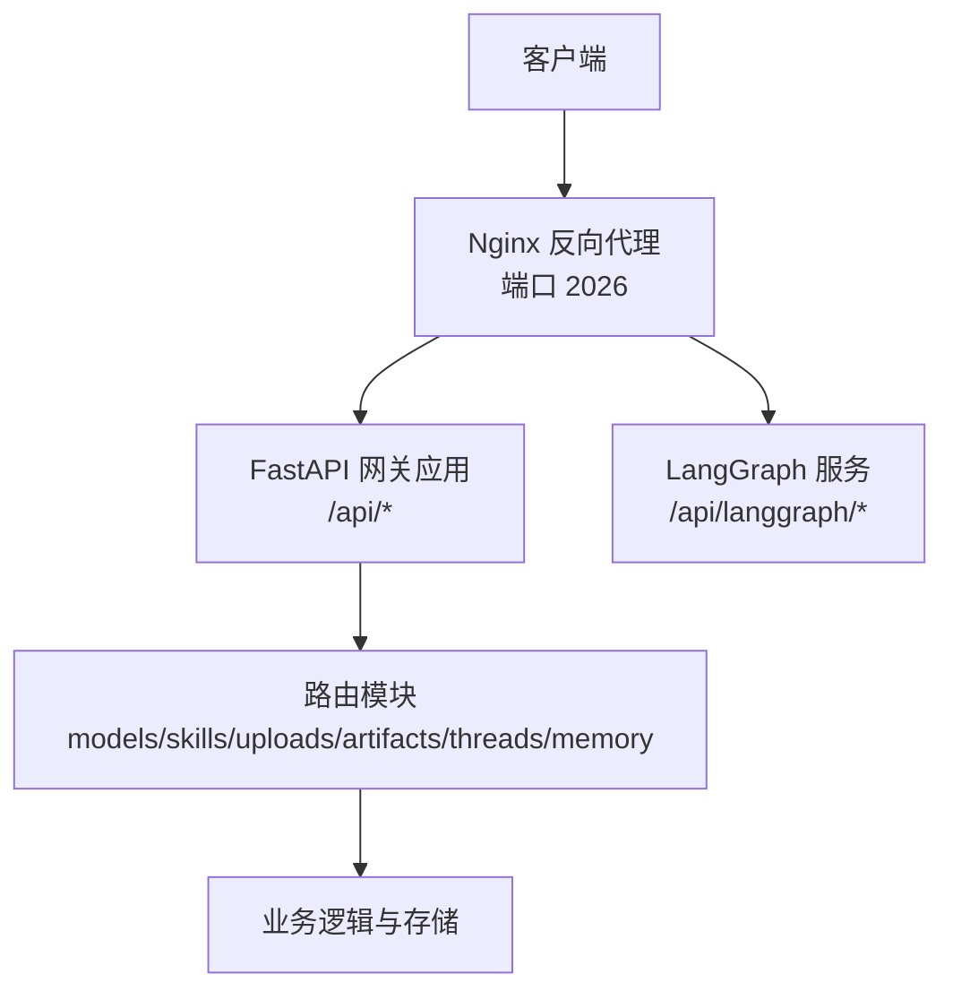
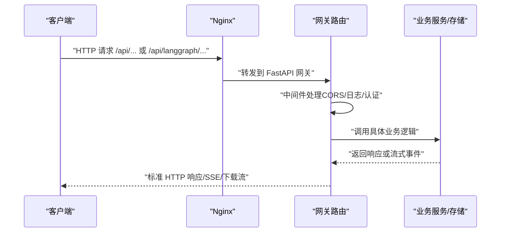
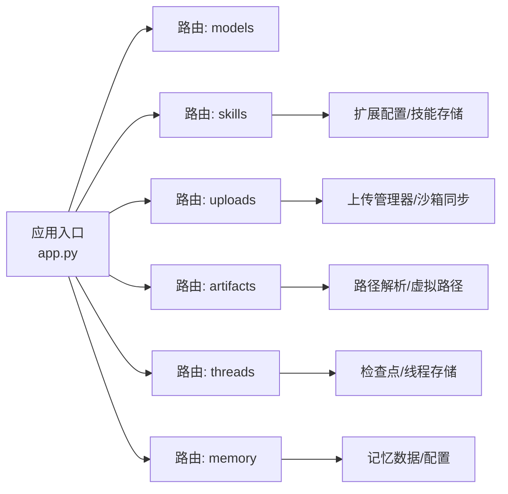

# API 参考

<cite>
**本文引用的文件**
- [API.md](file://backend/docs/API.md)
- [app.py](file://backend/app/gateway/app.py)
- [models.py](file://backend/app/gateway/routers/models.py)
- [skills.py](file://backend/app/gateway/routers/skills.py)
- [uploads.py](file://backend/app/gateway/routers/uploads.py)
- [artifacts.py](file://backend/app/gateway/routers/artifacts.py)
- [threads.py](file://backend/app/gateway/routers/threads.py)
- [memory.py](file://backend/app/gateway/routers/memory.py)
</cite>

## 目录
1. [简介](#简介)
2. [项目结构](#项目结构)
3. [核心组件](#核心组件)
4. [架构总览](#架构总览)
5. [详细组件分析](#详细组件分析)
6. [依赖关系分析](#依赖关系分析)
7. [性能与安全考量](#性能与安全考量)
8. [故障排查指南](#故障排查指南)
9. [结论](#结论)
10. [附录：版本与迁移](#附录版本与迁移)

## 简介
本文件为 DeerFlow 后端 API 的权威参考，覆盖两类主要接口：
- LangGraph API：面向智能体交互、线程与流式输出（/api/langgraph/*）
- 网关 API：模型管理、MCP 配置、技能管理、文件上传与制品下载（/api/*）

所有 API 均通过 Nginx 反向代理在端口 2026 上对外提供服务。当前默认未启用后端认证，生产部署建议配合 Nginx 或自定义中间件进行鉴权与限流。

## 项目结构
- 后端基于 FastAPI 构建，入口应用负责挂载各模块路由并注入中间件。
- 网关路由按功能域划分：models、skills、uploads、artifacts、threads、memory 等。
- LangGraph 请求经由 Nginx 转发至 LangGraph 服务器；网关提供自有业务能力。

图表来源
- [app.py:248-431](file://backend/app/gateway/app.py#L248-L431)

章节来源
- [app.py:248-431](file://backend/app/gateway/app.py#L248-L431)

## 核心组件
- 应用与中间件
  - CORS、日志、认证中间件、CSRF 中间件、生命周期钩子
  - 路由注册：/api/models、/api/skills、/api/threads/{thread_id}/uploads、/api/threads/{thread_id}/artifacts、/api/memory 等
- 路由模块
  - 模型管理：列出可用模型、查询模型详情
  - 技能管理：列出技能、安装/启用/禁用、自定义技能编辑与回滚
  - 文件上传：多文件上传、列表、删除、上传限制查询
  - 制品下载：按路径获取制品，支持强制下载与内容类型判定
  - 线程管理：创建/搜索/读取/状态/历史/清理
  - 内存管理：全局记忆数据的增删改查、导入导出、配置与状态查询

章节来源
- [app.py:353-431](file://backend/app/gateway/app.py#L353-L431)
- [models.py:34-133](file://backend/app/gateway/routers/models.py#L34-L133)
- [skills.py:88-353](file://backend/app/gateway/routers/skills.py#L88-L353)
- [uploads.py:170-343](file://backend/app/gateway/routers/uploads.py#L170-L343)
- [artifacts.py:80-184](file://backend/app/gateway/routers/artifacts.py#L80-L184)
- [threads.py:190-623](file://backend/app/gateway/routers/threads.py#L190-L623)
- [memory.py:110-357](file://backend/app/gateway/routers/memory.py#L110-L357)

## 架构总览
- 认证与授权
  - 默认未启用后端认证；建议通过 Nginx 基础认证或 OAuth，或在网关中集成自定义中间件
  - 部分路由启用了基于线程所有权的权限校验（如上传、制品、线程操作）
- 流式与实时
  - LangGraph 支持 SSE 与 WebSocket 实时流式输出
- 数据与存储
  - 线程本地文件系统与 LangGraph 检查点结合
  - 记忆数据持久化于用户隔离的内存文件
  - 技能与自定义技能内容存储于扩展配置与文件系统

图表来源
- [app.py:337-431](file://backend/app/gateway/app.py#L337-L431)

## 详细组件分析

### LangGraph API
- 基础路径：/api/langgraph
- 特性
  - 兼容 LangGraph SDK 的线程与运行生命周期
  - 支持 SSE 与 WebSocket 实时流式输出
  - 运行配置中的递归限制需显式设置以避免过早中断
- 关键端点
  - 创建线程：POST /api/langgraph/threads
  - 获取线程状态：GET /api/langgraph/threads/{thread_id}/state
  - 创建运行：POST /api/langgraph/threads/{thread_id}/runs
  - 流式运行：POST /api/langgraph/threads/{thread_id}/runs/stream
  - 运行历史：GET /api/langgraph/threads/{thread_id}/runs
- 请求/响应与流式事件
  - 请求体包含输入消息、运行配置（含递归限制）、流式模式
  - 响应为 Server-Sent Events，事件类型包括 values、messages、end 等
- 安全与性能
  - 建议在网关侧统一设置合理的 recursion_limit
  - 生产环境建议开启 Nginx 限流与上游健康检查

章节来源
- [API.md:14-167](file://backend/docs/API.md#L14-L167)

### 网关 API

#### 模型管理
- 基础路径：/api
- 端点
  - GET /api/models：列出所有可用模型（名称、显示名、能力标识）
  - GET /api/models/{model_name}：获取指定模型详情
- 返回字段
  - 名称、显示名、描述、是否支持思考/推理努力等
- 使用建议
  - 前端可据此动态选择模型与展示能力

章节来源
- [models.py:34-133](file://backend/app/gateway/routers/models.py#L34-L133)

#### 技能管理
- 基础路径：/api
- 端点
  - GET /api/skills：列出所有技能（公共/自定义）
  - GET /api/skills/{skill_name}：获取技能详情
  - PUT /api/skills/{skill_name}：更新技能启用状态
  - POST /api/skills/install：从 .skill 归档安装技能
  - GET /api/skills/custom：仅列出自定义技能
  - GET /api/skills/custom/{skill_name}：获取自定义技能内容
  - PUT /api/skills/custom/{skill_name}：编辑自定义技能内容（含安全扫描）
  - DELETE /api/skills/custom/{skill_name}：删除自定义技能
  - GET /api/skills/custom/{skill_name}/history：查看自定义技能历史
  - POST /api/skills/custom/{skill_name}/rollback：回滚到历史快照
- 行为要点
  - 更新启用状态会写入扩展配置并刷新系统提示缓存
  - 自定义技能编辑前进行安全扫描，阻断高风险内容
  - 回滚保留审计记录

章节来源
- [skills.py:88-353](file://backend/app/gateway/routers/skills.py#L88-L353)

#### 文件上传与制品
- 基础路径：/api/threads/{thread_id}
- 上传
  - POST /api/threads/{thread_id}/uploads：多文件上传（multipart/form-data）
  - GET /api/threads/{thread_id}/uploads/limits：查询上传限制
  - GET /api/threads/{thread_id}/uploads/list：列出已上传文件
  - DELETE /api/threads/{thread_id}/uploads/{filename}：删除文件
- 制品
  - GET /api/threads/{thread_id}/artifacts/{path}：按虚拟路径获取制品
  - 查询参数 download 控制是否强制下载
  - 支持从 .skill 归档内提取文件
- 安全与合规
  - 上传路径与文件名规范化，防止路径穿越
  - 文档自动转换为 Markdown 并生成对应制品链接
  - 主动内容（HTML/XHTML/SVG）强制下载，避免脚本执行风险

章节来源
- [uploads.py:170-343](file://backend/app/gateway/routers/uploads.py#L170-L343)
- [artifacts.py:80-184](file://backend/app/gateway/routers/artifacts.py#L80-L184)

#### 线程管理
- 基础路径：/api/threads
- 端点
  - POST /api/threads：创建线程（可选 thread_id 与元数据）
  - POST /api/threads/search：按元数据/状态分页检索
  - PATCH /api/threads/{thread_id}：合并更新元数据
  - GET /api/threads/{thread_id}：读取线程信息与派生状态
  - GET /api/threads/{thread_id}/state：获取最新状态快照
  - POST /api/threads/{thread_id}/state：更新状态（标题重命名/人工介入恢复）
  - POST /api/threads/{thread_id}/history：获取检查点历史
  - DELETE /api/threads/{thread_id}：清理本地线程数据（不删除 LangGraph 线程）
- 权限
  - 多数端点要求线程拥有者身份（owner_check），确保数据隔离
- 错误码
  - 422：线程 ID 无效
  - 500：删除本地线程数据失败（服务端异常）

章节来源
- [threads.py:190-623](file://backend/app/gateway/routers/threads.py#L190-L623)

#### 内存管理
- 基础路径：/api
- 端点
  - GET /api/memory：获取全局记忆数据
  - POST /api/memory/reload：从文件重载内存
  - DELETE /api/memory：清空所有记忆数据
  - POST /api/memory/facts：新增记忆事实
  - DELETE /api/memory/facts/{fact_id}：删除记忆事实
  - PATCH /api/memory/facts/{fact_id}：部分更新记忆事实
  - GET /api/memory/export：导出记忆数据
  - POST /api/memory/import：从 JSON 导入并覆盖
  - GET /api/memory/config：获取记忆系统配置
  - GET /api/memory/status：同时返回配置与数据
- 设计
  - 用户隔离：每个有效用户拥有独立记忆文件
  - 配额与阈值：最大事实数、置信度阈值、注入令牌上限等

章节来源
- [memory.py:110-357](file://backend/app/gateway/routers/memory.py#L110-L357)

### API 规范汇总

- 认证与授权
  - 默认未启用后端认证；建议通过 Nginx 或自定义中间件实现
  - 部分端点启用线程级权限校验（读/写/删）
- 错误响应
  - 统一格式：{"detail": "错误信息"}
  - 常见状态码：400（请求无效）、404（资源不存在）、422（验证失败）、500（内部错误）
- 速率限制
  - 默认未实现；可在 Nginx 层配置限流策略

章节来源
- [API.md:524-567](file://backend/docs/API.md#L524-L567)

## 依赖关系分析

图表来源
- [app.py:353-431](file://backend/app/gateway/app.py#L353-L431)
- [skills.py:1-30](file://backend/app/gateway/routers/skills.py#L1-L30)
- [uploads.py:1-30](file://backend/app/gateway/routers/uploads.py#L1-L30)
- [artifacts.py:1-15](file://backend/app/gateway/routers/artifacts.py#L1-L15)
- [threads.py:1-32](file://backend/app/gateway/routers/threads.py#L1-L32)
- [memory.py:1-17](file://backend/app/gateway/routers/memory.py#L1-L17)

## 性能与安全考量
- 性能
  - 上传采用分块写入与累计大小控制，避免单次请求过大
  - 制品下载根据 MIME 类型与内容特征决定内联/下载，减少不必要的解码
  - 记忆数据支持去抖与阈值过滤，降低注入开销
- 安全
  - 上传路径规范化与白名单校验，防止路径穿越
  - 自定义技能编辑前进行安全扫描，阻断高危内容
  - 主动内容（HTML/XHTML/SVG）强制下载，避免 XSS 风险
  - 线程状态序列化确保消息对象安全传输
- 可靠性
  - LangGraph 运行需合理设置 recursion_limit，避免计划模式/子代理深度导致的过早中断
  - 线程清理为尽力而为，失败时记录日志但不暴露敏感细节

[本节为通用指导，无需特定文件来源]

## 故障排查指南
- 上传失败
  - 检查文件数量/大小/总量限制
  - 确认目标路径与文件名合法
  - 查看服务端日志定位具体异常
- 制品无法打开
  - 尝试添加 ?download=true 强制下载
  - 确认 MIME 类型与内容特征（主动内容始终下载）
- 线程清理报错
  - 422：线程 ID 无效
  - 500：本地线程数据删除失败（服务端异常）
- 记忆操作异常
  - 确认事实内容非空且置信度在 [0,1] 区间
  - 导入/导出 JSON 结构需符合 MemoryResponse 模型

章节来源
- [uploads.py:170-343](file://backend/app/gateway/routers/uploads.py#L170-L343)
- [artifacts.py:80-184](file://backend/app/gateway/routers/artifacts.py#L80-L184)
- [threads.py:190-221](file://backend/app/gateway/routers/threads.py#L190-L221)
- [memory.py:192-259](file://backend/app/gateway/routers/memory.py#L192-L259)

## 结论
DeerFlow 的 API 体系围绕 LangGraph 与自有网关能力构建，既满足智能体交互的实时性需求，又提供了完善的模型、技能、文件与记忆管理能力。生产部署建议强化鉴权与限流，并根据业务场景调整上传与运行配置，以获得更稳定与安全的服务体验。

[本节为总结，无需特定文件来源]

## 附录：版本与迁移
- 版本
  - 网关应用版本号：0.1.0
- 迁移建议
  - LangGraph 运行的 recursion_limit 默认较低，直接调用 /api/langgraph/* 时请显式设置
  - 从无认证升级到带认证时，注意线程孤儿迁移与权限校验生效顺序
  - 技能启用状态变更会刷新系统提示缓存，请在灰度发布后确认提示一致性

章节来源
- [app.py:278-280](file://backend/app/gateway/app.py#L278-L280)
- [API.md:652-656](file://backend/docs/API.md#L652-L656)