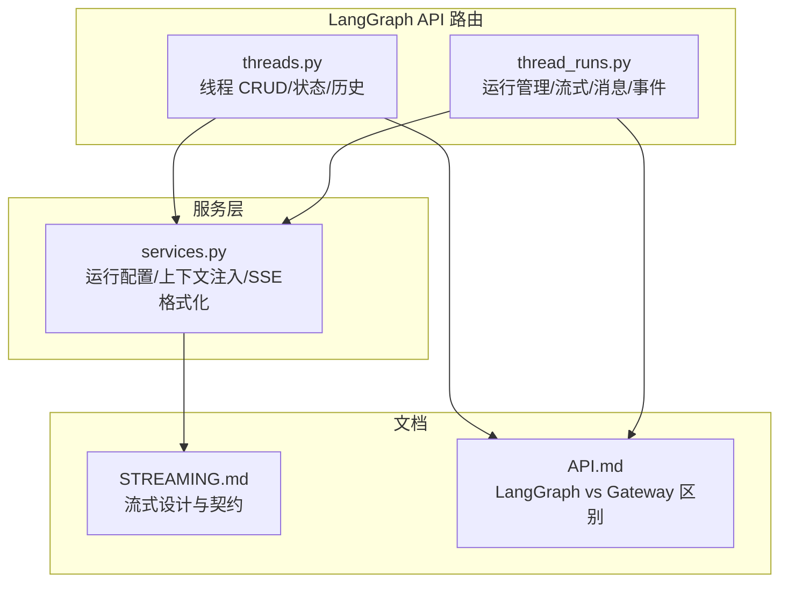
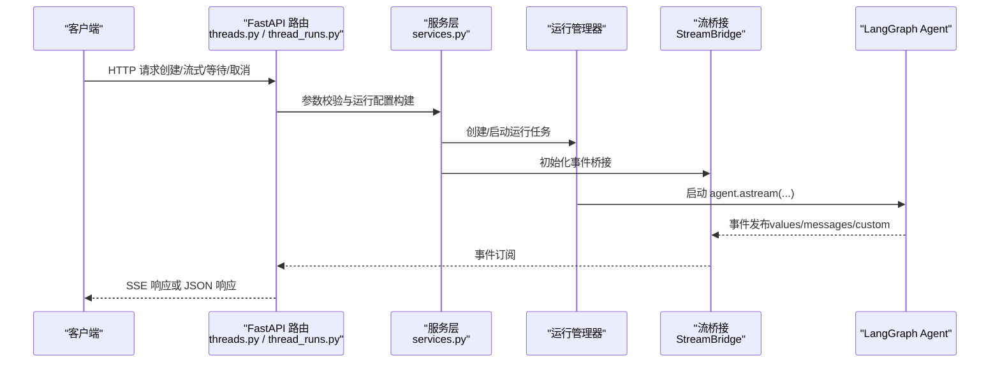
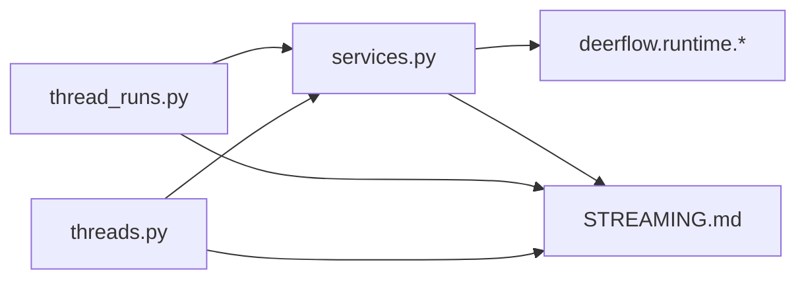

# LangGraph API

<cite>
**本文引用的文件**
- [threads.py](file://backend/app/gateway/routers/threads.py)
- [thread_runs.py](file://backend/app/gateway/routers/thread_runs.py)
- [services.py](file://backend/app/gateway/services.py)
- [STREAMING.md](file://backend/docs/STREAMING.md)
- [API.md](file://backend/docs/API.md)
</cite>

## 目录
1. [简介](#简介)
2. [项目结构](#项目结构)
3. [核心组件](#核心组件)
4. [架构总览](#架构总览)
5. [详细组件分析](#详细组件分析)
6. [依赖分析](#依赖分析)
7. [性能考量](#性能考量)
8. [故障排查指南](#故障排查指南)
9. [结论](#结论)
10. [附录](#附录)

## 简介
本文件为 LangGraph API 的权威参考，覆盖代理交互接口的完整规范，包括线程管理（创建、获取状态、搜索、补丁、删除）、运行管理（创建运行、等待完成、取消、加入流、获取运行历史、消息与事件列表、令牌用量统计）以及流式传输（SSE）规范。重点说明递归限制配置、流式模式兼容性、配置选项（model_name、thinking_enabled、is_plan_mode、reasoning_effort、subagent_enabled、max_concurrent_subagents、agent_name、is_bootstrap）等关键参数，并提供 Python LangGraph SDK、JavaScript EventSource、cURL 的使用示例。同时解释与 Gateway API 的区别及直接调用 LangGraph API 的注意事项。

## 项目结构
LangGraph API 位于后端网关路由模块中，核心文件如下：
- 线程相关路由：backend/app/gateway/routers/threads.py
- 运行相关路由：backend/app/gateway/routers/thread_runs.py
- 运行生命周期与 SSE 格式化：backend/app/gateway/services.py
- 流式传输设计说明：backend/docs/STREAMING.md
- API 参考与差异说明：backend/docs/API.md

**图表来源**
- [threads.py:1-623](file://backend/app/gateway/routers/threads.py#L1-L623)
- [thread_runs.py:1-457](file://backend/app/gateway/routers/thread_runs.py#L1-L457)
- [services.py:1-369](file://backend/app/gateway/services.py#L1-L369)
- [STREAMING.md:1-352](file://backend/docs/STREAMING.md#L1-L352)
- [API.md:1-656](file://backend/docs/API.md#L1-L656)

**章节来源**
- [threads.py:1-623](file://backend/app/gateway/routers/threads.py#L1-L623)
- [thread_runs.py:1-457](file://backend/app/gateway/routers/thread_runs.py#L1-L457)
- [services.py:1-369](file://backend/app/gateway/services.py#L1-L369)
- [STREAMING.md:1-352](file://backend/docs/STREAMING.md#L1-L352)
- [API.md:1-656](file://backend/docs/API.md#L1-L656)

## 核心组件
- 线程管理端点：创建线程、搜索线程、补丁元数据、获取线程详情、获取线程状态、更新线程状态、获取历史、删除本地线程数据。
- 运行管理端点：创建运行、流式运行、等待完成、列出运行、获取运行详情、取消运行、加入现有运行流、获取线程消息、获取运行消息、获取运行事件、线程令牌用量统计。
- 服务层能力：运行配置构建（含递归限制、可配置键白名单、上下文注入）、SSE 帧格式化、输入标准化（LangGraph 平台输入到 LangChain 状态字典）、运行生命周期编排。

**章节来源**
- [threads.py:190-623](file://backend/app/gateway/routers/threads.py#L190-L623)
- [thread_runs.py:116-457](file://backend/app/gateway/routers/thread_runs.py#L116-L457)
- [services.py:171-369](file://backend/app/gateway/services.py#L171-L369)

## 架构总览
LangGraph API 的端到端调用链如下：

**图表来源**
- [thread_runs.py:116-149](file://backend/app/gateway/routers/thread_runs.py#L116-L149)
- [services.py:247-334](file://backend/app/gateway/services.py#L247-L334)
- [STREAMING.md:104-145](file://backend/docs/STREAMING.md#L104-L145)

**章节来源**
- [thread_runs.py:116-297](file://backend/app/gateway/routers/thread_runs.py#L116-L297)
- [services.py:247-369](file://backend/app/gateway/services.py#L247-L369)
- [STREAMING.md:104-145](file://backend/docs/STREAMING.md#L104-L145)

## 详细组件分析

### 线程管理（Threads）
- 端点概览
  - POST /api/threads：创建线程（可选 thread_id，关联 assistant_id，初始 metadata）
  - GET /api/threads/search：按 metadata/status 分页搜索线程
  - PATCH /api/threads/{thread_id}：合并更新线程元数据
  - GET /api/threads/{thread_id}：获取线程信息（状态、时间戳、metadata、当前通道值）
  - GET /api/threads/{thread_id}/state：获取线程最新状态快照（values、next、metadata、checkpoint 信息）
  - POST /api/threads/{thread_id}/state：更新线程状态（合并通道值、可选从指定 checkpoint 分支）
  - POST /api/threads/{thread_id}/history：获取检查点历史（分页 before、limit）
  - DELETE /api/threads/{thread_id}：删除本地线程目录数据（文件系统清理）

- 关键行为
  - 空检查点写入：创建线程时写入空检查点以确保状态端点可用
  - 状态推导：从检查点派生线程状态（idle/interrupted/error）
  - 通道值序列化：状态返回中的通道值通过 serialize_channel_values 转为 JSON 安全格式
  - 保留元数据键过滤：禁止客户端设置 server-controlled 键（如 owner_id、user_id）

- 请求/响应模型
  - ThreadCreateRequest：thread_id（可选）、assistant_id（可选）、metadata
  - ThreadSearchRequest：metadata（精确匹配）、limit、offset、status
  - ThreadPatchRequest：metadata（合并）
  - ThreadStateUpdateRequest：values（合并）、checkpoint_id（可选）、checkpoint（可选）、as_node（可选）
  - ThreadStateResponse：values、next、metadata、checkpoint、checkpoint_id、parent_checkpoint_id、created_at、tasks
  - ThreadResponse：thread_id、status、created_at、updated_at、metadata、values、interrupts
  - HistoryEntry：checkpoint_id、parent_checkpoint_id、metadata、values、created_at、next

- 权限控制
  - 读取类端点要求 threads.read
  - 写入类端点要求 threads.write（部分端点还要求 owner_check）
  - 删除端点要求 threads.delete（且需存在线程）

- 示例
  - 创建线程：POST /api/threads，Body 包含 metadata
  - 获取状态：GET /api/threads/{thread_id}/state
  - 更新状态：POST /api/threads/{thread_id}/state，Body 包含 values 或 checkpoint_id
  - 获取历史：POST /api/threads/{thread_id}/history，Body 包含 limit、before
  - 删除本地数据：DELETE /api/threads/{thread_id}

**章节来源**
- [threads.py:190-623](file://backend/app/gateway/routers/threads.py#L190-L623)

### 运行管理（Runs）
- 端点概览
  - POST /api/threads/{thread_id}/runs：创建后台运行（立即返回）
  - POST /api/threads/{thread_id}/runs/stream：创建运行并以 SSE 实时流式返回
  - POST /api/threads/{thread_id}/runs/wait：创建运行并阻塞直到完成，返回最终状态
  - GET /api/threads/{thread_id}/runs：列出线程的所有运行
  - GET /api/threads/{thread_id}/runs/{run_id}：获取特定运行详情
  - POST /api/threads/{thread_id}/runs/{run_id}/cancel：取消运行（interrupt/rollback），可选择等待完成
  - GET /api/threads/{thread_id}/runs/{run_id}/join：加入现有运行的 SSE 流
  - GET /api/threads/{thread_id}/runs/{run_id}/stream：加入现有运行的 SSE 流（兼容 LangGraph SDK 停止按钮）
  - GET /api/threads/{thread_id}/messages：获取线程所有显示消息（带反馈）
  - GET /api/threads/{thread_id}/runs/{run_id}/messages：获取运行消息（分页）
  - GET /api/threads/{thread_id}/runs/{run_id}/events：获取运行事件（调试/审计）
  - GET /api/threads/{thread_id}/token-usage：聚合线程令牌用量

- 关键行为
  - SSE 帧格式：事件名 + JSON 数据 + 可选事件 ID，与 LangGraph 平台协议对齐
  - 断连语义：on_disconnect 支持 cancel（断连即取消）或 continue（继续运行）
  - 流式模式：支持 values、messages-tuple、custom、updates、events、debug、tasks、checkpoints 等
  - 输入标准化：LangGraph 平台输入格式转换为 LangChain 状态字典（messages 角色映射）
  - 运行配置：递归限制、可配置键白名单（model_name、thinking_enabled、is_plan_mode、reasoning_effort、subagent_enabled、max_concurrent_subagents、agent_name、is_bootstrap）注入到 configurable/context
  - 等待完成：阻塞直到任务完成，返回最终通道值（序列化）

- 请求/响应模型
  - RunCreateRequest：assistant_id、input、command、metadata、config、context（DeerFlow 上下文覆盖）、webhook、checkpoint_id、checkpoint、interrupt_before/after、stream_mode、stream_subgraphs、stream_resumable、on_disconnect、on_completion、multitask_strategy、after_seconds、if_not_exists、feedback_keys
  - RunResponse：run_id、thread_id、assistant_id、status、metadata、kwargs、multitask_strategy、created_at、updated_at
  - ThreadTokenUsageResponse：thread_id、total_tokens、total_input_tokens、total_output_tokens、total_runs、by_model、by_caller

- 示例
  - 创建运行：POST /api/threads/{thread_id}/runs，Body 包含 input、config（含 recursion_limit、configurable）、stream_mode
  - 流式运行：POST /api/threads/{thread_id}/runs/stream，返回 SSE
  - 等待完成：POST /api/threads/{thread_id}/runs/wait，返回最终状态
  - 取消运行：POST /api/threads/{thread_id}/runs/{run_id}/cancel，action=interrupt/rollback，wait=true/false
  - 加入流：GET /api/threads/{thread_id}/runs/{run_id}/join 或 /api/threads/{thread_id}/runs/{run_id}/stream

**章节来源**
- [thread_runs.py:116-457](file://backend/app/gateway/routers/thread_runs.py#L116-L457)
- [services.py:38-155](file://backend/app/gateway/services.py#L38-L155)

### 流式传输（SSE）规范
- 协议与兼容性
  - SSE 帧字段顺序：event、data、id（可选），以空行结尾
  - 与 LangGraph 平台协议对齐，React SDK 的 useStream 与 Python langgraph-sdk 的 SSE 解码器可直接使用
  - Content-Location 头用于指向运行资源 URL，便于 SDK 提取运行元数据

- 心跳与结束
  - 心跳帧：": heartbeat" 空行
  - 结束帧：event=end，data=null

- 断连恢复
  - Last-Event-ID 请求头用于断连重连
  - on_disconnect=cancel 时断连即取消后台任务；continue 时继续运行但丢弃事件

- 流式模式兼容性
  - values：节点级状态快照
  - messages-tuple：LLM token 级增量（与 LangGraph graph 层 messages 模式一一对应）
  - custom：应用自定义事件
  - 其他：updates、events、debug、tasks、checkpoints 等

- 递归限制
  - /api/langgraph/* 直连 LangGraph 服务器，继承 LangGraph 默认递归限制（通常较低），建议显式设置 config.recursion_limit（例如 100）

**章节来源**
- [services.py:43-56](file://backend/app/gateway/services.py#L43-L56)
- [services.py:337-369](file://backend/app/gateway/services.py#L337-L369)
- [STREAMING.md:49-99](file://backend/docs/STREAMING.md#L49-L99)
- [API.md:104-124](file://backend/docs/API.md#L104-L124)

### 配置选项与上下文注入
- 白名单键（context/configurable）：model_name、mode、thinking_enabled、reasoning_effort、is_plan_mode、subagent_enabled、max_concurrent_subagents、agent_name、is_bootstrap
- 注入位置：同时写入 configurable 与 context，兼容旧版与新版 LangGraph 运行时
- 用户上下文：将认证用户 ID 注入 runtime context，保障后台工具持久化用户相关文件

**章节来源**
- [services.py:107-137](file://backend/app/gateway/services.py#L107-L137)
- [services.py:139-155](file://backend/app/gateway/services.py#L139-L155)

## 依赖分析
- 路由到服务层
  - thread_runs.py 依赖 services.start_run、services.sse_consumer、services.format_sse、services.build_run_config、services.merge_run_context_overrides、services.inject_authenticated_user_context
  - threads.py 依赖 checkpointer、serialize_channel_values、authz 权限装饰器
- 服务层到运行时
  - services.py 依赖 deerflow.runtime.RunManager、StreamBridge、run_agent、serialize_channel_values
- 文档支撑
  - STREAMING.md 提供流式路径设计与契约说明
  - API.md 提供 LangGraph 与 Gateway 的差异说明

**图表来源**
- [thread_runs.py:1-457](file://backend/app/gateway/routers/thread_runs.py#L1-L457)
- [threads.py:1-623](file://backend/app/gateway/routers/threads.py#L1-L623)
- [services.py:1-369](file://backend/app/gateway/services.py#L1-L369)
- [STREAMING.md:1-352](file://backend/docs/STREAMING.md#L1-L352)

**章节来源**
- [thread_runs.py:1-457](file://backend/app/gateway/routers/thread_runs.py#L1-L457)
- [threads.py:1-623](file://backend/app/gateway/routers/threads.py#L1-L623)
- [services.py:1-369](file://backend/app/gateway/services.py#L1-L369)
- [STREAMING.md:1-352](file://backend/docs/STREAMING.md#L1-L352)

## 性能考量
- 递归限制：LangGraph 默认递归限制较低，Plan 模式或子代理密集场景建议显式设置 recursion_limit（例如 100）
- 流式模式选择：仅订阅必要的 stream_mode，避免不必要的事件负载
- 断连策略：生产环境建议使用 on_disconnect=cancel 降低资源占用
- 并发策略：multitask_strategy 控制并发运行的拒绝/回滚/中断/排队行为，结合业务需求选择

**章节来源**
- [services.py:192-239](file://backend/app/gateway/services.py#L192-L239)
- [thread_runs.py:53-56](file://backend/app/gateway/routers/thread_runs.py#L53-L56)

## 故障排查指南
- 404 未找到：线程不存在或运行不存在
- 409 冲突：运行并发策略冲突（如已有运行）
- 501 不支持：并发策略不受支持
- 500 服务器错误：检查后端日志，关注 run_agent、checkpointer、serialize_channel_values 等关键路径
- 断连问题：确认 Last-Event-ID 头、on_disconnect 设置、Nginx/反向代理的 SSE 缓冲配置
- 递归错误：检查 recursion_limit 是否过低，必要时在 config 中提升

**章节来源**
- [thread_runs.py:198-233](file://backend/app/gateway/routers/thread_runs.py#L198-L233)
- [services.py:279-282](file://backend/app/gateway/services.py#L279-L282)

## 结论
LangGraph API 提供与 LangGraph 平台兼容的代理交互能力，覆盖线程与运行的全生命周期管理，并通过 SSE 提供实时事件流。通过合理的递归限制、流式模式选择与上下文配置，可在 Plan 模式与子代理场景下稳定运行。与 Gateway API 的差异在于：LangGraph API 直连 LangGraph 服务器，继承其默认行为（如递归限制），而 Gateway API 提供更丰富的平台特性（如令牌用量、消息与事件审计、工件与上传等）。生产部署建议结合 Nginx 进行认证与限流，并根据业务场景调整并发与断连策略。

## 附录

### 端点一览与规范

- 线程管理
  - POST /api/threads
    - 请求体：ThreadCreateRequest
    - 响应：ThreadResponse
  - GET /api/threads/search
    - 请求体：ThreadSearchRequest
    - 响应：列表 of ThreadResponse
  - PATCH /api/threads/{thread_id}
    - 请求体：ThreadPatchRequest
    - 响应：ThreadResponse
  - GET /api/threads/{thread_id}
    - 响应：ThreadResponse
  - GET /api/threads/{thread_id}/state
    - 响应：ThreadStateResponse
  - POST /api/threads/{thread_id}/state
    - 请求体：ThreadStateUpdateRequest
    - 响应：ThreadStateResponse
  - POST /api/threads/{thread_id}/history
    - 请求体：ThreadHistoryRequest
    - 响应：列表 of HistoryEntry
  - DELETE /api/threads/{thread_id}
    - 响应：ThreadDeleteResponse

- 运行管理
  - POST /api/threads/{thread_id}/runs
    - 请求体：RunCreateRequest
    - 响应：RunResponse
  - POST /api/threads/{thread_id}/runs/stream
    - 请求体：RunCreateRequest
    - 响应：StreamingResponse（SSE）
  - POST /api/threads/{thread_id}/runs/wait
    - 请求体：RunCreateRequest
    - 响应：最终状态（序列化后的通道值）
  - GET /api/threads/{thread_id}/runs
    - 响应：列表 of RunResponse
  - GET /api/threads/{thread_id}/runs/{run_id}
    - 响应：RunResponse
  - POST /api/threads/{thread_id}/runs/{run_id}/cancel
    - 查询参数：action（interrupt/rollback）、wait（true/false）
    - 响应：202/204
  - GET /api/threads/{thread_id}/runs/{run_id}/join
    - 响应：StreamingResponse（SSE）
  - GET /api/threads/{thread_id}/runs/{run_id}/stream
    - 查询参数：action（可选）、wait（0/1）
    - 响应：StreamingResponse（SSE）
  - GET /api/threads/{thread_id}/messages
    - 响应：列表 of 消息（带反馈）
  - GET /api/threads/{thread_id}/runs/{run_id}/messages
    - 查询参数：limit、before_seq、after_seq
    - 响应：{ data: [...], has_more: bool }
  - GET /api/threads/{thread_id}/runs/{run_id}/events
    - 查询参数：event_types（逗号分隔）、limit
    - 响应：列表 of 事件
  - GET /api/threads/{thread_id}/token-usage
    - 响应：ThreadTokenUsageResponse

**章节来源**
- [threads.py:190-623](file://backend/app/gateway/routers/threads.py#L190-L623)
- [thread_runs.py:116-457](file://backend/app/gateway/routers/thread_runs.py#L116-L457)

### 使用示例

- Python LangGraph SDK
  - 客户端初始化与线程创建、运行流式交互
  - 参考：[API.md:582-601](file://backend/docs/API.md#L582-L601)

- JavaScript EventSource
  - 浏览器端 SSE 订阅
  - 参考：[API.md:603-618](file://backend/docs/API.md#L603-L618)

- cURL
  - 列表模型、获取 MCP 配置、上传文件、启用技能、创建线程与运行
  - 参考：[API.md:620-650](file://backend/docs/API.md#L620-L650)

**章节来源**
- [API.md:582-650](file://backend/docs/API.md#L582-L650)

### 与 Gateway API 的区别
- 基础路径
  - LangGraph API：/api/langgraph（直连 LangGraph 服务器）
  - Gateway API：/api（平台能力集合）
- 能力范围
  - LangGraph API：线程、运行、流式（SSE）
  - Gateway API：模型、MCP、技能、上传、工件、内存、反馈、角色扮演评估等
- 递归限制
  - LangGraph API 直连 LangGraph，默认递归限制较低，需显式设置 recursion_limit
  - Gateway API 默认递归限制较高（100），适合 Plan 模式与子代理场景

**章节来源**
- [API.md:14-16](file://backend/docs/API.md#L14-L16)
- [API.md:652-656](file://backend/docs/API.md#L652-L656)