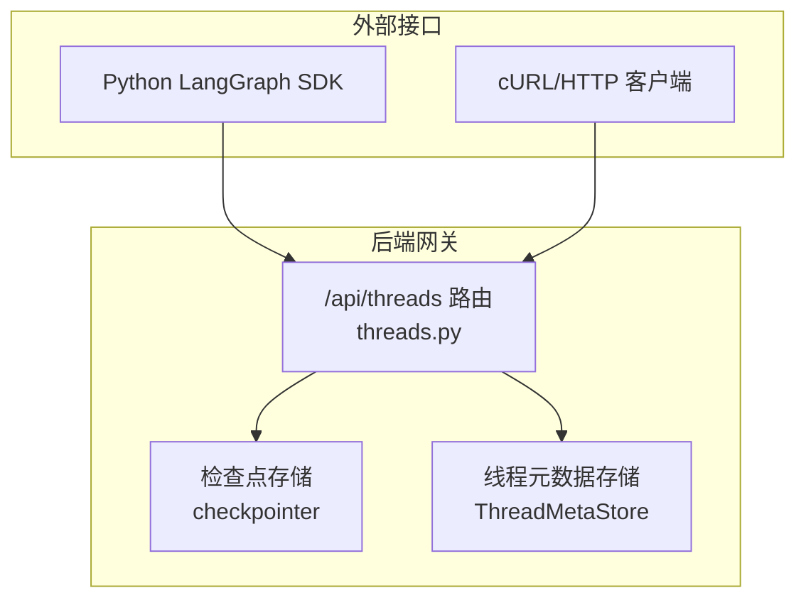
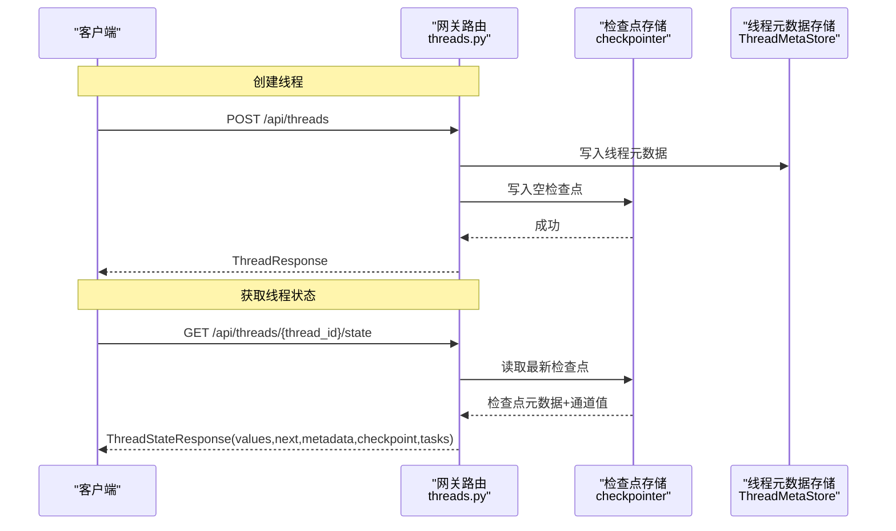
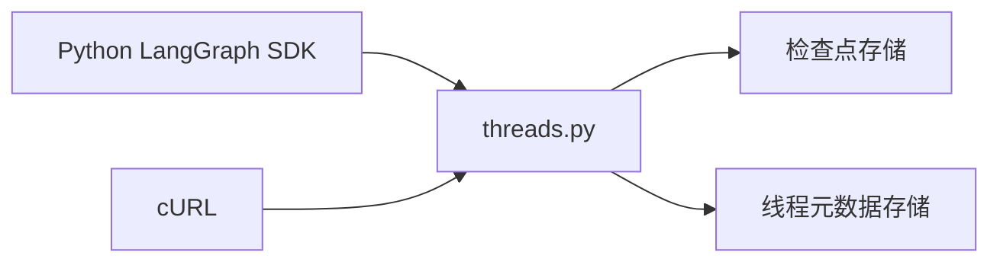

# 线程管理

<cite>
**本文引用的文件**
- [threads.py](file://backend/app/gateway/routers/threads.py)
- [API.md](file://backend/docs/API.md)
- [client.py](file://backend/packages/harness/deerflow/client.py)
</cite>

## 目录
1. [简介](#简介)
2. [项目结构](#项目结构)
3. [核心组件](#核心组件)
4. [架构总览](#架构总览)
5. [详细组件分析](#详细组件分析)
6. [依赖分析](#依赖分析)
7. [性能考虑](#性能考虑)
8. [故障排查指南](#故障排查指南)
9. [结论](#结论)
10. [附录](#附录)

## 简介
本文件面向 LangGraph 线程管理能力，提供完整的 API 规范与使用说明，重点覆盖以下内容：
- 线程创建：Create Thread 端点的请求体与响应体字段说明，含 metadata 的安全处理策略
- 线程状态获取：Get Thread State 端点返回的 values、next、metadata、checkpoint、tasks 等字段含义
- 使用示例：Python LangGraph SDK 与 cURL 的典型调用方式
- 数据结构与生命周期：线程状态的数据模型、字段语义与最佳实践

## 项目结构
线程管理相关的核心实现位于后端网关路由模块，配套有官方 API 文档与 Python 客户端 SDK 示例。

图表来源
- [threads.py:224-286](file://backend/app/gateway/routers/threads.py#L224-L286)
- [threads.py:410-458](file://backend/app/gateway/routers/threads.py#L410-L458)

章节来源
- [threads.py:1-623](file://backend/app/gateway/routers/threads.py#L1-L623)
- [API.md:20-64](file://backend/docs/API.md#L20-L64)

## 核心组件
- Create Thread 端点：创建线程并写入空检查点，确保状态查询可用；同时写入线程元数据以便被搜索接口识别
- Get Thread State 端点：返回当前线程状态快照，序列化通道值，包含 values、next、metadata、checkpoint、tasks 等
- 模型与校验：请求/响应模型定义了字段约束与安全过滤（如保留服务器控制的 metadata 键）

章节来源
- [threads.py:63-122](file://backend/app/gateway/routers/threads.py#L63-L122)
- [threads.py:224-286](file://backend/app/gateway/routers/threads.py#L224-L286)
- [threads.py:410-458](file://backend/app/gateway/routers/threads.py#L410-L458)

## 架构总览
线程管理通过 FastAPI 路由暴露，内部依赖检查点存储与线程元数据存储，确保状态可检索、可回溯。

图表来源
- [threads.py:224-286](file://backend/app/gateway/routers/threads.py#L224-L286)
- [threads.py:410-458](file://backend/app/gateway/routers/threads.py#L410-L458)

## 详细组件分析

### Create Thread 端点
- 功能概述
  - 支持显式 thread_id 或自动生成
  - 写入线程元数据记录，使线程出现在搜索结果中
  - 写入空检查点，保证后续状态查询可用
  - 幂等：若 thread_id 已存在则返回现有记录
- 请求体
  - thread_id: 可选；未提供时自动生成
  - assistant_id: 可选；关联助手
  - metadata: 初始元数据；服务端会移除保留键（如 owner_id、user_id）
- 响应体
  - thread_id: 线程唯一标识
  - created_at/updated_at: ISO 时间戳
  - metadata: 合并后的元数据
  - values: 当前通道值（序列化后的 JSON 安全格式）
  - status: 线程状态（idle/busy/interrupted/error）
  - interrupts: 待处理中断
- 安全与合规
  - 通过字段验证器剥离服务器保留的元数据键，防止客户端伪造
- 典型使用
  - Python SDK：通过 LangGraph SDK 的 client.threads.create() 发起
  - cURL：向 /api/threads 发送 JSON 请求体

章节来源
- [threads.py:75-82](file://backend/app/gateway/routers/threads.py#L75-L82)
- [threads.py:63-73](file://backend/app/gateway/routers/threads.py#L63-L73)
- [threads.py:224-286](file://backend/app/gateway/routers/threads.py#L224-L286)
- [API.md:22-43](file://backend/docs/API.md#L22-L43)

### Get Thread State 端点
- 功能概述
  - 返回线程最新状态快照
  - 序列化通道值，确保 LangChain 消息对象转为 JSON 安全字典
- 响应体字段
  - values: 当前通道值映射
    - 包含 messages、sandbox、artifacts、thread_data、title 等键
  - next: 下一步待执行任务名称列表
  - metadata: 检查点元数据
  - checkpoint: 检查点信息（包含 id 与时间戳）
  - checkpoint_id/parent_checkpoint_id: 当前与父级检查点 ID
  - created_at: 检查点创建时间
  - tasks: 中断任务详情（含 id 与 name）
- 数据来源
  - 从检查点存储读取最新检查点，提取通道值与元数据
  - 对通道值进行序列化，保证前端/SDK 可消费

章节来源
- [threads.py:94-105](file://backend/app/gateway/routers/threads.py#L94-L105)
- [threads.py:410-458](file://backend/app/gateway/routers/threads.py#L410-L458)
- [API.md:45-64](file://backend/docs/API.md#L45-L64)

### Get Thread 端点（补充）
- 功能概述
  - 获取线程基本信息与状态推导
  - 若线程仅存在于检查点而不存在于元数据存储，则从检查点元数据合成最小记录
- 响应体字段
  - thread_id/status/created_at/updated_at/metadata/values/interrupts
- 状态推导
  - 根据检查点中的 pending_writes、tasks 等推导状态（idle/error/interrupted）

章节来源
- [threads.py:351-405](file://backend/app/gateway/routers/threads.py#L351-L405)

### Patch Thread 端点（补充）
- 功能概述
  - 合并更新线程元数据
  - 通过字段验证器剥离服务器保留键
- 响应体字段
  - 合并后的线程信息（包含最新 updated_at）

章节来源
- [threads.py:107-113](file://backend/app/gateway/routers/threads.py#L107-L113)
- [threads.py:322-348](file://backend/app/gateway/routers/threads.py#L322-L348)

### Search Threads 端点（补充）
- 功能概述
  - 支持按 metadata、status、分页参数过滤与查询
- 响应体字段
  - 列表项包含 thread_id/status/created_at/updated_at/metadata/values/interrupts

章节来源
- [threads.py:85-92](file://backend/app/gateway/routers/threads.py#L85-L92)
- [threads.py:289-319](file://backend/app/gateway/routers/threads.py#L289-L319)

### Update Thread State 端点（补充）
- 功能概述
  - 用于人类在环恢复或标题重命名等场景
  - 合并通道值并写入新检查点，必要时同步标题到元数据存储
- 请求体字段
  - values: 需要合并的通道值
  - checkpoint_id: 可选；指定分支来源检查点
  - as_node: 可选；标记来源节点，用于记录 step/source/writes
- 响应体字段
  - values/next/metadata/checkpoint_id/created_at

章节来源
- [threads.py:115-122](file://backend/app/gateway/routers/threads.py#L115-L122)
- [threads.py:461-548](file://backend/app/gateway/routers/threads.py#L461-L548)

### Get Thread History 端点（补充）
- 功能概述
  - 获取检查点历史，序列化通道值
  - 仅最新检查点携带 messages，避免重复
- 响应体字段
  - 列表项包含 checkpoint_id/parent_checkpoint_id/metadata/values/created_at/next

章节来源
- [threads.py:124-140](file://backend/app/gateway/routers/threads.py#L124-L140)
- [threads.py:551-622](file://backend/app/gateway/routers/threads.py#L551-L622)

## 依赖分析
- 组件耦合
  - 路由层依赖检查点存储与线程元数据存储
  - 安全策略通过模型字段验证器集中处理
- 外部依赖
  - LangGraph SDK 作为客户端对接 /api/langgraph/* 接口
  - Nginx 作为反向代理统一入口

图表来源
- [threads.py:224-286](file://backend/app/gateway/routers/threads.py#L224-L286)
- [threads.py:410-458](file://backend/app/gateway/routers/threads.py#L410-L458)

章节来源
- [threads.py:13-31](file://backend/app/gateway/routers/threads.py#L13-L31)

## 性能考虑
- 检查点读写
  - 状态查询与更新均基于检查点存储，建议选择高性能后端（如 SQLite/PostgreSQL）
- 序列化开销
  - 通道值序列化为 JSON 安全格式，注意消息对象数量与大小
- 分页与限制
  - 搜索与历史查询支持 limit/offset/cursor，合理设置避免一次性拉取过多数据

## 故障排查指南
- 404 未找到
  - 线程不存在或检查点为空；确认 thread_id 正确且已创建
- 500 服务器错误
  - 检查点写入失败或元数据存储异常；查看服务端日志定位具体原因
- 元数据键冲突
  - 客户端传入服务器保留键会被自动剥离；请勿依赖反射服务器控制的键
- 权限问题
  - 需要具备 threads.read/threads.write/threads.delete 权限；确保鉴权中间件配置正确

章节来源
- [threads.py:224-286](file://backend/app/gateway/routers/threads.py#L224-L286)
- [threads.py:410-458](file://backend/app/gateway/routers/threads.py#L410-L458)
- [API.md:524-539](file://backend/docs/API.md#L524-L539)

## 结论
本文档系统性梳理了 LangGraph 线程管理的创建与状态查询能力，明确了请求/响应字段、安全策略与最佳实践。结合 Python SDK 与 cURL 示例，可快速完成线程生命周期管理与状态观测。

## 附录

### API 规范速查

- Create Thread
  - 方法与路径：POST /api/threads
  - 请求体字段：thread_id（可选）、assistant_id（可选）、metadata（初始元数据）
  - 响应体字段：thread_id、created_at、updated_at、metadata、values、status、interrupts
  - 安全要点：metadata 中服务器保留键将被剥离
  - 示例参考：[API.md:22-43](file://backend/docs/API.md#L22-L43)

- Get Thread State
  - 方法与路径：GET /api/threads/{thread_id}/state
  - 响应体字段：values（包含 messages、sandbox、artifacts、thread_data、title）、next、metadata、checkpoint、checkpoint_id、parent_checkpoint_id、created_at、tasks
  - 示例参考：[API.md:45-64](file://backend/docs/API.md#L45-L64)

- 使用示例

  - Python LangGraph SDK
    - 创建线程与运行：参考 [API.md:582-601](file://backend/docs/API.md#L582-L601)
    - 客户端直接访问：参考 [client.py:443-483](file://backend/packages/harness/deerflow/client.py#L443-L483)

  - cURL
    - 创建线程：参考 [API.md:636-639](file://backend/docs/API.md#L636-L639)
    - 运行代理：参考 [API.md:641-649](file://backend/docs/API.md#L641-L649)

- 线程状态数据结构说明
  - values
    - messages：对话消息数组
    - sandbox：沙箱上下文
    - artifacts：生成产物列表
    - thread_data：线程附加数据
    - title：线程标题
  - next：待执行任务名称列表
  - metadata：检查点元数据（不含服务器保留键）
  - checkpoint：包含 id 与时间戳
  - checkpoint_id/parent_checkpoint_id：当前与父级检查点 ID
  - created_at：检查点创建时间
  - tasks：中断任务详情（id/name）

- 生命周期最佳实践
  - 创建线程即写入空检查点，确保后续状态查询可用
  - 更新状态时明确 as_node 与 step/source/writes，便于审计
  - 同步标题到元数据存储，保证搜索接口即时可见
  - 合理设置 recursion_limit，避免计划模式或子代理深度导致的递归错误