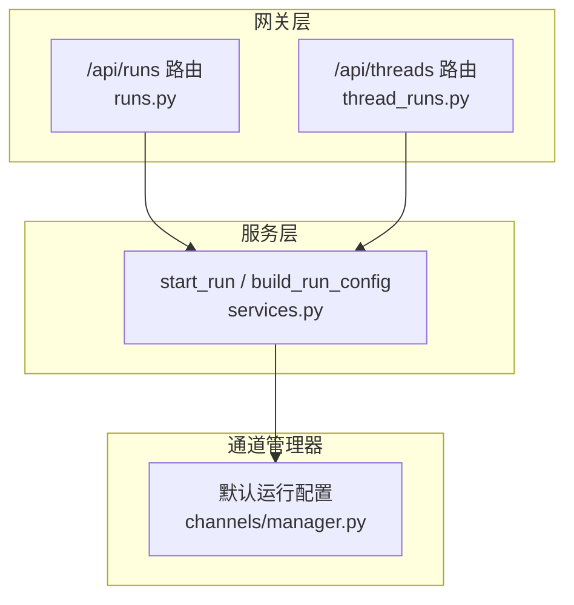
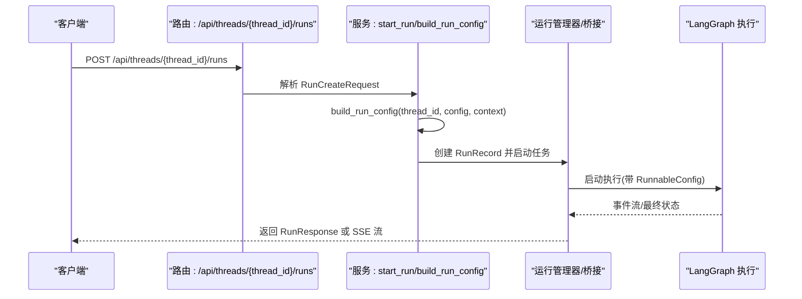
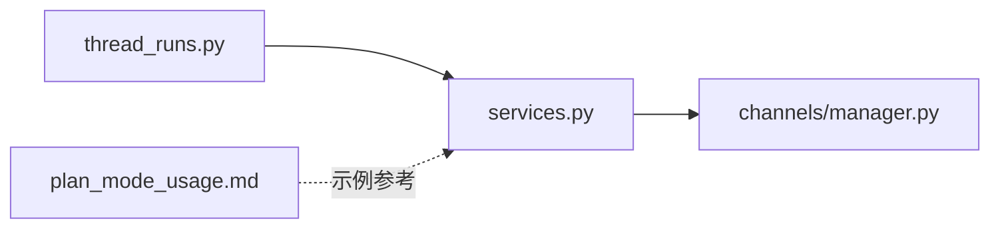

# 创建运行

<cite>
**本文引用的文件**
- [backend/app/gateway/routers/runs.py](file://backend/app/gateway/routers/runs.py)
- [backend/app/gateway/routers/thread_runs.py](file://backend/app/gateway/routers/thread_runs.py)
- [backend/app/gateway/services.py](file://backend/app/gateway/services.py)
- [backend/app/channels/manager.py](file://backend/app/channels/manager.py)
- [backend/docs/plan_mode_usage.md](file://backend/docs/plan_mode_usage.md)
- [skills/public/claude-to-deerflow/scripts/chat.sh](file://skills/public/claude-to-deerflow/scripts/chat.sh)
</cite>

## 目录
1. [简介](#简介)
2. [项目结构](#项目结构)
3. [核心组件](#核心组件)
4. [架构总览](#架构总览)
5. [详细组件分析](#详细组件分析)
6. [依赖分析](#依赖分析)
7. [性能考虑](#性能考虑)
8. [故障排查指南](#故障排查指南)
9. [结论](#结论)
10. [附录](#附录)

## 简介
本文件面向“创建运行”（Create Run）功能，提供完整的 API 规范与使用说明，覆盖以下要点：
- 请求体结构：input.messages、config.recursion_limit、config.configurable.model_name、thinking_enabled、is_plan_mode、stream_mode
- 响应格式：流式返回（SSE）与等待完成返回（最终状态）
- 递归限制配置的重要性：LangGraph 默认递归限制为 25；计划模式或子代理密集型运行建议提升至 100
- configurable 选项的作用与配置方法：如何通过 configurable 或 context 注入运行时参数
- 使用示例：如何正确配置各项参数以获得最佳效果

## 项目结构
“创建运行”相关能力由后端网关层路由与服务层共同实现，并在通道管理器中提供默认运行配置。

图表来源
- [backend/app/gateway/routers/runs.py:35-89](file://backend/app/gateway/routers/runs.py#L35-L89)
- [backend/app/gateway/routers/thread_runs.py:116-176](file://backend/app/gateway/routers/thread_runs.py#L116-L176)
- [backend/app/gateway/services.py:180-239](file://backend/app/gateway/services.py#L180-L239)
- [backend/app/channels/manager.py:31](file://backend/app/channels/manager.py#L31)

章节来源
- [backend/app/gateway/routers/runs.py:1-144](file://backend/app/gateway/routers/runs.py#L1-L144)
- [backend/app/gateway/routers/thread_runs.py:1-457](file://backend/app/gateway/routers/thread_runs.py#L1-L457)
- [backend/app/gateway/services.py:180-369](file://backend/app/gateway/services.py#L180-L369)
- [backend/app/channels/manager.py:25-224](file://backend/app/channels/manager.py#L25-L224)

## 核心组件
- 请求模型 RunCreateRequest：定义了创建运行所需的输入字段，包括 assistant_id、input、command、metadata、config、context、webhook、checkpoint、中断控制、流模式等。
- 运行生命周期服务：start_run 负责创建 RunRecord 并启动后台任务；build_run_config 负责合并客户端传入的配置与默认配置，注入 thread_id、agent_name、递归限制等。
- 默认运行配置：通道管理器提供默认运行配置，包含递归限制、思维模式开关、计划模式开关等。

章节来源
- [backend/app/gateway/routers/thread_runs.py:36-56](file://backend/app/gateway/routers/thread_runs.py#L36-L56)
- [backend/app/gateway/services.py:247-334](file://backend/app/gateway/services.py#L247-L334)
- [backend/app/channels/manager.py:31-36](file://backend/app/channels/manager.py#L31-L36)

## 架构总览
下图展示了从 HTTP 请求到运行执行的关键路径，以及关键配置注入点。

图表来源
- [backend/app/gateway/routers/thread_runs.py:116-176](file://backend/app/gateway/routers/thread_runs.py#L116-L176)
- [backend/app/gateway/services.py:247-334](file://backend/app/gateway/services.py#L247-L334)

## 详细组件分析

### 请求体结构与字段说明
- assistant_id：可选，指定使用的智能体/助手名称。若非默认值，将在运行时注入 agent_name。
- input：可选，图输入对象，通常包含 messages 数组。
- command：可选，LangGraph 命令对象。
- metadata：可选，运行元数据。
- config：可选，RunnableConfig 覆盖项。支持两种运行时参数容器：
  - configurable：传统方式，用于传递 thread_id、model_name、thinking_enabled、is_plan_mode、recursion_limit 等。
  - context：LangGraph >= 0.6.0 推荐方式，承载线程级数据。若同时存在 configurable 与 context，系统优先 context。
- context：DeerFlow 自定义扩展，承载 model_name、thinking_enabled、is_plan_mode 等运行时上下文参数。
- webhook：可选，完成后回调地址。
- checkpoint/checkpoint_id：可选，断点恢复相关。
- interrupt_before/interrupt_after：可选，节点级中断控制。
- stream_mode：可选，流模式列表或字符串，如 messages、values、events 等。
- stream_subgraphs：可选，是否包含子图事件。
- stream_resumable/on_disconnect/on_completion：可选，SSE 可恢复模式与断开行为策略。
- multitask_strategy：并发策略。
- after_seconds：延迟执行秒数。
- if_not_exists：线程不存在时的行为策略。
- feedback_keys：LangSmith 反馈键列表。

章节来源
- [backend/app/gateway/routers/thread_runs.py:36-56](file://backend/app/gateway/routers/thread_runs.py#L36-L56)

### 响应格式
- 成功创建运行：返回 RunResponse，包含 run_id、thread_id、assistant_id、status、metadata、kwargs、multitask_strategy、created_at、updated_at。
- 等待完成返回：runs/wait 在完成后返回最终状态序列化结果；若无法获取最终状态，则返回包含 status 与 error 的字典。
- 流式返回（SSE）：/api/threads/{thread_id}/runs/stream 返回 text/event-stream，包含事件类型与数据，客户端可使用 LangGraph SDK 的 useStream 钩子消费。

章节来源
- [backend/app/gateway/routers/thread_runs.py:59-69](file://backend/app/gateway/routers/thread_runs.py#L59-L69)
- [backend/app/gateway/routers/thread_runs.py:116-176](file://backend/app/gateway/routers/thread_runs.py#L116-L176)
- [backend/app/gateway/routers/runs.py:35-89](file://backend/app/gateway/routers/runs.py#L35-L89)

### 递归限制配置（重要性与默认值）
- LangGraph 默认递归限制为 25。当运行涉及计划模式（TodoList）或子代理密集型场景时，建议提升至 100，以避免因递归深度不足导致的截断或提前终止。
- 默认运行配置中，递归限制被设置为 100；服务层在构建运行配置时会保留该默认值，除非客户端显式覆盖。
- configurable 与 context 中均可传入 recursion_limit，后者在 LangGraph >= 0.6.0 的兼容层中优先处理。

章节来源
- [backend/app/channels/manager.py:31](file://backend/app/channels/manager.py#L31)
- [backend/app/gateway/services.py:191-239](file://backend/app/gateway/services.py#L191-L239)

### configurable 选项的作用与配置方法
- configurable 是 LangGraph 的标准运行时参数容器，常用于传递 thread_id、model_name、thinking_enabled、is_plan_mode、recursion_limit 等。
- context 是 DeerFlow 对 LangGraph 兼容层的扩展，用于承载线程级数据。若客户端已提供 context，系统将优先采用 context，不再额外生成 configurable。
- 当 assistant_id 非默认值时，系统会在运行时注入 agent_name，确保自定义智能体正确加载。

章节来源
- [backend/app/gateway/services.py:180-239](file://backend/app/gateway/services.py#L180-L239)

### 思维模式与计划模式
- thinking_enabled：控制是否启用推理/思考模式（例如去除<think>标签、提取 reasoning_content 等）。
- is_plan_mode：控制是否启用计划模式（TodoList 中间件），用于复杂多步骤任务的分解与跟踪。
- 默认运行上下文包含 thinking_enabled=True、is_plan_mode=False、subagent_enabled=False。可通过 configurable 或 context 动态覆盖。

章节来源
- [backend/app/channels/manager.py:32-36](file://backend/app/channels/manager.py#L32-L36)
- [backend/docs/plan_mode_usage.md:162-171](file://backend/docs/plan_mode_usage.md#L162-L171)

### 流模式（stream_mode）
- 支持多种流模式，如 messages、values、events 等。前端工具链会对不支持的模式进行过滤与告警。
- 服务层会规范化 stream_mode 参数为列表形式，确保后续执行稳定。

章节来源
- [backend/app/gateway/services.py:63-67](file://backend/app/gateway/services.py#L63-L67)

### 端点与工作流
- /api/threads/{thread_id}/runs：创建后台运行并立即返回 RunResponse。
- /api/threads/{thread_id}/runs/stream：创建运行并以 SSE 流返回事件。
- /api/threads/{thread_id}/runs/wait：创建运行并阻塞直到完成，返回最终状态。
- /api/runs/stream：无预存 thread_id 时自动创建临时线程，其余行为与上述一致。

章节来源
- [backend/app/gateway/routers/thread_runs.py:116-176](file://backend/app/gateway/routers/thread_runs.py#L116-L176)
- [backend/app/gateway/routers/runs.py:35-89](file://backend/app/gateway/routers/runs.py#L35-L89)

## 依赖分析
- 路由层依赖服务层的 start_run 与配置构建逻辑。
- 服务层依赖通道管理器提供的默认运行配置与上下文合并逻辑。
- 计划模式文档提供了 is_plan_mode 的使用示例与实现细节，便于正确启用 TodoList 中间件。

图表来源
- [backend/app/gateway/routers/thread_runs.py:116-176](file://backend/app/gateway/routers/thread_runs.py#L116-L176)
- [backend/app/gateway/services.py:247-334](file://backend/app/gateway/services.py#L247-L334)
- [backend/app/channels/manager.py:31](file://backend/app/channels/manager.py#L31)
- [backend/docs/plan_mode_usage.md:162-171](file://backend/docs/plan_mode_usage.md#L162-L171)

章节来源
- [backend/app/gateway/routers/thread_runs.py:116-176](file://backend/app/gateway/routers/thread_runs.py#L116-L176)
- [backend/app/gateway/services.py:247-334](file://backend/app/gateway/services.py#L247-L334)
- [backend/app/channels/manager.py:31](file://backend/app/channels/manager.py#L31)
- [backend/docs/plan_mode_usage.md:162-171](file://backend/docs/plan_mode_usage.md#L162-L171)

## 性能考虑
- 递归限制：在复杂计划模式或子代理密集型场景中，适当提高 recursion_limit 可减少因深度限制导致的重试与失败，但需关注资源占用。
- 流模式选择：根据前端渲染与调试需求选择合适流模式，避免不必要的事件传输造成带宽浪费。
- 断开行为：合理配置 on_disconnect（cancel/continue）以平衡资源占用与用户体验。

## 故障排查指南
- 409 冲突：当前线程正在运行其他请求，稍后再试。
- 501 不支持策略：并发策略不受支持。
- 最终状态为空：等待完成接口在无法获取最终状态时会回退返回 status 与 error 字段，可用于定位问题。
- 计划模式未生效：确认 is_plan_mode 已通过 configurable 或 context 正确传入，并检查中间件链顺序。

章节来源
- [backend/app/gateway/routers/thread_runs.py:178-234](file://backend/app/gateway/routers/thread_runs.py#L178-L234)
- [backend/app/gateway/routers/thread_runs.py:152-176](file://backend/app/gateway/routers/thread_runs.py#L152-L176)

## 结论
“创建运行”API 提供了灵活的运行时配置能力，支持通过 configurable/context 注入模型名、思维模式、计划模式与递归限制等关键参数。针对计划模式与子代理密集型场景，建议将递归限制提升至 100 以确保稳定性。结合合理的流模式与断开行为策略，可在保证性能的同时提供良好的用户体验。

## 附录

### 使用示例与最佳实践
- 基础消息对话
  - 在 input 中提供 messages 数组，config 中通过 configurable 指定 thread_id。
  - 若需自定义模型，可在 configurable 中设置 model_name。
- 启用思维模式
  - 将 thinking_enabled 设为 true，以便去除<think>标签并提取 reasoning_content。
- 启用计划模式
  - 将 is_plan_mode 设为 true，系统将注入 TodoList 中间件，适合复杂多步骤任务。
- 提高递归限制
  - 在 config 中设置 recursion_limit=100，适用于计划模式或子代理密集型运行。
- 流式输出
  - 设置 stream_mode 为 ["messages"] 或 ["values"]，前端可用 LangGraph SDK 的 useStream 钩子消费事件流。
- 完整示例参考
  - Claude-to-DeerFlow 脚本展示了如何在不同模式（flash/standard/pro/ultra）下组合 thinking_enabled、is_plan_mode、subagent_enabled 与 thread_id。

章节来源
- [skills/public/claude-to-deerflow/scripts/chat.sh:48-65](file://skills/public/claude-to-deerflow/scripts/chat.sh#L48-L65)
- [backend/docs/plan_mode_usage.md:162-171](file://backend/docs/plan_mode_usage.md#L162-L171)