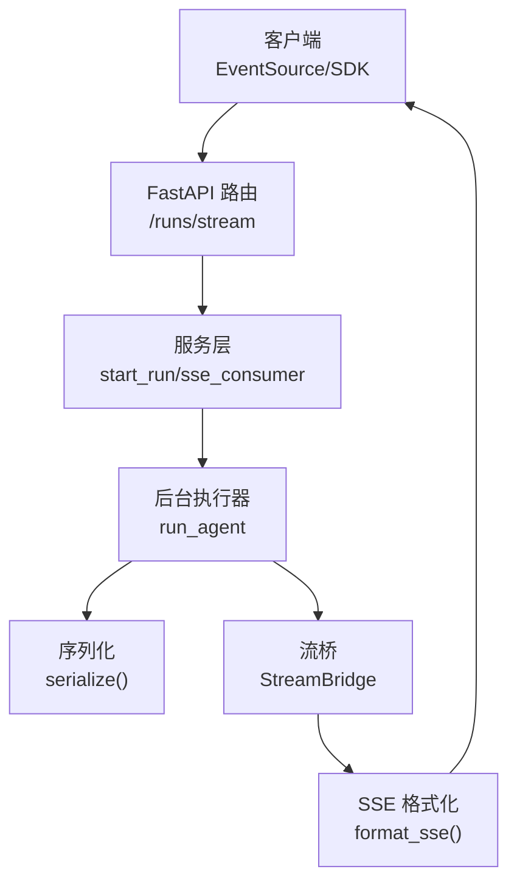
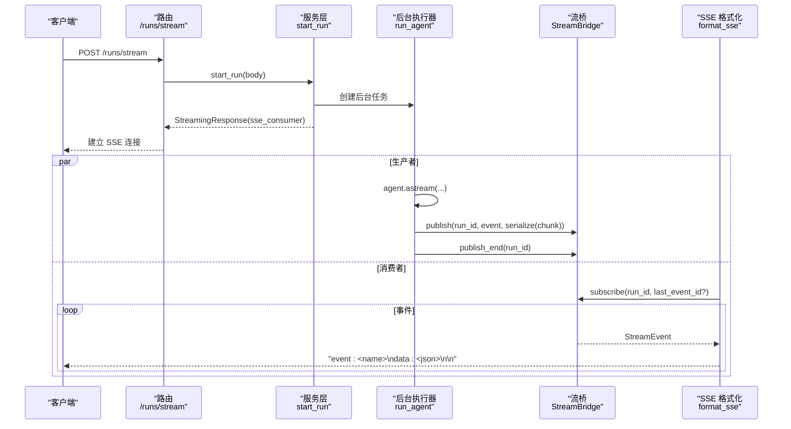
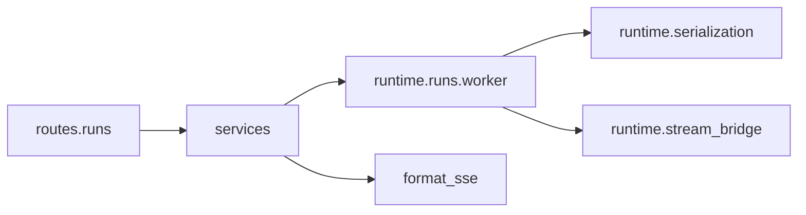

# 流式运行

<cite>
**本文引用的文件**
- [STREAMING.md](file://backend/docs/STREAMING.md)
- [runs.py](file://backend/app/gateway/routers/runs.py)
- [services.py](file://backend/app/gateway/services.py)
- [worker.py](file://backend/packages/harness/deerflow/runtime/runs/worker.py)
- [serialization.py](file://backend/packages/harness/deerflow/runtime/serialization.py)
- [base.py](file://backend/packages/harness/deerflow/runtime/stream_bridge/base.py)
- [__init__.py](file://backend/packages/harness/deerflow/runtime/stream_bridge/__init__.py)
- [test_sse_format.py](file://backend/tests/test_sse_format.py)
- [stream-mode.ts](file://frontend/src/core/api/stream-mode.ts)
</cite>

## 目录
1. [简介](#简介)
2. [项目结构](#项目结构)
3. [核心组件](#核心组件)
4. [架构总览](#架构总览)
5. [详细组件分析](#详细组件分析)
6. [依赖分析](#依赖分析)
7. [性能考量](#性能考量)
8. [故障排查指南](#故障排查指南)
9. [结论](#结论)
10. [附录](#附录)

## 简介
本文件面向“流式运行”能力，聚焦于 Server-Sent Events（SSE）端点 /runs/stream 的完整 API 规范与实现细节，涵盖：
- 请求体结构与 Create Run 相同
- 流式响应格式与事件类型
- values 与 messages 事件的用途与差异
- end 事件作为流结束信号
- JavaScript EventSource 使用示例与 Python 异步客户端实现思路
- 流式传输的优势与适用场景

## 项目结构
围绕流式运行的关键模块分布如下：
- 路由层：FastAPI 路由 /runs/stream，负责接收请求并返回 StreamingResponse
- 服务层：启动 run、构建 agent 配置、创建后台任务、封装 SSE 输出
- 运行时：后台 agent 执行器，将 LangGraph 事件序列化并通过 StreamBridge 推送
- 序列化：统一将 LangChain/LangGraph 对象转为可传输的 JSON 结构
- 流桥：抽象的异步事件桥接，解耦生产者与消费者，支持 Last-Event-ID 重连与心跳

图示来源
- [runs.py:35-57](file://backend/app/gateway/routers/runs.py#L35-L57)
- [services.py:247-334](file://backend/app/gateway/services.py#L247-L334)
- [worker.py:120-376](file://backend/packages/harness/deerflow/runtime/runs/worker.py#L120-L376)
- [serialization.py:67-79](file://backend/packages/harness/deerflow/runtime/serialization.py#L67-L79)
- [base.py:37-71](file://backend/packages/harness/deerflow/runtime/stream_bridge/base.py#L37-L71)

章节来源
- [runs.py:1-144](file://backend/app/gateway/routers/runs.py#L1-L144)
- [services.py:1-369](file://backend/app/gateway/services.py#L1-L369)
- [worker.py:1-649](file://backend/packages/harness/deerflow/runtime/runs/worker.py#L1-L649)
- [serialization.py:1-79](file://backend/packages/harness/deerflow/runtime/serialization.py#L1-L79)
- [base.py:1-72](file://backend/packages/harness/deerflow/runtime/stream_bridge/base.py#L1-L72)

## 核心组件
- /runs/stream 端点：接收与 Create Run 相同的请求体，启动 run 并以 text/event-stream 返回事件流
- run_agent：后台任务，调用 LangGraph agent.astream，将事件序列化并通过 StreamBridge 发布
- StreamBridge：抽象事件桥，支持 publish/publish_end/subscribe，内置心跳与结束哨兵
- sse_consumer：从 StreamBridge 订阅事件，格式化为 SSE 帧并输出
- format_sse：标准化 SSE 帧字段顺序与格式，确保与 LangGraph SDK 兼容
- serialize：按模式将 LangChain/LangGraph 对象序列化为 JSON

章节来源
- [runs.py:35-57](file://backend/app/gateway/routers/runs.py#L35-L57)
- [services.py:337-364](file://backend/app/gateway/services.py#L337-L364)
- [worker.py:120-376](file://backend/packages/harness/deerflow/runtime/runs/worker.py#L120-L376)
- [base.py:16-71](file://backend/packages/harness/deerflow/runtime/stream_bridge/base.py#L16-L71)
- [services.py:43-56](file://backend/app/gateway/services.py#L43-L56)
- [serialization.py:67-79](file://backend/packages/harness/deerflow/runtime/serialization.py#L67-L79)

## 架构总览
下面的时序图展示了从客户端发起请求到收到 SSE 事件的完整链路。

图示来源
- [runs.py:35-57](file://backend/app/gateway/routers/runs.py#L35-L57)
- [services.py:247-334](file://backend/app/gateway/services.py#L247-L334)
- [services.py:337-364](file://backend/app/gateway/services.py#L337-L364)
- [worker.py:120-376](file://backend/packages/harness/deerflow/runtime/runs/worker.py#L120-L376)
- [base.py:48-61](file://backend/packages/harness/deerflow/runtime/stream_bridge/base.py#L48-L61)

## 详细组件分析

### /runs/stream 端点规范
- 方法与路径：POST /api/runs/stream
- 请求体：与 Create Run 相同，支持 input、config、metadata、stream_mode、stream_subgraphs、interrupt_before、interrupt_after、on_disconnect、multitask_strategy、context 等字段
- 响应：StreamingResponse，媒体类型 text/event-stream，设置缓存控制与连接保持头部
- 行为：解析 thread_id（若未提供则自动生成），启动 run，返回 SSE 流

章节来源
- [runs.py:35-57](file://backend/app/gateway/routers/runs.py#L35-L57)

### 服务层：start_run 与 sse_consumer
- start_run
  - 解析 on_disconnect、multitask_strategy、metadata
  - 构建 run 配置（含 context/configurable 合并）
  - 创建后台任务 run_agent，并将 RunRecord 注入响应
- sse_consumer
  - 读取 Last-Event-ID 头以支持断连重连
  - 从 StreamBridge 订阅事件，遇到心跳哨兵输出占位帧，遇到结束哨兵输出 end 事件并终止
  - 将事件通过 format_sse 格式化为标准 SSE 帧

章节来源
- [services.py:247-334](file://backend/app/gateway/services.py#L247-L334)
- [services.py:337-364](file://backend/app/gateway/services.py#L337-L364)

### 后台执行器：run_agent
- 功能：在后台任务中运行 agent.astream，将事件发布到 StreamBridge
- 模式映射
  - messages-tuple → LangGraph messages 模式
  - events 模式在网关路径不支持，记录日志并跳过
  - 其他模式按 LangGraph 支持列表透传
- 事件发布
  - metadata：包含 run_id、thread_id
  - error：异常信息以 {message,name} 结构发送
  - end：通过 publish_end 通知消费者流结束
- 日志：针对 messages/values/updates/tasks 等模式输出调试日志

章节来源
- [worker.py:120-376](file://backend/packages/harness/deerflow/runtime/runs/worker.py#L120-L376)

### 序列化：serialize
- messages 模式：将 (chunk, metadata) 元组序列化为 [chunk_dict, metadata_dict]
- values 模式：过滤 LangGraph 内部键，保留对外可见字段
- 其他模式：递归调用 model_dump()/dict() 或字符串化

章节来源
- [serialization.py:67-79](file://backend/packages/harness/deerflow/runtime/serialization.py#L67-L79)

### 流桥：StreamBridge 抽象
- 事件模型：StreamEvent(id,event,data)
- 核心方法：publish/publish_end/subscribe/cleanup/close
- 特性：心跳哨兵（HEARTBEAT_SENTINEL）、结束哨兵（END_SENTINEL）、Last-Event-ID 支持、多订阅者扇出

章节来源
- [base.py:16-71](file://backend/packages/harness/deerflow/runtime/stream_bridge/base.py#L16-L71)
- [__init__.py:1-21](file://backend/packages/harness/deerflow/runtime/stream_bridge/__init__.py#L1-L21)

### SSE 帧格式与事件类型
- format_sse：按 event/data/id 顺序输出，结尾双换行
- 事件类型
  - metadata：包含 run_id、thread_id
  - messages-tuple：messages 模式下的增量 token 事件
  - values：values 模式下的完整状态快照
  - updates：节点执行步骤事件
  - events：不支持（网关路径）
  - error：异常信息 {message,name}
  - end：结束事件，data 为 null
- Last-Event-ID：客户端断连重连时携带，服务端据此恢复订阅

章节来源
- [services.py:43-56](file://backend/app/gateway/services.py#L43-L56)
- [worker.py:492-501](file://backend/packages/harness/deerflow/runtime/runs/worker.py#L492-L501)
- [test_sse_format.py:12-30](file://backend/tests/test_sse_format.py#L12-L30)

### 前端支持：useStream 与模式集合
- 前端支持的 run stream 模式集合包含 values/messages/messages-tuple/updates/events/debug/tasks/checkpoints/custom
- 未支持模式会被丢弃并告警

章节来源
- [stream-mode.ts:1-69](file://frontend/src/core/api/stream-mode.ts#L1-L69)

## 依赖分析
- 路由依赖服务层，服务层依赖运行时与流桥，运行时依赖序列化与 LangGraph
- SSE 帧格式与 LangGraph SDK 兼容，便于跨语言客户端消费

图示来源
- [runs.py:19-21](file://backend/app/gateway/routers/runs.py#L19-L21)
- [services.py:20-33](file://backend/app/gateway/services.py#L20-L33)
- [worker.py:32-36](file://backend/packages/harness/deerflow/runtime/runs/worker.py#L32-L36)
- [serialization.py:1-10](file://backend/packages/harness/deerflow/runtime/serialization.py#L1-L10)
- [base.py:1-14](file://backend/packages/harness/deerflow/runtime/stream_bridge/base.py#L1-L14)

章节来源
- [runs.py:1-144](file://backend/app/gateway/routers/runs.py#L1-L144)
- [services.py:1-369](file://backend/app/gateway/services.py#L1-L369)
- [worker.py:1-649](file://backend/packages/harness/deerflow/runtime/runs/worker.py#L1-L649)
- [serialization.py:1-79](file://backend/packages/harness/deerflow/runtime/serialization.py#L1-L79)
- [base.py:1-72](file://backend/packages/harness/deerflow/runtime/stream_bridge/base.py#L1-L72)

## 性能考量
- 事件粒度
  - messages 模式为 token 级增量，适合实时渲染与低延迟展示
  - values 模式为节点级快照，适合最终态或断点恢复
- 序列化成本
  - serialize 对 LangChain/LangGraph 对象进行递归序列化，避免大对象频繁拷贝
- 并发与资源
  - StreamBridge 通过队列与心跳哨兵保障断连恢复与资源释放
  - run_agent 在 finally 中优先发布 end 事件，确保前端及时感知结束

## 故障排查指南
- 端点返回空或立即结束
  - 检查请求体是否包含必要的 input、config、metadata
  - 确认 stream_mode 是否包含 "messages"（messages-tuple 仅用于平台兼容层）
- 事件缺失或乱序
  - 核对 Last-Event-ID 是否正确传递
  - 检查 run_agent 是否正确发布 metadata/metadata/end
- 异常处理
  - error 事件包含 message 与 name 字段，前端可据此提示
  - 服务端在 finally 中保证 end 事件发出，避免前端悬挂
- 单元测试参考
  - SSE 帧格式测试覆盖 end 事件 data 为 null、metadata 事件包含 run_id、error 事件格式

章节来源
- [services.py:337-364](file://backend/app/gateway/services.py#L337-L364)
- [worker.py:348-364](file://backend/packages/harness/deerflow/runtime/runs/worker.py#L348-L364)
- [test_sse_format.py:12-30](file://backend/tests/test_sse_format.py#L12-L30)

## 结论
流式运行通过 SSE 将 LangGraph 的事件实时推送给前端与 SDK 客户端，结合 values 与 messages 两种事件类型，既满足最终态一致性，又提供低延迟的增量展示。通过 StreamBridge 解耦生产者与消费者，配合 format_sse 的标准帧格式，实现了跨语言、跨平台的稳定传输。

## 附录

### API 规范摘要
- 端点：POST /api/runs/stream
- 请求体：与 Create Run 相同，额外支持 stream_mode、stream_subgraphs、interrupt_before、interrupt_after、on_disconnect、multitask_strategy、context
- 响应：text/event-stream，事件类型包括 metadata、messages-tuple、values、updates、error、end
- 事件格式：每条事件为标准 SSE 帧，字段顺序为 event、data、id（可选）

章节来源
- [runs.py:35-57](file://backend/app/gateway/routers/runs.py#L35-L57)
- [services.py:43-56](file://backend/app/gateway/services.py#L43-L56)
- [worker.py:492-501](file://backend/packages/harness/deerflow/runtime/runs/worker.py#L492-L501)

### 事件类型与用途
- metadata：首次发布，包含 run_id、thread_id
- messages-tuple：token 级增量，适合实时渲染
- values：节点级状态快照，适合最终态或断点恢复
- updates：节点执行步骤，便于可观测性
- error：异常信息，包含 message 与 name
- end：流结束，data 为 null

章节来源
- [services.py:43-56](file://backend/app/gateway/services.py#L43-L56)
- [worker.py:492-501](file://backend/packages/harness/deerflow/runtime/runs/worker.py#L492-L501)
- [test_sse_format.py:12-30](file://backend/tests/test_sse_format.py#L12-L30)

### JavaScript EventSource 使用示例
- 基本用法
  - 创建 EventSource 实例，指向 /api/runs/stream
  - 监听 message 事件，解析 data 字段为 JSON
  - 监听 error 事件，处理异常
  - 监听 end 事件，停止渲染
- 断连重连
  - 通过 Last-Event-ID 头实现断点续拉
  - 服务端通过 HEARTBEAT_SENTINEL 保持连接活性

章节来源
- [services.py:337-364](file://backend/app/gateway/services.py#L337-L364)
- [base.py:33-34](file://backend/packages/harness/deerflow/runtime/stream_bridge/base.py#L33-L34)

### Python 异步客户端实现要点
- 使用 aiohttp 或 httpx 发起 POST 请求至 /api/runs/stream
- 以流式方式读取 text/event-stream
- 解析 event 与 data 字段，根据事件类型更新 UI 或状态
- 注意 messages-tuple 与 values 的去重与幂等处理（详见设计文档）

章节来源
- [STREAMING.md:1-352](file://backend/docs/STREAMING.md#L1-L352)