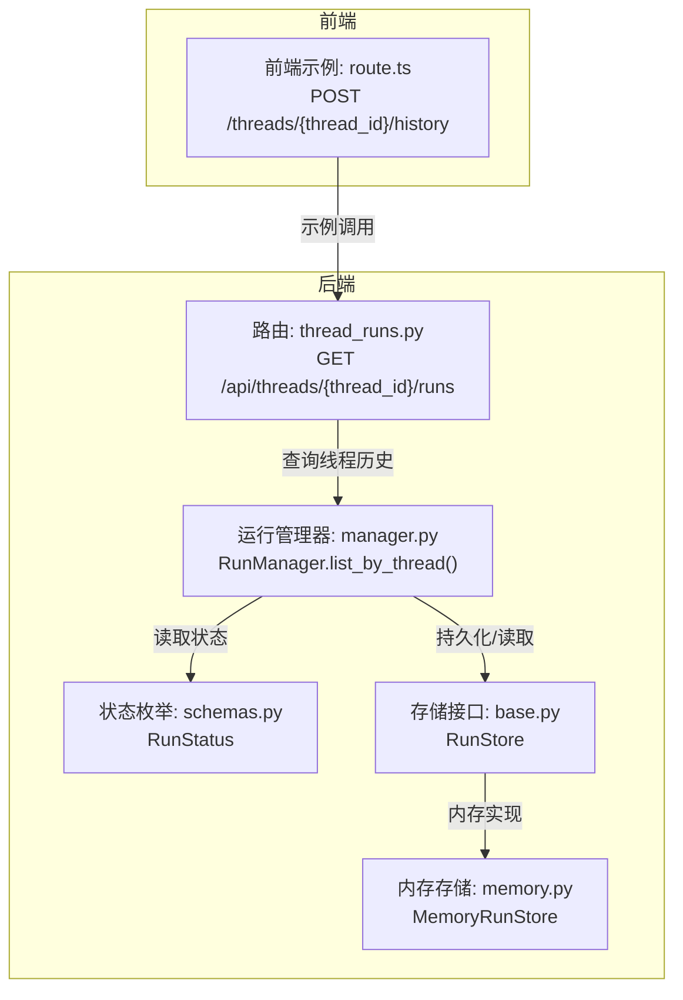
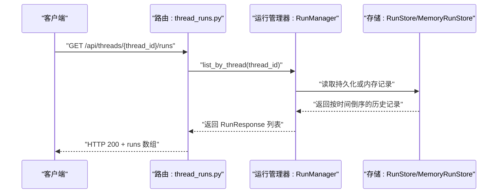

# 获取运行历史

<cite>
**本文引用的文件**
- [thread_runs.py](file://backend/app/gateway/routers/thread_runs.py)
- [schemas.py](file://backend/packages/harness/deerflow/runtime/runs/schemas.py)
- [manager.py](file://backend/packages/harness/deerflow/runtime/runs/manager.py)
- [memory.py](file://backend/packages/harness/deerflow/runtime/runs/store/memory.py)
- [base.py](file://backend/packages/harness/deerflow/runtime/runs/store/base.py)
- [status.sh](file://skills/public/claude-to-deerflow/scripts/status.sh)
- [route.ts](file://frontend/src/app/mock/api/threads/[thread_id]/history/route.ts)
</cite>

## 目录
1. [简介](#简介)
2. [项目结构](#项目结构)
3. [核心组件](#核心组件)
4. [架构总览](#架构总览)
5. [详细组件分析](#详细组件分析)
6. [依赖关系分析](#依赖关系分析)
7. [性能考量](#性能考量)
8. [故障排查指南](#故障排查指南)
9. [结论](#结论)

## 简介
本文件面向“获取运行历史”能力，聚焦于后端 API 的完整规范与前端示例，帮助开发者正确调用与集成。重点说明：
- 端点路径与参数：URL 路径参数 thread_id
- 响应结构：返回 runs 数组，数组元素包含 run_id、status、created_at 字段
- 运行状态含义与取值：pending、running、success、error、timeout、interrupted
- 使用示例：如何查询特定线程的运行历史
- 历史记录的存储与清理机制：内存存储、持久化、清理策略

## 项目结构
围绕“获取运行历史”的相关模块分布如下：
- 后端路由层：提供 /api/threads/{thread_id}/runs 列表接口
- 运行时模型与状态：定义 RunStatus 枚举
- 运行管理器：维护运行记录、状态变更与清理
- 存储层：抽象 RunStore 接口与内存实现
- 前端示例：演示如何通过 mock API 获取历史数据

图表来源
- [thread_runs.py:178-184](file://backend/app/gateway/routers/thread_runs.py#L178-L184)
- [manager.py:115-121](file://backend/packages/harness/deerflow/runtime/runs/manager.py#L115-L121)
- [schemas.py:6-14](file://backend/packages/harness/deerflow/runtime/runs/schemas.py#L6-L14)
- [base.py:17-95](file://backend/packages/harness/deerflow/runtime/runs/store/base.py#L17-L95)
- [memory.py:14-99](file://backend/packages/harness/deerflow/runtime/runs/store/memory.py#L14-L99)
- [route.ts:6-19](file://frontend/src/app/mock/api/threads/[thread_id]/history/route.ts#L6-L19)

章节来源
- [thread_runs.py:178-184](file://backend/app/gateway/routers/thread_runs.py#L178-L184)
- [manager.py:115-121](file://backend/packages/harness/deerflow/runtime/runs/manager.py#L115-L121)
- [schemas.py:6-14](file://backend/packages/harness/deerflow/runtime/runs/schemas.py#L6-L14)
- [base.py:17-95](file://backend/packages/harness/deerflow/runtime/runs/store/base.py#L17-L95)
- [memory.py:14-99](file://backend/packages/harness/deerflow/runtime/runs/store/memory.py#L14-L99)
- [route.ts:6-19](file://frontend/src/app/mock/api/threads/[thread_id]/history/route.ts#L6-L19)

## 核心组件
- 路由与端点
  - GET /api/threads/{thread_id}/runs：列出指定线程的所有运行记录
  - 返回类型：list[RunResponse]，其中 RunResponse 包含 run_id、thread_id、assistant_id、status、metadata、kwargs、multitask_strategy、created_at、updated_at
- 运行状态
  - RunStatus 枚举：pending、running、success、error、timeout、interrupted
- 存储与清理
  - RunStore 抽象接口：put、get、list_by_thread、update_status、delete、update_run_completion、list_pending、aggregate_tokens_by_thread
  - MemoryRunStore 内存实现：按 created_at 逆序返回历史记录，并支持删除与聚合统计
  - RunManager：在内存中维护运行记录，支持状态更新与清理；当配置了持久化存储时，会同步写入

章节来源
- [thread_runs.py:59-108](file://backend/app/gateway/routers/thread_runs.py#L59-L108)
- [thread_runs.py:178-184](file://backend/app/gateway/routers/thread_runs.py#L178-L184)
- [schemas.py:6-14](file://backend/packages/harness/deerflow/runtime/runs/schemas.py#L6-L14)
- [base.py:17-95](file://backend/packages/harness/deerflow/runtime/runs/store/base.py#L17-L95)
- [memory.py:14-99](file://backend/packages/harness/deerflow/runtime/runs/store/memory.py#L14-L99)
- [manager.py:41-121](file://backend/packages/harness/deerflow/runtime/runs/manager.py#L41-L121)

## 架构总览
下图展示了“获取运行历史”的端到端调用链路。

图表来源
- [thread_runs.py:178-184](file://backend/app/gateway/routers/thread_runs.py#L178-L184)
- [manager.py:115-121](file://backend/packages/harness/deerflow/runtime/runs/manager.py#L115-L121)
- [memory.py:50-53](file://backend/packages/harness/deerflow/runtime/runs/store/memory.py#L50-L53)

## 详细组件分析

### API 规范：获取运行历史
- 方法与路径
  - GET /api/threads/{thread_id}/runs
- 路径参数
  - thread_id：字符串，目标线程的唯一标识
- 权限要求
  - 需具备 runs.read 权限，且需满足拥有者检查（owner_check=True）
- 响应体
  - 类型：list[RunResponse]
  - RunResponse 字段
    - run_id：字符串，运行唯一标识
    - thread_id：字符串，所属线程标识
    - assistant_id：可选字符串，关联的助手/代理标识
    - status：字符串，运行状态（见“运行状态”）
    - metadata：字典，运行元数据
    - kwargs：字典，运行参数
    - multitask_strategy：字符串，默认 reject
    - created_at：字符串，ISO 时间戳，创建时间
    - updated_at：字符串，ISO 时间戳，最近更新时间
- 响应示例（示意）
  - runs: [
      {
        "run_id": "uuid-string-1",
        "thread_id": "thread-abc",
        "assistant_id": "agent-xyz",
        "status": "success",
        "metadata": {},
        "kwargs": {},
        "multitask_strategy": "reject",
        "created_at": "2025-01-01T00:00:00Z",
        "updated_at": "2025-01-01T00:01:00Z"
      },
      {
        "run_id": "uuid-string-2",
        "thread_id": "thread-abc",
        "assistant_id": null,
        "status": "running",
        "metadata": {},
        "kwargs": {},
        "multitask_strategy": "reject",
        "created_at": "2025-01-01T00:02:00Z",
        "updated_at": "2025-01-01T00:02:00Z"
      }
    ]

章节来源
- [thread_runs.py:178-184](file://backend/app/gateway/routers/thread_runs.py#L178-L184)
- [thread_runs.py:59-108](file://backend/app/gateway/routers/thread_runs.py#L59-L108)

### 运行状态与含义
- RunStatus 枚举值
  - pending：等待执行
  - running：正在执行
  - success：成功完成
  - error：执行出错
  - timeout：超时
  - interrupted：被中断（取消/回滚）
- 状态流转
  - 创建时初始状态为 pending
  - 执行过程中可能变为 running
  - 结束时可能为 success、error、timeout 或 interrupted

章节来源
- [schemas.py:6-14](file://backend/packages/harness/deerflow/runtime/runs/schemas.py#L6-L14)

### 历史记录的存储与清理机制
- 存储层
  - RunStore 抽象接口定义了运行记录的增删改查与聚合能力
  - MemoryRunStore 在内存中维护运行记录，按 created_at 逆序排序返回
  - 支持更新状态、删除记录、聚合 token 使用等
- 运行管理器
  - RunManager 在内存中注册运行记录，创建时持久化到存储（若配置）
  - 支持按线程查询、状态更新、取消与清理
- 清理策略
  - RunManager 提供清理方法，可在延迟后移除运行记录
  - MemoryRunStore 提供 delete 删除单条记录
- 持久化与重启
  - RunManager 注释说明：当提供持久化存储时，序列化的元数据也会持久化，使运行历史在进程重启后仍可保留

章节来源
- [base.py:17-95](file://backend/packages/harness/deerflow/runtime/runs/store/base.py#L17-L95)
- [memory.py:14-99](file://backend/packages/harness/deerflow/runtime/runs/store/memory.py#L14-L99)
- [manager.py:41-121](file://backend/packages/harness/deerflow/runtime/runs/manager.py#L41-L121)

### 使用示例：查询特定线程的运行历史
- 示例一：使用脚本查看线程历史
  - 调用方式：status.sh thread <thread_id>
  - 行为：向 /threads/{thread_id}/history 发起请求，解析返回的运行历史并预览消息片段
- 示例二：前端 mock API
  - 路径：POST /threads/{thread_id}/history
  - 行为：读取 public/demo/threads/{thread_id}/thread.json 并返回历史数据（数组或单个对象）

章节来源
- [status.sh:74-91](file://skills/public/claude-to-deerflow/scripts/status.sh#L74-L91)
- [route.ts:6-19](file://frontend/src/app/mock/api/threads/[thread_id]/history/route.ts#L6-L19)

## 依赖关系分析
- 组件耦合
  - 路由层依赖运行管理器进行查询
  - 运行管理器依赖存储接口以读取/写入运行记录
  - 存储接口由内存实现提供具体行为
- 外部依赖
  - 前端示例通过 mock API 访问本地 demo 数据，便于演示

图表来源
- [thread_runs.py:178-184](file://backend/app/gateway/routers/thread_runs.py#L178-L184)
- [manager.py:115-121](file://backend/packages/harness/deerflow/runtime/runs/manager.py#L115-L121)
- [base.py:17-95](file://backend/packages/harness/deerflow/runtime/runs/store/base.py#L17-L95)
- [memory.py:14-99](file://backend/packages/harness/deerflow/runtime/runs/store/memory.py#L14-L99)
- [route.ts:6-19](file://frontend/src/app/mock/api/threads/[thread_id]/history/route.ts#L6-L19)

## 性能考量
- 查询复杂度
  - list_by_thread 在内存中遍历并筛选，时间复杂度近似 O(n)，其中 n 为当前运行记录总数
  - MemoryRunStore 对结果按 created_at 逆序排序，时间复杂度 O(k log k)，k 为匹配数量
- 分页与限制
  - 当前路由未提供分页参数；如需大规模历史记录场景，建议在存储层增加分页与上限控制
- 状态更新与持久化
  - RunManager 在状态更新时尝试持久化，失败仅记录警告，避免阻塞主流程

## 故障排查指南
- 404 未找到
  - 现象：查询不存在的 run_id 或 thread_id 导致 404
  - 排查：确认 thread_id 是否正确；确认运行是否已创建
- 409 不可取消
  - 现象：尝试取消非 pending/running 状态的运行
  - 排查：检查当前 run 的 status，仅 pending/running 可取消
- 历史为空
  - 现象：返回空数组
  - 排查：确认该线程是否存在运行记录；检查存储实现是否启用持久化
- 前端 mock 数据
  - 现象：/threads/{thread_id}/history 返回 demo 数据
  - 排查：确认 demo 文件存在且格式正确；确保 thread_id 与文件夹一致

章节来源
- [thread_runs.py:193-194](file://backend/app/gateway/routers/thread_runs.py#L193-L194)
- [thread_runs.py:221-224](file://backend/app/gateway/routers/thread_runs.py#L221-L224)
- [route.ts:11-19](file://frontend/src/app/mock/api/threads/[thread_id]/history/route.ts#L11-L19)

## 结论
- “获取运行历史”端点通过 GET /api/threads/{thread_id}/runs 提供线程维度的运行记录列表
- 响应 runs 数组中的每条记录包含 run_id、status、created_at 等关键字段
- 运行状态涵盖 pending、running、success、error、timeout、interrupted 六种
- 历史记录默认保存在内存中，可通过 RunStore 接口扩展持久化；RunManager 支持清理策略
- 前端提供了 mock 示例与脚本工具，便于快速验证与演示