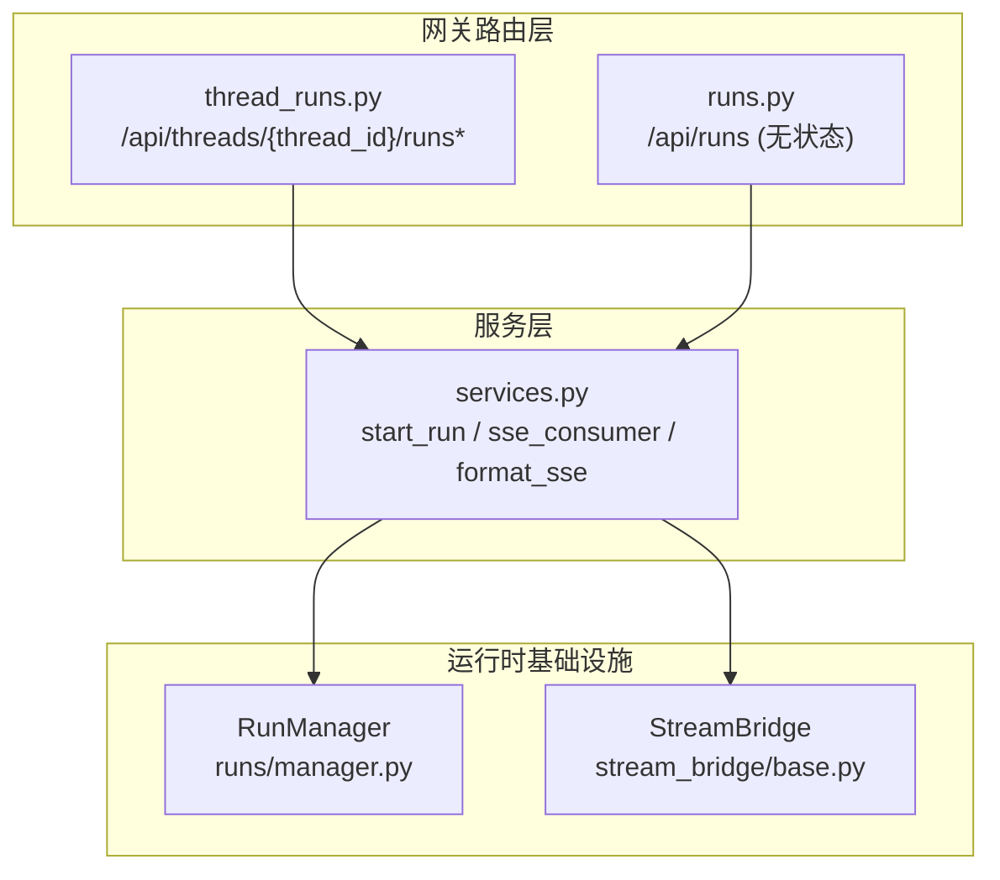
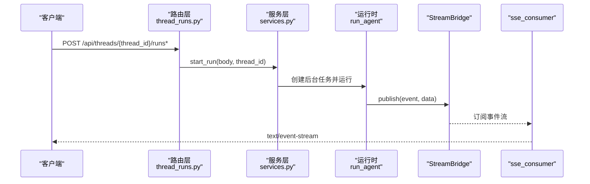
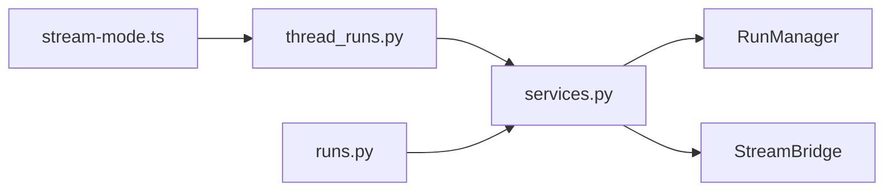

# 运行管理

<cite>
**本文引用的文件**
- [backend/app/gateway/routers/thread_runs.py](file://backend/app/gateway/routers/thread_runs.py)
- [backend/app/gateway/routers/runs.py](file://backend/app/gateway/routers/runs.py)
- [backend/app/gateway/services.py](file://backend/app/gateway/services.py)
- [backend/packages/harness/deerflow/runtime/runs/manager.py](file://backend/packages/harness/deerflow/runtime/runs/manager.py)
- [backend/packages/harness/deerflow/runtime/stream_bridge/base.py](file://backend/packages/harness/deerflow/runtime/stream_bridge/base.py)
- [backend/docs/API.md](file://backend/docs/API.md)
- [backend/docs/STREAMING.md](file://backend/docs/STREAMING.md)
- [backend/frontend/src/core/api/stream-mode.ts](file://backend/frontend/src/core/api/stream-mode.ts)
</cite>

## 目录
1. [简介](#简介)
2. [项目结构](#项目结构)
3. [核心组件](#核心组件)
4. [架构总览](#架构总览)
5. [详细组件分析](#详细组件分析)
6. [依赖分析](#依赖分析)
7. [性能考量](#性能考量)
8. [故障排查指南](#故障排查指南)
9. [结论](#结论)
10. [附录](#附录)

## 简介
本文件面向 LangGraph 运行管理功能，聚焦以下目标：
- 详细说明运行的创建、历史查询、流式执行等核心能力
- 重点解释 Create Run 端点，包括 input 参数（messages 数组）、config 参数（recursion_limit、configurable 中的 model_name、thinking_enabled、is_plan_mode）、stream_mode 参数等
- 详细说明流式传输格式（SSE），包括 values、messages、end 等事件类型
- 解释 Get Run History 端点返回的历史记录结构
- 提供完整的使用示例，包括递归限制配置的重要性、计划模式的启用、思维模式的配置等
- 说明与 Gateway API 的区别，以及直接调用 LangGraph API 时需要注意的配置事项

## 项目结构
运行管理相关代码主要分布在 Gateway API 的路由层、服务层与运行时基础设施中：
- 路由层：提供 /api/threads/{thread_id}/runs 与 /api/runs（无 thread 的无状态运行）等端点
- 服务层：封装请求参数解析、配置合并、运行启动与 SSE 输出
- 运行时：RunManager 管理运行生命周期，StreamBridge 解耦生产者与消费者，SSE 格式遵循 LangGraph 平台协议

图表来源
- [backend/app/gateway/routers/thread_runs.py:116-176](file://backend/app/gateway/routers/thread_runs.py#L116-L176)
- [backend/app/gateway/routers/runs.py:35-88](file://backend/app/gateway/routers/runs.py#L35-L88)
- [backend/app/gateway/services.py:247-364](file://backend/app/gateway/services.py#L247-L364)
- [backend/packages/harness/deerflow/runtime/runs/manager.py:41-110](file://backend/packages/harness/deerflow/runtime/runs/manager.py#L41-L110)
- [backend/packages/harness/deerflow/runtime/stream_bridge/base.py:37-72](file://backend/packages/harness/deerflow/runtime/stream_bridge/base.py#L37-L72)

章节来源
- [backend/app/gateway/routers/thread_runs.py:1-457](file://backend/app/gateway/routers/thread_runs.py#L1-L457)
- [backend/app/gateway/routers/runs.py:1-144](file://backend/app/gateway/routers/runs.py#L1-L144)
- [backend/app/gateway/services.py:1-369](file://backend/app/gateway/services.py#L1-L369)
- [backend/packages/harness/deerflow/runtime/runs/manager.py:1-200](file://backend/packages/harness/deerflow/runtime/runs/manager.py#L1-L200)
- [backend/packages/harness/deerflow/runtime/stream_bridge/base.py:1-72](file://backend/packages/harness/deerflow/runtime/stream_bridge/base.py#L1-L72)

## 核心组件
- Create Run（有状态）：/api/threads/{thread_id}/runs
- Stream Run（有状态）：/api/threads/{thread_id}/runs/stream
- Wait Run（有状态）：/api/threads/{thread_id}/runs/wait
- Get Run（有状态）：/api/threads/{thread_id}/runs/{run_id}
- List Runs（有状态）：/api/threads/{thread_id}/runs
- Cancel Run（有状态）：/api/threads/{thread_id}/runs/{run_id}/cancel
- Join Run（有状态）：/api/threads/{thread_id}/runs/{run_id}/join
- Stream Existing Run（有状态）：/api/threads/{thread_id}/runs/{run_id}/stream
- Get Run Messages（有状态）：/api/threads/{thread_id}/runs/{run_id}/messages
- Get Run Events（有状态）：/api/threads/{thread_id}/runs/{run_id}/events
- Get Thread Messages（有状态）：/api/threads/{thread_id}/messages
- Stateless Stream：/api/runs/stream
- Stateless Wait：/api/runs/wait
- Get Run Messages（无状态）：/api/runs/{run_id}/messages
- Get Run Feedback（无状态）：/api/runs/{run_id}/feedback

章节来源
- [backend/app/gateway/routers/thread_runs.py:116-298](file://backend/app/gateway/routers/thread_runs.py#L116-L298)
- [backend/app/gateway/routers/runs.py:35-144](file://backend/app/gateway/routers/runs.py#L35-L144)

## 架构总览
运行管理采用“路由层薄封装 + 服务层集中业务逻辑 + 运行时基础设施”的分层设计。核心流程如下：
- 请求进入路由层，进行权限校验与参数解析
- 服务层构建运行配置（含 recursion_limit、configurable、context 等），启动后台任务
- 运行时通过 StreamBridge 将事件推送到 SSE 消费者
- SSE 格式遵循 LangGraph 平台协议，前端 SDK 与 LangGraph SDK 可无缝对接

图表来源
- [backend/app/gateway/routers/thread_runs.py:116-176](file://backend/app/gateway/routers/thread_runs.py#L116-L176)
- [backend/app/gateway/services.py:247-334](file://backend/app/gateway/services.py#L247-L334)
- [backend/packages/harness/deerflow/runtime/stream_bridge/base.py:37-72](file://backend/packages/harness/deerflow/runtime/stream_bridge/base.py#L37-L72)

## 详细组件分析

### Create Run（有状态）/api/threads/{thread_id}/runs
- 功能：创建后台运行并立即返回运行元信息
- 请求体字段要点
  - input：图输入，典型为包含 messages 数组的对象
  - config：可覆盖 RunnableConfig，常见键包括 recursion_limit、configurable（如 model_name、thinking_enabled、is_plan_mode）
  - stream_mode：事件流模式列表，如 ["values", "messages-tuple", "custom"] 等
  - context：DeerFlow 特有的上下文覆盖（如 model_name、thinking_enabled、is_plan_mode 等），会被同时注入 configurable 与 context
  - 其他：assistant_id、metadata、webhook、checkpoint_id、interrupt_*、stream_subgraphs、on_disconnect、multitask_strategy 等
- 返回：RunResponse，包含 run_id、thread_id、status、metadata、kwargs 等
- 权限：需要 runs:create 且 owner_check

章节来源
- [backend/app/gateway/routers/thread_runs.py:36-57](file://backend/app/gateway/routers/thread_runs.py#L36-L57)
- [backend/app/gateway/routers/thread_runs.py:116-122](file://backend/app/gateway/routers/thread_runs.py#L116-L122)
- [backend/app/gateway/services.py:171-239](file://backend/app/gateway/services.py#L171-L239)
- [backend/app/gateway/services.py:304-310](file://backend/app/gateway/services.py#L304-L310)

### Stream Run（有状态）/api/threads/{thread_id}/runs/stream
- 功能：创建运行并以 Server-Sent Events 实时推送事件
- 关键行为
  - Content-Location 响应头指向标准运行资源 URL，便于 SDK 提取元数据
  - SSE 事件类型遵循 LangGraph 平台协议
- 断连语义：on_disconnect 控制断连时取消或继续运行
- 返回：text/event-stream

章节来源
- [backend/app/gateway/routers/thread_runs.py:124-149](file://backend/app/gateway/routers/thread_runs.py#L124-L149)
- [backend/app/gateway/services.py:337-364](file://backend/app/gateway/services.py#L337-L364)

### Wait Run（有状态）/api/threads/{thread_id}/runs/wait
- 功能：创建运行并阻塞直到完成，返回最终状态（序列化后的 channel_values）
- 行为：若运行未完成，等待其完成；随后通过检查点读取最终状态

章节来源
- [backend/app/gateway/routers/thread_runs.py:152-176](file://backend/app/gateway/routers/thread_runs.py#L152-L176)
- [backend/app/gateway/services.py:164-174](file://backend/app/gateway/services.py#L164-L174)

### Stateless Stream /api/runs/stream
- 功能：无状态运行（自动创建临时 thread 或复用提供的 thread_id）
- 行为：与有状态版本一致，但 thread_id 由请求体或自动生成

章节来源
- [backend/app/gateway/routers/runs.py:35-57](file://backend/app/gateway/routers/runs.py#L35-L57)
- [backend/app/gateway/routers/runs.py:27-32](file://backend/app/gateway/routers/runs.py#L27-L32)

### Stateless Wait /api/runs/wait
- 功能：无状态运行并阻塞直到完成，返回最终状态

章节来源
- [backend/app/gateway/routers/runs.py:60-88](file://backend/app/gateway/routers/runs.py#L60-L88)

### Get Run History（有状态）/api/threads/{thread_id}/runs
- 功能：列出指定 thread 的所有运行
- 返回：RunResponse 列表（按创建时间倒序）

章节来源
- [backend/app/gateway/routers/thread_runs.py:178-184](file://backend/app/gateway/routers/thread_runs.py#L178-L184)

### Get Run（有状态）/api/threads/{thread_id}/runs/{run_id}
- 功能：获取单个运行详情
- 返回：RunResponse

章节来源
- [backend/app/gateway/routers/thread_runs.py:187-195](file://backend/app/gateway/routers/thread_runs.py#L187-L195)

### Cancel Run（有状态）/api/threads/{thread_id}/runs/{run_id}/cancel
- 功能：取消运行（interrupt 或 rollback），可选择等待完成后再返回
- 返回：202（已受理取消）或 204（等待完成并已停止）

章节来源
- [backend/app/gateway/routers/thread_runs.py:198-233](file://backend/app/gateway/routers/thread_runs.py#L198-L233)

### Join Run（有状态）/api/threads/{thread_id}/runs/{run_id}/join
- 功能：加入现有运行的事件流（SSE）

章节来源
- [backend/app/gateway/routers/thread_runs.py:236-254](file://backend/app/gateway/routers/thread_runs.py#L236-L254)

### Stream Existing Run（有状态）/api/threads/{thread_id}/runs/{run_id}/stream
- 功能：GET：加入现有运行；POST：可选先取消再加入
- 支持 action=interrupt/rollback 与 wait 参数

章节来源
- [backend/app/gateway/routers/thread_runs.py:257-297](file://backend/app/gateway/routers/thread_runs.py#L257-L297)

### Get Run Messages（有状态）/api/threads/{thread_id}/runs/{run_id}/messages
- 功能：分页获取运行的消息（cursor 基于 seq）
- 返回：{ data: [...], has_more: bool }

章节来源
- [backend/app/gateway/routers/thread_runs.py:350-374](file://backend/app/gateway/routers/thread_runs.py#L350-L374)

### Get Run Events（有状态）/api/threads/{thread_id}/runs/{run_id}/events
- 功能：调试/审计用途，返回完整事件流
- 返回：事件数组

章节来源
- [backend/app/gateway/routers/thread_runs.py:377-389](file://backend/app/gateway/routers/thread_runs.py#L377-L389)

### Get Thread Messages（有状态）/api/threads/{thread_id}/messages
- 功能：跨运行聚合 thread 的显示消息，并附加反馈

章节来源
- [backend/app/gateway/routers/thread_runs.py:305-347](file://backend/app/gateway/routers/thread_runs.py#L305-L347)

### Stateless Run Messages /api/runs/{run_id}/messages 与 Feedback /api/runs/{run_id}/feedback
- 功能：无状态运行的消息与反馈查询

章节来源
- [backend/app/gateway/routers/runs.py:105-144](file://backend/app/gateway/routers/runs.py#L105-L144)

### Create Run 请求体字段详解
- input
  - 类型：对象
  - 作用：LangGraph 图输入，通常包含 messages 数组
  - 处理：normalize_input 会将消息转换为 LangChain 消息对象
- config
  - 类型：对象
  - 作用：RunnableConfig 覆盖
  - 常见键：
    - recursion_limit：递归步数上限（LangGraph 默认较低，建议在 Gateway 默认 100）
    - configurable：
      - model_name：模型名称
      - thinking_enabled：是否启用扩展思考（思维模式）
      - is_plan_mode：是否启用计划模式（TodoList 中间件）
- stream_mode
  - 类型：字符串或字符串数组
  - 作用：控制事件流模式，如 ["values", "messages-tuple", "custom"]
  - 默认：["values"]

章节来源
- [backend/app/gateway/routers/thread_runs.py:36-57](file://backend/app/gateway/routers/thread_runs.py#L36-L57)
- [backend/app/gateway/services.py:76-96](file://backend/app/gateway/services.py#L76-L96)
- [backend/app/gateway/services.py:64-74](file://backend/app/gateway/services.py#L64-L74)
- [backend/docs/API.md:104-123](file://backend/docs/API.md#L104-L123)

### 流式传输格式（SSE）与事件类型
- 协议：text/event-stream，遵循 LangGraph 平台 wire 格式
- 事件类型（示例）
  - values：节点级状态快照
  - messages：LLM token 级增量（messages-tuple）
  - end：结束事件，data 为 null
  - 其他：updates、events、debug、tasks、checkpoints、custom 等
- 心跳：HEARTBEAT_SENTINEL（__heartbeat__）用于保持连接
- 事件 ID：使用 Last-Event-ID 支持断连重连

章节来源
- [backend/packages/harness/deerflow/runtime/stream_bridge/base.py:16-35](file://backend/packages/harness/deerflow/runtime/stream_bridge/base.py#L16-L35)
- [backend/app/gateway/services.py:43-56](file://backend/app/gateway/services.py#L43-L56)
- [backend/app/gateway/services.py:337-364](file://backend/app/gateway/services.py#L337-L364)
- [backend/frontend/src/core/api/stream-mode.ts:1-68](file://backend/frontend/src/core/api/stream-mode.ts#L1-L68)

### Get Run History 返回结构
- 列表项：RunResponse
  - run_id、thread_id、assistant_id、status、metadata、kwargs、multitask_strategy、created_at、updated_at
- 列表顺序：按创建时间倒序

章节来源
- [backend/app/gateway/routers/thread_runs.py:59-69](file://backend/app/gateway/routers/thread_runs.py#L59-L69)
- [backend/app/gateway/routers/thread_runs.py:178-184](file://backend/app/gateway/routers/thread_runs.py#L178-L184)

### 使用示例与最佳实践
- 递归限制配置的重要性
  - LangGraph 直连端点默认 recursion_limit 较低，Plan Mode 或子代理密集场景易触发 GraphRecursionError
  - Gateway 默认 recursion_limit=100，建议直连 LangGraph API 时显式设置
- 计划模式启用
  - 在 config.configurable 中设置 is_plan_mode=true，可动态开启 TodoList 中间件
- 思维模式配置
  - 在 config.configurable 中设置 thinking_enabled=true，启用扩展思考（视模型支持而定）
- 流式模式选择
  - 若需 token 级增量，必须包含 "messages-tuple" 或 "messages"
  - 前端 SDK 与 LangGraph SDK 期望的模式名称略有差异，注意翻译

章节来源
- [backend/docs/API.md:104-123](file://backend/docs/API.md#L104-L123)
- [backend/docs/API.md:126-135](file://backend/docs/API.md#L126-L135)
- [backend/docs/STREAMING.md:49-99](file://backend/docs/STREAMING.md#L49-L99)

### 与 Gateway API 的区别
- Base URL
  - LangGraph API：/api/langgraph
  - Gateway API：/api
- 运行端点
  - LangGraph：/api/langgraph/threads/{thread_id}/runs*
  - Gateway：/api/threads/{thread_id}/runs* 与 /api/runs*
- Recursion Limit 默认值
  - LangGraph 直连：默认较低（易触发递归错误）
  - Gateway：默认 100，适合复杂场景
- SSE 兼容性
  - Gateway：遵循 LangGraph 平台 wire 格式，SDK 可直接使用
  - LangGraph：遵循 LangGraph 原生协议

章节来源
- [backend/docs/API.md:1-20](file://backend/docs/API.md#L1-L20)
- [backend/docs/API.md:104-123](file://backend/docs/API.md#L104-L123)

## 依赖分析
- 路由层依赖服务层的 start_run 与 sse_consumer
- 服务层依赖运行时基础设施（RunManager、StreamBridge）
- SSE 事件类型与模式集合由前端 SDK 与运行时共同约束

图表来源
- [backend/app/gateway/routers/thread_runs.py:116-176](file://backend/app/gateway/routers/thread_runs.py#L116-L176)
- [backend/app/gateway/routers/runs.py:35-88](file://backend/app/gateway/routers/runs.py#L35-L88)
- [backend/app/gateway/services.py:247-364](file://backend/app/gateway/services.py#L247-L364)
- [backend/packages/harness/deerflow/runtime/runs/manager.py:41-110](file://backend/packages/harness/deerflow/runtime/runs/manager.py#L41-L110)
- [backend/packages/harness/deerflow/runtime/stream_bridge/base.py:37-72](file://backend/packages/harness/deerflow/runtime/stream_bridge/base.py#L37-L72)
- [backend/frontend/src/core/api/stream-mode.ts:1-68](file://backend/frontend/src/core/api/stream-mode.ts#L1-L68)

章节来源
- [backend/app/gateway/routers/thread_runs.py:1-457](file://backend/app/gateway/routers/thread_runs.py#L1-L457)
- [backend/app/gateway/routers/runs.py:1-144](file://backend/app/gateway/routers/runs.py#L1-L144)
- [backend/app/gateway/services.py:1-369](file://backend/app/gateway/services.py#L1-L369)
- [backend/packages/harness/deerflow/runtime/runs/manager.py:1-200](file://backend/packages/harness/deerflow/runtime/runs/manager.py#L1-L200)
- [backend/packages/harness/deerflow/runtime/stream_bridge/base.py:1-72](file://backend/packages/harness/deerflow/runtime/stream_bridge/base.py#L1-L72)
- [backend/frontend/src/core/api/stream-mode.ts:1-68](file://backend/frontend/src/core/api/stream-mode.ts#L1-L68)

## 性能考量
- 递归限制：复杂工作流（尤其是计划模式与子代理）建议提高 recursion_limit，避免中途失败
- 流模式选择：仅订阅必要模式，减少序列化与传输开销
- SSE 心跳与断连：合理设置 on_disconnect，避免僵尸任务占用资源
- 运行并发：通过 multitask_strategy 控制并发策略，避免资源争用

## 故障排查指南
- 409 冲突：线程已有进行中的运行，根据策略选择 reject/interrupt/rollback
- 501 不支持策略：multitask_strategy 值非法
- 断连行为：on_disconnect=cancel 会取消后台任务，continue 则继续运行
- 最终状态获取：wait 端点依赖检查点读取，异常时返回状态与错误信息

章节来源
- [backend/app/gateway/services.py:279-282](file://backend/app/gateway/services.py#L279-L282)
- [backend/app/gateway/services.py:366-369](file://backend/app/gateway/services.py#L366-L369)
- [backend/app/gateway/routers/thread_runs.py:198-233](file://backend/app/gateway/routers/thread_runs.py#L198-L233)

## 结论
- 运行管理在 Gateway 与 LangGraph 两端均提供一致的能力，但默认配置与协议细节存在差异
- Create Run 的 input/config/stream_mode 是流式体验与正确性的关键
- SSE 事件类型与模式集合需与前端 SDK 保持一致
- 复杂工作流务必合理配置 recursion_limit 与运行策略，确保稳定性与性能

## 附录
- 事件类型与模式集合参考：values、messages、messages-tuple、updates、events、debug、tasks、checkpoints、custom
- 推荐实践：直连 LangGraph API 时显式设置 recursion_limit；启用计划模式与思维模式时明确配置 configurable