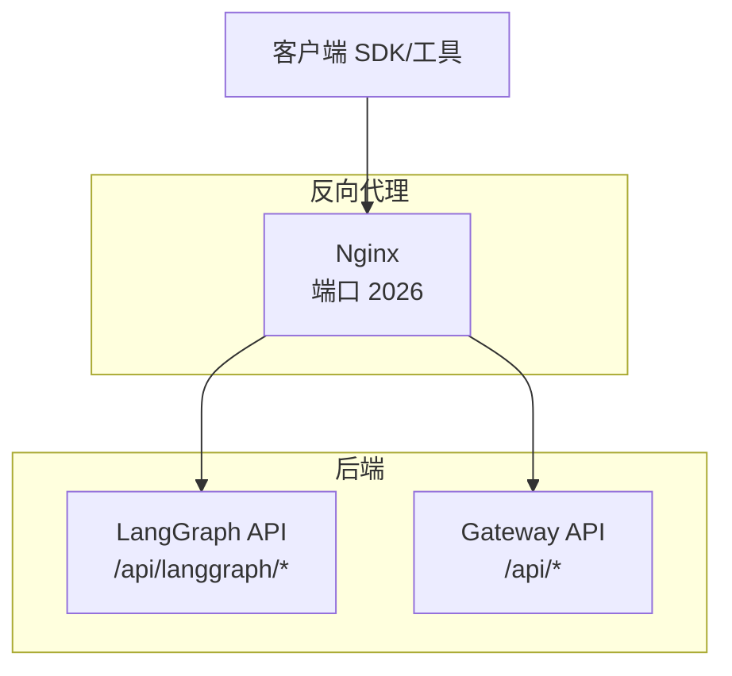
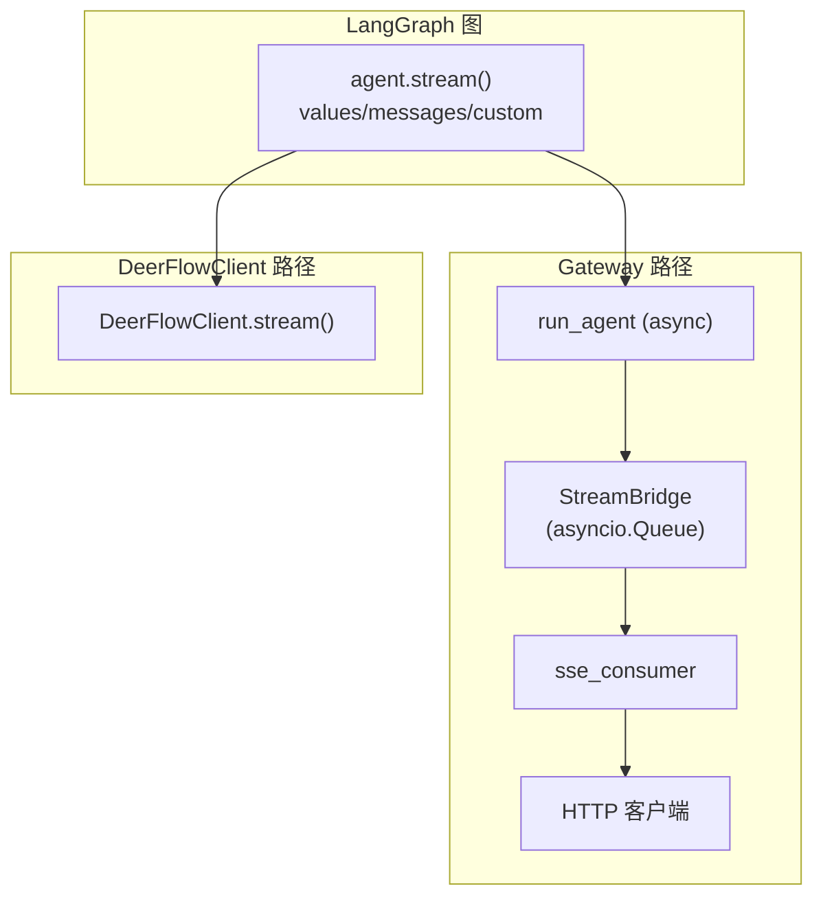
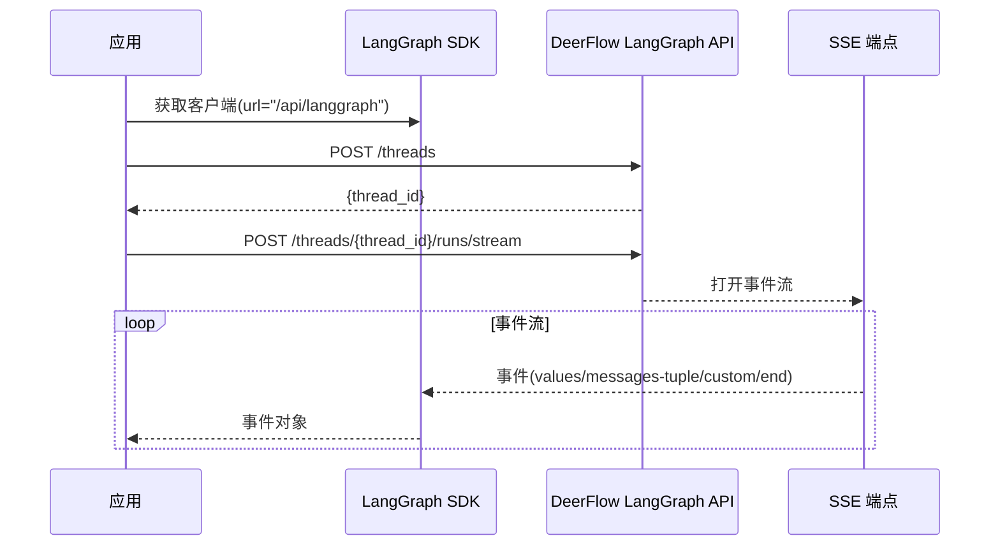
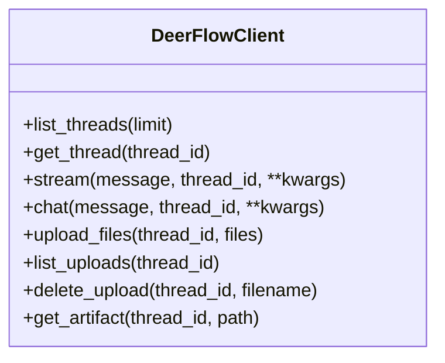
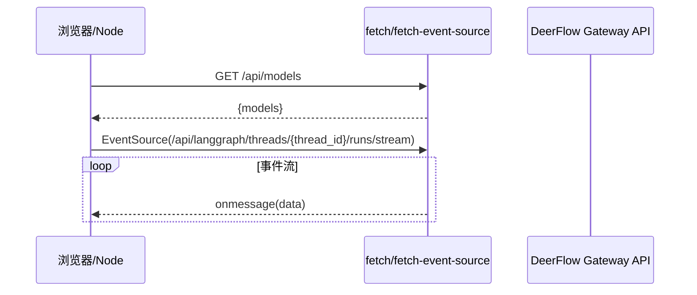
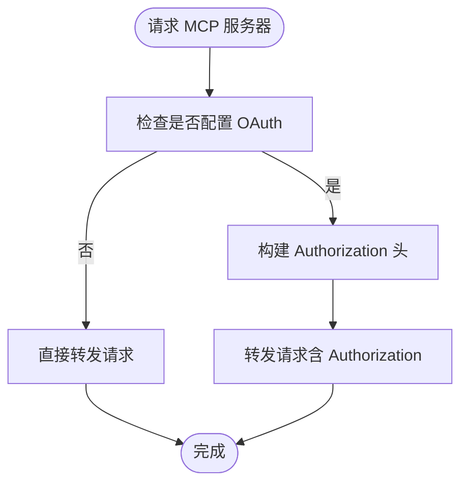
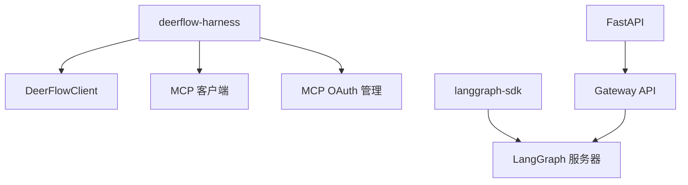

# SDK 集成与示例

<cite>
**本文引用的文件**
- [API.md](file://backend/docs/API.md)
- [STREAMING.md](file://backend/docs/STREAMING.md)
- [client.py](file://backend/packages/harness/deerflow/client.py)
- [mcp/client.py](file://backend/packages/harness/deerflow/mcp/client.py)
- [mcp/oauth.py](file://backend/packages/harness/deerflow/mcp/oauth.py)
- [pyproject.toml](file://backend/pyproject.toml)
- [test_client.py](file://backend/tests/test_client.py)
- [test_client_e2e.py](file://backend/tests/test_client_e2e.py)
- [test_mcp_oauth.py](file://backend/tests/test_mcp_oauth.py)
- [assistants_compat.py](file://backend/app/gateway/routers/assistants_compat.py)
- [mcp.py](file://backend/app/gateway/routers/mcp.py)
</cite>

## 目录
1. [简介](#简介)
2. [项目结构](#项目结构)
3. [核心组件](#核心组件)
4. [架构总览](#架构总览)
5. [详细组件分析](#详细组件分析)
6. [依赖分析](#依赖分析)
7. [性能考量](#性能考量)
8. [故障排查指南](#故障排查指南)
9. [结论](#结论)
10. [附录](#附录)

## 简介
本文件面向希望在应用中集成 DeerFlow API 的开发者，提供多语言 SDK 使用指南与最佳实践。内容覆盖：
- Python LangGraph SDK（官方平台 SDK）
- JavaScript/TypeScript（浏览器/Node 环境）
- cURL 命令行示例
- 创建线程、运行代理、处理流式响应、文件上传等常见操作
- 高级用法、性能优化建议、错误处理策略
- 实际项目中的集成案例与最佳实践

## 项目结构
DeerFlow 后端同时提供两类 API：
- LangGraph API：用于与 LangGraph 服务器交互，遵循 LangGraph SDK 约定（/api/langgraph/*）
- Gateway API：统一的业务 API（/api/*），涵盖模型、MCP、技能、上传、制品等

图表来源
- [API.md:1-13](file://backend/docs/API.md#L1-L13)

章节来源
- [API.md:1-13](file://backend/docs/API.md#L1-L13)

## 核心组件
- DeerFlowClient（嵌入式 Python 客户端）：提供直接程序化访问 DeerFlow 的能力，无需 LangGraph Server 或 Gateway API 进程参与。适合 Jupyter、脚本、测试等场景。
- LangGraph SDK 客户端：通过 HTTP 与 LangGraph 服务器交互，适用于浏览器、IM 渠道或需要跨进程通信的场景。
- Gateway API：提供模型、MCP、技能、上传、制品等统一接口，便于在应用中进行配置与资源管理。

章节来源
- [client.py:80-112](file://backend/packages/harness/deerflow/client.py#L80-L112)
- [API.md:14-16](file://backend/docs/API.md#L14-L16)
- [pyproject.toml:1-26](file://backend/pyproject.toml#L1-L26)

## 架构总览
DeerFlow 的流式输出设计包含两条并行路径：
- Gateway 路径：异步 + HTTP SSE + JSON 序列化，服务于浏览器与 IM 渠道
- DeerFlowClient 路径：同步 + 进程内直连，服务于 Jupyter、脚本与测试

图表来源
- [STREAMING.md:104-145](file://backend/docs/STREAMING.md#L104-L145)
- [STREAMING.md:150-172](file://backend/docs/STREAMING.md#L150-L172)

章节来源
- [STREAMING.md:15-46](file://backend/docs/STREAMING.md#L15-L46)

## 详细组件分析

### Python LangGraph SDK（官方平台 SDK）
- 安装与基础使用
  - 通过官方 LangGraph SDK 获取客户端实例，指向 DeerFlow 的 LangGraph 基础路径
  - 示例参考：[API.md:582-601](file://backend/docs/API.md#L582-L601)
- 创建线程与运行代理
  - 创建线程：POST /api/langgraph/threads
  - 运行代理（流式）：POST /api/langgraph/threads/{thread_id}/runs/stream
  - 示例参考：[API.md:20-166](file://backend/docs/API.md#L20-L166)
- 流式响应处理
  - 事件类型：values、messages-tuple、custom、end
  - 事件格式与字段参考：[API.md:124-135](file://backend/docs/API.md#L124-L135)
- 配置与递归限制
  - 推荐设置 recursion_limit 以避免计划模式或子代理深度导致的 GraphRecursionError
  - 参考：[API.md:104-117](file://backend/docs/API.md#L104-L117)

图表来源
- [API.md:16-166](file://backend/docs/API.md#L16-L166)

章节来源
- [API.md:582-601](file://backend/docs/API.md#L582-L601)
- [API.md:20-166](file://backend/docs/API.md#L20-L166)

### Python 嵌入式客户端（DeerFlowClient）
- 安装与初始化
  - 作为 deerflow-harness 包的一部分，可在本地 Python 环境中直接导入使用
  - 参考：[pyproject.toml:8-8](file://backend/pyproject.toml#L8-L8)
- 创建线程与运行代理
  - list_threads/get_thread：列出与获取线程历史
  - stream/chat：流式与一次性回复
  - 参考：[client.py:387-483](file://backend/packages/harness/deerflow/client.py#L387-L483)、[client.py:489-760](file://backend/packages/harness/deerflow/client.py#L489-L760)
- 流式事件与去重机制
  - 事件类型：values、messages-tuple、custom、end
  - 去重与幂等计数：seen_ids、streamed_ids、counted_usage_ids
  - 参考：[STREAMING.md:200-244](file://backend/docs/STREAMING.md#L200-L244)
- 文件上传与制品访问
  - upload_files/list_uploads/delete_upload：文件上传、列举、删除
  - get_artifact：读取制品
  - 参考：[test_client_e2e.py:267-344](file://backend/tests/test_client_e2e.py#L267-L344)、[test_client_e2e.py:491-540](file://backend/tests/test_client_e2e.py#L491-L540)

图表来源
- [client.py:387-760](file://backend/packages/harness/deerflow/client.py#L387-L760)

章节来源
- [client.py:80-112](file://backend/packages/harness/deerflow/client.py#L80-L112)
- [client.py:387-760](file://backend/packages/harness/deerflow/client.py#L387-L760)
- [STREAMING.md:200-244](file://backend/docs/STREAMING.md#L200-L244)

### JavaScript/TypeScript（浏览器/Node）
- 使用 fetch 访问 Gateway API
  - 列举模型：GET /api/models
  - 获取 MCP 配置：GET /api/mcp/config
  - 示例参考：[API.md:603-618](file://backend/docs/API.md#L603-L618)
- 使用 EventSource 处理流式响应
  - 连接 SSE：/api/langgraph/threads/{thread_id}/runs/stream
  - 示例参考：[API.md:603-618](file://backend/docs/API.md#L603-L618)
- WebSocket 支持
  - 参考：[API.md:570-578](file://backend/docs/API.md#L570-L578)

图表来源
- [API.md:603-618](file://backend/docs/API.md#L603-L618)

章节来源
- [API.md:603-618](file://backend/docs/API.md#L603-L618)

### cURL 命令行示例
- 列举模型：curl http://localhost:2026/api/models
- 获取 MCP 配置：curl http://localhost:2026/api/mcp/config
- 上传文件：curl -X POST http://localhost:2026/api/threads/{thread_id}/uploads -F "files=@document.pdf"
- 启用技能：curl -X POST http://localhost:2026/api/skills/{skill_name}/enable
- 创建线程与运行代理：参考 [API.md:620-650](file://backend/docs/API.md#L620-L650)

章节来源
- [API.md:620-650](file://backend/docs/API.md#L620-L650)

### 文件上传与制品管理
- 上传文件
  - 接口：POST /api/threads/{thread_id}/uploads
  - 支持格式：PDF、PPT、Excel、Word 等（自动转换为 Markdown）
  - 返回：文件元数据与制品 URL
  - 参考：[API.md:404-437](file://backend/docs/API.md#L404-L437)
- 列举与删除
  - GET /api/threads/{thread_id}/uploads/list
  - DELETE /api/threads/{thread_id}/uploads/{filename}
  - 参考：[API.md:445-481](file://backend/docs/API.md#L445-L481)
- 下载制品
  - GET /api/threads/{thread_id}/artifacts/{path}?download=true
  - 参考：[API.md:503-521](file://backend/docs/API.md#L503-L521)

章节来源
- [API.md:404-481](file://backend/docs/API.md#L404-L481)
- [API.md:503-521](file://backend/docs/API.md#L503-L521)

### MCP 与 OAuth 集成
- MCP 配置
  - 获取：GET /api/mcp/config
  - 更新：PUT /api/mcp/config
  - 参考：[API.md:227-295](file://backend/docs/API.md#L227-L295)、[mcp.py:18-31](file://backend/app/gateway/routers/mcp.py#L18-L31)
- OAuth 注入
  - 通过 OAuthTokenManager 为 MCP HTTP/SSE 服务器注入 Authorization 头
  - 参考：[mcp/oauth.py:122-150](file://backend/packages/harness/deerflow/mcp/oauth.py#L122-L150)、[test_mcp_oauth.py:53-191](file://backend/tests/test_mcp_oauth.py#L53-L191)

图表来源
- [mcp/oauth.py:122-150](file://backend/packages/harness/deerflow/mcp/oauth.py#L122-L150)

章节来源
- [API.md:227-295](file://backend/docs/API.md#L227-L295)
- [mcp.py:18-31](file://backend/app/gateway/routers/mcp.py#L18-L31)
- [mcp/oauth.py:122-150](file://backend/packages/harness/deerflow/mcp/oauth.py#L122-L150)
- [test_mcp_oauth.py:53-191](file://backend/tests/test_mcp_oauth.py#L53-L191)

### 助手兼容层（Assistants Compat）
- 提供与 LangGraph 平台兼容的助手 API，满足前端 React hook 初始化需求
- 参考：[assistants_compat.py:1-40](file://backend/app/gateway/routers/assistants_compat.py#L1-L40)

章节来源
- [assistants_compat.py:1-40](file://backend/app/gateway/routers/assistants_compat.py#L1-L40)

## 依赖分析
- Python 依赖
  - deerflow-harness：核心包，提供 DeerFlowClient、MCP 客户端与 OAuth 管理
  - langgraph-sdk：LangGraph 平台 SDK，用于与 LangGraph 服务器交互
  - fastapi、httpx、sse-starlette：后端 API 与 SSE 支持
  - 其他：钉钉、飞书、Slack、Telegram 等渠道 SDK，DashScope、OSS 等第三方服务
- 测试与验证
  - 单元测试：覆盖流式事件、去重、工具调用、文件上传等
  - 端到端测试：结合真实 LLM 与模块，验证完整链路

图表来源
- [pyproject.toml:1-26](file://backend/pyproject.toml#L1-L26)

章节来源
- [pyproject.toml:1-26](file://backend/pyproject.toml#L1-L26)
- [test_client.py:1-800](file://backend/tests/test_client.py#L1-L800)
- [test_client_e2e.py:1-800](file://backend/tests/test_client_e2e.py#L1-L800)

## 性能考量
- 流式性能
  - 使用 messages 模式获取 token 级增量，避免一次性累积带来的延迟
  - chat() 使用 O(n) 累加策略，避免 O(n²) 字符串拼接
  - 参考：[STREAMING.md:181-197](file://backend/docs/STREAMING.md#L181-L197)
- 递归限制
  - 计划模式或子代理深度运行时，建议设置 recursion_limit=100
  - 参考：[API.md:104-117](file://backend/docs/API.md#L104-L117)
- 并发与连接
  - Gateway 路径使用 asyncio 队列解耦生产者与消费者，支持 Last-Event-ID 重连与心跳
  - 参考：[STREAMING.md:102-145](file://backend/docs/STREAMING.md#L102-L145)

章节来源
- [STREAMING.md:181-197](file://backend/docs/STREAMING.md#L181-L197)
- [API.md:104-117](file://backend/docs/API.md#L104-L117)
- [STREAMING.md:102-145](file://backend/docs/STREAMING.md#L102-L145)

## 故障排查指南
- 流式未见增量
  - 确认订阅了 messages 模式，确保事件按 token 级别推送
  - 参考：[test_client.py:373-439](file://backend/tests/test_client.py#L373-L439)
- 重复文本或计数异常
  - 检查 streamed_ids 与 counted_usage_ids 的去重与幂等计数逻辑
  - 参考：[STREAMING.md:200-244](file://backend/docs/STREAMING.md#L200-L244)
- 文件上传失败
  - 确认上传文件存在且为单文件，避免目录上传
  - 参考：[test_client_e2e.py:449-477](file://backend/tests/test_client_e2e.py#L449-L477)
- 路径遍历与权限问题
  - artifact 访问与上传路径均有限制，防止越界访问
  - 参考：[test_client_e2e.py:464-477](file://backend/tests/test_client_e2e.py#L464-L477)、[test_client_e2e.py:534-539](file://backend/tests/test_client_e2e.py#L534-L539)
- OAuth 请求失败
  - 检查 token_url、grant_type、client_id、client_secret 等配置
  - 参考：[test_mcp_oauth.py:53-191](file://backend/tests/test_mcp_oauth.py#L53-L191)

章节来源
- [test_client.py:373-439](file://backend/tests/test_client.py#L373-L439)
- [STREAMING.md:200-244](file://backend/docs/STREAMING.md#L200-L244)
- [test_client_e2e.py:449-477](file://backend/tests/test_client_e2e.py#L449-L477)
- [test_client_e2e.py:464-477](file://backend/tests/test_client_e2e.py#L464-L477)
- [test_client_e2e.py:534-539](file://backend/tests/test_client_e2e.py#L534-L539)
- [test_mcp_oauth.py:53-191](file://backend/tests/test_mcp_oauth.py#L53-L191)

## 结论
- DeerFlow 提供两条互补的流式路径：Gateway 路径面向浏览器与 IM 渠道，DeerFlowClient 路径面向本地 Python 应用。
- 建议优先使用 LangGraph SDK 进行跨进程集成，使用 DeerFlowClient 进行本地脚本与测试。
- 注意正确订阅 messages 模式以获得 token 级增量；合理设置 recursion_limit；利用去重与幂等计数保障一致性。
- 通过 Gateway API 管理模型、MCP、技能与文件上传，配合 MCP OAuth 注入实现安全扩展。

## 附录
- 安装与环境准备
  - 安装 deerflow-harness 与 langgraph-sdk
  - 参考：[pyproject.toml:1-26](file://backend/pyproject.toml#L1-L26)
- 常用接口速查
  - LangGraph API：/api/langgraph/*
  - Gateway API：/api/*
  - 参考：[API.md:14-16](file://backend/docs/API.md#L14-L16)