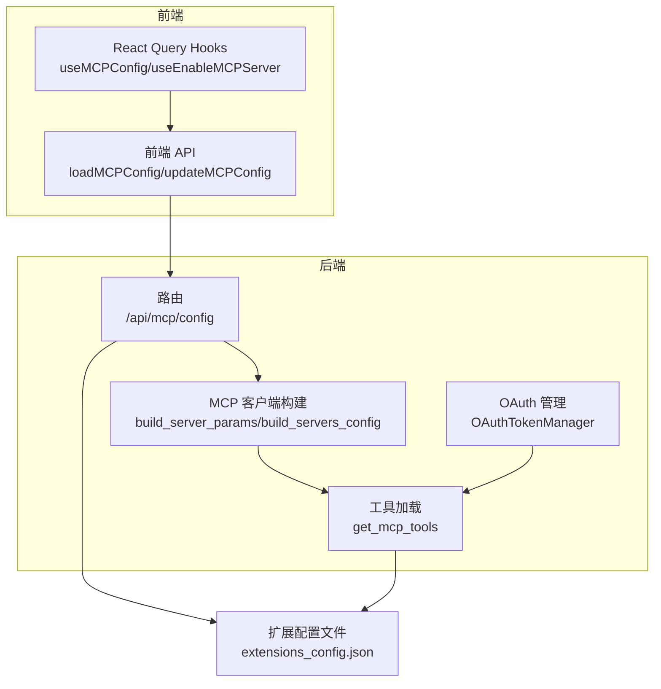
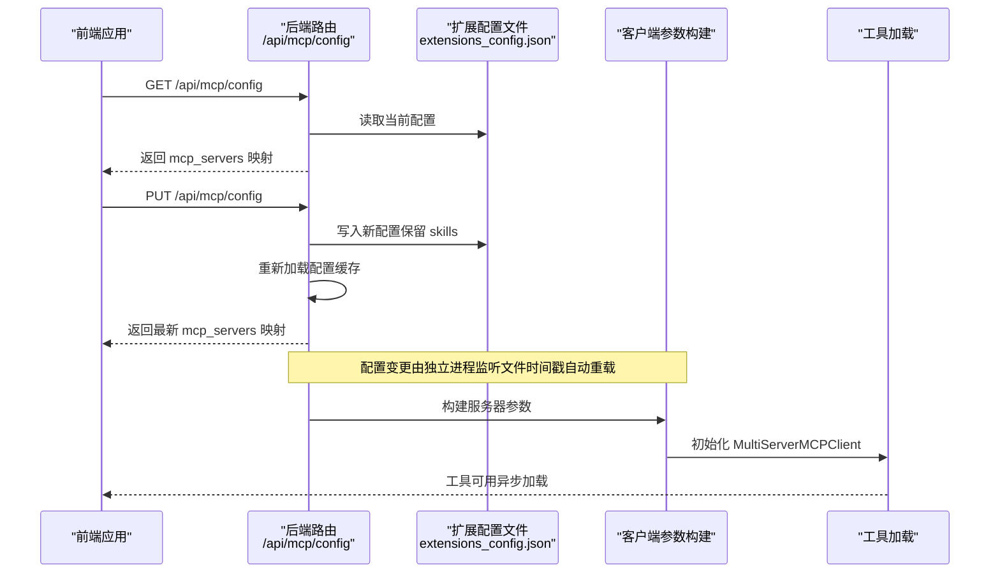
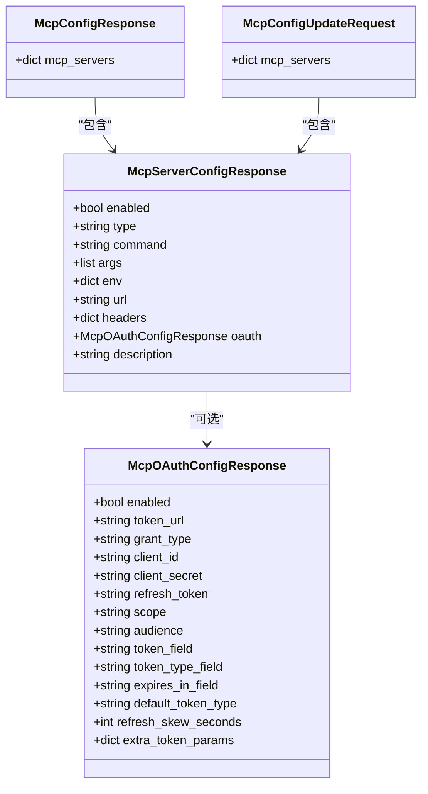
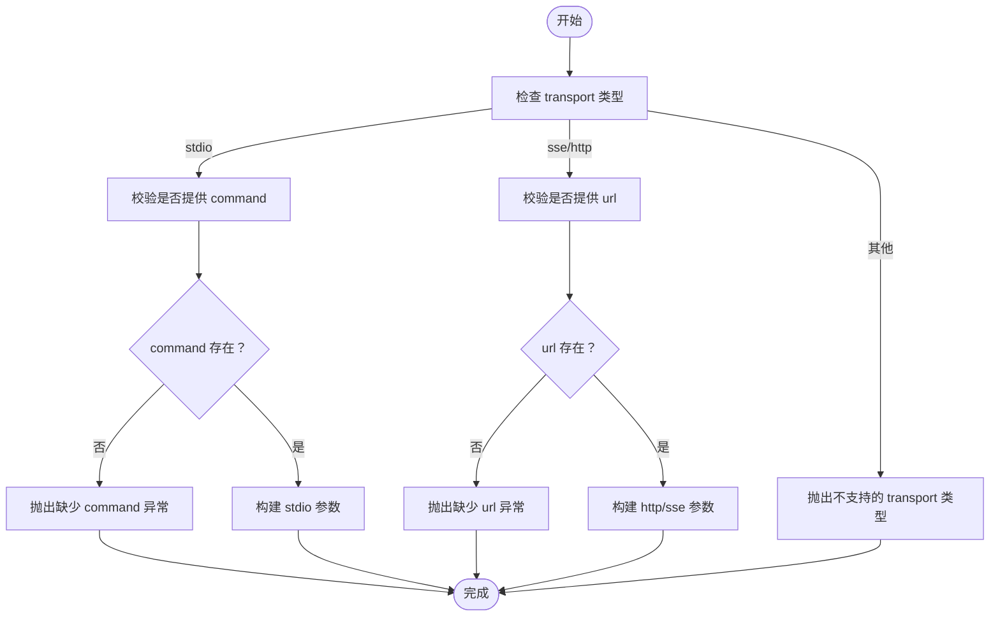
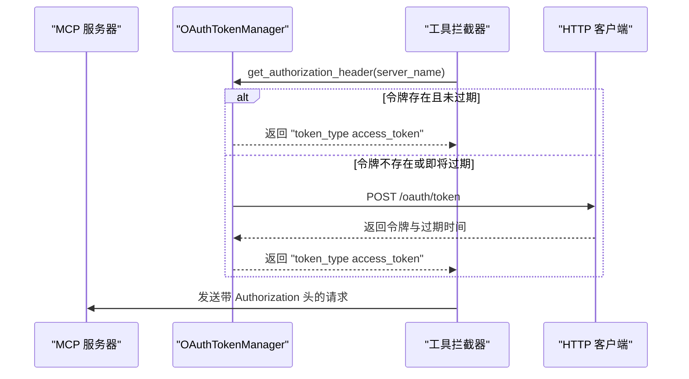
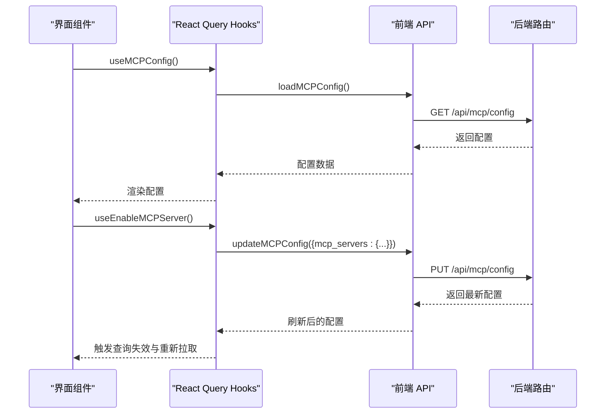
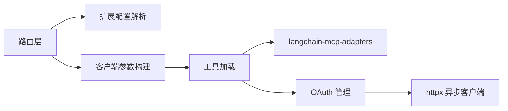

# MCP 配置 API

<cite>
**本文引用的文件**
- [backend/app/gateway/routers/mcp.py](file://backend/app/gateway/routers/mcp.py)
- [backend/packages/harness/deerflow/mcp/client.py](file://backend/packages/harness/deerflow/mcp/client.py)
- [backend/packages/harness/deerflow/mcp/oauth.py](file://backend/packages/harness/deerflow/mcp/oauth.py)
- [backend/packages/harness/deerflow/mcp/tools.py](file://backend/packages/harness/deerflow/mcp/tools.py)
- [backend/tests/test_mcp_client_config.py](file://backend/tests/test_mcp_client_config.py)
- [backend/tests/test_mcp_oauth.py](file://backend/tests/test_mcp_oauth.py)
- [backend/tests/test_mcp_custom_interceptors.py](file://backend/tests/test_mcp_custom_interceptors.py)
- [extensions_config.example.json](file://extensions_config.example.json)
- [backend/docs/MCP_SERVER.md](file://backend/docs/MCP_SERVER.md)
- [frontend/src/core/mcp/api.ts](file://frontend/src/core/mcp/api.ts)
- [frontend/src/core/mcp/hooks.ts](file://frontend/src/core/mcp/hooks.ts)
- [frontend/src/core/mcp/types.ts](file://frontend/src/core/mcp/types.ts)
</cite>

## 目录
1. [简介](#简介)
2. [项目结构](#项目结构)
3. [核心组件](#核心组件)
4. [架构总览](#架构总览)
5. [详细组件分析](#详细组件分析)
6. [依赖关系分析](#依赖关系分析)
7. [性能考量](#性能考量)
8. [故障排除指南](#故障排除指南)
9. [结论](#结论)
10. [附录](#附录)

## 简介
本文件为 DeerFlow 中 MCP（模型上下文协议）配置 API 的权威文档，覆盖以下内容：
- 获取与更新 MCP 服务器配置的接口：GET /api/mcp/config 与 PUT /api/mcp/config
- MCP 服务器配置数据结构定义：服务器名称、类型（stdio、http、sse）、命令、参数、环境变量、描述、OAuth 等
- 配置示例：GitHub、文件系统、PostgreSQL 等常见 MCP 服务器
- 配置更新的验证规则与错误处理机制
- MCP 服务器生命周期管理与状态监控要点
- 实际配置示例与故障排除指南

## 项目结构
围绕 MCP 配置 API 的关键文件分布如下：
- 后端路由层：FastAPI 路由，负责对外暴露 GET/PUT 接口与响应模型
- MCP 客户端构建：将扩展配置转换为多服务器客户端参数
- OAuth 支持：令牌获取、缓存与刷新，以及工具拦截器注入
- 工具加载：从启用的 MCP 服务器动态发现并加载工具
- 前端集成：查询与更新配置的 API 封装与 React Query 集成
- 示例配置：extensions_config.example.json 展示典型配置项

图表来源
- [backend/app/gateway/routers/mcp.py:66-169](file://backend/app/gateway/routers/mcp.py#L66-L169)
- [backend/packages/harness/deerflow/mcp/client.py:11-68](file://backend/packages/harness/deerflow/mcp/client.py#L11-L68)
- [backend/packages/harness/deerflow/mcp/oauth.py:25-151](file://backend/packages/harness/deerflow/mcp/oauth.py#L25-L151)
- [backend/packages/harness/deerflow/mcp/tools.py:57-136](file://backend/packages/harness/deerflow/mcp/tools.py#L57-L136)
- [frontend/src/core/mcp/api.ts:6-20](file://frontend/src/core/mcp/api.ts#L6-L20)
- [frontend/src/core/mcp/hooks.ts:5-44](file://frontend/src/core/mcp/hooks.ts#L5-L44)

章节来源
- [backend/app/gateway/routers/mcp.py:1-170](file://backend/app/gateway/routers/mcp.py#L1-L170)
- [extensions_config.example.json:1-45](file://extensions_config.example.json#L1-L45)

## 核心组件
- 路由与响应模型
  - GET /api/mcp/config：返回当前 MCP 服务器配置映射
  - PUT /api/mcp/config：保存新配置到 extensions_config.json，并返回最新配置
- MCP 客户端参数构建
  - 根据服务器类型（stdio/sse/http）生成 transport、command/args/env 或 url/headers 参数
  - 对不合法配置抛出异常（如缺少必要字段）
- OAuth 支持
  - 令牌获取、缓存与过期前刷新；支持 client_credentials 与 refresh_token
  - 构建工具拦截器自动注入 Authorization 头
- 工具加载
  - 通过 MultiServerMCPClient 发现并加载工具；支持自定义拦截器链
- 前端集成
  - 使用 React Query 查询与更新 MCP 配置；支持按服务器启停

章节来源
- [backend/app/gateway/routers/mcp.py:15-169](file://backend/app/gateway/routers/mcp.py#L15-L169)
- [backend/packages/harness/deerflow/mcp/client.py:11-68](file://backend/packages/harness/deerflow/mcp/client.py#L11-L68)
- [backend/packages/harness/deerflow/mcp/oauth.py:25-151](file://backend/packages/harness/deerflow/mcp/oauth.py#L25-L151)
- [backend/packages/harness/deerflow/mcp/tools.py:57-136](file://backend/packages/harness/deerflow/mcp/tools.py#L57-L136)
- [frontend/src/core/mcp/api.ts:6-20](file://frontend/src/core/mcp/api.ts#L6-L20)
- [frontend/src/core/mcp/hooks.ts:5-44](file://frontend/src/core/mcp/hooks.ts#L5-L44)

## 架构总览
下图展示了 MCP 配置 API 的请求-响应流程与内部协作关系。

图表来源
- [backend/app/gateway/routers/mcp.py:66-169](file://backend/app/gateway/routers/mcp.py#L66-L169)
- [backend/packages/harness/deerflow/mcp/client.py:45-68](file://backend/packages/harness/deerflow/mcp/client.py#L45-L68)
- [backend/packages/harness/deerflow/mcp/tools.py:57-136](file://backend/packages/harness/deerflow/mcp/tools.py#L57-L136)

## 详细组件分析

### 接口定义与数据模型
- GET /api/mcp/config
  - 功能：返回当前 MCP 服务器配置映射
  - 响应模型：包含 mcp_servers 字段，值为服务器名到 McpServerConfigResponse 的映射
- PUT /api/mcp/config
  - 功能：更新 MCP 服务器配置并持久化到 extensions_config.json
  - 请求体：McpConfigUpdateRequest，包含 mcp_servers 字段
  - 行为：写入配置文件、重新加载全局缓存、返回最新配置
  - 错误：写入失败时返回 500

图表来源
- [backend/app/gateway/routers/mcp.py:15-64](file://backend/app/gateway/routers/mcp.py#L15-L64)

章节来源
- [backend/app/gateway/routers/mcp.py:66-169](file://backend/app/gateway/routers/mcp.py#L66-L169)

### 配置验证规则与错误处理
- 传输类型与必填字段
  - stdio：必须提供 command；否则抛出异常
  - sse/http：必须提供 url；否则抛出异常
  - 不支持的 transport 类型将被拒绝
- OAuth 验证
  - client_credentials：要求 client_id 与 client_secret
  - refresh_token：要求 refresh_token；可选 client_id/client_secret
  - 缺少必要字段将抛出异常
- 写入与重载
  - 写入失败捕获异常并返回 500
  - 成功后重新加载配置缓存，前端通过轮询或事件感知配置变化

图表来源
- [backend/packages/harness/deerflow/mcp/client.py:11-42](file://backend/packages/harness/deerflow/mcp/client.py#L11-L42)
- [backend/tests/test_mcp_client_config.py:9-63](file://backend/tests/test_mcp_client_config.py#L9-L63)

章节来源
- [backend/packages/harness/deerflow/mcp/client.py:11-68](file://backend/packages/harness/deerflow/mcp/client.py#L11-L68)
- [backend/tests/test_mcp_client_config.py:9-63](file://backend/tests/test_mcp_client_config.py#L9-L63)

### OAuth 生命周期与拦截器
- OAuth 管理
  - 令牌缓存与过期前刷新（可配置刷新偏移秒数）
  - 支持并发锁避免重复拉取
- 工具拦截器
  - 自动注入 Authorization 头
  - 可与自定义拦截器叠加（自定义拦截器追加在 OAuth 拦截器之后）

图表来源
- [backend/packages/harness/deerflow/mcp/oauth.py:47-119](file://backend/packages/harness/deerflow/mcp/oauth.py#L47-L119)
- [backend/packages/harness/deerflow/mcp/tools.py:94-119](file://backend/packages/harness/deerflow/mcp/tools.py#L94-L119)

章节来源
- [backend/packages/harness/deerflow/mcp/oauth.py:25-151](file://backend/packages/harness/deerflow/mcp/oauth.py#L25-L151)
- [backend/packages/harness/deerflow/mcp/tools.py:94-119](file://backend/packages/harness/deerflow/mcp/tools.py#L94-L119)
- [backend/tests/test_mcp_oauth.py:39-192](file://backend/tests/test_mcp_oauth.py#L39-L192)

### 前端集成与使用
- 查询配置：useMCPConfig Hook 通过 loadMCPConfig 获取 mcp_servers
- 更新配置：useEnableMCPServer Hook 通过 updateMCPConfig 修改单个服务器的 enabled 状态
- 配置变更后自动失效查询缓存以触发重新拉取

图表来源
- [frontend/src/core/mcp/hooks.ts:5-44](file://frontend/src/core/mcp/hooks.ts#L5-L44)
- [frontend/src/core/mcp/api.ts:6-20](file://frontend/src/core/mcp/api.ts#L6-L20)
- [backend/app/gateway/routers/mcp.py:66-169](file://backend/app/gateway/routers/mcp.py#L66-L169)

章节来源
- [frontend/src/core/mcp/hooks.ts:5-44](file://frontend/src/core/mcp/hooks.ts#L5-L44)
- [frontend/src/core/mcp/api.ts:6-20](file://frontend/src/core/mcp/api.ts#L6-L20)

## 依赖关系分析
- 路由依赖扩展配置解析与缓存重载
- 客户端参数构建依赖扩展配置中的服务器条目
- 工具加载依赖 langchain-mcp-adapters 客户端与拦截器链
- OAuth 依赖 httpx 进行令牌交换

图表来源
- [backend/app/gateway/routers/mcp.py:9-9](file://backend/app/gateway/routers/mcp.py#L9-L9)
- [backend/packages/harness/deerflow/mcp/client.py:6-6](file://backend/packages/harness/deerflow/mcp/client.py#L6-L6)
- [backend/packages/harness/deerflow/mcp/tools.py:64-64](file://backend/packages/harness/deerflow/mcp/tools.py#L64-L64)
- [backend/packages/harness/deerflow/mcp/oauth.py:101-101](file://backend/packages/harness/deerflow/mcp/oauth.py#L101-L101)

章节来源
- [backend/app/gateway/routers/mcp.py:9-9](file://backend/app/gateway/routers/mcp.py#L9-L9)
- [backend/packages/harness/deerflow/mcp/tools.py:64-64](file://backend/packages/harness/deerflow/mcp/tools.py#L64-L64)
- [backend/packages/harness/deerflow/mcp/oauth.py:101-101](file://backend/packages/harness/deerflow/mcp/oauth.py#L101-L101)

## 性能考量
- 工具同步调用包装：在异步环境中通过全局线程池执行工具协程，避免嵌套事件循环问题
- OAuth 并发控制：每个服务器名持有独立锁，避免重复拉取令牌
- 配置热重载：后端写入配置文件后，LangGraph Server 通过文件时间戳检测自动重初始化工具

章节来源
- [backend/packages/harness/deerflow/mcp/tools.py:19-23](file://backend/packages/harness/deerflow/mcp/tools.py#L19-L23)
- [backend/packages/harness/deerflow/mcp/oauth.py:31-31](file://backend/packages/harness/deerflow/mcp/oauth.py#L31-L31)
- [backend/app/gateway/routers/mcp.py:160-161](file://backend/app/gateway/routers/mcp.py#L160-L161)

## 故障排除指南
- 配置写入失败（500）
  - 检查后端进程是否有写入权限；确认 extensions_config.json 所在目录存在
  - 查看后端日志中“Failed to update MCP configuration”相关错误
- 服务器无法启动（stdio）
  - 确认 command 字段非空；检查 args 与 env 是否正确
  - 参考测试用例断言 stdio 必须提供 command
- 远程服务器连接失败（sse/http）
  - 确认 url 字段非空；检查 headers（如 Authorization）是否正确
  - 若使用 OAuth，确保 token_url、grant_type、client_id/client_secret/refresh_token 等配置完整
- OAuth 令牌获取异常
  - 校验 grant_type 与对应凭据；检查 token_url 可访问性
  - 查看 OAuthTokenManager 的错误日志与异常堆栈
- 自定义拦截器无效
  - 确认 mcpInterceptors 字段格式为字符串或列表；检查模块路径与函数签名
  - 查看工具加载日志中拦截器加载警告

章节来源
- [backend/app/gateway/routers/mcp.py:167-169](file://backend/app/gateway/routers/mcp.py#L167-L169)
- [backend/tests/test_mcp_client_config.py:27-63](file://backend/tests/test_mcp_client_config.py#L27-L63)
- [backend/tests/test_mcp_oauth.py:86-192](file://backend/tests/test_mcp_oauth.py#L86-L192)
- [backend/tests/test_mcp_custom_interceptors.py:130-275](file://backend/tests/test_mcp_custom_interceptors.py#L130-L275)

## 结论
MCP 配置 API 提供了对 MCP 服务器的统一管理能力，涵盖配置读取、更新、验证与生命周期管理。通过标准的数据模型与严格的验证规则，结合 OAuth 令牌管理与拦截器扩展机制，能够安全、稳定地集成多种 MCP 服务器（如 GitHub、文件系统、数据库等）。建议在生产环境中：
- 使用环境变量管理敏感配置（如 OAuth 凭据与第三方 Token）
- 为远程服务器配置合适的超时与重试策略
- 通过前端 Hooks 实现便捷的启停与状态监控

## 附录

### API 定义与示例

- GET /api/mcp/config
  - 请求：无
  - 响应：包含 mcp_servers 映射的对象
  - 示例参考：[示例响应片段:78-91](file://backend/app/gateway/routers/mcp.py#L78-L91)

- PUT /api/mcp/config
  - 请求体：包含 mcp_servers 映射的对象
  - 响应：返回最新配置
  - 示例参考：[示例请求片段:121-134](file://backend/app/gateway/routers/mcp.py#L121-L134)

章节来源
- [backend/app/gateway/routers/mcp.py:66-169](file://backend/app/gateway/routers/mcp.py#L66-L169)

### 配置数据结构详解
- 服务器级别字段
  - enabled：布尔，是否启用该服务器
  - type：字符串，传输类型（stdio/sse/http）
  - command/args/env：stdio 类型必需字段
  - url/headers：sse/http 类型必需字段
  - oauth：OAuth 配置对象（可选）
  - description：人类可读描述
- OAuth 配置字段
  - enabled：是否启用 OAuth 注入
  - token_url：令牌端点
  - grant_type：授权方式（client_credentials/refresh_token）
  - client_id/client_secret/refresh_token：授权所需凭据
  - scope/audience：作用域与受众
  - token_field/token_type_field/expires_in_field：令牌响应字段映射
  - default_token_type：默认令牌类型
  - refresh_skew_seconds：过期前刷新偏移秒数
  - extra_token_params：额外表单参数

章节来源
- [backend/app/gateway/routers/mcp.py:15-64](file://backend/app/gateway/routers/mcp.py#L15-L64)
- [backend/packages/harness/deerflow/mcp/client.py:11-42](file://backend/packages/harness/deerflow/mcp/client.py#L11-L42)

### 配置示例
- 示例文件位置：extensions_config.example.json
- 示例内容概览
  - mcpInterceptors：自定义拦截器导入路径列表
  - mcpServers：服务器条目集合
    - filesystem：stdio，提供文件系统访问
    - github：stdio，提供 GitHub 仓库操作
    - postgres：stdio，提供 PostgreSQL 数据库访问
  - skills：技能配置（示例为空）

章节来源
- [extensions_config.example.json:1-45](file://extensions_config.example.json#L1-L45)
- [backend/docs/MCP_SERVER.md:1-100](file://backend/docs/MCP_SERVER.md#L1-L100)

### 前端类型与调用
- 类型定义：MCPServerConfig 与 MCPConfig
- API 封装：loadMCPConfig 与 updateMCPConfig
- Hooks：useMCPConfig 与 useEnableMCPServer

章节来源
- [frontend/src/core/mcp/types.ts:1-8](file://frontend/src/core/mcp/types.ts#L1-L8)
- [frontend/src/core/mcp/api.ts:6-20](file://frontend/src/core/mcp/api.ts#L6-L20)
- [frontend/src/core/mcp/hooks.ts:5-44](file://frontend/src/core/mcp/hooks.ts#L5-L44)