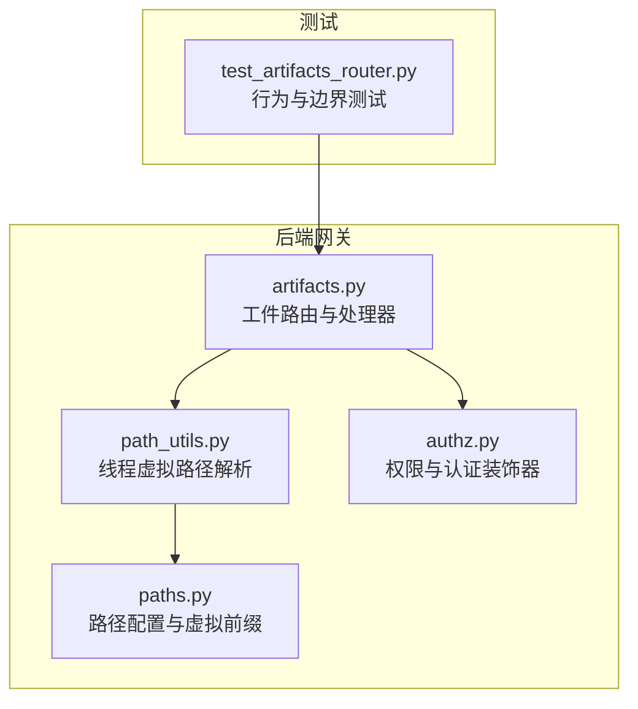
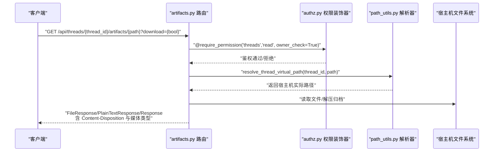
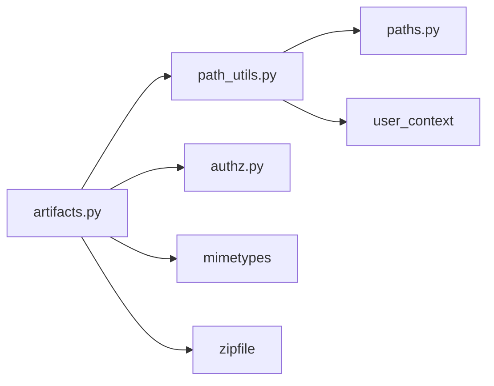

# 工件访问 API

<cite>
**本文引用的文件**
- [artifacts.py](file://backend/app/gateway/routers/artifacts.py)
- [path_utils.py](file://backend/app/gateway/path_utils.py)
- [paths.py](file://backend/packages/harness/deerflow/config/paths.py)
- [authz.py](file://backend/app/gateway/authz.py)
- [test_artifacts_router.py](file://backend/tests/test_artifacts_router.py)
</cite>

## 目录
1. [简介](#简介)
2. [项目结构](#项目结构)
3. [核心组件](#核心组件)
4. [架构总览](#架构总览)
5. [详细组件分析](#详细组件分析)
6. [依赖分析](#依赖分析)
7. [性能考虑](#性能考虑)
8. [故障排查指南](#故障排查指南)
9. [结论](#结论)
10. [附录](#附录)

## 简介
本文件为“工件访问 API”的权威技术文档，聚焦于通过代理运行时生成并保存在沙箱中的工件文件的获取与下载。重点覆盖以下内容：
- 接口定义：GET /api/threads/{thread_id}/artifacts/{path}
- 虚拟路径映射机制与标准目录（如 /mnt/user-data/outputs/、/mnt/user-data/uploads/）
- 下载参数 download=true 的行为与 Content-Disposition 头部处理
- 安全访问控制、权限校验与访问日志
- 文件类型识别、内容类型设置与浏览器兼容性策略
- 工件管理最佳实践（命名规范、存储组织、清理策略）

## 项目结构
工件访问 API 的实现位于后端网关路由层，围绕 FastAPI 路由器构建，并通过授权中间件与路径解析工具完成安全与定位能力。

图表来源
- [artifacts.py:1-184](file://backend/app/gateway/routers/artifacts.py#L1-L184)
- [path_utils.py:1-30](file://backend/app/gateway/path_utils.py#L1-L30)
- [paths.py:1-351](file://backend/packages/harness/deerflow/config/paths.py#L1-L351)
- [authz.py:1-302](file://backend/app/gateway/authz.py#L1-L302)
- [test_artifacts_router.py:1-105](file://backend/tests/test_artifacts_router.py#L1-L105)

章节来源
- [artifacts.py:1-184](file://backend/app/gateway/routers/artifacts.py#L1-L184)
- [path_utils.py:1-30](file://backend/app/gateway/path_utils.py#L1-L30)
- [paths.py:1-351](file://backend/packages/harness/deerflow/config/paths.py#L1-L351)
- [authz.py:1-302](file://backend/app/gateway/authz.py#L1-L302)
- [test_artifacts_router.py:1-105](file://backend/tests/test_artifacts_router.py#L1-L105)

## 核心组件
- 工件路由与处理器：提供 GET /api/threads/{thread_id}/artifacts/{path} 端点，负责根据请求参数与文件类型返回合适的响应（内联显示或强制下载），并处理 .skill 归档内的文件提取。
- 路径解析工具：将沙箱内虚拟路径（如 /mnt/user-data/outputs/...）解析为宿主机实际路径，同时进行路径穿越检测与安全限制。
- 路径配置：定义虚拟路径前缀与各子目录（outputs、uploads、workspace）在宿主机上的对应位置，确保跨平台路径风格一致。
- 权限与认证：通过 require_permission 装饰器对资源访问进行权限校验，并支持所有者检查（owner_check）以限定线程数据的可见范围。

章节来源
- [artifacts.py:80-184](file://backend/app/gateway/routers/artifacts.py#L80-L184)
- [path_utils.py:11-30](file://backend/app/gateway/path_utils.py#L11-L30)
- [paths.py:8-351](file://backend/packages/harness/deerflow/config/paths.py#L8-L351)
- [authz.py:197-302](file://backend/app/gateway/authz.py#L197-L302)

## 架构总览
下图展示从客户端到工件文件的完整访问链路，包括权限校验、路径解析与内容分发。

图表来源
- [artifacts.py:80-184](file://backend/app/gateway/routers/artifacts.py#L80-L184)
- [authz.py:197-302](file://backend/app/gateway/authz.py#L197-L302)
- [path_utils.py:11-30](file://backend/app/gateway/path_utils.py#L11-L30)

## 详细组件分析

### 接口定义与行为
- 路径：GET /api/threads/{thread_id}/artifacts/{path}
- 查询参数：
  - download：布尔值，true 时强制以附件形式下载；默认 false。
- 响应类型：
  - 内联纯文本：当文件为文本类型且未指定 download=true 时，返回 PlainTextResponse。
  - 二进制/未知类型：默认以 Response 返回，Content-Disposition 为 inline。
  - 强制下载：当 download=true 或文件类型属于“活跃内容”（HTML/XHTML/SVG）时，返回 FileResponse 并设置 Content-Disposition 为 attachment。
- 特殊处理：
  - 支持从 .skill 归档中提取内部文件，自动识别 MIME 类型并缓存 ZIP 访问结果（私有缓存 5 分钟）。

章节来源
- [artifacts.py:80-184](file://backend/app/gateway/routers/artifacts.py#L80-L184)

### 虚拟路径映射与标准目录
- 虚拟路径前缀：/mnt/user-data
- 对应宿主机目录（示例）：
  - /mnt/user-data/outputs/ → 线程工件输出目录
  - /mnt/user-data/uploads/ → 用户上传目录
  - /mnt/user-data/workspace/ → 工作区目录
- 解析规则：
  - 必须以 /mnt/user-data 开头，严格匹配段边界，防止前缀冲突。
  - 绝对路径回溯检测，若解析结果超出线程 user-data 根目录则拒绝。
- 跨平台路径：
  - 在 Windows/Docker 环境下保留原生路径风格，避免混合分隔符导致挂载异常。

章节来源
- [paths.py:8-351](file://backend/packages/harness/deerflow/config/paths.py#L8-L351)
- [path_utils.py:11-30](file://backend/app/gateway/path_utils.py#L11-L30)

### 下载参数与 Content-Disposition 处理
- download=true：强制附件下载，适用于非活跃内容。
- 活跃内容（HTML/XHTML/SVG）：无论 download 参数如何，均强制下载，避免脚本在应用同源上下文中执行的风险。
- Content-Disposition 编码：采用 RFC 5987 规范对文件名进行编码，确保多语言文件名在不同浏览器下的兼容性。

章节来源
- [artifacts.py:17-33](file://backend/app/gateway/routers/artifacts.py#L17-L33)
- [artifacts.py:80-184](file://backend/app/gateway/routers/artifacts.py#L80-L184)

### 文件类型识别与内容类型设置
- MIME 类型推断：基于文件扩展名与内容采样（检测空字节）综合判断。
- 文本文件判定：读取文件头部样本，若不包含空字节则视为文本，优先以纯文本方式返回。
- 浏览器兼容性：
  - 纯文本：text/plain 或具体 MIME，直接内联显示。
  - 二进制/未知：以二进制流返回，浏览器通常触发下载。
  - 活跃内容：强制下载，避免 XSS 风险。

章节来源
- [artifacts.py:36-45](file://backend/app/gateway/routers/artifacts.py#L36-L45)
- [artifacts.py:17-21](file://backend/app/gateway/routers/artifacts.py#L17-L21)

### 安全访问控制、权限验证与访问日志
- 权限模型：
  - threads:read：允许读取线程工件。
  - owner_check：启用后要求当前用户为线程所有者，保障数据隔离。
- 认证与上下文：
  - require_auth 装饰器负责解析 JWT 并注入 AuthContext。
  - 未认证请求返回 401。
- 访问日志：
  - 路由中包含路径解析信息的日志记录，便于审计与问题定位。

章节来源
- [authz.py:47-95](file://backend/app/gateway/authz.py#L47-L95)
- [authz.py:197-302](file://backend/app/gateway/authz.py#L197-L302)
- [artifacts.py:159](file://backend/app/gateway/routers/artifacts.py#L159)

### .skill 归档文件支持
- 路径格式：{virtual_path}.skill/{internal_path}
- 行为：
  - 解析 .skill 文件的实际宿主机路径。
  - 在 ZIP 内查找目标文件，支持顶层目录前缀变体。
  - 返回内容按 MIME 类型与下载标志决定响应类型与头部。

章节来源
- [artifacts.py:119-156](file://backend/app/gateway/routers/artifacts.py#L119-L156)

### 浏览器兼容性与下载体验
- Content-Disposition 使用 UTF-8'' 编码，适配多语言文件名。
- 对于非文本类型但看起来像文本的文件，优先以纯文本返回，提升可读性。
- 对于无法解码为 UTF-8 的内容，回退为二进制流返回。

章节来源
- [artifacts.py:140-155](file://backend/app/gateway/routers/artifacts.py#L140-L155)

## 依赖分析
- artifacts.py 依赖：
  - path_utils.resolve_thread_virtual_path：路径解析与安全校验。
  - authz.require_permission：权限与所有者检查。
  - mimetypes：MIME 类型推断。
  - zipfile：.skill 归档文件提取。
- path_utils.py 依赖：
  - paths.get_paths：全局路径配置单例。
  - deerflow.runtime.user_context.get_effective_user_id：用户上下文用于用户隔离。
- 路径配置 paths.py：
  - 定义虚拟路径前缀与各子目录映射，提供宿主机路径拼接与 Windows 路径风格保持。

图表来源
- [artifacts.py:10-11](file://backend/app/gateway/routers/artifacts.py#L10-L11)
- [path_utils.py:7-8](file://backend/app/gateway/path_utils.py#L7-L8)
- [paths.py:6-7](file://backend/packages/harness/deerflow/config/paths.py#L6-L7)

章节来源
- [artifacts.py:10-11](file://backend/app/gateway/routers/artifacts.py#L10-L11)
- [path_utils.py:7-8](file://backend/app/gateway/path_utils.py#L7-L8)
- [paths.py:6-7](file://backend/packages/harness/deerflow/config/paths.py#L6-L7)

## 性能考虑
- ZIP 文件缓存：对 .skill 归档内的文件提取设置私有缓存（5 分钟），减少重复解压开销。
- 内容类型判定：先基于扩展名，再进行内容采样，平衡准确性与性能。
- 文件读取策略：文本文件优先尝试 UTF-8 解码，失败时回退为二进制流，避免不必要的错误重试。

章节来源
- [artifacts.py:142-143](file://backend/app/gateway/routers/artifacts.py#L142-L143)
- [artifacts.py:177-181](file://backend/app/gateway/routers/artifacts.py#L177-L181)

## 故障排查指南
- 400 错误（路径无效或不是文件）：
  - 检查请求路径是否以 /mnt/user-data 开头，且相对路径合法。
  - 确认目标为文件而非目录。
- 403 错误（路径穿越）：
  - 虚拟路径必须严格匹配 /mnt/user-data 段边界，避免前缀冲突。
  - 确保线程 ID 与用户 ID 合法（仅允许字母、数字、连字符与下划线）。
- 404 错误（文件不存在）：
  - .skill 归档内文件需使用 {archive}.skill/{internal_path} 格式。
  - 确认归档内存在该内部路径。
- 401/403（未认证/权限不足）：
  - 确保携带有效令牌并通过 require_auth。
  - owner_check 启用时，确认当前用户为线程所有者。
- 下载行为不符合预期：
  - 活跃内容（HTML/XHTML/SVG）会强制下载，与 download 参数无关。
  - 非活跃内容可通过 download=false 实现内联显示。

章节来源
- [path_utils.py:25-29](file://backend/app/gateway/path_utils.py#L25-L29)
- [paths.py:20-31](file://backend/packages/harness/deerflow/config/paths.py#L20-L31)
- [artifacts.py:105-117](file://backend/app/gateway/routers/artifacts.py#L105-L117)
- [test_artifacts_router.py:45-70](file://backend/tests/test_artifacts_router.py#L45-L70)
- [test_artifacts_router.py:72-87](file://backend/tests/test_artifacts_router.py#L72-L87)
- [test_artifacts_router.py:89-105](file://backend/tests/test_artifacts_router.py#L89-L105)

## 结论
工件访问 API 通过严格的路径解析与权限控制，结合灵活的内容类型识别与下载策略，在保证安全性的同时提供了良好的用户体验。建议在生产环境中：
- 明确区分 outputs 与 uploads 目录用途，避免混用。
- 对外暴露的归档文件（.skill）应遵循最小权限原则。
- 使用 download=true 作为默认策略，除非明确需要内联显示文本类内容。
- 定期清理过期工件，避免磁盘空间膨胀。

## 附录

### API 定义速览
- 方法与路径：GET /api/threads/{thread_id}/artifacts/{path}
- 查询参数：
  - download：布尔值，控制是否强制下载
- 成功响应：
  - 内联文本：200 OK + text/plain 或具体文本 MIME
  - 二进制：200 OK + application/octet-stream 或具体 MIME
  - 附件下载：200 OK + Content-Disposition: attachment
- 错误响应：
  - 400：路径无效或目标非文件
  - 403：路径穿越或权限不足
  - 404：文件不存在或 .skill 内部文件缺失
  - 401：未认证

章节来源
- [artifacts.py:80-184](file://backend/app/gateway/routers/artifacts.py#L80-L184)

### 虚拟路径与宿主机映射对照
- /mnt/user-data/outputs/ → 线程工件输出目录
- /mnt/user-data/uploads/ → 用户上传目录
- /mnt/user-data/workspace/ → 工作区目录

章节来源
- [paths.py:62-232](file://backend/packages/harness/deerflow/config/paths.py#L62-L232)

### 最佳实践清单
- 文件命名：
  - 使用小写字母、数字、短横线与下划线，避免空格与特殊字符。
  - 为可读性与国际化，优先使用 ASCII 字符集。
- 存储组织：
  - 输出文件统一存放于 outputs 目录，按任务/日期/类型分层。
  - 上传文件统一存放于 uploads 目录，避免与工件混淆。
- 清理策略：
  - 设置定期清理任务，删除超过保留期限的工件。
  - 对 .skill 归档中的临时文件进行版本化管理，避免占用过多空间。
- 安全建议：
  - 活跃内容一律强制下载，禁止内联显示。
  - 所有访问均启用 owner_check，确保线程级数据隔离。
  - 对外导出的工件应进行病毒扫描与内容审查。