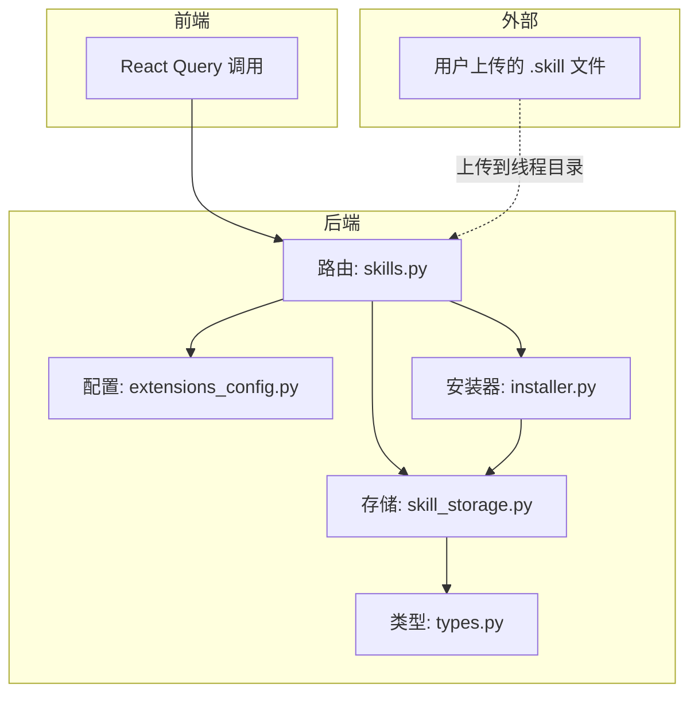
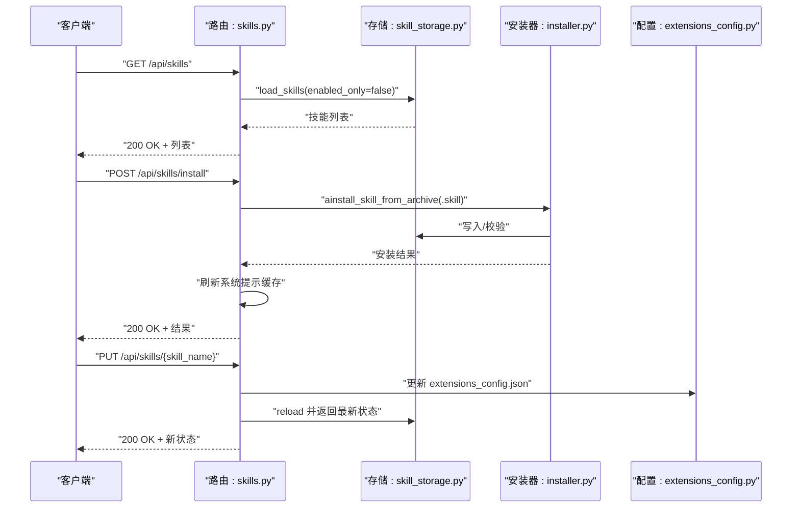
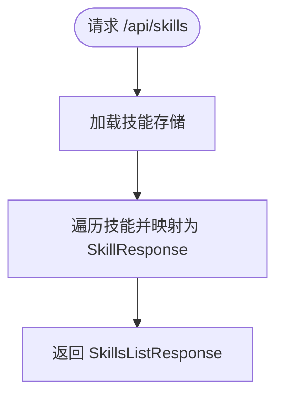
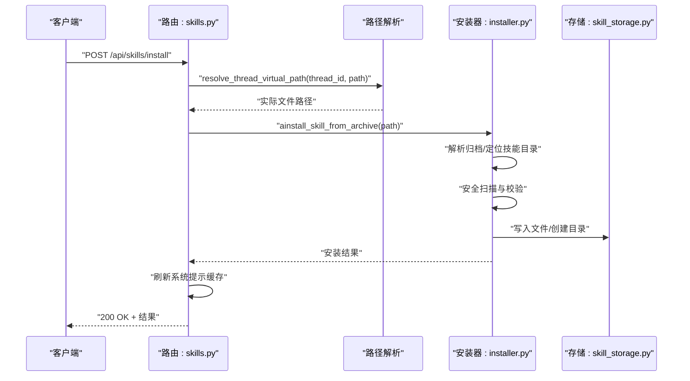
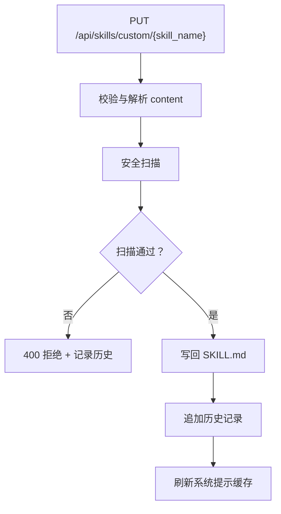
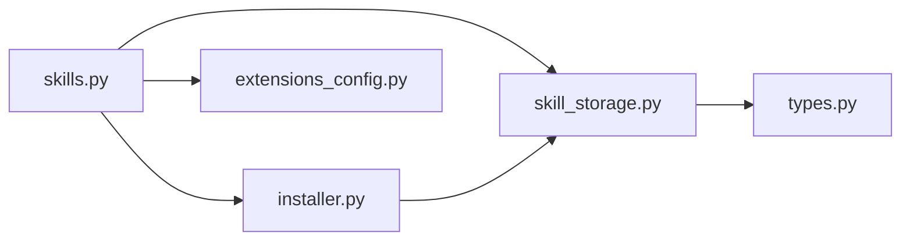

# 技能管理 API

<cite>
**本文引用的文件**
- [skills.py](file://backend/app/gateway/routers/skills.py)
- [extensions_config.py](file://backend/packages/harness/deerflow/config/extensions_config.py)
- [installer.py](file://backend/packages/harness/deerflow/skills/installer.py)
- [storage.py](file://backend/packages/harness/deerflow/skills/storage/skill_storage.py)
- [types.py](file://backend/packages/harness/deerflow/skills/types.py)
- [package_skill.py](file://skills/public/skill-creator/scripts/package_skill.py)
- [SKILL.md（bootstrap）](file://skills/public/bootstrap/SKILL.md)
- [SKILL.md（chart-visualization）](file://skills/public/chart-visualization/SKILL.md)
- [test_skills_archive_root.py](file://backend/tests/test_skills_archive_root.py)
</cite>

## 目录
1. [简介](#简介)
2. [项目结构](#项目结构)
3. [核心组件](#核心组件)
4. [架构总览](#架构总览)
5. [详细组件分析](#详细组件分析)
6. [依赖分析](#依赖分析)
7. [性能考虑](#性能考虑)
8. [故障排查指南](#故障排查指南)
9. [结论](#结论)
10. [附录](#附录)

## 简介
本文件为“技能管理 API”的权威技术文档，覆盖以下能力：
- 列出所有技能与技能详情查询
- 启用/禁用技能
- 安装自定义技能（从 .skill 文件）
- 自定义技能内容查看、编辑、删除、历史与回滚
- .skill 文件打包规范与安装流程
- 安全扫描与错误处理机制
- 技能开发最佳实践与调试技巧

本 API 基于 FastAPI 路由实现，数据模型与存储抽象位于后端包中，前端通过 React Query 进行调用。

## 项目结构
与技能管理相关的核心位置如下：
- 后端路由：backend/app/gateway/routers/skills.py
- 技能配置：backend/packages/harness/deerflow/config/extensions_config.py
- 技能安装器：backend/packages/harness/deerflow/skills/installer.py
- 技能存储抽象：backend/packages/harness/deerflow/skills/storage/skill_storage.py
- 技能类型与常量：backend/packages/harness/deerflow/skills/types.py
- 技能打包工具：skills/public/skill-creator/scripts/package_skill.py
- 示例技能文档：skills/public/bootstrap/SKILL.md、skills/public/chart-visualization/SKILL.md
- 安装归档解析测试：backend/tests/test_skills_archive_root.py

图表来源
- [skills.py:1-353](file://backend/app/gateway/routers/skills.py#L1-L353)
- [extensions_config.py:1-120](file://backend/packages/harness/deerflow/config/extensions_config.py#L1-L120)
- [installer.py:1-220](file://backend/packages/harness/deerflow/skills/installer.py#L1-L220)
- [storage.py:1-220](file://backend/packages/harness/deerflow/skills/storage/skill_storage.py#L1-L220)
- [types.py:1-80](file://backend/packages/harness/deerflow/skills/types.py#L1-L80)

章节来源
- [skills.py:1-353](file://backend/app/gateway/routers/skills.py#L1-L353)

## 核心组件
- 路由层（FastAPI）：提供技能列表、详情、启用/禁用、安装、自定义技能 CRUD 与回滚等接口。
- 存储层（SkillStorage 抽象）：负责读写 SKILL.md、历史记录、自定义技能目录布局与校验。
- 安装器（SkillInstaller）：负责 .skill 归档解压、目录定位、安全扫描与写入。
- 配置层（ExtensionsConfig/SkillStateConfig）：维护技能启用状态与 MCP 服务器配置。
- 类型与常量（Skill、SkillCategory、SKILL_MD_FILE）：统一技能元数据与文件名约定。

章节来源
- [skills.py:23-76](file://backend/app/gateway/routers/skills.py#L23-L76)
- [storage.py:17-121](file://backend/packages/harness/deerflow/skills/storage/skill_storage.py#L17-L121)
- [installer.py:160-192](file://backend/packages/harness/deerflow/skills/installer.py#L160-L192)
- [extensions_config.py:1-120](file://backend/packages/harness/deerflow/config/extensions_config.py#L1-L120)
- [types.py:1-80](file://backend/packages/harness/deerflow/skills/types.py#L1-L80)

## 架构总览
下图展示技能管理 API 的关键交互流程：客户端请求经路由层进入，路由层委托存储与安装器完成业务逻辑，并在必要时更新扩展配置与系统提示缓存。

图表来源
- [skills.py:88-126](file://backend/app/gateway/routers/skills.py#L88-L126)
- [skills.py:304-353](file://backend/app/gateway/routers/skills.py#L304-L353)
- [installer.py:160-192](file://backend/packages/harness/deerflow/skills/installer.py#L160-L192)
- [storage.py:113-121](file://backend/packages/harness/deerflow/skills/storage/skill_storage.py#L113-L121)
- [extensions_config.py:1-120](file://backend/packages/harness/deerflow/config/extensions_config.py#L1-L120)

## 详细组件分析

### 接口总览与数据模型
- GET /api/skills
  - 返回：包含技能数组的列表响应对象
  - 字段：name、description、license、category、enabled
- GET /api/skills/{skill_name}
  - 返回：单个技能的简要信息
- PUT /api/skills/{skill_name}
  - 请求体：enabled（布尔）
  - 行为：更新 extensions_config.json 中的技能状态
- POST /api/skills/install
  - 请求体：thread_id（字符串）、path（字符串，指向 .skill 文件的虚拟路径）
  - 行为：从线程用户数据目录中定位 .skill 文件并安装
- GET /api/skills/custom/{skill_name}
  - 返回：技能基本信息 + raw SKILL.md 内容
- PUT /api/skills/custom/{skill_name}
  - 请求体：content（字符串，新的 SKILL.md 内容）
  - 行为：安全扫描、写回、记录历史
- DELETE /api/skills/custom/{skill_name}
  - 行为：删除自定义技能并记录历史
- GET /api/skills/custom/{skill_name}/history
  - 返回：历史记录数组
- POST /api/skills/custom/{skill_name}/rollback
  - 请求体：history_index（整数，默认最近一次）

章节来源
- [skills.py:23-76](file://backend/app/gateway/routers/skills.py#L23-L76)
- [skills.py:88-126](file://backend/app/gateway/routers/skills.py#L88-L126)
- [skills.py:281-353](file://backend/app/gateway/routers/skills.py#L281-L353)

### GET /api/skills：技能列表
- 功能：返回所有技能（公共与自定义），不区分启用状态
- 数据模型：SkillsListResponse.skills 为 SkillResponse 数组
- 字段说明：
  - name：技能名称
  - description：技能描述
  - license：许可证（可空）
  - category：技能分类（public 或 custom）
  - enabled：是否启用（默认启用）

图表来源
- [skills.py:88-101](file://backend/app/gateway/routers/skills.py#L88-L101)
- [skills.py:77-86](file://backend/app/gateway/routers/skills.py#L77-L86)

章节来源
- [skills.py:88-101](file://backend/app/gateway/routers/skills.py#L88-L101)
- [skills.py:23-38](file://backend/app/gateway/routers/skills.py#L23-L38)

### GET /api/skills/{skill_name}：技能详情
- 功能：按名称返回技能简要信息
- 行为：在已加载的技能集合中查找匹配项，未找到则 404
- 返回字段同上（不含 content）

章节来源
- [skills.py:281-302](file://backend/app/gateway/routers/skills.py#L281-L302)
- [skills.py:23-32](file://backend/app/gateway/routers/skills.py#L23-L32)

### PUT /api/skills/{skill_name}：启用/禁用技能
- 请求体：enabled（布尔）
- 行为：
  - 更新 extensions_config.json 中对应技能的 enabled 字段
  - 重新加载配置并刷新系统提示缓存
  - 返回最新技能状态
- 注意：仅影响技能启用状态，不影响 .skill 文件或自定义技能内容

章节来源
- [skills.py:304-353](file://backend/app/gateway/routers/skills.py#L304-L353)
- [extensions_config.py:1-120](file://backend/packages/harness/deerflow/config/extensions_config.py#L1-L120)

### POST /api/skills/install：安装 .skill 文件
- 请求体字段：
  - thread_id：线程标识符
  - path：.skill 文件的虚拟路径（例如 mnt/user-data/outputs/my-skill.skill）
- 行为：
  - 解析虚拟路径为实际文件路径
  - 解压 .skill（ZIP）归档，定位内部技能目录
  - 安全扫描与校验（禁止嵌套 SKILL.md 等）
  - 写入公共或自定义目录（依据命名与规则）
  - 刷新系统提示缓存
- 成功响应：success、skill_name、message
- 可能错误：
  - 404：找不到文件或归档无效
  - 409：技能已存在
  - 400：参数错误或安全扫描阻断
  - 500：其他异常

图表来源
- [skills.py:103-126](file://backend/app/gateway/routers/skills.py#L103-L126)
- [installer.py:160-192](file://backend/packages/harness/deerflow/skills/installer.py#L160-L192)

章节来源
- [skills.py:103-126](file://backend/app/gateway/routers/skills.py#L103-L126)
- [installer.py:160-192](file://backend/packages/harness/deerflow/skills/installer.py#L160-L192)
- [test_skills_archive_root.py:1-41](file://backend/tests/test_skills_archive_root.py#L1-L41)

### 自定义技能：查看、编辑、删除、历史与回滚
- 查看内容：GET /api/skills/custom/{skill_name}
  - 返回：基本信息 + raw SKILL.md 内容
- 编辑内容：PUT /api/skills/custom/{skill_name}
  - 请求体：content（新 SKILL.md 内容）
  - 行为：安全扫描、写回、记录历史
- 删除：DELETE /api/skills/custom/{skill_name}
  - 行为：删除并记录历史
- 历史：GET /api/skills/custom/{skill_name}/history
  - 返回：历史记录数组
- 回滚：POST /api/skills/custom/{skill_name}/rollback
  - 请求体：history_index（默认最近一次）
  - 行为：基于历史记录恢复内容，再次进行安全扫描

图表来源
- [skills.py:154-189](file://backend/app/gateway/routers/skills.py#L154-L189)
- [skills.py:234-279](file://backend/app/gateway/routers/skills.py#L234-L279)

章节来源
- [skills.py:138-189](file://backend/app/gateway/routers/skills.py#L138-L189)
- [skills.py:219-279](file://backend/app/gateway/routers/skills.py#L219-L279)

### .skill 文件结构与安装流程
- .skill 实际为 ZIP 归档，内部包含技能目录与 SKILL.md
- 安装器会：
  - 解析归档根目录，忽略隐藏顶层条目（如 __MACOSX、.DS_Store）
  - 定位技能目录（要求至少包含一个非元数据文件）
  - 对嵌套 SKILL.md 进行安全检查（不允许）
  - 将内容写入公共或自定义目录
- 打包工具：package_skill.py
  - 将技能目录压缩为 .skill 文件，排除构建产物
  - 支持指定输出目录

章节来源
- [test_skills_archive_root.py:22-41](file://backend/tests/test_skills_archive_root.py#L22-L41)
- [package_skill.py:87-136](file://skills/public/skill-creator/scripts/package_skill.py#L87-L136)
- [installer.py:160-192](file://backend/packages/harness/deerflow/skills/installer.py#L160-L192)

### 技能元数据与示例
- 公共技能示例：bootstrap、chart-visualization
  - bootstrap：包含对话引导、生成规则与模板引用
  - chart-visualization：包含图表类型选择、参数提取与执行命令示例
- 元数据字段（以 SKILL.md 头部为准）：
  - name：技能名称
  - description：技能描述
  - compatibility：兼容性声明（示例：nodejs 版本要求）

章节来源
- [SKILL.md（bootstrap）:1-95](file://skills/public/bootstrap/SKILL.md#L1-L95)
- [SKILL.md（chart-visualization）:1-73](file://skills/public/chart-visualization/SKILL.md#L1-L73)

## 依赖分析
- 路由依赖存储与安装器，安装流程依赖路径解析与安全扫描
- 启用/禁用依赖扩展配置文件（extensions_config.json）
- 自定义技能编辑依赖安全扫描与历史记录

图表来源
- [skills.py:1-353](file://backend/app/gateway/routers/skills.py#L1-L353)
- [storage.py:1-220](file://backend/packages/harness/deerflow/skills/storage/skill_storage.py#L1-L220)
- [installer.py:1-220](file://backend/packages/harness/deerflow/skills/installer.py#L1-L220)
- [extensions_config.py:1-120](file://backend/packages/harness/deerflow/config/extensions_config.py#L1-L120)
- [types.py:1-80](file://backend/packages/harness/deerflow/skills/types.py#L1-L80)

章节来源
- [skills.py:1-353](file://backend/app/gateway/routers/skills.py#L1-L353)

## 性能考虑
- 列表与详情接口均从内存中的技能存储加载，复杂度与技能数量线性相关
- 安装流程涉及磁盘写入与 ZIP 解压，建议在后台异步执行并返回任务 ID（当前实现为同步）
- 安全扫描可能引入额外延迟，建议在 CI/CD 阶段预扫描
- 建议对频繁变更的技能启用状态进行缓存，减少重复写入配置文件

## 故障排查指南
- 404：技能不存在或 .skill 文件路径无效
  - 检查 thread_id 与 path 是否正确
  - 确认 .skill 文件存在于线程用户数据目录
- 409：技能已存在
  - 更换技能名称或删除旧版本后再安装
- 400：参数错误或安全扫描阻断
  - 检查 SKILL.md 内容是否符合规范
  - 确保未包含嵌套 SKILL.md
- 500：内部错误
  - 查看后端日志定位具体异常
  - 确认磁盘权限与存储空间

章节来源
- [skills.py:115-125](file://backend/app/gateway/routers/skills.py#L115-L125)
- [installer.py:160-192](file://backend/packages/harness/deerflow/skills/installer.py#L160-L192)

## 结论
技能管理 API 提供了完整的技能生命周期管理能力：发现、启用/禁用、安装、自定义编辑与回滚。通过 .skill 归档与安全扫描机制，确保安装过程可控与可审计；通过历史记录与回滚接口，保障自定义技能的可维护性。建议在生产环境中配合 CI/CD 进行预扫描与打包，提升稳定性与安全性。

## 附录

### API 定义速查
- GET /api/skills
  - 响应：SkillsListResponse
  - 字段：skills[].name, description, license, category, enabled
- GET /api/skills/{skill_name}
  - 响应：SkillResponse
- PUT /api/skills/{skill_name}
  - 请求体：{ enabled: boolean }
  - 响应：SkillResponse
- POST /api/skills/install
  - 请求体：{ thread_id: string, path: string }
  - 响应：{ success: boolean, skill_name: string, message: string }
- GET /api/skills/custom/{skill_name}
  - 响应：{ name, description, license, category, enabled, content: string }
- PUT /api/skills/custom/{skill_name}
  - 请求体：{ content: string }
  - 响应：{ name, description, license, category, enabled, content: string }
- DELETE /api/skills/custom/{skill_name}
  - 响应：{ success: true }
- GET /api/skills/custom/{skill_name}/history
  - 响应：{ history: array }
- POST /api/skills/custom/{skill_name}/rollback
  - 请求体：{ history_index?: number }
  - 响应：{ name, description, license, category, enabled, content: string }

### .skill 文件规范
- 归档格式：ZIP
- 必须包含 SKILL.md 作为入口
- 忽略隐藏顶层条目（如 __MACOSX、.DS_Store）
- 不允许嵌套 SKILL.md
- 打包脚本：package_skill.py

章节来源
- [test_skills_archive_root.py:22-41](file://backend/tests/test_skills_archive_root.py#L22-L41)
- [package_skill.py:87-136](file://skills/public/skill-creator/scripts/package_skill.py#L87-L136)
- [installer.py:160-192](file://backend/packages/harness/deerflow/skills/installer.py#L160-L192)

### 技能开发最佳实践
- 使用一致的 SKILL.md 头部字段（name、description、compatibility）
- 在本地先运行安全扫描与打包脚本，避免线上失败
- 自定义技能尽量模块化，便于回滚与复用
- 为每个技能编写最小可运行示例，便于集成测试
- 使用历史与回滚接口进行渐进式迭代

### 调试技巧
- 通过 GET /api/skills/custom/{skill_name}/history 查看变更轨迹
- 使用 POST /api/skills/custom/{skill_name}/rollback 恢复到上一版本
- 在安装前打印 thread_id 与 path，确认路径解析正确
- 关注后端日志中的安全扫描决策与原因