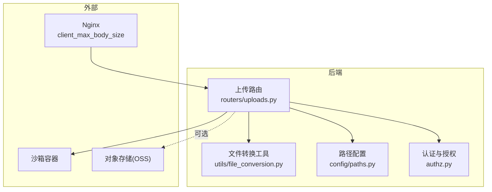
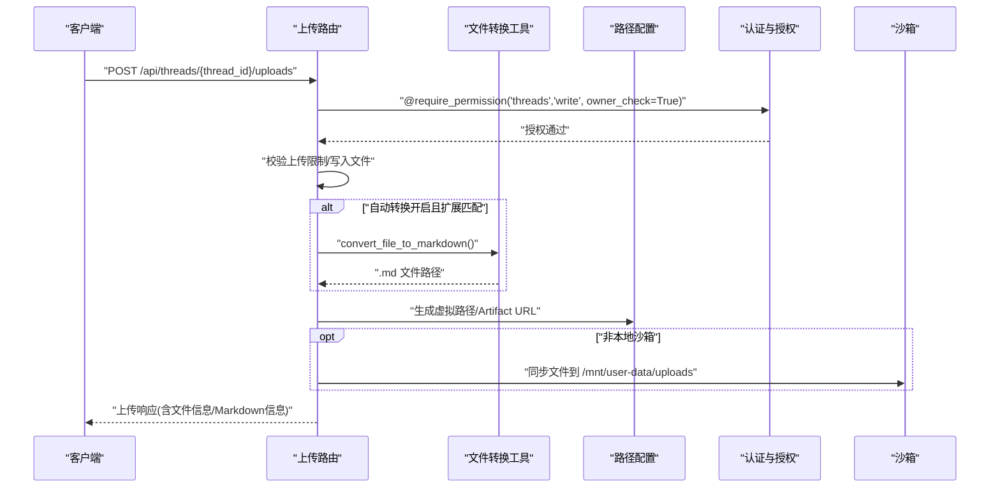
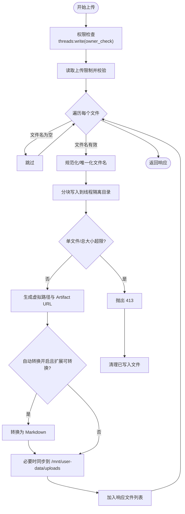
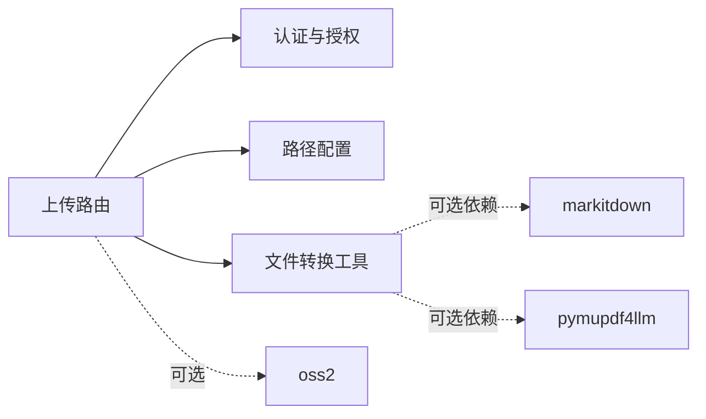

# 文件上传 API

<cite>
**本文引用的文件**
- [文件上传功能](file://backend/docs/FILE_UPLOAD.md)
- [上传路由](file://backend/app/gateway/routers/uploads.py)
- [文件转换工具](file://backend/packages/harness/deerflow/utils/file_conversion.py)
- [路径配置](file://backend/packages/harness/deerflow/config/paths.py)
- [认证与授权](file://backend/app/gateway/authz.py)
- [OSS 上传工具](file://backend/deerflow/utils/oss_upload.py)
</cite>

## 目录
1. [简介](#简介)
2. [项目结构](#项目结构)
3. [核心组件](#核心组件)
4. [架构总览](#架构总览)
5. [详细组件分析](#详细组件分析)
6. [依赖分析](#依赖分析)
7. [性能考量](#性能考量)
8. [故障排查指南](#故障排查指南)
9. [结论](#结论)
10. [附录](#附录)

## 简介
本文件上传 API 提供了完整的文件上传、列表查看、删除能力，并支持将 Office 文档与 PDF 自动转换为 Markdown。所有文件均按线程隔离存储，Agent 可在沙箱中通过虚拟路径访问上传文件。本文档覆盖：
- POST /api/threads/{thread_id}/uploads：multipart/form-data 上传、自动转换、虚拟路径映射与 Artifact URL 生成
- GET /api/threads/{thread_id}/uploads/list：列出上传文件及扩展信息
- DELETE /api/threads/{thread_id}/uploads/{filename}：删除指定文件
- 权限控制、安全隔离、错误处理、批量操作最佳实践

## 项目结构
围绕文件上传的关键模块与职责：
- 上传路由：定义端点、参数校验、权限控制、文件写入与转换、沙箱同步
- 文件转换工具：PDF/PPT/Excel/Word 转 Markdown 的策略与实现
- 路径配置：线程目录布局、虚拟路径前缀、宿主与沙箱路径映射
- 认证与授权：基于资源与动作的权限检查，支持拥有者校验
- OSS 上传工具：对象存储上传辅助（与文件上传 API 并行）

图表来源
- [上传路由:170-343](file://backend/app/gateway/routers/uploads.py#L170-L343)
- [文件转换工具:1-316](file://backend/packages/harness/deerflow/utils/file_conversion.py#L1-L316)
- [路径配置:62-351](file://backend/packages/harness/deerflow/config/paths.py#L62-L351)
- [认证与授权:197-302](file://backend/app/gateway/authz.py#L197-L302)

章节来源
- [上传路由:1-343](file://backend/app/gateway/routers/uploads.py#L1-L343)
- [文件转换工具:1-316](file://backend/packages/harness/deerflow/utils/file_conversion.py#L1-L316)
- [路径配置:1-351](file://backend/packages/harness/deerflow/config/paths.py#L1-L351)
- [认证与授权:1-302](file://backend/app/gateway/authz.py#L1-L302)

## 核心组件
- 上传路由（FastAPI 路由器）
  - 定义三个端点：上传、查询限制、列表、删除
  - 应用级上传限制读取与校验
  - 文件写入、重命名、清理回滚
  - 可选自动转换为 Markdown
  - 沙箱同步与权限控制
- 文件转换工具
  - 支持的扩展：PDF、PPT、PPTX、XLS、XLSX、DOC、DOCX
  - PDF 两阶段转换策略（pymupdf4llm 优先，短文本回退 MarkItDown）
  - 大文件异步转换，避免阻塞事件循环
- 路径配置
  - 线程隔离目录：threads/{thread_id}/user-data/uploads
  - 虚拟路径前缀：/mnt/user-data
  - 宿主与沙箱路径映射、解析与安全校验
- 认证与授权
  - threads:read/write/delete 权限
  - 拥有者校验（owner_check），删除端点要求文件存在（require_existing）
- OSS 上传工具
  - 阿里云 OSS 上传封装，便于将文件上传至云端并返回访问 URL

章节来源
- [上传路由:170-343](file://backend/app/gateway/routers/uploads.py#L170-L343)
- [文件转换工具:26-168](file://backend/packages/harness/deerflow/utils/file_conversion.py#L26-L168)
- [路径配置:62-351](file://backend/packages/harness/deerflow/config/paths.py#L62-L351)
- [认证与授权:47-302](file://backend/app/gateway/authz.py#L47-L302)
- [OSS 上传工具:15-82](file://backend/deerflow/utils/oss_upload.py#L15-L82)

## 架构总览
文件上传从客户端到沙箱的完整流程：
- 客户端发送 multipart/form-data 到 POST /api/threads/{thread_id}/uploads
- 后端校验权限与上传限制，写入线程隔离目录
- 可选执行文档转换，生成 .md 文件
- 非本地沙箱时，将文件同步到 /mnt/user-data/uploads
- 返回包含文件信息、虚拟路径与 Artifact URL 的响应
- 列表与删除端点分别返回文件清单与删除结果

图表来源
- [上传路由:170-294](file://backend/app/gateway/routers/uploads.py#L170-L294)
- [文件转换工具:138-168](file://backend/packages/harness/deerflow/utils/file_conversion.py#L138-L168)
- [路径配置:199-205](file://backend/packages/harness/deerflow/config/paths.py#L199-L205)
- [认证与授权:197-298](file://backend/app/gateway/authz.py#L197-L298)

## 详细组件分析

### POST /api/threads/{thread_id}/uploads
- 请求格式
  - Content-Type: multipart/form-data
  - 字段：files（可多值）
- 上传限制
  - 默认最大文件数：10；单文件最大：50 MiB；总大小：100 MiB
  - 可通过配置项覆盖：uploads.max_files、uploads.max_file_size、uploads.max_total_size
- 写入与安全
  - 线程隔离目录：threads/{thread_id}/user-data/uploads
  - 文件名规范化与唯一化，防止覆盖与路径穿越
  - 单文件/总大小实时校验，超限时返回 413
- 可选自动转换
  - 当 uploads.auto_convert_documents=true 且扩展属于可转换集合时，生成同名 .md
  - PDF 采用两阶段策略：pymupdf4llm 优先，短文本回退 MarkItDown
- 沙箱同步
  - 非本地沙箱时，将文件写入 /mnt/user-data/uploads，确保 Agent 可见
  - 对于 AIO 模式，授予世界可写权限避免权限不一致
- 响应结构
  - success：是否全部成功
  - files：每个文件的信息数组
  - message：汇总信息
  - skipped_files：因不安全被跳过的文件名列表
- 关键字段说明
  - filename：最终落盘文件名
  - size：字节字符串
  - path：沙箱相对路径（宿主侧）
  - virtual_path：Agent 在沙箱内使用的虚拟路径
  - artifact_url：前端通过 HTTP 访问的 URL
  - markdown_file/markdown_path/markdown_virtual_path/markdown_artifact_url：可选的 Markdown 文件信息

图表来源
- [上传路由:170-294](file://backend/app/gateway/routers/uploads.py#L170-L294)
- [文件转换工具:138-168](file://backend/packages/harness/deerflow/utils/file_conversion.py#L138-L168)

章节来源
- [上传路由:170-294](file://backend/app/gateway/routers/uploads.py#L170-L294)
- [文件转换工具:26-168](file://backend/packages/harness/deerflow/utils/file_conversion.py#L26-L168)
- [路径配置:199-205](file://backend/packages/harness/deerflow/config/paths.py#L199-L205)
- [认证与授权:197-298](file://backend/app/gateway/authz.py#L197-L298)

### GET /api/threads/{thread_id}/uploads/list
- 权限：threads:read（owner_check）
- 行为：枚举线程隔离目录下的文件，补充虚拟路径与 Artifact URL
- 响应字段
  - files：文件对象数组
    - filename、size、path（沙箱相对宿主路径）、virtual_path、artifact_url、extension、modified
  - count：文件数量
- 注意：返回的 path 字段为沙箱相对宿主路径，便于前端与后端统一

章节来源
- [上传路由:307-324](file://backend/app/gateway/routers/uploads.py#L307-L324)

### DELETE /api/threads/{thread_id}/uploads/{filename}
- 权限：threads:delete（owner_check，require_existing）
- 行为：安全删除指定文件，若存在可转换扩展则一并清理对应 .md
- 错误码
  - 404：文件不存在
  - 400：非法路径（路径穿越检测）
  - 500：其他异常
- 安全性
  - 路径穿越与不安全路径检测
  - 删除前进行严格校验，避免误删

章节来源
- [上传路由:326-343](file://backend/app/gateway/routers/uploads.py#L326-L343)

### 虚拟路径映射与文件存储策略
- 虚拟路径前缀：/mnt/user-data
- 线程隔离目录：threads/{thread_id}/user-data/uploads
- 宿主与沙箱映射
  - 宿主：{base_dir}/threads/{thread_id}/user-data/uploads
  - 沙箱：/mnt/user-data/uploads
- 解析与校验
  - 路径解析时强制以 /mnt/user-data 开头，防止路径穿越
  - 相对路径计算基于线程根目录，超出范围即拒绝

章节来源
- [路径配置:62-351](file://backend/packages/harness/deerflow/config/paths.py#L62-L351)

### 自动转换为 Markdown 的机制
- 支持的扩展：.pdf、.ppt、.pptx、.xls、.xlsx、.doc、.docx
- PDF 转换策略
  - 优先使用 pymupdf4llm（更好标题识别、更快）
  - 输出字符密度过低（可能是图片 PDF 或加密）时回退 MarkItDown
  - 大于 1MB 的文件在后台线程转换，避免阻塞事件循环
- 转换产物
  - 生成同名 .md 文件，同时更新响应中的 Markdown 字段

章节来源
- [文件转换工具:26-168](file://backend/packages/harness/deerflow/utils/file_conversion.py#L26-L168)

### 权限控制与安全隔离
- 权限模型
  - threads:read、threads:write、threads:delete
  - owner_check：仅允许线程拥有者访问
  - require_existing：删除端点要求文件存在，防止重定向攻击
- 安全措施
  - 文件名规范化与唯一化
  - 上传限制（数量/大小）
  - 路径穿越检测与拒绝
  - 非本地沙箱时的权限修正与同步

章节来源
- [认证与授权:47-302](file://backend/app/gateway/authz.py#L47-L302)
- [上传路由:170-294](file://backend/app/gateway/routers/uploads.py#L170-L294)

## 依赖分析
- 组件耦合
  - 上传路由依赖认证授权、路径配置、文件转换工具
  - 文件转换工具独立，无 HTTP 依赖
  - 路径配置提供全局路径解析与校验
- 外部依赖
  - markitdown：通用文档转 Markdown
  - pymupdf4llm（可选）：PDF 高质量转换
  - oss2（可选）：对象存储上传

图表来源
- [上传路由:1-343](file://backend/app/gateway/routers/uploads.py#L1-L343)
- [文件转换工具:1-316](file://backend/packages/harness/deerflow/utils/file_conversion.py#L1-L316)
- [OSS 上传工具:1-82](file://backend/deerflow/utils/oss_upload.py#L1-L82)

章节来源
- [上传路由:1-343](file://backend/app/gateway/routers/uploads.py#L1-L343)
- [文件转换工具:1-316](file://backend/packages/harness/deerflow/utils/file_conversion.py#L1-L316)
- [OSS 上传工具:1-82](file://backend/deerflow/utils/oss_upload.py#L1-L82)

## 性能考量
- 分块写入：8 KiB 块读写，降低内存占用
- 大文件异步转换：超过 1MB 的文件在后台线程转换，避免阻塞事件循环
- 沙箱同步：仅在非本地沙箱时进行，减少不必要的 IO
- 上传限制：通过应用层与 Nginx client_max_body_size 双重限制，避免资源滥用

## 故障排查指南
- 上传失败
  - 检查文件大小是否超过限制
  - 确认 Gateway 服务状态与磁盘空间
  - 查看后端日志定位异常
- 文档转换失败
  - 确认 markitdown 安装
  - 某些损坏或加密文档可能无法转换，但原文件仍会保存
- Agent 看不到文件
  - 确认 UploadsMiddleware 注册与 thread_id 正确
  - 非本地沙箱需确保上传接口未报错，已完成沙箱同步
- 删除失败
  - 检查文件是否存在与路径是否合法
  - 确认拥有者权限与 require_existing 生效

章节来源
- [文件上传功能:253-275](file://backend/docs/FILE_UPLOAD.md#L253-L275)
- [上传路由:326-343](file://backend/app/gateway/routers/uploads.py#L326-L343)

## 结论
该文件上传 API 以线程隔离为核心，结合虚拟路径映射与沙箱同步，实现了安全、可控、可扩展的文件管理能力。通过可选的文档转换与严格的权限控制，既满足了 Agent 的使用需求，也兼顾了生产环境的安全与稳定性。

## 附录

### API 规范摘要
- POST /api/threads/{thread_id}/uploads
  - 请求体：multipart/form-data，字段 files（可多值）
  - 响应：包含文件信息与可选 Markdown 信息
- GET /api/threads/{thread_id}/uploads/list
  - 响应：files 数组与 count
- DELETE /api/threads/{thread_id}/uploads/{filename}
  - 响应：删除成功信息

章节来源
- [文件上传功能:15-115](file://backend/docs/FILE_UPLOAD.md#L15-L115)
- [上传路由:170-343](file://backend/app/gateway/routers/uploads.py#L170-L343)