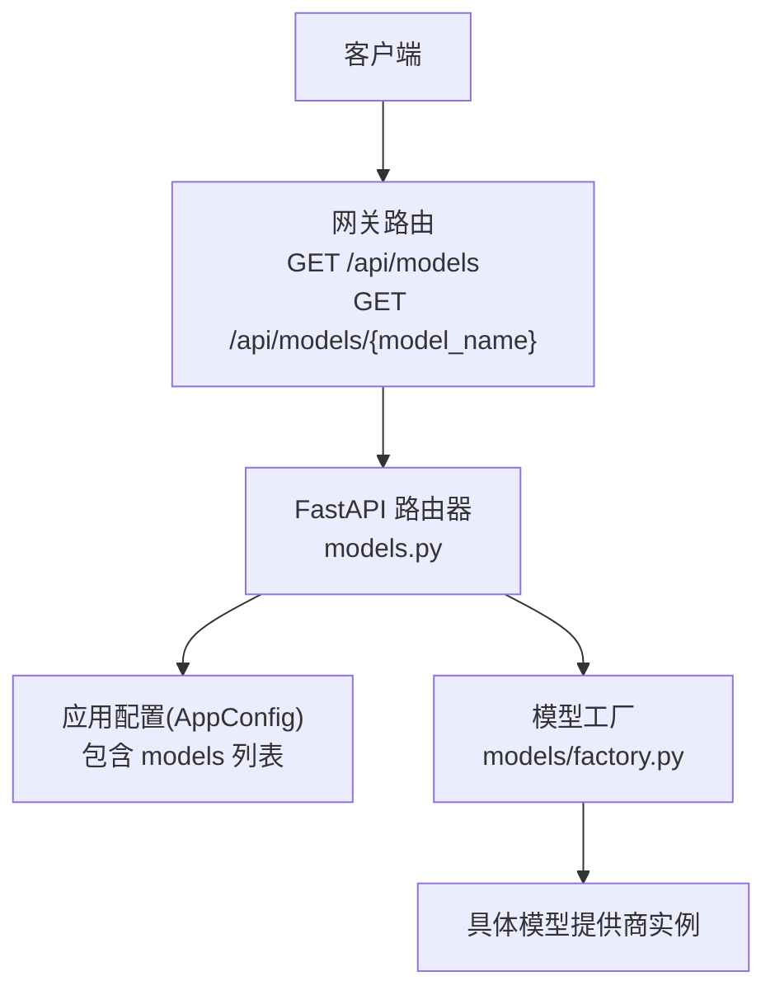
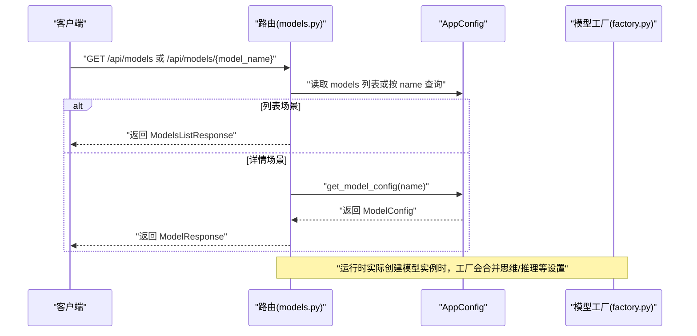
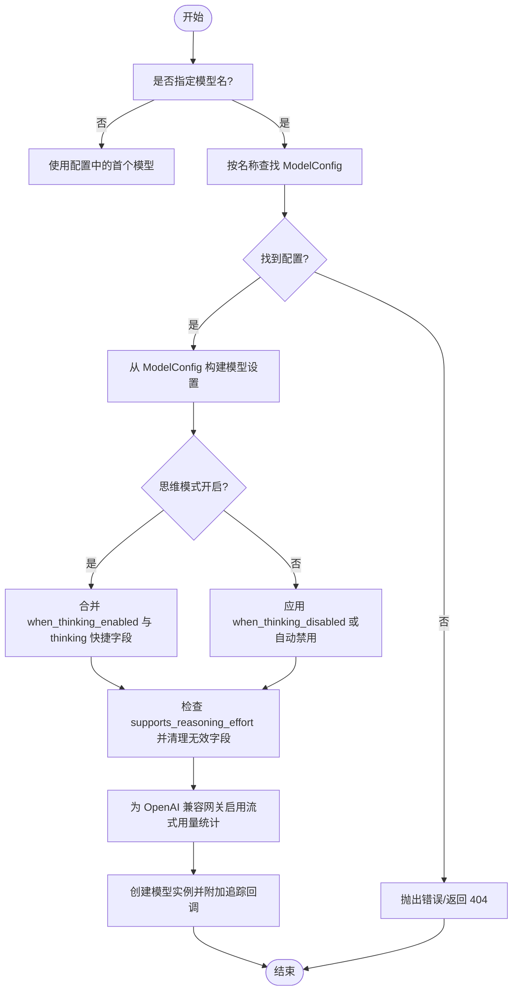
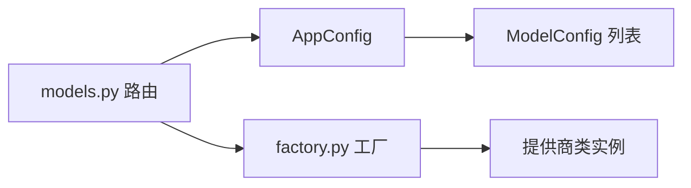

# 模型管理 API

<cite>
**本文引用的文件**
- [backend/app/gateway/routers/models.py](file://backend/app/gateway/routers/models.py)
- [backend/docs/API.md](file://backend/docs/API.md)
- [backend/packages/harness/deerflow/config/model_config.py](file://backend/packages/harness/deerflow/config/model_config.py)
- [backend/packages/harness/deerflow/models/factory.py](file://backend/packages/harness/deerflow/models/factory.py)
- [backend/README.md](file://backend/README.md)
- [backend/CLAUDE.md](file://backend/CLAUDE.md)
- [backend/config.yaml](file://backend/config.yaml)
</cite>

## 目录
1. [简介](#简介)
2. [项目结构](#项目结构)
3. [核心组件](#核心组件)
4. [架构总览](#架构总览)
5. [详细组件分析](#详细组件分析)
6. [依赖分析](#依赖分析)
7. [性能考虑](#性能考虑)
8. [故障排查指南](#故障排查指南)
9. [结论](#结论)
10. [附录](#附录)

## 简介
本文件为“模型管理 API”的权威技术文档，聚焦于以下两个端点：
- 获取可用 LLM 模型列表：GET /api/models
- 获取特定模型详细信息：GET /api/models/{model_name}

文档将详细说明每个端点的请求与响应结构、字段含义、使用示例，以及在代理运行时中如何基于模型配置进行选择与覆盖。

## 项目结构
模型管理 API 位于后端网关路由层，通过 FastAPI 路由暴露，并从应用配置中读取模型元数据。核心文件如下：
- 路由与响应模型：backend/app/gateway/routers/models.py
- 接口规范与示例：backend/docs/API.md
- 模型配置数据结构：backend/packages/harness/deerflow/config/model_config.py
- 模型工厂与运行时选择逻辑：backend/packages/harness/deerflow/models/factory.py
- 示例配置与说明：backend/README.md、backend/CLAUDE.md、backend/config.yaml

图表来源
- [backend/app/gateway/routers/models.py:1-133](file://backend/app/gateway/routers/models.py#L1-L133)
- [backend/packages/harness/deerflow/models/factory.py:50-158](file://backend/packages/harness/deerflow/models/factory.py#L50-L158)

章节来源
- [backend/app/gateway/routers/models.py:1-133](file://backend/app/gateway/routers/models.py#L1-L133)
- [backend/docs/API.md:173-226](file://backend/docs/API.md#L173-L226)

## 核心组件
- 路由器与端点
  - GET /api/models：列出所有可用模型及其基础元信息（名称、显示名、是否支持思维/推理等）
  - GET /api/models/{model_name}：按名称查询指定模型的详细信息
- 响应模型
  - ModelResponse：用于单个模型的基础信息
  - ModelsListResponse：用于模型列表及令牌用量显示开关
  - TokenUsageResponse：令牌用量显示开关
- 配置模型
  - ModelConfig：模型配置的数据结构，包含提供商类路径、模型名、能力标记、思维/推理开关与额外设置等

章节来源
- [backend/app/gateway/routers/models.py:10-32](file://backend/app/gateway/routers/models.py#L10-L32)
- [backend/packages/harness/deerflow/config/model_config.py:4-42](file://backend/packages/harness/deerflow/config/model_config.py#L4-L42)

## 架构总览
下图展示了模型管理 API 的端到端调用链：客户端发起请求 → 网关路由解析 → 读取应用配置 → 返回标准化响应。

图表来源
- [backend/app/gateway/routers/models.py:34-133](file://backend/app/gateway/routers/models.py#L34-L133)
- [backend/packages/harness/deerflow/models/factory.py:50-158](file://backend/packages/harness/deerflow/models/factory.py#L50-L158)

## 详细组件分析

### 端点：GET /api/models
- 功能概述
  - 返回系统中所有已配置的 LLM 模型清单，以及令牌用量显示开关。
- 请求
  - 方法：GET
  - 路径：/api/models
  - 查询参数：无
- 响应
  - 成功：200 OK，返回 ModelsListResponse
  - 失败：通常不会出现错误（若配置为空则 models 为空数组）
- 响应体结构（ModelsListResponse）
  - models: ModelResponse 数组
  - token_usage: TokenUsageResponse
- 单个模型结构（ModelResponse）
  - name: 字符串，模型唯一标识
  - model: 字符串，实际提供商模型标识
  - display_name: 字符串或 null，人类可读名称
  - description: 字符串或 null，模型描述
  - supports_thinking: 布尔值，是否支持思维模式
  - supports_reasoning_effort: 布尔值，是否支持推理努力级别
- 典型响应示例
  - 参考接口文档中的示例 JSON 结构
- 使用建议
  - 客户端可据此渲染模型选择器，或根据 supports_thinking/supports_reasoning_effort 决定 UI 行为

章节来源
- [backend/app/gateway/routers/models.py:34-91](file://backend/app/gateway/routers/models.py#L34-L91)
- [backend/docs/API.md:179-207](file://backend/docs/API.md#L179-L207)

### 端点：GET /api/models/{model_name}
- 功能概述
  - 根据模型名称返回该模型的详细配置信息。
- 请求
  - 方法：GET
  - 路径：/api/models/{model_name}
  - 路径参数：model_name（字符串）
- 响应
  - 成功：200 OK，返回 ModelResponse
  - 失败：404 Not Found（当模型不存在时）
- 响应体结构（ModelResponse）
  - name: 字符串，模型唯一标识
  - model: 字符串，实际提供商模型标识
  - display_name: 字符串或 null
  - description: 字符串或 null
  - supports_thinking: 布尔值
  - supports_reasoning_effort: 布尔值
- 使用建议
  - 客户端可结合前端配置（如是否启用思维模式）决定后续调用 LangGraph 时的参数

章节来源
- [backend/app/gateway/routers/models.py:93-133](file://backend/app/gateway/routers/models.py#L93-L133)
- [backend/docs/API.md:211-225](file://backend/docs/API.md#L211-L225)

### 模型配置数据结构（ModelConfig）
- 关键字段
  - name: 唯一名称
  - display_name: 显示名
  - description: 描述
  - use: 提供商类路径（例如 LangChain 提供商类）
  - model: 实际模型名
  - supports_thinking: 是否支持思维模式
  - supports_reasoning_effort: 是否支持推理努力级别
  - supports_vision: 是否支持视觉/图像输入
  - when_thinking_enabled / when_thinking_disabled: 思维开启/关闭时的附加设置
  - thinking: 思维设置快捷方式（与 when_thinking_enabled 合并）
  - 其他提供商特定字段（extra="allow" 支持扩展）
- 作用
  - 作为 AppConfig 中 models 列表的元素，被路由层读取并对外暴露

章节来源
- [backend/packages/harness/deerflow/config/model_config.py:4-42](file://backend/packages/harness/deerflow/config/model_config.py#L4-L42)

### 运行时模型选择与覆盖机制（模型工厂）
- 选择流程
  - 若未显式指定模型名，则默认使用配置中的第一个模型
  - 通过 AppConfig.get_model_config(name) 获取 ModelConfig
  - 解析 use 字段对应的提供商类，构造模型实例
- 覆盖与合并策略
  - 思维模式开启时：将 when_thinking_enabled 与 thinking 快捷字段合并，写入模型设置
  - 思维模式关闭时：优先应用 when_thinking_disabled；若未设置且存在思维设置，则按不同提供商类型进行禁用处理（如 OpenAI 兼容的 extra_body、vLLM 的 chat_template_kwargs、原生 Anthropic 的参数）
  - 推理努力级别：若模型不支持，则从传入参数与配置中移除
  - 流式令牌用量：针对 OpenAI 兼容网关，默认启用 stream_usage 以确保令牌用量统计有效
- 典型场景
  - 客户端在调用 LangGraph 时通过 configurable.model_name 指定模型名，实现动态切换
  - 在思维模式与推理努力级别上，遵循模型配置的 supports_* 标记，避免非法设置

图表来源
- [backend/packages/harness/deerflow/models/factory.py:50-158](file://backend/packages/harness/deerflow/models/factory.py#L50-L158)

章节来源
- [backend/packages/harness/deerflow/models/factory.py:50-158](file://backend/packages/harness/deerflow/models/factory.py#L50-L158)

### 前端集成与使用示例
- 获取模型列表
  - 使用 fetch 或任意 HTTP 客户端访问 GET /api/models
  - 解析返回的 models 数组，渲染模型选择器
- 获取特定模型详情
  - 访问 GET /api/models/{model_name}，根据返回的 supports_thinking/supports_reasoning_effort 决定 UI 行为
- 在代理运行时中选择模型
  - 在调用 LangGraph 的运行配置中，通过 configurable.model_name 指定目标模型
  - 若需要开启思维模式或推理努力级别，确保对应模型的 supports_* 为 true，并在运行配置中传递相应参数

章节来源
- [backend/docs/API.md:603-618](file://backend/docs/API.md#L603-L618)
- [backend/docs/API.md:119-123](file://backend/docs/API.md#L119-L123)

## 依赖分析
- 路由层依赖应用配置（AppConfig），从其中读取 models 列表与单个模型配置
- 模型工厂依赖 AppConfig 获取 ModelConfig，并据此构建具体提供商实例
- 配置来源
  - 示例配置文件中包含 supports_thinking 与 supports_vision 等能力标记
  - README 与 CLAUDE 文档提供了模型配置与能力说明

图表来源
- [backend/app/gateway/routers/models.py:40-132](file://backend/app/gateway/routers/models.py#L40-L132)
- [backend/packages/harness/deerflow/models/factory.py:50-158](file://backend/packages/harness/deerflow/models/factory.py#L50-L158)

章节来源
- [backend/README.md:118-183](file://backend/README.md#L118-L183)
- [backend/CLAUDE.md:304-394](file://backend/CLAUDE.md#L304-L394)
- [backend/config.yaml:29-60](file://backend/config.yaml#L29-L60)

## 性能考虑
- 列表端点为纯配置读取，复杂度与模型数量线性相关
- 详情端点为 O(1) 查找（按名称），性能稳定
- 运行时模型工厂涉及类解析与实例化，但仅在实际调用代理时发生
- 对于 OpenAI 兼容网关，启用流式用量统计可避免令牌用量缺失导致的统计空窗期

## 故障排查指南
- 404 Not Found：请求的模型名称不存在
  - 检查 /api/models 列表确认名称正确
  - 确认配置文件中是否存在该模型条目
- 思维模式/推理努力级别无效
  - 确认目标模型的 supports_thinking/supports_reasoning_effort 为 true
  - 若为 false，运行时工厂会自动清理相关参数
- OpenAI 兼容网关令牌用量为 0
  - 工厂默认为 OpenAI 兼容网关启用 stream_usage，若仍为 0，检查网关是否正确返回用量数据

章节来源
- [backend/app/gateway/routers/models.py:121-124](file://backend/app/gateway/routers/models.py#L121-L124)
- [backend/packages/harness/deerflow/models/factory.py:34-48](file://backend/packages/harness/deerflow/models/factory.py#L34-L48)

## 结论
模型管理 API 提供了简洁稳定的模型发现与查询能力，配合 AppConfig 与模型工厂，可在运行时灵活地选择与覆盖模型行为。客户端应依据返回的能力标记调整 UI 与运行配置，确保获得最佳体验。

## 附录

### 字段对照与含义
- name：模型唯一标识，用于路由与运行时选择
- model：实际提供商模型标识
- display_name：展示用名称
- description：模型描述
- supports_thinking：是否支持思维模式
- supports_reasoning_effort：是否支持推理努力级别
- supports_vision：是否支持视觉/图像输入

章节来源
- [backend/app/gateway/routers/models.py:10-19](file://backend/app/gateway/routers/models.py#L10-L19)
- [backend/packages/harness/deerflow/config/model_config.py:24-34](file://backend/packages/harness/deerflow/config/model_config.py#L24-L34)