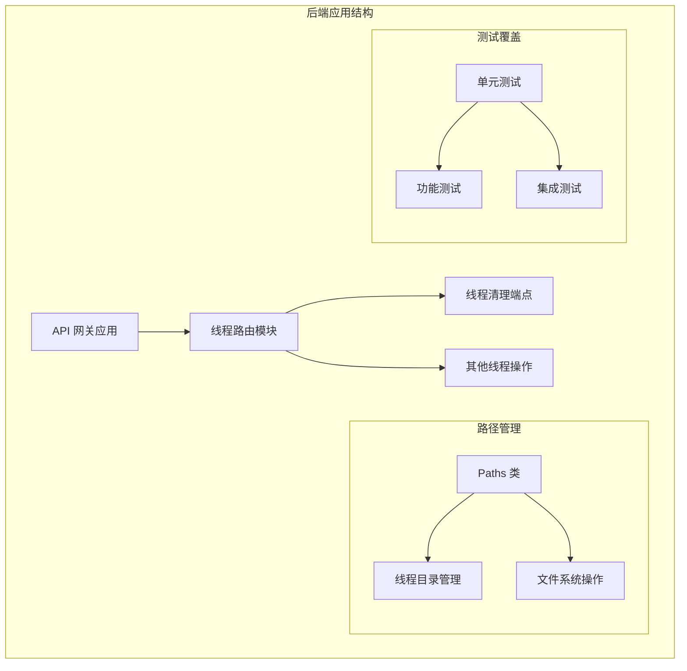
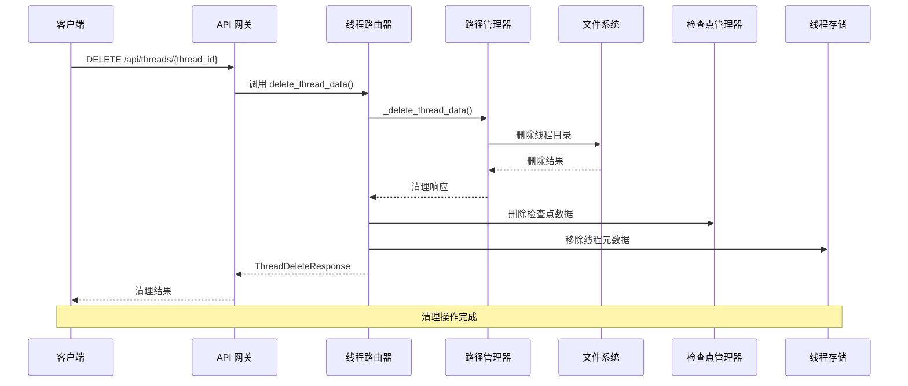
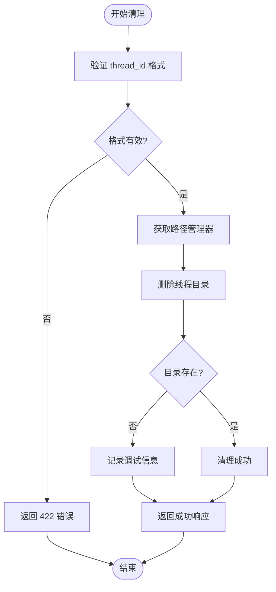
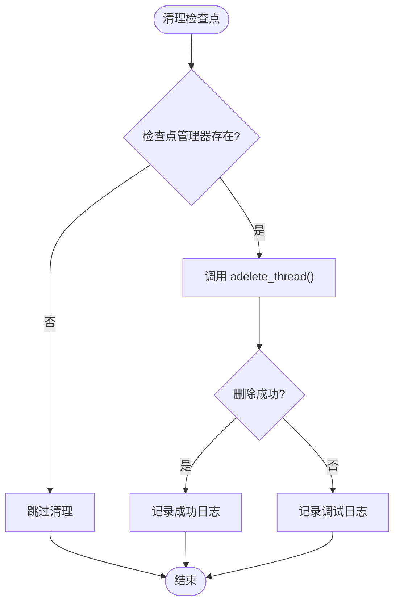
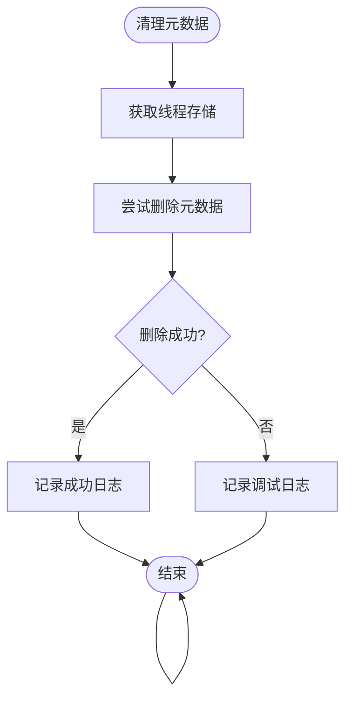
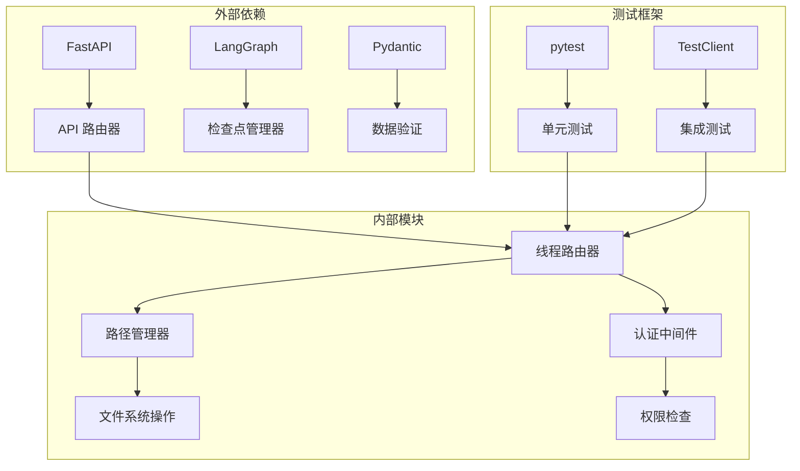

# 线程清理 API

<cite>
**本文档引用的文件**
- [backend/app/gateway/routers/threads.py](file://backend/app/gateway/routers/threads.py)
- [backend/app/gateway/app.py](file://backend/app/gateway/app.py)
- [backend/packages/harness/deerflow/config/paths.py](file://backend/packages/harness/deerflow/config/paths.py)
- [backend/tests/test_threads_router.py](file://backend/tests/test_threads_router.py)
- [backend/docs/PATH_EXAMPLES.md](file://backend/docs/PATH_EXAMPLES.md)
</cite>

## 目录
1. [简介](#简介)
2. [项目结构](#项目结构)
3. [核心组件](#核心组件)
4. [架构概览](#架构概览)
5. [详细组件分析](#详细组件分析)
6. [依赖关系分析](#依赖关系分析)
7. [性能考虑](#性能考虑)
8. [故障排除指南](#故障排除指南)
9. [结论](#结论)

## 简介

线程清理 API 是 DeerFlow 系统中用于清理 LangGraph 线程相关数据的核心功能。该 API 提供了完整的线程数据清理能力，包括本地文件系统清理、检查点数据删除和元数据记录移除。

该 API 的主要目标是在 LangGraph 线程删除后，同步清理 DeerFlow 管理的本地线程文件，确保系统资源的完整回收和数据的一致性。通过幂等性和并发安全性的设计，该 API 能够可靠地处理各种清理场景。

## 项目结构

线程清理 API 在 DeerFlow 后端应用中的位置和组织如下：



**图表来源**
- [backend/app/gateway/app.py:371-373](file://backend/app/gateway/app.py#L371-L373)
- [backend/app/gateway/routers/threads.py:31-32](file://backend/app/gateway/routers/threads.py#L31-L32)

**章节来源**
- [backend/app/gateway/app.py:371-373](file://backend/app/gateway/app.py#L371-L373)
- [backend/app/gateway/routers/threads.py:31-32](file://backend/app/gateway/routers/threads.py#L31-L32)

## 核心组件

### 线程清理端点

DELETE /api/threads/{thread_id} 是线程清理 API 的核心端点，负责执行完整的线程数据清理流程。

**端点特性：**
- **HTTP 方法**: DELETE
- **路径参数**: thread_id (线程唯一标识符)
- **权限要求**: threads:delete 权限，需要现有线程存在
- **响应格式**: ThreadDeleteResponse

### 路径管理系统

Paths 类提供了统一的文件系统路径管理功能，确保线程数据的正确组织和访问。

**核心功能：**
- 线程目录结构管理
- 文件系统权限控制
- 路径解析和验证
- 并发安全的文件操作

### 错误处理机制

系统实现了完善的错误处理策略，确保清理操作的可靠性：

**错误类型及状态码：**
- 422 Unprocessable Entity: 无效的 thread_id 格式
- 500 Internal Server Error: 清理操作失败
- 404 Not Found: 线程不存在或路径不匹配

**章节来源**
- [backend/app/gateway/routers/threads.py:190-221](file://backend/app/gateway/routers/threads.py#L190-L221)
- [backend/app/gateway/routers/threads.py:147-163](file://backend/app/gateway/routers/threads.py#L147-L163)

## 架构概览

线程清理 API 的整体架构设计体现了分层架构和职责分离的原则：



**图表来源**
- [backend/app/gateway/routers/threads.py:190-221](file://backend/app/gateway/routers/threads.py#L190-L221)
- [backend/app/gateway/routers/threads.py:147-163](file://backend/app/gateway/routers/threads.py#L147-L163)

## 详细组件分析

### 线程清理流程

线程清理操作包含三个主要阶段：

#### 1. 本地文件系统清理



**图表来源**
- [backend/app/gateway/routers/threads.py:147-163](file://backend/app/gateway/routers/threads.py#L147-L163)

#### 2. 检查点数据清理

检查点清理采用最佳努力策略，即使出现异常也不会影响主要清理流程：



**图表来源**
- [backend/app/gateway/routers/threads.py:204-211](file://backend/app/gateway/routers/threads.py#L204-L211)

#### 3. 线程元数据清理

线程元数据清理同样采用最佳努力策略，确保清理操作的健壮性：



**图表来源**
- [backend/app/gateway/routers/threads.py:213-219](file://backend/app/gateway/routers/threads.py#L213-L219)

### 数据存储结构

线程数据在文件系统中的组织结构遵循严格的层次化设计：

```mermaid
graph TB
subgraph "线程根目录"
A[threads/] --> B[{thread_id}/]
B --> C[user-data/]
subgraph "用户数据目录"
C --> D[workspace/]
C --> E[uploads/]
C --> F[outputs/]
C --> G[acp-workspace/]
end
subgraph "虚拟路径映射"
H[/mnt/user-data/] --> I[workspace/]
H --> J[uploads/]
H --> K[outputs/]
H --> L[acp-workspace/]
end
end
```

**图表来源**
- [backend/packages/harness/deerflow/config/paths.py:66-86](file://backend/packages/harness/deerflow/config/paths.py#L66-L86)
- [backend/packages/harness/deerflow/config/paths.py:171-232](file://backend/packages/harness/deerflow/config/paths.py#L171-L232)

**章节来源**
- [backend/packages/harness/deerflow/config/paths.py:66-86](file://backend/packages/harness/deerflow/config/paths.py#L66-L86)
- [backend/packages/harness/deerflow/config/paths.py:171-232](file://backend/packages/harness/deerflow/config/paths.py#L171-L232)

### 幂等性保证

线程清理 API 实现了完全的幂等性，确保重复调用不会产生副作用：

**幂等性特性：**
- 对于不存在的线程目录，清理操作被视为成功
- 重复调用不会产生额外的错误
- 状态保持一致，不会改变系统最终状态

**测试验证：**
- 测试用例验证了缺失目录的幂等性行为
- 确保清理操作可以安全地重试

**章节来源**
- [backend/tests/test_threads_router.py:87-94](file://backend/tests/test_threads_router.py#L87-L94)
- [backend/tests/test_threads_router.py:140-151](file://backend/tests/test_threads_router.py#L140-L151)

### 并发安全性

系统采用了多层并发安全措施来确保清理操作的可靠性：

**并发安全机制：**
- 路径验证防止目录遍历攻击
- 线程隔离确保不同用户的数据安全
- 最佳努力策略避免单点故障影响整体清理

**安全验证：**
- 路径解析包含完整的安全检查
- 用户 ID 验证确保访问控制
- 异常处理确保操作的原子性

**章节来源**
- [backend/packages/harness/deerflow/config/paths.py:20-31](file://backend/packages/harness/deerflow/config/paths.py#L20-L31)
- [backend/packages/harness/deerflow/config/paths.py:291-325](file://backend/packages/harness/deerflow/config/paths.py#L291-L325)

## 依赖关系分析

线程清理 API 的依赖关系体现了清晰的模块化设计：



**图表来源**
- [backend/app/gateway/routers/threads.py:19-30](file://backend/app/gateway/routers/threads.py#L19-L30)
- [backend/app/gateway/app.py:15-35](file://backend/app/gateway/app.py#L15-L35)

**章节来源**
- [backend/app/gateway/routers/threads.py:19-30](file://backend/app/gateway/routers/threads.py#L19-L30)
- [backend/app/gateway/app.py:15-35](file://backend/app/gateway/app.py#L15-L35)

## 性能考虑

线程清理操作在设计时充分考虑了性能优化：

**性能优化策略：**
- 异步文件系统操作减少阻塞时间
- 最佳努力策略避免长时间等待
- 缓存机制提升重复查询效率
- 并发安全的路径验证

**内存使用优化：**
- 分批处理大型目录结构
- 及时释放文件句柄和资源
- 避免不必要的数据复制

## 故障排除指南

### 常见问题及解决方案

**问题 1: 422 错误 (无效 thread_id)**

**症状：**
- 请求返回 422 状态码
- 错误详情包含 "Invalid thread_id"

**原因：**
- thread_id 包含非法字符
- 路径包含目录遍历尝试

**解决方案：**
- 确保 thread_id 只包含字母数字、连字符和下划线
- 避免使用相对路径符号 (../)

**问题 2: 500 错误 (清理失败)**

**症状：**
- 请求返回 500 状态码
- 错误详情为 "Failed to delete local thread data"

**原因：**
- 文件系统权限不足
- 磁盘空间不足
- 文件被其他进程占用

**解决方案：**
- 检查文件系统权限设置
- 确认磁盘空间充足
- 关闭占用文件的进程

**问题 3: 404 错误 (线程不存在)**

**症状：**
- 请求返回 404 状态码
- 线程 ID 不匹配

**原因：**
- 线程 ID 格式正确但不存在
- 路径解析失败

**解决方案：**
- 验证线程 ID 的存在性
- 检查线程是否属于当前用户

**章节来源**
- [backend/tests/test_threads_router.py:96-104](file://backend/tests/test_threads_router.py#L96-L104)
- [backend/tests/test_threads_router.py:154-167](file://backend/tests/test_threads_router.py#L154-L167)

### 调试建议

**调试步骤：**
1. 验证 thread_id 格式和有效性
2. 检查文件系统权限和磁盘空间
3. 查看应用日志获取详细错误信息
4. 使用测试工具验证清理操作

**监控指标：**
- 清理操作响应时间
- 成功清理率
- 错误发生频率
- 磁盘空间使用情况

## 结论

线程清理 API 为 DeerFlow 系统提供了完整、可靠的线程数据清理解决方案。通过精心设计的架构和完善的错误处理机制，该 API 能够安全、高效地清理 LangGraph 线程相关的所有数据。

**关键优势：**
- **完整性**: 清理所有相关数据，包括文件系统、检查点和元数据
- **可靠性**: 幂等性和并发安全性确保操作的稳定性
- **安全性**: 多层安全检查防止恶意操作和数据泄露
- **可维护性**: 清晰的代码结构和完善的测试覆盖

**最佳实践建议：**
- 在删除 LangGraph 线程后立即调用清理 API
- 实施适当的监控和告警机制
- 定期备份重要数据以防意外丢失
- 遵循最小权限原则配置系统权限

该 API 的设计充分体现了现代 Web 应用的安全性、可靠性和可维护性要求，为 DeerFlow 系统的稳定运行提供了坚实的基础。