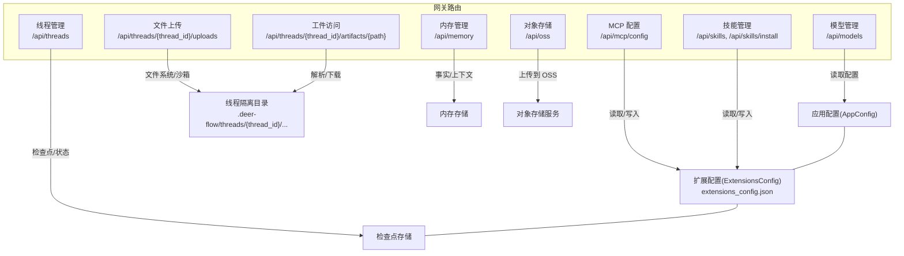
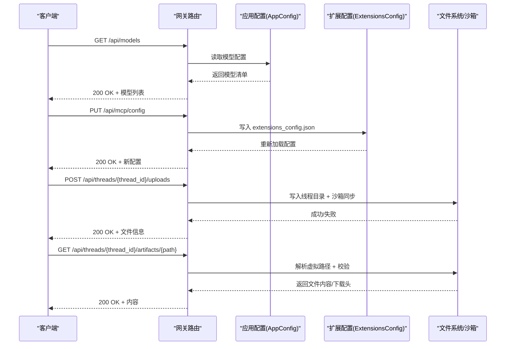
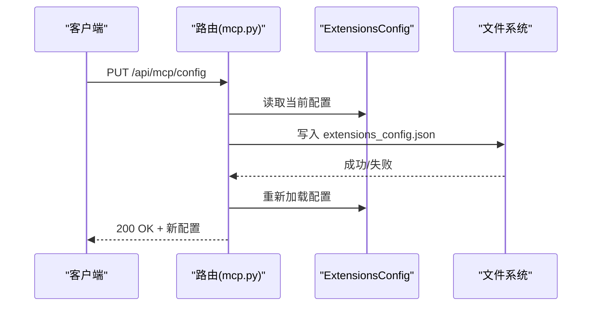
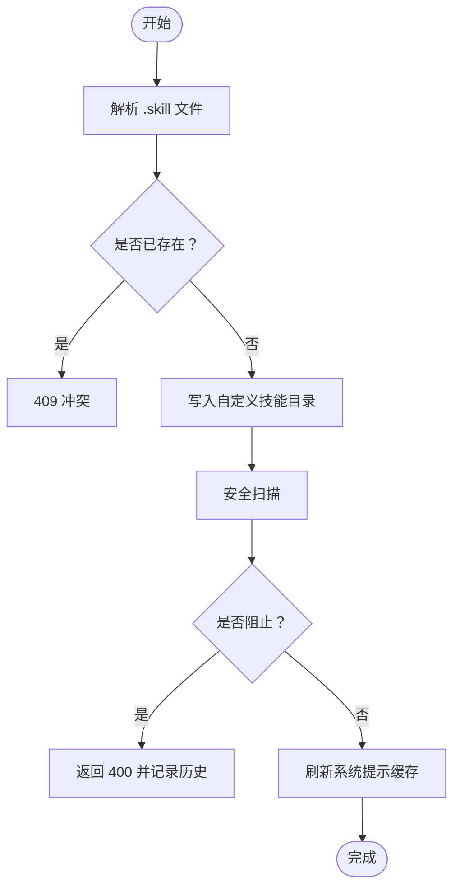
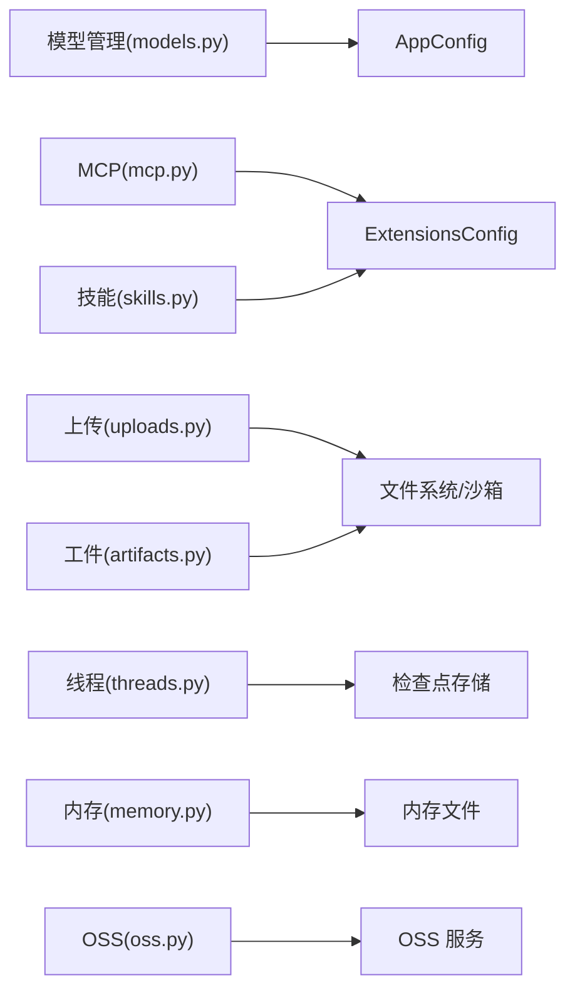

# 网关 API

<cite>
**本文档引用的文件**
- [models.py](file://backend/app/gateway/routers/models.py)
- [mcp.py](file://backend/app/gateway/routers/mcp.py)
- [skills.py](file://backend/app/gateway/routers/skills.py)
- [uploads.py](file://backend/app/gateway/routers/uploads.py)
- [artifacts.py](file://backend/app/gateway/routers/artifacts.py)
- [threads.py](file://backend/app/gateway/routers/threads.py)
- [memory.py](file://backend/app/gateway/routers/memory.py)
- [oss.py](file://backend/app/gateway/routers/oss.py)
- [API.md](file://backend/docs/API.md)
- [MCP_SERVER.md](file://backend/docs/MCP_SERVER.md)
- [FILE_UPLOAD.md](file://backend/docs/FILE_UPLOAD.md)
- [config.example.yaml](file://config.example.yaml)
</cite>

## 目录
1. [简介](#简介)
2. [项目结构](#项目结构)
3. [核心组件](#核心组件)
4. [架构总览](#架构总览)
5. [详细组件分析](#详细组件分析)
6. [依赖分析](#依赖分析)
7. [性能考虑](#性能考虑)
8. [故障排查指南](#故障排查指南)
9. [结论](#结论)
10. [附录](#附录)

## 简介
本文件为 DeerFlow 网关 API 的完整技术文档，覆盖模型管理、MCP 配置与 OAuth、技能管理、文件上传与工件访问、线程生命周期管理、内存管理以及对象存储上传等能力。文档面向开发者与运维人员，提供端点规范、请求/响应模型、错误处理策略、安全与性能要点，并包含使用示例与客户端实现建议。

## 项目结构
网关 API 位于后端模块的网关路由层，主要文件分布如下：
- 模型管理：/api/models
- MCP 配置：/api/mcp/config
- 技能管理：/api/skills 与 /api/skills/install
- 文件上传：/api/threads/{thread_id}/uploads
- 工件访问：/api/threads/{thread_id}/artifacts/{path}
- 线程管理：/api/threads
- 内存管理：/api/memory
- 对象存储：/api/oss



图示来源
- [models.py:1-133](file://backend/app/gateway/routers/models.py#L1-L133)
- [mcp.py:1-170](file://backend/app/gateway/routers/mcp.py#L1-L170)
- [skills.py:1-353](file://backend/app/gateway/routers/skills.py#L1-L353)
- [uploads.py:1-343](file://backend/app/gateway/routers/uploads.py#L1-L343)
- [artifacts.py:1-184](file://backend/app/gateway/routers/artifacts.py#L1-L184)
- [threads.py:1-623](file://backend/app/gateway/routers/threads.py#L1-L623)
- [memory.py:1-357](file://backend/app/gateway/routers/memory.py#L1-L357)
- [oss.py:1-94](file://backend/app/gateway/routers/oss.py#L1-L94)

章节来源
- [models.py:1-133](file://backend/app/gateway/routers/models.py#L1-L133)
- [mcp.py:1-170](file://backend/app/gateway/routers/mcp.py#L1-L170)
- [skills.py:1-353](file://backend/app/gateway/routers/skills.py#L1-L353)
- [uploads.py:1-343](file://backend/app/gateway/routers/uploads.py#L1-L343)
- [artifacts.py:1-184](file://backend/app/gateway/routers/artifacts.py#L1-L184)
- [threads.py:1-623](file://backend/app/gateway/routers/threads.py#L1-L623)
- [memory.py:1-357](file://backend/app/gateway/routers/memory.py#L1-L357)
- [oss.py:1-94](file://backend/app/gateway/routers/oss.py#L1-L94)

## 核心组件
- 模型管理：提供模型清单与详情查询，屏蔽敏感字段，仅暴露前端展示所需元数据。
- MCP 配置：提供 MCP 服务器配置的读取与更新，支持 OAuth 凭证注入与自动刷新。
- 技能管理：提供技能清单、详情、启用/禁用、安装、自定义技能编辑与历史回滚。
- 文件上传：支持多文件上传、上传限制、自动文档转换、沙箱同步、列表与删除。
- 工件访问：统一入口访问线程产物，支持内联/下载、主动内容保护、.skill 归档提取。
- 线程管理：提供线程创建、状态查询、历史查询、状态更新、清理。
- 内存管理：提供全局记忆数据的增删改查、导入导出、配置查询。
- 对象存储：提供 OSS 上传与配置查询。

章节来源
- [models.py:34-133](file://backend/app/gateway/routers/models.py#L34-L133)
- [mcp.py:66-170](file://backend/app/gateway/routers/mcp.py#L66-L170)
- [skills.py:88-353](file://backend/app/gateway/routers/skills.py#L88-L353)
- [uploads.py:170-343](file://backend/app/gateway/routers/uploads.py#L170-L343)
- [artifacts.py:80-184](file://backend/app/gateway/routers/artifacts.py#L80-L184)
- [threads.py:190-623](file://backend/app/gateway/routers/threads.py#L190-L623)
- [memory.py:110-357](file://backend/app/gateway/routers/memory.py#L110-L357)
- [oss.py:35-94](file://backend/app/gateway/routers/oss.py#L35-L94)

## 架构总览
网关 API 通过 FastAPI 路由组织，依赖应用配置与扩展配置加载器，结合沙箱与文件系统实现线程隔离与安全访问。MCP 服务器通过扩展配置动态发现与注册，技能系统支持公共与自定义两类技能，文件上传与工件访问通过虚拟路径与沙箱同步保证一致性。



图示来源
- [models.py:40-90](file://backend/app/gateway/routers/models.py#L40-L90)
- [mcp.py:104-169](file://backend/app/gateway/routers/mcp.py#L104-L169)
- [uploads.py:172-293](file://backend/app/gateway/routers/uploads.py#L172-L293)
- [artifacts.py:86-184](file://backend/app/gateway/routers/artifacts.py#L86-L184)

## 详细组件分析

### 模型管理
- 端点
  - GET /api/models：返回所有可用模型与令牌用量显示开关
  - GET /api/models/{model_name}：返回指定模型详情
- 关键行为
  - 屏蔽敏感字段（如密钥），仅返回前端展示所需字段
  - 从 AppConfig 读取模型配置，动态生成响应
- 请求/响应
  - 请求：无
  - 响应：ModelsListResponse / ModelResponse
- 错误处理
  - 404：模型不存在
- 示例
  - 获取模型清单与令牌用量显示开关
  - 获取指定模型详情（含思考/推理能力标记）

章节来源
- [models.py:34-133](file://backend/app/gateway/routers/models.py#L34-L133)

### MCP 配置
- 端点
  - GET /api/mcp/config：获取当前 MCP 服务器配置
  - PUT /api/mcp/config：更新 MCP 服务器配置并重载缓存
- 关键行为
  - 读取/写入 extensions_config.json
  - 支持 OAuth 配置（令牌端点、授权类型、作用域、刷新偏移等）
  - 更新后触发 MCP 工具缓存重置
- 请求/响应
  - 请求：McpConfigUpdateRequest（mcp_servers 映射）
  - 响应：McpConfigResponse（mcp_servers 映射）
- 错误处理
  - 500：配置文件写入失败
- 示例
  - 获取当前 MCP 配置
  - 更新 MCP 配置（含 OAuth 参数）



图示来源
- [mcp.py:104-169](file://backend/app/gateway/routers/mcp.py#L104-L169)

章节来源
- [mcp.py:66-170](file://backend/app/gateway/routers/mcp.py#L66-L170)
- [MCP_SERVER.md:1-100](file://backend/docs/MCP_SERVER.md#L1-L100)

### 技能管理
- 端点
  - GET /api/skills：列出所有技能
  - GET /api/skills/{skill_name}：获取技能详情
  - PUT /api/skills/{skill_name}：启用/禁用技能
  - POST /api/skills/install：从 .skill 文件安装技能
  - GET /api/skills/custom：列出自定义技能
  - GET /api/skills/custom/{skill_name}：获取自定义技能内容
  - PUT /api/skills/custom/{skill_name}：编辑自定义技能内容
  - DELETE /api/skills/custom/{skill_name}：删除自定义技能
  - GET /api/skills/custom/{skill_name}/history：查看自定义技能历史
  - POST /api/skills/custom/{skill_name}/rollback：回滚自定义技能
- 关键行为
  - 技能来源：公共技能与自定义技能
  - 安全扫描：编辑/回滚前进行内容安全扫描
  - 历史记录：维护自定义技能变更历史
  - 系统提示缓存：启用/禁用/安装后刷新缓存
- 请求/响应
  - 安装：SkillInstallRequest → SkillInstallResponse
  - 编辑/回滚：CustomSkillContentResponse
  - 启用/禁用：SkillUpdateRequest → SkillResponse
- 错误处理
  - 404：资源不存在
  - 409：技能已存在
  - 400/500：参数错误/内部错误
- 示例
  - 安装 .skill 文件
  - 启用/禁用技能
  - 编辑自定义技能内容并回滚



图示来源
- [skills.py:109-126](file://backend/app/gateway/routers/skills.py#L109-L126)
- [skills.py:155-189](file://backend/app/gateway/routers/skills.py#L155-L189)
- [skills.py:235-279](file://backend/app/gateway/routers/skills.py#L235-L279)

章节来源
- [skills.py:88-353](file://backend/app/gateway/routers/skills.py#L88-L353)

### 文件上传与工件访问
- 文件上传
  - 端点：POST /api/threads/{thread_id}/uploads
  - 支持：多文件、上传限制（单次/总量）、自动文档转换（可选）
  - 安全：路径规范化、防路径穿越、沙箱同步
  - 响应：UploadResponse（含虚拟路径、工件 URL、Markdown 转换结果）
- 上传限制
  - GET /api/threads/{thread_id}/uploads/limits：返回 max_files/max_file_size/max_total_size
- 文件列表
  - GET /api/threads/{thread_id}/uploads/list：返回文件清单与元信息
- 删除文件
  - DELETE /api/threads/{thread_id}/uploads/{filename}
- 工件访问
  - GET /api/threads/{thread_id}/artifacts/{path}：支持下载与内联显示，主动内容强制下载
  - 支持 .skill 归档内文件提取
- 请求/响应
  - 上传：multipart/form-data → UploadResponse
  - 限制：UploadLimits
  - 列表：字典（files[], count）
  - 删除：字典（success/message）
  - 工件：FileResponse/PlainTextResponse/Response（根据 MIME 类型与下载标志）
- 错误处理
  - 400：无效路径/文件名不合法
  - 404：文件不存在
  - 413：超出上传限制
  - 500：内部错误
- 示例
  - 上传 PDF/PPT/Excel 并自动转换为 Markdown
  - 通过工件 URL 下载或内联查看

```mermaid
sequenceDiagram
participant C as "客户端"
participant U as "上传路由(uploads.py)"
participant P as "路径/沙箱"
participant F as "文件系统"
C->>U : POST /api/threads/{thread_id}/uploads
U->>U : 校验限制/规范化文件名
U->>F : 写入线程 uploads 目录
U->>P : 沙箱同步非本地沙箱
P-->>U : 同步结果
U-->>C : 200 OK + UploadResponse
C->>A as "工件路由(artifacts.py)"
A->>F : 解析虚拟路径/校验
A-->>C : 200 OK + 文件内容下载/内联
```

图示来源
- [uploads.py:172-293](file://backend/app/gateway/routers/uploads.py#L172-L293)
- [artifacts.py:86-184](file://backend/app/gateway/routers/artifacts.py#L86-L184)

章节来源
- [uploads.py:170-343](file://backend/app/gateway/routers/uploads.py#L170-L343)
- [artifacts.py:80-184](file://backend/app/gateway/routers/artifacts.py#L80-L184)
- [FILE_UPLOAD.md:1-315](file://backend/docs/FILE_UPLOAD.md#L1-L315)

### 线程生命周期管理
- 端点
  - DELETE /api/threads/{thread_id}：清理本地线程数据（文件系统 + 检查点 + 元数据）
  - POST /api/threads：创建线程（写入元数据 + 空检查点）
  - POST /api/threads/search：按元数据/状态搜索线程
  - PATCH /api/threads/{thread_id}：合并更新元数据
  - GET /api/threads/{thread_id}：获取线程信息与状态
  - GET /api/threads/{thread_id}/state：获取最新状态快照
  - POST /api/threads/{thread_id}/state：更新状态（人类介入/标题更新）
  - POST /api/threads/{thread_id}/history：获取检查点历史
- 关键行为
  - 状态推导：从检查点派生状态（空闲/中断/错误）
  - 元数据过滤：移除服务端保留键
  - 标题同步：更新标题时同步到元数据存储
- 响应模型
  - ThreadResponse / ThreadStateResponse / HistoryEntry
- 错误处理
  - 404：线程不存在
  - 422：无效线程 ID
  - 500：删除/创建/状态读取失败
- 示例
  - 创建线程并立即可查询状态
  - 清理线程本地数据

章节来源
- [threads.py:190-623](file://backend/app/gateway/routers/threads.py#L190-L623)

### 内存管理
- 端点
  - GET /api/memory：获取全局记忆数据
  - POST /api/memory/reload：从文件重载内存数据
  - DELETE /api/memory：清空所有记忆数据
  - POST /api/memory/facts：创建记忆事实
  - DELETE /api/memory/facts/{fact_id}：删除记忆事实
  - PATCH /api/memory/facts/{fact_id}：部分更新记忆事实
  - GET /api/memory/export：导出记忆数据
  - POST /api/memory/import：导入记忆数据
  - GET /api/memory/config：获取内存配置
  - GET /api/memory/status：获取内存配置与数据
- 关键行为
  - 事实校验：置信度范围、内容非空
  - 配置项：启用/存储路径/去抖/最大事实数/注入开关/最大注入 Token
- 响应模型
  - MemoryResponse / Fact / MemoryConfigResponse / MemoryStatusResponse
- 错误处理
  - 400：置信度非法/内容为空
  - 404：事实不存在
  - 500：文件操作失败
- 示例
  - 创建/更新/删除记忆事实
  - 导入/导出记忆数据

章节来源
- [memory.py:110-357](file://backend/app/gateway/routers/memory.py#L110-L357)

### 对象存储（OSS）
- 端点
  - POST /api/oss/upload：上传文件到阿里云 OSS
  - GET /api/oss/config：查询 OSS 配置状态
- 关键行为
  - OSS 配置：端点、Bucket、Host
  - 文件命名：生成唯一文件名
  - 内容类型：从上传文件推断或默认
- 响应模型
  - OSSUploadResponse / OSSConfigResponse
- 错误处理
  - 500：未配置 OSS 或上传失败
- 示例
  - 上传音频文件到 OSS 并获取 URL

章节来源
- [oss.py:35-94](file://backend/app/gateway/routers/oss.py#L35-L94)

## 依赖分析
- 组件耦合
  - 模型管理依赖 AppConfig
  - MCP 配置依赖 ExtensionsConfig 与文件系统
  - 技能管理依赖 ExtensionsConfig 与技能存储
  - 上传/工件访问依赖路径解析与沙箱同步
  - 线程管理依赖检查点存储与元数据存储
  - 内存管理依赖内存配置与文件存储
  - OSS 上传依赖 OSS 配置
- 外部依赖
  - FastAPI、Pydantic
  - 文件系统与沙箱运行时
  - OAuth 客户端（MCP HTTP/SSE）
  - 对象存储服务（OSS）



图示来源
- [models.py:4-6](file://backend/app/gateway/routers/models.py#L4-L6)
- [mcp.py:9-9](file://backend/app/gateway/routers/mcp.py#L9-L9)
- [skills.py:11-17](file://backend/app/gateway/routers/skills.py#L11-L17)
- [uploads.py:11-29](file://backend/app/gateway/routers/uploads.py#L11-L29)
- [artifacts.py:10-11](file://backend/app/gateway/routers/artifacts.py#L10-L11)
- [threads.py:24-27](file://backend/app/gateway/routers/threads.py#L24-L27)
- [memory.py:6-16](file://backend/app/gateway/routers/memory.py#L6-L16)
- [oss.py:9-10](file://backend/app/gateway/routers/oss.py#L9-L10)

## 性能考虑
- 上传性能
  - 分块读取（8KB）降低内存占用
  - 单文件/总大小限制避免资源滥用
  - 自动文档转换默认关闭，必要时开启以权衡 CPU 与存储
- 工件访问
  - 主动内容（HTML/XHTML/SVG）强制下载，避免脚本执行风险
  - 文本文件按 MIME 类型内联显示，未知类型尝试 UTF-8 解码
- MCP/OAuth
  - OAuth 令牌缓存与刷新偏移减少重复请求
  - 并发锁保护令牌刷新一致性
- 线程状态
  - 状态序列化与检查点读取尽量避免大对象拷贝
- 内存管理
  - 防抖更新减少频繁写入
  - 最大事实数与置信度阈值控制存储规模

## 故障排查指南
- 上传失败
  - 检查是否超过 max_files/max_file_size/max_total_size
  - 确认线程目录权限与磁盘空间
  - 查看后端日志定位异常
- 工件访问异常
  - 确认虚拟路径与实际文件存在
  - 主动内容（HTML/XHTML/SVG）强制下载
- MCP 配置更新失败
  - 检查 extensions_config.json 写权限
  - 确认配置格式正确（mcpServers/skills 字段）
- 技能安装/编辑失败
  - 安全扫描阻止：查看扫描原因
  - 资源不存在：确认 .skill 文件路径
- 线程清理失败
  - 422：线程 ID 无效
  - 500：文件系统异常
- 内存操作失败
  - 400：置信度非法或内容为空
  - 500：文件系统不可写
- OSS 上传失败
  - 500：未配置 OSS 或网络异常

章节来源
- [uploads.py:170-343](file://backend/app/gateway/routers/uploads.py#L170-L343)
- [artifacts.py:80-184](file://backend/app/gateway/routers/artifacts.py#L80-L184)
- [mcp.py:104-169](file://backend/app/gateway/routers/mcp.py#L104-L169)
- [skills.py:109-126](file://backend/app/gateway/routers/skills.py#L109-L126)
- [threads.py:190-221](file://backend/app/gateway/routers/threads.py#L190-L221)
- [memory.py:110-357](file://backend/app/gateway/routers/memory.py#L110-L357)
- [oss.py:35-94](file://backend/app/gateway/routers/oss.py#L35-L94)

## 结论
本文件系统性梳理了 DeerFlow 网关 API 的核心能力与实现要点，涵盖模型、MCP、技能、上传与工件、线程、内存与 OSS 等模块。通过清晰的端点规范、安全与性能考量、错误处理策略与示例，帮助开发者与运维人员高效集成与维护系统。

## 附录

### 端点一览与规范
- 模型管理
  - GET /api/models：返回模型清单与令牌用量显示开关
  - GET /api/models/{model_name}：返回指定模型详情
- MCP 配置
  - GET /api/mcp/config：返回 MCP 服务器配置
  - PUT /api/mcp/config：更新 MCP 服务器配置
- 技能管理
  - GET /api/skills：列出技能
  - GET /api/skills/{skill_name}：技能详情
  - PUT /api/skills/{skill_name}：启用/禁用
  - POST /api/skills/install：安装 .skill
  - 自定义技能：GET/PUT/DELETE + 历史与回滚
- 文件上传与工件
  - POST /api/threads/{thread_id}/uploads：多文件上传（multipart/form-data）
  - GET /api/threads/{thread_id}/uploads/limits：上传限制
  - GET /api/threads/{thread_id}/uploads/list：文件列表
  - DELETE /api/threads/{thread_id}/uploads/{filename}：删除文件
  - GET /api/threads/{thread_id}/artifacts/{path}：工件访问（支持 download 参数）
- 线程管理
  - DELETE /api/threads/{thread_id}：清理本地数据
  - POST /api/threads：创建线程
  - POST /api/threads/search：搜索线程
  - PATCH /api/threads/{thread_id}：更新元数据
  - GET /api/threads/{thread_id}：线程信息
  - GET /api/threads/{thread_id}/state：状态快照
  - POST /api/threads/{thread_id}/state：更新状态
  - POST /api/threads/{thread_id}/history：历史记录
- 内存管理
  - GET/POST/DELETE/PATCH /api/memory/*
  - GET /api/memory/config：内存配置
  - GET /api/memory/status：配置与数据
- 对象存储
  - POST /api/oss/upload：上传到 OSS
  - GET /api/oss/config：OSS 配置

章节来源
- [models.py:34-133](file://backend/app/gateway/routers/models.py#L34-L133)
- [mcp.py:66-170](file://backend/app/gateway/routers/mcp.py#L66-L170)
- [skills.py:88-353](file://backend/app/gateway/routers/skills.py#L88-L353)
- [uploads.py:170-343](file://backend/app/gateway/routers/uploads.py#L170-L343)
- [artifacts.py:80-184](file://backend/app/gateway/routers/artifacts.py#L80-L184)
- [threads.py:190-623](file://backend/app/gateway/routers/threads.py#L190-L623)
- [memory.py:110-357](file://backend/app/gateway/routers/memory.py#L110-L357)
- [oss.py:35-94](file://backend/app/gateway/routers/oss.py#L35-L94)

### 配置参考
- 模型配置：见 config.example.yaml 中 models 段落
- 上传限制：uploads.max_files / max_file_size / max_total_size
- 记忆配置：memory.* 相关项
- MCP 配置：extensions_config.json（参见 MCP_SERVER.md）

章节来源
- [config.example.yaml:18-115](file://config.example.yaml#L18-L115)
- [config.example.yaml:247-283](file://config.example.yaml#L247-L283)
- [MCP_SERVER.md:1-100](file://backend/docs/MCP_SERVER.md#L1-L100)