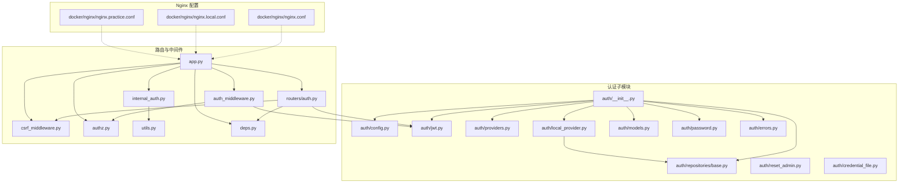
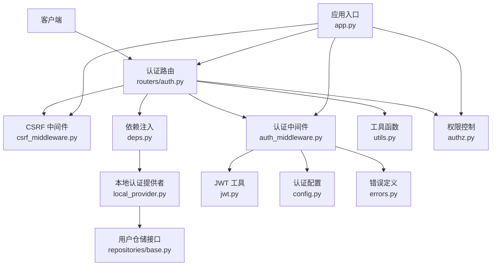
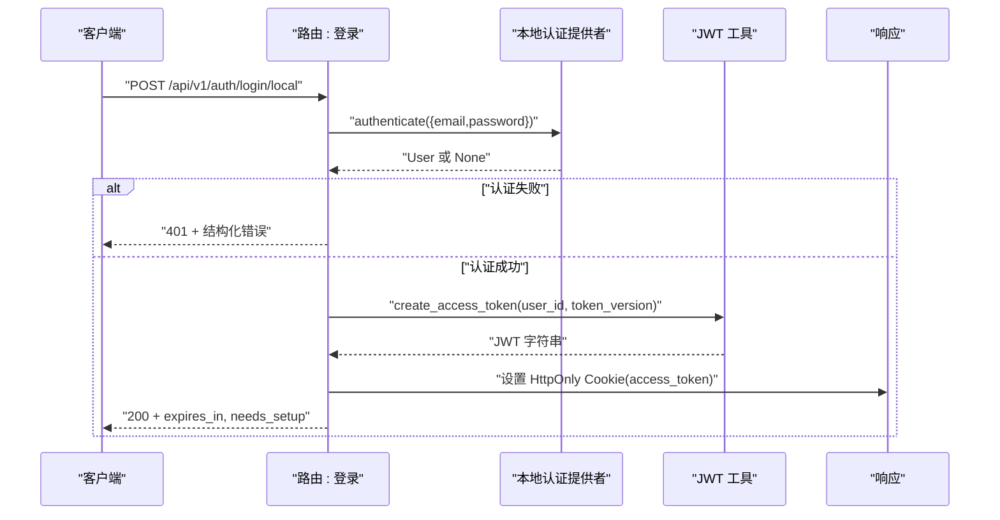
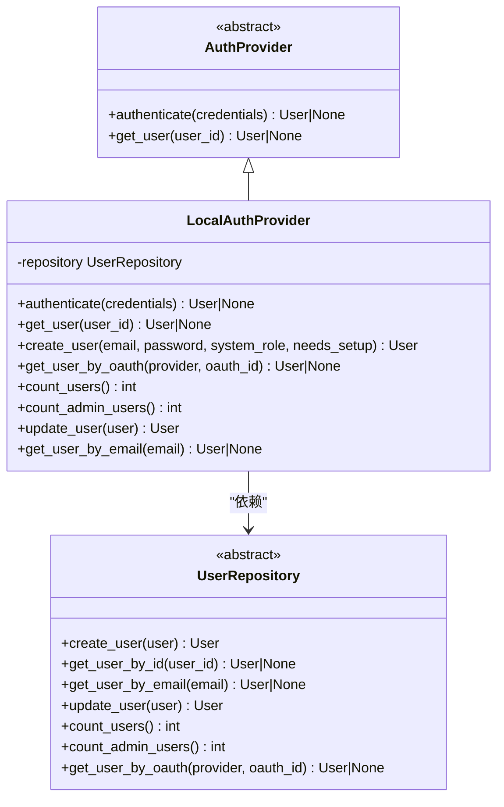
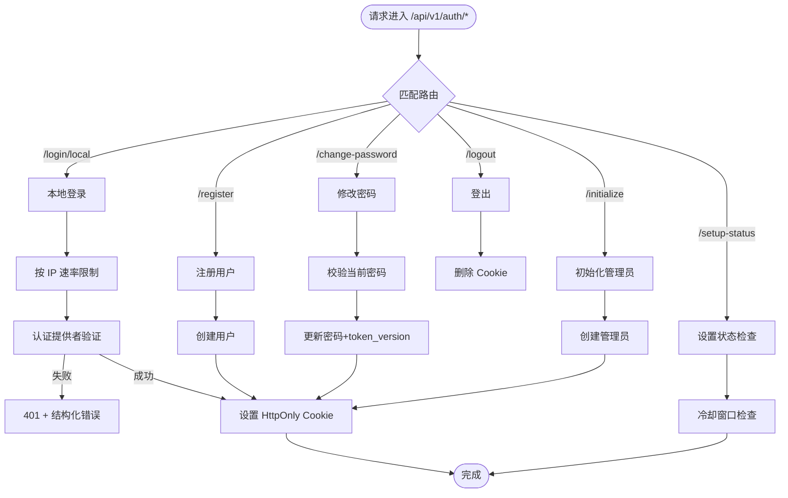
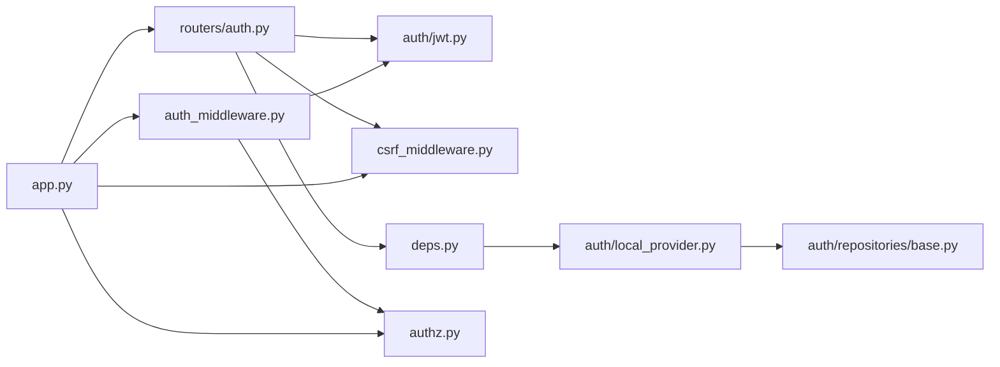
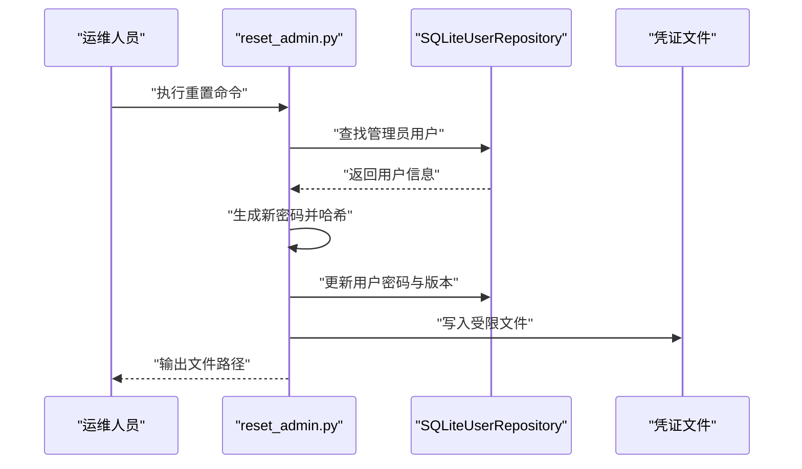

# 认证与授权

<cite>
**本文引用的文件**
- [backend/app/gateway/auth/__init__.py](file://backend/app/gateway/auth/__init__.py)
- [backend/app/gateway/auth/config.py](file://backend/app/gateway/auth/config.py)
- [backend/app/gateway/auth/jwt.py](file://backend/app/gateway/auth/jwt.py)
- [backend/app/gateway/auth/providers.py](file://backend/app/gateway/auth/providers.py)
- [backend/app/gateway/auth/local_provider.py](file://backend/app/gateway/auth/local_provider.py)
- [backend/app/gateway/auth/models.py](file://backend/app/gateway/auth/models.py)
- [backend/app/gateway/auth/password.py](file://backend/app/gateway/auth/password.py)
- [backend/app/gateway/routers/auth.py](file://backend/app/gateway/routers/auth.py)
- [backend/app/gateway/auth/repositories/base.py](file://backend/app/gateway/auth/repositories/base.py)
- [backend/app/gateway/auth/reset_admin.py](file://backend/app/gateway/auth/reset_admin.py)
- [backend/app/gateway/auth/credential_file.py](file://backend/app/gateway/auth/credential_file.py)
- [backend/app/gateway/auth/errors.py](file://backend/app/gateway/auth/errors.py)
- [backend/app/gateway/deps.py](file://backend/app/gateway/deps.py)
- [backend/app/gateway/csrf_middleware.py](file://backend/app/gateway/csrf_middleware.py)
- [backend/app/gateway/internal_auth.py](file://backend/app/gateway/internal_auth.py)
- [backend/app/gateway/auth_middleware.py](file://backend/app/gateway/auth_middleware.py)
- [backend/app/gateway/authz.py](file://backend/app/gateway/authz.py)
- [backend/app/gateway/utils.py](file://backend/app/gateway/utils.py)
- [backend/app/gateway/app.py](file://backend/app/gateway/app.py)
- [docker/nginx/nginx.conf](file://docker/nginx/nginx.conf)
- [docker/nginx/nginx.local.conf](file://docker/nginx/nginx.local.conf)
- [docker/nginx/nginx.practice.conf](file://docker/nginx/nginx.practice.conf)
- [docker/docker-compose.yaml](file://docker/docker-compose.yaml)
- [docker/docker-compose.prod.yml](file://docker/docker-compose.prod.yml)
</cite>

## 目录
1. [简介](#简介)
2. [项目结构](#项目结构)
3. [核心组件](#核心组件)
4. [架构总览](#架构总览)
5. [详细组件分析](#详细组件分析)
6. [依赖分析](#依赖分析)
7. [性能考量](#性能考量)
8. [故障排查指南](#故障排查指南)
9. [结论](#结论)
10. [附录](#附录)

## 简介
本文件系统性梳理 DeerFlow 后端的认证与授权现状与实现，明确当前 API 的认证状态（无内置认证），并提供生产环境部署建议与安全加固方案。重点覆盖以下方面：
- 当前认证状态：API 默认未启用内置认证；登录、注册、变更密码等接口通过 Cookie（HttpOnly）承载访问令牌。
- 内置认证能力：提供基于 JWT 的令牌签发与校验、本地邮箱/密码认证提供者、密码哈希与版本化策略、用户模型与仓储接口等。
- 安全中间件：包含 CSRF 保护中间件与内部认证机制，用于在反向代理或网关层进行请求校验。
- 生产部署建议：Nginx 基础认证、OAuth 集成、VPN 部署等安全配置思路；令牌管理与权限控制要点；常见安全问题与最佳实践。

## 项目结构
后端认证相关代码集中在 gateway/auth 子模块及配套中间件与路由中，同时在 docker/nginx 下提供 Nginx 示例配置，便于在生产环境中进行基础认证与 TLS 终止。

图示来源
- [backend/app/gateway/auth/__init__.py:1-43](file://backend/app/gateway/auth/__init__.py#L1-L43)
- [backend/app/gateway/routers/auth.py:1-494](file://backend/app/gateway/routers/auth.py#L1-L494)
- [backend/app/gateway/auth_middleware.py](file://backend/app/gateway/auth_middleware.py)
- [backend/app/gateway/csrf_middleware.py](file://backend/app/gateway/csrf_middleware.py)
- [backend/app/gateway/internal_auth.py](file://backend/app/gateway/internal_auth.py)
- [backend/app/gateway/authz.py](file://backend/app/gateway/authz.py)
- [backend/app/gateway/utils.py](file://backend/app/gateway/utils.py)
- [backend/app/gateway/deps.py](file://backend/app/gateway/deps.py)
- [backend/app/gateway/app.py](file://backend/app/gateway/app.py)
- [docker/nginx/nginx.conf](file://docker/nginx/nginx.conf)
- [docker/nginx/nginx.local.conf](file://docker/nginx/nginx.local.conf)
- [docker/nginx/nginx.practice.conf](file://docker/nginx/nginx.practice.conf)

章节来源
- [backend/app/gateway/auth/__init__.py:1-43](file://backend/app/gateway/auth/__init__.py#L1-L43)
- [backend/app/gateway/routers/auth.py:1-494](file://backend/app/gateway/routers/auth.py#L1-L494)

## 核心组件
- 认证配置与密钥管理：解析环境变量中的 JWT 密钥与过期天数，若未设置则生成临时密钥并在日志中警告，生产需显式配置。
- JWT 令牌：签发与解码，包含 sub、exp、iat、ver 等字段；ver 与用户 token_version 对齐以支持令牌失效。
- 用户模型与仓储：统一的用户数据模型与仓储接口抽象，支持按邮箱/ID 查询、更新、计数等操作。
- 密码策略：版本化哈希格式（v1/v2），自动检测与迁移，异步哈希与验证避免阻塞事件循环。
- 本地认证提供者：基于邮箱/密码的认证流程，支持创建用户、OAuth 关联查询、统计等。
- 路由与端点：登录、注册、登出、修改密码、查看当前用户、初始化管理员、设置状态检查等。
- CSRF 保护与内部认证：中间件用于在反向代理场景下进行安全校验与内部服务间认证。
- 错误与响应：统一的错误枚举与结构化响应体，便于前端处理。

章节来源
- [backend/app/gateway/auth/config.py:1-58](file://backend/app/gateway/auth/config.py#L1-L58)
- [backend/app/gateway/auth/jwt.py:1-56](file://backend/app/gateway/auth/jwt.py#L1-L56)
- [backend/app/gateway/auth/models.py:1-42](file://backend/app/gateway/auth/models.py#L1-L42)
- [backend/app/gateway/auth/password.py:1-82](file://backend/app/gateway/auth/password.py#L1-L82)
- [backend/app/gateway/auth/local_provider.py:1-105](file://backend/app/gateway/auth/local_provider.py#L1-L105)
- [backend/app/gateway/routers/auth.py:1-494](file://backend/app/gateway/routers/auth.py#L1-L494)
- [backend/app/gateway/csrf_middleware.py](file://backend/app/gateway/csrf_middleware.py)
- [backend/app/gateway/internal_auth.py](file://backend/app/gateway/internal_auth.py)
- [backend/app/gateway/auth/errors.py:1-46](file://backend/app/gateway/auth/errors.py#L1-L46)

## 架构总览
DeerFlow 的认证体系采用“路由层 + 中间件 + 认证提供者 + 仓储”的分层设计。路由负责暴露 API，中间件负责安全校验（如 CSRF、内部认证），认证提供者负责具体认证逻辑（本地邮箱/密码），仓储负责用户数据持久化抽象。

图示来源
- [backend/app/gateway/routers/auth.py:1-494](file://backend/app/gateway/routers/auth.py#L1-L494)
- [backend/app/gateway/auth_middleware.py](file://backend/app/gateway/auth_middleware.py)
- [backend/app/gateway/csrf_middleware.py](file://backend/app/gateway/csrf_middleware.py)
- [backend/app/gateway/auth/local_provider.py](file://backend/app/gateway/auth/local_provider.py)
- [backend/app/gateway/auth/repositories/base.py](file://backend/app/gateway/auth/repositories/base.py)
- [backend/app/gateway/auth/jwt.py](file://backend/app/gateway/auth/jwt.py)
- [backend/app/gateway/auth/config.py](file://backend/app/gateway/auth/config.py)
- [backend/app/gateway/auth/errors.py](file://backend/app/gateway/auth/errors.py)
- [backend/app/gateway/authz.py](file://backend/app/gateway/authz.py)
- [backend/app/gateway/utils.py](file://backend/app/gateway/utils.py)
- [backend/app/gateway/app.py](file://backend/app/gateway/app.py)

## 详细组件分析

### JWT 认证与令牌管理
- 令牌结构：包含 sub（用户 ID）、exp（过期时间）、iat（签发时间）、ver（令牌版本）。ver 与用户 token_version 对齐，用于强制旧令牌失效。
- 签发流程：从配置读取密钥与过期天数，构造 payload 并使用 HS256 签名。
- 解码流程：验证签名、过期与格式，返回 TokenPayload 或对应错误类型。
- 令牌下发：登录成功后通过 HttpOnly Cookie 返回 access_token，secure 依据请求是否为 HTTPS，SameSite=Lax，max_age 依据 HTTPS 状态决定。

图示来源
- [backend/app/gateway/routers/auth.py:275-302](file://backend/app/gateway/routers/auth.py#L275-L302)
- [backend/app/gateway/auth/local_provider.py:24-59](file://backend/app/gateway/auth/local_provider.py#L24-L59)
- [backend/app/gateway/auth/jwt.py:21-37](file://backend/app/gateway/auth/jwt.py#L21-L37)

章节来源
- [backend/app/gateway/auth/jwt.py:1-56](file://backend/app/gateway/auth/jwt.py#L1-L56)
- [backend/app/gateway/routers/auth.py:134-146](file://backend/app/gateway/routers/auth.py#L134-L146)

### 本地认证提供者与密码策略
- 认证流程：根据邮箱查询用户，校验是否存在且具备密码哈希，再进行密码验证；必要时对旧版本哈希进行重新哈希并更新。
- 密码策略：v2 使用 SHA-256 预处理 + bcrypt，避免 72 字节截断限制；自动识别版本并兼容 v1；提供异步哈希与验证。
- 用户管理：支持创建用户、按邮箱/ID 查询、更新、统计管理员数量等。

图示来源
- [backend/app/gateway/auth/providers.py:6-25](file://backend/app/gateway/auth/providers.py#L6-L25)
- [backend/app/gateway/auth/local_provider.py:13-105](file://backend/app/gateway/auth/local_provider.py#L13-L105)
- [backend/app/gateway/auth/repositories/base.py:18-103](file://backend/app/gateway/auth/repositories/base.py#L18-L103)

章节来源
- [backend/app/gateway/auth/local_provider.py:1-105](file://backend/app/gateway/auth/local_provider.py#L1-L105)
- [backend/app/gateway/auth/password.py:1-82](file://backend/app/gateway/auth/password.py#L1-L82)
- [backend/app/gateway/auth/repositories/base.py:1-103](file://backend/app/gateway/auth/repositories/base.py#L1-L103)

### 路由与端点：登录、注册、登出、修改密码、初始化管理员
- 登录：表单认证，速率限制（按客户端 IP），成功后设置 HttpOnly Cookie。
- 注册：创建普通用户并自动登录。
- 登出：清除 access_token Cookie。
- 修改密码：校验当前密码，更新新密码并递增 token_version，重新签发 Cookie。
- 初始化管理员：仅当不存在管理员时允许创建首个管理员账户。
- 设置状态检查：防探测限流，返回 needs_setup 标识。

图示来源
- [backend/app/gateway/routers/auth.py:275-494](file://backend/app/gateway/routers/auth.py#L275-L494)

章节来源
- [backend/app/gateway/routers/auth.py:1-494](file://backend/app/gateway/routers/auth.py#L1-L494)

### CSRF 保护与内部认证机制
- CSRF 保护：通过中间件判断请求是否来自可信安全上下文（如 HTTPS），并在跨站请求中进行校验，降低 CSRF 攻击风险。
- 内部认证：用于网关或服务内调用的身份校验，确保内部链路的安全性。

章节来源
- [backend/app/gateway/csrf_middleware.py](file://backend/app/gateway/csrf_middleware.py)
- [backend/app/gateway/internal_auth.py](file://backend/app/gateway/internal_auth.py)

### 权限控制与令牌版本化
- 令牌版本化：用户修改密码或执行敏感操作时递增 token_version，旧令牌即刻失效，保障会话安全。
- 权限控制：通过系统角色（admin/user）区分权限范围，结合路由与中间件实现访问控制。

章节来源
- [backend/app/gateway/auth/models.py:30-33](file://backend/app/gateway/auth/models.py#L30-L33)
- [backend/app/gateway/routers/auth.py:332-376](file://backend/app/gateway/routers/auth.py#L332-L376)
- [backend/app/gateway/authz.py](file://backend/app/gateway/authz.py)

### 安全配置示例：Nginx 基础认证、OAuth 集成、VPN 部署
- Nginx 基础认证：可在反向代理层启用 Basic Auth，结合 HTTPS 终止与上游健康检查，提升入口安全性。
- OAuth 集成：路由已预留 GitHub/Google 等 OAuth 提供者占位，需在后续实现回调与用户绑定逻辑。
- VPN 部署：通过内网 VPN 将 API 暴露在受控网络中，结合 Nginx 证书与访问控制，形成纵深防御。

章节来源
- [docker/nginx/nginx.conf](file://docker/nginx/nginx.conf)
- [docker/nginx/nginx.local.conf](file://docker/nginx/nginx.local.conf)
- [docker/nginx/nginx.practice.conf](file://docker/nginx/nginx.practice.conf)
- [backend/app/gateway/routers/auth.py:464-493](file://backend/app/gateway/routers/auth.py#L464-L493)

## 依赖分析
认证模块内部依赖清晰，遵循分层与接口抽象原则：
- 路由依赖认证工具与中间件，通过依赖注入获取认证提供者与当前用户。
- 认证提供者依赖仓储接口，便于替换存储后端。
- JWT 工具与配置相互独立，便于测试与配置切换。
- CSRF 与内部认证作为横切关注点，贯穿应用入口。

图示来源
- [backend/app/gateway/routers/auth.py:1-494](file://backend/app/gateway/routers/auth.py#L1-L494)
- [backend/app/gateway/auth/jwt.py:1-56](file://backend/app/gateway/auth/jwt.py#L1-L56)
- [backend/app/gateway/auth/local_provider.py:1-105](file://backend/app/gateway/auth/local_provider.py#L1-L105)
- [backend/app/gateway/auth/repositories/base.py:1-103](file://backend/app/gateway/auth/repositories/base.py#L1-L103)
- [backend/app/gateway/auth_middleware.py](file://backend/app/gateway/auth_middleware.py)
- [backend/app/gateway/csrf_middleware.py](file://backend/app/gateway/csrf_middleware.py)
- [backend/app/gateway/authz.py](file://backend/app/gateway/authz.py)
- [backend/app/gateway/app.py](file://backend/app/gateway/app.py)

章节来源
- [backend/app/gateway/app.py](file://backend/app/gateway/app.py)
- [backend/app/gateway/deps.py](file://backend/app/gateway/deps.py)

## 性能考量
- 密码哈希与验证采用异步线程池封装，避免阻塞事件循环。
- 速率限制为进程内字典计数，多工作进程场景需引入共享存储（如 Redis）以实现全局限流。
- 令牌版本化导致频繁签发 Cookie，建议在前端合理复用与缓存策略，减少不必要的重登出操作。

## 故障排查指南
- 令牌过期/无效：检查 JWT 密钥一致性与过期时间配置，确认客户端是否正确携带 Cookie。
- 登录失败：确认邮箱/密码是否正确，检查速率限制是否触发；查看日志中的限流与认证错误。
- OAuth 占位未实现：当前路由返回 501，需补充 OAuth 提供者实现与回调处理。
- 管理员密码重置：使用 CLI 工具重置密码，重置后的凭据写入受限文件，便于运维安全获取。

章节来源
- [backend/app/gateway/auth/errors.py:1-46](file://backend/app/gateway/auth/errors.py#L1-L46)
- [backend/app/gateway/routers/auth.py:464-493](file://backend/app/gateway/routers/auth.py#L464-L493)
- [backend/app/gateway/auth/reset_admin.py:1-92](file://backend/app/gateway/auth/reset_admin.py#L1-L92)
- [backend/app/gateway/auth/credential_file.py:1-49](file://backend/app/gateway/auth/credential_file.py#L1-L49)

## 结论
- 当前 API 未内置认证，登录成功后通过 HttpOnly Cookie 持续会话；生产环境必须配合反向代理与安全加固（HTTPS、CSRF、速率限制、访问控制）。
- 认证模块提供了完善的 JWT、密码策略、本地认证提供者与仓储抽象，可扩展至 OAuth 等多种认证方式。
- 建议在生产中启用 Nginx 基础认证、TLS 终止、内部认证与 CSRF 保护，并通过 VPN 或内网隔离降低暴露面。

## 附录
- 管理员密码重置流程：通过 CLI 查找管理员用户，生成新密码并写入受限文件，随后要求首次登录完成设置。

图示来源
- [backend/app/gateway/auth/reset_admin.py:27-78](file://backend/app/gateway/auth/reset_admin.py#L27-L78)
- [backend/app/gateway/auth/credential_file.py:21-48](file://backend/app/gateway/auth/credential_file.py#L21-L48)