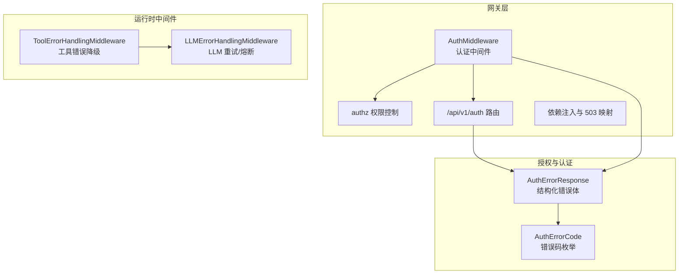
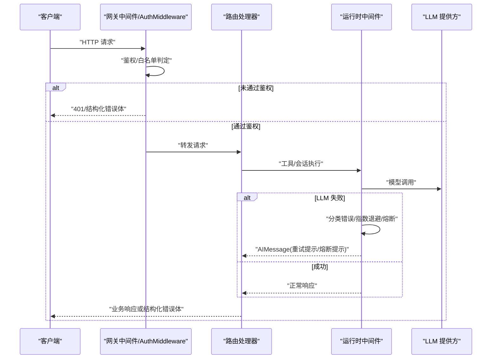
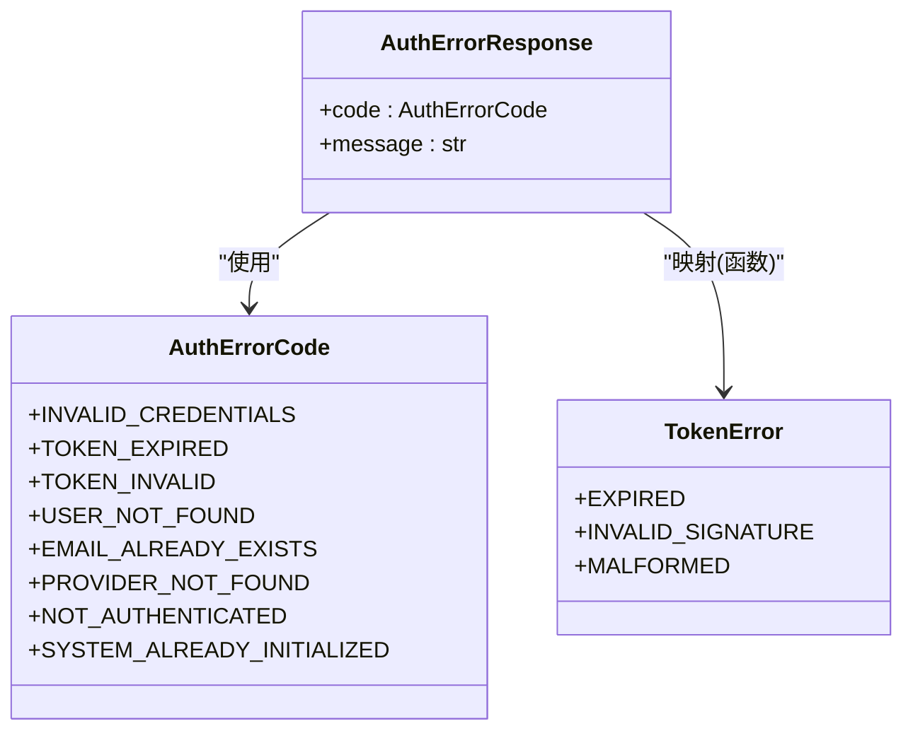
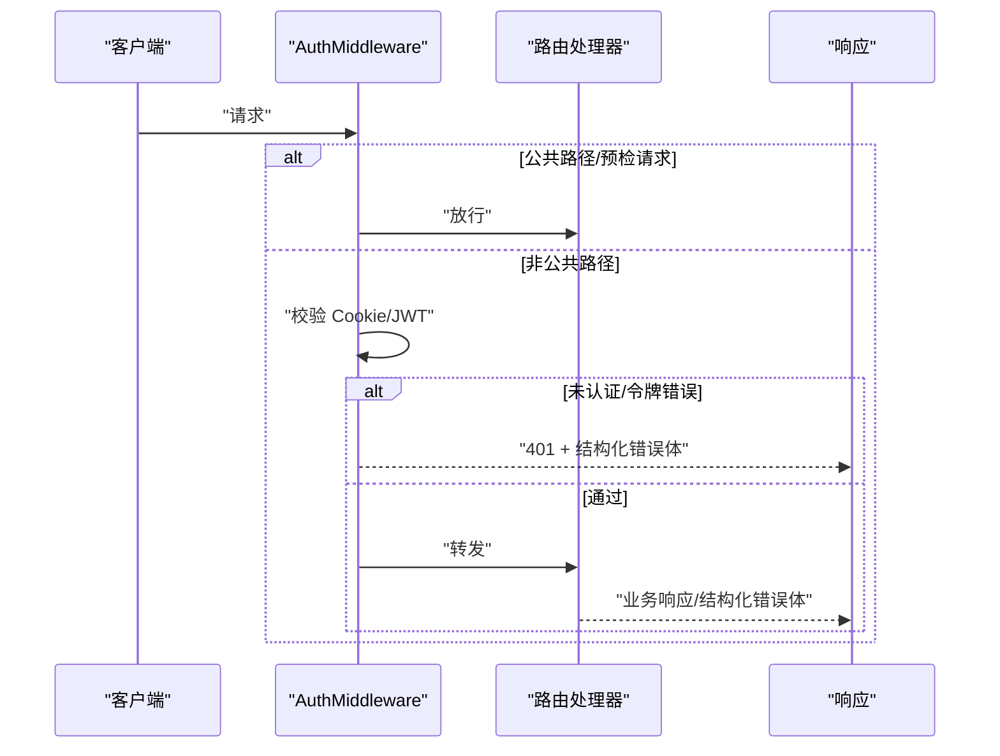
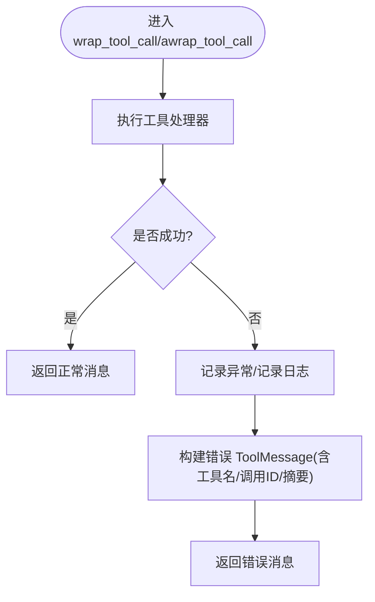
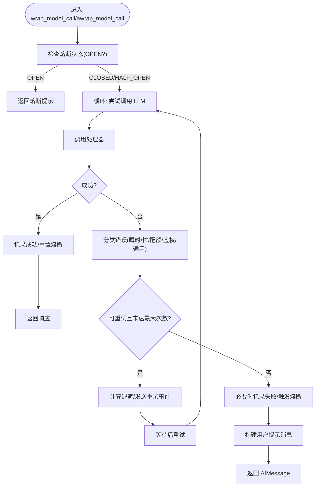
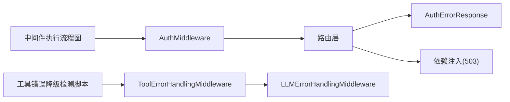

# 错误处理与状态码

<cite>
**本文引用的文件**
- [backend/app/gateway/auth/errors.py](file://backend/app/gateway/auth/errors.py)
- [backend/app/gateway/auth_middleware.py](file://backend/app/gateway/auth_middleware.py)
- [backend/app/gateway/routers/auth.py](file://backend/app/gateway/routers/auth.py)
- [backend/app/gateway/deps.py](file://backend/app/gateway/deps.py)
- [backend/packages/harness/deerflow/agents/middlewares/tool_error_handling_middleware.py](file://backend/packages/harness/deerflow/agents/middlewares/tool_error_handling_middleware.py)
- [backend/packages/harness/deerflow/agents/middlewares/llm_error_handling_middleware.py](file://backend/packages/harness/deerflow/agents/middlewares/llm_error_handling_middleware.py)
- [backend/tests/test_auth_errors.py](file://backend/tests/test_auth_errors.py)
- [backend/docs/middleware-execution-flow.md](file://backend/docs/middleware-execution-flow.md)
- [backend/scripts/tool-error-degradation-detection.sh](file://backend/scripts/tool-error-degradation-detection.sh)
</cite>

## 目录
1. 引言
2. 项目结构
3. 核心组件
4. 架构总览
5. 详细组件分析
6. 依赖关系分析
7. 性能考量
8. 故障排除指南
9. 结论
10. 附录

## 引言
本文件系统性梳理 DeerFlow API 的错误处理机制，覆盖统一错误响应格式、HTTP 状态码语义、中间件级错误处理策略、重试与熔断、日志与可观测性、常见错误场景与排查步骤。目标是帮助开发者与运维人员快速定位问题、正确实现客户端容错与重试，并理解服务端如何以一致的方式返回错误信息。

## 项目结构
围绕错误处理的关键模块分布如下：
- 网关层（FastAPI）：认证中间件、权限控制、路由层错误映射、依赖注入与健康检查
- 授权与认证：结构化错误体、错误码枚举、JWT 解码与错误映射
- 运行时中间件：工具调用错误降级、LLM 请求重试与熔断
- 文档与测试：中间件执行流程图解、认证错误单元测试

图表来源
- [backend/app/gateway/auth_middleware.py:67-146](file://backend/app/gateway/auth_middleware.py#L67-L146)
- [backend/app/gateway/routers/auth.py:275-494](file://backend/app/gateway/routers/auth.py#L275-L494)
- [backend/app/gateway/auth/errors.py:13-46](file://backend/app/gateway/auth/errors.py#L13-L46)
- [backend/packages/harness/deerflow/agents/middlewares/tool_error_handling_middleware.py:24-171](file://backend/packages/harness/deerflow/agents/middlewares/tool_error_handling_middleware.py#L24-L171)
- [backend/packages/harness/deerflow/agents/middlewares/llm_error_handling_middleware.py:66-369](file://backend/packages/harness/deerflow/agents/middlewares/llm_error_handling_middleware.py#L66-L369)

章节来源
- [backend/app/gateway/auth_middleware.py:1-146](file://backend/app/gateway/auth_middleware.py#L1-L146)
- [backend/app/gateway/routers/auth.py:1-494](file://backend/app/gateway/routers/auth.py#L1-L494)
- [backend/app/gateway/auth/errors.py:1-46](file://backend/app/gateway/auth/errors.py#L1-L46)
- [backend/packages/harness/deerflow/agents/middlewares/tool_error_handling_middleware.py:1-171](file://backend/packages/harness/deerflow/agents/middlewares/tool_error_handling_middleware.py#L1-L171)
- [backend/packages/harness/deerflow/agents/middlewares/llm_error_handling_middleware.py:1-369](file://backend/packages/harness/deerflow/agents/middlewares/llm_error_handling_middleware.py#L1-L369)

## 核心组件
- 统一错误响应格式
  - 使用结构化错误体，包含机器可读的错误码与人类可读的消息，避免字符串匹配
  - 认证错误使用专用结构化体，便于前端统一处理
- HTTP 状态码映射
  - 客户端错误：400（参数/密码强度/业务校验）、401（未认证/令牌无效/过期/用户不存在/版本不匹配）、403（CSRF/权限不足）、404（资源不存在）、409（冲突/系统已初始化）、422（验证错误，见下节）、429（速率限制）、500（内部错误）、503（依赖不可用）
- 中间件级错误处理
  - 工具调用失败转为“错误”消息，保证会话继续
  - LLM 请求具备指数退避重试、熔断保护、用户友好提示与事件流通知
- 依赖注入与健康检查
  - 依赖缺失统一映射为 503，便于基础设施层快速识别

章节来源
- [backend/app/gateway/auth/errors.py:34-46](file://backend/app/gateway/auth/errors.py#L34-L46)
- [backend/app/gateway/routers/auth.py:275-494](file://backend/app/gateway/routers/auth.py#L275-L494)
- [backend/app/gateway/deps.py:33-136](file://backend/app/gateway/deps.py#L33-L136)
- [backend/packages/harness/deerflow/agents/middlewares/tool_error_handling_middleware.py:24-71](file://backend/packages/harness/deerflow/agents/middlewares/tool_error_handling_middleware.py#L24-L71)
- [backend/packages/harness/deerflow/agents/middlewares/llm_error_handling_middleware.py:66-369](file://backend/packages/harness/deerflow/agents/middlewares/llm_error_handling_middleware.py#L66-L369)

## 架构总览
下图展示从请求到错误响应的关键路径，以及运行时中间件如何在工具与 LLM 层面进行错误降级与重试。

图表来源
- [backend/app/gateway/auth_middleware.py:90-146](file://backend/app/gateway/auth_middleware.py#L90-L146)
- [backend/packages/harness/deerflow/agents/middlewares/llm_error_handling_middleware.py:208-299](file://backend/packages/harness/deerflow/agents/middlewares/llm_error_handling_middleware.py#L208-L299)
- [backend/app/gateway/routers/auth.py:275-494](file://backend/app/gateway/routers/auth.py#L275-L494)

## 详细组件分析

### 统一错误响应格式与结构化错误体
- 设计目标
  - 以结构化错误体替代字符串描述，减少客户端对错误内容的脆弱解析
  - 认证错误使用独立的错误体，包含机器可读的错误码与人类可读消息
- 关键点
  - 错误体包含错误码与消息；错误码来自枚举，确保一致性
  - 认证中间件在捕获 HTTP 异常时，统一以 JSON 响应返回结构化错误体
  - 路由层在业务异常时，构造结构化错误体并映射到合适的 HTTP 状态码

图表来源
- [backend/app/gateway/auth/errors.py:13-46](file://backend/app/gateway/auth/errors.py#L13-L46)

章节来源
- [backend/app/gateway/auth/errors.py:13-46](file://backend/app/gateway/auth/errors.py#L13-L46)
- [backend/app/gateway/auth_middleware.py:104-133](file://backend/app/gateway/auth_middleware.py#L104-L133)
- [backend/tests/test_auth_errors.py:24-37](file://backend/tests/test_auth_errors.py#L24-L37)

### HTTP 状态码与语义
- 400（坏请求/参数/业务校验）
  - 示例：注册/改密时密码强度不足、邮箱已被占用、OAuth 提供商不受支持
- 401（未认证/令牌无效/过期/用户不存在/令牌版本不匹配）
  - 示例：缺少会话 Cookie、JWT 解析失败、用户不存在、密码变更导致令牌失效
- 403（CSRF/权限不足）
  - 示例：CSRF 校验失败（中间件中多处返回 403）
- 404（未找到）
  - 示例：资源不存在（如代理/工件/任务等）
- 409（冲突）
  - 示例：系统已初始化再次初始化、代理名冲突
- 422（验证错误）
  - 说明：当前路由层主要使用 400 表达参数/业务校验错误；422 在共享层（如某些外部 SDK）存在，但网关层未直接暴露该状态码
- 429（过多请求/速率限制）
  - 示例：登录尝试过多、系统初始化状态查询冷却
- 500（服务器内部错误）
  - 示例：路由内部异常未被捕获
- 503（服务不可用/依赖缺失）
  - 示例：配置未就绪、线程元数据存储不可用、运行时依赖未初始化

章节来源
- [backend/app/gateway/routers/auth.py:275-494](file://backend/app/gateway/routers/auth.py#L275-L494)
- [backend/app/gateway/deps.py:33-136](file://backend/app/gateway/deps.py#L33-L136)
- [backend/app/gateway/auth_middleware.py:179-195](file://backend/app/gateway/auth_middleware.py#L179-L195)

### 认证中间件与路由层错误映射
- 认证中间件
  - 白名单路径放行；非公开路径要求有效会话 Cookie
  - 严格 JWT 校验，失败时返回 401 并携带结构化错误体
  - 将用户对象写入请求状态，供后续权限控制与业务逻辑使用
- 路由层
  - 登录/注册/初始化等接口在业务异常时返回结构化错误体与对应状态码
  - 速率限制场景返回 429 并附带 Retry-After

图表来源
- [backend/app/gateway/auth_middleware.py:90-146](file://backend/app/gateway/auth_middleware.py#L90-L146)
- [backend/app/gateway/routers/auth.py:275-494](file://backend/app/gateway/routers/auth.py#L275-L494)

章节来源
- [backend/app/gateway/auth_middleware.py:67-146](file://backend/app/gateway/auth_middleware.py#L67-L146)
- [backend/app/gateway/routers/auth.py:275-494](file://backend/app/gateway/routers/auth.py#L275-L494)

### 工具调用错误降级（ToolErrorHandlingMiddleware）
- 目标
  - 将工具执行异常转换为“错误”状态的消息，使会话继续推进
- 行为
  - 捕获同步/异步工具调用异常，构建包含工具名、调用 ID、异常类型与摘要的错误消息
  - 保留 LangGraph 控制信号（中断/暂停/恢复），不吞掉框架语义
- 适用范围
  - 所有工具调用链路，保障对话连续性

图表来源
- [backend/packages/harness/deerflow/agents/middlewares/tool_error_handling_middleware.py:24-71](file://backend/packages/harness/deerflow/agents/middlewares/tool_error_handling_middleware.py#L24-L71)

章节来源
- [backend/packages/harness/deerflow/agents/middlewares/tool_error_handling_middleware.py:24-171](file://backend/packages/harness/deerflow/agents/middlewares/tool_error_handling_middleware.py#L24-L171)

### LLM 错误处理与重试/熔断（LLMErrorHandlingMiddleware）
- 重试策略
  - 支持的状态码：408、409、425、429、500、502、503、504
  - 常见“忙/限流/配额/鉴权”模式识别，区分“瞬时/繁忙/配额/鉴权/通用”
  - 指数退避 + 抖动上限；优先读取响应头 Retry-After（毫秒/秒）
- 熔断策略
  - 失败阈值触发熔断，半开探测，保护下游与自身稳定性
- 用户提示
  - 针对不同原因生成用户可理解的提示文案
- 事件通知
  - 通过流写入重试事件，便于前端感知

图表来源
- [backend/packages/harness/deerflow/agents/middlewares/llm_error_handling_middleware.py:66-369](file://backend/packages/harness/deerflow/agents/middlewares/llm_error_handling_middleware.py#L66-L369)

章节来源
- [backend/packages/harness/deerflow/agents/middlewares/llm_error_handling_middleware.py:66-369](file://backend/packages/harness/deerflow/agents/middlewares/llm_error_handling_middleware.py#L66-L369)

### 依赖注入与 503 映射
- 依赖缺失统一映射为 503，便于基础设施层识别“配置未就绪/存储未可用”等场景
- 依赖获取器在找不到目标时抛出 HTTP 异常，路由层可直接捕获并返回

章节来源
- [backend/app/gateway/deps.py:33-136](file://backend/app/gateway/deps.py#L33-L136)

## 依赖关系分析
- 认证中间件依赖路由层提供的用户解析能力，解析失败时统一返回 401 并携带结构化错误体
- 路由层在业务异常时构造结构化错误体并映射到具体状态码
- 运行时中间件在工具与 LLM 层分别承担错误降级与重试/熔断职责
- 文档与脚本提供了中间件执行顺序与错误降级检测工具，辅助理解与验证

图表来源
- [backend/app/gateway/auth_middleware.py:90-146](file://backend/app/gateway/auth_middleware.py#L90-L146)
- [backend/app/gateway/routers/auth.py:275-494](file://backend/app/gateway/routers/auth.py#L275-L494)
- [backend/app/gateway/deps.py:33-136](file://backend/app/gateway/deps.py#L33-L136)
- [backend/packages/harness/deerflow/agents/middlewares/tool_error_handling_middleware.py:24-171](file://backend/packages/harness/deerflow/agents/middlewares/tool_error_handling_middleware.py#L24-L171)
- [backend/packages/harness/deerflow/agents/middlewares/llm_error_handling_middleware.py:66-369](file://backend/packages/harness/deerflow/agents/middlewares/llm_error_handling_middleware.py#L66-L369)
- [backend/docs/middleware-execution-flow.md:156-216](file://backend/docs/middleware-execution-flow.md#L156-L216)
- [backend/scripts/tool-error-degradation-detection.sh:42-125](file://backend/scripts/tool-error-degradation-detection.sh#L42-L125)

章节来源
- [backend/docs/middleware-execution-flow.md:156-216](file://backend/docs/middleware-execution-flow.md#L156-L216)
- [backend/scripts/tool-error-degradation-detection.sh:42-125](file://backend/scripts/tool-error-degradation-detection.sh#L42-L125)

## 性能考量
- 重试与退避
  - 指数退避上限与抖动可避免雪崩效应
  - 优先使用响应头 Retry-After，提升恢复速度
- 熔断
  - 失败阈值与恢复超时保护下游，半开探测降低误判
- 日志与事件
  - 重试事件写入流，便于前端感知与埋点统计
  - 工具错误记录异常堆栈，便于定位

## 故障排除指南
- 常见错误场景与定位
  - 401 未认证/令牌无效
    - 检查 Cookie 是否携带、HTTPS 环境下是否设置 Secure
    - 校验 JWT 是否过期/签名错误/用户不存在/版本不匹配
  - 400 参数/业务校验
    - 密码强度不足、邮箱重复、OAuth 提供商不受支持
  - 404 资源不存在
    - 检查路径拼写、资源是否被删除或归档
  - 409 冲突
    - 系统已初始化、代理名冲突
  - 429 速率限制
    - 观察 Retry-After 头，等待冷却后再试
  - 500/503 服务器错误
    - 查看依赖是否就绪（配置/存储/线程元数据）
- 客户端最佳实践
  - 对 401/403 立即引导重新登录或刷新令牌
  - 对 400/422/422（若出现）解析结构化错误体，显示明确文案
  - 对 429 遵循 Retry-After，指数退避重试
  - 对 500/503 采用指数退避与最大重试次数，避免风暴
- 运行时中间件
  - 工具错误会转为“错误”消息，确认工具链路日志
  - LLM 错误会发出重试事件，关注事件流中的重试次数与原因
- 调试工具
  - 使用工具错误降级检测脚本模拟 SSL 握手失败等场景，验证中间件行为

章节来源
- [backend/app/gateway/auth_middleware.py:104-133](file://backend/app/gateway/auth_middleware.py#L104-L133)
- [backend/app/gateway/routers/auth.py:275-494](file://backend/app/gateway/routers/auth.py#L275-L494)
- [backend/packages/harness/deerflow/agents/middlewares/tool_error_handling_middleware.py:24-71](file://backend/packages/harness/deerflow/agents/middlewares/tool_error_handling_middleware.py#L24-L71)
- [backend/packages/harness/deerflow/agents/middlewares/llm_error_handling_middleware.py:138-299](file://backend/packages/harness/deerflow/agents/middlewares/llm_error_handling_middleware.py#L138-L299)
- [backend/scripts/tool-error-degradation-detection.sh:42-125](file://backend/scripts/tool-error-degradation-detection.sh#L42-L125)

## 结论
DeerFlow 的错误处理以“结构化错误体 + 明确状态码 + 中间件级降级/重试/熔断”为核心设计，既保证了客户端的一致体验，也提升了系统的韧性与可观测性。遵循本文的状态码语义与最佳实践，可显著降低集成成本与排障时间。

## 附录
- 单元测试参考
  - 认证错误类型与序列化、JWT 解码错误映射等测试用例，可用于验证错误体一致性与错误码映射正确性

章节来源
- [backend/tests/test_auth_errors.py:12-76](file://backend/tests/test_auth_errors.py#L12-L76)