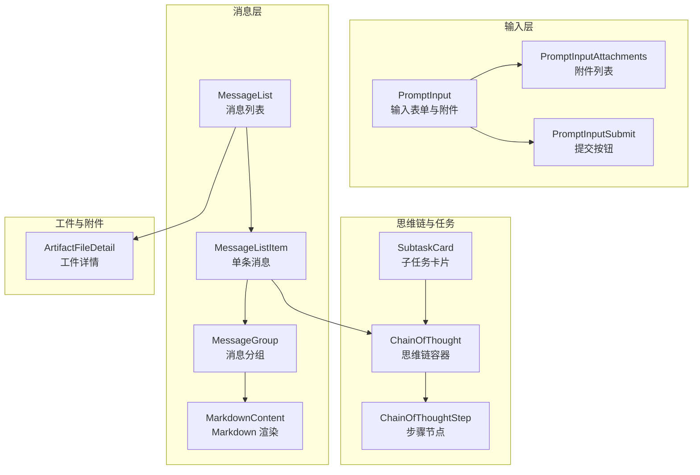
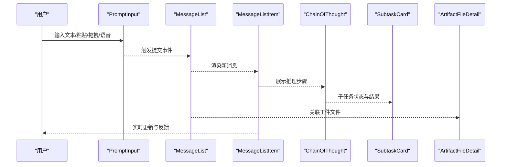
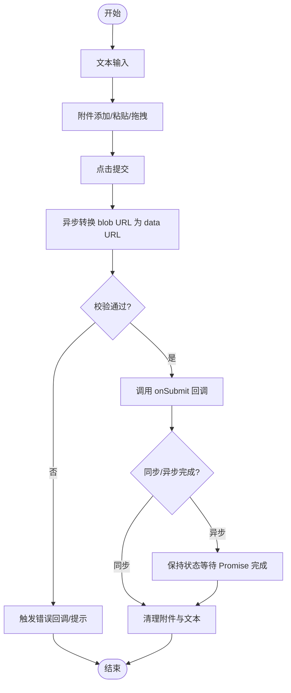
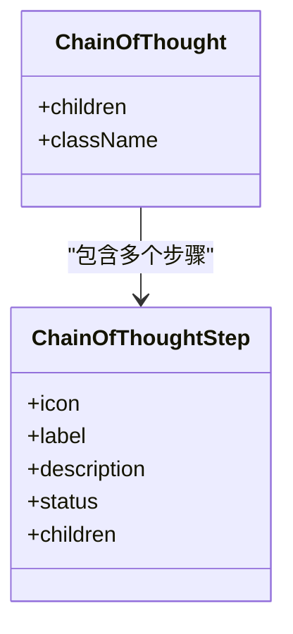
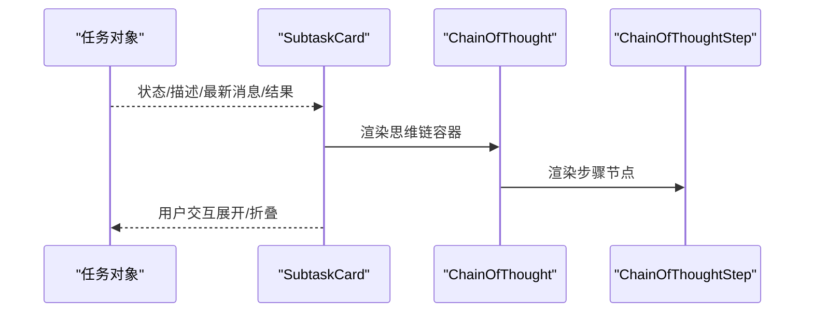
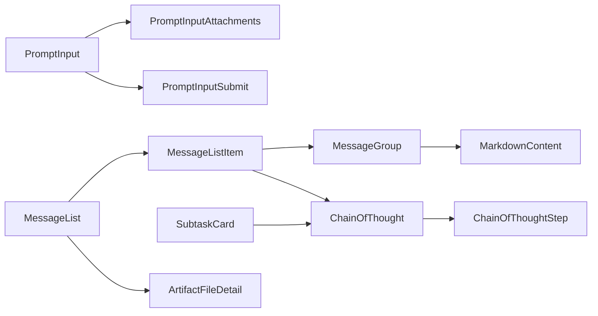

# AI 元素组件

<cite>
**本文引用的文件**
- [prompt-input.tsx](file://frontend/src/components/ai-elements/prompt-input.tsx)
- [chain-of-thought.tsx](file://frontend/src/components/ai-elements/chain-of-thought.tsx)
- [subtask-card.tsx](file://frontend/src/components/workspace/messages/subtask-card.tsx)
- [markdown-content.tsx](file://frontend/src/components/workspace/messages/markdown-content.tsx)
- [message-group.tsx](file://frontend/src/components/workspace/messages/message-group.tsx)
- [message-list-item.tsx](file://frontend/src/components/workspace/messages/message-list-item.tsx)
- [message-list.tsx](file://frontend/src/components/workspace/messages/message-list.tsx)
- [artifact-file-detail.tsx](file://frontend/src/components/workspace/artifacts/artifact-file-detail.tsx)
- [input-box.tsx](file://frontend/src/components/workspace/input-box.tsx)
- [chat-box.tsx](file://frontend/src/components/workspace/chats/chat-box.tsx)
- [hooks.ts](file://frontend/src/core/threads/hooks.ts)
- [reasoning-trigger.test.ts](file://frontend/tests/unit/core/reasoning-trigger.test.ts)
</cite>

## 目录
1. [简介](#简介)
2. [项目结构](#项目结构)
3. [核心组件](#核心组件)
4. [架构总览](#架构总览)
5. [组件详解](#组件详解)
6. [依赖关系分析](#依赖关系分析)
7. [性能考量](#性能考量)
8. [故障排查指南](#故障排查指南)
9. [结论](#结论)
10. [附录](#附录)

## 简介
本技术文档面向 DeerFlow 的 AI 元素组件体系，聚焦于为 AI 代理交互而设计的一套可复用 UI 组件与交互模式。内容覆盖消息展示、工件管理、思维链可视化、任务执行与输入控制等核心能力，并深入解析各组件在对话流程中的职责、数据绑定方式、异步数据流处理、实时更新与状态同步机制。同时提供组件组合使用范式、性能优化建议与扩展开发指南，帮助开发者快速构建稳定、可维护且高性能的 AI 对话界面。

## 项目结构
AI 元素组件主要位于前端工程的组件库中，围绕“消息渲染”“输入控制”“思维链可视化”“任务与工件展示”等维度组织。核心文件分布如下：
- 输入与交互：prompt-input.tsx 及其配套的输入工具与菜单项
- 消息与内容：message-list、message-list-item、message-group、markdown-content
- 思维链与任务：chain-of-thought.tsx、subtask-card.tsx
- 工件与附件：artifact-file-detail.tsx
- 页面集成：input-box.tsx、chat-box.tsx
- 核心钩子与测试：hooks.ts、reasoning-trigger.test.ts

图表来源
- [prompt-input.tsx:447-851](file://frontend/src/components/ai-elements/prompt-input.tsx#L447-L851)
- [message-list.tsx:1-200](file://frontend/src/components/workspace/messages/message-list.tsx#L1-L200)
- [message-list-item.tsx:1-120](file://frontend/src/components/workspace/messages/message-list-item.tsx#L1-L120)
- [message-group.tsx:1-120](file://frontend/src/components/workspace/messages/message-group.tsx#L1-L120)
- [markdown-content.tsx:1-120](file://frontend/src/components/workspace/messages/markdown-content.tsx#L1-L120)
- [chain-of-thought.tsx:116-165](file://frontend/src/components/ai-elements/chain-of-thought.tsx#L116-L165)
- [subtask-card.tsx:75-177](file://frontend/src/components/workspace/messages/subtask-card.tsx#L75-L177)
- [artifact-file-detail.tsx:1-80](file://frontend/src/components/workspace/artifacts/artifact-file-detail.tsx#L1-L80)

章节来源
- [prompt-input.tsx:1-1470](file://frontend/src/components/ai-elements/prompt-input.tsx#L1-L1470)
- [message-list.tsx:1-200](file://frontend/src/components/workspace/messages/message-list.tsx#L1-L200)
- [message-list-item.tsx:1-120](file://frontend/src/components/workspace/messages/message-list-item.tsx#L1-L120)
- [message-group.tsx:1-120](file://frontend/src/components/workspace/messages/message-group.tsx#L1-L120)
- [markdown-content.tsx:1-120](file://frontend/src/components/workspace/messages/markdown-content.tsx#L1-L120)
- [chain-of-thought.tsx:116-165](file://frontend/src/components/ai-elements/chain-of-thought.tsx#L116-L165)
- [subtask-card.tsx:75-177](file://frontend/src/components/workspace/messages/subtask-card.tsx#L75-L177)
- [artifact-file-detail.tsx:1-80](file://frontend/src/components/workspace/artifacts/artifact-file-detail.tsx#L1-L80)

## 核心组件
本节概述各组件在 AI 对话流程中的角色与职责：
- PromptInput：统一的用户输入入口，支持文本、粘贴、拖拽、语音识别、附件上传与预览，提供全局或局部状态管理。
- MessageList/MessageListItem/MessageGroup：负责消息的聚合、渲染与 Markdown 内容展示。
- ChainOfThought/ChainOfThoughtStep：用于展示代理的推理过程，支持步骤状态、图标与描述。
- SubtaskCard：展示子任务的生命周期（进行中/已完成/失败），并呈现提示词、工具调用解释与结果。
- ArtifactFileDetail：展示与对话相关的工件文件信息与预览。
- input-box.tsx 与 chat-box.tsx：页面级容器，整合输入与消息展示，驱动对话会话。

章节来源
- [prompt-input.tsx:447-851](file://frontend/src/components/ai-elements/prompt-input.tsx#L447-L851)
- [message-list.tsx:1-200](file://frontend/src/components/workspace/messages/message-list.tsx#L1-L200)
- [message-list-item.tsx:1-120](file://frontend/src/components/workspace/messages/message-list-item.tsx#L1-L120)
- [message-group.tsx:1-120](file://frontend/src/components/workspace/messages/message-group.tsx#L1-L120)
- [markdown-content.tsx:1-120](file://frontend/src/components/workspace/messages/markdown-content.tsx#L1-L120)
- [chain-of-thought.tsx:116-165](file://frontend/src/components/ai-elements/chain-of-thought.tsx#L116-L165)
- [subtask-card.tsx:75-177](file://frontend/src/components/workspace/messages/subtask-card.tsx#L75-L177)
- [artifact-file-detail.tsx:1-80](file://frontend/src/components/workspace/artifacts/artifact-file-detail.tsx#L1-L80)
- [input-box.tsx:1-120](file://frontend/src/components/workspace/input-box.tsx#L1-L120)
- [chat-box.tsx:1-120](file://frontend/src/components/workspace/chats/chat-box.tsx#L1-L120)

## 架构总览
AI 元素组件通过“输入-消息-思维链-工件”的层次化结构串联起一次完整的对话体验。输入层负责捕获用户意图与附件；消息层负责渲染与组织；思维链与任务卡片用于透明化代理决策；工件模块则承载对话产出物。

图表来源
- [prompt-input.tsx:753-818](file://frontend/src/components/ai-elements/prompt-input.tsx#L753-L818)
- [message-list.tsx:1-200](file://frontend/src/components/workspace/messages/message-list.tsx#L1-L200)
- [message-list-item.tsx:1-120](file://frontend/src/components/workspace/messages/message-list-item.tsx#L1-L120)
- [chain-of-thought.tsx:116-165](file://frontend/src/components/ai-elements/chain-of-thought.tsx#L116-L165)
- [subtask-card.tsx:75-177](file://frontend/src/components/workspace/messages/subtask-card.tsx#L75-L177)
- [artifact-file-detail.tsx:1-80](file://frontend/src/components/workspace/artifacts/artifact-file-detail.tsx#L1-L80)

## 组件详解

### PromptInput：统一输入与附件管理
- 职责
  - 文本输入：受控/非受控两种模式，支持 IME 输入法组合状态处理。
  - 附件管理：支持本地/全局附件上下文，提供添加、移除、清空与文件预览。
  - 交互增强：粘贴上传、拖拽接收、全局/表单级拖放、语音识别按钮。
  - 提交流程：统一收集文本与附件，异步转换 blob URL 为 data URL，触发回调并清理状态。
- 数据绑定
  - 使用 React Context 在 Provider 与子组件间共享文本与附件状态。
  - 支持外部注册文件输入以联动菜单操作。
- 异步与实时
  - 附件上传采用 blob URL 到 data URL 的异步转换，避免阻塞 UI。
  - 提交后根据返回结果决定是否清理附件与文本，错误时不清理便于重试。
- 关键实现要点
  - 附件状态提升至 Provider，便于跨组件共享与统一清理。
  - 拖拽与粘贴事件在表单与文档级别分别处理，满足不同场景。
  - 语音识别基于 Web API，自动管理监听状态与回调。

图表来源
- [prompt-input.tsx:753-818](file://frontend/src/components/ai-elements/prompt-input.tsx#L753-L818)
- [prompt-input.tsx:820-851](file://frontend/src/components/ai-elements/prompt-input.tsx#L820-L851)

章节来源
- [prompt-input.tsx:1-1470](file://frontend/src/components/ai-elements/prompt-input.tsx#L1-L1470)

### ChainOfThought 与 ChainOfThoughtStep：思维链可视化
- 职责
  - 作为思维链容器，组织多个步骤节点。
  - 步骤节点支持图标、标签、描述与子内容，状态分为完成/进行中/待定。
- 数据绑定
  - 通过 props 接收状态与内容，配合动画与样式区分当前步骤。
- 交互行为
  - 与消息项结合，展示代理在不同阶段的思考轨迹。
- 复杂度与性能
  - 节点渲染为轻量 DOM 结构，适合频繁更新的流式展示。

图表来源
- [chain-of-thought.tsx:116-165](file://frontend/src/components/ai-elements/chain-of-thought.tsx#L116-L165)

章节来源
- [chain-of-thought.tsx:116-165](file://frontend/src/components/ai-elements/chain-of-thought.tsx#L116-L165)

### SubtaskCard：子任务生命周期展示
- 职责
  - 展示子任务的描述、状态（进行中/已完成/失败）与最新消息。
  - 进行中时显示工具调用解释与闪烁效果，失败时高亮错误信息。
  - 完成时展示最终结果的 Markdown 内容。
- 数据绑定
  - 通过任务对象的状态与消息字段驱动 UI 更新。
- 交互行为
  - 支持折叠/展开，动态切换标签与内容区域。
- 与思维链的关系
  - 子任务卡片内嵌思维链步骤，形成“任务-步骤-输出”的层级结构。

图表来源
- [subtask-card.tsx:75-177](file://frontend/src/components/workspace/messages/subtask-card.tsx#L75-L177)
- [chain-of-thought.tsx:116-165](file://frontend/src/components/ai-elements/chain-of-thought.tsx#L116-L165)

章节来源
- [subtask-card.tsx:75-177](file://frontend/src/components/workspace/messages/subtask-card.tsx#L75-L177)

### MarkdownContent：消息内容渲染
- 职责
  - 将 Markdown 内容渲染为安全的 HTML，支持数学公式、代码块与链接等。
- 集成点
  - 在消息项与子任务结果中使用，确保复杂内容的正确展示。
- 性能与安全
  - 通过插件系统扩展渲染能力，避免 XSS 风险。

章节来源
- [markdown-content.tsx:1-120](file://frontend/src/components/workspace/messages/markdown-content.tsx#L1-L120)

### MessageList、MessageListItem、MessageGroup：消息组织与渲染
- 职责
  - MessageList：承载所有消息，支持滚动与分页。
  - MessageListItem：单条消息的主体，包含时间戳、角色与内容。
  - MessageGroup：按角色或类型聚合消息，减少重复渲染。
- 集成点
  - 与 MarkdownContent、ChainOfThought、SubtaskCard 协作，形成完整的消息视图。
- 性能优化
  - 合理拆分渲染单元，避免整列表重绘。

章节来源
- [message-list.tsx:1-200](file://frontend/src/components/workspace/messages/message-list.tsx#L1-L200)
- [message-list-item.tsx:1-120](file://frontend/src/components/workspace/messages/message-list-item.tsx#L1-L120)
- [message-group.tsx:1-120](file://frontend/src/components/workspace/messages/message-group.tsx#L1-L120)

### ArtifactFileDetail：工件文件展示
- 职责
  - 展示与对话关联的工件文件元数据与预览，支持图片与文件类型。
- 集成点
  - 在消息列表或侧边栏中出现，便于回溯与复用对话产物。

章节来源
- [artifact-file-detail.tsx:1-80](file://frontend/src/components/workspace/artifacts/artifact-file-detail.tsx#L1-L80)

### 页面级集成：input-box 与 chat-box
- 职责
  - input-box：整合模型选择、建议与 PromptInput，提供统一的输入面板。
  - chat-box：承载消息列表与输入框，协调对话状态与滚动行为。
- 依赖
  - 依赖 AI 元素组件与核心 hooks，保证状态一致性。

章节来源
- [input-box.tsx:1-120](file://frontend/src/components/workspace/input-box.tsx#L1-L120)
- [chat-box.tsx:1-120](file://frontend/src/components/workspace/chats/chat-box.tsx#L1-L120)

## 依赖关系分析
- 组件耦合
  - PromptInput 与附件上下文解耦，既可独立使用也可被 Provider 提升状态。
  - 消息层组件与思维链组件松耦合，通过 props 传递状态与内容。
  - 工件组件与消息组件弱耦合，通过数据模型关联。
- 外部依赖
  - 使用 UI 基础组件库与渲染插件，确保一致的视觉与交互体验。
- 循环依赖
  - 当前结构无明显循环依赖，组件间通过 props 与 Context 协作。

图表来源
- [prompt-input.tsx:447-851](file://frontend/src/components/ai-elements/prompt-input.tsx#L447-L851)
- [message-list.tsx:1-200](file://frontend/src/components/workspace/messages/message-list.tsx#L1-L200)
- [message-list-item.tsx:1-120](file://frontend/src/components/workspace/messages/message-list-item.tsx#L1-L120)
- [message-group.tsx:1-120](file://frontend/src/components/workspace/messages/message-group.tsx#L1-L120)
- [markdown-content.tsx:1-120](file://frontend/src/components/workspace/messages/markdown-content.tsx#L1-L120)
- [chain-of-thought.tsx:116-165](file://frontend/src/components/ai-elements/chain-of-thought.tsx#L116-L165)
- [subtask-card.tsx:75-177](file://frontend/src/components/workspace/messages/subtask-card.tsx#L75-L177)
- [artifact-file-detail.tsx:1-80](file://frontend/src/components/workspace/artifacts/artifact-file-detail.tsx#L1-L80)

章节来源
- [hooks.ts:1-50](file://frontend/src/core/threads/hooks.ts#L1-L50)
- [reasoning-trigger.test.ts:1-50](file://frontend/tests/unit/core/reasoning-trigger.test.ts#L1-L50)

## 性能考量
- 附件处理
  - 使用 blob URL 预览并在提交前异步转换为 data URL，避免主线程阻塞。
  - 提供附件清理钩子，防止内存泄漏。
- 渲染优化
  - 将消息与步骤拆分为细粒度组件，减少不必要的重渲染。
  - 使用受控输入与 IME 状态检测，避免输入抖动。
- 流式更新
  - 提交后根据 Promise 结果决定清理时机，保证状态一致性与用户体验。
- 可访问性
  - 为按钮与输入提供语义化标签与键盘快捷键支持。

## 故障排查指南
- 提交按钮禁用
  - 检查提交按钮的禁用条件与表单状态，确保在输入有效时启用。
- 附件无法删除
  - 确认附件上下文是否正确注入，以及移除回调是否被调用。
- 语音识别不可用
  - 检查浏览器兼容性与权限设置，确认 SpeechRecognition API 是否可用。
- 拖拽/粘贴无效
  - 确认拖拽事件监听范围（表单级 vs 全局），以及文件类型与大小限制。
- 错误不清理
  - 若提交回调抛错，组件不会自动清理附件与文本，需手动处理或重试。

章节来源
- [prompt-input.tsx:877-940](file://frontend/src/components/ai-elements/prompt-input.tsx#L877-L940)
- [prompt-input.tsx:1168-1271](file://frontend/src/components/ai-elements/prompt-input.tsx#L1168-L1271)

## 结论
DeerFlow 的 AI 元素组件以清晰的层次化结构与灵活的上下文设计，实现了从输入到消息、从思维链到工件的全链路可视化与交互。通过合理的异步处理、状态同步与渲染优化，组件在复杂对话场景中仍能保持流畅与稳定。建议在扩展新功能时遵循现有模式，优先使用 Provider 提升状态、通过 props 传递数据、并通过测试验证交互与性能。

## 附录
- 扩展开发建议
  - 新增组件时优先考虑与现有上下文的集成点，尽量复用附件与输入逻辑。
  - 对于需要流式更新的场景，采用 Promise 包装提交回调，确保清理时机可控。
  - 为关键交互提供无障碍支持与键盘快捷键，提升可用性。
- 组件组合示例思路
  - 输入面板：PromptInput + PromptInputAttachments + PromptInputSubmit
  - 消息展示：MessageList + MessageListItem + MessageGroup + MarkdownContent
  - 思维链：ChainOfThought + ChainOfThoughtStep
  - 任务卡片：SubtaskCard（内嵌思维链与结果）
  - 工件展示：ArtifactFileDetail