# Landing 页面组件

<cite>
**本文引用的文件**
- [frontend/src/app/page.tsx](file://frontend/src/app/page.tsx)
- [frontend/src/app/layout.tsx](file://frontend/src/app/layout.tsx)
- [frontend/src/components/landing/header.tsx](file://frontend/src/components/landing/header.tsx)
- [frontend/src/components/landing/hero.tsx](file://frontend/src/components/landing/hero.tsx)
- [frontend/src/components/landing/footer.tsx](file://frontend/src/components/landing/footer.tsx)
- [frontend/src/components/landing/section.tsx](file://frontend/src/components/landing/section.tsx)
- [frontend/src/components/landing/sections/case-study-section.tsx](file://frontend/src/components/landing/sections/case-study-section.tsx)
- [frontend/src/components/landing/sections/skills-section.tsx](file://frontend/src/components/landing/sections/skills-section.tsx)
- [frontend/src/components/landing/sections/sandbox-section.tsx](file://frontend/src/components/landing/sections/sandbox-section.tsx)
- [frontend/src/components/landing/sections/community-section.tsx](file://frontend/src/components/landing/sections/community-section.tsx)
- [frontend/src/components/landing/sections/whats-new-section.tsx](file://frontend/src/components/landing/sections/whats-new-section.tsx)
- [frontend/src/components/landing/progressive-skills-animation.tsx](file://frontend/src/components/landing/progressive-skills-animation.tsx)
</cite>

## 目录
1. [简介](#简介)
2. [项目结构](#项目结构)
3. [核心组件](#核心组件)
4. [架构总览](#架构总览)
5. [详细组件分析](#详细组件分析)
6. [依赖关系分析](#依赖关系分析)
7. [性能考量](#性能考量)
8. [故障排查指南](#故障排查指南)
9. [结论](#结论)
10. [附录](#附录)

## 简介
本技术文档聚焦 DeerFlow Landing 页面组件体系，系统性梳理首页与营销页面的组件构成与实现细节，覆盖头部导航、英雄区域、功能展示、案例研究、社区入口与“最新特性”等核心模块。文档从视觉设计、动画效果与响应式布局三个维度展开，并解释数据获取方式、内容管理与 SEO 优化策略，最后提供组件定制示例、内容编辑指南与性能优化建议。

## 项目结构
Landing 页面位于前端 Next.js 应用中，采用按功能分层的组织方式：
- 页面级入口：应用根路由渲染 Landing 页面
- 布局级入口：RootLayout 负责全局主题、国际化与元数据
- Landing 页面由多个 Landing 区块组成，每个区块封装独立功能与样式
- 共享容器组件用于统一标题、副标题与间距风格

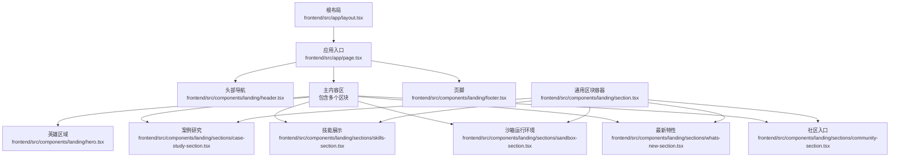

**图表来源**
- [frontend/src/app/page.tsx:10-25](file://frontend/src/app/page.tsx#L10-L25)
- [frontend/src/app/layout.tsx:15-28](file://frontend/src/app/layout.tsx#L15-L28)
- [frontend/src/components/landing/hero.tsx:13-89](file://frontend/src/components/landing/hero.tsx#L13-L89)
- [frontend/src/components/landing/section.tsx:3-29](file://frontend/src/components/landing/section.tsx#L3-L29)

**章节来源**
- [frontend/src/app/page.tsx:10-25](file://frontend/src/app/page.tsx#L10-L25)
- [frontend/src/app/layout.tsx:15-28](file://frontend/src/app/layout.tsx#L15-L28)

## 核心组件
- 头部导航 Header：固定定位、品牌标识、导航链接、GitHub 星标计数（可选）、渐变光晕背景与分隔线
- 英雄区域 Hero：星空背景、网格闪烁、文字轮播、品牌合作标识（可选）、行动按钮
- 案例研究 CaseStudySection：多列卡片展示真实使用场景，悬停缩放与明暗渐变遮罩
- 技能展示 SkillsSection：全屏高度区块，内嵌“渐进加载技能动画”
- 沙箱运行环境 SandboxSection：终端模拟器与描述并排布局，强调隔离、安全、持久化等特性
- 最新特性 WhatsNewSection：魔方拼接卡片布局，突出长短期记忆、规划拆解、可扩展性、持久化沙箱、多模型支持与开源免费
- 社区入口 CommunitySection：强调加入社区的号召性按钮
- 通用区块容器 Section：统一样式化的标题、副标题与内容区
- 页脚 Footer：横幅分隔线、标语与版权信息

**章节来源**
- [frontend/src/components/landing/header.tsx:17-79](file://frontend/src/components/landing/header.tsx#L17-L79)
- [frontend/src/components/landing/hero.tsx:13-89](file://frontend/src/components/landing/hero.tsx#L13-L89)
- [frontend/src/components/landing/sections/case-study-section.tsx:9-99](file://frontend/src/components/landing/sections/case-study-section.tsx#L9-L99)
- [frontend/src/components/landing/sections/skills-section.tsx:8-28](file://frontend/src/components/landing/sections/skills-section.tsx#L8-L28)
- [frontend/src/components/landing/sections/sandbox-section.tsx:11-126](file://frontend/src/components/landing/sections/sandbox-section.tsx#L11-L126)
- [frontend/src/components/landing/sections/whats-new-section.tsx:51-63](file://frontend/src/components/landing/sections/whats-new-section.tsx#L51-L63)
- [frontend/src/components/landing/sections/community-section.tsx:11-35](file://frontend/src/components/landing/sections/community-section.tsx#L11-L35)
- [frontend/src/components/landing/section.tsx:3-29](file://frontend/src/components/landing/section.tsx#L3-L29)
- [frontend/src/components/landing/footer.tsx:9-30](file://frontend/src/components/landing/footer.tsx#L9-L30)

## 架构总览
Landing 页面采用“页面容器 + 多区块组件”的组合模式，页面负责布局与顺序，各区块负责各自的内容与交互；通用容器组件统一风格，便于维护与扩展。

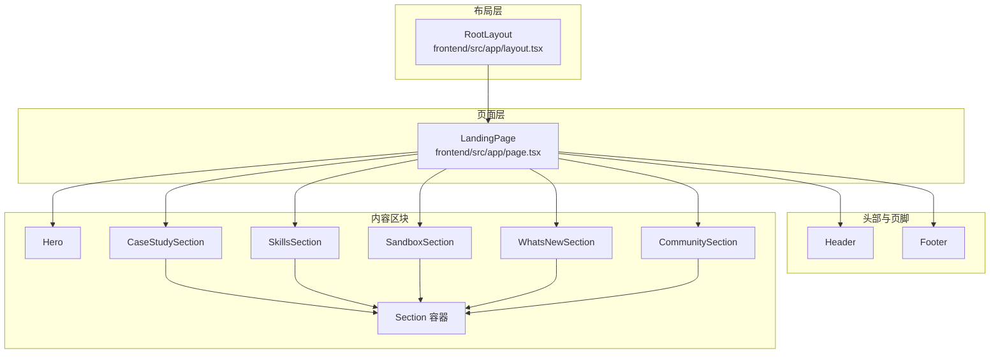

**图表来源**
- [frontend/src/app/page.tsx:10-25](file://frontend/src/app/page.tsx#L10-L25)
- [frontend/src/app/layout.tsx:15-28](file://frontend/src/app/layout.tsx#L15-L28)
- [frontend/src/components/landing/section.tsx:3-29](file://frontend/src/components/landing/section.tsx#L3-L29)

## 详细组件分析

### 头部导航 Header
- 固定定位与模糊背景，营造沉浸式体验
- 左侧品牌名与外链跳转（默认指向仓库主页）
- 导航菜单：文档与博客入口，支持国际化语言切换
- 右侧 GitHub 星标计数（静态网站模式下启用），通过 GitHub API 获取星标数并缓存
- 渐变光晕与分隔线增强层次感

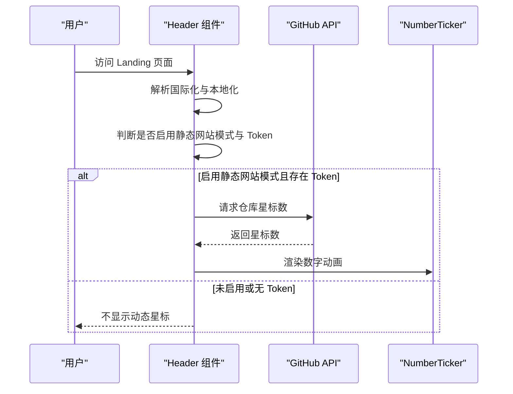

**图表来源**
- [frontend/src/components/landing/header.tsx:17-79](file://frontend/src/components/landing/header.tsx#L17-L79)
- [frontend/src/components/landing/header.tsx:82-116](file://frontend/src/components/landing/header.tsx#L82-L116)

**章节来源**
- [frontend/src/components/landing/header.tsx:17-79](file://frontend/src/components/landing/header.tsx#L17-L79)

### 英雄区域 Hero
- 星空背景与网格闪烁效果，提升视觉层次
- 文字轮播展示能力关键词，强化品牌价值主张
- 品牌合作标识（静态网站模式下）增强可信度
- 行动按钮引导至工作区

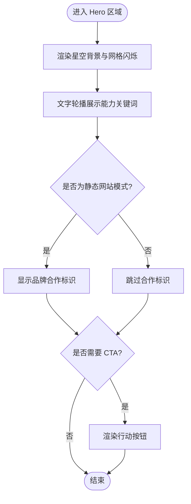

**图表来源**
- [frontend/src/components/landing/hero.tsx:13-89](file://frontend/src/components/landing/hero.tsx#L13-L89)

**章节来源**
- [frontend/src/components/landing/hero.tsx:13-89](file://frontend/src/components/landing/hero.tsx#L13-L89)

### 案例研究 CaseStudySection
- 使用卡片网格布局展示真实案例，支持响应式列数变化
- 悬停时图片缩放与亮度调整，底部渐变遮罩展示标题与描述
- 链接跳转到对应线程详情页（带 mock 参数）

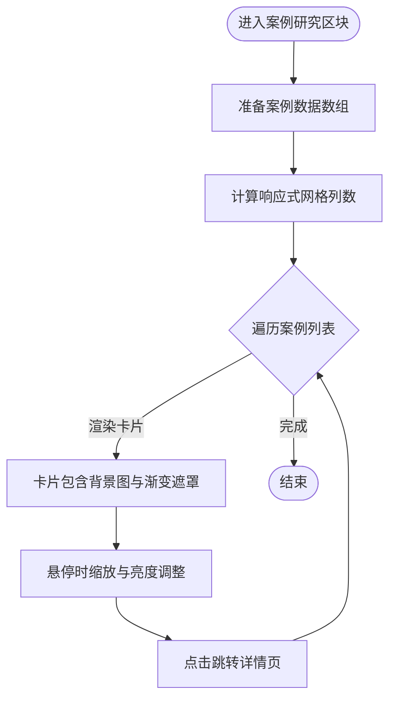

**图表来源**
- [frontend/src/components/landing/sections/case-study-section.tsx:9-99](file://frontend/src/components/landing/sections/case-study-section.tsx#L9-L99)

**章节来源**
- [frontend/src/components/landing/sections/case-study-section.tsx:9-99](file://frontend/src/components/landing/sections/case-study-section.tsx#L9-L99)

### 技能展示 SkillsSection 与渐进加载动画 ProgressiveSkillsAnimation
- SkillsSection 作为容器区块，内部嵌入 ProgressiveSkillsAnimation
- 动画以时间轴驱动，包含“用户输入、扫描、加载技能、加载模板、研究、加载前端、构建、加载部署、部署、完成”等阶段
- 文件树与聊天界面同步展示当前阶段，支持自动播放与手动控制
- 搜索步骤与构建进度通过定时器逐步推进，滚动到底部增强观感

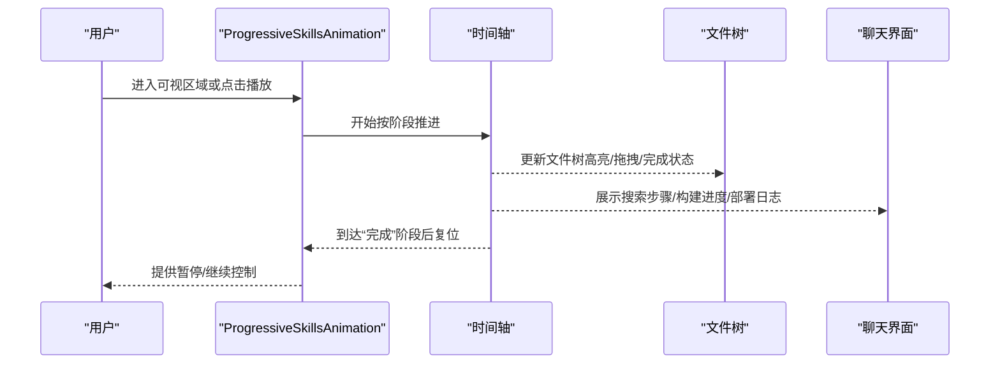

**图表来源**
- [frontend/src/components/landing/sections/skills-section.tsx:8-28](file://frontend/src/components/landing/sections/skills-section.tsx#L8-L28)
- [frontend/src/components/landing/progressive-skills-animation.tsx:64-135](file://frontend/src/components/landing/progressive-skills-animation.tsx#L64-L135)
- [frontend/src/components/landing/progressive-skills-animation.tsx:162-197](file://frontend/src/components/landing/progressive-skills-animation.tsx#L162-L197)
- [frontend/src/components/landing/progressive-skills-animation.tsx:199-220](file://frontend/src/components/landing/progressive-skills-animation.tsx#L199-L220)

**章节来源**
- [frontend/src/components/landing/sections/skills-section.tsx:8-28](file://frontend/src/components/landing/sections/skills-section.tsx#L8-L28)
- [frontend/src/components/landing/progressive-skills-animation.tsx:64-135](file://frontend/src/components/landing/progressive-skills-animation.tsx#L64-L135)
- [frontend/src/components/landing/progressive-skills-animation.tsx:162-197](file://frontend/src/components/landing/progressive-skills-animation.tsx#L162-L197)
- [frontend/src/components/landing/progressive-skills-animation.tsx:199-220](file://frontend/src/components/landing/progressive-skills-animation.tsx#L199-L220)

### 沙箱运行环境 SandboxSection
- 左侧终端模拟器展示命令行操作流程（安装依赖、生成代码、测试、下载数据等）
- 右侧描述强调 AIO Sandbox 的特性标签（隔离、安全、持久化、挂载文件系统、长时间任务）
- 链接指向相关仓库，增强信任与可追溯性

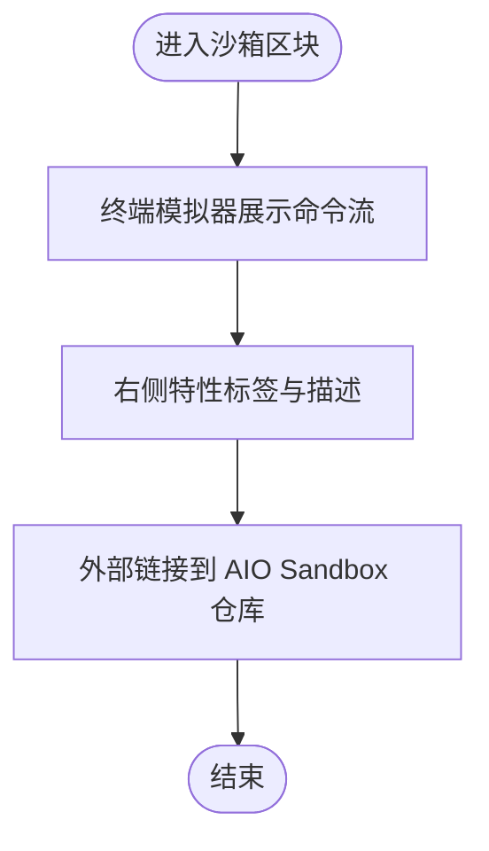

**图表来源**
- [frontend/src/components/landing/sections/sandbox-section.tsx:11-126](file://frontend/src/components/landing/sections/sandbox-section.tsx#L11-L126)

**章节来源**
- [frontend/src/components/landing/sections/sandbox-section.tsx:11-126](file://frontend/src/components/landing/sections/sandbox-section.tsx#L11-L126)

### 最新特性 WhatsNewSection
- 使用魔方拼接卡片布局，展示 DeerFlow 2.0 的六大特性
- 卡片配色与文案统一，突出“长期/短期记忆、长任务规划、可扩展技能与工具、持久化沙箱、多模型支持、开源免费”

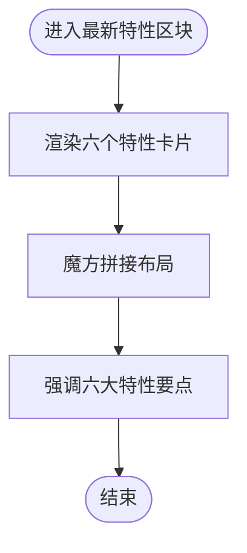

**图表来源**
- [frontend/src/components/landing/sections/whats-new-section.tsx:51-63](file://frontend/src/components/landing/sections/whats-new-section.tsx#L51-L63)

**章节来源**
- [frontend/src/components/landing/sections/whats-new-section.tsx:51-63](file://frontend/src/components/landing/sections/whats-new-section.tsx#L51-L63)

### 社区入口 CommunitySection
- 使用渐变文字标题与号召性按钮，引导用户参与社区贡献
- 按钮链接至 GitHub 仓库

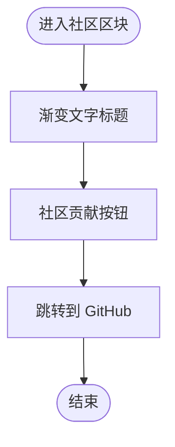

**图表来源**
- [frontend/src/components/landing/sections/community-section.tsx:11-35](file://frontend/src/components/landing/sections/community-section.tsx#L11-L35)

**章节来源**
- [frontend/src/components/landing/sections/community-section.tsx:11-35](file://frontend/src/components/landing/sections/community-section.tsx#L11-L35)

### 通用区块容器 Section
- 统一标题、副标题与内容区的布局与样式
- 适配不同区块的标题复杂度（纯文本或渐变文字）

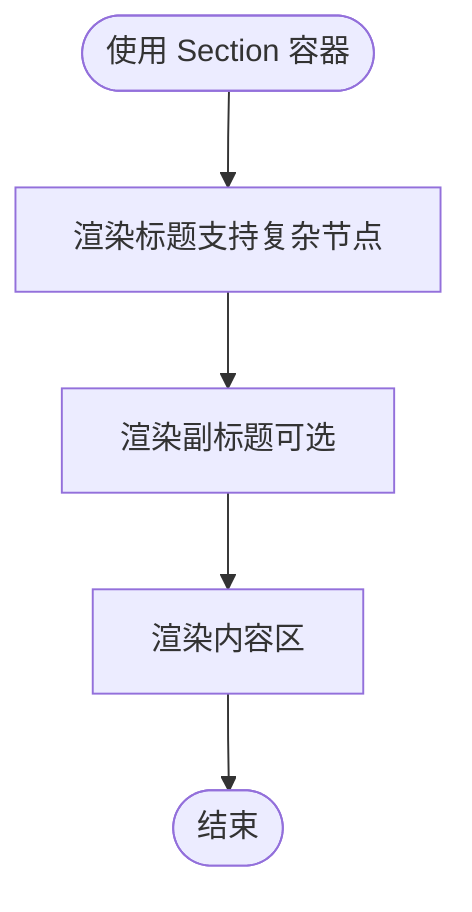

**图表来源**
- [frontend/src/components/landing/section.tsx:3-29](file://frontend/src/components/landing/section.tsx#L3-L29)

**章节来源**
- [frontend/src/components/landing/section.tsx:3-29](file://frontend/src/components/landing/section.tsx#L3-L29)

### 页脚 Footer
- 分隔线与标语增强品牌印象
- 版权信息与许可证声明

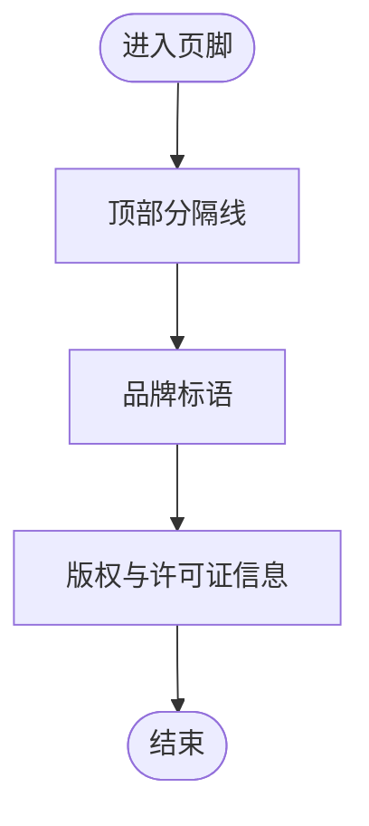

**图表来源**
- [frontend/src/components/landing/footer.tsx:9-30](file://frontend/src/components/landing/footer.tsx#L9-L30)

**章节来源**
- [frontend/src/components/landing/footer.tsx:9-30](file://frontend/src/components/landing/footer.tsx#L9-L30)

## 依赖关系分析
- 页面层依赖所有区块组件，形成单一职责的组合结构
- 区块层共享 Section 容器，降低重复样式逻辑
- Header 依赖国际化与环境变量，可能依赖外部 API
- ProgressiveSkillsAnimation 内含复杂状态机与定时器，耦合度较高但职责清晰

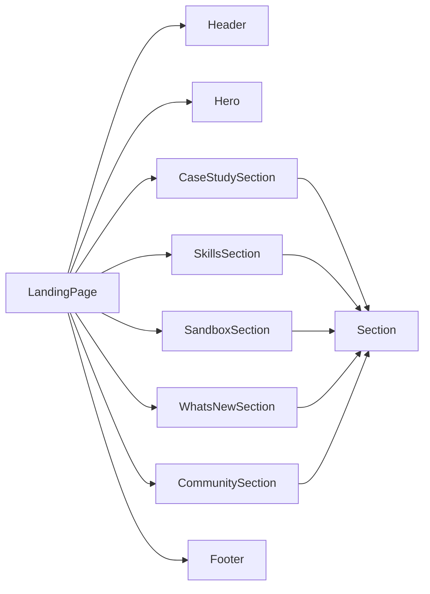

**图表来源**
- [frontend/src/app/page.tsx:10-25](file://frontend/src/app/page.tsx#L10-L25)
- [frontend/src/components/landing/section.tsx:3-29](file://frontend/src/components/landing/section.tsx#L3-L29)

**章节来源**
- [frontend/src/app/page.tsx:10-25](file://frontend/src/app/page.tsx#L10-L25)

## 性能考量
- 图像懒加载与占位符：案例研究卡片背景图建议使用占位符与懒加载，避免阻塞首屏
- 动画节流：ProgressiveSkillsAnimation 使用 IntersectionObserver 控制自动播放，减少不必要的渲染
- 终端与滚动：聊天界面自动滚动仅在非空状态下触发，避免无效滚动
- 缓存策略：Header 中星标数通过 Next.js 缓存配置进行重验证，降低请求频率
- 响应式布局：网格列数随屏幕宽度自适应，减少大屏下的密集渲染

[本节为通用性能建议，不直接分析具体文件]

## 故障排查指南
- 星标计数不更新
  - 检查环境变量与 Token 是否正确配置
  - 观察网络面板与错误日志，确认 API 返回状态
  - 确认重验证配置与缓存策略
- 动画不自动播放
  - 检查可视区域阈值与容器尺寸
  - 确认首次进入时 hasAutoPlayed 状态未被提前设置
- 案例卡片无法跳转
  - 检查线程路径生成函数与 mock 参数传递
  - 确认目标页面存在且可访问
- 终端滚动异常
  - 确保消息变更时容器存在且可滚动
  - 避免在空状态下调用滚动 API

**章节来源**
- [frontend/src/components/landing/header.tsx:82-116](file://frontend/src/components/landing/header.tsx#L82-L116)
- [frontend/src/components/landing/progressive-skills-animation.tsx:162-197](file://frontend/src/components/landing/progressive-skills-animation.tsx#L162-L197)
- [frontend/src/components/landing/sections/case-study-section.tsx:56-61](file://frontend/src/components/landing/sections/case-study-section.tsx#L56-L61)
- [frontend/src/components/landing/progressive-skills-animation.tsx:222-230](file://frontend/src/components/landing/progressive-skills-animation.tsx#L222-L230)

## 结论
Landing 页面组件体系以清晰的职责划分与统一的容器风格为基础，结合丰富的动画与响应式布局，有效传达 DeerFlow 的核心价值与能力边界。通过合理的数据获取策略与缓存机制，兼顾了用户体验与性能表现。后续可在图像懒加载、动画节流与 SEO 元数据方面进一步优化。

## 附录
- 组件定制示例
  - 新增区块：基于 Section 容器快速搭建标题与内容区
  - 修改动画阶段：在 ProgressiveSkillsAnimation 的时间轴中新增或调整阶段
  - 替换图标与文案：根据业务需求替换 Hero 或 WhatsNewSection 中的文案与图标
- 内容编辑指南
  - 案例研究：在 CaseStudySection 中添加新的案例条目，确保线程 ID 与图片资源一致
  - 社区入口：在 CommunitySection 中修改链接与按钮文案
  - SEO 优化：在 RootLayout 中完善元数据与 Open Graph 标签
- 性能优化技巧
  - 使用 IntersectionObserver 控制动画与懒加载
  - 合理设置缓存与重验证策略
  - 减少不必要的 DOM 更新与滚动操作

[本节为通用指导，不直接分析具体文件]