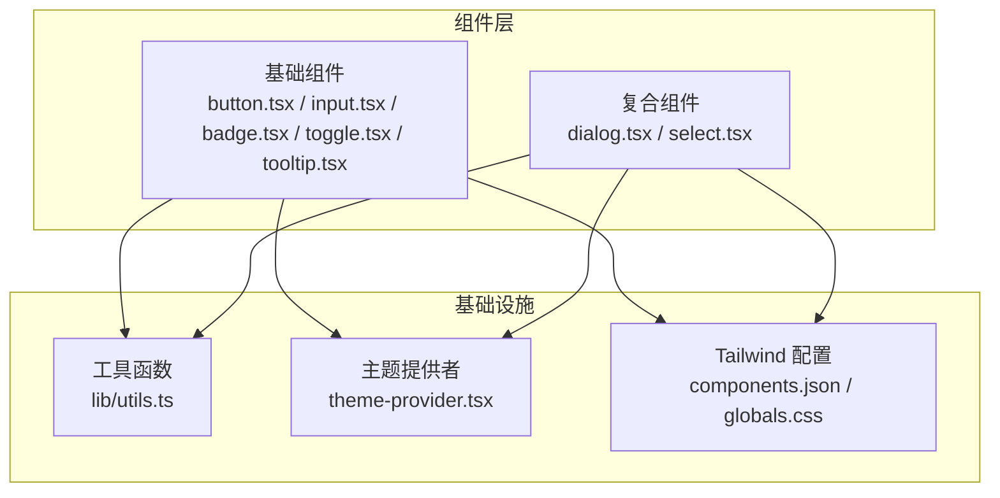
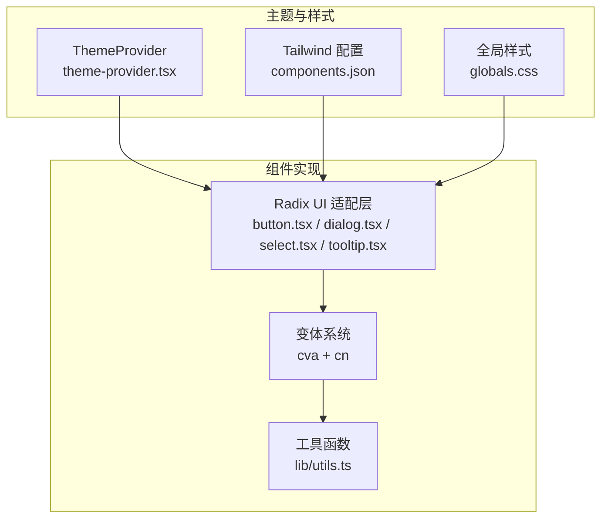
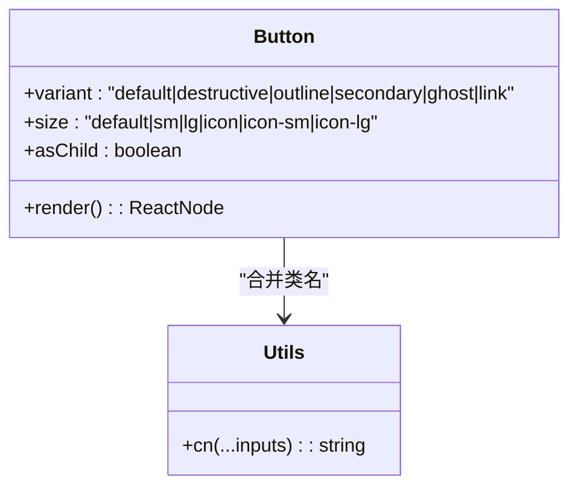
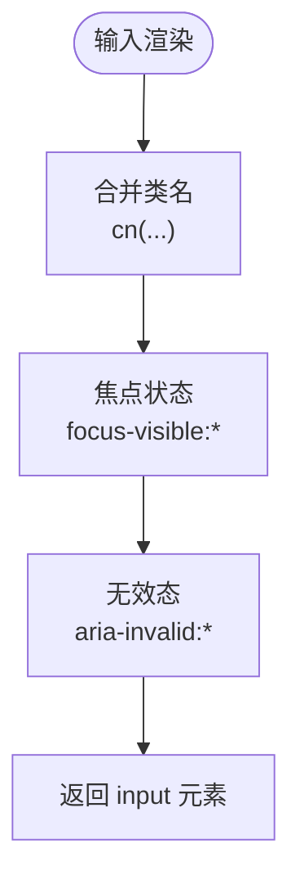
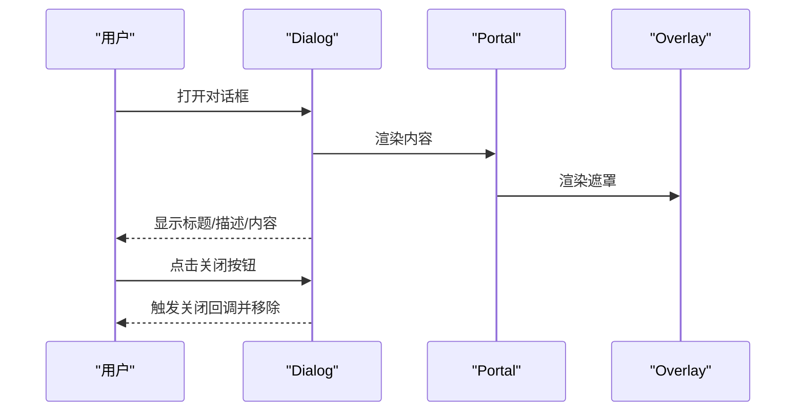
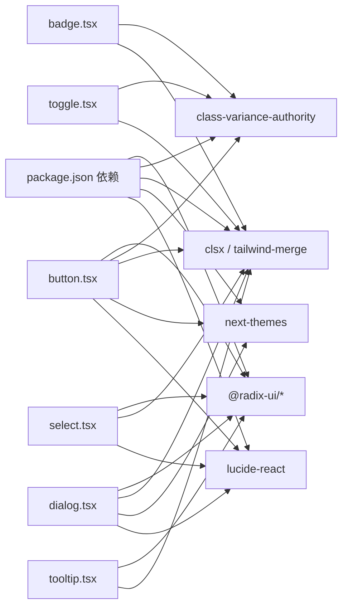

# UI 组件库

<cite>
**本文引用的文件**
- [package.json](file://frontend/package.json)
- [components.json](file://frontend/components.json)
- [README.md](file://README.md)
- [frontend/src/components/ui/button.tsx](file://frontend/src/components/ui/button.tsx)
- [frontend/src/components/ui/input.tsx](file://frontend/src/components/ui/input.tsx)
- [frontend/src/components/ui/dialog.tsx](file://frontend/src/components/ui/dialog.tsx)
- [frontend/src/components/ui/select.tsx](file://frontend/src/components/ui/select.tsx)
- [frontend/src/components/ui/badge.tsx](file://frontend/src/components/ui/badge.tsx)
- [frontend/src/components/ui/toggle.tsx](file://frontend/src/components/ui/toggle.tsx)
- [frontend/src/components/ui/tooltip.tsx](file://frontend/src/components/ui/tooltip.tsx)
- [frontend/src/lib/utils.ts](file://frontend/src/lib/utils.ts)
- [frontend/src/components/theme-provider.tsx](file://frontend/src/components/theme-provider.tsx)
- [frontend/src/styles/globals.css](file://frontend/src/styles/globals.css)
</cite>

## 目录
1. [简介](#简介)
2. [项目结构](#项目结构)
3. [核心组件](#核心组件)
4. [架构总览](#架构总览)
5. [组件详解](#组件详解)
6. [依赖关系分析](#依赖关系分析)
7. [性能与可访问性](#性能与可访问性)
8. [故障排查](#故障排查)
9. [结论](#结论)
10. [附录：使用示例与最佳实践](#附录使用示例与最佳实践)

## 简介
本文件为 DeerFlow 前端 UI 组件库的技术文档，聚焦于基于 Radix UI 与 Tailwind CSS 的组件体系，覆盖基础组件、复合组件与专用组件的设计理念与实现要点。文档从架构、数据流、处理逻辑、集成点、错误处理与性能特性等维度进行系统化梳理，并提供主题系统、无障碍访问支持与响应式设计的实现说明，以及使用示例、最佳实践与自定义扩展指南。

## 项目结构
前端采用 Next.js 应用，组件位于 src/components/ui 下，遵循“原子化 + 复合组件”的分层组织方式：
- 基础组件：按钮、输入框、徽标等通用控件
- 复合组件：对话框、选择器等由多个基础组件组合而成
- 专用组件：面向特定场景（如提示）的复合 UI 元素
- 工具与样式：工具函数、主题提供者、全局样式与 Tailwind 配置

图表来源
- [frontend/src/components/ui/button.tsx:1-64](file://frontend/src/components/ui/button.tsx#L1-L64)
- [frontend/src/components/ui/dialog.tsx:1-144](file://frontend/src/components/ui/dialog.tsx#L1-L144)
- [frontend/src/components/ui/select.tsx:1-191](file://frontend/src/components/ui/select.tsx#L1-L191)
- [frontend/src/components/ui/badge.tsx:1-47](file://frontend/src/components/ui/badge.tsx#L1-L47)
- [frontend/src/components/ui/toggle.tsx:1-47](file://frontend/src/components/ui/toggle.tsx#L1-L47)
- [frontend/src/components/ui/tooltip.tsx:1-35](file://frontend/src/components/ui/tooltip.tsx#L1-L35)
- [frontend/src/lib/utils.ts](file://frontend/src/lib/utils.ts)
- [frontend/src/components/theme-provider.tsx](file://frontend/src/components/theme-provider.tsx)
- [frontend/src/styles/globals.css](file://frontend/src/styles/globals.css)

章节来源
- [package.json:21-92](file://frontend/package.json#L21-L92)
- [components.json:1-27](file://frontend/components.json#L1-L27)

## 核心组件
本节概述 UI 组件库中的关键构件及其职责：
- 按钮 Button：提供多变体与尺寸，支持语义化渲染与可访问性增强
- 输入 Input：统一输入样式与焦点状态，内置无效态与选中态样式
- 徽标 Badge：用于标签、状态指示与强调信息
- 切换 Toggle：二态切换控件，支持默认与描边两种风格
- 提示 Tooltip：基于 Radix Tooltip Provider 的轻量提示容器
- 对话框 Dialog：模态交互容器，包含覆盖层、内容区、标题与描述
- 选择器 Select：下拉选择复合组件，支持分组、标签、滚动按钮与内容定位

章节来源
- [frontend/src/components/ui/button.tsx:1-64](file://frontend/src/components/ui/button.tsx#L1-L64)
- [frontend/src/components/ui/input.tsx:1-22](file://frontend/src/components/ui/input.tsx#L1-L22)
- [frontend/src/components/ui/badge.tsx:1-47](file://frontend/src/components/ui/badge.tsx#L1-L47)
- [frontend/src/components/ui/toggle.tsx:1-47](file://frontend/src/components/ui/toggle.tsx#L1-L47)
- [frontend/src/components/ui/tooltip.tsx:1-35](file://frontend/src/components/ui/tooltip.tsx#L1-L35)
- [frontend/src/components/ui/dialog.tsx:1-144](file://frontend/src/components/ui/dialog.tsx#L1-L144)
- [frontend/src/components/ui/select.tsx:1-191](file://frontend/src/components/ui/select.tsx#L1-L191)

## 架构总览
组件库以“基础能力 + 变体系统 + 组合模式”为核心设计原则：
- 基础能力：通过 Radix UI 提供可访问性与跨浏览器一致性
- 变体系统：使用 class-variance-authority 定义变体与尺寸，结合 cn 合并类名
- 组合模式：复合组件通过多个基础组件与 Portal 渲染，确保视觉与交互的一致性
- 主题与样式：通过 next-themes 与 Tailwind CSS 实现明暗主题切换与响应式布局

图表来源
- [frontend/src/components/theme-provider.tsx](file://frontend/src/components/theme-provider.tsx)
- [frontend/src/components/ui/button.tsx:1-64](file://frontend/src/components/ui/button.tsx#L1-L64)
- [frontend/src/components/ui/dialog.tsx:1-144](file://frontend/src/components/ui/dialog.tsx#L1-L144)
- [frontend/src/components/ui/select.tsx:1-191](file://frontend/src/components/ui/select.tsx#L1-L191)
- [frontend/src/components/ui/tooltip.tsx:1-35](file://frontend/src/components/ui/tooltip.tsx#L1-L35)
- [frontend/src/lib/utils.ts](file://frontend/src/lib/utils.ts)
- [frontend/src/styles/globals.css](file://frontend/src/styles/globals.css)
- [components.json:1-27](file://frontend/components.json#L1-L27)

## 组件详解

### 按钮 Button
- 设计理念：统一的语义化渲染，支持 asChild 将语义标签映射到任意元素；通过变体与尺寸控制外观与尺寸
- 关键属性
  - variant：default / destructive / outline / secondary / ghost / link
  - size：default / sm / lg / icon / icon-sm / icon-lg
  - asChild：是否将根节点渲染为子元素
- 事件与交互：原生 button 行为，支持禁用、焦点环、无效态高亮
- 样式定制：基于 cva 定义，结合 cn 合并传入 className；支持 data-variant 与 data-size 数据槽
- 可访问性：自动继承 Radix 触发器的可访问性行为，配合焦点可见环与 aria-invalid

图表来源
- [frontend/src/components/ui/button.tsx:1-64](file://frontend/src/components/ui/button.tsx#L1-L64)
- [frontend/src/lib/utils.ts](file://frontend/src/lib/utils.ts)

章节来源
- [frontend/src/components/ui/button.tsx:1-64](file://frontend/src/components/ui/button.tsx#L1-L64)

### 输入 Input
- 设计理念：统一输入框样式，内置占位符、选中态、焦点环与无效态
- 关键属性：type、className（透传原生 input）
- 样式定制：通过 cn 合并传入类名，支持 focus-visible 与 aria-invalid
- 可访问性：自动继承原生输入的可访问性语义

图表来源
- [frontend/src/components/ui/input.tsx:1-22](file://frontend/src/components/ui/input.tsx#L1-L22)
- [frontend/src/lib/utils.ts](file://frontend/src/lib/utils.ts)

章节来源
- [frontend/src/components/ui/input.tsx:1-22](file://frontend/src/components/ui/input.tsx#L1-L22)

### 徽标 Badge
- 设计理念：用于标签、状态与强调信息，支持 asChild 与多种变体
- 关键属性：variant（default / secondary / destructive / outline）、asChild
- 样式定制：基于 cva 定义，支持 focus-visible 与 aria-invalid

章节来源
- [frontend/src/components/ui/badge.tsx:1-47](file://frontend/src/components/ui/badge.tsx#L1-L47)

### 切换 Toggle
- 设计理念：二态切换控件，支持默认与描边风格，尺寸可选
- 关键属性：variant（default / outline）、size（default / sm / lg）、data-state
- 样式定制：基于 cva，支持 focus-visible 与 aria-invalid

章节来源
- [frontend/src/components/ui/toggle.tsx:1-47](file://frontend/src/components/ui/toggle.tsx#L1-L47)

### 提示 Tooltip
- 设计理念：基于 TooltipProvider 的提示容器，延迟可控
- 关键属性：delayDuration（默认 0）、作为 Provider 包裹 TooltipRoot 与 Trigger
- 样式定制：通过 cn 合并类名，保持与主题一致

章节来源
- [frontend/src/components/ui/tooltip.tsx:1-35](file://frontend/src/components/ui/tooltip.tsx#L1-L35)

### 对话框 Dialog
- 设计理念：模态交互容器，支持关闭按钮、头部/尾部区域、标题与描述
- 关键属性
  - DialogContent：showCloseButton 控制是否显示关闭按钮
  - DialogOverlay：动画入场/出场与遮罩层
  - DialogHeader/Footer：布局容器
  - DialogTitle/Description：标题与描述文本
- 样式定制：固定居中布局，响应式最大宽度，Portal 渲染避免层级问题

图表来源
- [frontend/src/components/ui/dialog.tsx:1-144](file://frontend/src/components/ui/dialog.tsx#L1-L144)

章节来源
- [frontend/src/components/ui/dialog.tsx:1-144](file://frontend/src/components/ui/dialog.tsx#L1-L144)

### 选择器 Select
- 设计理念：下拉选择复合组件，支持分组、标签、滚动按钮与内容定位
- 关键属性
  - SelectTrigger：size（sm / default），内置图标
  - SelectContent：position（item-aligned / popper）、align（center / start / end）
  - SelectItem：带选中指示器的条目
  - ScrollUp/DownButton：滚动控制
- 样式定制：基于 cn 合并类名，支持 data-size 与 data-side 动画

章节来源
- [frontend/src/components/ui/select.tsx:1-191](file://frontend/src/components/ui/select.tsx#L1-L191)

## 依赖关系分析
- 组件依赖 Radix UI 原子能力，保证可访问性与跨浏览器一致性
- 使用 class-variance-authority 与 cn 实现变体系统与类名合并
- 主题系统通过 next-themes 与 Tailwind CSS 配置协同工作
- 工具函数 lib/utils.ts 聚合类名合并逻辑，降低重复代码

图表来源
- [package.json:21-92](file://frontend/package.json#L21-L92)
- [frontend/src/components/ui/button.tsx:1-64](file://frontend/src/components/ui/button.tsx#L1-L64)
- [frontend/src/components/ui/dialog.tsx:1-144](file://frontend/src/components/ui/dialog.tsx#L1-L144)
- [frontend/src/components/ui/select.tsx:1-191](file://frontend/src/components/ui/select.tsx#L1-L191)
- [frontend/src/components/ui/badge.tsx:1-47](file://frontend/src/components/ui/badge.tsx#L1-L47)
- [frontend/src/components/ui/toggle.tsx:1-47](file://frontend/src/components/ui/toggle.tsx#L1-L47)
- [frontend/src/components/ui/tooltip.tsx:1-35](file://frontend/src/components/ui/tooltip.tsx#L1-L35)

章节来源
- [package.json:21-92](file://frontend/package.json#L21-L92)
- [components.json:1-27](file://frontend/components.json#L1-L27)

## 性能与可访问性
- 性能特性
  - 组件均采用客户端渲染（use client），减少服务端开销
  - 通过 Portal 渲染内容区，避免 DOM 层级过深影响重排
  - 变体系统按需生成类名，避免运行时复杂计算
- 可访问性支持
  - 基于 Radix UI 的可访问性基线，提供键盘导航、焦点管理与屏幕阅读器友好语义
  - 支持 aria-invalid、data-slot 等数据槽，便于测试与调试
- 响应式设计
  - Tailwind CSS 提供断点与尺寸变量，组件在不同设备上保持一致体验
  - 对话框与选择器等内容容器具备响应式最大宽度与动画过渡

章节来源
- [frontend/src/components/ui/dialog.tsx:1-144](file://frontend/src/components/ui/dialog.tsx#L1-L144)
- [frontend/src/components/ui/select.tsx:1-191](file://frontend/src/components/ui/select.tsx#L1-L191)
- [frontend/src/components/ui/button.tsx:1-64](file://frontend/src/components/ui/button.tsx#L1-L64)
- [frontend/src/components/ui/input.tsx:1-22](file://frontend/src/components/ui/input.tsx#L1-L22)
- [frontend/src/components/ui/badge.tsx:1-47](file://frontend/src/components/ui/badge.tsx#L1-L47)
- [frontend/src/components/ui/toggle.tsx:1-47](file://frontend/src/components/ui/toggle.tsx#L1-L47)
- [frontend/src/components/ui/tooltip.tsx:1-35](file://frontend/src/components/ui/tooltip.tsx#L1-L35)

## 故障排查
- 类名冲突或样式异常
  - 检查是否正确引入 cn 并合并类名
  - 确认 Tailwind CSS 配置与组件别名设置
- 可访问性问题
  - 确保使用语义化标签与 asChild 正确映射
  - 检查 aria-invalid 与 focus-visible 状态
- 主题切换不生效
  - 确认 ThemeProvider 包裹范围与 next-themes 配置
  - 检查明暗色变量与 CSS 变量开关

章节来源
- [frontend/src/lib/utils.ts](file://frontend/src/lib/utils.ts)
- [frontend/src/components/theme-provider.tsx](file://frontend/src/components/theme-provider.tsx)
- [components.json:1-27](file://frontend/components.json#L1-L27)

## 结论
DeerFlow UI 组件库以 Radix UI 为基础，结合 Tailwind CSS 与变体系统，构建了高可访问性、可定制且易于扩展的组件体系。通过基础组件与复合组件的清晰分层，以及主题与样式配置的标准化，开发者可以快速搭建一致性的用户界面，并在此基础上进行深度定制与扩展。

## 附录：使用示例与最佳实践
- 使用示例
  - 按钮：参考 [frontend/src/components/ui/button.tsx:1-64](file://frontend/src/components/ui/button.tsx#L1-L64)
  - 输入框：参考 [frontend/src/components/ui/input.tsx:1-22](file://frontend/src/components/ui/input.tsx#L1-L22)
  - 对话框：参考 [frontend/src/components/ui/dialog.tsx:1-144](file://frontend/src/components/ui/dialog.tsx#L1-L144)
  - 选择器：参考 [frontend/src/components/ui/select.tsx:1-191](file://frontend/src/components/ui/select.tsx#L1-L191)
  - 徽标与切换：参考 [frontend/src/components/ui/badge.tsx:1-47](file://frontend/src/components/ui/badge.tsx#L1-L47)、[frontend/src/components/ui/toggle.tsx:1-47](file://frontend/src/components/ui/toggle.tsx#L1-L47)
  - 提示：参考 [frontend/src/components/ui/tooltip.tsx:1-35](file://frontend/src/components/ui/tooltip.tsx#L1-L35)
- 最佳实践
  - 优先使用变体与尺寸参数，避免内联样式破坏主题一致性
  - 在需要自定义渲染时使用 asChild，确保可访问性语义不变
  - 使用 data-slot 与 aria-* 属性提升可测试性与可访问性
  - 在复合组件中合理使用 Portal，避免层级与 z-index 冲突
- 自定义扩展
  - 新增组件：遵循现有文件命名与导出规范，复用 cn 与变体系统
  - 主题扩展：在 globals.css 中补充颜色变量与动画，确保与 next-themes 协同
  - 集成指南：参考 [components.json:1-27](file://frontend/components.json#L1-L27) 与 [README.md:1-761](file://README.md#L1-L761) 中的前端开发与配置说明

章节来源
- [frontend/src/components/ui/button.tsx:1-64](file://frontend/src/components/ui/button.tsx#L1-L64)
- [frontend/src/components/ui/input.tsx:1-22](file://frontend/src/components/ui/input.tsx#L1-L22)
- [frontend/src/components/ui/dialog.tsx:1-144](file://frontend/src/components/ui/dialog.tsx#L1-L144)
- [frontend/src/components/ui/select.tsx:1-191](file://frontend/src/components/ui/select.tsx#L1-L191)
- [frontend/src/components/ui/badge.tsx:1-47](file://frontend/src/components/ui/badge.tsx#L1-L47)
- [frontend/src/components/ui/toggle.tsx:1-47](file://frontend/src/components/ui/toggle.tsx#L1-L47)
- [frontend/src/components/ui/tooltip.tsx:1-35](file://frontend/src/components/ui/tooltip.tsx#L1-L35)
- [components.json:1-27](file://frontend/components.json#L1-L27)
- [README.md:1-761](file://README.md#L1-L761)