# 基础 UI 组件

<cite>
**本文档引用的文件**
- [package.json](file://frontend/package.json)
- [page.tsx（新建代理页）](file://frontend/src/app/workspace/agents/new/page.tsx)
- [button.tsx](file://frontend/src/components/ui/button.tsx)
- [input.tsx](file://frontend/src/components/ui/input.tsx)
- [badge.tsx](file://frontend/src/components/ui/badge.tsx)
- [dialog.tsx](file://frontend/src/components/ui/dialog.tsx)
- [dropdown-menu.tsx](file://frontend/src/components/ui/dropdown-menu.tsx)
- [alert.tsx](file://frontend/src/components/ui/alert.tsx)
- [scroll-area.tsx](file://frontend/src/components/ui/scroll-area.tsx)
- [separator.tsx](file://frontend/src/components/ui/separator.tsx)
- [tooltip.tsx](file://frontend/src/components/ui/tooltip.tsx)
- [collapsible.tsx](file://frontend/src/components/ui/collapsible.tsx)
- [tabs.tsx](file://frontend/src/components/ui/tabs.tsx)
- [progress.tsx](file://frontend/src/components/ui/progress.tsx)
- [avatar.tsx](file://frontend/src/components/ui/avatar.tsx)
- [switch.tsx](file://frontend/src/components/ui/switch.tsx)
- [toggle.tsx](file://frontend/src/components/ui/toggle.tsx)
- [toggle-group.tsx](file://frontend/src/components/ui/toggle-group.tsx)
- [select.tsx](file://frontend/src/components/ui/select.tsx)
- [hover-card.tsx](file://frontend/src/components/ui/hover-card.tsx)
- [sidebar.tsx](file://frontend/src/components/ui/sidebar.tsx)
- [theme-provider.tsx](file://frontend/src/components/theme-provider.tsx)
- [globals.css](file://frontend/src/styles/globals.css)
- [tailwind.config.js](file://frontend/tailwind.config.js)
</cite>

## 目录
1. [简介](#简介)
2. [项目结构](#项目结构)
3. [核心组件](#核心组件)
4. [架构总览](#架构总览)
5. [详细组件分析](#详细组件分析)
6. [依赖关系分析](#依赖关系分析)
7. [性能考量](#性能考量)
8. [故障排查指南](#故障排查指南)
9. [结论](#结论)
10. [附录](#附录)

## 简介
本文件面向 DeerFlow 前端的基础 UI 组件体系，围绕 Radix UI 与 Tailwind CSS 的组合进行系统化技术说明。重点覆盖按钮、输入框、卡片、对话框、徽章等核心组件的设计理念、实现细节、属性接口、事件处理、样式定制、无障碍支持、状态管理、主题系统与响应式设计，并提供使用示例、最佳实践与自定义扩展指南。

## 项目结构
前端采用 Next.js 应用程序模式，基础 UI 组件集中于 `frontend/src/components/ui` 目录，通过别名路径 `@/components/ui/*` 引入。组件体系以 Radix UI 的语义化可访问性原语为基础，结合 Tailwind CSS 实现一致的视觉与交互体验；主题系统通过 `next-themes` 与 Tailwind 主题变量协同工作。

```mermaid
graph TB
subgraph "应用层"
APP["应用页面<br/>如：新建代理页"]
end
subgraph "组件层"
BTN["按钮 Button"]
INP["输入框 Input"]
BAD["徽章 Badge"]
DIALOG["对话框 Dialog"]
DROP["下拉菜单 DropdownMenu"]
ALERT["警示框 Alert"]
SCROLL["滚动区域 ScrollArea"]
SEP["分隔线 Separator"]
TT["工具提示 Tooltip"]
COLL["折叠 Collapsible"]
TABS["标签页 Tabs"]
PROG["进度条 Progress"]
AVA["头像 Avatar"]
SWITCH["开关 Switch"]
TOGGLE["切换 Toggle"]
TG["切换组 ToggleGroup"]
SEL["选择 Select"]
HC["悬浮卡片 HoverCard"]
SB["侧边栏 Sidebar"]
end
subgraph "基础设施"
RADIX["Radix UI 原语"]
TW["Tailwind CSS 样式"]
THEME["主题 Provider<br/>next-themes"]
end
APP --> BTN
APP --> INP
APP --> BAD
APP --> DIALOG
APP --> DROP
APP --> ALERT
APP --> SCROLL
APP --> SEP
APP --> TT
APP --> COLL
APP --> TABS
APP --> PROG
APP --> AVA
APP --> SWITCH
APP --> TOGGLE
APP --> TG
APP --> SEL
APP --> HC
APP --> SB
BTN --> RADIX
INP --> RADIX
BAD --> RADIX
DIALOG --> RADIX
DROP --> RADIX
ALERT --> RADIX
SCROLL --> RADIX
SEP --> RADIX
TT --> RADIX
COLL --> RADIX
TABS --> RADIX
PROG --> RADIX
AVA --> RADIX
SWITCH --> RADIX
TOGGLE --> RADIX
TG --> RADIX
SEL --> RADIX
HC --> RADIX
SB --> RADIX
BTN --> TW
INP --> TW
BAD --> TW
DIALOG --> TW
DROP --> TW
ALERT --> TW
SCROLL --> TW
SEP --> TW
TT --> TW
COLL --> TW
TABS --> TW
PROG --> TW
AVA --> TW
SWITCH --> TW
TOGGLE --> TW
TG --> TW
SEL --> TW
HC --> TW
SB --> TW
THEME --> TW
```

图示来源
- [page.tsx（新建代理页）:15-30](file://frontend/src/app/workspace/agents/new/page.tsx#L15-L30)
- [button.tsx](file://frontend/src/components/ui/button.tsx)
- [input.tsx](file://frontend/src/components/ui/input.tsx)
- [badge.tsx](file://frontend/src/components/ui/badge.tsx)
- [dialog.tsx](file://frontend/src/components/ui/dialog.tsx)
- [dropdown-menu.tsx](file://frontend/src/components/ui/dropdown-menu.tsx)
- [alert.tsx](file://frontend/src/components/ui/alert.tsx)
- [scroll-area.tsx](file://frontend/src/components/ui/scroll-area.tsx)
- [separator.tsx](file://frontend/src/components/ui/separator.tsx)
- [tooltip.tsx](file://frontend/src/components/ui/tooltip.tsx)
- [collapsible.tsx](file://frontend/src/components/ui/collapsible.tsx)
- [tabs.tsx](file://frontend/src/components/ui/tabs.tsx)
- [progress.tsx](file://frontend/src/components/ui/progress.tsx)
- [avatar.tsx](file://frontend/src/components/ui/avatar.tsx)
- [switch.tsx](file://frontend/src/components/ui/switch.tsx)
- [toggle.tsx](file://frontend/src/components/ui/toggle.tsx)
- [toggle-group.tsx](file://frontend/src/components/ui/toggle-group.tsx)
- [select.tsx](file://frontend/src/components/ui/select.tsx)
- [hover-card.tsx](file://frontend/src/components/ui/hover-card.tsx)
- [sidebar.tsx](file://frontend/src/components/ui/sidebar.tsx)
- [theme-provider.tsx](file://frontend/src/components/theme-provider.tsx)
- [globals.css](file://frontend/src/styles/globals.css)
- [tailwind.config.js](file://frontend/tailwind.config.js)

章节来源
- [page.tsx（新建代理页）:15-30](file://frontend/src/app/workspace/agents/new/page.tsx#L15-L30)

## 核心组件
本节概述基础 UI 组件群的设计原则与通用能力：
- 可访问性优先：基于 Radix UI 原语，确保键盘导航、屏幕阅读器友好与语义化结构。
- 一致性与可组合性：统一的尺寸、颜色与阴影变量，通过变体与尺寸组合满足不同场景。
- 主题适配：通过 next-themes 与 Tailwind 主题变量实现明暗主题自动切换。
- 响应式设计：以 Tailwind 断点与容器查询配合，保证在桌面与移动设备上的一致体验。
- 扩展性：提供 className 透传与受控/非受控状态管理，便于业务层扩展。

章节来源
- [theme-provider.tsx](file://frontend/src/components/theme-provider.tsx)
- [globals.css](file://frontend/src/styles/globals.css)
- [tailwind.config.js](file://frontend/tailwind.config.js)

## 架构总览
基础 UI 组件的运行时交互如下：

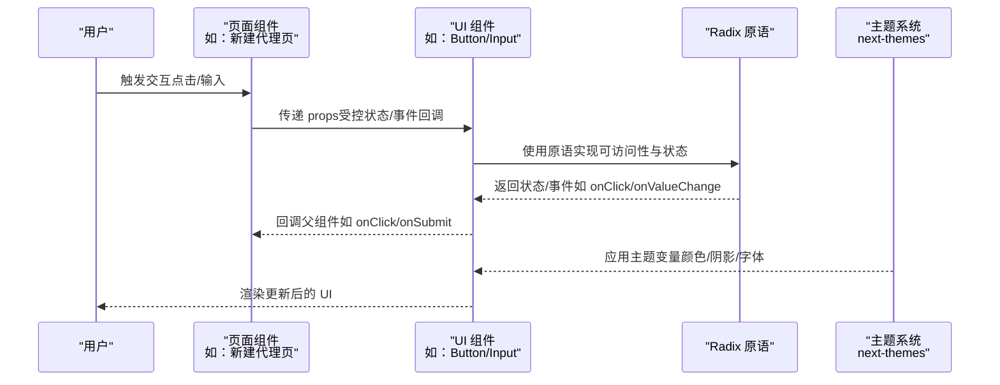

图示来源
- [page.tsx（新建代理页）:237-315](file://frontend/src/app/workspace/agents/new/page.tsx#L237-L315)
- [button.tsx](file://frontend/src/components/ui/button.tsx)
- [input.tsx](file://frontend/src/components/ui/input.tsx)
- [theme-provider.tsx](file://frontend/src/components/theme-provider.tsx)

## 详细组件分析

### 按钮 Button
- 设计理念：强调层级与语义，支持多种变体（主按钮、轮廓、幽灵、危险）、尺寸与禁用态。
- 关键属性（示意）：variant、size、disabled、className、asChild 等。
- 事件处理：onClick、onFocus、onBlur 等。
- 样式定制：通过变体与尺寸映射到 Tailwind 类，支持 className 覆盖。
- 无障碍：保持原生按钮语义，支持键盘激活与焦点管理。
- 状态管理：受控/非受控均可，建议在表单提交或关键操作中使用受控状态。
- 使用示例路径：[新建代理页中的按钮使用:237-315](file://frontend/src/app/workspace/agents/new/page.tsx#L237-L315)

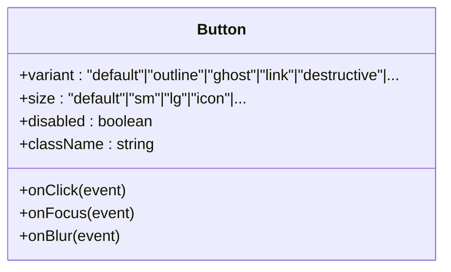

图示来源
- [button.tsx](file://frontend/src/components/ui/button.tsx)

章节来源
- [button.tsx](file://frontend/src/components/ui/button.tsx)
- [page.tsx（新建代理页）:237-315](file://frontend/src/app/workspace/agents/new/page.tsx#L237-L315)

### 输入框 Input
- 设计理念：统一边框、内间距与禁用态，支持前缀/后缀图标与错误态。
- 关键属性（示意）：type、value、onChange、placeholder、disabled、error、className 等。
- 事件处理：onChange、onBlur、onFocus、onKeyDown 等。
- 样式定制：通过 Tailwind 类与变体组合，支持宽度与圆角定制。
- 无障碍：保持原生 input 语义，提供清晰的占位符与错误提示。
- 使用示例路径：[新建代理页中的输入框使用:295-305](file://frontend/src/app/workspace/agents/new/page.tsx#L295-L305)

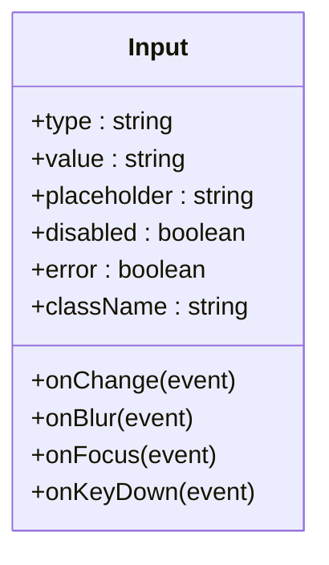

图示来源
- [input.tsx](file://frontend/src/components/ui/input.tsx)

章节来源
- [input.tsx](file://frontend/src/components/ui/input.tsx)
- [page.tsx（新建代理页）:295-305](file://frontend/src/app/workspace/agents/new/page.tsx#L295-L305)

### 徽章 Badge
- 设计理念：用于标记状态、标签与重要信息，强调可读性与对比度。
- 关键属性（示意）：variant、size、className 等。
- 样式定制：通过变体映射到颜色与圆角，适合内联与紧凑布局。
- 无障碍：作为静态装饰元素，需确保与上下文语义一致。
- 使用示例路径：[思维链元素中的徽章使用:1-10](file://frontend/src/components/ai-elements/chain-of-thought.tsx#L1-L10)

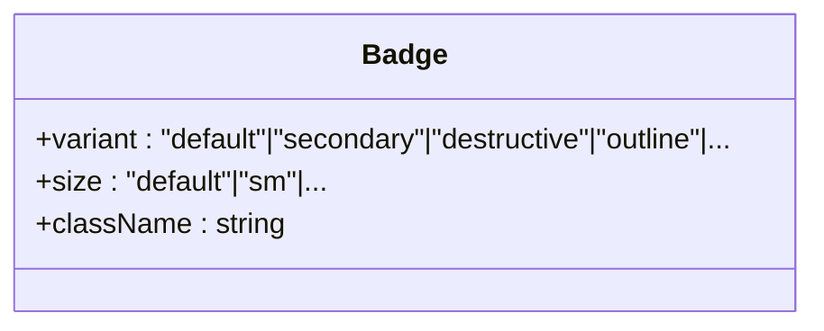

图示来源
- [badge.tsx](file://frontend/src/components/ui/badge.tsx)

章节来源
- [badge.tsx](file://frontend/src/components/ui/badge.tsx)
- [chain-of-thought.tsx:1-10](file://frontend/src/components/ai-elements/chain-of-thought.tsx#L1-L10)

### 对话框 Dialog
- 设计理念：模态交互承载复杂内容，强调遮罩层、焦点陷阱与 ESC 关闭。
- 关键属性（示意）：open、onOpenChange、className、trigger 等。
- 事件处理：onOpenChange、onEscapeKeyDown、onInteractOutside 等。
- 样式定制：通过 className 控制尺寸、圆角与阴影。
- 无障碍：自动管理焦点，确保可访问性与键盘可用性。
- 使用示例路径：[对话框组件文件](file://frontend/src/components/ui/dialog.tsx)

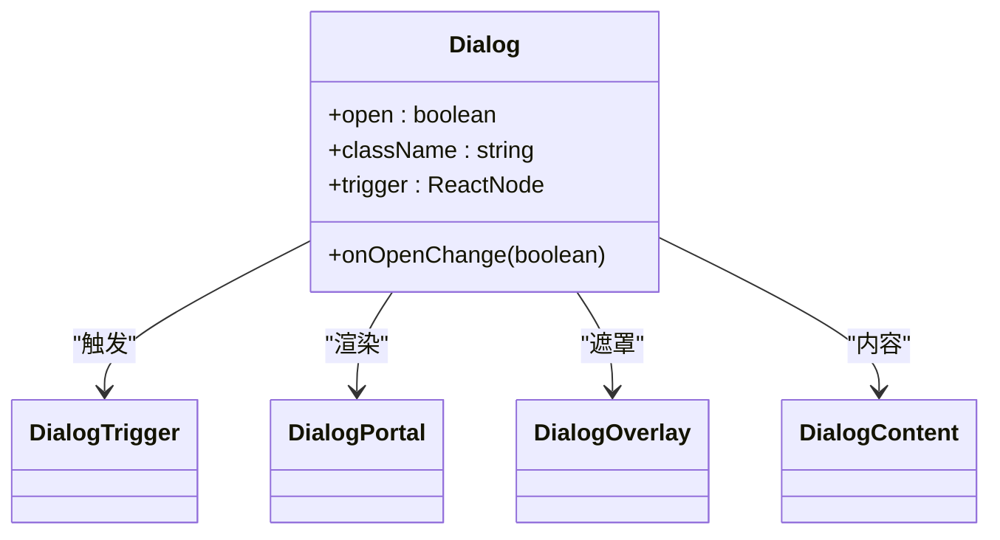

图示来源
- [dialog.tsx](file://frontend/src/components/ui/dialog.tsx)

章节来源
- [dialog.tsx](file://frontend/src/components/ui/dialog.tsx)

### 下拉菜单 DropdownMenu
- 设计理念：从触发点弹出菜单，支持快捷操作与设置项。
- 关键属性（示意）：open、onOpenChange、align、side、className 等。
- 事件处理：onOpenChange、onSelect 等。
- 样式定制：通过 className 控制尺寸与动画。
- 无障碍：支持键盘导航与焦点管理。
- 使用示例路径：[新建代理页中的下拉菜单使用:248-270](file://frontend/src/app/workspace/agents/new/page.tsx#L248-L270)

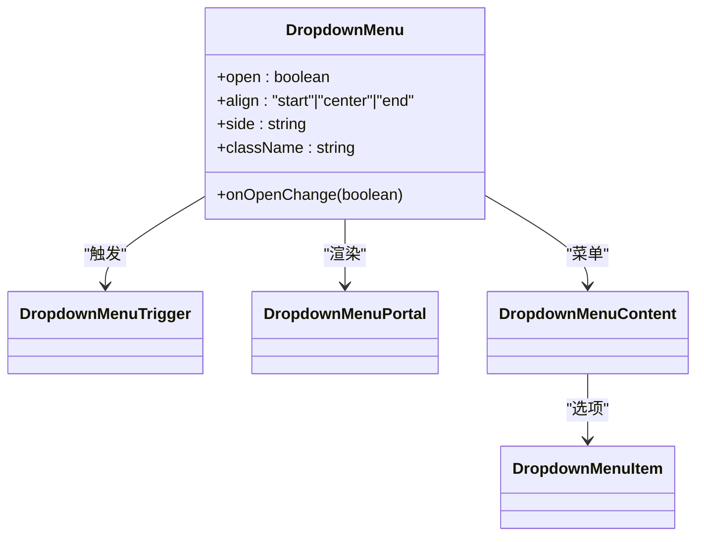

图示来源
- [dropdown-menu.tsx](file://frontend/src/components/ui/dropdown-menu.tsx)

章节来源
- [dropdown-menu.tsx](file://frontend/src/components/ui/dropdown-menu.tsx)
- [page.tsx（新建代理页）:248-270](file://frontend/src/app/workspace/agents/new/page.tsx#L248-L270)

### 警示框 Alert
- 设计理念：用于展示系统提示、错误与信息，强调对比度与可读性。
- 关键属性（示意）：title、description、variant、className 等。
- 样式定制：通过 variant 映射到颜色方案，支持标题与描述内容。
- 无障碍：提供语义化标题与描述，利于屏幕阅读器识别。
- 使用示例路径：[新建代理页中的警示框使用:333-337](file://frontend/src/app/workspace/agents/new/page.tsx#L333-L337)

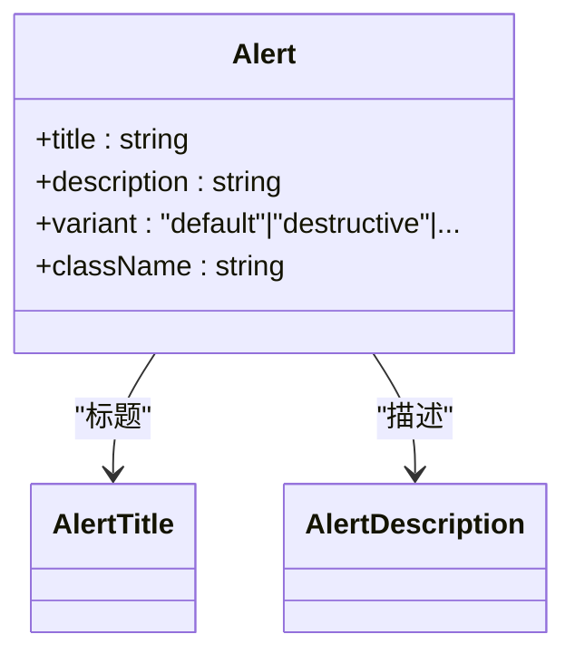

图示来源
- [alert.tsx](file://frontend/src/components/ui/alert.tsx)

章节来源
- [alert.tsx](file://frontend/src/components/ui/alert.tsx)
- [page.tsx（新建代理页）:333-337](file://frontend/src/app/workspace/agents/new/page.tsx#L333-L337)

### 滚动区域 ScrollArea
- 设计理念：在固定高度容器内提供平滑滚动与悬停显示滚动条。
- 关键属性（示意）：type、scrollbar、className 等。
- 样式定制：通过 className 控制尺寸与滚动条样式。
- 无障碍：保持原生滚动语义，避免隐藏可滚动内容。
- 使用示例路径：[聊天页中的滚动区域使用:5-6](file://frontend/src/app/workspace/chats/page.tsx#L5-L6)

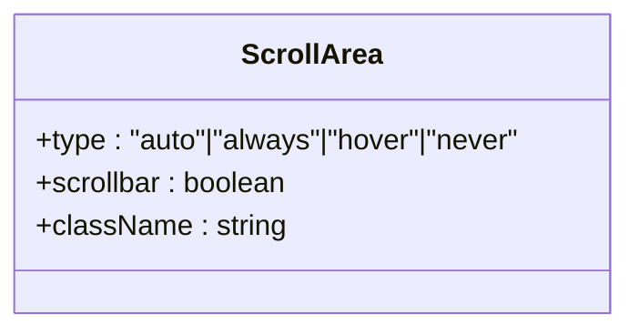

图示来源
- [scroll-area.tsx](file://frontend/src/components/ui/scroll-area.tsx)

章节来源
- [scroll-area.tsx](file://frontend/src/components/ui/scroll-area.tsx)
- [page.tsx（聊天页）:5-6](file://frontend/src/app/workspace/chats/page.tsx#L5-L6)

### 分隔线 Separator
- 设计理念：用于内容分区与视觉引导，强调简洁与一致性。
- 关键属性（示意）：orientation、decorative、className 等。
- 样式定制：通过 orientation 控制方向，支持颜色与厚度定制。
- 无障碍：作为装饰元素，需确保不破坏内容语义。
- 使用示例路径：[检查点元素中的分隔线使用:1-10](file://frontend/src/components/ai-elements/checkpoint.tsx#L1-L10)

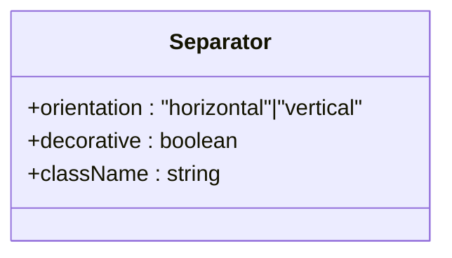

图示来源
- [separator.tsx](file://frontend/src/components/ui/separator.tsx)

章节来源
- [separator.tsx](file://frontend/src/components/ui/separator.tsx)
- [checkpoint.tsx:1-10](file://frontend/src/components/ai-elements/checkpoint.tsx#L1-L10)

### 工具提示 Tooltip
- 设计理念：短时信息提示，强调即时性与无干扰。
- 关键属性（示意）：content、side、align、className 等。
- 样式定制：通过 className 控制尺寸与动画。
- 无障碍：提供可选的延迟与键盘激活支持。
- 使用示例路径：[AI 元素中的工具提示使用:1-10](file://frontend/src/components/ai-elements/artifact.tsx#L1-L10)

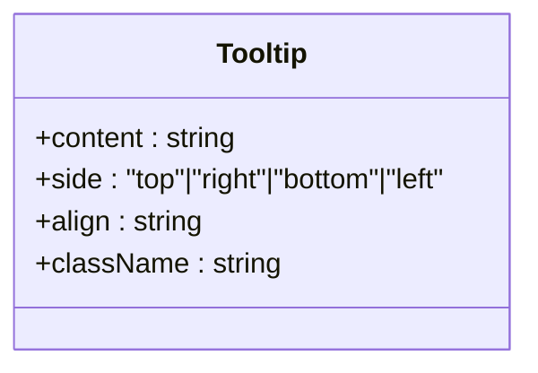

图示来源
- [tooltip.tsx](file://frontend/src/components/ui/tooltip.tsx)

章节来源
- [tooltip.tsx](file://frontend/src/components/ui/tooltip.tsx)
- [artifact.tsx:1-10](file://frontend/src/components/ai-elements/artifact.tsx#L1-L10)

### 折叠 Collapsible
- 设计理念：节省空间的可展开/收起内容，强调过渡动画与可访问性。
- 关键属性（示意）：open、onOpenChange、disabled、className 等。
- 样式定制：通过 className 控制尺寸与动画。
- 无障碍：支持键盘激活与状态变更通知。
- 使用示例路径：[思维链元素中的折叠使用:1-10](file://frontend/src/components/ai-elements/chain-of-thought.tsx#L1-L10)

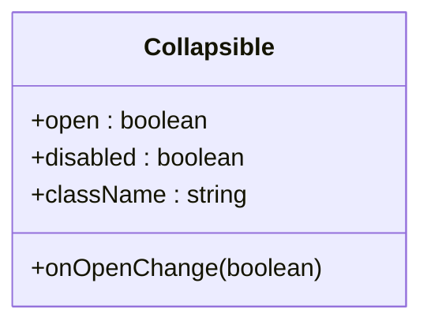

图示来源
- [collapsible.tsx](file://frontend/src/components/ui/collapsible.tsx)

章节来源
- [collapsible.tsx](file://frontend/src/components/ui/collapsible.tsx)
- [chain-of-thought.tsx:1-10](file://frontend/src/components/ai-elements/chain-of-thought.tsx#L1-L10)

### 标签页 Tabs
- 设计理念：内容分区与切换，强调清晰的标签与平滑过渡。
- 关键属性（示意）：defaultValue、value、onValueChange、orientation、className 等。
- 样式定制：通过 className 控制标签样式与指示器。
- 无障碍：支持键盘导航与 ARIA 标签关联。
- 使用示例路径：[标签页组件文件](file://frontend/src/components/ui/tabs.tsx)

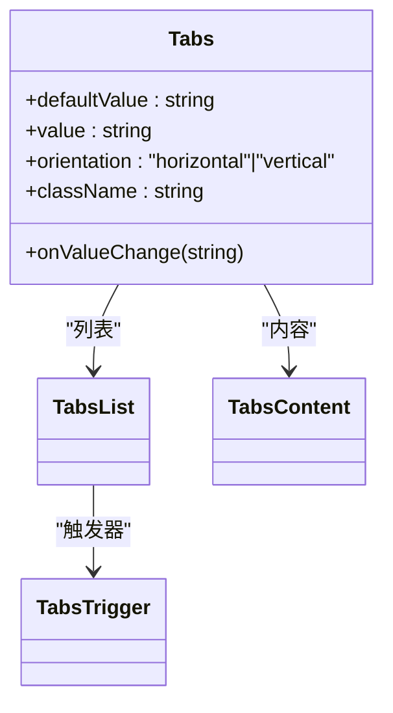

图示来源
- [tabs.tsx](file://frontend/src/components/ui/tabs.tsx)

章节来源
- [tabs.tsx](file://frontend/src/components/ui/tabs.tsx)

### 进度条 Progress
- 设计理念：任务进度可视化，强调连续性与可预测性。
- 关键属性（示意）：value、max、className 等。
- 样式定制：通过 className 控制高度与颜色。
- 无障碍：提供数值读取与状态变化通知。
- 使用示例路径：[进度条组件文件](file://frontend/src/components/ui/progress.tsx)

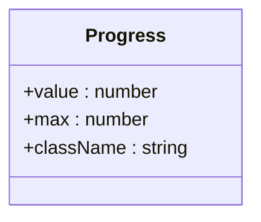

图示来源
- [progress.tsx](file://frontend/src/components/ui/progress.tsx)

章节来源
- [progress.tsx](file://frontend/src/components/ui/progress.tsx)

### 头像 Avatar
- 设计理念：用户或实体标识，强调可读性与一致性。
- 关键属性（示意）：alt、src、fallback、className 等。
- 样式定制：通过 className 控制尺寸与圆角。
- 无障碍：提供替代文本与降级策略。
- 使用示例路径：[头像组件文件](file://frontend/src/components/ui/avatar.tsx)

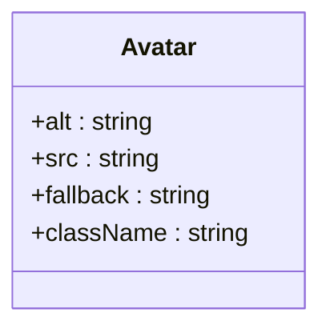

图示来源
- [avatar.tsx](file://frontend/src/components/ui/avatar.tsx)

章节来源
- [avatar.tsx](file://frontend/src/components/ui/avatar.tsx)

### 开关 Switch
- 设计理念：二元状态切换，强调直观与可访问性。
- 关键属性（示意）：checked、onCheckedChange、disabled、className 等。
- 样式定制：通过 className 控制尺寸与颜色。
- 无障碍：支持键盘激活与状态变更通知。
- 使用示例路径：[开关组件文件](file://frontend/src/components/ui/switch.tsx)

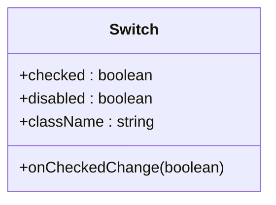

图示来源
- [switch.tsx](file://frontend/src/components/ui/switch.tsx)

章节来源
- [switch.tsx](file://frontend/src/components/ui/switch.tsx)

### 切换 Toggle
- 设计理念：强调选中/未选中状态，适合工具栏与过滤器。
- 关键属性（示意）：pressed、onPressedChange、disabled、className 等。
- 样式定制：通过 className 控制尺寸与颜色。
- 无障碍：支持键盘激活与状态变更通知。
- 使用示例路径：[切换组件文件](file://frontend/src/components/ui/toggle.tsx)

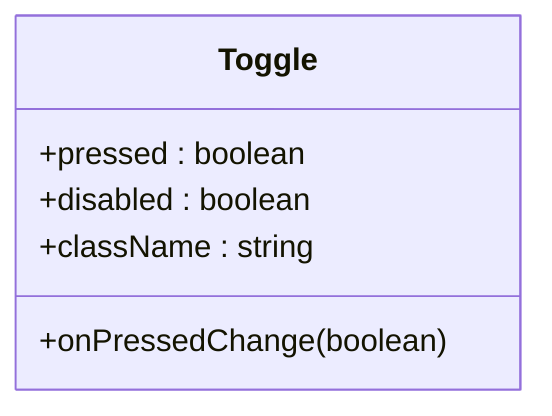

图示来源
- [toggle.tsx](file://frontend/src/components/ui/toggle.tsx)

章节来源
- [toggle.tsx](file://frontend/src/components/ui/toggle.tsx)

### 切换组 ToggleGroup
- 设计理念：多选一或自由切换的组合，强调一致性与可访问性。
- 关键属性（示意）：type、value、onValueChange、disabled、className 等。
- 样式定制：通过 className 控制布局与尺寸。
- 无障碍：支持键盘导航与状态变更通知。
- 使用示例路径：[切换组组件文件](file://frontend/src/components/ui/toggle-group.tsx)

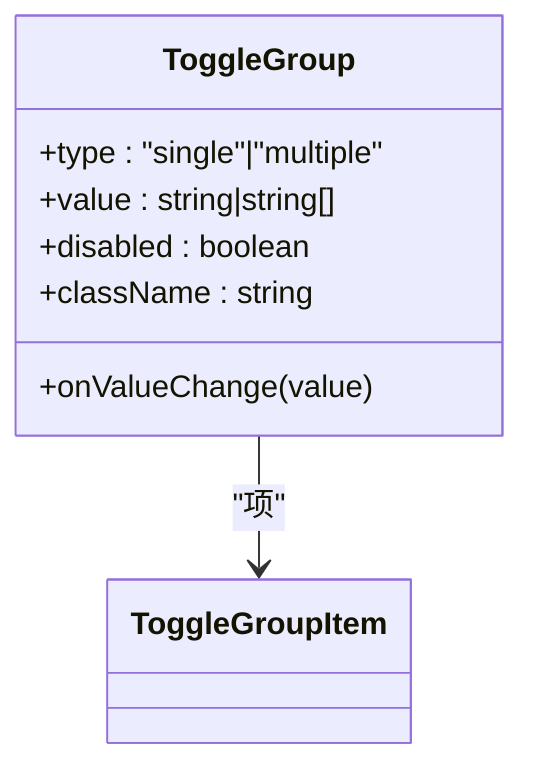

图示来源
- [toggle-group.tsx](file://frontend/src/components/ui/toggle-group.tsx)

章节来源
- [toggle-group.tsx](file://frontend/src/components/ui/toggle-group.tsx)

### 选择 Select
- 设计理念：从预设集合中选择一项，强调可访问性与键盘支持。
- 关键属性（示意）：value、onValueChange、disabled、className 等。
- 样式定制：通过 className 控制尺寸与动画。
- 无障碍：支持键盘导航与 ARIA 标签关联。
- 使用示例路径：[选择组件文件](file://frontend/src/components/ui/select.tsx)

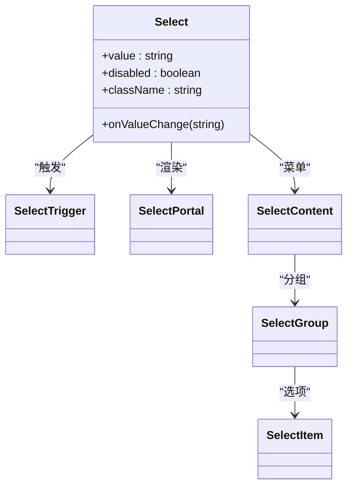

图示来源
- [select.tsx](file://frontend/src/components/ui/select.tsx)

章节来源
- [select.tsx](file://frontend/src/components/ui/select.tsx)

### 悬浮卡片 HoverCard
- 设计理念：轻量信息展示，强调即时性与无干扰。
- 关键属性（示意）：openDelay、closeDelay、className 等。
- 样式定制：通过 className 控制尺寸与阴影。
- 无障碍：提供可选的键盘激活支持。
- 使用示例路径：[悬浮卡片组件文件](file://frontend/src/components/ui/hover-card.tsx)

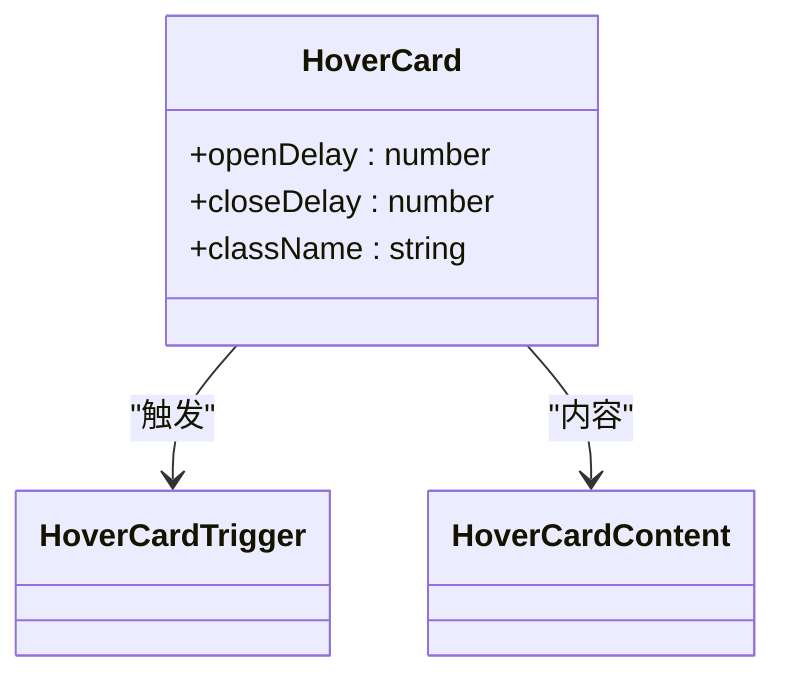

图示来源
- [hover-card.tsx](file://frontend/src/components/ui/hover-card.tsx)

章节来源
- [hover-card.tsx](file://frontend/src/components/ui/hover-card.tsx)

### 侧边栏 Sidebar
- 设计理念：主界面导航与内容分区，强调可折叠与响应式布局。
- 关键属性（示意）：children、className 等。
- 样式定制：通过 className 控制宽度与阴影。
- 无障碍：提供可访问性与键盘支持。
- 使用示例路径：[侧边栏组件文件](file://frontend/src/components/ui/sidebar.tsx)

```mermaid
classDiagram
class Sidebar {
+children : ReactNode
+className : string
}
class SidebarProvider
class SidebarInset
class SidebarTrigger
Sidebar --> SidebarProvider : "提供者"
SidebarProvider --> SidebarInset : "内容区"
SidebarProvider --> SidebarTrigger : "触发器"
```

图示来源
- [sidebar.tsx](file://frontend/src/components/ui/sidebar.tsx)

章节来源
- [sidebar.tsx](file://frontend/src/components/ui/sidebar.tsx)

## 依赖关系分析
基础 UI 组件的依赖关系如下：

```mermaid
graph LR
PKG["package.json 依赖声明"] --> RADIX["@radix-ui/react-*"]
PKG --> LUCIDE["lucide-react 图标库"]
PKG --> NEXTTHEMES["next-themes 主题系统"]
PKG --> TAILWIND["tailwindcss 样式框架"]
BTN["Button"] --> RADIX
INP["Input"] --> RADIX
BAD["Badge"] --> RADIX
DIALOG["Dialog"] --> RADIX
DROP["DropdownMenu"] --> RADIX
ALERT["Alert"] --> RADIX
SCROLL["ScrollArea"] --> RADIX
SEP["Separator"] --> RADIX
TT["Tooltip"] --> RADIX
COLL["Collapsible"] --> RADIX
TABS["Tabs"] --> RADIX
PROG["Progress"] --> RADIX
AVA["Avatar"] --> RADIX
SWITCH["Switch"] --> RADIX
TOGGLE["Toggle"] --> RADIX
TG["ToggleGroup"] --> RADIX
SEL["Select"] --> RADIX
HC["HoverCard"] --> RADIX
SB["Sidebar"] --> RADIX
THEME["ThemeProvider"] --> NEXTTHEMES
THEME --> TAILWIND
BTN --> TAILWIND
INP --> TAILWIND
BAD --> TAILWIND
DIALOG --> TAILWIND
DROP --> TAILWIND
ALERT --> TAILWIND
SCROLL --> TAILWIND
SEP --> TAILWIND
TT --> TAILWIND
COLL --> TAILWIND
TABS --> TAILWIND
PROG --> TAILWIND
AVA --> TAILWIND
SWITCH --> TAILWIND
TOGGLE --> TAILWIND
TG --> TAILWIND
SEL --> TAILWIND
HC --> TAILWIND
SB --> TAILWIND
```

图示来源
- [package.json:21-92](file://frontend/package.json#L21-L92)
- [button.tsx](file://frontend/src/components/ui/button.tsx)
- [input.tsx](file://frontend/src/components/ui/input.tsx)
- [badge.tsx](file://frontend/src/components/ui/badge.tsx)
- [dialog.tsx](file://frontend/src/components/ui/dialog.tsx)
- [dropdown-menu.tsx](file://frontend/src/components/ui/dropdown-menu.tsx)
- [alert.tsx](file://frontend/src/components/ui/alert.tsx)
- [scroll-area.tsx](file://frontend/src/components/ui/scroll-area.tsx)
- [separator.tsx](file://frontend/src/components/ui/separator.tsx)
- [tooltip.tsx](file://frontend/src/components/ui/tooltip.tsx)
- [collapsible.tsx](file://frontend/src/components/ui/collapsible.tsx)
- [tabs.tsx](file://frontend/src/components/ui/tabs.tsx)
- [progress.tsx](file://frontend/src/components/ui/progress.tsx)
- [avatar.tsx](file://frontend/src/components/ui/avatar.tsx)
- [switch.tsx](file://frontend/src/components/ui/switch.tsx)
- [toggle.tsx](file://frontend/src/components/ui/toggle.tsx)
- [toggle-group.tsx](file://frontend/src/components/ui/toggle-group.tsx)
- [select.tsx](file://frontend/src/components/ui/select.tsx)
- [hover-card.tsx](file://frontend/src/components/ui/hover-card.tsx)
- [sidebar.tsx](file://frontend/src/components/ui/sidebar.tsx)
- [theme-provider.tsx](file://frontend/src/components/theme-provider.tsx)

章节来源
- [package.json:21-92](file://frontend/package.json#L21-L92)

## 性能考量
- 组件复用与懒加载：将重型组件（如对话框、下拉菜单）置于 Portal 中渲染，减少不必要的 DOM 层级。
- 动画与过渡：合理使用 CSS 动画与 Radix 原语自带的过渡，避免在主线程执行重计算。
- 主题切换：next-themes 通过类名切换主题，尽量减少重复样式计算。
- Tailwind 优化：启用摇树移除未使用样式，避免全局污染。
- 事件处理：在高频交互（如输入框）中使用防抖/节流，降低重渲染频率。

## 故障排查指南
- 可访问性问题
  - 症状：键盘无法激活或焦点丢失。
  - 排查：确认组件是否正确使用 Radix 原语的触发器与内容节点，确保 ARIA 属性与标签关联。
  - 参考：各组件的触发器/内容节点实现。
- 主题不生效
  - 症状：切换主题后样式未更新。
  - 排查：确认 ThemeProvider 包裹范围与主题变量定义，检查 Tailwind 配置中的 darkMode 设置。
  - 参考：主题 Provider 与 Tailwind 配置。
- 样式冲突
  - 症状：自定义 className 未生效或被覆盖。
  - 排查：检查 Tailwind 优先级与组件内部类名拼接逻辑，避免 !important。
- 事件未触发
  - 症状：onClick/onValueChange 等未响应。
  - 排查：确认组件未处于 disabled 状态，检查父容器的 pointer-events 与 z-index。

章节来源
- [theme-provider.tsx](file://frontend/src/components/theme-provider.tsx)
- [tailwind.config.js](file://frontend/tailwind.config.js)

## 结论
DeerFlow 的基础 UI 组件体系以 Radix UI 的可访问性原语为核心，结合 Tailwind CSS 实现一致、灵活且可扩展的视觉语言。通过 next-themes 与主题变量的协同，组件在明暗主题间无缝切换；通过变体与尺寸的标准化，满足多样化的业务场景。遵循本文档的最佳实践与扩展指南，可在保证可访问性与性能的前提下快速构建高质量的用户界面。

## 附录
- 使用示例路径汇总
  - 新建代理页中的按钮与输入框：[新建代理页:237-315](file://frontend/src/app/workspace/agents/new/page.tsx#L237-L315)
  - 警示框与下拉菜单：[新建代理页:333-337](file://frontend/src/app/workspace/agents/new/page.tsx#L333-L337)
  - 滚动区域：[聊天页:5-6](file://frontend/src/app/workspace/chats/page.tsx#L5-L6)
- 组件清单与参考路径
  - 按钮：[button.tsx](file://frontend/src/components/ui/button.tsx)
  - 输入框：[input.tsx](file://frontend/src/components/ui/input.tsx)
  - 徽章：[badge.tsx](file://frontend/src/components/ui/badge.tsx)
  - 对话框：[dialog.tsx](file://frontend/src/components/ui/dialog.tsx)
  - 下拉菜单：[dropdown-menu.tsx](file://frontend/src/components/ui/dropdown-menu.tsx)
  - 警示框：[alert.tsx](file://frontend/src/components/ui/alert.tsx)
  - 滚动区域：[scroll-area.tsx](file://frontend/src/components/ui/scroll-area.tsx)
  - 分隔线：[separator.tsx](file://frontend/src/components/ui/separator.tsx)
  - 工具提示：[tooltip.tsx](file://frontend/src/components/ui/tooltip.tsx)
  - 折叠：[collapsible.tsx](file://frontend/src/components/ui/collapsible.tsx)
  - 标签页：[tabs.tsx](file://frontend/src/components/ui/tabs.tsx)
  - 进度条：[progress.tsx](file://frontend/src/components/ui/progress.tsx)
  - 头像：[avatar.tsx](file://frontend/src/components/ui/avatar.tsx)
  - 开关：[switch.tsx](file://frontend/src/components/ui/switch.tsx)
  - 切换：[toggle.tsx](file://frontend/src/components/ui/toggle.tsx)
  - 切换组：[toggle-group.tsx](file://frontend/src/components/ui/toggle-group.tsx)
  - 选择：[select.tsx](file://frontend/src/components/ui/select.tsx)
  - 悬浮卡片：[hover-card.tsx](file://frontend/src/components/ui/hover-card.tsx)
  - 侧边栏：[sidebar.tsx](file://frontend/src/components/ui/sidebar.tsx)
- 主题与样式
  - 主题 Provider：[theme-provider.tsx](file://frontend/src/components/theme-provider.tsx)
  - 全局样式：[globals.css](file://frontend/src/styles/globals.css)
  - Tailwind 配置：[tailwind.config.js](file://frontend/tailwind.config.js)
- 依赖声明
  - 前端依赖：[package.json:21-92](file://frontend/package.json#L21-L92)