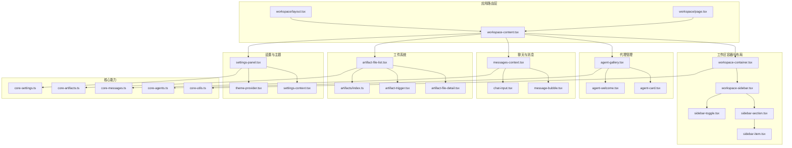
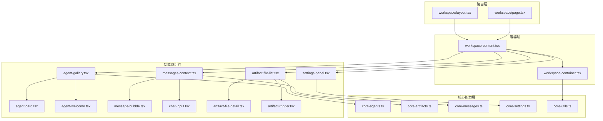
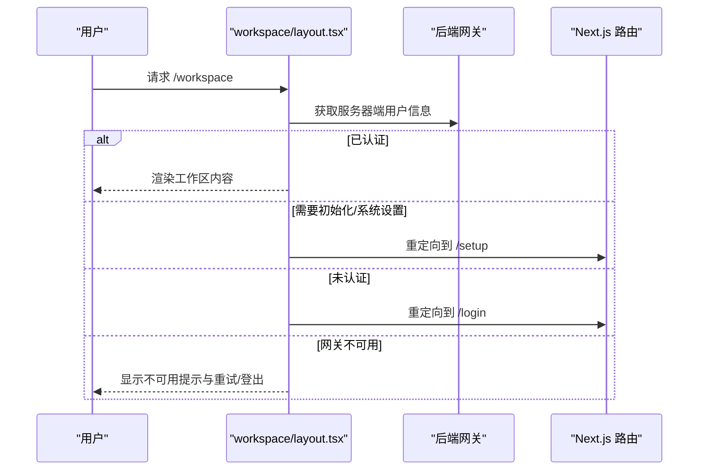
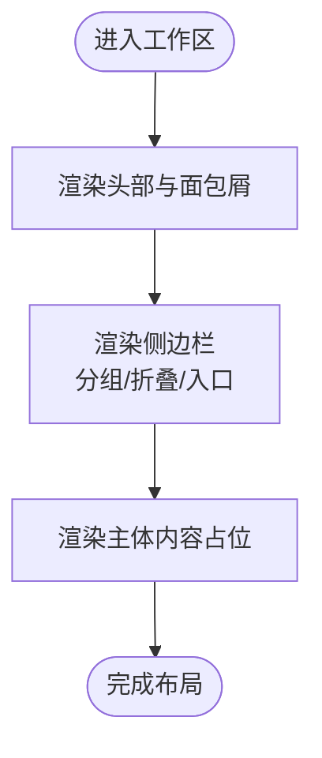
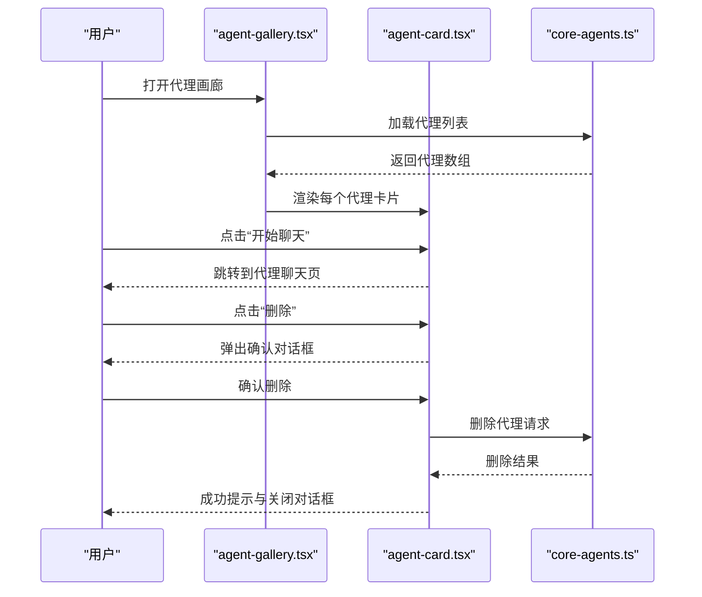
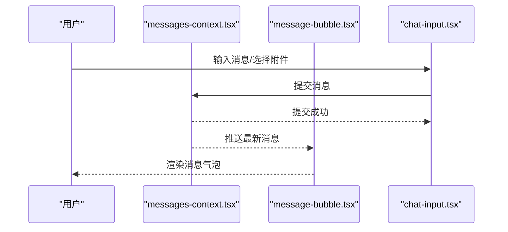
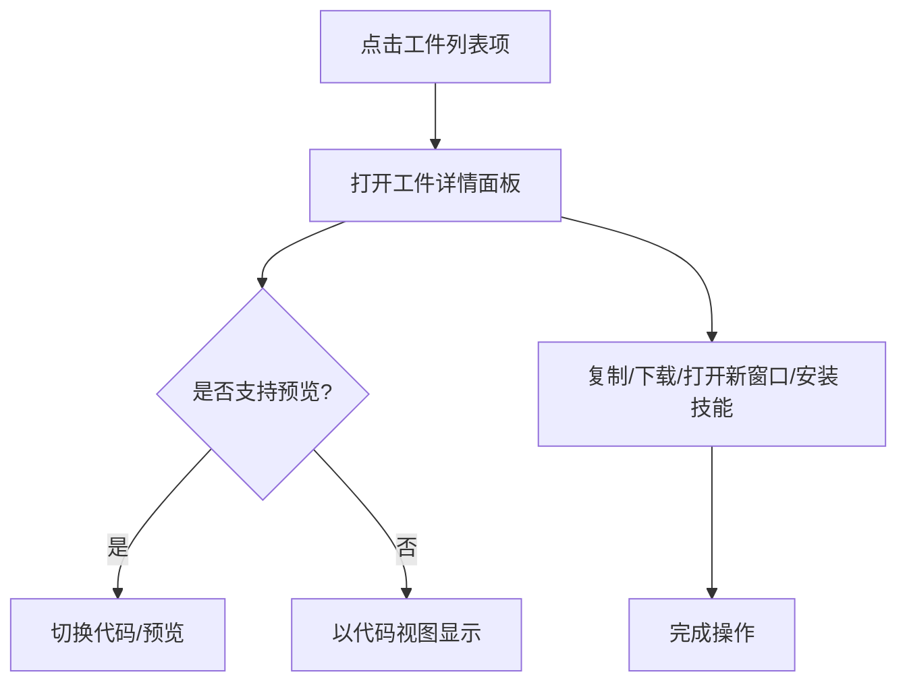
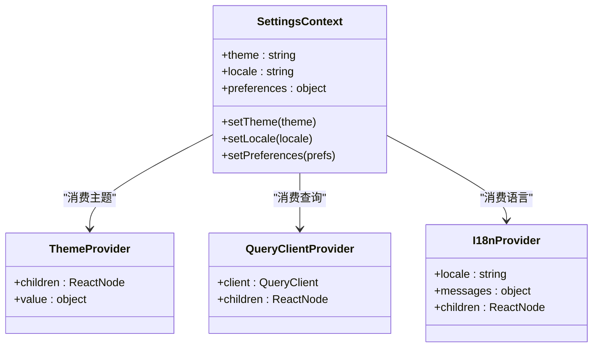
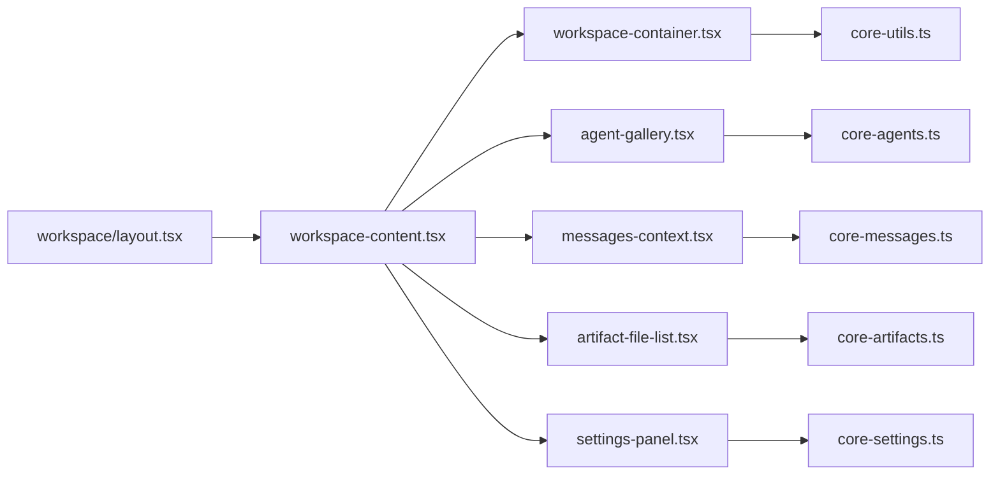

# 工作区组件

<cite>
**本文引用的文件**
- [workspace/layout.tsx](file://frontend/src/app/workspace/layout.tsx)
- [workspace/page.tsx](file://frontend/src/app/workspace/page.tsx)
- [workspace-content.tsx](file://frontend/src/app/workspace/workspace-content.tsx)
- [workspace-container.tsx](file://frontend/src/components/workspace/workspace-container.tsx)
- [agent-welcome.tsx](file://frontend/src/components/workspace/agent-welcome.tsx)
- [agent-gallery.tsx](file://frontend/src/components/workspace/agents/agent-gallery.tsx)
- [agent-card.tsx](file://frontend/src/components/workspace/agents/agent-card.tsx)
- [artifact-file-list.tsx](file://frontend/src/components/workspace/artifacts/artifact-file-list.tsx)
- [artifact-file-detail.tsx](file://frontend/src/components/workspace/artifacts/artifact-file-detail.tsx)
- [artifact-trigger.tsx](file://frontend/src/components/workspace/artifacts/artifact-trigger.tsx)
- [artifacts/index.ts](file://frontend/src/components/workspace/artifacts/index.ts)
- [workspace-sidebar.tsx](file://frontend/src/components/workspace/sidebar/workspace-sidebar.tsx)
- [sidebar-section.tsx](file://frontend/src/components/workspace/sidebar/sidebar-section.tsx)
- [sidebar-item.tsx](file://frontend/src/components/workspace/sidebar/sidebar-item.tsx)
- [sidebar-toggle.tsx](file://frontend/src/components/workspace/sidebar/sidebar-toggle.tsx)
- [chat-input.tsx](file://frontend/src/components/workspace/chat-input.tsx)
- [message-bubble.tsx](file://frontend/src/components/workspace/message-bubble.tsx)
- [messages-context.tsx](file://frontend/src/components/workspace/messages/context.tsx)
- [settings-panel.tsx](file://frontend/src/components/workspace/settings-panel.tsx)
- [settings-context.tsx](file://frontend/src/components/workspace/settings/context.tsx)
- [theme-provider.tsx](file://frontend/src/components/theme-provider.tsx)
- [query-client-provider.tsx](file://frontend/src/components/query-client-provider.tsx)
- [i18n-provider.tsx](file://frontend/src/components/i18n-provider.tsx)
- [auth-provider.tsx](file://frontend/src/components/auth-provider.tsx)
- [core-agents.ts](file://frontend/src/core/agents/index.ts)
- [core-artifacts.ts](file://frontend/src/core/artifacts/index.ts)
- [core-messages.ts](file://frontend/src/core/messages/index.ts)
- [core-settings.ts](file://frontend/src/core/settings/index.ts)
- [core-utils.ts](file://frontend/src/core/utils/index.ts)
</cite>

## 目录
1. [简介](#简介)
2. [项目结构](#项目结构)
3. [核心组件](#核心组件)
4. [架构总览](#架构总览)
5. [详细组件分析](#详细组件分析)
6. [依赖关系分析](#依赖关系分析)
7. [性能考虑](#性能考虑)
8. [故障排查指南](#故障排查指南)
9. [结论](#结论)
10. [附录](#附录)

## 简介
本技术文档聚焦 DeerFlow 工作区组件，系统性阐述工作区系统的组件架构与交互机制，覆盖代理管理、聊天界面、工件展示、设置面板等核心模块。文档从架构视角解析组件间通信、状态管理与数据流设计，解释工作区的布局系统、导航结构与用户交互流程，并提供组件集成示例、自定义工作区配置与扩展开发指南。

## 项目结构
工作区相关代码主要位于前端工程的 app 与 components/workspace 目录中，采用按功能域分层组织：页面路由层（app/workspace）、容器与布局层（components/workspace/*）、核心能力层（core/*）以及通用 UI 组件库（components/ui/*）。整体遵循 Next.js App Router 的嵌套路由约定，配合客户端组件与服务端组件协同完成认证、权限与内容渲染。

图表来源
- [workspace/layout.tsx:1-61](file://frontend/src/app/workspace/layout.tsx#L1-L61)
- [workspace/page.tsx:1-21](file://frontend/src/app/workspace/page.tsx#L1-L21)
- [workspace-content.tsx](file://frontend/src/app/workspace/workspace-content.tsx)
- [workspace-container.tsx:1-136](file://frontend/src/components/workspace/workspace-container.tsx#L1-L136)
- [workspace-sidebar.tsx](file://frontend/src/components/workspace/sidebar/workspace-sidebar.tsx)
- [sidebar-section.tsx](file://frontend/src/components/workspace/sidebar/sidebar-section.tsx)
- [sidebar-item.tsx](file://frontend/src/components/workspace/sidebar/sidebar-item.tsx)
- [sidebar-toggle.tsx](file://frontend/src/components/workspace/sidebar/sidebar-toggle.tsx)
- [agent-gallery.tsx:1-70](file://frontend/src/components/workspace/agents/agent-gallery.tsx#L1-L70)
- [agent-card.tsx:1-154](file://frontend/src/components/workspace/agents/agent-card.tsx#L1-L154)
- [agent-welcome.tsx:1-37](file://frontend/src/components/workspace/agent-welcome.tsx#L1-L37)
- [messages-context.tsx](file://frontend/src/components/workspace/messages/context.tsx)
- [message-bubble.tsx](file://frontend/src/components/workspace/message-bubble.tsx)
- [chat-input.tsx](file://frontend/src/components/workspace/chat-input.tsx)
- [artifact-file-list.tsx:1-129](file://frontend/src/components/workspace/artifacts/artifact-file-list.tsx#L1-L129)
- [artifact-file-detail.tsx:1-327](file://frontend/src/components/workspace/artifacts/artifact-file-detail.tsx#L1-L327)
- [artifact-trigger.tsx:1-31](file://frontend/src/components/workspace/artifacts/artifact-trigger.tsx#L1-L31)
- [artifacts/index.ts:1-5](file://frontend/src/components/workspace/artifacts/index.ts#L1-L5)
- [settings-panel.tsx](file://frontend/src/components/workspace/settings-panel.tsx)
- [settings-context.tsx](file://frontend/src/components/workspace/settings/context.tsx)
- [theme-provider.tsx](file://frontend/src/components/theme-provider.tsx)
- [core-agents.ts](file://frontend/src/core/agents/index.ts)
- [core-artifacts.ts](file://frontend/src/core/artifacts/index.ts)
- [core-messages.ts](file://frontend/src/core/messages/index.ts)
- [core-settings.ts](file://frontend/src/core/settings/index.ts)
- [core-utils.ts](file://frontend/src/core/utils/index.ts)

章节来源
- [workspace/layout.tsx:1-61](file://frontend/src/app/workspace/layout.tsx#L1-L61)
- [workspace/page.tsx:1-21](file://frontend/src/app/workspace/page.tsx#L1-L21)

## 核心组件
- 工作区布局与认证
  - 工作区布局负责用户认证态校验与页面重定向，确保仅已认证用户进入工作区；同时在网关不可用时提供“重试”与“登出重置”入口。
  - 工作区首页根据环境变量决定是否静态演示模式，自动跳转到第一个演示对话或新建对话页。
- 容器与导航
  - 容器组件提供统一的头部、主体与面包屑布局；侧边栏支持分组与折叠，承载代理列表、聊天会话与设置入口。
- 代理管理
  - 代理画廊展示可用代理卡片，支持快捷进入聊天、删除代理与技能标签展示。
- 聊天界面
  - 消息上下文管理当前线程与消息集合；消息气泡组件负责渲染不同角色与内容类型；输入组件支持发送消息与附件。
- 工件系统
  - 工件列表展示可下载与安装的产物文件；工件详情支持代码/预览切换、复制、打开新窗口与安装技能；触发器按钮用于快速打开工件面板。
- 设置面板
  - 设置面板通过上下文管理主题、语言与偏好；主题提供深浅色切换；查询客户端与国际化提供全局状态支撑。

章节来源
- [workspace/layout.tsx:12-60](file://frontend/src/app/workspace/layout.tsx#L12-L60)
- [workspace/page.tsx:8-20](file://frontend/src/app/workspace/page.tsx#L8-L20)
- [workspace-container.tsx:21-136](file://frontend/src/components/workspace/workspace-container.tsx#L21-L136)
- [workspace-sidebar.tsx](file://frontend/src/components/workspace/sidebar/workspace-sidebar.tsx)
- [agent-gallery.tsx:12-70](file://frontend/src/components/workspace/agents/agent-gallery.tsx#L12-L70)
- [agent-card.tsx:34-154](file://frontend/src/components/workspace/agents/agent-card.tsx#L34-L154)
- [messages-context.tsx](file://frontend/src/components/workspace/messages/context.tsx)
- [message-bubble.tsx](file://frontend/src/components/workspace/message-bubble.tsx)
- [chat-input.tsx](file://frontend/src/components/workspace/chat-input.tsx)
- [artifact-file-list.tsx:25-129](file://frontend/src/components/workspace/artifacts/artifact-file-list.tsx#L25-L129)
- [artifact-file-detail.tsx:47-327](file://frontend/src/components/workspace/artifacts/artifact-file-detail.tsx#L47-L327)
- [artifact-trigger.tsx:9-31](file://frontend/src/components/workspace/artifacts/artifact-trigger.tsx#L9-L31)
- [settings-panel.tsx](file://frontend/src/components/workspace/settings-panel.tsx)
- [settings-context.tsx](file://frontend/src/components/workspace/settings/context.tsx)
- [theme-provider.tsx](file://frontend/src/components/theme-provider.tsx)

## 架构总览
工作区采用“路由层 + 容器层 + 功能域组件 + 核心能力层”的分层架构。路由层处理认证与重定向；容器层提供统一布局与导航；功能域组件封装业务能力（代理、聊天、工件、设置）；核心能力层抽象 API 与工具函数，供各域复用。

图表来源
- [workspace/layout.tsx:1-61](file://frontend/src/app/workspace/layout.tsx#L1-L61)
- [workspace/page.tsx:1-21](file://frontend/src/app/workspace/page.tsx#L1-L21)
- [workspace-content.tsx](file://frontend/src/app/workspace/workspace-content.tsx)
- [workspace-container.tsx:1-136](file://frontend/src/components/workspace/workspace-container.tsx#L1-L136)
- [agent-gallery.tsx:1-70](file://frontend/src/components/workspace/agents/agent-gallery.tsx#L1-L70)
- [agent-card.tsx:1-154](file://frontend/src/components/workspace/agents/agent-card.tsx#L1-L154)
- [agent-welcome.tsx:1-37](file://frontend/src/components/workspace/agent-welcome.tsx#L1-L37)
- [messages-context.tsx](file://frontend/src/components/workspace/messages/context.tsx)
- [message-bubble.tsx](file://frontend/src/components/workspace/message-bubble.tsx)
- [chat-input.tsx](file://frontend/src/components/workspace/chat-input.tsx)
- [artifact-file-list.tsx:1-129](file://frontend/src/components/workspace/artifacts/artifact-file-list.tsx#L1-L129)
- [artifact-file-detail.tsx:1-327](file://frontend/src/components/workspace/artifacts/artifact-file-detail.tsx#L1-L327)
- [artifact-trigger.tsx:1-31](file://frontend/src/components/workspace/artifacts/artifact-trigger.tsx#L1-L31)
- [settings-panel.tsx](file://frontend/src/components/workspace/settings-panel.tsx)
- [core-agents.ts](file://frontend/src/core/agents/index.ts)
- [core-artifacts.ts](file://frontend/src/core/artifacts/index.ts)
- [core-messages.ts](file://frontend/src/core/messages/index.ts)
- [core-settings.ts](file://frontend/src/core/settings/index.ts)
- [core-utils.ts](file://frontend/src/core/utils/index.ts)

## 详细组件分析

### 认证与工作区入口
- 认证流程
  - 布局组件在服务端获取当前用户信息，依据认证结果执行不同分支：已认证则注入用户上下文并渲染工作区内容；需要初始化则跳转到设置页；未认证跳转登录页；网关不可用时显示临时不可用提示与重试/登出按钮。
- 入口页逻辑
  - 首页根据环境变量判断是否启用静态演示模式，若存在演示对话则自动跳转至首个对话，否则跳转到新建对话页。

图表来源
- [workspace/layout.tsx:12-60](file://frontend/src/app/workspace/layout.tsx#L12-L60)

章节来源
- [workspace/layout.tsx:12-60](file://frontend/src/app/workspace/layout.tsx#L12-L60)
- [workspace/page.tsx:8-20](file://frontend/src/app/workspace/page.tsx#L8-L20)

### 工作区容器与导航
- 容器组件
  - 提供统一的头部（含面包屑与标题）、主体区域与根容器样式，便于在不同页面共享一致的视觉与交互体验。
- 侧边栏
  - 支持分组与折叠，包含代理、聊天与设置等入口；通过路由项与图标增强可发现性；折叠状态可通过切换组件持久化。

图表来源
- [workspace-container.tsx:21-136](file://frontend/src/components/workspace/workspace-container.tsx#L21-L136)
- [workspace-sidebar.tsx](file://frontend/src/components/workspace/sidebar/workspace-sidebar.tsx)
- [sidebar-section.tsx](file://frontend/src/components/workspace/sidebar/sidebar-section.tsx)
- [sidebar-item.tsx](file://frontend/src/components/workspace/sidebar/sidebar-item.tsx)
- [sidebar-toggle.tsx](file://frontend/src/components/workspace/sidebar/sidebar-toggle.tsx)

章节来源
- [workspace-container.tsx:21-136](file://frontend/src/components/workspace/workspace-container.tsx#L21-L136)
- [workspace-sidebar.tsx](file://frontend/src/components/workspace/sidebar/workspace-sidebar.tsx)
- [sidebar-section.tsx](file://frontend/src/components/workspace/sidebar/sidebar-section.tsx)
- [sidebar-item.tsx](file://frontend/src/components/workspace/sidebar/sidebar-item.tsx)
- [sidebar-toggle.tsx](file://frontend/src/components/workspace/sidebar/sidebar-toggle.tsx)

### 代理管理
- 代理画廊
  - 展示所有可用代理，支持“新建代理”入口；当无代理时显示引导文案与按钮。
- 代理卡片
  - 展示代理名称、模型、描述与技能/工具组标签；提供“开始聊天”与“删除”操作；删除前弹出确认对话框。
- 欢迎组件
  - 在代理欢迎场景展示代理头像、名称与描述，提升首次交互体验。

图表来源
- [agent-gallery.tsx:12-70](file://frontend/src/components/workspace/agents/agent-gallery.tsx#L12-L70)
- [agent-card.tsx:34-154](file://frontend/src/components/workspace/agents/agent-card.tsx#L34-L154)
- [agent-welcome.tsx:8-37](file://frontend/src/components/workspace/agent-welcome.tsx#L8-L37)
- [core-agents.ts](file://frontend/src/core/agents/index.ts)

章节来源
- [agent-gallery.tsx:12-70](file://frontend/src/components/workspace/agents/agent-gallery.tsx#L12-L70)
- [agent-card.tsx:34-154](file://frontend/src/components/workspace/agents/agent-card.tsx#L34-L154)
- [agent-welcome.tsx:8-37](file://frontend/src/components/workspace/agent-welcome.tsx#L8-L37)
- [core-agents.ts](file://frontend/src/core/agents/index.ts)

### 聊天界面
- 消息上下文
  - 管理当前线程与消息集合，提供订阅与更新能力，支撑消息列表渲染与输入组件交互。
- 消息气泡
  - 根据消息角色与内容类型渲染不同 UI，支持富文本、代码块、引用等。
- 输入组件
  - 支持发送文本与附件，触发消息提交与刷新。

图表来源
- [messages-context.tsx](file://frontend/src/components/workspace/messages/context.tsx)
- [message-bubble.tsx](file://frontend/src/components/workspace/message-bubble.tsx)
- [chat-input.tsx](file://frontend/src/components/workspace/chat-input.tsx)

章节来源
- [messages-context.tsx](file://frontend/src/components/workspace/messages/context.tsx)
- [message-bubble.tsx](file://frontend/src/components/workspace/message-bubble.tsx)
- [chat-input.tsx](file://frontend/src/components/workspace/chat-input.tsx)

### 工件展示
- 工件列表
  - 列出当前对话产生的文件，支持点击查看详情、下载与安装技能（针对 .skill 文件）。
- 工件详情
  - 支持代码/预览双视图切换；HTML/Markdown 内容使用专用渲染器；提供复制、打开新窗口与安装技能能力。
- 触发器
  - 在聊天区域提供“显示工件”按钮，一键打开工件面板。

图表来源
- [artifact-file-list.tsx:25-129](file://frontend/src/components/workspace/artifacts/artifact-file-list.tsx#L25-L129)
- [artifact-file-detail.tsx:47-327](file://frontend/src/components/workspace/artifacts/artifact-file-detail.tsx#L47-L327)
- [artifact-trigger.tsx:9-31](file://frontend/src/components/workspace/artifacts/artifact-trigger.tsx#L9-L31)
- [artifacts/index.ts:1-5](file://frontend/src/components/workspace/artifacts/index.ts#L1-L5)

章节来源
- [artifact-file-list.tsx:25-129](file://frontend/src/components/workspace/artifacts/artifact-file-list.tsx#L25-L129)
- [artifact-file-detail.tsx:47-327](file://frontend/src/components/workspace/artifacts/artifact-file-detail.tsx#L47-L327)
- [artifact-trigger.tsx:9-31](file://frontend/src/components/workspace/artifacts/artifact-trigger.tsx#L9-L31)
- [artifacts/index.ts:1-5](file://frontend/src/components/workspace/artifacts/index.ts#L1-L5)

### 设置面板
- 设置上下文
  - 管理主题、语言与偏好等全局设置，提供读写接口与变更通知。
- 主题提供者
  - 包装应用树，提供深浅色主题切换与持久化。
- 查询客户端与国际化
  - 提供全局查询客户端与国际化上下文，支撑各域数据拉取与本地化。

图表来源
- [settings-context.tsx](file://frontend/src/components/workspace/settings/context.tsx)
- [settings-panel.tsx](file://frontend/src/components/workspace/settings-panel.tsx)
- [theme-provider.tsx](file://frontend/src/components/theme-provider.tsx)
- [query-client-provider.tsx](file://frontend/src/components/query-client-provider.tsx)
- [i18n-provider.tsx](file://frontend/src/components/i18n-provider.tsx)

章节来源
- [settings-context.tsx](file://frontend/src/components/workspace/settings/context.tsx)
- [settings-panel.tsx](file://frontend/src/components/workspace/settings-panel.tsx)
- [theme-provider.tsx](file://frontend/src/components/theme-provider.tsx)
- [query-client-provider.tsx](file://frontend/src/components/query-client-provider.tsx)
- [i18n-provider.tsx](file://frontend/src/components/i18n-provider.tsx)

## 依赖关系分析
- 组件耦合
  - 工作区容器与导航组件被多个功能域组件依赖，形成高内聚低耦合的布局层；代理、聊天、工件与设置各自独立，通过核心能力层进行数据访问。
- 外部依赖
  - 使用 Next.js 路由与导航、React Hooks、UI 组件库与第三方渲染插件（如 Streamdown）。
- 数据流
  - 从路由层到容器层再到具体功能域组件，数据通过上下文与核心能力层 API 传递；变更通过状态钩子与事件回调驱动 UI 更新。

图表来源
- [workspace/layout.tsx:1-61](file://frontend/src/app/workspace/layout.tsx#L1-L61)
- [workspace-content.tsx](file://frontend/src/app/workspace/workspace-content.tsx)
- [workspace-container.tsx:1-136](file://frontend/src/components/workspace/workspace-container.tsx#L1-L136)
- [agent-gallery.tsx:1-70](file://frontend/src/components/workspace/agents/agent-gallery.tsx#L1-L70)
- [messages-context.tsx](file://frontend/src/components/workspace/messages/context.tsx)
- [artifact-file-list.tsx:1-129](file://frontend/src/components/workspace/artifacts/artifact-file-list.tsx#L1-L129)
- [settings-panel.tsx](file://frontend/src/components/workspace/settings-panel.tsx)
- [core-agents.ts](file://frontend/src/core/agents/index.ts)
- [core-artifacts.ts](file://frontend/src/core/artifacts/index.ts)
- [core-messages.ts](file://frontend/src/core/messages/index.ts)
- [core-settings.ts](file://frontend/src/core/settings/index.ts)
- [core-utils.ts](file://frontend/src/core/utils/index.ts)

章节来源
- [workspace/layout.tsx:1-61](file://frontend/src/app/workspace/layout.tsx#L1-L61)
- [workspace-content.tsx](file://frontend/src/app/workspace/workspace-content.tsx)
- [workspace-container.tsx:1-136](file://frontend/src/components/workspace/workspace-container.tsx#L1-L136)
- [agent-gallery.tsx:1-70](file://frontend/src/components/workspace/agents/agent-gallery.tsx#L1-L70)
- [messages-context.tsx](file://frontend/src/components/workspace/messages/context.tsx)
- [artifact-file-list.tsx:1-129](file://frontend/src/components/workspace/artifacts/artifact-file-list.tsx#L1-L129)
- [settings-panel.tsx](file://frontend/src/components/workspace/settings-panel.tsx)
- [core-agents.ts](file://frontend/src/core/agents/index.ts)
- [core-artifacts.ts](file://frontend/src/core/artifacts/index.ts)
- [core-messages.ts](file://frontend/src/core/messages/index.ts)
- [core-settings.ts](file://frontend/src/core/settings/index.ts)
- [core-utils.ts](file://frontend/src/core/utils/index.ts)

## 性能考虑
- 路由与渲染
  - 使用 Next.js App Router 的服务端渲染与客户端水合，减少首屏渲染时间；在工作区布局中强制动态渲染以保证认证态实时性。
- 列表与卡片
  - 代理画廊采用响应式网格布局，结合懒加载与虚拟化策略可进一步优化长列表性能。
- 工件预览
  - HTML/Markdown 预览采用对象 URL 与流式渲染，避免大文件直接注入 DOM；代码视图按需加载编辑器组件。
- 缓存与并发
  - 使用查询客户端缓存消息与工件元数据；并发请求通过去抖与节流控制，避免重复渲染。

## 故障排查指南
- 认证问题
  - 若出现“网关不可用”，可在工作区布局提供的界面中点击“重试”刷新，或执行“登出重置”清理会话状态。
- 工件无法打开
  - 检查工件路径与线程 ID 是否正确；对于 .skill 文件，确认安装流程未处于并发状态；下载链接与新窗口打开需浏览器允许弹窗。
- 代理删除失败
  - 查看网络错误与权限；删除操作有确认对话框，确保在确认后重试；查看控制台日志定位具体异常。
- 主题与语言不生效
  - 确认设置上下文中的主题与语言值已被持久化；刷新页面后检查本地存储状态。

章节来源
- [workspace/layout.tsx:31-54](file://frontend/src/app/workspace/layout.tsx#L31-L54)
- [artifact-file-detail.tsx:105-125](file://frontend/src/components/workspace/artifacts/artifact-file-detail.tsx#L105-L125)
- [agent-card.tsx:44-52](file://frontend/src/components/workspace/agents/agent-card.tsx#L44-L52)
- [settings-context.tsx](file://frontend/src/components/workspace/settings/context.tsx)

## 结论
工作区组件通过清晰的分层架构与模块化设计，实现了代理管理、聊天交互、工件展示与设置面板的统一体验。借助上下文与核心能力层，组件间保持低耦合、高内聚；路由层与容器层确保一致的导航与布局。未来可在长列表优化、预览性能与扩展点设计方面持续演进。

## 附录
- 组件集成示例
  - 在新的功能域页面中引入工作区容器与侧边栏，复用消息上下文与工件上下文，即可快速接入聊天与工件能力。
- 自定义工作区配置
  - 通过设置上下文调整主题与语言；在侧边栏新增自定义入口，结合路由参数传递上下文数据。
- 扩展开发指南
  - 新增功能域组件时，优先封装为纯 UI 组件并通过核心能力层访问数据；在容器层注册路由与导航项；遵循统一的样式与交互规范。