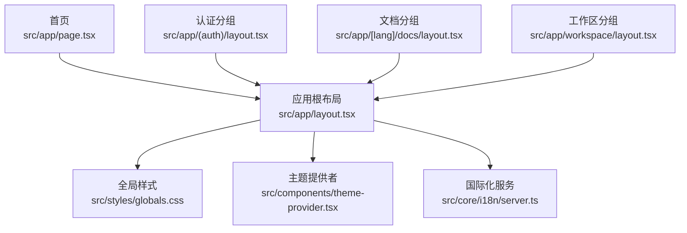
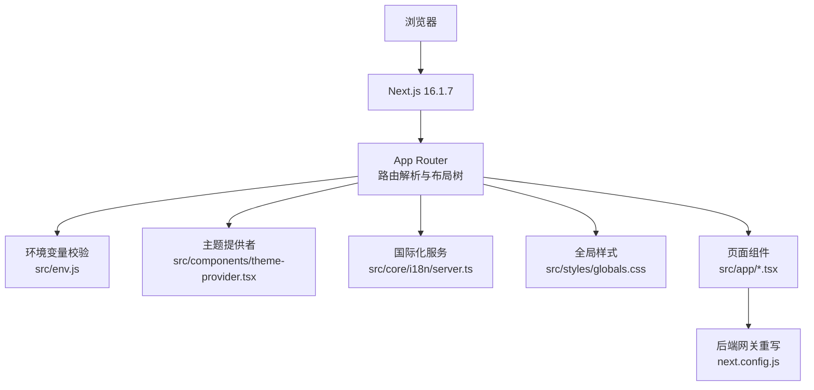
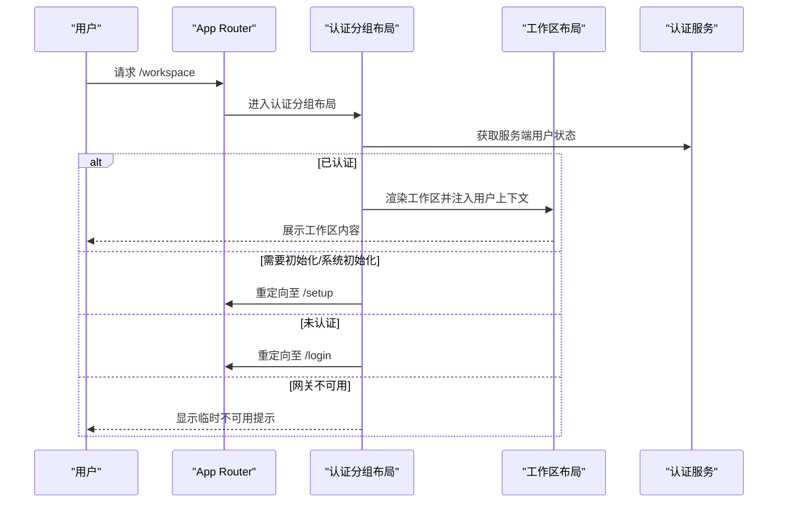
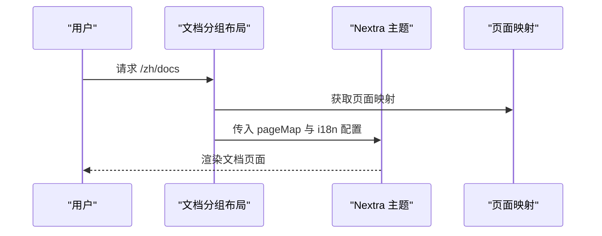
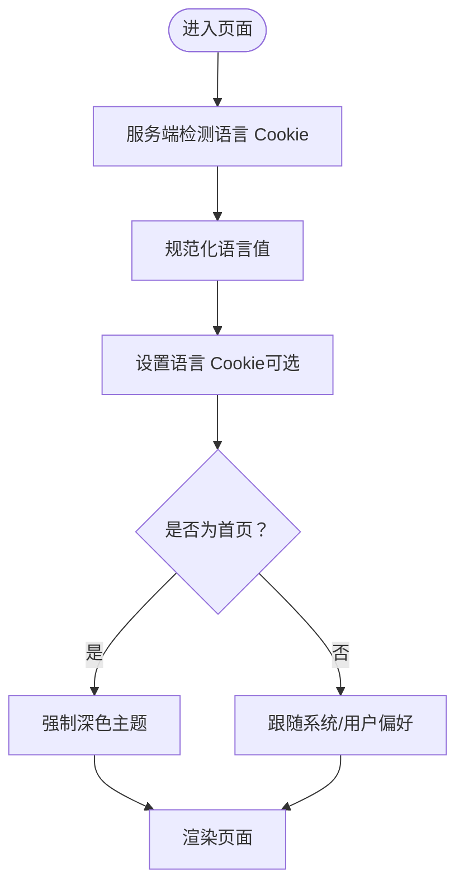
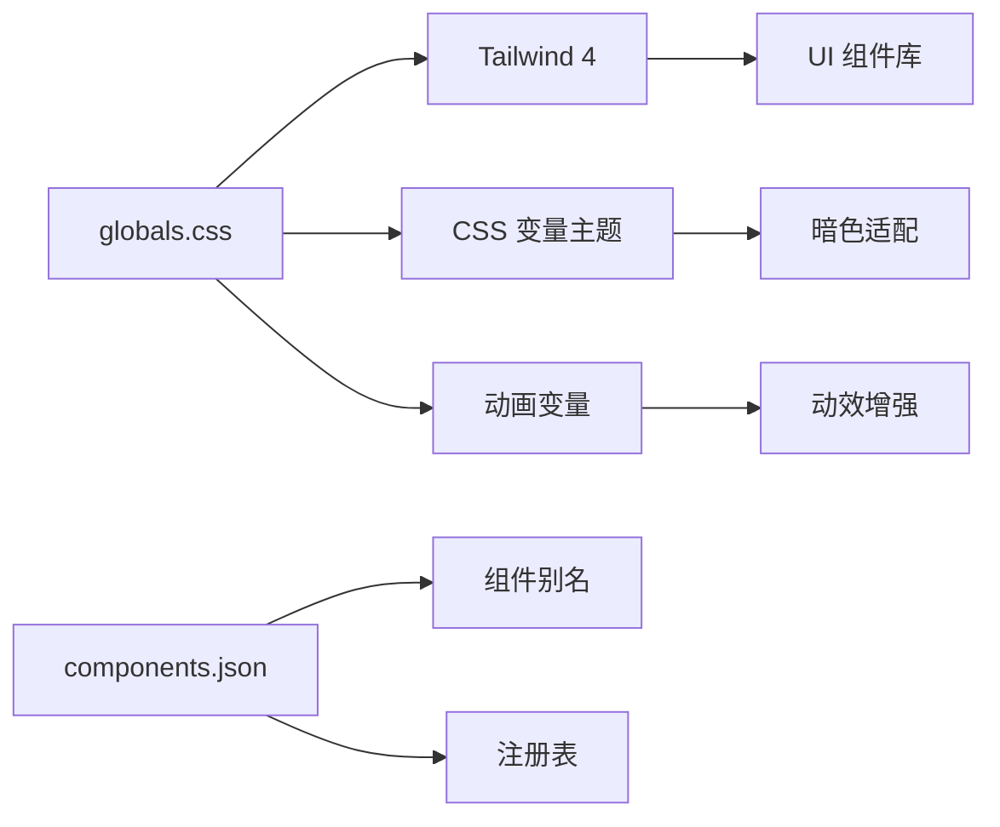
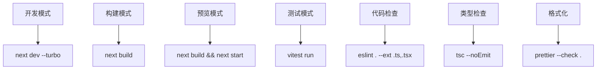
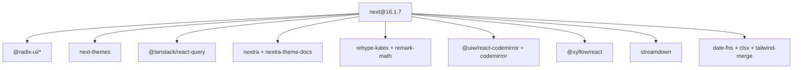

# 前端架构设计

<cite>
**本文档引用的文件**
- [package.json](file://frontend/package.json)
- [next.config.js](file://frontend/next.config.js)
- [tsconfig.json](file://frontend/tsconfig.json)
- [postcss.config.js](file://frontend/postcss.config.js)
- [components.json](file://frontend/components.json)
- [src/app/layout.tsx](file://frontend/src/app/layout.tsx)
- [src/app/page.tsx](file://frontend/src/app/page.tsx)
- [src/env.js](file://frontend/src/env.js)
- [src/components/theme-provider.tsx](file://frontend/src/components/theme-provider.tsx)
- [src/core/i18n/server.ts](file://frontend/src/core/i18n/server.ts)
- [src/styles/globals.css](file://frontend/src/styles/globals.css)
- [src/app/(auth)/layout.tsx](file://frontend/src/app/(auth)/layout.tsx)
- [src/app/[lang]/docs/layout.tsx](file://frontend/src/app/[lang]/docs/layout.tsx)
- [src/app/workspace/layout.tsx](file://frontend/src/app/workspace/layout.tsx)
</cite>

## 目录
1. [简介](#简介)
2. [项目结构](#项目结构)
3. [核心组件](#核心组件)
4. [架构总览](#架构总览)
5. [详细组件分析](#详细组件分析)
6. [依赖关系分析](#依赖关系分析)
7. [性能考虑](#性能考虑)
8. [故障排除指南](#故障排除指南)
9. [结论](#结论)
10. [附录](#附录)

## 简介
本文件面向 DeerFlow 前端团队与技术读者，系统性阐述基于 Next.js 16.1.7 的前端架构设计。内容涵盖 App Router 组织方式、页面路由系统、组件层次结构、TypeScript 配置、Tailwind CSS 样式体系、构建工具链、模块化设计原则（代码分割、懒加载、性能优化）以及开发与生产部署最佳实践。文档以“从宏观到微观”的方式呈现，既适合初学者快速上手，也为资深工程师提供深入参考。

## 项目结构
前端工程位于 `frontend/` 目录，采用 Next.js App Router 的目录约定进行组织，结合多语言文档站点与工作区页面。整体结构如下：

- 应用根布局与入口：`src/app/layout.tsx` 定义全局 HTML 结构、主题与国际化上下文；`src/app/page.tsx` 作为首页落地页。
- 认证域：`(auth)` 分组包含登录与初始化设置等页面，统一处理用户认证状态与重定向逻辑。
- 多语言文档：`[lang]/docs` 路由组承载多语言文档站点，使用 Nextra 主题。
- 工作区：`workspace` 路由组提供主应用工作区，受认证保护。
- 核心基础设施：环境变量校验、主题切换、国际化服务、样式全局定义等。

**图表来源**
- [src/app/layout.tsx:1-29](file://frontend/src/app/layout.tsx#L1-L29)
- [src/app/page.tsx:1-26](file://frontend/src/app/page.tsx#L1-L26)
- [src/app/(auth)/layout.tsx](file://frontend/src/app/(auth)/layout.tsx#L1-L47)
- [src/app/[lang]/docs/layout.tsx](file://frontend/src/app/[lang]/docs/layout.tsx#L1-L52)
- [src/app/workspace/layout.tsx:1-61](file://frontend/src/app/workspace/layout.tsx#L1-L61)
- [src/styles/globals.css:1-393](file://frontend/src/styles/globals.css#L1-L393)
- [src/components/theme-provider.tsx:1-20](file://frontend/src/components/theme-provider.tsx#L1-L20)
- [src/core/i18n/server.ts:1-42](file://frontend/src/core/i18n/server.ts#L1-L42)

**章节来源**
- [src/app/layout.tsx:1-29](file://frontend/src/app/layout.tsx#L1-L29)
- [src/app/page.tsx:1-26](file://frontend/src/app/page.tsx#L1-L26)
- [src/app/(auth)/layout.tsx](file://frontend/src/app/(auth)/layout.tsx#L1-L47)
- [src/app/[lang]/docs/layout.tsx](file://frontend/src/app/[lang]/docs/layout.tsx#L1-L52)
- [src/app/workspace/layout.tsx:1-61](file://frontend/src/app/workspace/layout.tsx#L1-L61)

## 核心组件
本节聚焦前端架构的关键构件及其职责边界。

- 全局根布局与元数据
  - 定义全局样式、主题提供者与国际化上下文，设置站点元信息。
  - 关键路径：[src/app/layout.tsx:1-29](file://frontend/src/app/layout.tsx#L1-L29)

- 首页落地页
  - 组合 Landing 页面的头部、英雄区、案例研究、技能展示、沙盒体验与社区板块。
  - 关键路径：[src/app/page.tsx:1-26](file://frontend/src/app/page.tsx#L1-L26)

- 主题提供者
  - 使用 next-themes 实现明暗主题切换，并在首页强制深色模式以提升视觉体验。
  - 关键路径：[src/components/theme-provider.tsx:1-20](file://frontend/src/components/theme-provider.tsx#L1-L20)

- 国际化服务
  - 服务端检测与设置语言 Cookie，支持 en/zh 默认语言与规范化处理。
  - 关键路径：[src/core/i18n/server.ts:1-42](file://frontend/src/core/i18n/server.ts#L1-L42)

- 环境变量校验
  - 使用 @t3-oss/env-nextjs 对服务端与客户端环境变量进行严格校验，确保构建安全。
  - 关键路径：[src/env.js:1-51](file://frontend/src/env.js#L1-L51)

- 全局样式与设计系统
  - Tailwind 4 与自定义动画变量、CSS 变量主题、暗色适配与 shadcn 风格的全局样式。
  - 关键路径：[src/styles/globals.css:1-393](file://frontend/src/styles/globals.css#L1-L393)

**章节来源**
- [src/app/layout.tsx:1-29](file://frontend/src/app/layout.tsx#L1-L29)
- [src/app/page.tsx:1-26](file://frontend/src/app/page.tsx#L1-L26)
- [src/components/theme-provider.tsx:1-20](file://frontend/src/components/theme-provider.tsx#L1-L20)
- [src/core/i18n/server.ts:1-42](file://frontend/src/core/i18n/server.ts#L1-L42)
- [src/env.js:1-51](file://frontend/src/env.js#L1-L51)
- [src/styles/globals.css:1-393](file://frontend/src/styles/globals.css#L1-L393)

## 架构总览
下图展示了前端应用的整体交互：浏览器请求进入 Next.js，经由 App Router 解析路由与布局树，结合环境变量、主题与国际化服务，最终渲染页面内容。

**图表来源**
- [next.config.js:1-89](file://frontend/next.config.js#L1-L89)
- [src/env.js:1-51](file://frontend/src/env.js#L1-L51)
- [src/components/theme-provider.tsx:1-20](file://frontend/src/components/theme-provider.tsx#L1-L20)
- [src/core/i18n/server.ts:1-42](file://frontend/src/core/i18n/server.ts#L1-L42)
- [src/styles/globals.css:1-393](file://frontend/src/styles/globals.css#L1-L393)
- [src/app/layout.tsx:1-29](file://frontend/src/app/layout.tsx#L1-L29)

## 详细组件分析

### App Router 与路由系统
- 路由组织
  - `(auth)` 分组用于认证相关页面，统一处理已认证、需初始化、系统初始化、未认证与网关不可用等状态。
  - `[lang]/docs` 分组实现多语言文档站点，通过 Nextra 主题渲染。
  - `workspace` 分组提供主应用工作区，受认证保护。
- 动态行为
  - 使用 `dynamic = "force-dynamic"` 强制服务端渲染，确保认证状态与国际化在服务端正确计算。
- 重定向策略
  - 根据认证结果进行 `/workspace`、`/setup`、`/login` 或错误提示的跳转。

**图表来源**
- [src/app/(auth)/layout.tsx](file://frontend/src/app/(auth)/layout.tsx#L1-L47)
- [src/app/workspace/layout.tsx:1-61](file://frontend/src/app/workspace/layout.tsx#L1-L61)

**章节来源**
- [src/app/(auth)/layout.tsx](file://frontend/src/app/(auth)/layout.tsx#L1-L47)
- [src/app/workspace/layout.tsx:1-61](file://frontend/src/app/workspace/layout.tsx#L1-L61)

### 文档站点与多语言支持
- 文档分组
  - `[lang]/docs` 通过 Nextra 主题渲染，支持英文与中文两种语言。
  - 使用 `getPageMap` 动态生成页面映射，并对路由进行前缀格式化。
- 导航与仓库链接
  - 集成导航栏、页脚与文档仓库基地址，便于维护与贡献。

**图表来源**
- [src/app/[lang]/docs/layout.tsx](file://frontend/src/app/[lang]/docs/layout.tsx#L1-L52)

**章节来源**
- [src/app/[lang]/docs/layout.tsx](file://frontend/src/app/[lang]/docs/layout.tsx#L1-L52)

### 主题与国际化集成
- 主题策略
  - 首页强制深色主题，其他页面根据系统偏好或用户选择切换。
- 国际化策略
  - 服务端检测 Cookie 中的语言偏好，支持 en/zh 并进行规范化处理，提供默认回退。

**图表来源**
- [src/core/i18n/server.ts:1-42](file://frontend/src/core/i18n/server.ts#L1-L42)
- [src/components/theme-provider.tsx:1-20](file://frontend/src/components/theme-provider.tsx#L1-L20)

**章节来源**
- [src/core/i18n/server.ts:1-42](file://frontend/src/core/i18n/server.ts#L1-L42)
- [src/components/theme-provider.tsx:1-20](file://frontend/src/components/theme-provider.tsx#L1-L20)

### 样式系统与设计令牌
- Tailwind 4 与自定义插件
  - 使用 PostCSS 插件与 tw-animate-css 实现动画与主题扩展。
- 设计令牌与暗色适配
  - 通过 CSS 变量定义主题色板，支持明/暗两套配色与动画变量。
- shadcn 风格与组件别名
  - 组件别名与注册表配置，便于统一风格与扩展。

**图表来源**
- [src/styles/globals.css:1-393](file://frontend/src/styles/globals.css#L1-L393)
- [components.json:1-27](file://frontend/components.json#L1-L27)

**章节来源**
- [src/styles/globals.css:1-393](file://frontend/src/styles/globals.css#L1-L393)
- [components.json:1-27](file://frontend/components.json#L1-L27)

### 构建与运行时配置
- Next.js 配置
  - 国际化配置、开发指示器关闭、API 重写规则（LangGraph 兼容与通用网关代理）。
- TypeScript 配置
  - 严格模式、ESNext 模块解析、Bundler 模式、路径别名与增量编译。
- PostCSS 配置
  - Tailwind 插件与 CSS 源码导入。
- 包管理与脚本
  - PNPM、开发/构建/测试/Lint/格式化脚本与类型检查。

**图表来源**
- [package.json:1-118](file://frontend/package.json#L1-L118)
- [next.config.js:1-89](file://frontend/next.config.js#L1-L89)
- [tsconfig.json:1-46](file://frontend/tsconfig.json#L1-L46)
- [postcss.config.js:1-6](file://frontend/postcss.config.js#L1-L6)

**章节来源**
- [package.json:1-118](file://frontend/package.json#L1-L118)
- [next.config.js:1-89](file://frontend/next.config.js#L1-L89)
- [tsconfig.json:1-46](file://frontend/tsconfig.json#L1-L46)
- [postcss.config.js:1-6](file://frontend/postcss.config.js#L1-L6)

## 依赖关系分析
前端依赖围绕 Next.js 生态展开，涵盖 UI 组件、国际化、主题、查询缓存、Markdown 渲染、数学公式、图形可视化与流式渲染等能力。

**图表来源**
- [package.json:21-92](file://frontend/package.json#L21-L92)

**章节来源**
- [package.json:21-92](file://frontend/package.json#L21-L92)

## 性能考虑
- 代码分割与懒加载
  - 利用 Next.js 的路由分组与动态导入机制，按需加载页面与组件，减少首屏体积。
- 构建优化
  - 启用增量编译与 ESNext/Bundler 模式，缩短构建时间；PostCSS 仅在需要时处理样式。
- 缓存与重写
  - 通过 API 重写将文档与工作区请求转发至内部网关，避免跨域与重复构建。
- 主题与动画
  - CSS 变量与轻量动画减少 JS 动画开销；暗色主题与字体权重在全局层面优化渲染性能。
- 测试与质量
  - 单元测试与端到端测试配合 ESLint、Prettier 与类型检查，降低回归风险。

[本节为通用性能建议，不直接分析具体文件，故无“章节来源”]

## 故障排除指南
- 环境变量校验失败
  - 确认服务端与客户端变量命名与类型符合校验规则；必要时设置 `SKIP_ENV_VALIDATION` 跳过校验（仅限开发/Docker）。
  - 参考路径：[src/env.js:1-51](file://frontend/src/env.js#L1-L51)
- 网关不可用
  - 当后端网关不可达时，工作区布局会显示临时不可用提示与重试/登出按钮；检查网关地址与网络连通性。
  - 参考路径：[src/app/workspace/layout.tsx:30-54](file://frontend/src/app/workspace/layout.tsx#L30-L54)
- 文档路由异常
  - 确认 `[lang]` 参数与页面映射生成逻辑；检查 Nextra 主题与页面路径前缀格式化。
  - 参考路径：[src/app/[lang]/docs/layout.tsx](file://frontend/src/app/[lang]/docs/layout.tsx#L27-L51)
- 主题与国际化问题
  - 检查语言 Cookie 设置与服务端检测逻辑；确认首页强制深色主题策略与其他页面的主题差异。
  - 参考路径：[src/components/theme-provider.tsx:1-20](file://frontend/src/components/theme-provider.tsx#L1-L20)、[src/core/i18n/server.ts:1-42](file://frontend/src/core/i18n/server.ts#L1-L42)

**章节来源**
- [src/env.js:1-51](file://frontend/src/env.js#L1-L51)
- [src/app/workspace/layout.tsx:30-54](file://frontend/src/app/workspace/layout.tsx#L30-L54)
- [src/app/[lang]/docs/layout.tsx](file://frontend/src/app/[lang]/docs/layout.tsx#L27-L51)
- [src/components/theme-provider.tsx:1-20](file://frontend/src/components/theme-provider.tsx#L1-L20)
- [src/core/i18n/server.ts:1-42](file://frontend/src/core/i18n/server.ts#L1-L42)

## 结论
DeerFlow 前端以 Next.js 16.1.7 为核心，结合 App Router 的路由分组与布局树、严格的 TypeScript 配置、Tailwind 4 样式体系与 shadcn 组件生态，构建了高可维护性的现代化前端架构。通过环境变量校验、主题与国际化服务、API 重写与测试工具链，系统在开发效率、运行性能与用户体验之间取得平衡。建议在后续迭代中持续关注路由懒加载、组件拆分与缓存策略，以进一步优化首屏性能与交互流畅度。

[本节为总结性内容，不直接分析具体文件，故无“章节来源”]

## 附录

### 开发环境配置指南
- 安装与启动
  - 使用 PNPM 管理依赖；执行 `pnpm run dev` 启动开发服务器。
  - 参考路径：[package.json:6-20](file://frontend/package.json#L6-L20)
- 环境变量
  - 在本地 `.env` 文件中设置服务端与客户端变量；如需跳过校验可在容器内设置 `SKIP_ENV_VALIDATION=1`。
  - 参考路径：[src/env.js:1-51](file://frontend/src/env.js#L1-L51)
- 代码质量
  - 使用 ESLint、Prettier 与 TypeScript 进行静态检查与格式化；提交前执行 `pnpm run check`。
  - 参考路径：[package.json:9-19](file://frontend/package.json#L9-L19)、[tsconfig.json:1-46](file://frontend/tsconfig.json#L1-L46)

**章节来源**
- [package.json:6-20](file://frontend/package.json#L6-L20)
- [src/env.js:1-51](file://frontend/src/env.js#L1-L51)
- [tsconfig.json:1-46](file://frontend/tsconfig.json#L1-L46)

### 生产部署最佳实践
- 构建与预览
  - 执行 `pnpm run build` 生成静态产物；使用 `pnpm run preview` 在生产模式预览。
  - 参考路径：[package.json:8-15](file://frontend/package.json#L8-L15)
- API 重写与网关
  - 通过 `next.config.js` 的重写规则将 `/api/*` 请求转发至内部网关，确保前后端解耦与部署灵活性。
  - 参考路径：[next.config.js:24-85](file://frontend/next.config.js#L24-L85)
- 样式与资源
  - Tailwind 与 PostCSS 在构建阶段处理样式；确保静态资源与字体在生产环境中可用。
  - 参考路径：[postcss.config.js:1-6](file://frontend/postcss.config.js#L1-L6)、[src/styles/globals.css:1-393](file://frontend/src/styles/globals.css#L1-L393)

**章节来源**
- [package.json:8-15](file://frontend/package.json#L8-L15)
- [next.config.js:24-85](file://frontend/next.config.js#L24-L85)
- [postcss.config.js:1-6](file://frontend/postcss.config.js#L1-L6)
- [src/styles/globals.css:1-393](file://frontend/src/styles/globals.css#L1-L393)