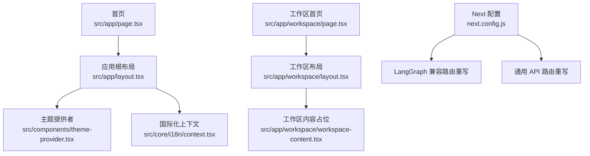
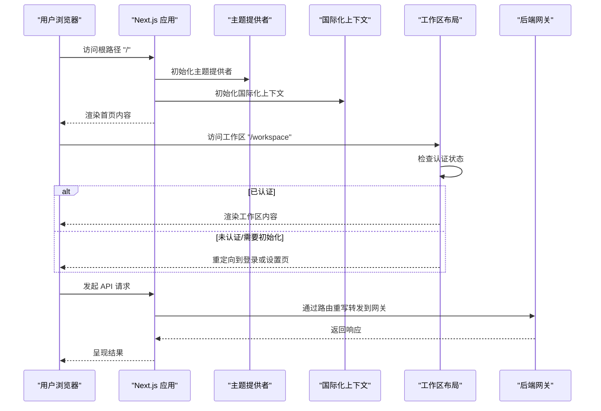
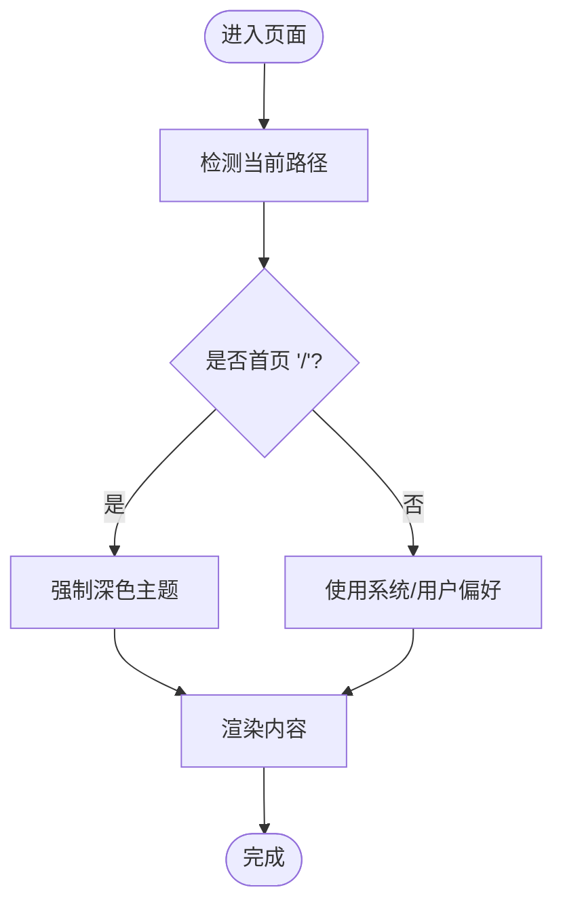
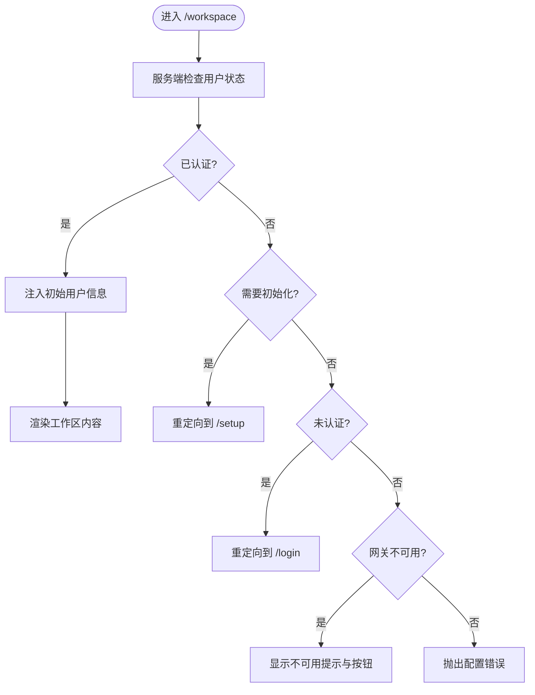
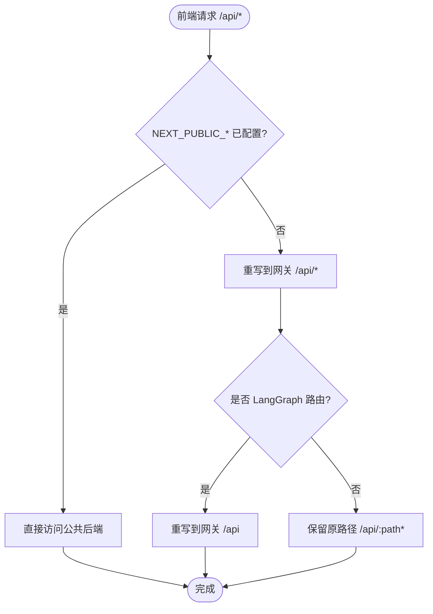
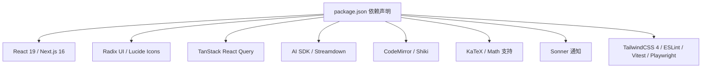

# 前端系统

<cite>
**本文引用的文件**
- [package.json](file://frontend/package.json)
- [next.config.js](file://frontend/next.config.js)
- [tsconfig.json](file://frontend/tsconfig.json)
- [src/app/layout.tsx](file://frontend/src/app/layout.tsx)
- [src/app/page.tsx](file://frontend/src/app/page.tsx)
- [src/app/workspace/layout.tsx](file://frontend/src/app/workspace/layout.tsx)
- [src/app/workspace/page.tsx](file://frontend/src/app/workspace/page.tsx)
- [src/components/theme-provider.tsx](file://frontend/src/components/theme-provider.tsx)
- [src/core/i18n/context.tsx](file://frontend/src/core/i18n/context.tsx)
- [src/core/api/index.ts](file://frontend/src/core/api/index.ts)
</cite>

## 目录
1. [简介](#简介)
2. [项目结构](#项目结构)
3. [核心组件](#核心组件)
4. [架构总览](#架构总览)
5. [详细组件分析](#详细组件分析)
6. [依赖分析](#依赖分析)
7. [性能考虑](#性能考虑)
8. [故障排查指南](#故障排查指南)
9. [结论](#结论)
10. [附录](#附录)

## 简介
本文件为 DeerFlow 前端系统的全面技术文档，聚焦于基于 Next.js 的前端架构与实现细节。文档涵盖应用结构、组件层次、国际化与主题系统、API 路由重写策略、以及工作区布局与认证流程等。同时，针对聊天界面、设置与配置界面（技能管理、模型配置、系统设置）提供可扩展的开发指南与样式定制方法，帮助开发者高效地扩展与维护前端功能。

## 项目结构
前端采用 Next.js 应用程序目录结构，结合多语言与工作区路由组织页面与组件。核心要点如下：
- 根布局与元数据：在根布局中注入全局样式、主题提供者与国际化上下文，统一顶层渲染。
- 页面组织：首页作为落地页，工作区路由用于受保护的内容区域；静态网站模式下可直接跳转到演示对话。
- 国际化与主题：通过自定义 I18nProvider 与 ThemeProvider 实现语言切换与明暗主题控制。
- API 路由重写：通过 next.config.js 将前端 API 请求转发至后端网关，支持 LangGraph 兼容路由与通用 API 路由。

**图表来源**
- [src/app/layout.tsx:1-29](file://frontend/src/app/layout.tsx#L1-L29)
- [src/components/theme-provider.tsx:1-20](file://frontend/src/components/theme-provider.tsx#L1-L20)
- [src/core/i18n/context.tsx:1-42](file://frontend/src/core/i18n/context.tsx#L1-L42)
- [src/app/page.tsx:1-26](file://frontend/src/app/page.tsx#L1-L26)
- [src/app/workspace/layout.tsx:1-61](file://frontend/src/app/workspace/layout.tsx#L1-L61)
- [src/app/workspace/page.tsx:1-21](file://frontend/src/app/workspace/page.tsx#L1-L21)
- [next.config.js:17-89](file://frontend/next.config.js#L17-L89)

**章节来源**
- [src/app/layout.tsx:1-29](file://frontend/src/app/layout.tsx#L1-L29)
- [src/app/page.tsx:1-26](file://frontend/src/app/page.tsx#L1-L26)
- [src/app/workspace/layout.tsx:1-61](file://frontend/src/app/workspace/layout.tsx#L1-L61)
- [src/app/workspace/page.tsx:1-21](file://frontend/src/app/workspace/page.tsx#L1-L21)
- [next.config.js:17-89](file://frontend/next.config.js#L17-L89)

## 核心组件
- 主题系统：通过自定义 ThemeProvider 控制明暗主题，并在首页强制使用深色主题以提升视觉体验。
- 国际化系统：I18nProvider 提供语言切换能力，使用 Cookie 记录用户选择的语言，确保跨页面一致性。
- 工作区布局：WorkspaceLayout 负责认证状态检查与重定向逻辑，保障用户在不同状态下进入正确的页面。
- API 客户端：核心 API 模块导出统一的客户端入口，便于后续扩展与测试。

**章节来源**
- [src/components/theme-provider.tsx:1-20](file://frontend/src/components/theme-provider.tsx#L1-L20)
- [src/core/i18n/context.tsx:1-42](file://frontend/src/core/i18n/context.tsx#L1-L42)
- [src/app/workspace/layout.tsx:1-61](file://frontend/src/app/workspace/layout.tsx#L1-L61)
- [src/core/api/index.ts:1-2](file://frontend/src/core/api/index.ts#L1-L2)

## 架构总览
前端通过 Next.js 的 App Router 组织页面与布局，结合环境变量与路由重写实现与后端网关的解耦。整体交互流程如下：

**图表来源**
- [src/app/layout.tsx:10-28](file://frontend/src/app/layout.tsx#L10-L28)
- [src/app/workspace/layout.tsx:12-60](file://frontend/src/app/workspace/layout.tsx#L12-L60)
- [next.config.js:24-85](file://frontend/next.config.js#L24-L85)

## 详细组件分析

### 主题系统与国际化
- 主题提供者：在首页强制深色主题，其他页面按系统偏好或用户选择切换。
- 国际化上下文：提供语言切换函数与 Cookie 同步，保证跨页面语言状态一致。

**图表来源**
- [src/components/theme-provider.tsx:6-19](file://frontend/src/components/theme-provider.tsx#L6-L19)
- [src/core/i18n/context.tsx:23-26](file://frontend/src/core/i18n/context.tsx#L23-L26)

**章节来源**
- [src/components/theme-provider.tsx:1-20](file://frontend/src/components/theme-provider.tsx#L1-L20)
- [src/core/i18n/context.tsx:1-42](file://frontend/src/core/i18n/context.tsx#L1-L42)

### 工作区布局与认证流程
- 认证状态检查：根据服务端返回的不同标签进行分支处理，已认证则进入工作区，否则重定向到登录或设置页。
- 网关不可用时的提示与重试：提供“重试”与“登出并重置”按钮，改善用户体验。

**图表来源**
- [src/app/workspace/layout.tsx:17-59](file://frontend/src/app/workspace/layout.tsx#L17-L59)

**章节来源**
- [src/app/workspace/layout.tsx:1-61](file://frontend/src/app/workspace/layout.tsx#L1-L61)

### API 路由重写与后端集成
- LangGraph 兼容路由：将 /api/langgraph 与 /api/langgraph-compat 重写到后端网关，便于兼容旧版接口。
- 通用 API 路由：当未显式配置公共后端地址时，将 /api/* 路由统一转发到网关，减少前端硬编码。
- 环境变量控制：通过 DEER_FLOW_INTERNAL_GATEWAY_BASE_URL 与 NEXT_PUBLIC_* 变量灵活切换目标服务。

**图表来源**
- [next.config.js:24-85](file://frontend/next.config.js#L24-L85)

**章节来源**
- [next.config.js:17-89](file://frontend/next.config.js#L17-L89)

### 类型与构建配置
- TypeScript 配置：启用严格模式、隔离模块与 ESNext 模块解析，配合 Next.js 插件与路径别名，确保类型安全与开发体验。
- 包管理与脚本：使用 pnpm，提供开发、构建、测试、格式化与类型检查等脚本，便于本地与 CI 环境运行。

**章节来源**
- [tsconfig.json:1-46](file://frontend/tsconfig.json#L1-L46)
- [package.json:1-118](file://frontend/package.json#L1-L118)

## 依赖分析
- 运行时依赖：包含 React 19、Next.js 16、Radix UI 组件库、TanStack React Query、AI SDK、CodeMirror、KaTeX、Sonner、Streamdown 等，覆盖 UI、状态管理、富文本与流式传输等场景。
- 开发依赖：ESLint、Prettier、TailwindCSS 4、TypeScript、Playwright、Vitest 等，保障代码质量与测试覆盖。

**图表来源**
- [package.json:21-92](file://frontend/package.json#L21-L92)

**章节来源**
- [package.json:1-118](file://frontend/package.json#L1-L118)

## 性能考虑
- 路由重写与网络层：通过 next.config.js 的重写规则减少前端对后端地址的硬编码，提高部署灵活性；在网关不可用时提供重试机制，降低失败率。
- 主题与国际化：在根布局集中初始化，避免重复渲染；国际化上下文仅在客户端使用，减少服务端负担。
- 构建与类型检查：严格 TS 配置与增量编译，结合 ESLint 与 Prettier，提升构建稳定性与代码一致性。

[本节为通用性能建议，不直接分析具体文件]

## 故障排查指南
- 网关不可用：工作区布局在网关不可用时会显示提示与重试按钮，若问题持续，尝试清理缓存或检查后端服务状态。
- 认证状态异常：根据返回标签进行分支处理，若出现配置错误，检查环境变量与后端认证配置。
- API 请求失败：确认 NEXT_PUBLIC_* 与 DEER_FLOW_INTERNAL_GATEWAY_BASE_URL 是否正确配置，必要时关闭公共后端开关以强制走网关重写。

**章节来源**
- [src/app/workspace/layout.tsx:31-54](file://frontend/src/app/workspace/layout.tsx#L31-L54)
- [next.config.js:26-30](file://frontend/next.config.js#L26-L30)

## 结论
DeerFlow 前端系统以 Next.js 为基础，结合主题与国际化上下文、工作区认证流程与 API 路由重写策略，实现了清晰的架构分层与良好的可扩展性。通过统一的 API 客户端与严格的类型配置，开发者可以快速迭代聊天界面、设置与配置界面，并在保持一致用户体验的同时，灵活适配后端变化。

[本节为总结性内容，不直接分析具体文件]

## 附录
- 组件开发指南
  - 新增页面：在 src/app 下创建新路由，复用根布局与主题/国际化上下文。
  - 新增组件：在 src/components 中按功能域拆分，遵循单一职责与可复用原则。
  - 状态管理：优先使用 TanStack React Query 管理远端状态，局部状态使用 React useState/useReducer。
  - 实时通信：利用 AI SDK 与 Streamdown 处理流式响应，结合 use-stick-to-bottom 等工具优化滚动体验。
- 样式定制方法
  - TailwindCSS 4：通过原子类组合与自定义变量实现主题一致性。
  - CodeMirror：按需引入语言高亮与主题，确保性能与可读性平衡。
  - 动画与交互：使用 GSAP 或 Motion 加强过渡效果，注意移动端性能。
- 聊天界面设计要点
  - 消息处理：区分用户消息与助手消息，支持 Markdown、数学公式与代码块渲染。
  - 实时通信：采用 SSE 或 WebSocket 流式传输，结合防抖与错误重试。
  - 用户体验：提供加载态、错误提示、复制与下载能力，优化长对话的可读性。
- 设置与配置界面
  - 技能管理：以卡片形式展示技能列表，支持启用/禁用、排序与批量操作。
  - 模型配置：提供模型参数面板，支持切换与保存用户偏好。
  - 系统设置：集中管理语言、主题、通知与调试选项，确保持久化存储。

[本节为通用开发建议，不直接分析具体文件]