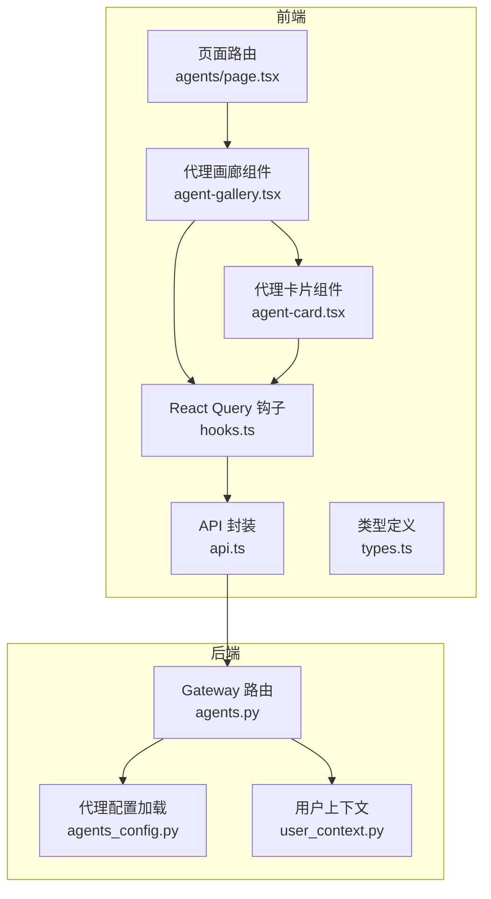
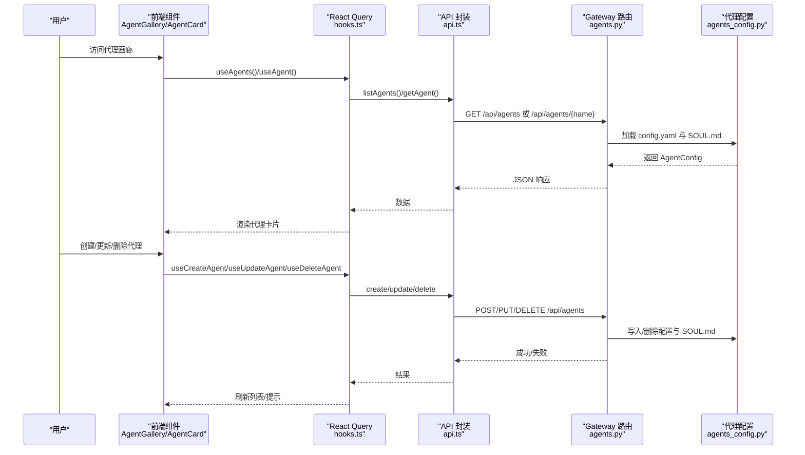
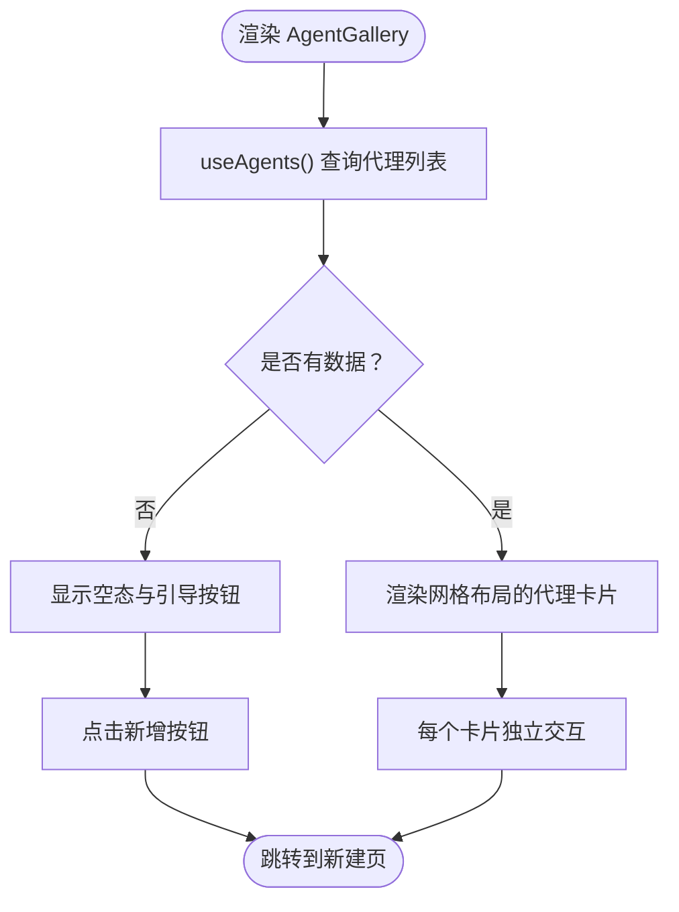
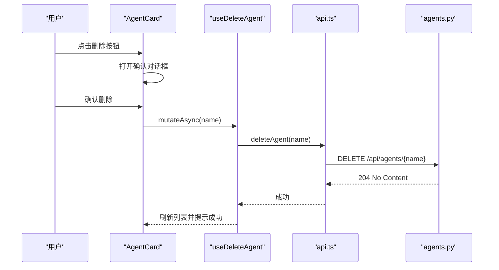
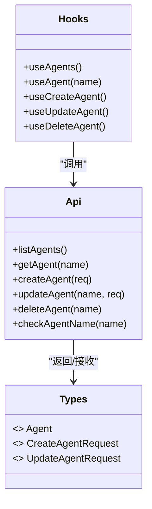
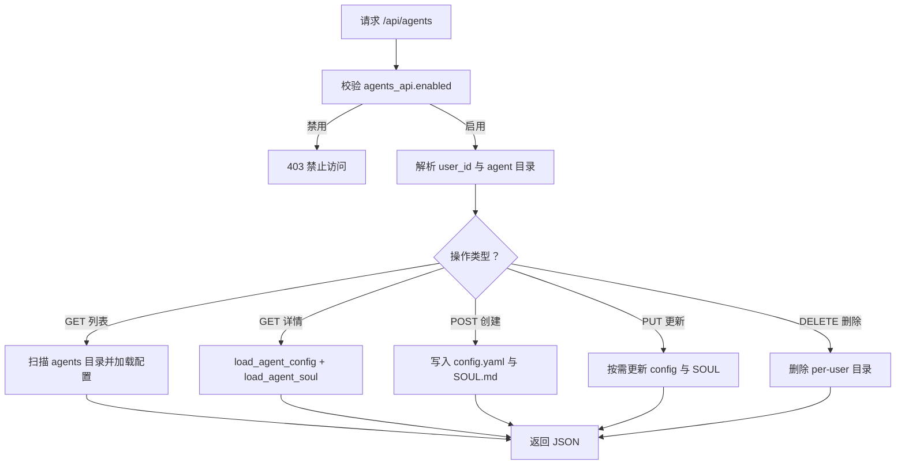
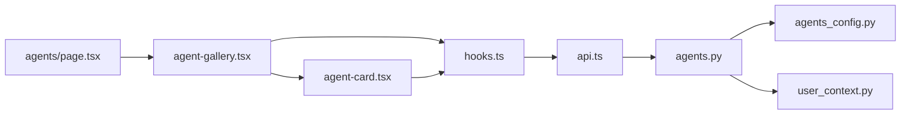

# 代理管理系统

<cite>
**本文档引用的文件**
- [frontend/src/app/workspace/agents/page.tsx](file://frontend/src/app/workspace/agents/page.tsx)
- [frontend/src/components/workspace/agents/agent-gallery.tsx](file://frontend/src/components/workspace/agents/agent-gallery.tsx)
- [frontend/src/components/workspace/agents/agent-card.tsx](file://frontend/src/components/workspace/agents/agent-card.tsx)
- [frontend/src/core/agents/hooks.ts](file://frontend/src/core/agents/hooks.ts)
- [frontend/src/core/agents/api.ts](file://frontend/src/core/agents/api.ts)
- [frontend/src/core/agents/types.ts](file://frontend/src/core/agents/types.ts)
- [backend/app/gateway/routers/agents.py](file://backend/app/gateway/routers/agents.py)
- [backend/packages/harness/deerflow/config/agents_config.py](file://backend/packages/harness/deerflow/config/agents_config.py)
- [backend/packages/harness/deerflow/runtime/user_context.py](file://backend/packages/harness/deerflow/runtime/user_context.py)
- [backend/docs/ARCHITECTURE.md](file://backend/docs/ARCHITECTURE.md)
- [backend/docs/MEMORY_IMPROVEMENTS.md](file://backend/docs/MEMORY_IMPROVEMENTS.md)
- [backend/docs/MEMORY_SETTINGS_REVIEW.md](file://backend/docs/MEMORY_SETTINGS_REVIEW.md)
- [backend/docs/rfc-create-deerflow-agent.md](file://backend/docs/rfc-create-deerflow-agent.md)
- [frontend/src/app/api/memory/[...path]/route.ts](file://frontend/src/app/api/memory/[...path]/route.ts)
</cite>

## 目录
1. [简介](#简介)
2. [项目结构](#项目结构)
3. [核心组件](#核心组件)
4. [架构总览](#架构总览)
5. [详细组件分析](#详细组件分析)
6. [依赖关系分析](#依赖关系分析)
7. [性能考虑](#性能考虑)
8. [故障排除指南](#故障排除指南)
9. [结论](#结论)
10. [附录](#附录)

## 简介
本技术文档聚焦 DeerFlow 代理管理系统的前端代理画廊展示、代理卡片组件与后端代理管理功能，涵盖代理的创建、编辑、删除与切换（通过聊天入口）等完整生命周期管理。文档详细说明代理配置管理（模型选择、工具组与技能白名单、SOUL.md 人格与行为约束注入）、状态管理、缓存机制与性能优化策略，并提供最佳实践与扩展指南。

## 项目结构
代理管理相关的核心文件分布于前端与后端：
- 前端：页面路由、代理画廊组件、代理卡片组件、React Query 钩子、API 封装与类型定义
- 后端：FastAPI 路由、自定义代理配置加载与持久化、用户上下文隔离、架构与中间件链

图表来源
- [frontend/src/app/workspace/agents/page.tsx:1-5](file://frontend/src/app/workspace/agents/page.tsx#L1-L5)
- [frontend/src/components/workspace/agents/agent-gallery.tsx:1-70](file://frontend/src/components/workspace/agents/agent-gallery.tsx#L1-L70)
- [frontend/src/components/workspace/agents/agent-card.tsx:1-154](file://frontend/src/components/workspace/agents/agent-card.tsx#L1-L154)
- [frontend/src/core/agents/hooks.ts:1-64](file://frontend/src/core/agents/hooks.ts#L1-L64)
- [frontend/src/core/agents/api.ts:1-114](file://frontend/src/core/agents/api.ts#L1-L114)
- [frontend/src/core/agents/types.ts:1-27](file://frontend/src/core/agents/types.ts#L1-L27)
- [backend/app/gateway/routers/agents.py:1-449](file://backend/app/gateway/routers/agents.py#L1-L449)
- [backend/packages/harness/deerflow/config/agents_config.py:1-203](file://backend/packages/harness/deerflow/config/agents_config.py#L1-L203)
- [backend/packages/harness/deerflow/runtime/user_context.py:1-168](file://backend/packages/harness/deerflow/runtime/user_context.py#L1-L168)

章节来源
- [frontend/src/app/workspace/agents/page.tsx:1-5](file://frontend/src/app/workspace/agents/page.tsx#L1-L5)
- [frontend/src/components/workspace/agents/agent-gallery.tsx:1-70](file://frontend/src/components/workspace/agents/agent-gallery.tsx#L1-L70)
- [frontend/src/components/workspace/agents/agent-card.tsx:1-154](file://frontend/src/components/workspace/agents/agent-card.tsx#L1-L154)
- [frontend/src/core/agents/hooks.ts:1-64](file://frontend/src/core/agents/hooks.ts#L1-L64)
- [frontend/src/core/agents/api.ts:1-114](file://frontend/src/core/agents/api.ts#L1-L114)
- [frontend/src/core/agents/types.ts:1-27](file://frontend/src/core/agents/types.ts#L1-L27)
- [backend/app/gateway/routers/agents.py:1-449](file://backend/app/gateway/routers/agents.py#L1-L449)
- [backend/packages/harness/deerflow/config/agents_config.py:1-203](file://backend/packages/harness/deerflow/config/agents_config.py#L1-L203)
- [backend/packages/harness/deerflow/runtime/user_context.py:1-168](file://backend/packages/harness/deerflow/runtime/user_context.py#L1-L168)

## 核心组件
- 代理画廊展示：负责渲染代理列表、空态提示与新增按钮，支持懒加载与国际化文案
- 代理卡片组件：展示代理名称、描述、模型、工具组与技能标签，并提供进入聊天与删除确认
- 代理管理钩子：基于 React Query 的查询与变更操作，统一处理加载状态、错误与缓存失效
- 代理 API 封装：封装 HTTP 请求，包含错误分类与代理名称可用性检查
- 后端路由与配置：提供代理 CRUD、名称校验、用户档案注入、SOUL.md 注入到系统提示词

章节来源
- [frontend/src/components/workspace/agents/agent-gallery.tsx:12-70](file://frontend/src/components/workspace/agents/agent-gallery.tsx#L12-L70)
- [frontend/src/components/workspace/agents/agent-card.tsx:34-154](file://frontend/src/components/workspace/agents/agent-card.tsx#L34-L154)
- [frontend/src/core/agents/hooks.ts:12-64](file://frontend/src/core/agents/hooks.ts#L12-L64)
- [frontend/src/core/agents/api.ts:29-114](file://frontend/src/core/agents/api.ts#L29-L114)
- [backend/app/gateway/routers/agents.py:108-449](file://backend/app/gateway/routers/agents.py#L108-L449)

## 架构总览
代理管理贯穿前端 UI、API 网关与后端运行时：
- 前端通过 React Query 查询代理列表与详情，触发创建、更新、删除操作
- 后端 Gateway 提供 /api/agents CRUD 接口，读写 per-user 或 legacy 共享布局下的代理配置与 SOUL.md
- 用户上下文隔离确保 per-user 作用域的数据访问与文件路径解析
- 架构文档描述了中间件链、模型工厂、工具系统与 MCP 集成，为代理运行期提供能力支撑

图表来源
- [frontend/src/components/workspace/agents/agent-gallery.tsx:12-70](file://frontend/src/components/workspace/agents/agent-gallery.tsx#L12-L70)
- [frontend/src/components/workspace/agents/agent-card.tsx:34-154](file://frontend/src/components/workspace/agents/agent-card.tsx#L34-L154)
- [frontend/src/core/agents/hooks.ts:12-64](file://frontend/src/core/agents/hooks.ts#L12-L64)
- [frontend/src/core/agents/api.ts:29-114](file://frontend/src/core/agents/api.ts#L29-L114)
- [backend/app/gateway/routers/agents.py:108-449](file://backend/app/gateway/routers/agents.py#L108-L449)
- [backend/packages/harness/deerflow/config/agents_config.py:82-203](file://backend/packages/harness/deerflow/config/agents_config.py#L82-L203)

章节来源
- [backend/docs/ARCHITECTURE.md:55-127](file://backend/docs/ARCHITECTURE.md#L55-L127)
- [backend/docs/ARCHITECTURE.md:466-485](file://backend/docs/ARCHITECTURE.md#L466-L485)

## 详细组件分析

### 代理画廊组件（AgentGallery）
职责与特性：
- 国际化标题与描述
- 新增代理按钮导航至新建页
- 列表为空时显示引导与按钮
- 使用 useAgents 获取数据并控制加载态

图表来源
- [frontend/src/components/workspace/agents/agent-gallery.tsx:12-70](file://frontend/src/components/workspace/agents/agent-gallery.tsx#L12-L70)

章节来源
- [frontend/src/components/workspace/agents/agent-gallery.tsx:12-70](file://frontend/src/components/workspace/agents/agent-gallery.tsx#L12-L70)

### 代理卡片组件（AgentCard）
职责与特性：
- 展示名称、描述、模型徽标与工具组/技能标签
- 聊天入口：导航到对应代理的聊天页
- 删除确认对话框与异步删除操作
- 使用 useDeleteAgent 并集成通知反馈

图表来源
- [frontend/src/components/workspace/agents/agent-card.tsx:34-154](file://frontend/src/components/workspace/agents/agent-card.tsx#L34-L154)
- [frontend/src/core/agents/hooks.ts:56-64](file://frontend/src/core/agents/hooks.ts#L56-L64)
- [frontend/src/core/agents/api.ts:74-79](file://frontend/src/core/agents/api.ts#L74-L79)
- [backend/app/gateway/routers/agents.py:412-449](file://backend/app/gateway/routers/agents.py#L412-L449)

章节来源
- [frontend/src/components/workspace/agents/agent-card.tsx:34-154](file://frontend/src/components/workspace/agents/agent-card.tsx#L34-L154)
- [frontend/src/core/agents/hooks.ts:56-64](file://frontend/src/core/agents/hooks.ts#L56-L64)
- [frontend/src/core/agents/api.ts:74-79](file://frontend/src/core/agents/api.ts#L74-L79)
- [backend/app/gateway/routers/agents.py:412-449](file://backend/app/gateway/routers/agents.py#L412-L449)

### 代理管理钩子与 API 封装
- useAgents/useAgent：查询代理列表与单个代理详情，支持条件启用与缓存键
- useCreateAgent/useUpdateAgent/useDeleteAgent：Mutation 操作，成功后失效相关查询缓存
- API 封装：统一错误处理，区分后端不可达、请求失败与 API 关闭场景；提供代理名称可用性检查

图表来源
- [frontend/src/core/agents/hooks.ts:12-64](file://frontend/src/core/agents/hooks.ts#L12-L64)
- [frontend/src/core/agents/api.ts:29-114](file://frontend/src/core/agents/api.ts#L29-L114)
- [frontend/src/core/agents/types.ts:1-27](file://frontend/src/core/agents/types.ts#L1-L27)

章节来源
- [frontend/src/core/agents/hooks.ts:12-64](file://frontend/src/core/agents/hooks.ts#L12-L64)
- [frontend/src/core/agents/api.ts:29-114](file://frontend/src/core/agents/api.ts#L29-L114)
- [frontend/src/core/agents/types.ts:1-27](file://frontend/src/core/agents/types.ts#L1-L27)

### 后端代理路由与配置管理
- 列表/详情：读取 per-user 或 legacy 共享布局下的 config.yaml 与 SOUL.md
- 创建：校验名称、写入 config.yaml 与 SOUL.md，失败自动清理
- 更新：可选字段区分“省略”与“显式设为 null”，skills 的 None 表示继承全部
- 删除：仅允许 per-user 副本存在时删除，legacy 共享副本需迁移脚本处理
- 用户上下文：通过 ContextVar 解析有效 user_id，确保文件系统隔离

图表来源
- [backend/app/gateway/routers/agents.py:108-449](file://backend/app/gateway/routers/agents.py#L108-L449)
- [backend/packages/harness/deerflow/config/agents_config.py:82-203](file://backend/packages/harness/deerflow/config/agents_config.py#L82-L203)
- [backend/packages/harness/deerflow/runtime/user_context.py:100-168](file://backend/packages/harness/deerflow/runtime/user_context.py#L100-L168)

章节来源
- [backend/app/gateway/routers/agents.py:108-449](file://backend/app/gateway/routers/agents.py#L108-L449)
- [backend/packages/harness/deerflow/config/agents_config.py:82-203](file://backend/packages/harness/deerflow/config/agents_config.py#L82-L203)
- [backend/packages/harness/deerflow/runtime/user_context.py:100-168](file://backend/packages/harness/deerflow/runtime/user_context.py#L100-L168)

### 代理配置与运行时能力
- 配置字段：name、description、model、tool_groups、skills、suggestions_enabled
- SOUL.md：作为系统提示词的一部分注入，定义代理的人格与行为约束
- 运行时中间件链：线程数据、上传处理、沙箱、摘要、标题生成、任务跟踪、视觉、澄清等
- 模型工厂与工具系统：支持多种提供商与 MCP 工具注入

章节来源
- [backend/packages/harness/deerflow/config/agents_config.py:38-52](file://backend/packages/harness/deerflow/config/agents_config.py#L38-L52)
- [backend/docs/ARCHITECTURE.md:55-127](file://backend/docs/ARCHITECTURE.md#L55-L127)
- [backend/docs/rfc-create-deerflow-agent.md:190-284](file://backend/docs/rfc-create-deerflow-agent.md#L190-L284)

## 依赖关系分析
- 前端依赖关系：页面路由依赖画廊组件；画廊依赖卡片组件与 hooks；hooks 依赖 api；api 依赖后端 Gateway
- 后端依赖关系：agents.py 依赖 agents_config.py 读取配置；agents_config.py 依赖 user_context.py 解析 user_id；Gateway 通过路径解析实现 per-user 隔离

图表来源
- [frontend/src/app/workspace/agents/page.tsx:1-5](file://frontend/src/app/workspace/agents/page.tsx#L1-L5)
- [frontend/src/components/workspace/agents/agent-gallery.tsx:1-70](file://frontend/src/components/workspace/agents/agent-gallery.tsx#L1-L70)
- [frontend/src/components/workspace/agents/agent-card.tsx:1-154](file://frontend/src/components/workspace/agents/agent-card.tsx#L1-L154)
- [frontend/src/core/agents/hooks.ts:1-64](file://frontend/src/core/agents/hooks.ts#L1-L64)
- [frontend/src/core/agents/api.ts:1-114](file://frontend/src/core/agents/api.ts#L1-L114)
- [backend/app/gateway/routers/agents.py:1-449](file://backend/app/gateway/routers/agents.py#L1-L449)
- [backend/packages/harness/deerflow/config/agents_config.py:1-203](file://backend/packages/harness/deerflow/config/agents_config.py#L1-L203)
- [backend/packages/harness/deerflow/runtime/user_context.py:1-168](file://backend/packages/harness/deerflow/runtime/user_context.py#L1-L168)

章节来源
- [frontend/src/core/agents/hooks.ts:1-64](file://frontend/src/core/agents/hooks.ts#L1-L64)
- [frontend/src/core/agents/api.ts:1-114](file://frontend/src/core/agents/api.ts#L1-L114)
- [backend/app/gateway/routers/agents.py:1-449](file://backend/app/gateway/routers/agents.py#L1-L449)

## 性能考虑
- 缓存策略：前端使用 React Query 缓存代理列表与详情；变更后主动失效相关查询键，保证一致性
- 后端缓存：MCP 工具与配置基于文件时间戳失效；技能在启动时解析并内存缓存
- 流式传输：LangGraph 侧使用 SSE 实时流式响应，降低首 token 时间
- 上下文管理：摘要中间件在接近 token 限制时进行上下文压缩，保留近期消息

章节来源
- [backend/docs/ARCHITECTURE.md:466-485](file://backend/docs/ARCHITECTURE.md#L466-L485)
- [backend/docs/MEMORY_IMPROVEMENTS.md:1-66](file://backend/docs/MEMORY_IMPROVEMENTS.md#L1-L66)

## 故障排除指南
常见问题与处理：
- 后端代理 API 被禁用：检查 agents_api.enabled 配置，确保开启后端代理管理 API
- 代理名称不可用：名称需符合正则 ^[A-Za-z0-9-]+$，且在 per-user 与 legacy 路径均未占用
- 删除冲突：仅 per-user 副本可直接删除；如仅存在 legacy 共享副本，需先执行迁移脚本
- 名称检查异常：网络不可达或后端 502/503/504 时会抛出特定错误类型，前端需区分处理

章节来源
- [frontend/src/core/agents/api.ts:8-27](file://frontend/src/core/agents/api.ts#L8-L27)
- [frontend/src/core/agents/api.ts:81-114](file://frontend/src/core/agents/api.ts#L81-L114)
- [backend/app/gateway/routers/agents.py:82-89](file://backend/app/gateway/routers/agents.py#L82-L89)
- [backend/app/gateway/routers/agents.py:136-158](file://backend/app/gateway/routers/agents.py#L136-L158)
- [backend/app/gateway/routers/agents.py:418-449](file://backend/app/gateway/routers/agents.py#L418-L449)

## 结论
代理管理系统通过清晰的前后端分层与严格的 per-user 隔离，提供了完整的代理生命周期管理能力。前端以组件化方式呈现代理画廊与卡片，结合 React Query 实现高效的状态管理；后端以 Gateway 路由为核心，配合配置加载与用户上下文，保障代理配置与 SOUL.md 的安全持久化。运行时中间件链与模型工厂为代理执行期提供强大的扩展能力。建议在生产环境中启用代理 API、完善迁移脚本与监控告警，持续优化缓存与流式体验。

## 附录

### 代理配置字段说明
- name：代理标识符（小写、字母数字与连字符）
- description：代理描述
- model：模型覆盖（可选）
- tool_groups：工具组白名单（可选）
- skills：技能白名单（None 表示继承全部；[] 表示禁用全部）
- soul：SOUL.md 内容（可选）
- suggestions_enabled：是否显示后续问题建议（默认启用）

章节来源
- [backend/packages/harness/deerflow/config/agents_config.py:38-52](file://backend/packages/harness/deerflow/config/agents_config.py#L38-L52)
- [backend/app/gateway/routers/agents.py:22-32](file://backend/app/gateway/routers/agents.py#L22-L32)

### 最佳实践与扩展指南
- 命名规范：使用 ^[A-Za-z0-9-]+$，避免特殊字符
- 配置更新：使用 skills: null 继承全部，避免误删技能
- 用户隔离：优先 per-user 布局，legacy 代理尽快迁移
- 运行时中间件：通过 features 与 extra_middleware 组合，避免内置链重排
- 性能优化：合理设置摘要阈值与 token 预算，利用 SSE 提升交互体验

章节来源
- [backend/docs/rfc-create-deerflow-agent.md:190-284](file://backend/docs/rfc-create-deerflow-agent.md#L190-L284)
- [backend/docs/ARCHITECTURE.md:466-485](file://backend/docs/ARCHITECTURE.md#L466-L485)