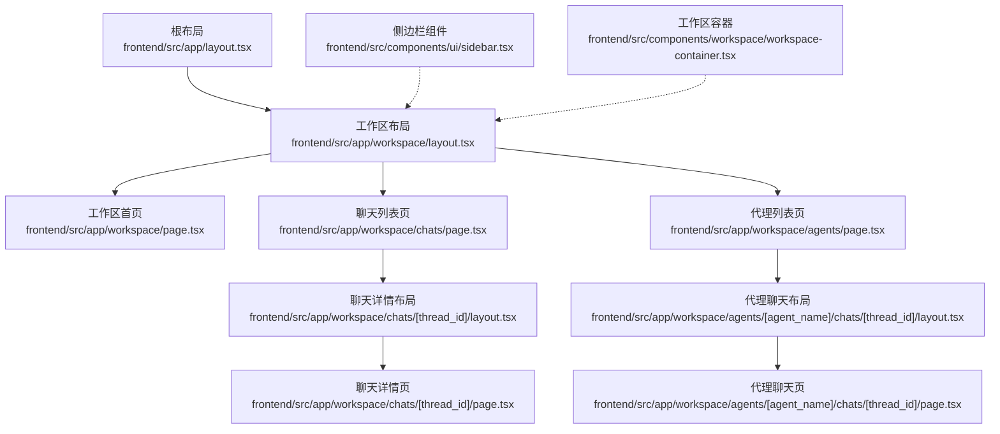
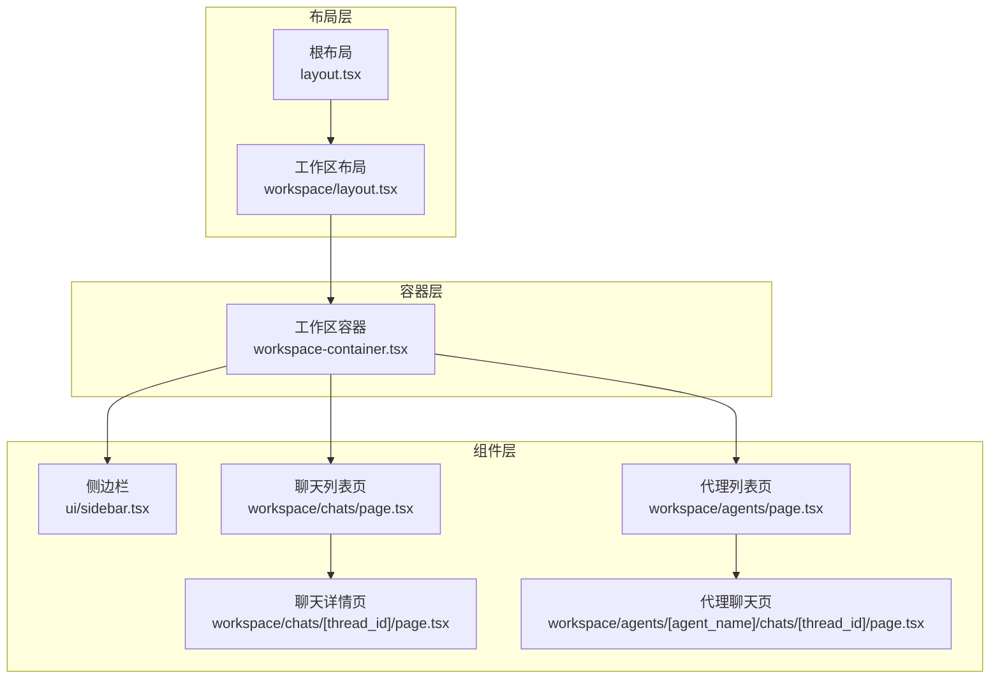
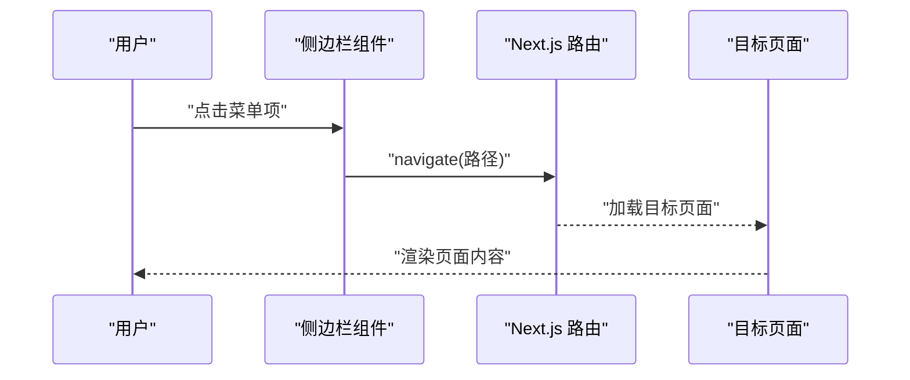
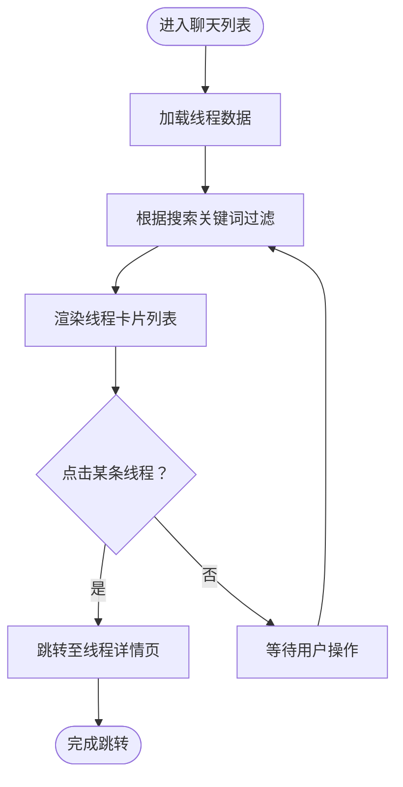
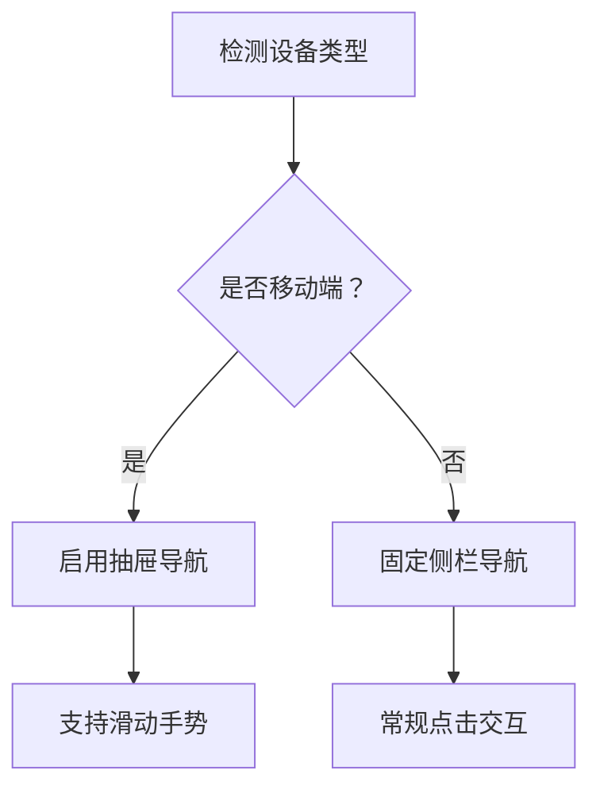
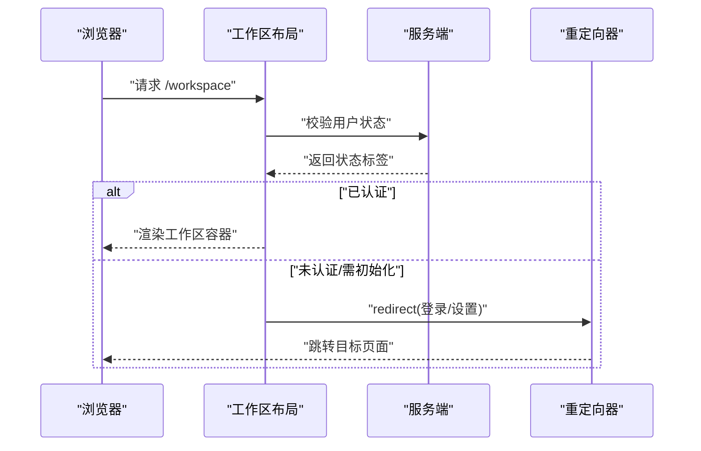
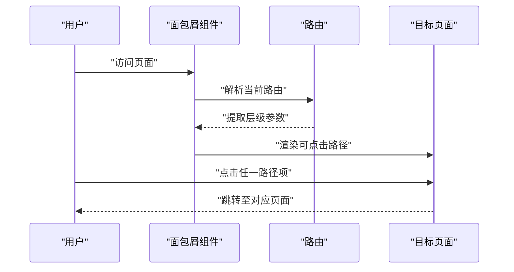
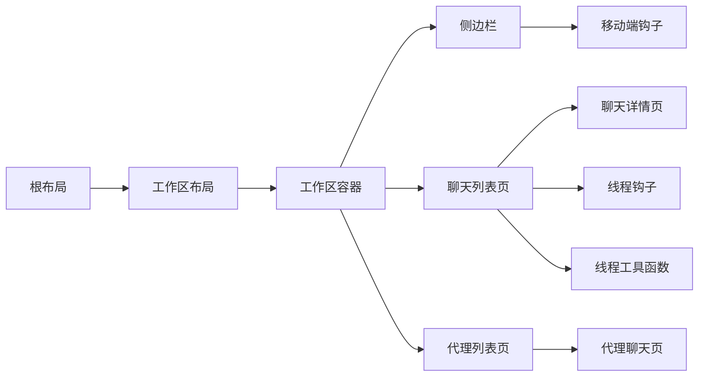

# 导航系统

<cite>
**本文引用的文件**
- [frontend/src/app/layout.tsx](file://frontend/src/app/layout.tsx)
- [frontend/src/app/workspace/layout.tsx](file://frontend/src/app/workspace/layout.tsx)
- [frontend/src/app/workspace/page.tsx](file://frontend/src/app/workspace/page.tsx)
- [frontend/src/app/workspace/chats/page.tsx](file://frontend/src/app/workspace/chats/page.tsx)
- [frontend/src/app/workspace/agents/page.tsx](file://frontend/src/app/workspace/agents/page.tsx)
- [frontend/src/app/workspace/agents/[agent_name]/chats/[thread_id]/layout.tsx](file://frontend/src/app/workspace/agents/[agent_name]/chats/[thread_id]/layout.tsx)
- [frontend/src/app/workspace/agents/[agent_name]/chats/[thread_id]/page.tsx](file://frontend/src/app/workspace/agents/[agent_name]/chats/[thread_id]/page.tsx)
- [frontend/src/app/workspace/chats/[thread_id]/layout.tsx](file://frontend/src/app/workspace/chats/[thread_id]/layout.tsx)
- [frontend/src/app/workspace/chats/[thread_id]/page.tsx](file://frontend/src/app/workspace/chats/[thread_id]/page.tsx)
- [frontend/src/components/ui/sidebar.tsx](file://frontend/src/components/ui/sidebar.tsx)
- [frontend/src/components/workspace/workspace-container.tsx](file://frontend/src/components/workspace/workspace-container.tsx)
- [frontend/src/core/threads/hooks.ts](file://frontend/src/core/threads/hooks.ts)
- [frontend/src/core/threads/utils.ts](file://frontend/src/core/threads/utils.ts)
- [frontend/src/hooks/use-mobile.ts](file://frontend/src/hooks/use-mobile.ts)
- [frontend/src/components/landing/header.tsx](file://frontend/src/components/landing/header.tsx)
</cite>

## 目录
1. [简介](#简介)
2. [项目结构](#项目结构)
3. [核心组件](#核心组件)
4. [架构总览](#架构总览)
5. [详细组件分析](#详细组件分析)
6. [依赖关系分析](#依赖关系分析)
7. [性能考虑](#性能考虑)
8. [故障排除指南](#故障排除指南)
9. [结论](#结论)
10. [附录](#附录)

## 简介
本技术文档聚焦 DeerFlow 前端导航系统，围绕主导航菜单、聊天列表导航与移动端适配展开，系统性阐述导航状态管理、路由跳转逻辑与面包屑导航机制；并从响应式设计、动画效果与用户体验优化角度给出实现要点与最佳实践，最后提供可扩展的定制指南。

## 项目结构
导航系统主要位于 Next.js App Router 的 workspace 路由下，采用嵌套路由组织页面与布局，配合工作区容器组件与侧边栏组件实现统一的导航体验。根布局负责主题与国际化上下文注入；工作区布局负责鉴权与重定向；聊天列表页负责线程检索与筛选；代理与线程详情页负责深度导航与面包屑生成。

图示来源
- [frontend/src/app/layout.tsx:15-28](file://frontend/src/app/layout.tsx#L15-L28)
- [frontend/src/app/workspace/layout.tsx:12-60](file://frontend/src/app/workspace/layout.tsx#L12-L60)
- [frontend/src/app/workspace/page.tsx:8-20](file://frontend/src/app/workspace/page.tsx#L8-L20)
- [frontend/src/app/workspace/chats/page.tsx:18-71](file://frontend/src/app/workspace/chats/page.tsx#L18-L71)
- [frontend/src/app/workspace/agents/page.tsx:1-6](file://frontend/src/app/workspace/agents/page.tsx#L1-L6)
- [frontend/src/app/workspace/chats/[thread_id]/layout.tsx](file://frontend/src/app/workspace/chats/[thread_id]/layout.tsx)
- [frontend/src/app/workspace/chats/[thread_id]/page.tsx](file://frontend/src/app/workspace/chats/[thread_id]/page.tsx)
- [frontend/src/app/workspace/agents/[agent_name]/chats/[thread_id]/layout.tsx](file://frontend/src/app/workspace/agents/[agent_name]/chats/[thread_id]/layout.tsx)
- [frontend/src/app/workspace/agents/[agent_name]/chats/[thread_id]/page.tsx](file://frontend/src/app/workspace/agents/[agent_name]/chats/[thread_id]/page.tsx)
- [frontend/src/components/ui/sidebar.tsx](file://frontend/src/components/ui/sidebar.tsx)
- [frontend/src/components/workspace/workspace-container.tsx](file://frontend/src/components/workspace/workspace-container.tsx)

章节来源
- [frontend/src/app/layout.tsx:15-28](file://frontend/src/app/layout.tsx#L15-L28)
- [frontend/src/app/workspace/layout.tsx:12-60](file://frontend/src/app/workspace/layout.tsx#L12-L60)
- [frontend/src/app/workspace/page.tsx:8-20](file://frontend/src/app/workspace/page.tsx#L8-L20)
- [frontend/src/app/workspace/chats/page.tsx:18-71](file://frontend/src/app/workspace/chats/page.tsx#L18-L71)
- [frontend/src/app/workspace/agents/page.tsx:1-6](file://frontend/src/app/workspace/agents/page.tsx#L1-L6)

## 核心组件
- 主布局与上下文：根布局注入主题与国际化上下文，确保导航在全站范围内保持一致的外观与语言环境。
- 工作区布局：负责鉴权状态判断与路由重定向（未登录跳转登录、需初始化跳转设置），并在认证通过后渲染工作区容器与子页面。
- 工作区容器：封装统一的头部、主体与侧边区域，作为导航与内容的承载层。
- 侧边栏组件：提供主导航菜单与移动端抽屉交互，支持折叠/展开与响应式断点切换。
- 聊天列表页：展示线程列表，支持搜索过滤，并通过链接跳转到具体线程详情页。
- 代理与线程详情页：提供代理维度的聊天入口与线程详情展示，形成“代理 → 聊天 → 会话”的三级导航链路。
- 移动端适配钩子：通过媒体查询与断点检测，自动切换移动端交互模式（如抽屉式导航）。

章节来源
- [frontend/src/app/layout.tsx:15-28](file://frontend/src/app/layout.tsx#L15-L28)
- [frontend/src/app/workspace/layout.tsx:12-60](file://frontend/src/app/workspace/layout.tsx#L12-L60)
- [frontend/src/components/workspace/workspace-container.tsx](file://frontend/src/components/workspace/workspace-container.tsx)
- [frontend/src/components/ui/sidebar.tsx](file://frontend/src/components/ui/sidebar.tsx)
- [frontend/src/app/workspace/chats/page.tsx:18-71](file://frontend/src/app/workspace/chats/page.tsx#L18-L71)
- [frontend/src/app/workspace/agents/page.tsx:1-6](file://frontend/src/app/workspace/agents/page.tsx#L1-L6)
- [frontend/src/hooks/use-mobile.ts:1-200](file://frontend/src/hooks/use-mobile.ts#L1-L200)

## 架构总览
导航系统采用“布局-容器-组件”分层架构：
- 布局层：App Router 的嵌套布局负责权限校验与页面骨架装配。
- 容器层：工作区容器提供统一的栅格与间距规范，承载导航与内容。
- 组件层：侧边栏、聊天列表、线程详情等组件按职责拆分，通过路由参数与状态管理协同工作。

图示来源
- [frontend/src/app/layout.tsx:15-28](file://frontend/src/app/layout.tsx#L15-L28)
- [frontend/src/app/workspace/layout.tsx:12-60](file://frontend/src/app/workspace/layout.tsx#L12-L60)
- [frontend/src/components/workspace/workspace-container.tsx](file://frontend/src/components/workspace/workspace-container.tsx)
- [frontend/src/components/ui/sidebar.tsx](file://frontend/src/components/ui/sidebar.tsx)
- [frontend/src/app/workspace/chats/page.tsx:18-71](file://frontend/src/app/workspace/chats/page.tsx#L18-L71)
- [frontend/src/app/workspace/agents/page.tsx:1-6](file://frontend/src/app/workspace/agents/page.tsx#L1-L6)
- [frontend/src/app/workspace/chats/[thread_id]/page.tsx](file://frontend/src/app/workspace/chats/[thread_id]/page.tsx)
- [frontend/src/app/workspace/agents/[agent_name]/chats/[thread_id]/page.tsx](file://frontend/src/app/workspace/agents/[agent_name]/chats/[thread_id]/page.tsx)

## 详细组件分析

### 主导航菜单与侧边栏
- 功能职责：主导航菜单承载“聊天列表”“代理列表”等一级入口；移动端以抽屉形式呈现，支持手势滑动与遮罩点击关闭。
- 交互机制：通过状态控制展开/收起；在小屏设备自动切换为抽屉模式；点击菜单项触发路由跳转。
- 响应式策略：结合移动端断点检测，动态调整菜单宽度与图标密度，保证在窄屏下的可用性。
- 动画效果：抽屉展开/收起使用过渡动画，菜单项悬停与选中态提供视觉反馈。

图示来源
- [frontend/src/components/ui/sidebar.tsx](file://frontend/src/components/ui/sidebar.tsx)
- [frontend/src/app/workspace/chats/page.tsx:50-62](file://frontend/src/app/workspace/chats/page.tsx#L50-L62)
- [frontend/src/app/workspace/agents/page.tsx:1-6](file://frontend/src/app/workspace/agents/page.tsx#L1-L6)

章节来源
- [frontend/src/components/ui/sidebar.tsx](file://frontend/src/components/ui/sidebar.tsx)
- [frontend/src/hooks/use-mobile.ts:1-200](file://frontend/src/hooks/use-mobile.ts#L1-L200)

### 聊天列表导航
- 数据来源：通过线程钩子拉取线程数据，支持本地搜索过滤，提升大列表场景下的交互效率。
- 跳转逻辑：每个线程卡片映射到对应线程详情页的路由，点击即进入会话。
- 搜索与排序：输入框实时过滤标题，时间戳用于辅助排序与最近更新提示。
- 性能优化：使用记忆化计算过滤结果，避免重复渲染。

图示来源
- [frontend/src/app/workspace/chats/page.tsx:18-71](file://frontend/src/app/workspace/chats/page.tsx#L18-L71)
- [frontend/src/core/threads/hooks.ts](file://frontend/src/core/threads/hooks.ts)
- [frontend/src/core/threads/utils.ts](file://frontend/src/core/threads/utils.ts)

章节来源
- [frontend/src/app/workspace/chats/page.tsx:18-71](file://frontend/src/app/workspace/chats/page.tsx#L18-L71)
- [frontend/src/core/threads/hooks.ts](file://frontend/src/core/threads/hooks.ts)
- [frontend/src/core/threads/utils.ts](file://frontend/src/core/threads/utils.ts)

### 移动端适配与交互
- 断点策略：通过移动端钩子检测设备类型与屏幕尺寸，自动切换导航模式（抽屉 vs 固定侧栏）。
- 手势支持：移动端抽屉支持滑动手势打开/关闭，提升自然交互体验。
- 视口适配：在窄屏下优先显示主要内容，减少导航占用空间。

图示来源
- [frontend/src/hooks/use-mobile.ts:1-200](file://frontend/src/hooks/use-mobile.ts#L1-L200)
- [frontend/src/components/ui/sidebar.tsx](file://frontend/src/components/ui/sidebar.tsx)

章节来源
- [frontend/src/hooks/use-mobile.ts:1-200](file://frontend/src/hooks/use-mobile.ts#L1-L200)
- [frontend/src/components/ui/sidebar.tsx](file://frontend/src/components/ui/sidebar.tsx)

### 导航状态管理与路由跳转
- 鉴权与重定向：工作区布局根据服务端返回的鉴权结果进行分支处理，未登录或需要初始化时自动跳转对应页面。
- 首页引导：工作区首页根据环境变量与演示数据决定默认跳转目标（演示模式选择首个线程或新建线程）。
- 参数化路由：聊天详情与代理聊天详情均使用动态路由参数，保证导航链路的可追踪性与可分享性。

图示来源
- [frontend/src/app/workspace/layout.tsx:17-29](file://frontend/src/app/workspace/layout.tsx#L17-L29)
- [frontend/src/app/workspace/page.tsx:8-20](file://frontend/src/app/workspace/page.tsx#L8-L20)

章节来源
- [frontend/src/app/workspace/layout.tsx:17-29](file://frontend/src/app/workspace/layout.tsx#L17-L29)
- [frontend/src/app/workspace/page.tsx:8-20](file://frontend/src/app/workspace/page.tsx#L8-L20)

### 面包屑导航系统
- 生成规则：基于当前路由层级与资源标识（如线程 ID、代理名称）动态拼接面包屑路径。
- 可访问性：每个面包屑项均为可点击链接，支持快速返回上一级或直达目标页面。
- 多级链路：支持“工作区 → 聊天/代理 → 会话”的三级链路，清晰表达当前位置与上下文。

图示来源
- [frontend/src/app/workspace/chats/[thread_id]/layout.tsx](file://frontend/src/app/workspace/chats/[thread_id]/layout.tsx)
- [frontend/src/app/workspace/agents/[agent_name]/chats/[thread_id]/layout.tsx](file://frontend/src/app/workspace/agents/[agent_name]/chats/[thread_id]/layout.tsx)

章节来源
- [frontend/src/app/workspace/chats/[thread_id]/layout.tsx](file://frontend/src/app/workspace/chats/[thread_id]/layout.tsx)
- [frontend/src/app/workspace/agents/[agent_name]/chats/[thread_id]/layout.tsx](file://frontend/src/app/workspace/agents/[agent_name]/chats/[thread_id]/layout.tsx)

## 依赖关系分析
- 布局依赖：根布局为全局上下文提供者，工作区布局依赖鉴权服务与重定向能力。
- 页面依赖：聊天列表页依赖线程钩子与工具函数；详情页依赖动态路由参数与面包屑布局。
- 组件依赖：侧边栏组件与工作区容器解耦，通过 props 传递交互状态；移动端钩子独立于导航逻辑，仅影响 UI 行为。

图示来源
- [frontend/src/app/layout.tsx:15-28](file://frontend/src/app/layout.tsx#L15-L28)
- [frontend/src/app/workspace/layout.tsx:12-60](file://frontend/src/app/workspace/layout.tsx#L12-L60)
- [frontend/src/components/workspace/workspace-container.tsx](file://frontend/src/components/workspace/workspace-container.tsx)
- [frontend/src/components/ui/sidebar.tsx](file://frontend/src/components/ui/sidebar.tsx)
- [frontend/src/app/workspace/chats/page.tsx:18-71](file://frontend/src/app/workspace/chats/page.tsx#L18-L71)
- [frontend/src/app/workspace/agents/page.tsx:1-6](file://frontend/src/app/workspace/agents/page.tsx#L1-L6)
- [frontend/src/core/threads/hooks.ts](file://frontend/src/core/threads/hooks.ts)
- [frontend/src/core/threads/utils.ts](file://frontend/src/core/threads/utils.ts)
- [frontend/src/hooks/use-mobile.ts:1-200](file://frontend/src/hooks/use-mobile.ts#L1-L200)

章节来源
- [frontend/src/app/workspace/chats/page.tsx:18-71](file://frontend/src/app/workspace/chats/page.tsx#L18-L71)
- [frontend/src/core/threads/hooks.ts](file://frontend/src/core/threads/hooks.ts)
- [frontend/src/core/threads/utils.ts](file://frontend/src/core/threads/utils.ts)
- [frontend/src/hooks/use-mobile.ts:1-200](file://frontend/src/hooks/use-mobile.ts#L1-L200)

## 性能考虑
- 列表渲染优化：聊天列表页使用过滤后的线程数组与记忆化计算，避免不必要的重渲染。
- 路由懒加载：Next.js 动态路由按需加载页面组件，减少初始包体积。
- 服务端鉴权：工作区布局在服务端完成鉴权与重定向，避免客户端无谓的渲染与网络请求。
- 响应式切换：移动端断点检测仅在组件挂载时执行一次，后续通过事件监听更新，降低频繁计算成本。

## 故障排除指南
- 登录态异常导致无法进入工作区：检查工作区布局中的鉴权分支与重定向逻辑，确认服务端返回的状态标签正确。
- 聊天列表空白：确认线程钩子已成功拉取数据，检查过滤条件与空值处理。
- 移动端抽屉不响应：检查移动端钩子的断点配置与事件绑定，确保触摸事件未被其他元素拦截。
- 面包屑链接失效：核对动态路由参数与面包屑生成逻辑，确保路径拼接正确且可解析。

章节来源
- [frontend/src/app/workspace/layout.tsx:17-29](file://frontend/src/app/workspace/layout.tsx#L17-L29)
- [frontend/src/app/workspace/chats/page.tsx:18-71](file://frontend/src/app/workspace/chats/page.tsx#L18-L71)
- [frontend/src/hooks/use-mobile.ts:1-200](file://frontend/src/hooks/use-mobile.ts#L1-L200)

## 结论
DeerFlow 导航系统以 App Router 的嵌套布局为基础，结合工作区容器与侧边栏组件，实现了从主导航到聊天列表再到详情页的完整导航链路。通过服务端鉴权、动态路由与移动端适配，系统在可用性与性能之间取得平衡。面包屑导航进一步增强了多层级页面的可发现性与可回溯性。

## 附录
- 定制指南
  - 新增主导航项：在侧边栏组件中添加菜单项，确保路由路径与页面组件匹配。
  - 扩展面包屑：在对应布局中解析路由参数并生成路径片段，保持与页面层级一致。
  - 移动端优化：复用移动端钩子，确保抽屉交互与手势支持符合平台规范。
  - 性能优化：对长列表使用虚拟滚动与分页；对路由跳转使用预加载策略；对静态资源启用 CDN 与缓存。
- 扩展方法
  - 多语言支持：在导航文案处使用国际化钩子，确保不同语言下的文案与排版。
  - 权限控制：在工作区布局中增加细粒度权限校验，限制不可见或不可访问的导航项。
  - 搜索增强：在聊天列表页引入更丰富的筛选条件（时间范围、标签等），并持久化搜索状态。