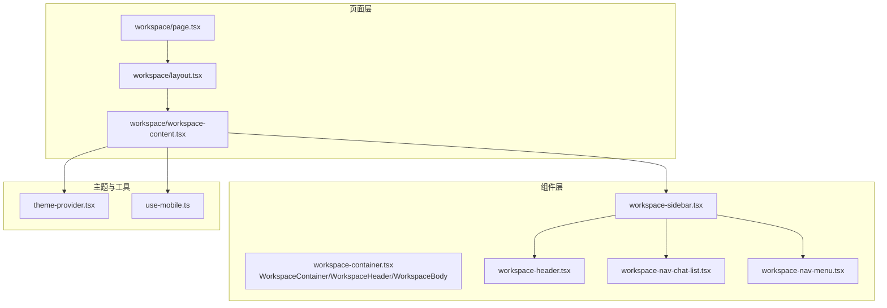
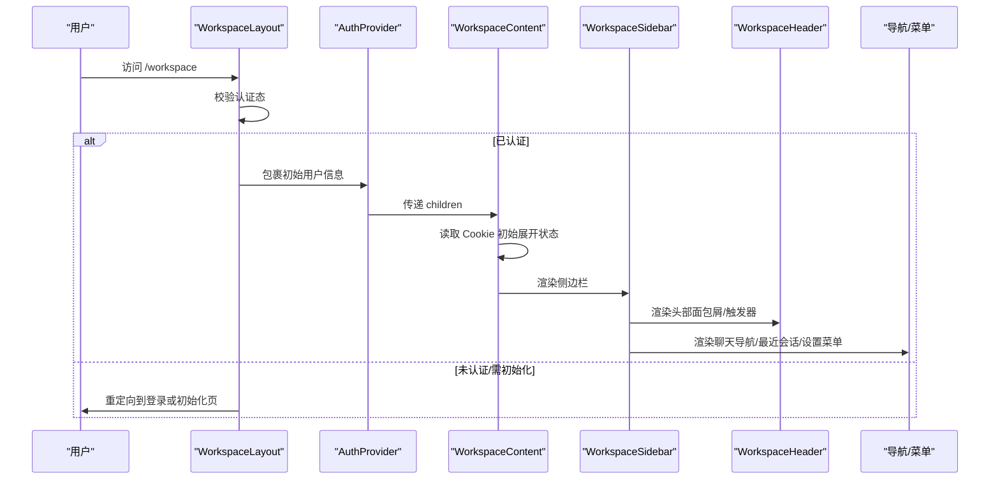
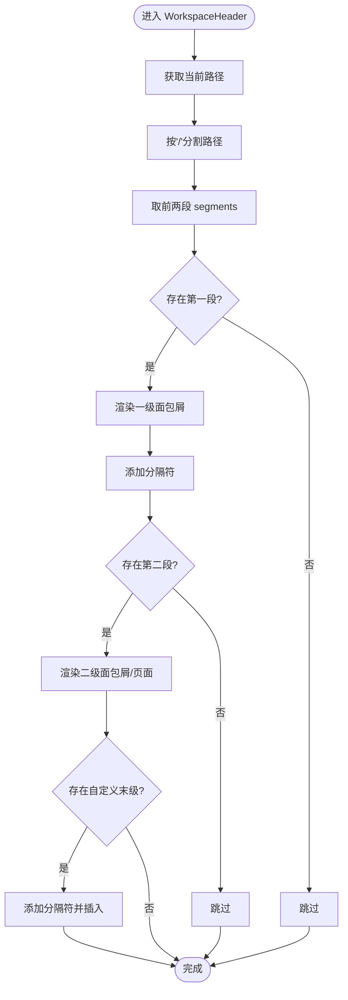
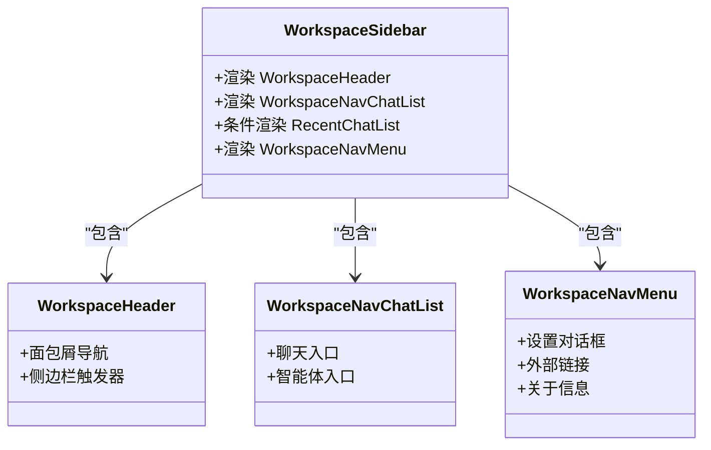
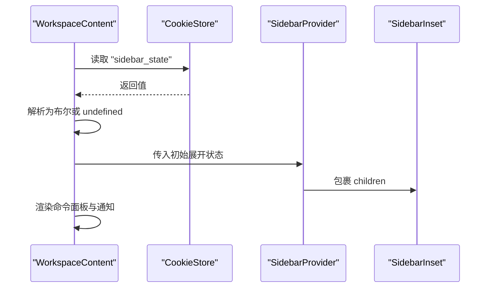
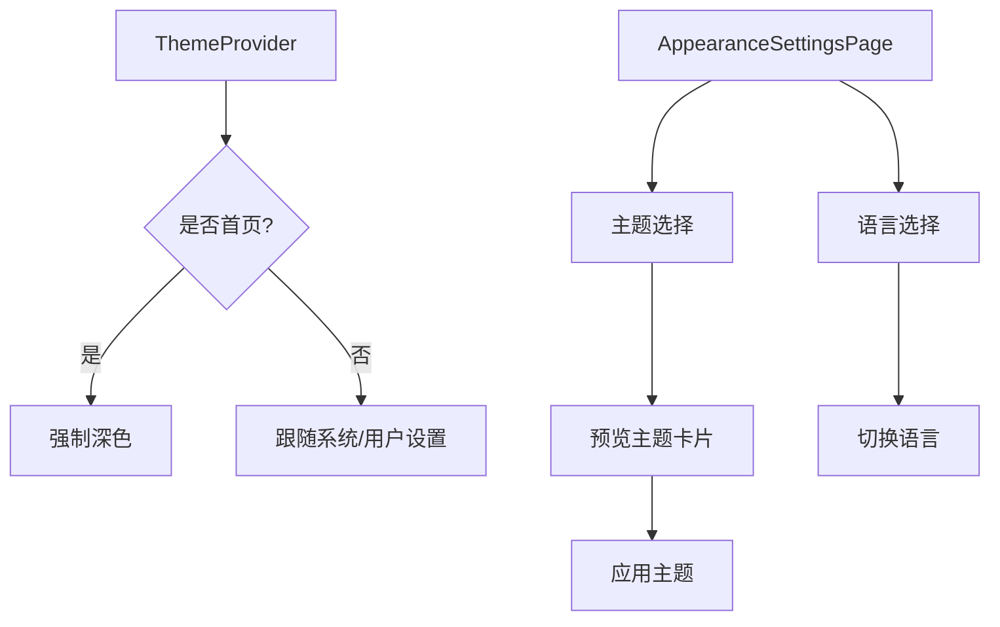
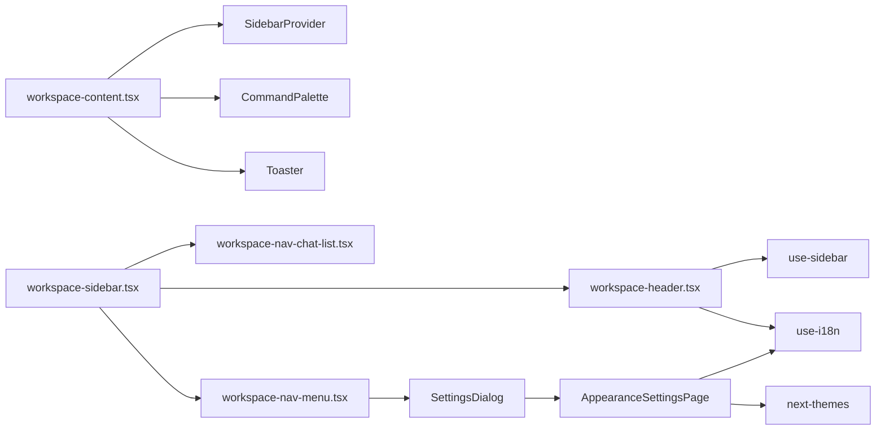

# 工作区布局系统

<cite>
**本文引用的文件**
- [workspace/layout.tsx](file://frontend/src/app/workspace/layout.tsx)
- [workspace/page.tsx](file://frontend/src/app/workspace/page.tsx)
- [workspace/workspace-content.tsx](file://frontend/src/app/workspace/workspace-content.tsx)
- [workspace/workspace-container.tsx](file://frontend/src/components/workspace/workspace-container.tsx)
- [workspace/workspace-header.tsx](file://frontend/src/components/workspace/workspace-header.tsx)
- [workspace/workspace-sidebar.tsx](file://frontend/src/components/workspace/workspace-sidebar.tsx)
- [workspace/workspace-nav-chat-list.tsx](file://frontend/src/components/workspace/workspace-nav-chat-list.tsx)
- [workspace/workspace-nav-menu.tsx](file://frontend/src/components/workspace/workspace-nav-menu.tsx)
- [workspace/settings/appearance-settings-page.tsx](file://frontend/src/components/workspace/settings/appearance-settings-page.tsx)
- [theme-provider.tsx](file://frontend/src/components/theme-provider.tsx)
- [use-mobile.ts](file://frontend/src/hooks/use-mobile.ts)
</cite>

## 目录
1. [简介](#简介)
2. [项目结构](#项目结构)
3. [核心组件](#核心组件)
4. [架构总览](#架构总览)
5. [详细组件分析](#详细组件分析)
6. [依赖关系分析](#依赖关系分析)
7. [性能考量](#性能考量)
8. [故障排查指南](#故障排查指南)
9. [结论](#结论)
10. [附录](#附录)

## 简介
本技术文档聚焦 DeerFlow 工作区布局系统，系统性阐述 WorkspaceContainer、WorkspaceHeader、WorkspaceSidebar 与 WorkspaceContent 的整体架构、职责分工与协作方式。文档覆盖响应式布局实现、面包屑导航系统、头部工具栏与侧边栏导航的交互逻辑，以及布局组件的组合模式、样式系统与主题适配机制，并提供布局定制与组件扩展的方法指导。

## 项目结构
工作区布局位于前端应用的 workspace 路由下，采用“页面层 + 组件层”的分层组织方式：
- 页面层：负责认证态校验、重定向与根布局包裹
- 组件层：提供可复用的容器、头部、侧边栏与导航等 UI 组件
- 主题与国际化：通过 Provider 与 hooks 实现全局主题与多语言支持

图表来源
- [workspace/layout.tsx:12-60](file://frontend/src/app/workspace/layout.tsx#L12-L60)
- [workspace/page.tsx:8-20](file://frontend/src/app/workspace/page.tsx#L8-L20)
- [workspace/workspace-content.tsx:17-35](file://frontend/src/app/workspace/workspace-content.tsx#L17-L35)
- [workspace/workspace-container.tsx:21-125](file://frontend/src/components/workspace/workspace-container.tsx#L21-L125)
- [workspace/workspace-header.tsx:18-67](file://frontend/src/components/workspace/workspace-header.tsx#L18-L67)
- [workspace/workspace-sidebar.tsx:17-38](file://frontend/src/components/workspace/workspace-sidebar.tsx#L17-L38)
- [workspace/workspace-nav-chat-list.tsx:15-43](file://frontend/src/components/workspace/workspace-nav-chat-list.tsx#L15-L43)
- [workspace/workspace-nav-menu.tsx:53-160](file://frontend/src/components/workspace/workspace-nav-menu.tsx#L53-L160)
- [theme-provider.tsx:6-19](file://frontend/src/components/theme-provider.tsx#L6-L19)
- [use-mobile.ts:5-21](file://frontend/src/hooks/use-mobile.ts#L5-L21)

章节来源
- [workspace/layout.tsx:12-60](file://frontend/src/app/workspace/layout.tsx#L12-L60)
- [workspace/page.tsx:8-20](file://frontend/src/app/workspace/page.tsx#L8-L20)
- [workspace/workspace-content.tsx:17-35](file://frontend/src/app/workspace/workspace-content.tsx#L17-L35)

## 核心组件
- WorkspaceContainer：提供全屏容器骨架，承载子组件树
- WorkspaceHeader：集成面包屑导航与侧边栏触发器，支持折叠态显示
- WorkspaceSidebar：封装侧边栏容器，内含头部、聊天导航、最近会话列表与菜单
- WorkspaceContent：工作区内容区，负责侧边栏状态初始化、命令面板与通知提示

章节来源
- [workspace/workspace-container.tsx:21-125](file://frontend/src/components/workspace/workspace-container.tsx#L21-L125)
- [workspace/workspace-header.tsx:18-67](file://frontend/src/components/workspace/workspace-header.tsx#L18-L67)
- [workspace/workspace-sidebar.tsx:17-38](file://frontend/src/components/workspace/workspace-sidebar.tsx#L17-L38)
- [workspace/workspace-content.tsx:17-35](file://frontend/src/app/workspace/workspace-content.tsx#L17-L35)

## 架构总览
工作区布局采用“Provider + 组合组件”的模式：
- 顶层 Layout 负责认证态与兜底重定向
- WorkspaceContent 初始化侧边栏状态并注入 Provider
- WorkspaceSidebar 内部组合 WorkspaceHeader、导航列表与菜单
- WorkspaceHeader 内置面包屑导航与侧边栏触发器
- 主题与国际化通过独立 Provider 注入

图表来源
- [workspace/layout.tsx:17-30](file://frontend/src/app/workspace/layout.tsx#L17-L30)
- [workspace/workspace-content.tsx:9-23](file://frontend/src/app/workspace/workspace-content.tsx#L9-L23)
- [workspace/workspace-sidebar.tsx:17-38](file://frontend/src/components/workspace/workspace-sidebar.tsx#L17-L38)
- [workspace/workspace-header.tsx:18-67](file://frontend/src/components/workspace/workspace-header.tsx#L18-L67)

## 详细组件分析

### WorkspaceContainer 与 WorkspaceHeader
- 容器职责：统一屏幕尺寸与布局方向，作为布局根节点
- 头部职责：在折叠态与展开态分别渲染不同内容；内置面包屑导航，基于路径段动态生成层级；右侧提供 GitHub 链接与悬浮提示
- 面包屑逻辑：解析当前路径，取前两段作为一级与二级导航项，支持自定义末级插槽

图表来源
- [workspace/workspace-container.tsx:33-106](file://frontend/src/components/workspace/workspace-container.tsx#L33-L106)

章节来源
- [workspace/workspace-container.tsx:21-136](file://frontend/src/components/workspace/workspace-container.tsx#L21-L136)
- [workspace/workspace-header.tsx:18-67](file://frontend/src/components/workspace/workspace-header.tsx#L18-L67)

### WorkspaceSidebar 与导航体系
- WorkspaceSidebar：封装侧边栏容器，内部组合 WorkspaceHeader、聊天导航列表、最近会话列表与菜单
- WorkspaceNavChatList：提供“聊天”“智能体”入口，基于当前路径高亮
- WorkspaceNavMenu：提供设置、官网、GitHub、问题反馈、联系邮箱、关于等入口，支持折叠态图标按钮

图表来源
- [workspace/workspace-sidebar.tsx:17-38](file://frontend/src/components/workspace/workspace-sidebar.tsx#L17-L38)
- [workspace/workspace-header.tsx:18-67](file://frontend/src/components/workspace/workspace-header.tsx#L18-L67)
- [workspace/workspace-nav-chat-list.tsx:15-43](file://frontend/src/components/workspace/workspace-nav-chat-list.tsx#L15-L43)
- [workspace/workspace-nav-menu.tsx:53-160](file://frontend/src/components/workspace/workspace-nav-menu.tsx#L53-L160)

章节来源
- [workspace/workspace-sidebar.tsx:17-38](file://frontend/src/components/workspace/workspace-sidebar.tsx#L17-L38)
- [workspace/workspace-nav-chat-list.tsx:15-43](file://frontend/src/components/workspace/workspace-nav-chat-list.tsx#L15-L43)
- [workspace/workspace-nav-menu.tsx:53-160](file://frontend/src/components/workspace/workspace-nav-menu.tsx#L53-L160)

### WorkspaceContent 与侧边栏状态管理
- 作用：初始化 SidebarProvider，读取 Cookie 决定初始展开状态；渲染命令面板与通知提示
- Cookie 解析：支持 true/false 字符串转换为布尔值，缺失时使用默认值

图表来源
- [workspace/workspace-content.tsx:9-35](file://frontend/src/app/workspace/workspace-content.tsx#L9-L35)

章节来源
- [workspace/workspace-content.tsx:17-35](file://frontend/src/app/workspace/workspace-content.tsx#L17-L35)

### 响应式布局与移动端适配
- 移动端断点：以 768px 为阈值，使用媒体查询监听窗口宽度变化，返回布尔值
- 侧边栏行为：结合 use-sidebar 状态与移动端断点，控制侧边栏折叠/展开与头部内容切换

章节来源
- [use-mobile.ts:5-21](file://frontend/src/hooks/use-mobile.ts#L5-L21)

### 主题适配与外观设置
- 主题提供者：在首页强制深色主题，其他页面跟随系统/用户选择
- 外观设置页：提供主题（系统/浅色/深色）与语言（中/英）选择，实时预览主题效果

图表来源
- [theme-provider.tsx:6-19](file://frontend/src/components/theme-provider.tsx#L6-L19)
- [workspace/settings/appearance-settings-page.tsx:26-111](file://frontend/src/components/workspace/settings/appearance-settings-page.tsx#L26-L111)

章节来源
- [theme-provider.tsx:6-19](file://frontend/src/components/theme-provider.tsx#L6-L19)
- [workspace/settings/appearance-settings-page.tsx:26-159](file://frontend/src/components/workspace/settings/appearance-settings-page.tsx#L26-L159)

### 页面入口与重定向逻辑
- 入口页：根据环境变量决定静态演示场景，优先跳转到第一个演示线程，否则跳转到新建聊天页
- 工作区布局：根据认证态进行重定向，未认证则跳转登录，需要初始化则跳转初始化页

章节来源
- [workspace/page.tsx:8-20](file://frontend/src/app/workspace/page.tsx#L8-L20)
- [workspace/layout.tsx:17-30](file://frontend/src/app/workspace/layout.tsx#L17-L30)

## 依赖关系分析
- 组件耦合：WorkspaceSidebar 组合多个子组件，职责清晰；WorkspaceHeader 依赖 use-sidebar 与 use-i18n；WorkspaceNavMenu 依赖设置对话框与国际化
- 外部依赖：next-themes 提供主题切换；next/navigation 提供路由与导航；lucide-react 提供图标；sonner 提供通知提示
- 状态管理：SidebarProvider 管理侧边栏状态；CookieStore 用于持久化展开状态；use-theme 与 use-i18n 管理主题与语言

图表来源
- [workspace/workspace-content.tsx:25-35](file://frontend/src/app/workspace/workspace-content.tsx#L25-L35)
- [workspace/workspace-sidebar.tsx:17-38](file://frontend/src/components/workspace/workspace-sidebar.tsx#L17-L38)
- [workspace/workspace-header.tsx:18-67](file://frontend/src/components/workspace/workspace-header.tsx#L18-L67)
- [workspace/workspace-nav-chat-list.tsx:15-43](file://frontend/src/components/workspace/workspace-nav-chat-list.tsx#L15-L43)
- [workspace/workspace-nav-menu.tsx:53-160](file://frontend/src/components/workspace/workspace-nav-menu.tsx#L53-L160)
- [workspace/settings/appearance-settings-page.tsx:26-111](file://frontend/src/components/workspace/settings/appearance-settings-page.tsx#L26-L111)

## 性能考量
- 按需渲染：侧边栏折叠时延迟渲染最近会话列表，减少首屏渲染压力
- 路由与状态：useMemo 用于面包屑名称计算，避免重复计算；useEffect 仅在挂载后更新设置对话框状态
- 主题与国际化：主题切换与语言切换均为轻量操作，建议在设置页集中处理，避免频繁重渲染

## 故障排查指南
- 无法进入工作区
  - 检查认证态与重定向逻辑，确认是否被重定向至登录或初始化页
  - 参考路径：[workspace/layout.tsx:17-30](file://frontend/src/app/workspace/layout.tsx#L17-L30)
- 侧边栏不显示或无法展开
  - 检查 Cookie 是否正确写入 "sidebar_state"，确认 WorkspaceContent 的解析逻辑
  - 参考路径：[workspace/workspace-content.tsx:9-23](file://frontend/src/app/workspace/workspace-content.tsx#L9-L23)
- 面包屑不显示或显示异常
  - 检查路径段解析逻辑与国际化键值，确认 segments 是否为空
  - 参考路径：[workspace/workspace-container.tsx:33-106](file://frontend/src/components/workspace/workspace-container.tsx#L33-L106)
- 设置对话框无法打开
  - 检查 mounted 状态与 DropdownMenu 触发器，确认客户端挂载后再渲染
  - 参考路径：[workspace/workspace-nav-menu.tsx:62-64](file://frontend/src/components/workspace/workspace-nav-menu.tsx#L62-L64)

章节来源
- [workspace/layout.tsx:17-30](file://frontend/src/app/workspace/layout.tsx#L17-L30)
- [workspace/workspace-content.tsx:9-23](file://frontend/src/app/workspace/workspace-content.tsx#L9-L23)
- [workspace/workspace-container.tsx:33-106](file://frontend/src/components/workspace/workspace-container.tsx#L33-L106)
- [workspace/workspace-nav-menu.tsx:62-64](file://frontend/src/components/workspace/workspace-nav-menu.tsx#L62-L64)

## 结论
工作区布局系统通过清晰的职责划分与组合模式，实现了可维护、可扩展且具备良好用户体验的布局框架。面包屑导航、头部工具栏与侧边栏导航的协同，配合主题与语言的灵活切换，满足了多场景下的使用需求。后续可在保持现有组合模式的基础上，进一步增强导航扩展能力与主题定制能力。

## 附录

### 布局定制指南
- 新增导航入口
  - 在 WorkspaceNavChatList 中新增菜单项，注意 isActive 判定逻辑
  - 参考路径：[workspace/workspace-nav-chat-list.tsx:15-43](file://frontend/src/components/workspace/workspace-nav-chat-list.tsx#L15-L43)
- 自定义面包屑末级
  - 在 WorkspaceHeader 或其父级容器中传入 children 插槽，即可在面包屑末级插入自定义元素
  - 参考路径：[workspace/workspace-container.tsx:84-89](file://frontend/src/components/workspace/workspace-container.tsx#L84-L89)
- 扩展设置页
  - 在 AppearanceSettingsPage 中新增设置项，使用 useTheme 与 useI18n 进行主题与语言控制
  - 参考路径：[workspace/settings/appearance-settings-page.tsx:26-111](file://frontend/src/components/workspace/settings/appearance-settings-page.tsx#L26-L111)

### 组件扩展方法
- 侧边栏扩展
  - 在 WorkspaceSidebar 的 SidebarContent/SidebarFooter 中插入新的导航或工具组件
  - 参考路径：[workspace/workspace-sidebar.tsx:23-35](file://frontend/src/components/workspace/workspace-sidebar.tsx#L23-L35)
- 头部扩展
  - 在 WorkspaceHeader 中增加工具按钮或快捷入口，注意与侧边栏触发器的布局协调
  - 参考路径：[workspace/workspace-header.tsx:52-64](file://frontend/src/components/workspace/workspace-header.tsx#L52-L64)
- 主题与语言扩展
  - 使用 ThemeProvider 与 AppearanceSettingsPage 的主题/语言选择器，实现更丰富的主题与本地化选项
  - 参考路径：[theme-provider.tsx:6-19](file://frontend/src/components/theme-provider.tsx#L6-L19), [workspace/settings/appearance-settings-page.tsx:26-111](file://frontend/src/components/workspace/settings/appearance-settings-page.tsx#L26-L111)