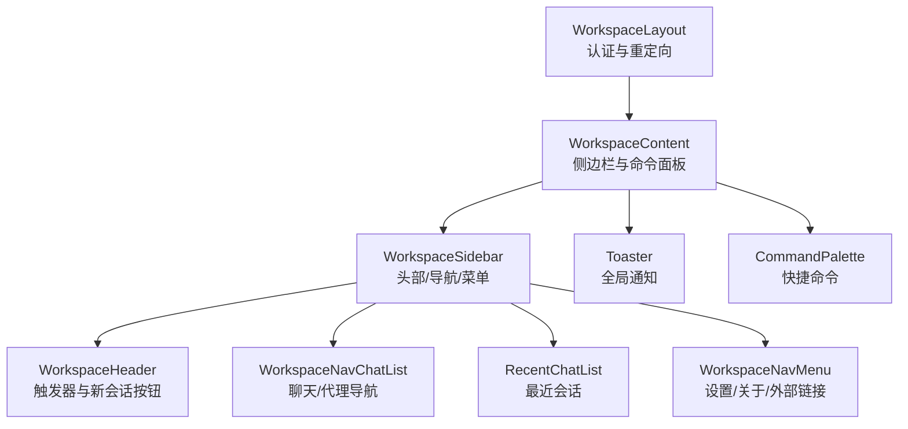
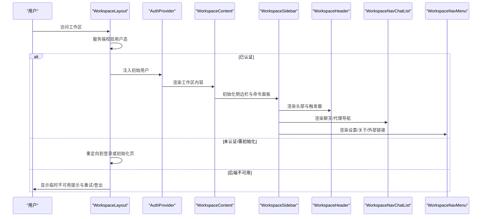
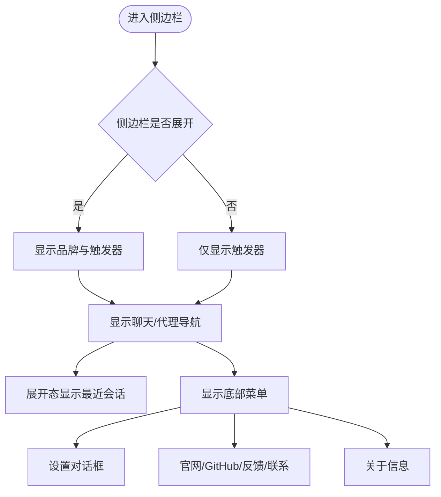
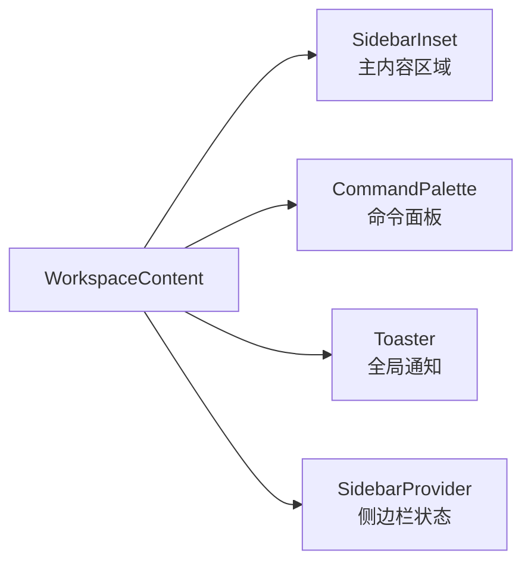
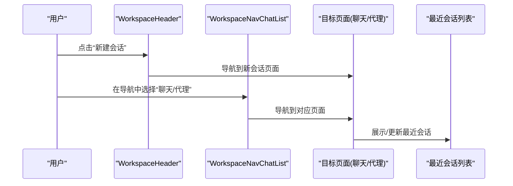
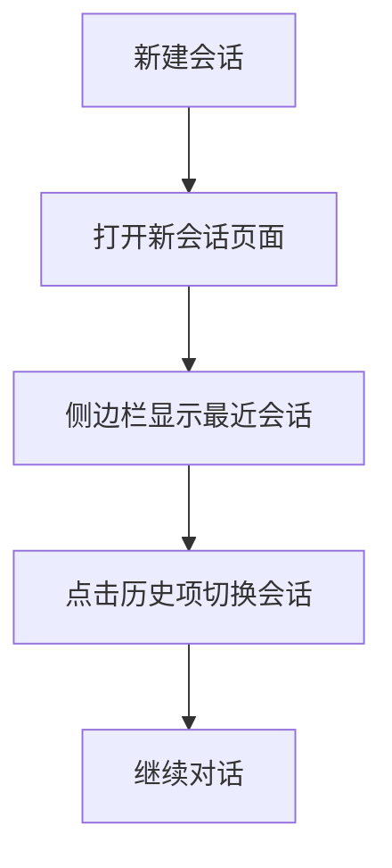
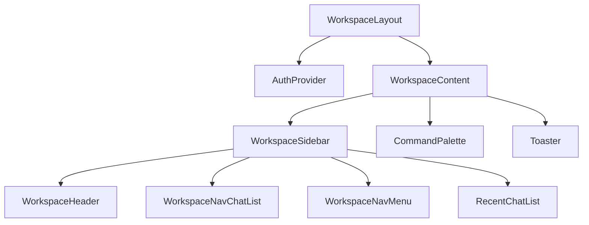

# 工作区管理系统

<cite>
**本文档引用的文件**
- [frontend/src/app/workspace/layout.tsx](file://frontend/src/app/workspace/layout.tsx)
- [frontend/src/app/workspace/workspace-content.tsx](file://frontend/src/app/workspace/workspace-content.tsx)
- [frontend/src/components/workspace/workspace-sidebar.tsx](file://frontend/src/components/workspace/workspace-sidebar.tsx)
- [frontend/src/components/workspace/workspace-header.tsx](file://frontend/src/components/workspace/workspace-header.tsx)
- [frontend/src/components/workspace/workspace-nav-chat-list.tsx](file://frontend/src/components/workspace/workspace-nav-chat-list.tsx)
- [frontend/src/components/workspace/workspace-nav-menu.tsx](file://frontend/src/components/workspace/workspace-nav-menu.tsx)
</cite>

## 目录
1. [简介](#简介)
2. [项目结构](#项目结构)
3. [核心组件](#核心组件)
4. [架构总览](#架构总览)
5. [详细组件分析](#详细组件分析)
6. [依赖关系分析](#依赖关系分析)
7. [性能考虑](#性能考虑)
8. [故障排除指南](#故障排除指南)
9. [结论](#结论)
10. [附录](#附录)

## 简介
本文件面向 DeerFlow 工作区管理系统，聚焦前端工作区的布局设计与交互实现，涵盖侧边栏导航、主内容区域与工具面板的组织结构；同时梳理代理管理与线程管理的实现机制（通过路由与状态驱动）、会话管理与历史记录能力；并说明工作区的状态持久化、主题切换与国际化支持的落地方式。最后提供工作区组件的定制与扩展指南。

## 项目结构
工作区系统以 Next.js App Router 的嵌套路由为基础，采用服务端用户态校验与客户端状态管理相结合的方式组织页面与组件。关键入口与结构如下：
- 布局层：工作区布局负责认证态判定与页面骨架渲染
- 内容层：工作区内容容器负责侧边栏状态、命令面板与全局通知
- 导航层：侧边栏包含头部、聊天导航、最近会话列表与底部菜单
- 国际化与主题：通过 i18n 钩子与环境变量控制文案与外观

图表来源
- [frontend/src/app/workspace/layout.tsx:12-60](file://frontend/src/app/workspace/layout.tsx#L12-L60)
- [frontend/src/app/workspace/workspace-content.tsx:17-35](file://frontend/src/app/workspace/workspace-content.tsx#L17-L35)
- [frontend/src/components/workspace/workspace-sidebar.tsx:17-38](file://frontend/src/components/workspace/workspace-sidebar.tsx#L17-L38)
- [frontend/src/components/workspace/workspace-header.tsx:18-67](file://frontend/src/components/workspace/workspace-header.tsx#L18-L67)
- [frontend/src/components/workspace/workspace-nav-chat-list.tsx:15-43](file://frontend/src/components/workspace/workspace-nav-chat-list.tsx#L15-L43)
- [frontend/src/components/workspace/workspace-nav-menu.tsx:53-160](file://frontend/src/components/workspace/workspace-nav-menu.tsx#L53-L160)

章节来源
- [frontend/src/app/workspace/layout.tsx:12-60](file://frontend/src/app/workspace/layout.tsx#L12-L60)
- [frontend/src/app/workspace/workspace-content.tsx:17-35](file://frontend/src/app/workspace/workspace-content.tsx#L17-L35)

## 核心组件
- 工作区布局（WorkspaceLayout）：基于服务端函数获取当前用户状态，处理已认证、需初始化、未认证与后端不可用等分支，并在认证状态下注入全局 Provider 与工作区内容骨架。
- 工作区内容（WorkspaceContent）：读取 Cookie 恢复侧边栏初始展开状态，提供查询客户端上下文、侧边栏 Provider 与命令面板、全局通知等。
- 侧边栏（WorkspaceSidebar）：组合头部、聊天导航、最近会话与底部菜单，根据侧边栏折叠状态决定内容展示。
- 头部（WorkspaceHeader）：在折叠与展开两种形态下分别渲染品牌标识与触发器，并提供“新建会话”入口。
- 聊天导航（WorkspaceNavChatList）：提供“聊天”“代理”两类导航入口，结合路径高亮实现当前页激活态。
- 底部菜单（WorkspaceNavMenu）：提供设置对话框、官网、GitHub、问题反馈、联系邮箱、关于等入口，支持默认打开的设置分组。

章节来源
- [frontend/src/app/workspace/layout.tsx:12-60](file://frontend/src/app/workspace/layout.tsx#L12-L60)
- [frontend/src/app/workspace/workspace-content.tsx:17-35](file://frontend/src/app/workspace/workspace-content.tsx#L17-L35)
- [frontend/src/components/workspace/workspace-sidebar.tsx:17-38](file://frontend/src/components/workspace/workspace-sidebar.tsx#L17-L38)
- [frontend/src/components/workspace/workspace-header.tsx:18-67](file://frontend/src/components/workspace/workspace-header.tsx#L18-L67)
- [frontend/src/components/workspace/workspace-nav-chat-list.tsx:15-43](file://frontend/src/components/workspace/workspace-nav-chat-list.tsx#L15-L43)
- [frontend/src/components/workspace/workspace-nav-menu.tsx:53-160](file://frontend/src/components/workspace/workspace-nav-menu.tsx#L53-L160)

## 架构总览
工作区采用“布局-容器-组件”的分层架构，配合 i18n 与环境变量实现国际化与站点模式控制。整体交互流程如下：

图表来源
- [frontend/src/app/workspace/layout.tsx:17-59](file://frontend/src/app/workspace/layout.tsx#L17-L59)
- [frontend/src/app/workspace/workspace-content.tsx:20-33](file://frontend/src/app/workspace/workspace-content.tsx#L20-L33)
- [frontend/src/components/workspace/workspace-sidebar.tsx:20-35](file://frontend/src/components/workspace/workspace-sidebar.tsx#L20-L35)
- [frontend/src/components/workspace/workspace-header.tsx:20-50](file://frontend/src/components/workspace/workspace-header.tsx#L20-L50)
- [frontend/src/components/workspace/workspace-nav-chat-list.tsx:17-41](file://frontend/src/components/workspace/workspace-nav-chat-list.tsx#L17-L41)
- [frontend/src/components/workspace/workspace-nav-menu.tsx:59-157](file://frontend/src/components/workspace/workspace-nav-menu.tsx#L59-L157)

## 详细组件分析

### 侧边栏导航与组织结构
- 组织结构
  - 头部区域：品牌标识与侧边栏触发器；在折叠态时仅显示图标，展开态显示品牌与触发器。
  - 主导航区域：聊天与代理两类入口，支持路径级激活态高亮。
  - 最近会话区域：在展开态显示，用于快速访问历史会话。
  - 底部菜单：设置、官网、GitHub、问题反馈、联系邮箱、关于等入口。
- 交互要点
  - 侧边栏折叠状态影响内容可见性与布局密度。
  - “新建会话”按钮提供直达新对话的入口。
  - 设置对话框支持按默认分组打开（外观、记忆、工具、技能、通知、关于）。

图表来源
- [frontend/src/components/workspace/workspace-sidebar.tsx:17-38](file://frontend/src/components/workspace/workspace-sidebar.tsx#L17-L38)
- [frontend/src/components/workspace/workspace-header.tsx:18-67](file://frontend/src/components/workspace/workspace-header.tsx#L18-L67)
- [frontend/src/components/workspace/workspace-nav-chat-list.tsx:15-43](file://frontend/src/components/workspace/workspace-nav-chat-list.tsx#L15-L43)
- [frontend/src/components/workspace/workspace-nav-menu.tsx:53-160](file://frontend/src/components/workspace/workspace-nav-menu.tsx#L53-L160)

章节来源
- [frontend/src/components/workspace/workspace-sidebar.tsx:17-38](file://frontend/src/components/workspace/workspace-sidebar.tsx#L17-L38)
- [frontend/src/components/workspace/workspace-header.tsx:18-67](file://frontend/src/components/workspace/workspace-header.tsx#L18-L67)
- [frontend/src/components/workspace/workspace-nav-chat-list.tsx:15-43](file://frontend/src/components/workspace/workspace-nav-chat-list.tsx#L15-L43)
- [frontend/src/components/workspace/workspace-nav-menu.tsx:53-160](file://frontend/src/components/workspace/workspace-nav-menu.tsx#L53-L160)

### 主内容区域与工具面板
- 主内容区域
  - 作为侧边栏的插入区，承载工作区子页面内容。
  - 与命令面板、全局通知共同构成工作区的“工具面板”生态。
- 工具面板
  - 命令面板：提供快捷命令入口，提升操作效率。
  - 全局通知：统一展示系统提示与错误信息。
- 状态持久化
  - 侧边栏展开/折叠状态通过 Cookie 恢复，确保刷新后保持一致体验。

图表来源
- [frontend/src/app/workspace/workspace-content.tsx:17-35](file://frontend/src/app/workspace/workspace-content.tsx#L17-L35)

章节来源
- [frontend/src/app/workspace/workspace-content.tsx:17-35](file://frontend/src/app/workspace/workspace-content.tsx#L17-L35)

### 代理管理与线程管理
- 代理管理
  - 代理入口位于侧边栏导航中，点击后进入代理相关页面。
  - 页面内可进行代理选择、配置与切换（具体实现由对应页面与路由承载）。
- 线程/会话管理
  - 新建会话入口位于侧边栏头部，便于快速开启新对话。
  - 最近会话列表在展开态显示，便于回溯历史会话。
  - 路由与状态共同维护当前会话上下文，保证页面间切换的一致性。

图表来源
- [frontend/src/components/workspace/workspace-header.tsx:54-64](file://frontend/src/components/workspace/workspace-header.tsx#L54-L64)
- [frontend/src/components/workspace/workspace-nav-chat-list.tsx:22-38](file://frontend/src/components/workspace/workspace-nav-chat-list.tsx#L22-L38)
- [frontend/src/components/workspace/workspace-sidebar.tsx:27-29](file://frontend/src/components/workspace/workspace-sidebar.tsx#L27-L29)

章节来源
- [frontend/src/components/workspace/workspace-header.tsx:54-64](file://frontend/src/components/workspace/workspace-header.tsx#L54-L64)
- [frontend/src/components/workspace/workspace-nav-chat-list.tsx:22-38](file://frontend/src/components/workspace/workspace-nav-chat-list.tsx#L22-L38)
- [frontend/src/components/workspace/workspace-sidebar.tsx:27-29](file://frontend/src/components/workspace/workspace-sidebar.tsx#L27-L29)

### 会话管理与历史记录
- 历史记录展示
  - 侧边栏在展开态显示“最近会话列表”，便于快速回到历史会话。
- 会话生命周期
  - 新建会话：通过头部按钮触发。
  - 切换会话：通过导航或历史列表项触发。
  - 关闭/清理：由页面逻辑与路由参数控制（具体实现由对应页面承载）。

图表来源
- [frontend/src/components/workspace/workspace-header.tsx:54-64](file://frontend/src/components/workspace/workspace-header.tsx#L54-L64)
- [frontend/src/components/workspace/workspace-sidebar.tsx:27-29](file://frontend/src/components/workspace/workspace-sidebar.tsx#L27-L29)

章节来源
- [frontend/src/components/workspace/workspace-header.tsx:54-64](file://frontend/src/components/workspace/workspace-header.tsx#L54-L64)
- [frontend/src/components/workspace/workspace-sidebar.tsx:27-29](file://frontend/src/components/workspace/workspace-sidebar.tsx#L27-L29)

### 状态持久化、主题切换与国际化支持
- 状态持久化
  - 侧边栏展开/折叠状态通过 Cookie 恢复，确保刷新后保持一致体验。
- 主题切换
  - 设置对话框提供“外观”分组，支持主题切换与外观偏好设置（具体实现由设置模块承载）。
- 国际化支持
  - 使用 i18n 钩子在组件中获取多语言文案，如侧边栏标题、菜单项等。
  - 站点模式可通过环境变量控制静态网站模式下的品牌展示。

章节来源
- [frontend/src/app/workspace/workspace-content.tsx:9-23](file://frontend/src/app/workspace/workspace-content.tsx#L9-L23)
- [frontend/src/components/workspace/workspace-nav-menu.tsx:53-160](file://frontend/src/components/workspace/workspace-nav-menu.tsx#L53-L160)
- [frontend/src/components/workspace/workspace-header.tsx:18-67](file://frontend/src/components/workspace/workspace-header.tsx#L18-L67)

## 依赖关系分析
- 组件耦合
  - WorkspaceLayout 依赖认证服务与重定向逻辑，向上游提供认证态。
  - WorkspaceContent 依赖侧边栏 Provider 与全局通知，向下提供页面骨架。
  - WorkspaceSidebar 组合多个子组件，承担导航与菜单职责。
- 外部依赖
  - Next.js 路由与服务端函数用于认证态判定与重定向。
  - Cookie 用于侧边栏状态持久化。
  - i18n 钩子用于国际化文案。
  - 环境变量用于站点模式控制。

图表来源
- [frontend/src/app/workspace/layout.tsx:12-30](file://frontend/src/app/workspace/layout.tsx#L12-L30)
- [frontend/src/app/workspace/workspace-content.tsx:17-35](file://frontend/src/app/workspace/workspace-content.tsx#L17-L35)
- [frontend/src/components/workspace/workspace-sidebar.tsx:17-38](file://frontend/src/components/workspace/workspace-sidebar.tsx#L17-L38)

章节来源
- [frontend/src/app/workspace/layout.tsx:12-30](file://frontend/src/app/workspace/layout.tsx#L12-L30)
- [frontend/src/app/workspace/workspace-content.tsx:17-35](file://frontend/src/app/workspace/workspace-content.tsx#L17-L35)
- [frontend/src/components/workspace/workspace-sidebar.tsx:17-38](file://frontend/src/components/workspace/workspace-sidebar.tsx#L17-L38)

## 性能考虑
- 客户端渲染优化
  - 将设置对话框与命令面板延迟挂载，减少首屏渲染压力。
  - 侧边栏折叠态仅渲染必要内容，降低 DOM 体积。
- 状态恢复
  - 通过 Cookie 恢复侧边栏状态，避免不必要的重新计算。
- 资源加载
  - 通过路由懒加载与按需导入，减少包体与首屏时间。

## 故障排除指南
- 后端不可用
  - 现象：显示“服务暂时不可用”提示。
  - 处理：提供重试与登出重置入口，便于快速恢复。
- 认证态异常
  - 现象：未认证或需要初始化时被重定向至相应页面。
  - 处理：检查认证服务与初始化流程，确保用户态正确注入。
- 侧边栏状态异常
  - 现象：刷新后侧边栏状态不一致。
  - 处理：确认 Cookie 是否存在且值合法（true/false），必要时清除后重试。

章节来源
- [frontend/src/app/workspace/layout.tsx:31-59](file://frontend/src/app/workspace/layout.tsx#L31-L59)

## 结论
工作区系统通过清晰的布局-容器-组件分层，结合服务端认证与客户端状态持久化，实现了稳定、可扩展的工作区体验。侧边栏导航、主内容区域与工具面板协同，支撑代理与线程管理、会话历史记录、主题与国际化等核心能力。后续可在设置模块与页面路由层面进一步完善代理切换与会话管理细节。

## 附录
- 定制指南
  - 扩展导航：在 WorkspaceNavChatList 中添加新的导航项，结合路径高亮实现激活态。
  - 添加菜单项：在 WorkspaceNavMenu 中新增菜单项，注意区分外链与内部路由。
  - 设置分组：通过设置对话框的默认分组参数控制打开的设置面板。
- 扩展方法
  - 代理管理：在代理页面中实现代理选择与切换逻辑，结合路由参数传递上下文。
  - 会话管理：在聊天页面中实现会话创建、切换与历史记录更新。
  - 国际化：在 i18n 数据中新增键值，使用 useI18n 钩子在组件中渲染。
  - 主题：在设置模块中实现主题切换逻辑，结合系统偏好与用户偏好存储。