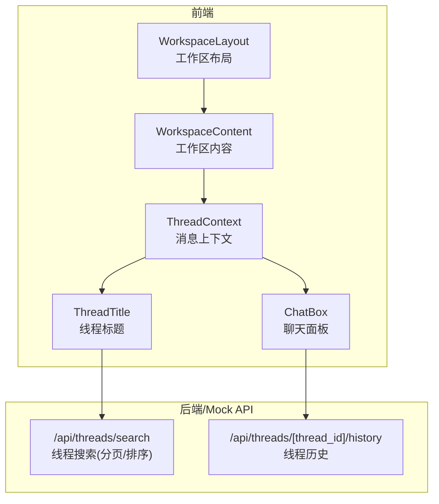
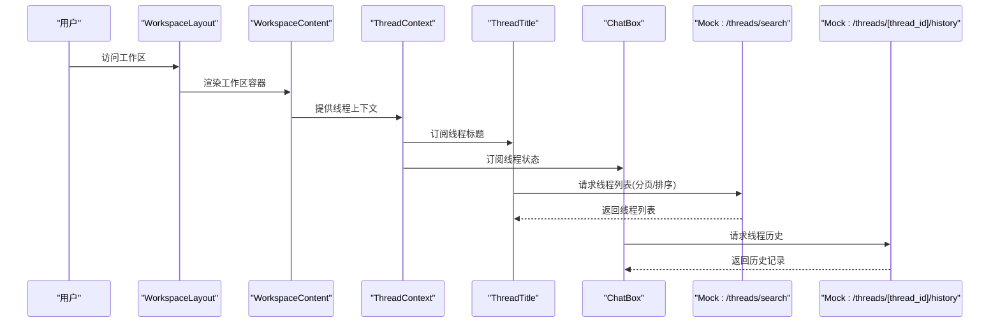
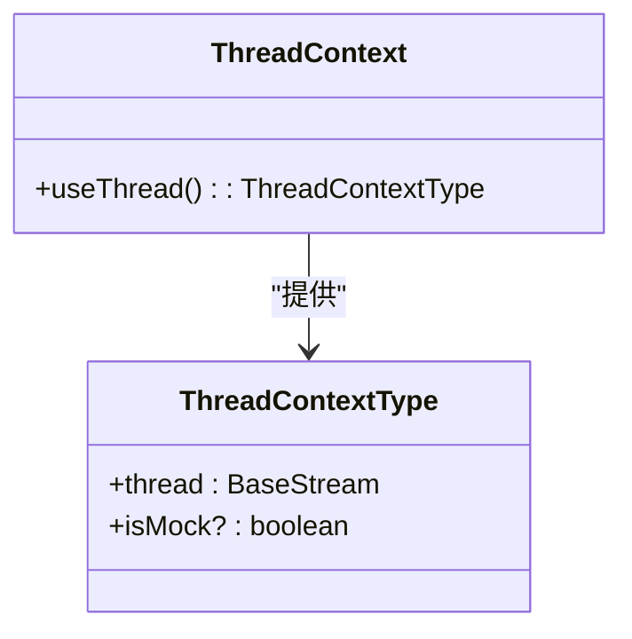
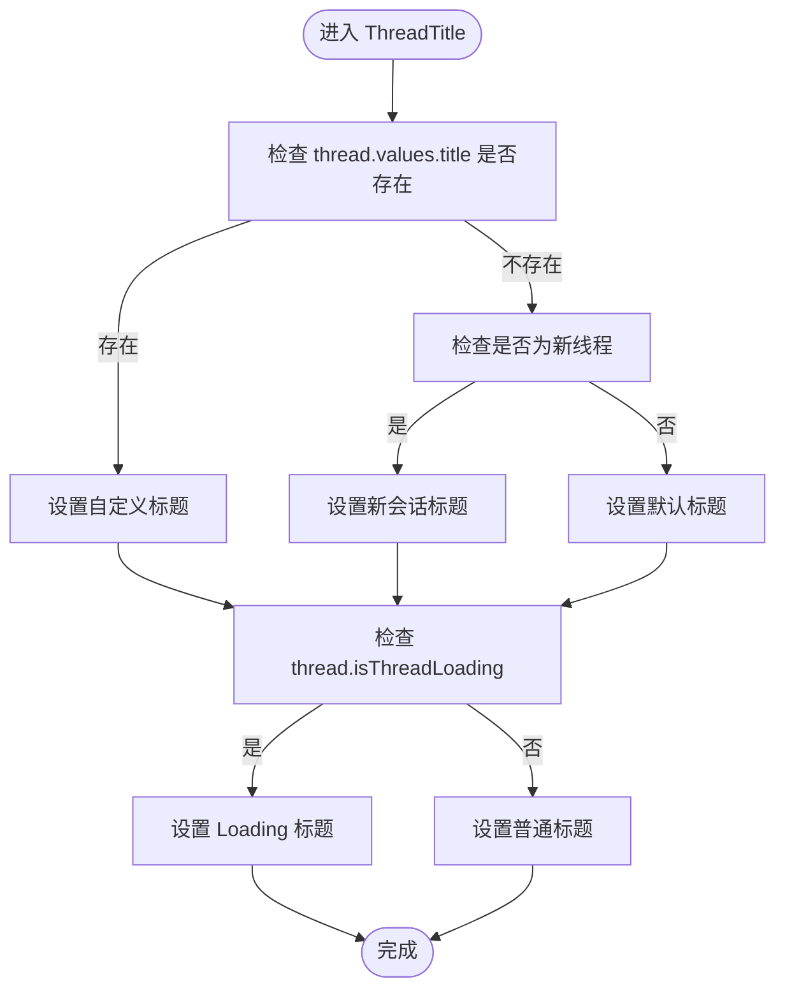
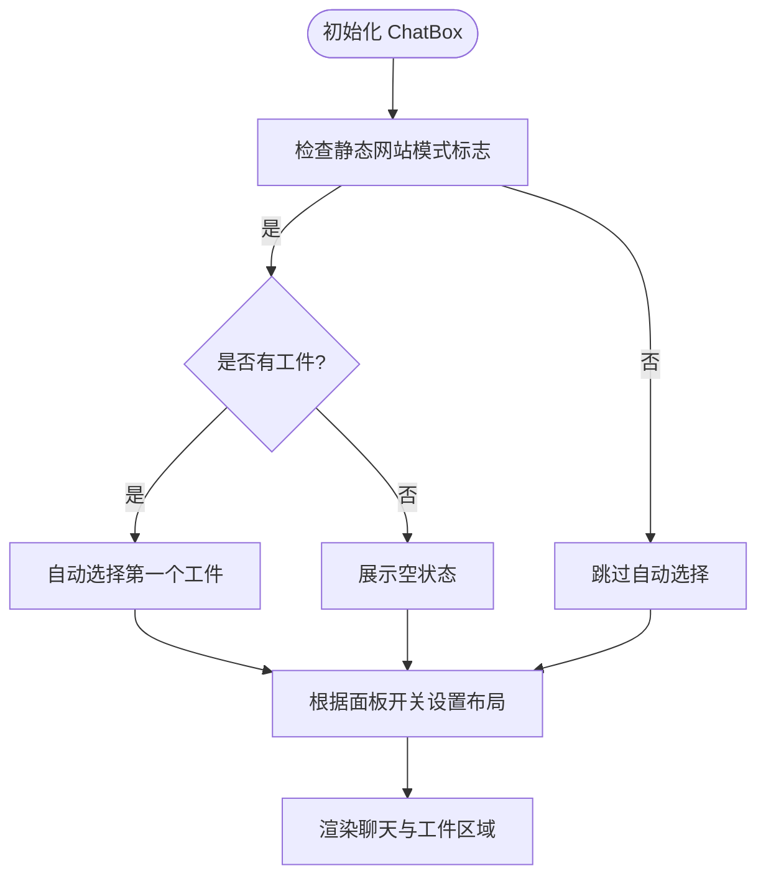
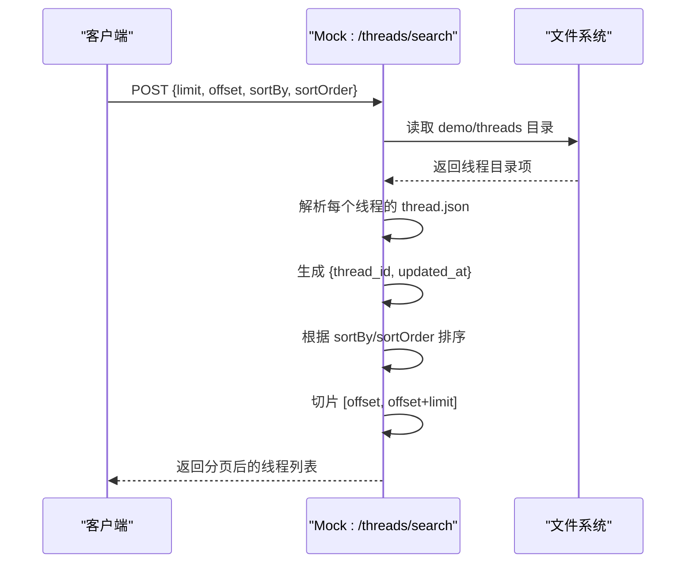
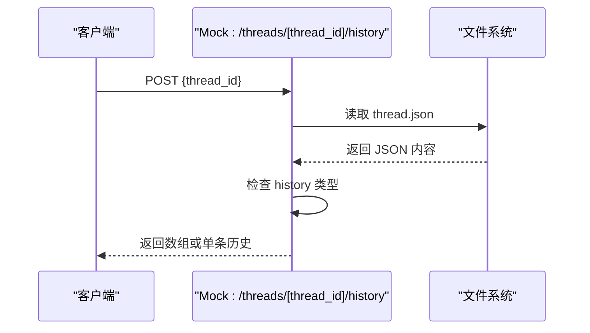
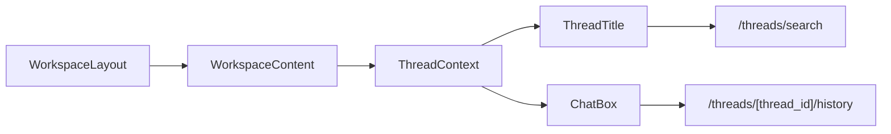

# 线程列表管理

<cite>
**本文引用的文件**
- [frontend/src/app/mock/api/threads/search/route.ts](file://frontend/src/app/mock/api/threads/search/route.ts)
- [frontend/src/app/mock/api/threads/[thread_id]/history/route.ts](file://frontend/src/app/mock/api/threads/[thread_id]/history/route.ts)
- [frontend/src/components/workspace/messages/context.ts](file://frontend/src/components/workspace/messages/context.ts)
- [frontend/src/components/workspace/thread-title.tsx](file://frontend/src/components/workspace/thread-title.tsx)
- [frontend/src/components/workspace/chats/chat-box.tsx](file://frontend/src/components/workspace/chats/chat-box.tsx)
- [frontend/src/app/workspace/layout.tsx](file://frontend/src/app/workspace/layout.tsx)
- [frontend/src/app/workspace/workspace-content.tsx](file://frontend/src/app/workspace/workspace-content.tsx)
</cite>

## 目录
1. [简介](#简介)
2. [项目结构](#项目结构)
3. [核心组件](#核心组件)
4. [架构总览](#架构总览)
5. [详细组件分析](#详细组件分析)
6. [依赖关系分析](#依赖关系分析)
7. [性能考虑](#性能考虑)
8. [故障排查指南](#故障排查指南)
9. [结论](#结论)
10. [附录](#附录)

## 简介
本技术文档围绕 DeerFlow 的“线程列表管理”能力展开，系统性阐述线程列表的渲染机制、数据获取与状态管理、排序与分页、搜索过滤、缩略信息生成、时间戳格式化与状态指示器展示，并给出性能优化、缓存与实时更新策略及最佳实践。本文以仓库中现有的 Mock API 与前端组件为依据，结合概念性设计，帮助读者在不直接阅读源码的情况下理解整体实现思路与落地方式。

## 项目结构
线程列表功能主要由以下部分组成：
- 前端工作区布局与上下文：工作区布局负责用户认证与页面容器；消息上下文提供线程流式数据访问；聊天面板承载线程详情与工件视图。
- Mock API：提供线程搜索（含分页与排序）、线程历史读取等接口，用于演示与测试。
- 国际化与标题展示：根据线程标题动态设置浏览器标题，提升用户体验。

图表来源
- [frontend/src/app/workspace/layout.tsx:12-61](file://frontend/src/app/workspace/layout.tsx#L12-L61)
- [frontend/src/app/workspace/workspace-content.tsx:17-36](file://frontend/src/app/workspace/workspace-content.tsx#L17-L36)
- [frontend/src/components/workspace/messages/context.ts:6-21](file://frontend/src/components/workspace/messages/context.ts#L6-L21)
- [frontend/src/components/workspace/thread-title.tsx:10-50](file://frontend/src/components/workspace/thread-title.tsx#L10-L50)
- [frontend/src/components/workspace/chats/chat-box.tsx:103-180](file://frontend/src/components/workspace/chats/chat-box.tsx#L103-L180)
- [frontend/src/app/mock/api/threads/search/route.ts:16-85](file://frontend/src/app/mock/api/threads/search/route.ts#L16-L85)
- [frontend/src/app/mock/api/threads/[thread_id]/history/route.ts:6-20](file://frontend/src/app/mock/api/threads/[thread_id]/history/route.ts#L6-L20)

章节来源
- [frontend/src/app/workspace/layout.tsx:12-61](file://frontend/src/app/workspace/layout.tsx#L12-L61)
- [frontend/src/app/workspace/workspace-content.tsx:17-36](file://frontend/src/app/workspace/workspace-content.tsx#L17-L36)
- [frontend/src/components/workspace/messages/context.ts:6-21](file://frontend/src/components/workspace/messages/context.ts#L6-L21)
- [frontend/src/components/workspace/thread-title.tsx:10-50](file://frontend/src/components/workspace/thread-title.tsx#L10-L50)
- [frontend/src/components/workspace/chats/chat-box.tsx:103-180](file://frontend/src/components/workspace/chats/chat-box.tsx#L103-L180)
- [frontend/src/app/mock/api/threads/search/route.ts:16-85](file://frontend/src/app/mock/api/threads/search/route.ts#L16-L85)
- [frontend/src/app/mock/api/threads/[thread_id]/history/route.ts:6-20](file://frontend/src/app/mock/api/threads/[thread_id]/history/route.ts#L6-L20)

## 核心组件
- 线程消息上下文：提供 BaseStream 类型的 AgentThreadState 流式数据，便于组件订阅线程状态变化。
- 线程标题展示：根据线程值与新建状态动态设置页面标题，支持加载态提示。
- 聊天面板：承载线程对话与工件视图，支持可调整布局与空状态提示。
- Mock 搜索 API：提供线程列表的分页与排序能力，支持 limit、offset、sortBy、sortOrder 参数。
- Mock 历史 API：按线程 ID 返回历史记录，兼容单条与数组两种形态。

章节来源
- [frontend/src/components/workspace/messages/context.ts:6-21](file://frontend/src/components/workspace/messages/context.ts#L6-L21)
- [frontend/src/components/workspace/thread-title.tsx:10-50](file://frontend/src/components/workspace/thread-title.tsx#L10-L50)
- [frontend/src/components/workspace/chats/chat-box.tsx:103-180](file://frontend/src/components/workspace/chats/chat-box.tsx#L103-L180)
- [frontend/src/app/mock/api/threads/search/route.ts:16-85](file://frontend/src/app/mock/api/threads/search/route.ts#L16-L85)
- [frontend/src/app/mock/api/threads/[thread_id]/history/route.ts:6-20](file://frontend/src/app/mock/api/threads/[thread_id]/history/route.ts#L6-L20)

## 架构总览
下图展示了从布局到 Mock API 的调用链路与职责分工：

图表来源
- [frontend/src/app/workspace/layout.tsx:12-61](file://frontend/src/app/workspace/layout.tsx#L12-L61)
- [frontend/src/app/workspace/workspace-content.tsx:17-36](file://frontend/src/app/workspace/workspace-content.tsx#L17-L36)
- [frontend/src/components/workspace/messages/context.ts:6-21](file://frontend/src/components/workspace/messages/context.ts#L6-L21)
- [frontend/src/components/workspace/thread-title.tsx:10-50](file://frontend/src/components/workspace/thread-title.tsx#L10-L50)
- [frontend/src/components/workspace/chats/chat-box.tsx:103-180](file://frontend/src/components/workspace/chats/chat-box.tsx#L103-L180)
- [frontend/src/app/mock/api/threads/search/route.ts:16-85](file://frontend/src/app/mock/api/threads/search/route.ts#L16-L85)
- [frontend/src/app/mock/api/threads/[thread_id]/history/route.ts:6-20](file://frontend/src/app/mock/api/threads/[thread_id]/history/route.ts#L6-L20)

## 详细组件分析

### 组件一：线程消息上下文（ThreadContext）
- 职责：封装 BaseStream<AgentThreadState>，向子组件提供线程状态订阅能力。
- 关键点：通过 React Context 暴露 thread 与可选 isMock 标记，避免重复注入。

图表来源
- [frontend/src/components/workspace/messages/context.ts:6-21](file://frontend/src/components/workspace/messages/context.ts#L6-L21)

章节来源
- [frontend/src/components/workspace/messages/context.ts:6-21](file://frontend/src/components/workspace/messages/context.ts#L6-L21)

### 组件二：线程标题（ThreadTitle）
- 职责：根据线程值与新建状态动态设置页面标题；在加载态时显示 Loading...。
- 关键点：依赖国际化资源与线程上下文，使用翻转动画组件增强体验。

图表来源
- [frontend/src/components/workspace/thread-title.tsx:18-40](file://frontend/src/components/workspace/thread-title.tsx#L18-L40)

章节来源
- [frontend/src/components/workspace/thread-title.tsx:10-50](file://frontend/src/components/workspace/thread-title.tsx#L10-L50)

### 组件三：聊天面板（ChatBox）与工件视图
- 职责：承载聊天内容与工件列表；支持可调整布局与空状态提示；在静态网站模式下自动选择首个工件。
- 关键点：通过 ResizablePanelGroup 实现左右布局；根据 artifactsOpen 控制面板显隐；当无工件时展示空状态。

图表来源
- [frontend/src/components/workspace/chats/chat-box.tsx:52-87](file://frontend/src/components/workspace/chats/chat-box.tsx#L52-L87)
- [frontend/src/components/workspace/chats/chat-box.tsx:103-180](file://frontend/src/components/workspace/chats/chat-box.tsx#L103-L180)

章节来源
- [frontend/src/components/workspace/chats/chat-box.tsx:52-87](file://frontend/src/components/workspace/chats/chat-box.tsx#L52-L87)
- [frontend/src/components/workspace/chats/chat-box.tsx:103-180](file://frontend/src/components/workspace/chats/chat-box.tsx#L103-L180)

### 组件四：线程搜索 API（Mock）
- 职责：提供线程列表的分页与排序能力；返回包含 thread_id 与 updated_at 的结果集。
- 关键点：支持 limit、offset、sortBy、sortOrder 参数；按 updated_at 或 created_at 排序；默认降序；分页切片返回。

图表来源
- [frontend/src/app/mock/api/threads/search/route.ts:16-85](file://frontend/src/app/mock/api/threads/search/route.ts#L16-L85)

章节来源
- [frontend/src/app/mock/api/threads/search/route.ts:16-85](file://frontend/src/app/mock/api/threads/search/route.ts#L16-L85)

### 组件五：线程历史 API（Mock）
- 职责：按线程 ID 返回历史记录；若 history 为数组则原样返回，否则包装为数组。
- 关键点：兼容单条与数组两种形态，简化上层消费逻辑。

图表来源
- [frontend/src/app/mock/api/threads/[thread_id]/history/route.ts:6-20](file://frontend/src/app/mock/api/threads/[thread_id]/history/route.ts#L6-L20)

章节来源
- [frontend/src/app/mock/api/threads/[thread_id]/history/route.ts:6-20](file://frontend/src/app/mock/api/threads/[thread_id]/history/route.ts#L6-L20)

## 依赖关系分析
- 工作区布局与内容：负责认证与全局容器，为后续组件提供上下文与路由环境。
- 线程上下文：被标题与聊天面板共同依赖，形成“订阅-渲染”的解耦关系。
- Mock API：作为数据源，被标题与聊天面板间接依赖（通过业务调用）。

图表来源
- [frontend/src/app/workspace/layout.tsx:12-61](file://frontend/src/app/workspace/layout.tsx#L12-L61)
- [frontend/src/app/workspace/workspace-content.tsx:17-36](file://frontend/src/app/workspace/workspace-content.tsx#L17-L36)
- [frontend/src/components/workspace/messages/context.ts:6-21](file://frontend/src/components/workspace/messages/context.ts#L6-L21)
- [frontend/src/components/workspace/thread-title.tsx:10-50](file://frontend/src/components/workspace/thread-title.tsx#L10-L50)
- [frontend/src/components/workspace/chats/chat-box.tsx:103-180](file://frontend/src/components/workspace/chats/chat-box.tsx#L103-L180)
- [frontend/src/app/mock/api/threads/search/route.ts:16-85](file://frontend/src/app/mock/api/threads/search/route.ts#L16-L85)
- [frontend/src/app/mock/api/threads/[thread_id]/history/route.ts:6-20](file://frontend/src/app/mock/api/threads/[thread_id]/history/route.ts#L6-L20)

章节来源
- [frontend/src/app/workspace/layout.tsx:12-61](file://frontend/src/app/workspace/layout.tsx#L12-L61)
- [frontend/src/app/workspace/workspace-content.tsx:17-36](file://frontend/src/app/workspace/workspace-content.tsx#L17-L36)
- [frontend/src/components/workspace/messages/context.ts:6-21](file://frontend/src/components/workspace/messages/context.ts#L6-L21)
- [frontend/src/components/workspace/thread-title.tsx:10-50](file://frontend/src/components/workspace/thread-title.tsx#L10-L50)
- [frontend/src/components/workspace/chats/chat-box.tsx:103-180](file://frontend/src/components/workspace/chats/chat-box.tsx#L103-L180)
- [frontend/src/app/mock/api/threads/search/route.ts:16-85](file://frontend/src/app/mock/api/threads/search/route.ts#L16-L85)
- [frontend/src/app/mock/api/threads/[thread_id]/history/route.ts:6-20](file://frontend/src/app/mock/api/threads/[thread_id]/history/route.ts#L6-L20)

## 性能考虑
- 分页与排序
  - 使用 limit/offset 进行服务端分页，避免一次性传输大量数据。
  - 排序字段支持 updated_at 与 created_at，建议在大数据量场景下优先使用索引列。
- 时间戳处理
  - 排序前进行字符串解析与 NaN 容错，确保稳定性；建议在生产环境统一时间格式与时区。
- 渲染优化
  - 使用 React.memo 与 useMemo 缓解不必要的重渲染；聊天面板采用可调整布局，减少 DOM 变更开销。
- 缓存策略
  - 对线程列表结果进行内存缓存，结合查询参数（limit/offset/sort）作为缓存键。
  - 对历史数据进行短期缓存，避免频繁读取磁盘。
- 实时更新
  - 通过 BaseStream 订阅线程状态变化，按需刷新标题与列表；建议引入节流/防抖避免高频更新。
- I/O 优化
  - Mock API 读取本地文件，建议在生产环境替换为数据库查询并开启连接池与查询缓存。

[本节为通用性能建议，无需特定文件引用]

## 故障排查指南
- 线程标题未更新
  - 检查线程上下文是否正确提供 thread.values.title；确认 isThreadLoading 状态是否影响标题设置。
- 工件面板无法打开
  - 检查 artifactsOpen 状态与静态网站模式标志；确认 ResizablePanelGroup 的布局状态。
- 线程列表为空或排序异常
  - 检查 Mock API 的 sortBy/sortOrder 参数是否正确传入；确认 updated_at/created_at 字段是否存在且可解析。
- 历史数据格式不一致
  - 确认 thread.json 中 history 字段类型；确保 API 对数组与单条记录的兼容处理生效。

章节来源
- [frontend/src/components/workspace/thread-title.tsx:18-40](file://frontend/src/components/workspace/thread-title.tsx#L18-L40)
- [frontend/src/components/workspace/chats/chat-box.tsx:103-180](file://frontend/src/components/workspace/chats/chat-box.tsx#L103-L180)
- [frontend/src/app/mock/api/threads/search/route.ts:16-85](file://frontend/src/app/mock/api/threads/search/route.ts#L16-L85)
- [frontend/src/app/mock/api/threads/[thread_id]/history/route.ts:6-20](file://frontend/src/app/mock/api/threads/[thread_id]/history/route.ts#L6-L20)

## 结论
本文基于现有 Mock API 与前端组件，梳理了 DeerFlow 线程列表管理的关键路径：从工作区布局到消息上下文、标题展示与聊天面板，再到线程搜索与历史读取。通过分页与排序、时间戳规范化、状态指示与渲染优化，可构建稳定高效的线程列表体验。建议在生产环境中以数据库替代 Mock API，并引入缓存与实时订阅机制，持续优化性能与可用性。

[本节为总结性内容，无需特定文件引用]

## 附录
- 最佳实践清单
  - 明确排序字段与默认顺序，保证一致性。
  - 对时间戳进行统一格式化与本地化处理。
  - 在列表与详情页之间共享缓存键，避免重复请求。
  - 使用节流/防抖控制高频更新，降低渲染压力。
  - 对历史数据进行类型校验与容错处理，提升健壮性。

[本节为通用建议，无需特定文件引用]