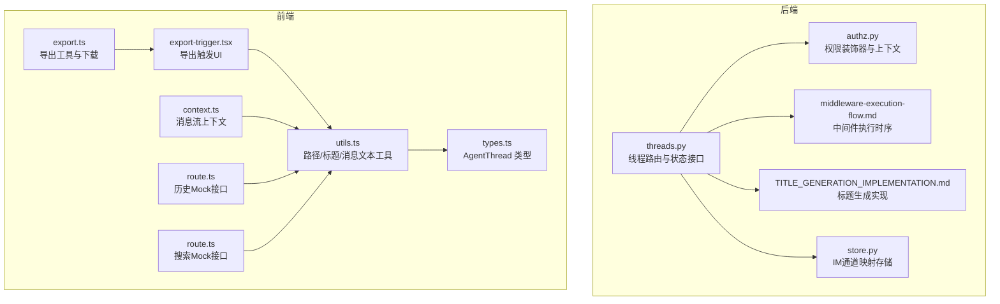
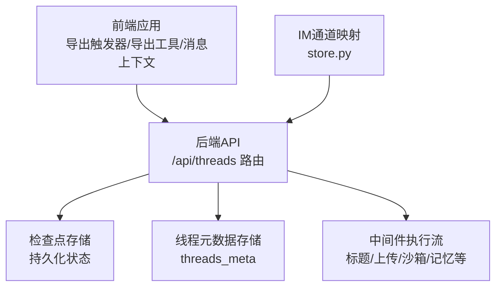
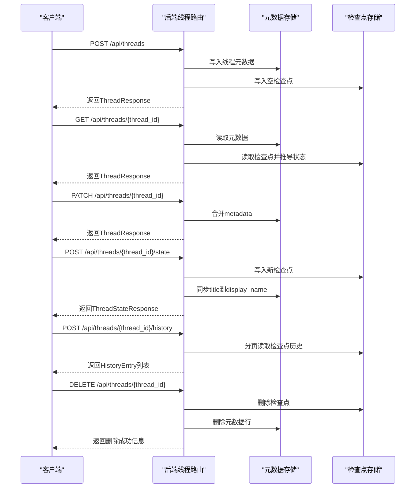
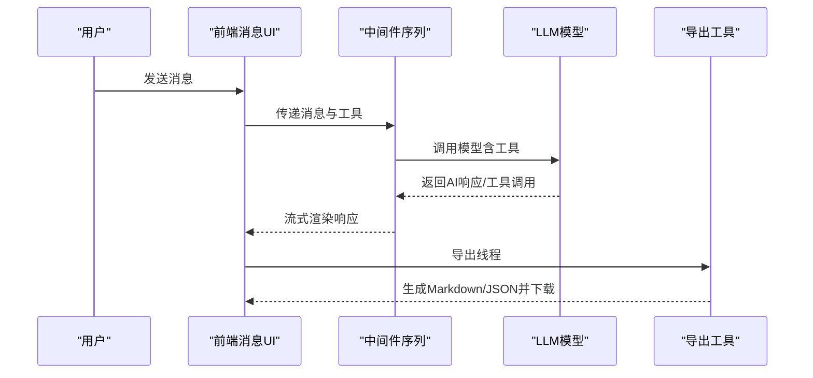
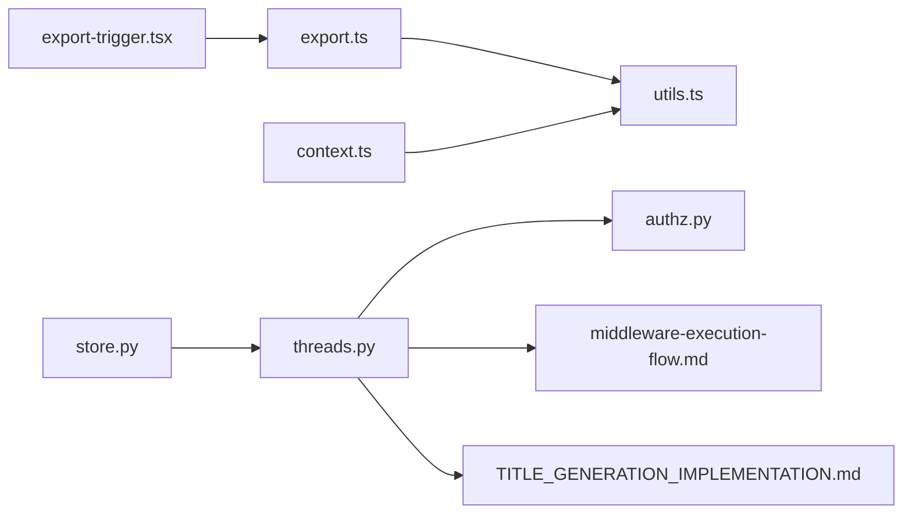

# 线程操作功能

<cite>
**本文引用的文件**
- [threads.py](file://backend/app/gateway/routers/threads.py)
- [authz.py](file://backend/app/gateway/authz.py)
- [export.ts](file://frontend/src/core/threads/export.ts)
- [export-trigger.tsx](file://frontend/src/components/workspace/export-trigger.tsx)
- [types.ts](file://frontend/src/core/threads/types.ts)
- [utils.ts](file://frontend/src/core/threads/utils.ts)
- [context.ts](file://frontend/src/components/workspace/messages/context.ts)
- [middleware-execution-flow.md](file://backend/docs/middleware-execution-flow.md)
- [TITLE_GENERATION_IMPLEMENTATION.md](file://backend/docs/TITLE_GENERATION_IMPLEMENTATION.md)
- [chat.sh](file://skills/public/claude-to-deerflow/scripts/chat.sh)
- [status.sh](file://skills/public/claude-to-deerflow/scripts/status.sh)
- [route.ts](file://frontend/src/app/mock/api/threads/[thread_id]/history/route.ts)
- [route.ts](file://frontend/src/app/mock/api/threads/search/route.ts)
- [store.py](file://backend/app/channels/store.py)
</cite>

## 目录
1. [简介](#简介)
2. [项目结构](#项目结构)
3. [核心组件](#核心组件)
4. [架构总览](#架构总览)
5. [详细组件分析](#详细组件分析)
6. [依赖分析](#依赖分析)
7. [性能考虑](#性能考虑)
8. [故障排查指南](#故障排查指南)
9. [结论](#结论)
10. [附录](#附录)

## 简介
本技术文档聚焦 DeerFlow 的“线程操作功能”，系统性阐述线程的创建、编辑、删除与导出的实现机制；详解线程标题生成、消息发送与响应处理的完整流程；解释线程状态管理、错误处理与用户反馈机制；给出权限控制、并发处理与数据一致性保障方法；并提供线程导出格式、批量操作与自动化脚本的使用指南。

## 项目结构
围绕线程功能的关键代码分布在后端 FastAPI 路由层与前端核心模块中：
- 后端：线程 CRUD、状态查询、历史查询、权限控制与中间件执行流
- 前端：线程导出工具、导出触发器、线程类型与工具函数、消息上下文

图表来源
- [threads.py:1-623](file://backend/app/gateway/routers/threads.py#L1-L623)
- [authz.py:1-302](file://backend/app/gateway/authz.py#L1-L302)
- [export.ts:1-141](file://frontend/src/core/threads/export.ts#L1-L141)
- [export-trigger.tsx:1-54](file://frontend/src/components/workspace/export-trigger.tsx#L1-L54)
- [types.ts:1-48](file://frontend/src/core/threads/types.ts#L1-L48)
- [utils.ts:1-52](file://frontend/src/core/threads/utils.ts#L1-L52)
- [context.ts:1-21](file://frontend/src/components/workspace/messages/context.ts#L1-L21)
- [middleware-execution-flow.md:77-154](file://backend/docs/middleware-execution-flow.md#L77-L154)
- [TITLE_GENERATION_IMPLEMENTATION.md:1-223](file://backend/docs/TITLE_GENERATION_IMPLEMENTATION.md#L1-L223)
- [store.py:80-114](file://backend/app/channels/store.py#L80-L114)

章节来源
- [threads.py:1-623](file://backend/app/gateway/routers/threads.py#L1-L623)
- [authz.py:1-302](file://backend/app/gateway/authz.py#L1-L302)
- [export.ts:1-141](file://frontend/src/core/threads/export.ts#L1-L141)
- [export-trigger.tsx:1-54](file://frontend/src/components/workspace/export-trigger.tsx#L1-L54)
- [types.ts:1-48](file://frontend/src/core/threads/types.ts#L1-L48)
- [utils.ts:1-52](file://frontend/src/core/threads/utils.ts#L1-L52)
- [context.ts:1-21](file://frontend/src/components/workspace/messages/context.ts#L1-L21)
- [middleware-execution-flow.md:77-154](file://backend/docs/middleware-execution-flow.md#L77-L154)
- [TITLE_GENERATION_IMPLEMENTATION.md:1-223](file://backend/docs/TITLE_GENERATION_IMPLEMENTATION.md#L1-L223)
- [store.py:80-114](file://backend/app/channels/store.py#L80-L114)

## 核心组件
- 后端线程路由与状态接口：提供线程创建、查询、状态读取、状态更新、历史查询与删除等能力，并结合检查点与元数据存储实现状态持久化与一致性。
- 权限控制：基于资源:动作的权限模型，支持拥有者校验与现有记录要求，确保线程级访问控制。
- 前端导出工具：将线程消息格式化为 Markdown 或 JSON 并触发浏览器下载，同时提供导出触发 UI。
- 消息与上下文：前端通过消息流上下文与工具函数解析消息内容、提取标题、计算路由路径。
- 中间件执行流：标题生成、上传处理、沙箱、图像注入、澄清、子代理限制、摘要、悬挂工具调用、内存写入等按序执行。
- IM 通道映射：将外部 IM 会话/话题映射到 DeerFlow 线程 ID，便于跨渠道一致管理。

章节来源
- [threads.py:224-286](file://backend/app/gateway/routers/threads.py#L224-L286)
- [threads.py:351-405](file://backend/app/gateway/routers/threads.py#L351-L405)
- [threads.py:461-548](file://backend/app/gateway/routers/threads.py#L461-L548)
- [threads.py:551-622](file://backend/app/gateway/routers/threads.py#L551-L622)
- [authz.py:48-94](file://backend/app/gateway/authz.py#L48-L94)
- [authz.py:197-301](file://backend/app/gateway/authz.py#L197-L301)
- [export.ts:26-140](file://frontend/src/core/threads/export.ts#L26-L140)
- [export-trigger.tsx:24-50](file://frontend/src/components/workspace/export-trigger.tsx#L24-L50)
- [context.ts:1-21](file://frontend/src/components/workspace/messages/context.ts#L1-L21)
- [middleware-execution-flow.md:77-154](file://backend/docs/middleware-execution-flow.md#L77-L154)
- [store.py:80-114](file://backend/app/channels/store.py#L80-L114)

## 架构总览
下图展示线程操作在后端与前端的整体交互：前端通过导出触发器调用导出工具，后端线程路由提供状态与历史查询，权限控制贯穿所有线程相关接口，中间件在推理链路中负责标题生成与上下文处理。

图表来源
- [threads.py:1-623](file://backend/app/gateway/routers/threads.py#L1-L623)
- [export-trigger.tsx:1-54](file://frontend/src/components/workspace/export-trigger.tsx#L1-L54)
- [export.ts:1-141](file://frontend/src/core/threads/export.ts#L1-L141)
- [context.ts:1-21](file://frontend/src/components/workspace/messages/context.ts#L1-L21)
- [middleware-execution-flow.md:77-154](file://backend/docs/middleware-execution-flow.md#L77-L154)
- [store.py:80-114](file://backend/app/channels/store.py#L80-L114)

## 详细组件分析

### 线程创建、编辑、删除与状态管理
- 创建线程
  - 接口：POST /api/threads
  - 行为：写入线程元数据，立即写入空检查点以使状态接口可用；幂等：若已存在则返回现有记录
  - 关键字段：thread_id、assistant_id、metadata
- 查询线程
  - 接口：GET /api/threads/{thread_id}
  - 行为：从元数据存储与检查点派生准确状态；兼容旧版仅检查点数据
- 编辑线程元数据
  - 接口：PATCH /api/threads/{thread_id}
  - 行为：合并 metadata；返回最新记录
- 状态读取与更新
  - 读取：GET /api/threads/{thread_id}/state
  - 更新：POST /api/threads/{thread_id}/state（支持人类介入恢复、标题重命名等）
  - 同步：当 values 中包含 title 时同步至元数据存储，保证搜索结果即时可见
- 历史查询
  - 接口：POST /api/threads/{thread_id}/history
  - 行为：分页列出检查点历史，仅最新检查点携带 messages，避免重复
- 删除线程
  - 接口：DELETE /api/threads/{thread_id}
  - 行为：清理本地线程目录与检查点；移除元数据行（最佳努力）

图表来源
- [threads.py:224-286](file://backend/app/gateway/routers/threads.py#L224-L286)
- [threads.py:351-405](file://backend/app/gateway/routers/threads.py#L351-L405)
- [threads.py:322-348](file://backend/app/gateway/routers/threads.py#L322-L348)
- [threads.py:461-548](file://backend/app/gateway/routers/threads.py#L461-L548)
- [threads.py:551-622](file://backend/app/gateway/routers/threads.py#L551-L622)
- [threads.py:190-221](file://backend/app/gateway/routers/threads.py#L190-L221)

章节来源
- [threads.py:224-286](file://backend/app/gateway/routers/threads.py#L224-L286)
- [threads.py:322-348](file://backend/app/gateway/routers/threads.py#L322-L348)
- [threads.py:351-405](file://backend/app/gateway/routers/threads.py#L351-L405)
- [threads.py:461-548](file://backend/app/gateway/routers/threads.py#L461-L548)
- [threads.py:551-622](file://backend/app/gateway/routers/threads.py#L551-L622)
- [threads.py:190-221](file://backend/app/gateway/routers/threads.py#L190-L221)

### 线程标题生成与消息发送/响应处理流程
- 标题生成
  - 触发时机：首次对话后（用户消息 + 助手回复）由中间件在 after_agent 阶段生成
  - 存储位置：写入 state.values.title；可选持久化通过检查点实现
  - 回退策略：LLM 失败时回退到用户消息前若干词
- 消息发送与响应处理
  - 前端通过消息上下文订阅流式响应；中间件序列在推理链路上依次执行，最终将 AI 响应与工具调用注入消息流
  - 前端导出工具从消息流中抽取内容、推理与工具调用，生成 Markdown/JSON 报告

图表来源
- [middleware-execution-flow.md:77-154](file://backend/docs/middleware-execution-flow.md#L77-L154)
- [TITLE_GENERATION_IMPLEMENTATION.md:77-95](file://backend/docs/TITLE_GENERATION_IMPLEMENTATION.md#L77-L95)
- [export.ts:26-140](file://frontend/src/core/threads/export.ts#L26-L140)
- [context.ts:1-21](file://frontend/src/components/workspace/messages/context.ts#L1-L21)

章节来源
- [TITLE_GENERATION_IMPLEMENTATION.md:1-223](file://backend/docs/TITLE_GENERATION_IMPLEMENTATION.md#L1-L223)
- [middleware-execution-flow.md:77-154](file://backend/docs/middleware-execution-flow.md#L77-L154)
- [export.ts:1-141](file://frontend/src/core/threads/export.ts#L1-L141)
- [context.ts:1-21](file://frontend/src/components/workspace/messages/context.ts#L1-L21)

### 权限控制与并发处理
- 权限模型
  - 资源:动作：threads:read、threads:write、threads:delete
  - 装饰器 require_permission 支持 owner_check 与 require_existing，确保删除/修改等破坏性操作必须拥有者且现有记录存在
- 并发与一致性
  - 状态更新通过检查点写入，具备原子性；标题同步至元数据存储，保证搜索结果即时可见
  - 删除线程时尽力清理检查点与元数据行，失败不阻塞主流程

章节来源
- [authz.py:48-94](file://backend/app/gateway/authz.py#L48-L94)
- [authz.py:197-301](file://backend/app/gateway/authz.py#L197-L301)
- [threads.py:461-548](file://backend/app/gateway/routers/threads.py#L461-L548)
- [threads.py:190-221](file://backend/app/gateway/routers/threads.py#L190-L221)

### 线程导出格式与批量操作
- 导出格式
  - Markdown：包含标题、导出时间、创建时间、用户与助手消息、推理折叠区、工具调用列表
  - JSON：包含标题、thread_id、created_at、exported_at、消息数组（含工具调用）
- 批量操作
  - 前端提供导出触发器，当消息为空时提示无消息；导出成功后通过 toast 反馈
  - 后端提供 /threads/search 用于批量检索与排序（limit/offset、排序字段），可用于批量导出场景的索引

章节来源
- [export.ts:26-140](file://frontend/src/core/threads/export.ts#L26-L140)
- [export-trigger.tsx:24-50](file://frontend/src/components/workspace/export-trigger.tsx#L24-L50)
- [threads.py:289-319](file://backend/app/gateway/routers/threads.py#L289-L319)

### 自动化脚本与IM通道映射
- 自动化脚本
  - Claude-to-DeerFlow 脚本通过 POST /threads 创建线程，随后根据模式构建上下文并发送消息
  - status.sh 提供健康检查与线程列表查询示例
- IM 通道映射
  - store.py 维护 channel_name:chat_id:topic_id 到 thread_id 的映射，支持设置、查询与删除

章节来源
- [chat.sh:34-68](file://skills/public/claude-to-deerflow/scripts/chat.sh#L34-L68)
- [status.sh:26-68](file://skills/public/claude-to-deerflow/scripts/status.sh#L26-L68)
- [store.py:80-114](file://backend/app/channels/store.py#L80-L114)

## 依赖分析
- 后端线程路由依赖权限控制、检查点与元数据存储，确保线程生命周期内状态与元数据一致
- 前端导出工具依赖消息工具函数与类型定义，导出触发器依赖国际化与通知组件
- 中间件执行流贯穿消息处理链路，标题生成与记忆写入等关键步骤在流中有序执行

图表来源
- [threads.py:1-623](file://backend/app/gateway/routers/threads.py#L1-L623)
- [authz.py:1-302](file://backend/app/gateway/authz.py#L1-L302)
- [export.ts:1-141](file://frontend/src/core/threads/export.ts#L1-L141)
- [export-trigger.tsx:1-54](file://frontend/src/components/workspace/export-trigger.tsx#L1-L54)
- [utils.ts:1-52](file://frontend/src/core/threads/utils.ts#L1-L52)
- [context.ts:1-21](file://frontend/src/components/workspace/messages/context.ts#L1-L21)
- [middleware-execution-flow.md:77-154](file://backend/docs/middleware-execution-flow.md#L77-L154)
- [TITLE_GENERATION_IMPLEMENTATION.md:1-223](file://backend/docs/TITLE_GENERATION_IMPLEMENTATION.md#L1-L223)
- [store.py:80-114](file://backend/app/channels/store.py#L80-L114)

章节来源
- [threads.py:1-623](file://backend/app/gateway/routers/threads.py#L1-L623)
- [authz.py:1-302](file://backend/app/gateway/authz.py#L1-L302)
- [export.ts:1-141](file://frontend/src/core/threads/export.ts#L1-L141)
- [export-trigger.tsx:1-54](file://frontend/src/components/workspace/export-trigger.tsx#L1-L54)
- [utils.ts:1-52](file://frontend/src/core/threads/utils.ts#L1-L52)
- [context.ts:1-21](file://frontend/src/components/workspace/messages/context.ts#L1-L21)
- [middleware-execution-flow.md:77-154](file://backend/docs/middleware-execution-flow.md#L77-L154)
- [TITLE_GENERATION_IMPLEMENTATION.md:1-223](file://backend/docs/TITLE_GENERATION_IMPLEMENTATION.md#L1-L223)
- [store.py:80-114](file://backend/app/channels/store.py#L80-L114)

## 性能考虑
- 标题生成：在 after_agent 阶段执行，避免阻塞主流程；本地开发可通过检查点持久化减少重启后丢失
- 历史查询：仅最新检查点携带 messages，降低重复数据传输
- 并发安全：状态更新通过检查点写入，具备原子性；删除线程为尽力而为，不影响其他操作

## 故障排查指南
- 标题未生成
  - 检查配置：title.enabled=true；确认为首次对话；查看日志中“Generated thread title”；确认从 state.values.title 读取
- 标题生成但未显示
  - 确认读取位置与 API 响应；必要时重新获取状态
- 重启后标题丢失
  - 配置检查点持久化；确认平台或本地数据库工作正常
- 导出失败
  - 确认消息列表非空；检查导出触发器的 toast 提示；核对导出工具的下载逻辑
- 权限错误
  - 确认 threads:read/write/delete 权限；删除/修改需 owner_check 且 require_existing

章节来源
- [TITLE_GENERATION_IMPLEMENTATION.md:167-186](file://backend/docs/TITLE_GENERATION_IMPLEMENTATION.md#L167-L186)
- [export-trigger.tsx:30-49](file://frontend/src/components/workspace/export-trigger.tsx#L30-L49)
- [authz.py:269-296](file://backend/app/gateway/authz.py#L269-L296)

## 结论
DeerFlow 的线程操作功能以“检查点 + 元数据”的双轨机制实现状态持久化与一致性，配合严格的权限控制与中间件执行流，确保标题生成、消息处理与导出体验的稳定与高效。前端导出工具与自动化脚本进一步增强了批量处理与跨渠道集成能力。

## 附录
- 线程导出格式
  - Markdown：标题、导出时间、创建时间、用户/助手消息、推理折叠区、工具调用列表
  - JSON：标题、thread_id、created_at、exported_at、消息数组（含工具调用）
- 批量操作建议
  - 使用 /threads/search 进行分页检索与排序，结合导出工具进行批量导出
- 自动化脚本使用
  - 通过 chat.sh 创建线程并发送消息；通过 status.sh 检查健康与线程列表

章节来源
- [export.ts:26-140](file://frontend/src/core/threads/export.ts#L26-L140)
- [threads.py:289-319](file://backend/app/gateway/routers/threads.py#L289-L319)
- [chat.sh:34-68](file://skills/public/claude-to-deerflow/scripts/chat.sh#L34-L68)
- [status.sh:26-68](file://skills/public/claude-to-deerflow/scripts/status.sh#L26-L68)