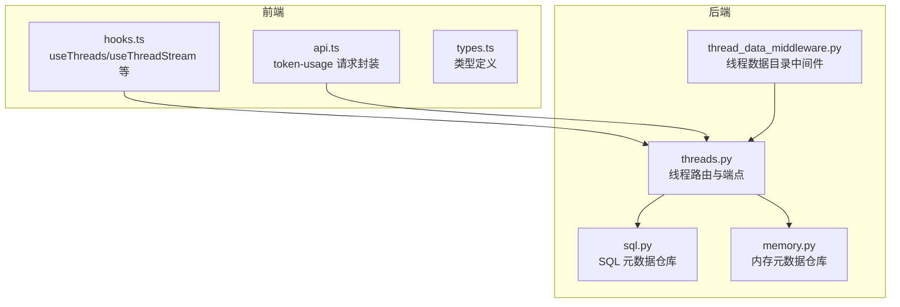
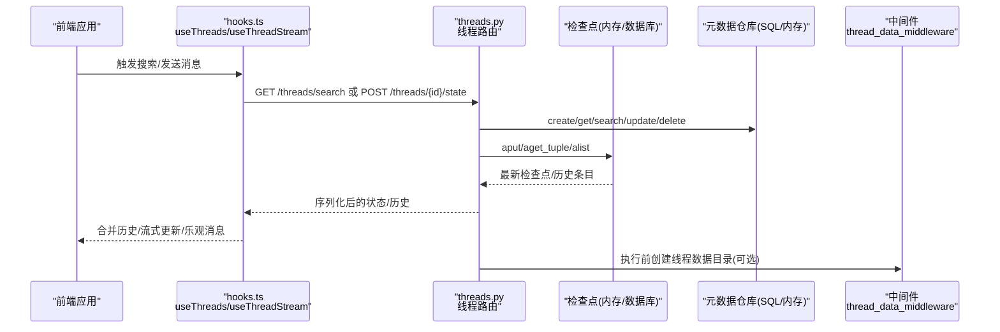
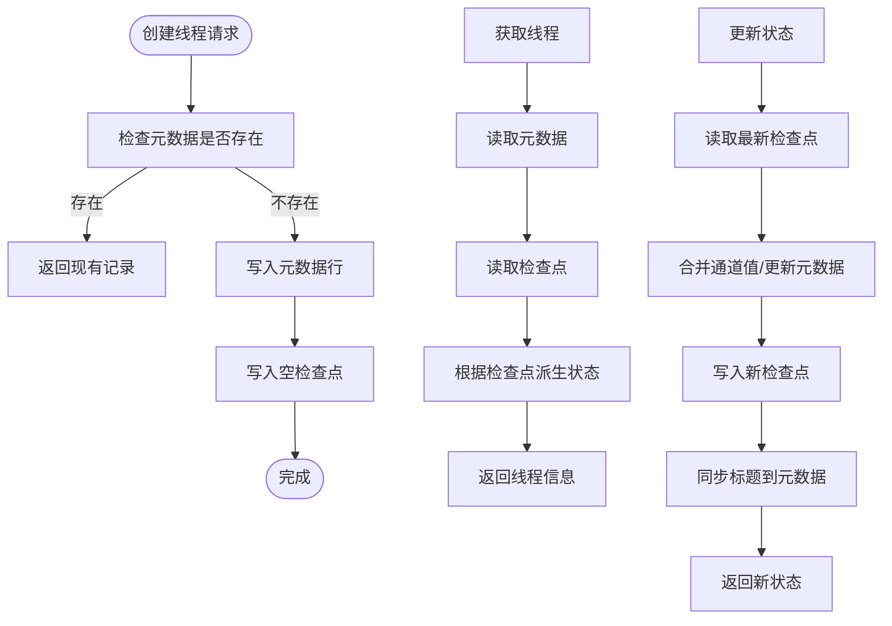
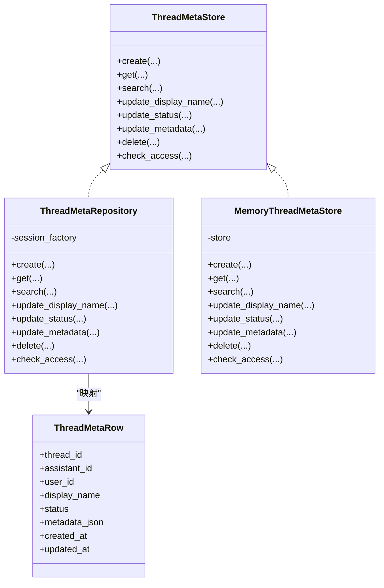
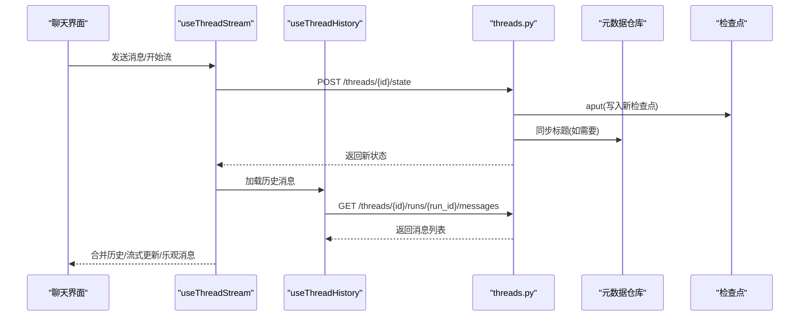
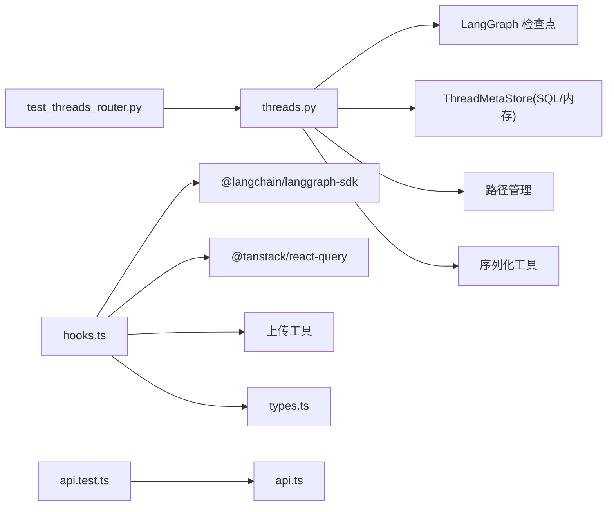

# 线程管理

<cite>
**本文引用的文件**
- [threads.py](file://backend/app/gateway/routers/threads.py)
- [api.ts](file://frontend/src/core/threads/api.ts)
- [hooks.ts](file://frontend/src/core/threads/hooks.ts)
- [types.ts](file://frontend/src/core/threads/types.ts)
- [model.py](file://backend/packages/harness/deerflow/persistence/thread_meta/model.py)
- [sql.py](file://backend/packages/harness/deerflow/persistence/thread_meta/sql.py)
- [memory.py](file://backend/packages/harness/deerflow/persistence/thread_meta/memory.py)
- [thread_data_middleware.py](file://backend/packages/harness/deerflow/agents/middlewares/thread_data_middleware.py)
- [test_threads_router.py](file://backend/tests/test_threads_router.py)
- [api.test.ts](file://frontend/tests/unit/core/threads/api.test.ts)
</cite>

## 目录
1. [简介](#简介)
2. [项目结构](#项目结构)
3. [核心组件](#核心组件)
4. [架构总览](#架构总览)
5. [详细组件分析](#详细组件分析)
6. [依赖分析](#依赖分析)
7. [性能考虑](#性能考虑)
8. [故障排查指南](#故障排查指南)
9. [结论](#结论)
10. [附录](#附录)

## 简介
本技术文档围绕 DeerFlow 的线程管理系统，系统性阐述线程列表管理、线程详情展示与线程操作（创建、搜索、排序、删除）的实现机制，以及线程状态同步、消息历史管理与实时更新机制。文档同时解释线程数据模型、缓存策略与性能优化方法，并提供使用指南与扩展开发建议。

## 项目结构
线程管理涉及后端路由、持久化层与前端 hooks/API 客户端三部分协同工作：
- 后端路由：提供线程的创建、查询、状态读写、历史查询与删除等接口。
- 持久化层：抽象出 ThreadMetaStore 接口，分别提供 SQL 与内存两种实现，用于线程元数据的存储与检索。
- 前端：通过 hooks 封装实时流、历史加载、分页搜索、令牌用量查询与乐观消息等交互逻辑。

图表来源
- [threads.py:1-623](file://backend/app/gateway/routers/threads.py#L1-L623)
- [sql.py:1-218](file://backend/packages/harness/deerflow/persistence/thread_meta/sql.py#L1-L218)
- [memory.py:1-152](file://backend/packages/harness/deerflow/persistence/thread_meta/memory.py#L1-L152)
- [thread_data_middleware.py:1-119](file://backend/packages/harness/deerflow/agents/middlewares/thread_data_middleware.py#L1-L119)
- [hooks.ts:1-874](file://frontend/src/core/threads/hooks.ts#L1-L874)
- [api.ts:1-25](file://frontend/src/core/threads/api.ts#L1-L25)
- [types.ts:1-48](file://frontend/src/core/threads/types.ts#L1-L48)

章节来源
- [threads.py:1-623](file://backend/app/gateway/routers/threads.py#L1-L623)
- [sql.py:1-218](file://backend/packages/harness/deerflow/persistence/thread_meta/sql.py#L1-L218)
- [memory.py:1-152](file://backend/packages/harness/deerflow/persistence/thread_meta/memory.py#L1-L152)
- [thread_data_middleware.py:1-119](file://backend/packages/harness/deerflow/agents/middlewares/thread_data_middleware.py#L1-L119)
- [hooks.ts:1-874](file://frontend/src/core/threads/hooks.ts#L1-L874)
- [api.ts:1-25](file://frontend/src/core/threads/api.ts#L1-L25)
- [types.ts:1-48](file://frontend/src/core/threads/types.ts#L1-L48)

## 核心组件
- 后端线程路由与端点
  - 创建线程：写入线程元数据并初始化空检查点；幂等返回已存在记录。
  - 搜索线程：支持按元数据精确匹配、状态过滤、分页与偏移。
  - 获取线程：从元数据与检查点派生准确状态，兼容旧版未采用元数据表的历史数据。
  - 状态读写：读取最新快照，支持人类介入恢复或标题重命名；同步标题到元数据以保证搜索即时可见。
  - 历史查询：遍历检查点，序列化通道值，仅在最新条目包含消息键。
  - 删除线程：清理本地线程目录、检查点与元数据行。
- 持久化层
  - SQL 实现：基于 SQLAlchemy 异步会话，提供创建、查询、搜索、更新、删除与访问校验。
  - 内存实现：基于 LangGraph BaseStore 的命名空间存储，提供相同接口，便于测试与轻量场景。
  - 数据模型：统一字段包括 thread_id、assistant_id、user_id、display_name、status、metadata_json、时间戳。
- 前端线程管理
  - useThreads：分页搜索线程，支持排序与选择字段。
  - useThreadStream：实时流处理、乐观消息、历史合并、工具事件监听、错误提示与查询失效。
  - useThreadHistory：按运行顺序加载历史消息，去除非中间件消息。
  - useThreadTokenUsage：令牌用量查询封装。
  - 类型定义：AgentThread、AgentThreadState、RunMessage、ThreadTokenUsageResponse 等。

章节来源
- [threads.py:224-623](file://backend/app/gateway/routers/threads.py#L224-L623)
- [sql.py:30-218](file://backend/packages/harness/deerflow/persistence/thread_meta/sql.py#L30-L218)
- [memory.py:41-152](file://backend/packages/harness/deerflow/persistence/thread_meta/memory.py#L41-L152)
- [hooks.ts:682-874](file://frontend/src/core/threads/hooks.ts#L682-L874)
- [api.ts:1-25](file://frontend/src/core/threads/api.ts#L1-L25)
- [types.ts:1-48](file://frontend/src/core/threads/types.ts#L1-L48)

## 架构总览
下图展示了线程管理的端到端流程：前端通过 hooks 调用后端路由，后端结合检查点与元数据仓库完成状态与历史管理，并在需要时通过中间件创建线程数据目录。

图表来源
- [hooks.ts:125-610](file://frontend/src/core/threads/hooks.ts#L125-L610)
- [threads.py:224-623](file://backend/app/gateway/routers/threads.py#L224-L623)
- [sql.py:30-218](file://backend/packages/harness/deerflow/persistence/thread_meta/sql.py#L30-L218)
- [memory.py:41-152](file://backend/packages/harness/deerflow/persistence/thread_meta/memory.py#L41-L152)
- [thread_data_middleware.py:24-119](file://backend/packages/harness/deerflow/agents/middlewares/thread_data_middleware.py#L24-L119)

## 详细组件分析

### 后端线程路由与端点
- 创建线程
  - 写入元数据行，确保线程出现在搜索结果中。
  - 写入空检查点，使状态端点立即可用。
  - 幂等：若已存在则直接返回现有记录。
- 搜索线程
  - 支持 metadata 精确匹配、status 过滤、limit/offset 分页。
  - 当启用 metadata 过滤时，先扩大窗口再在应用侧过滤，后续计划使用数据库 JSON 操作符优化。
- 获取线程
  - 优先从元数据仓库读取；若不存在但检查点存在，则从检查点元数据合成最小记录。
  - 通过检查点派生状态：pending_writes 中含错误标记视为 error，存在待执行任务视为 interrupted，否则 idle。
- 状态读写
  - 读取最新检查点，序列化通道值。
  - 更新时可选择分支检查点 ID，合并通道值，必要时记录来源与步骤信息。
  - 若更新包含标题，同步写入元数据仓库以保证搜索即时可见。
- 历史查询
  - 遍历检查点列表，仅在最新条目包含消息键，避免重复。
  - 用户元数据剥离内部键，保留 step 用于排序上下文。
- 删除线程
  - 清理本地线程目录（路径安全校验与异常处理）。
  - 尝试删除检查点与元数据行（最佳努力，不阻塞主流程）。

图表来源
- [threads.py:224-548](file://backend/app/gateway/routers/threads.py#L224-L548)

章节来源
- [threads.py:147-623](file://backend/app/gateway/routers/threads.py#L147-L623)

### 持久化层：元数据仓库
- SQL 实现
  - 提供 create/get/search/update_display_name/update_status/update_metadata/delete 等方法。
  - 默认强制所有查询带用户隔离；支持显式 bypass。
  - metadata 过滤在应用侧进行，后续可迁移到数据库 JSON 操作符。
- 内存实现
  - 使用 LangGraph BaseStore 的 ("threads",) 命名空间。
  - 提供与 SQL 实现一致的接口，便于测试与快速启动。
- 数据模型
  - 统一字段：thread_id、assistant_id、user_id、display_name、status、metadata_json、created_at、updated_at。
  - 时间戳默认使用 UTC，字符串格式 ISO 8601。

图表来源
- [sql.py:16-218](file://backend/packages/harness/deerflow/persistence/thread_meta/sql.py#L16-L218)
- [memory.py:21-152](file://backend/packages/harness/deerflow/persistence/thread_meta/memory.py#L21-L152)
- [model.py:13-24](file://backend/packages/harness/deerflow/persistence/thread_meta/model.py#L13-L24)

章节来源
- [sql.py:1-218](file://backend/packages/harness/deerflow/persistence/thread_meta/sql.py#L1-L218)
- [memory.py:1-152](file://backend/packages/harness/deerflow/persistence/thread_meta/memory.py#L1-L152)
- [model.py:1-24](file://backend/packages/harness/deerflow/persistence/thread_meta/model.py#L1-L24)

### 前端线程管理与实时更新
- useThreads：分页搜索线程，支持 limit、offset、sortBy、sortOrder、select 字段；当 limit<=0 时退化为单次调用。
- useThreadStream：封装实时流，合并历史消息、线程消息与乐观消息；监听工具结束事件与自定义事件；错误时清理乐观消息并失效相关查询；完成时失效搜索与令牌用量查询。
- useThreadHistory：按运行顺序加载历史消息，过滤非中间件消息，支持加载更多。
- useThreadTokenUsage：封装 /api/threads/{thread_id}/token-usage 请求，403/404 返回 null，其他错误抛出。
- 类型定义：AgentThreadState、AgentThread、RunMessage、ThreadTokenUsageResponse 等。

图表来源
- [hooks.ts:125-610](file://frontend/src/core/threads/hooks.ts#L125-L610)
- [hooks.ts:612-680](file://frontend/src/core/threads/hooks.ts#L612-L680)
- [api.ts:6-24](file://frontend/src/core/threads/api.ts#L6-L24)
- [threads.py:461-548](file://backend/app/gateway/routers/threads.py#L461-L548)

章节来源
- [hooks.ts:1-874](file://frontend/src/core/threads/hooks.ts#L1-L874)
- [api.ts:1-25](file://frontend/src/core/threads/api.ts#L1-L25)
- [types.ts:1-48](file://frontend/src/core/threads/types.ts#L1-L48)

### 线程数据目录中间件
- 在代理执行前为每个线程创建数据目录（工作区、上传、输出），支持惰性与急切两种初始化模式。
- 在人类消息上附加运行标识与时间戳，便于溯源与审计。

章节来源
- [thread_data_middleware.py:1-119](file://backend/packages/harness/deerflow/agents/middlewares/thread_data_middleware.py#L1-L119)

## 依赖分析
- 后端
  - 路由依赖：检查点（LangGraph）、元数据仓库（SQL/内存）、用户上下文、路径管理、序列化工具。
  - 测试覆盖：删除线程清理、元数据键剥离、时间戳格式化、搜索过滤等。
- 前端
  - 依赖：LangGraph SDK 客户端、React Query、国际化、上传工具等。
  - 单元测试：token-usage 请求行为验证。

图表来源
- [threads.py:1-623](file://backend/app/gateway/routers/threads.py#L1-L623)
- [hooks.ts:1-874](file://frontend/src/core/threads/hooks.ts#L1-L874)
- [api.ts:1-25](file://frontend/src/core/threads/api.ts#L1-L25)
- [test_threads_router.py:1-434](file://backend/tests/test_threads_router.py#L1-L434)
- [api.test.ts:1-56](file://frontend/tests/unit/core/threads/api.test.ts#L1-L56)

章节来源
- [threads.py:1-623](file://backend/app/gateway/routers/threads.py#L1-L623)
- [hooks.ts:1-874](file://frontend/src/core/threads/hooks.ts#L1-L874)
- [api.ts:1-25](file://frontend/src/core/threads/api.ts#L1-L25)
- [test_threads_router.py:1-434](file://backend/tests/test_threads_router.py#L1-L434)
- [api.test.ts:1-56](file://frontend/tests/unit/core/threads/api.test.ts#L1-L56)

## 性能考虑
- 搜索过滤
  - 当启用 metadata 过滤时，先扩大窗口再应用 Python 侧过滤，避免全表扫描；后续可迁移至数据库 JSON 操作符以提升性能。
- 分页与批量
  - 前端 useThreads 对超限请求采用分页拉取，避免一次性过多数据。
- 序列化与时间戳
  - 检查点通道值序列化为 JSON 安全字典，确保前端渲染与传输效率。
  - 时间戳统一 ISO 8601，兼容性强且排序稳定。
- 乐观消息与增量更新
  - 前端在流开始时设置乐观消息，服务器消息到达后自动清理，减少闪烁与重复渲染。
- 查询失效与缓存
  - 流结束与标题变更时主动失效相关查询，保证 UI 与后端状态一致。

[本节为通用性能讨论，无需特定文件来源]

## 故障排查指南
- 删除线程失败
  - 本地目录删除失败会抛出 500；路径安全校验拒绝非法 thread_id 导致 422；确保 thread_id 符合规范且具备权限。
- 状态与历史为空
  - 新建线程需等待空检查点写入完成；若检查点缺失，状态端点返回 404。
- 搜索不到线程
  - 未采用元数据表的旧线程需通过检查点元数据合成记录；确认元数据仓库是否正确写入。
- 令牌用量不可用
  - token-usage 接口在 403/404 返回 null，其他错误抛出异常；检查权限与线程存在性。
- 前端流异常
  - onError 会清理乐观消息并提示错误；检查网络与后端日志；确认流参数与上下文配置。

章节来源
- [threads.py:147-221](file://backend/app/gateway/routers/threads.py#L147-L221)
- [test_threads_router.py:66-152](file://backend/tests/test_threads_router.py#L66-L152)
- [api.test.ts:46-56](file://frontend/tests/unit/core/threads/api.test.ts#L46-L56)
- [hooks.ts:296-315](file://frontend/src/core/threads/hooks.ts#L296-L315)

## 结论
DeerFlow 的线程管理通过“路由 + 检查点 + 元数据仓库”的组合实现了完整的生命周期管理：创建、搜索、状态同步、历史与删除。后端提供幂等与向后兼容能力，前端通过实时流与乐观消息提供流畅体验。SQL 与内存两种元数据实现满足不同部署场景，未来可通过数据库 JSON 操作符进一步优化搜索性能。

[本节为总结，无需特定文件来源]

## 附录

### 使用指南
- 创建线程
  - 调用 POST /api/threads，可选传入 thread_id、assistant_id 与 metadata；服务端会剥离保留元数据键并写入空检查点。
- 搜索线程
  - 调用 POST /api/threads/search，支持 metadata、status、limit、offset；前端 useThreads 已内置分页与排序。
- 获取与更新状态
  - GET /api/threads/{id} 获取线程信息；POST /api/threads/{id}/state 更新通道值或标题，标题变更会同步到元数据仓库。
- 查看历史
  - POST /api/threads/{id}/history，限制条数与游标；仅最新条目包含消息键。
- 删除线程
  - DELETE /api/threads/{id}，清理本地目录、检查点与元数据行。

章节来源
- [threads.py:224-623](file://backend/app/gateway/routers/threads.py#L224-L623)
- [hooks.ts:682-747](file://frontend/src/core/threads/hooks.ts#L682-L747)

### 扩展开发方法
- 新增元数据过滤
  - 在 SQL 实现中引入数据库 JSON 操作符（如 Postgres @>、SQLite json_extract）替代应用侧过滤，提升性能。
- 增强状态派生
  - 在 derive_thread_status 中扩展更多中断类型与错误分类，丰富前端状态展示。
- 优化历史加载
  - 前端 useThreadHistory 可增加并发加载策略与缓存策略，减少重复请求。
- 安全加固
  - 在路由层对 metadata 进行更严格的白名单校验与长度限制，防止异常负载。

[本节为扩展建议，无需特定文件来源]