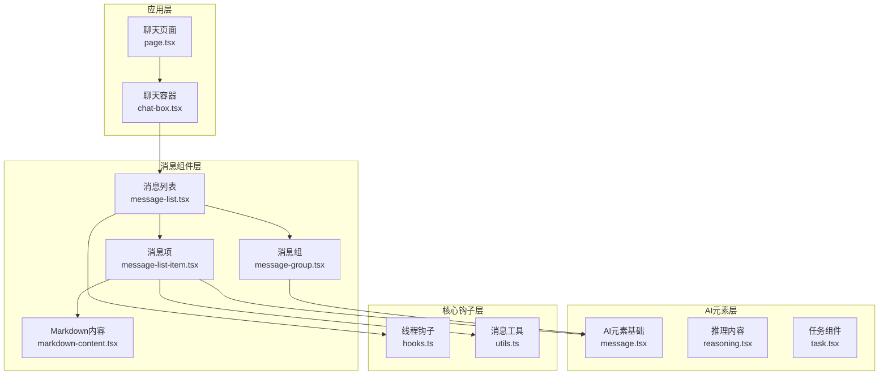
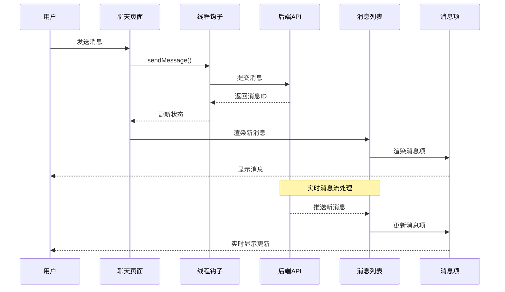
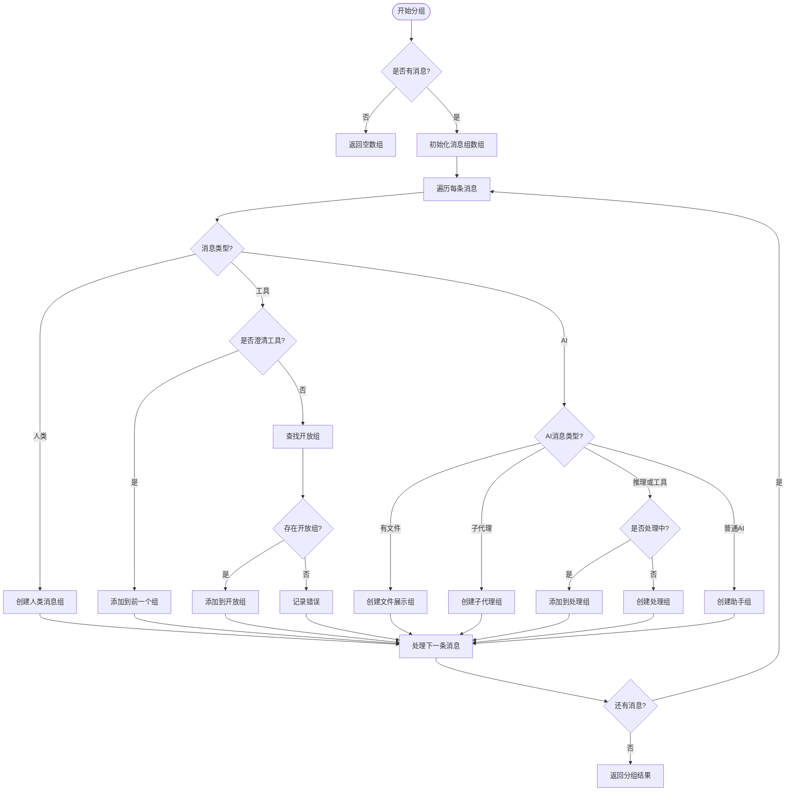
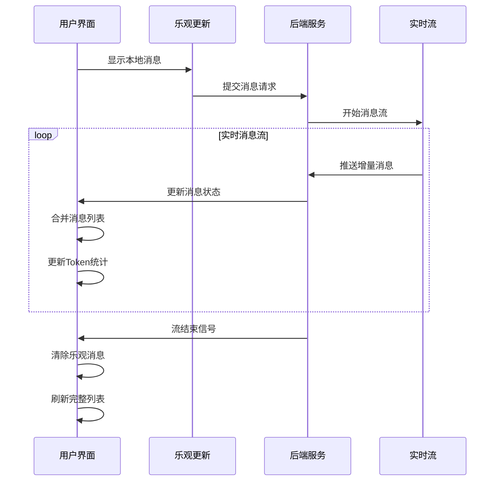
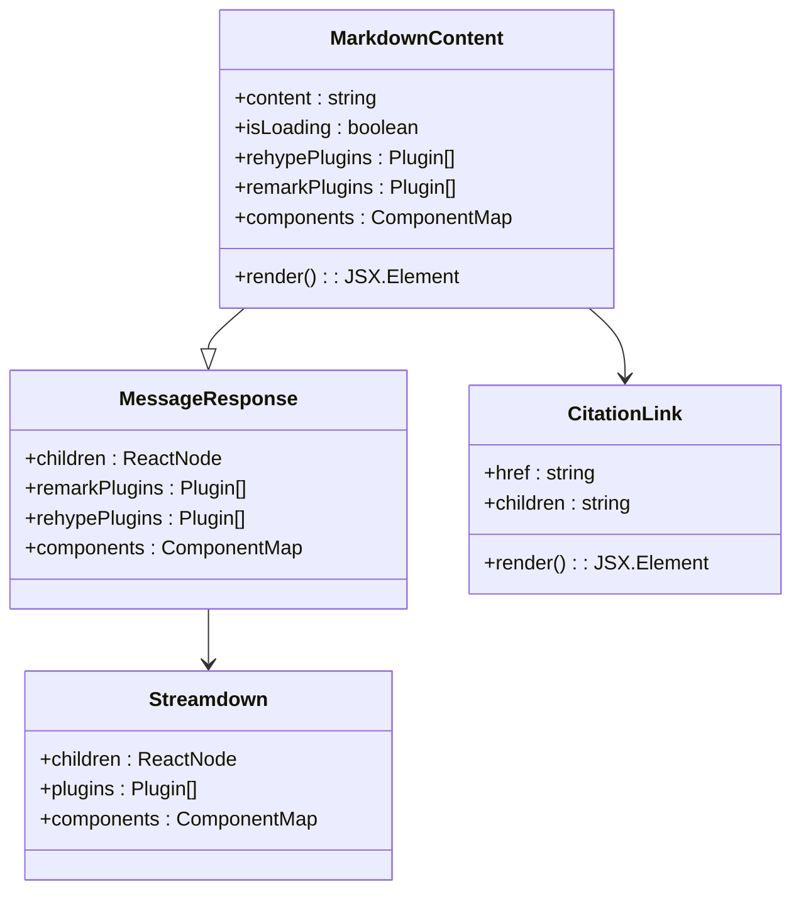
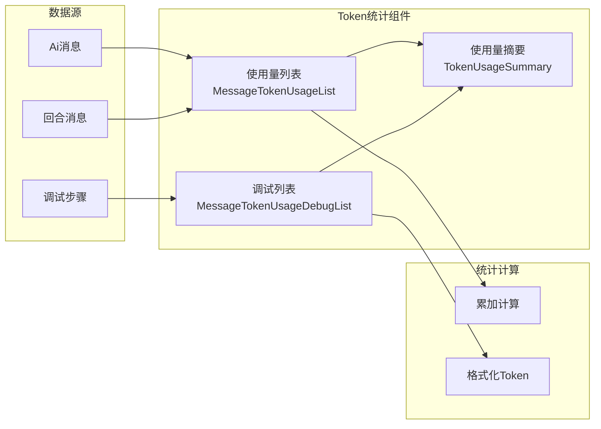
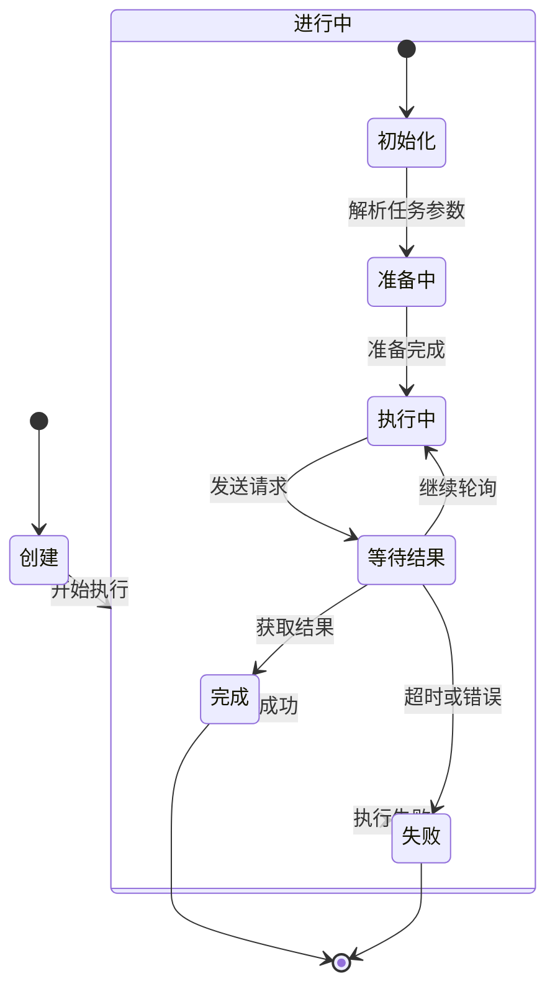
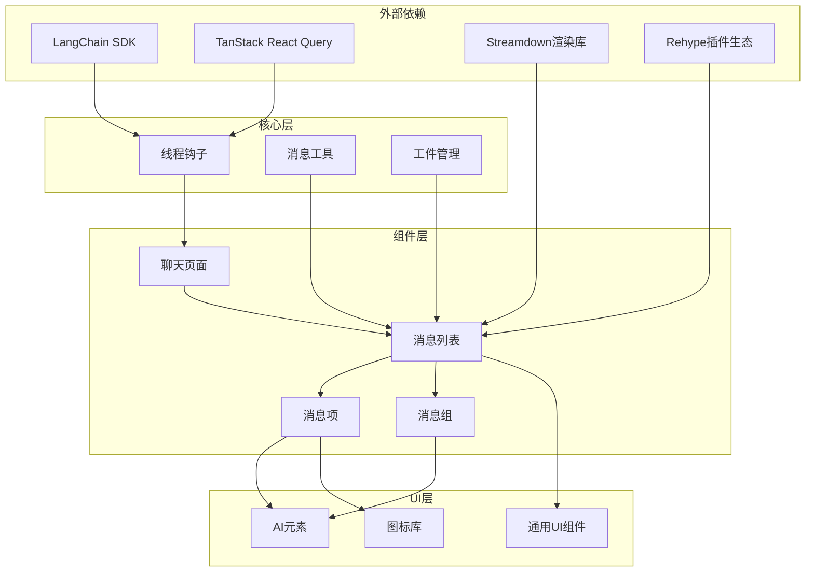
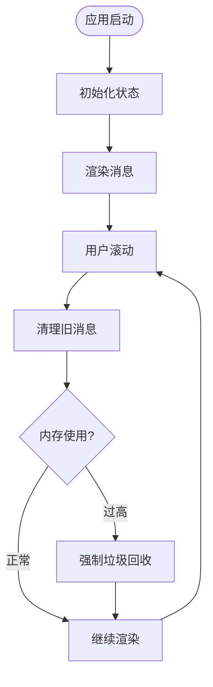

# 线程详情展示

<cite>
**本文档引用的文件**
- [frontend/src/app/workspace/chats/[thread_id]/page.tsx](file://frontend/src/app/workspace/chats/[thread_id]/page.tsx)
- [frontend/src/components/workspace/messages/message-list.tsx](file://frontend/src/components/workspace/messages/message-list.tsx)
- [frontend/src/components/workspace/messages/message-list-item.tsx](file://frontend/src/components/workspace/messages/message-list-item.tsx)
- [frontend/src/components/workspace/messages/message-group.tsx](file://frontend/src/components/workspace/messages/message-group.tsx)
- [frontend/src/components/workspace/messages/markdown-content.tsx](file://frontend/src/components/workspace/messages/markdown-content.tsx)
- [frontend/src/components/workspace/messages/message-token-usage.tsx](file://frontend/src/components/workspace/messages/message-token-usage.tsx)
- [frontend/src/components/workspace/messages/subtask-card.tsx](file://frontend/src/components/workspace/messages/subtask-card.tsx)
- [frontend/src/components/workspace/messages/skeleton.tsx](file://frontend/src/components/workspace/messages/skeleton.tsx)
- [frontend/src/components/ai-elements/message.tsx](file://frontend/src/components/ai-elements/message.tsx)
- [frontend/src/core/threads/hooks.ts](file://frontend/src/core/threads/hooks.ts)
- [frontend/src/core/messages/utils.ts](file://frontend/src/core/messages/utils.ts)
</cite>

## 目录
1. [简介](#简介)
2. [项目结构](#项目结构)
3. [核心组件](#核心组件)
4. [架构概览](#架构概览)
5. [详细组件分析](#详细组件分析)
6. [依赖关系分析](#依赖关系分析)
7. [性能考虑](#性能考虑)
8. [故障排除指南](#故障排除指南)
9. [结论](#结论)
10. [附录](#附录)

## 简介

DeerFlow 线程详情展示功能是一个完整的对话历史记录和实时消息渲染系统。该功能提供了丰富的消息类型支持、智能的历史加载机制、实时消息流处理以及强大的内容格式化能力。

本系统的核心特性包括：
- 多种消息类型的智能分组和渲染
- 实时消息流的乐观更新机制
- 历史消息的无限滚动加载
- Markdown 内容的高级渲染支持
- 代码块的语法高亮和数学公式渲染
- Token 使用量的可视化统计
- 子任务执行状态的实时跟踪

## 项目结构

前端采用模块化的组件架构，线程详情展示功能主要分布在以下目录：



**图表来源**
- [frontend/src/app/workspace/chats/[thread_id]/page.tsx:1-257](file://frontend/src/app/workspace/chats/[thread_id]/page.tsx#L1-L257)
- [frontend/src/components/workspace/messages/message-list.tsx:1-520](file://frontend/src/components/workspace/messages/message-list.tsx#L1-L520)

**章节来源**
- [frontend/src/app/workspace/chats/[thread_id]/page.tsx:1-257](file://frontend/src/app/workspace/chats/[thread_id]/page.tsx#L1-L257)
- [frontend/src/components/workspace/messages/message-list.tsx:1-520](file://frontend/src/components/workspace/messages/message-list.tsx#L1-L520)

## 核心组件

### 聊天页面组件

聊天页面是整个线程详情展示功能的入口点，负责协调各个子组件的工作。

**关键功能**：
- 线程状态管理
- 实时消息流处理
- 历史消息加载控制
- 用户交互事件处理

### 消息列表组件

消息列表组件是核心渲染组件，负责将消息数据转换为用户界面。

**主要特性**：
- 智能消息分组算法
- 无限滚动加载机制
- 乐观更新显示
- Token 使用量统计

### 消息项组件

每个消息项负责单个消息的渲染和交互。

**支持的消息类型**：
- 用户消息（人类）
- 助手回复（AI）
- 推理内容
- 文件附件
- 子任务状态

**章节来源**
- [frontend/src/app/workspace/chats/[thread_id]/page.tsx:33-256](file://frontend/src/app/workspace/chats/[thread_id]/page.tsx#L33-L256)
- [frontend/src/components/workspace/messages/message-list.tsx:158-520](file://frontend/src/components/workspace/messages/message-list.tsx#L158-L520)
- [frontend/src/components/workspace/messages/message-list-item.tsx:379-464](file://frontend/src/components/workspace/messages/message-list-item.tsx#L379-L464)

## 架构概览

系统采用分层架构设计，确保了良好的可维护性和扩展性：



**图表来源**
- [frontend/src/core/threads/hooks.ts:380-574](file://frontend/src/core/threads/hooks.ts#L380-L574)
- [frontend/src/components/workspace/messages/message-list.tsx:288-518](file://frontend/src/components/workspace/messages/message-list.tsx#L288-L518)

系统架构的关键特点：
- **响应式数据流**：从后端到前端的实时数据流
- **乐观更新**：提升用户体验的即时反馈机制
- **智能缓存**：基于消息ID的去重和合并策略
- **错误处理**：完善的异常捕获和恢复机制

## 详细组件分析

### 消息分组算法

消息分组是系统的核心算法，负责将连续的消息序列转换为有意义的组：



**图表来源**
- [frontend/src/core/messages/utils.ts:29-125](file://frontend/src/core/messages/utils.ts#L29-L125)

**章节来源**
- [frontend/src/core/messages/utils.ts:29-125](file://frontend/src/core/messages/utils.ts#L29-L125)

### 实时消息流处理

系统实现了复杂的实时消息流处理机制，确保用户能够获得最佳的交互体验：



**图表来源**
- [frontend/src/core/threads/hooks.ts:318-378](file://frontend/src/core/threads/hooks.ts#L318-L378)
- [frontend/src/core/threads/hooks.ts:380-574](file://frontend/src/core/threads/hooks.ts#L380-L574)

**章节来源**
- [frontend/src/core/threads/hooks.ts:318-378](file://frontend/src/core/threads/hooks.ts#L318-L378)
- [frontend/src/core/threads/hooks.ts:380-574](file://frontend/src/core/threads/hooks.ts#L380-L574)

### Markdown 内容渲染

系统提供了强大的 Markdown 内容渲染能力，支持多种格式化选项：



**图表来源**
- [frontend/src/components/workspace/messages/markdown-content.tsx:29-76](file://frontend/src/components/workspace/messages/markdown-content.tsx#L29-L76)
- [frontend/src/components/ai-elements/message.tsx:307-320](file://frontend/src/components/ai-elements/message.tsx#L307-L320)

**章节来源**
- [frontend/src/components/workspace/messages/markdown-content.tsx:29-76](file://frontend/src/components/workspace/messages/markdown-content.tsx#L29-L76)
- [frontend/src/components/ai-elements/message.tsx:307-320](file://frontend/src/components/ai-elements/message.tsx#L307-L320)

### Token 使用量统计

系统提供了详细的 Token 使用量统计功能，帮助用户理解模型的资源消耗：



**图表来源**
- [frontend/src/components/workspace/messages/message-token-usage.tsx:55-165](file://frontend/src/components/workspace/messages/message-token-usage.tsx#L55-L165)

**章节来源**
- [frontend/src/components/workspace/messages/message-token-usage.tsx:55-165](file://frontend/src/components/workspace/messages/message-token-usage.tsx#L55-L165)

### 子任务状态跟踪

系统支持复杂的子任务执行状态跟踪，提供实时的任务进度显示：



**图表来源**
- [frontend/src/components/workspace/messages/subtask-card.tsx:32-178](file://frontend/src/components/workspace/messages/subtask-card.tsx#L32-L178)

**章节来源**
- [frontend/src/components/workspace/messages/subtask-card.tsx:32-178](file://frontend/src/components/workspace/messages/subtask-card.tsx#L32-L178)

## 依赖关系分析

系统的依赖关系呈现清晰的层次结构：



**图表来源**
- [frontend/src/core/threads/hooks.ts:1-28](file://frontend/src/core/threads/hooks.ts#L1-L28)
- [frontend/src/components/workspace/messages/message-list.tsx:1-48](file://frontend/src/components/workspace/messages/message-list.tsx#L1-L48)

**章节来源**
- [frontend/src/core/threads/hooks.ts:1-28](file://frontend/src/core/threads/hooks.ts#L1-L28)
- [frontend/src/components/workspace/messages/message-list.tsx:1-48](file://frontend/src/components/workspace/messages/message-list.tsx#L1-L48)

## 性能考虑

### 渲染优化策略

系统采用了多种性能优化技术：

1. **虚拟滚动**：对于大量消息的场景，使用虚拟滚动减少DOM节点数量
2. **组件记忆化**：使用 React.memo 和 useMemo 避免不必要的重新渲染
3. **懒加载**：图片和文件内容按需加载
4. **防抖节流**：滚动事件和窗口大小变化的处理

### 内存管理



### 缓存策略

系统实现了多层次的缓存机制：
- **消息缓存**：避免重复渲染相同的消息
- **组件缓存**：缓存已渲染的组件实例
- **网络缓存**：利用 HTTP 缓存头减少网络请求

## 故障排除指南

### 常见问题及解决方案

**问题1：消息不显示或显示异常**
- 检查消息格式是否正确
- 验证消息ID的唯一性
- 确认消息类型映射表

**问题2：实时消息流中断**
- 检查网络连接状态
- 验证服务器连接配置
- 查看浏览器控制台错误信息

**问题3：性能问题**
- 检查消息数量是否过多
- 验证组件渲染优化设置
- 监控内存使用情况

**章节来源**
- [frontend/src/core/threads/hooks.ts:296-315](file://frontend/src/core/threads/hooks.ts#L296-L315)

### 调试工具

系统提供了丰富的调试工具：
- **开发者工具**：内置的调试面板
- **日志系统**：详细的事件日志记录
- **性能监控**：实时性能指标显示

## 结论

DeerFlow 线程详情展示功能通过精心设计的架构和实现，为用户提供了强大而流畅的对话体验。系统的主要优势包括：

1. **高度模块化**：清晰的组件分离和职责划分
2. **强大的扩展性**：灵活的插件系统和自定义能力
3. **优秀的性能**：优化的渲染策略和内存管理
4. **完善的错误处理**：健壮的异常捕获和恢复机制

该系统为后续的功能扩展奠定了坚实的基础，包括支持更多消息类型、增强实时协作功能、集成更多第三方服务等。

## 附录

### 组件使用示例

**基本消息列表使用**：
```typescript
<MessageList
  threadId={threadId}
  thread={thread}
  hasMoreHistory={hasMoreHistory}
  loadMoreHistory={loadMoreHistory}
/>
```

**自定义消息渲染**：
```typescript
<MessageListItem
  message={message}
  threadId={threadId}
  components={{
    code: MyCodeComponent,
    img: MyImageComponent
  }}
/>
```

### 扩展开发指南

**添加新的消息类型**：
1. 在消息工具中添加类型检测函数
2. 在消息分组算法中添加分组逻辑
3. 创建对应的渲染组件
4. 更新样式和交互逻辑

**集成新的渲染插件**：
1. 在插件配置中添加新插件
2. 更新组件的插件属性
3. 测试插件的兼容性
4. 添加相应的样式支持