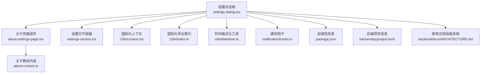
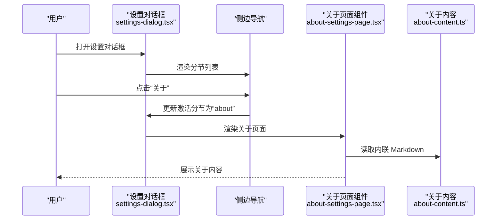
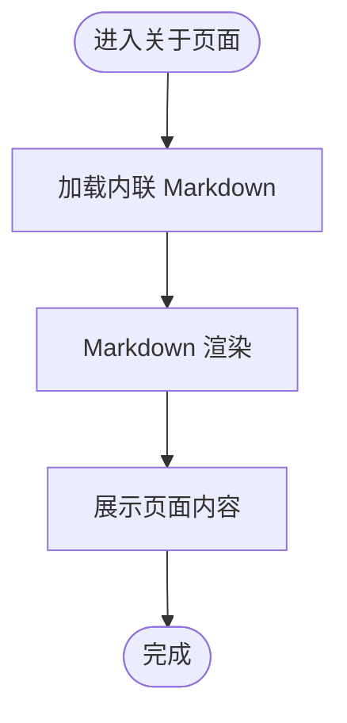
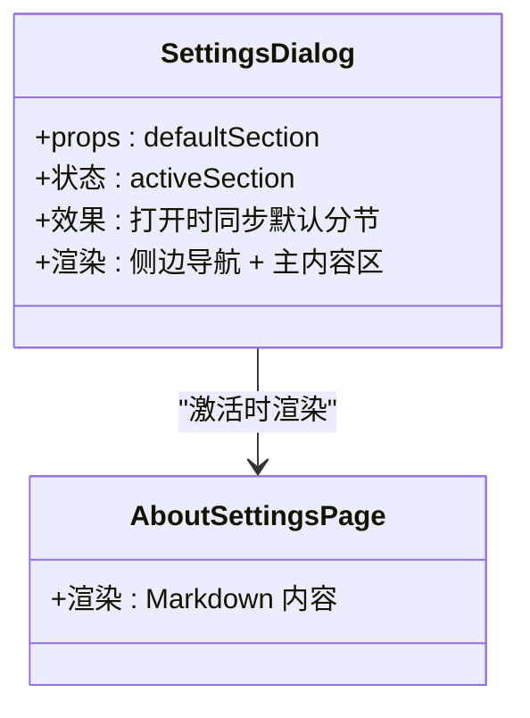
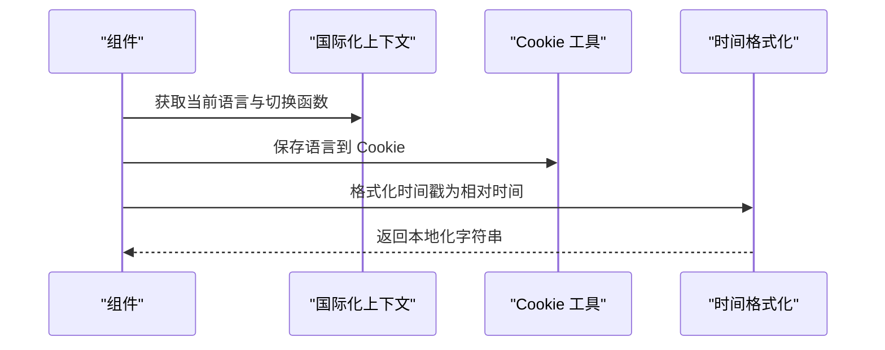
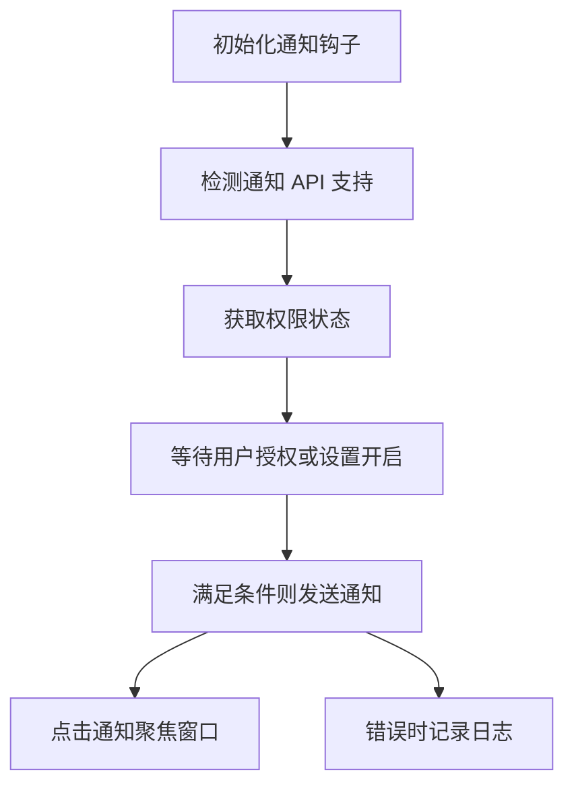
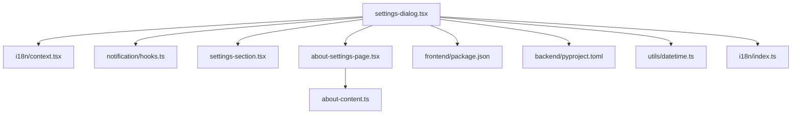

# 关于设置

<cite>
**本文引用的文件**
- [frontend/src/components/workspace/settings/about-settings-page.tsx](file://frontend/src/components/workspace/settings/about-settings-page.tsx)
- [frontend/src/components/workspace/settings/about-content.ts](file://frontend/src/components/workspace/settings/about-content.ts)
- [frontend/src/components/workspace/settings/settings-dialog.tsx](file://frontend/src/components/workspace/settings/settings-dialog.tsx)
- [frontend/src/components/workspace/settings/settings-section.tsx](file://frontend/src/components/workspace/settings/settings-section.tsx)
- [frontend/src/core/i18n/index.ts](file://frontend/src/core/i18n/index.ts)
- [frontend/src/core/i18n/context.tsx](file://frontend/src/core/i18n/context.tsx)
- [frontend/src/core/i18n/cookies.ts](file://frontend/src/core/i18n/cookies.ts)
- [frontend/src/core/utils/datetime.ts](file://frontend/src/core/utils/datetime.ts)
- [frontend/src/core/notification/hooks.ts](file://frontend/src/core/notification/hooks.ts)
- [frontend/package.json](file://frontend/package.json)
- [backend/pyproject.toml](file://backend/pyproject.toml)
- [backend/docs/ARCHITECTURE.md](file://backend/docs/ARCHITECTURE.md)
</cite>

## 目录
1. [简介](#简介)
2. [项目结构](#项目结构)
3. [核心组件](#核心组件)
4. [架构总览](#架构总览)
5. [详细组件分析](#详细组件分析)
6. [依赖关系分析](#依赖关系分析)
7. [性能考量](#性能考量)
8. [故障排查指南](#故障排查指南)
9. [结论](#结论)
10. [附录](#附录)

## 简介
本文件聚焦 DeerFlow 设置模块中的“关于”页面，系统性梳理版本信息显示、系统信息查看、许可证信息展示、软件版本检查与更新通知、帮助文档链接、系统要求与兼容性、第三方依赖列表，以及关于页面的静态内容管理与版本号获取逻辑。文档以前端设置对话框为入口，串联前端国际化、通知、时间格式化等基础设施，并结合后端项目元数据，给出可操作的实现细节与最佳实践。

## 项目结构
设置模块围绕一个可复用的设置对话框展开，其中“关于”页面作为独立页面组件被加载。该结构支持多语言切换、主题切换、通知权限控制与本地存储等能力，同时通过静态 Markdown 内容实现关于页的信息展示。

图表来源
- [frontend/src/components/workspace/settings/settings-dialog.tsx:1-154](file://frontend/src/components/workspace/settings/settings-dialog.tsx#L1-L154)
- [frontend/src/components/workspace/settings/about-settings-page.tsx:1-10](file://frontend/src/components/workspace/settings/about-settings-page.tsx#L1-L10)
- [frontend/src/components/workspace/settings/about-content.ts:1-68](file://frontend/src/components/workspace/settings/about-content.ts#L1-L68)
- [frontend/src/components/workspace/settings/settings-section.tsx:1-26](file://frontend/src/components/workspace/settings/settings-section.tsx#L1-L26)
- [frontend/src/core/i18n/context.tsx:1-41](file://frontend/src/core/i18n/context.tsx#L1-L41)
- [frontend/src/core/i18n/index.ts:1-12](file://frontend/src/core/i18n/index.ts#L1-L12)
- [frontend/src/core/utils/datetime.ts:1-27](file://frontend/src/core/utils/datetime.ts#L1-L27)
- [frontend/src/core/notification/hooks.ts:1-98](file://frontend/src/core/notification/hooks.ts#L1-L98)
- [frontend/package.json:1-118](file://frontend/package.json#L1-L118)
- [backend/pyproject.toml:1-52](file://backend/pyproject.toml#L1-L52)
- [backend/docs/ARCHITECTURE.md:305-342](file://backend/docs/ARCHITECTURE.md#L305-L342)

章节来源
- [frontend/src/components/workspace/settings/settings-dialog.tsx:1-154](file://frontend/src/components/workspace/settings/settings-dialog.tsx#L1-L154)
- [frontend/src/components/workspace/settings/about-settings-page.tsx:1-10](file://frontend/src/components/workspace/settings/about-settings-page.tsx#L1-L10)
- [frontend/src/components/workspace/settings/about-content.ts:1-68](file://frontend/src/components/workspace/settings/about-content.ts#L1-L68)

## 核心组件
- 设置对话框：负责渲染设置侧边栏与主内容区，根据当前激活分节动态加载对应页面组件；支持默认分节参数与打开时的状态同步。
- 关于页面组件：使用 Markdown 渲染器展示静态内容，内容来自内联 Markdown 字符串。
- 设置分节容器：统一的标题与描述布局包装器，便于在各设置页中复用。
- 国际化上下文与工具：提供语言检测、Cookie 存取、主题切换与本地化时间格式化。
- 通知钩子：封装浏览器通知 API 的权限请求与发送逻辑，受本地设置开关控制。
- 包信息与项目元数据：前端 package.json 与后端 pyproject.toml 提供版本号与依赖信息来源。

章节来源
- [frontend/src/components/workspace/settings/settings-dialog.tsx:31-93](file://frontend/src/components/workspace/settings/settings-dialog.tsx#L31-L93)
- [frontend/src/components/workspace/settings/about-settings-page.tsx:7-9](file://frontend/src/components/workspace/settings/about-settings-page.tsx#L7-L9)
- [frontend/src/components/workspace/settings/settings-section.tsx:3-24](file://frontend/src/components/workspace/settings/settings-section.tsx#L3-L24)
- [frontend/src/core/i18n/context.tsx:12-32](file://frontend/src/core/i18n/context.tsx#L12-L32)
- [frontend/src/core/notification/hooks.ts:22-98](file://frontend/src/core/notification/hooks.ts#L22-L98)
- [frontend/package.json:3-4](file://frontend/package.json#L3-L4)
- [backend/pyproject.toml:2-3](file://backend/pyproject.toml#L2-L3)

## 架构总览
设置对话框采用“侧边导航 + 主内容区”的双栏布局，侧边导航项包含账户、外观、通知、记忆、工具、技能与关于等分节。点击分节时，主内容区根据当前激活状态渲染对应页面组件。关于页面通过 Markdown 渲染器展示静态内容，避免额外资源加载。

图表来源
- [frontend/src/components/workspace/settings/settings-dialog.tsx:109-146](file://frontend/src/components/workspace/settings/settings-dialog.tsx#L109-L146)
- [frontend/src/components/workspace/settings/about-settings-page.tsx:7-9](file://frontend/src/components/workspace/settings/about-settings-page.tsx#L7-L9)
- [frontend/src/components/workspace/settings/about-content.ts:5-6](file://frontend/src/components/workspace/settings/about-content.ts#L5-L6)

## 详细组件分析

### 关于页面组件与静态内容管理
- 组件职责：接收内联 Markdown 字符串并交由 Markdown 渲染器展示，避免对原始资源的依赖。
- 内容组织：包含项目介绍、特性概览、GitHub 仓库、官网、支持邮箱、许可证、致谢与特别感谢等。
- 版本号来源：关于内容中包含项目名称与链接，版本号通常来源于前端与后端的包信息文件。

图表来源
- [frontend/src/components/workspace/settings/about-settings-page.tsx:7-9](file://frontend/src/components/workspace/settings/about-settings-page.tsx#L7-L9)
- [frontend/src/components/workspace/settings/about-content.ts:5-68](file://frontend/src/components/workspace/settings/about-content.ts#L5-L68)

章节来源
- [frontend/src/components/workspace/settings/about-settings-page.tsx:1-10](file://frontend/src/components/workspace/settings/about-settings-page.tsx#L1-L10)
- [frontend/src/components/workspace/settings/about-content.ts:1-68](file://frontend/src/components/workspace/settings/about-content.ts#L1-L68)

### 设置对话框与分节导航
- 分节定义：侧边导航包含账户、外观、通知、记忆、工具、技能与关于等分节，图标与标签通过国际化文本提供。
- 激活状态：通过状态管理维护当前激活分节，打开对话框时可跟随调用方传入的默认分节。
- 动态渲染：根据激活分节在主内容区渲染对应页面组件，包括关于页面。

图表来源
- [frontend/src/components/workspace/settings/settings-dialog.tsx:44-93](file://frontend/src/components/workspace/settings/settings-dialog.tsx#L44-L93)
- [frontend/src/components/workspace/settings/about-settings-page.tsx:7-9](file://frontend/src/components/workspace/settings/about-settings-page.tsx#L7-L9)

章节来源
- [frontend/src/components/workspace/settings/settings-dialog.tsx:31-93](file://frontend/src/components/workspace/settings/settings-dialog.tsx#L31-L93)

### 国际化与本地化
- 国际化上下文：提供语言切换与 Cookie 存取，确保语言偏好持久化。
- 时间格式化：基于日期库按语言环境输出相对时间，支持 zh-CN 与 en-US。
- 设置文本：分节标题与描述通过国际化键值提供，保证多语言一致性。

图表来源
- [frontend/src/core/i18n/context.tsx:21-26](file://frontend/src/core/i18n/context.tsx#L21-L26)
- [frontend/src/core/i18n/cookies.ts:11-36](file://frontend/src/core/i18n/cookies.ts#L11-L36)
- [frontend/src/core/utils/datetime.ts:17-26](file://frontend/src/core/utils/datetime.ts#L17-L26)

章节来源
- [frontend/src/core/i18n/context.tsx:1-41](file://frontend/src/core/i18n/context.tsx#L1-L41)
- [frontend/src/core/i18n/cookies.ts:1-52](file://frontend/src/core/i18n/cookies.ts#L1-L52)
- [frontend/src/core/utils/datetime.ts:1-27](file://frontend/src/core/utils/datetime.ts#L1-L27)

### 通知与更新提示
- 权限与支持检测：在挂载时检测浏览器通知 API 支持与权限状态。
- 发送控制：受本地设置开关与频率限制控制，仅在权限已授予且满足条件时发送。
- 用户交互：通知点击时聚焦窗口并关闭通知，错误时记录日志。

图表来源
- [frontend/src/core/notification/hooks.ts:29-90](file://frontend/src/core/notification/hooks.ts#L29-L90)

章节来源
- [frontend/src/core/notification/hooks.ts:1-98](file://frontend/src/core/notification/hooks.ts#L1-L98)

### 版本信息与系统信息
- 前端版本：前端 package.json 中的版本字段用于标识前端构建版本。
- 后端版本：后端 pyproject.toml 中的版本字段用于标识后端服务版本。
- 系统要求：后端 requires-python 指定最低 Python 版本要求。
- 兼容性：前端 Next.js 与 React 版本需满足工程约束；后端依赖版本由 pyproject.toml 管控。

章节来源
- [frontend/package.json:3-4](file://frontend/package.json#L3-L4)
- [backend/pyproject.toml:6-6](file://backend/pyproject.toml#L6-L6)
- [backend/pyproject.toml:2-3](file://backend/pyproject.toml#L2-L3)

### 许可证信息与第三方依赖
- 许可证：关于页面明确声明项目采用 MIT 许可证。
- 第三方依赖：前端 package.json 列出运行时依赖；后端 pyproject.toml 列出 Python 依赖；技能系统文档展示公共技能的许可与工具清单。

章节来源
- [frontend/src/components/workspace/settings/about-content.ts:39-43](file://frontend/src/components/workspace/settings/about-content.ts#L39-L43)
- [frontend/package.json:21-92](file://frontend/package.json#L21-L92)
- [backend/pyproject.toml:7-26](file://backend/pyproject.toml#L7-L26)
- [backend/docs/ARCHITECTURE.md:327-341](file://backend/docs/ARCHITECTURE.md#L327-L341)

### 帮助文档链接
- 官方网站与支持邮箱：关于页面提供官网链接与支持邮箱，便于用户获取帮助与反馈。
- 技能系统文档：后端架构文档提供技能系统的目录结构与 SKILL.md 规范，有助于理解扩展与集成。

章节来源
- [frontend/src/components/workspace/settings/about-content.ts:29-35](file://frontend/src/components/workspace/settings/about-content.ts#L29-L35)
- [backend/docs/ARCHITECTURE.md:305-342](file://backend/docs/ARCHITECTURE.md#L305-L342)

## 依赖关系分析
设置模块与基础设施之间的依赖关系如下：

图表来源
- [frontend/src/components/workspace/settings/settings-dialog.tsx:1-154](file://frontend/src/components/workspace/settings/settings-dialog.tsx#L1-L154)
- [frontend/src/components/workspace/settings/about-settings-page.tsx:1-10](file://frontend/src/components/workspace/settings/about-settings-page.tsx#L1-L10)
- [frontend/src/components/workspace/settings/about-content.ts:1-68](file://frontend/src/components/workspace/settings/about-content.ts#L1-L68)
- [frontend/src/components/workspace/settings/settings-section.tsx:1-26](file://frontend/src/components/workspace/settings/settings-section.tsx#L1-L26)
- [frontend/src/core/i18n/context.tsx:1-41](file://frontend/src/core/i18n/context.tsx#L1-L41)
- [frontend/src/core/notification/hooks.ts:1-98](file://frontend/src/core/notification/hooks.ts#L1-L98)
- [frontend/src/core/utils/datetime.ts:1-27](file://frontend/src/core/utils/datetime.ts#L1-L27)
- [frontend/src/core/i18n/index.ts:1-12](file://frontend/src/core/i18n/index.ts#L1-L12)
- [frontend/package.json:1-118](file://frontend/package.json#L1-L118)
- [backend/pyproject.toml:1-52](file://backend/pyproject.toml#L1-L52)

章节来源
- [frontend/src/components/workspace/settings/settings-dialog.tsx:1-154](file://frontend/src/components/workspace/settings/settings-dialog.tsx#L1-L154)
- [frontend/src/components/workspace/settings/about-settings-page.tsx:1-10](file://frontend/src/components/workspace/settings/about-settings-page.tsx#L1-L10)
- [frontend/src/components/workspace/settings/about-content.ts:1-68](file://frontend/src/components/workspace/settings/about-content.ts#L1-L68)
- [frontend/src/components/workspace/settings/settings-section.tsx:1-26](file://frontend/src/components/workspace/settings/settings-section.tsx#L1-L26)
- [frontend/src/core/i18n/context.tsx:1-41](file://frontend/src/core/i18n/context.tsx#L1-L41)
- [frontend/src/core/notification/hooks.ts:1-98](file://frontend/src/core/notification/hooks.ts#L1-L98)
- [frontend/src/core/utils/datetime.ts:1-27](file://frontend/src/core/utils/datetime.ts#L1-L27)
- [frontend/src/core/i18n/index.ts:1-12](file://frontend/src/core/i18n/index.ts#L1-L12)
- [frontend/package.json:1-118](file://frontend/package.json#L1-L118)
- [backend/pyproject.toml:1-52](file://backend/pyproject.toml#L1-L52)

## 性能考量
- 渲染优化：关于页面使用内联 Markdown，避免额外网络请求，提升首屏渲染速度。
- 通知节流：通知发送存在时间间隔限制，防止频繁触发导致性能与体验问题。
- 本地化缓存：语言与时间格式化依赖本地 Cookie 与日期库，减少重复计算与网络依赖。
- 组件懒加载：设置对话框按需渲染对应页面组件，避免一次性加载所有设置页。

## 故障排查指南
- 通知不弹出
  - 检查浏览器是否支持通知 API，确认权限状态为已授予。
  - 确认本地设置中通知开关已启用。
  - 查看控制台是否有错误日志。
- 语言切换无效
  - 检查 Cookie 是否正确写入与读取。
  - 确认国际化上下文是否在应用根部正确提供。
- 关于页面空白
  - 确认 Markdown 渲染器可用，内联内容未被破坏。
  - 检查关于页面组件是否被正确渲染。
- 版本号显示异常
  - 前端版本号来自 package.json；后端版本号来自 pyproject.toml。
  - 若版本号不一致，检查构建与部署流程是否同步更新。

章节来源
- [frontend/src/core/notification/hooks.ts:29-90](file://frontend/src/core/notification/hooks.ts#L29-L90)
- [frontend/src/core/i18n/cookies.ts:11-36](file://frontend/src/core/i18n/cookies.ts#L11-L36)
- [frontend/src/core/i18n/context.tsx:21-26](file://frontend/src/core/i18n/context.tsx#L21-L26)
- [frontend/src/components/workspace/settings/about-settings-page.tsx:7-9](file://frontend/src/components/workspace/settings/about-settings-page.tsx#L7-L9)
- [frontend/package.json:3-4](file://frontend/package.json#L3-L4)
- [backend/pyproject.toml:2-3](file://backend/pyproject.toml#L2-L3)

## 结论
设置模块的“关于”页面通过内联 Markdown 实现静态内容管理，结合国际化、通知与时间格式化等基础设施，提供了清晰、可维护的版本与系统信息展示方案。前端与后端的版本信息分别来源于各自的包配置文件，许可证与第三方依赖在关于页面与项目元数据中有明确标注。整体设计遵循低耦合、高内聚的原则，便于扩展与维护。

## 附录
- 关于页面内容要点
  - 项目介绍与核心特性
  - GitHub 仓库与官网链接
  - 支持邮箱
  - 许可证（MIT）
  - 致谢与特别感谢
- 版本号获取建议
  - 前端：从 package.json 的 version 字段读取
  - 后端：从 pyproject.toml 的 version 字段读取
- 系统要求与兼容性
  - 后端：Python >= 指定版本
  - 前端：Next.js 与 React 版本需满足工程约束
- 第三方依赖清单
  - 前端：参考 package.json 的 dependencies
  - 后端：参考 pyproject.toml 的 dependencies
  - 技能系统：参考 ARCHITECTURE.md 中的 SKILL.md 规范与示例

章节来源
- [frontend/src/components/workspace/settings/about-content.ts:1-68](file://frontend/src/components/workspace/settings/about-content.ts#L1-L68)
- [frontend/package.json:21-92](file://frontend/package.json#L21-L92)
- [backend/pyproject.toml:7-26](file://backend/pyproject.toml#L7-L26)
- [backend/docs/ARCHITECTURE.md:327-341](file://backend/docs/ARCHITECTURE.md#L327-L341)