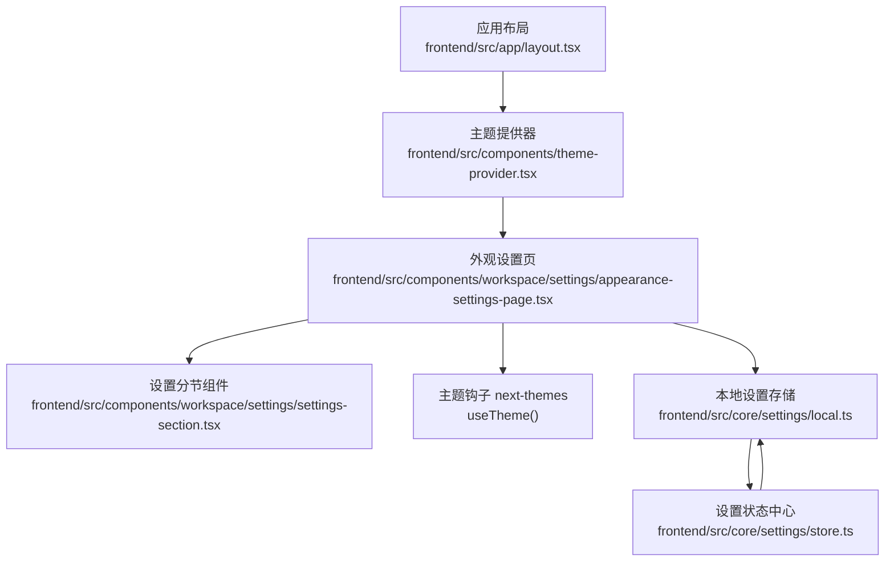
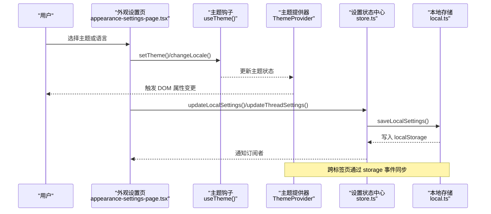
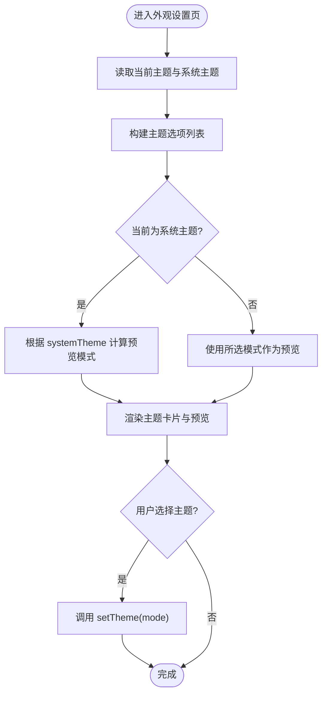
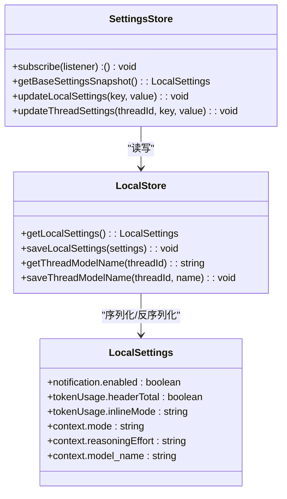
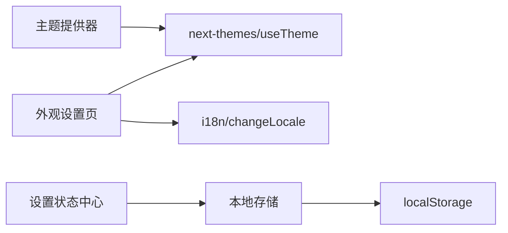

# 外观设置

<cite>
**本文档引用的文件**
- [frontend/src/app/layout.tsx](file://frontend/src/app/layout.tsx)
- [frontend/src/components/theme-provider.tsx](file://frontend/src/components/theme-provider.tsx)
- [frontend/src/components/workspace/settings/appearance-settings-page.tsx](file://frontend/src/components/workspace/settings/appearance-settings-page.tsx)
- [frontend/src/components/workspace/settings/settings-section.tsx](file://frontend/src/components/workspace/settings/settings-section.tsx)
- [frontend/src/core/settings/store.ts](file://frontend/src/core/settings/store.ts)
- [frontend/src/core/settings/local.ts](file://frontend/src/core/settings/local.ts)
- [frontend/src/components/workspace/code-editor.tsx](file://frontend/src/components/workspace/code-editor.tsx)
- [frontend/public/demo/threads/7cfa5f8f-a2f8-47ad-acbd-da7137baf990/user-data/outputs/style.css](file://frontend/public/demo/threads/7cfa5f8f-a2f8-47ad-acbd-da7137baf990/user-data/outputs/style.css)
- [frontend/public/demo/threads/5aa47db1-d0cb-4eb9-aea5-3dac1b371c5a/user-data/outputs/jiangsu-football/css/style.css](file://frontend/public/demo/threads/5aa47db1-d0cb-4eb9-aea5-3dac1b371c5a/user-data/outputs/jiangsu-football/css/style.css)
</cite>

## 目录
1. [简介](#简介)
2. [项目结构](#项目结构)
3. [核心组件](#核心组件)
4. [架构总览](#架构总览)
5. [详细组件分析](#详细组件分析)
6. [依赖关系分析](#依赖关系分析)
7. [性能考虑](#性能考虑)
8. [故障排除指南](#故障排除指南)
9. [结论](#结论)

## 简介
本文件系统性梳理 DeerFlow 的外观设置模块，涵盖主题切换机制（深色/浅色/跟随系统）、颜色方案与视觉变量、界面布局与排版、字体与间距配置，以及状态管理、持久化存储与实时预览的实现细节。文档同时提供可视化图示，帮助开发者快速理解各模块职责与交互流程。

## 项目结构
外观设置涉及前端三层：应用层负责全局主题注入与国际化；设置页面负责用户交互与主题选择；核心设置模块负责本地状态订阅、合并与持久化。

图表来源
- [frontend/src/app/layout.tsx:15-28](file://frontend/src/app/layout.tsx#L15-L28)
- [frontend/src/components/theme-provider.tsx:6-19](file://frontend/src/components/theme-provider.tsx#L6-L19)
- [frontend/src/components/workspace/settings/appearance-settings-page.tsx:26-112](file://frontend/src/components/workspace/settings/appearance-settings-page.tsx#L26-L112)
- [frontend/src/core/settings/local.ts:109-129](file://frontend/src/core/settings/local.ts#L109-L129)
- [frontend/src/core/settings/store.ts:118-125](file://frontend/src/core/settings/store.ts#L118-L125)

章节来源
- [frontend/src/app/layout.tsx:15-28](file://frontend/src/app/layout.tsx#L15-L28)
- [frontend/src/components/theme-provider.tsx:6-19](file://frontend/src/components/theme-provider.tsx#L6-L19)
- [frontend/src/components/workspace/settings/appearance-settings-page.tsx:26-112](file://frontend/src/components/workspace/settings/appearance-settings-page.tsx#L26-L112)

## 核心组件
- 主题提供器：在根布局中注入 next-themes，支持系统主题检测与强制主题（如首页强制深色）。
- 外观设置页：提供主题选项卡片与语言选择下拉，使用 useTheme 控制主题并实时预览。
- 设置分节组件：统一设置页面的标题与描述展示。
- 本地设置存储：定义默认设置、键名常量、线程模型键前缀与本地持久化逻辑。
- 设置状态中心：提供订阅、快照读取、更新合并与跨标签页同步。

章节来源
- [frontend/src/components/theme-provider.tsx:6-19](file://frontend/src/components/theme-provider.tsx#L6-L19)
- [frontend/src/components/workspace/settings/appearance-settings-page.tsx:26-112](file://frontend/src/components/workspace/settings/appearance-settings-page.tsx#L26-L112)
- [frontend/src/components/workspace/settings/settings-section.tsx:3-25](file://frontend/src/components/workspace/settings/settings-section.tsx#L3-L25)
- [frontend/src/core/settings/local.ts:4-47](file://frontend/src/core/settings/local.ts#L4-L47)
- [frontend/src/core/settings/store.ts:14-151](file://frontend/src/core/settings/store.ts#L14-L151)

## 架构总览
外观设置采用“主题提供器 + 设置页 + 本地存储”的分层设计。主题提供器负责将主题状态注入到整个应用树；外观设置页通过 next-themes 的 useTheme 获取当前主题并触发切换；设置状态中心负责合并与持久化，确保多标签页一致性和刷新后恢复。

图表来源
- [frontend/src/components/workspace/settings/appearance-settings-page.tsx:26-112](file://frontend/src/components/workspace/settings/appearance-settings-page.tsx#L26-L112)
- [frontend/src/components/theme-provider.tsx:6-19](file://frontend/src/components/theme-provider.tsx#L6-L19)
- [frontend/src/core/settings/store.ts:118-125](file://frontend/src/core/settings/store.ts#L118-L125)
- [frontend/src/core/settings/local.ts:109-129](file://frontend/src/core/settings/local.ts#L109-L129)

## 详细组件分析

### 主题提供器与根布局
- 根布局启用 ThemeProvider，并传入 attribute="class" 与 enableSystem，使主题通过 HTML 的 class 切换生效，同时允许跟随系统主题。
- 在首页路径强制深色主题，提升首屏视觉体验。
- 国际化通过 I18nProvider 注入，为外观设置页的语言选择提供基础。

章节来源
- [frontend/src/app/layout.tsx:15-28](file://frontend/src/app/layout.tsx#L15-L28)
- [frontend/src/components/theme-provider.tsx:6-19](file://frontend/src/components/theme-provider.tsx#L6-L19)

### 外观设置页：主题与语言
- 主题选项：系统、浅色、深色三种模式，使用图标与简短描述增强可读性。
- 实时预览：根据当前系统主题动态计算预览模式，保证用户在不同系统主题下的预期一致性。
- 语言选择：基于 i18n 的 changeLocale 实现语言切换，下拉框提供本地化名称。

图表来源
- [frontend/src/components/workspace/settings/appearance-settings-page.tsx:26-112](file://frontend/src/components/workspace/settings/appearance-settings-page.tsx#L26-L112)
- [frontend/src/components/workspace/settings/appearance-settings-page.tsx:114-197](file://frontend/src/components/workspace/settings/appearance-settings-page.tsx#L114-L197)

章节来源
- [frontend/src/components/workspace/settings/appearance-settings-page.tsx:26-112](file://frontend/src/components/workspace/settings/appearance-settings-page.tsx#L26-L112)
- [frontend/src/components/workspace/settings/appearance-settings-page.tsx:114-197](file://frontend/src/components/workspace/settings/appearance-settings-page.tsx#L114-L197)

### 设置分节组件
- 统一标题与描述展示，便于在设置页内组织不同配置区域。
- 保持简洁的结构，避免样式污染，利于复用。

章节来源
- [frontend/src/components/workspace/settings/settings-section.tsx:3-25](file://frontend/src/components/workspace/settings/settings-section.tsx#L3-L25)

### 本地设置存储与状态中心
- 默认设置包含通知、Token 使用显示、上下文等字段，确保新用户有合理初始值。
- 本地存储键名与线程模型键前缀用于区分全局与会话级覆盖。
- 设置状态中心提供订阅、快照读取、合并策略与跨标签页同步，保证一致性与可靠性。

图表来源
- [frontend/src/core/settings/local.ts:4-47](file://frontend/src/core/settings/local.ts#L4-L47)
- [frontend/src/core/settings/local.ts:109-129](file://frontend/src/core/settings/local.ts#L109-L129)
- [frontend/src/core/settings/store.ts:14-151](file://frontend/src/core/settings/store.ts#L14-L151)

章节来源
- [frontend/src/core/settings/local.ts:4-47](file://frontend/src/core/settings/local.ts#L4-L47)
- [frontend/src/core/settings/local.ts:109-129](file://frontend/src/core/settings/local.ts#L109-L129)
- [frontend/src/core/settings/store.ts:14-151](file://frontend/src/core/settings/store.ts#L14-L151)

### 字体大小、间距与视觉变量
- 全局 CSS 变量：通过 :root 定义主色、背景、文字、阴影、圆角、过渡与动画等变量，支持明暗主题切换。
- 字体家族：分别定义无衬线体与标题字体变量，配合字号层级形成清晰的排版体系。
- 间距与网格：容器最大宽度、边距与网格列数等，确保内容在不同屏幕尺寸下的一致性。
- 示例样式文件展示了变量在实际组件中的使用方式，包括主题切换时的颜色映射与过渡动画。

章节来源
- [frontend/public/demo/threads/7cfa5f8f-a2f8-47ad-acbd-da7137baf990/user-data/outputs/style.css:1-130](file://frontend/public/demo/threads/7cfa5f8f-a2f8-47ad-acbd-da7137baf990/user-data/outputs/style.css#L1-L130)
- [frontend/public/demo/threads/5aa47db1-d0cb-4eb9-aea5-3dac1b371c5a/user-data/outputs/jiangsu-football/css/style.css:45-92](file://frontend/public/demo/threads/5aa47db1-d0cb-4eb9-aea5-3dac1b371c5a/user-data/outputs/jiangsu-football/css/style.css#L45-L92)

### 代码编辑器的主题适配
- 编辑器组件读取 resolvedTheme 并结合内置主题初始化，确保在不同主题下具备合适的对比度与可读性。
- 通过 CSS 变量控制字体大小等基础样式，与全局视觉变量保持一致。

章节来源
- [frontend/src/components/workspace/code-editor.tsx:30-71](file://frontend/src/components/workspace/code-editor.tsx#L30-L71)

## 依赖关系分析
- 外观设置页依赖 next-themes 的 useTheme 获取与设置主题，依赖 i18n 的 changeLocale 切换语言。
- 主题提供器依赖 next-themes 的 ThemeProvider，并通过属性注入实现主题切换。
- 设置状态中心依赖本地存储模块进行持久化，内部维护订阅者集合与跨标签页同步。
- 本地存储模块封装 localStorage 的读写与合并策略，提供线程模型覆盖能力。

图表来源
- [frontend/src/components/workspace/settings/appearance-settings-page.tsx:26-112](file://frontend/src/components/workspace/settings/appearance-settings-page.tsx#L26-L112)
- [frontend/src/components/theme-provider.tsx:6-19](file://frontend/src/components/theme-provider.tsx#L6-L19)
- [frontend/src/core/settings/store.ts:118-125](file://frontend/src/core/settings/store.ts#L118-L125)
- [frontend/src/core/settings/local.ts:109-129](file://frontend/src/core/settings/local.ts#L109-L129)

章节来源
- [frontend/src/components/workspace/settings/appearance-settings-page.tsx:26-112](file://frontend/src/components/workspace/settings/appearance-settings-page.tsx#L26-L112)
- [frontend/src/components/theme-provider.tsx:6-19](file://frontend/src/components/theme-provider.tsx#L6-L19)
- [frontend/src/core/settings/store.ts:118-125](file://frontend/src/core/settings/store.ts#L118-L125)
- [frontend/src/core/settings/local.ts:109-129](file://frontend/src/core/settings/local.ts#L109-L129)

## 性能考虑
- 主题切换通过 DOM 属性变更即时生效，避免不必要的重渲染。
- 设置状态中心仅在必要时合并与保存，减少 localStorage 写入频率。
- 跨标签页同步使用 storage 事件，避免频繁轮询，降低主线程开销。
- 字体与变量在 CSS 层面集中管理，减少运行时计算成本。

## 故障排除指南
- 主题未生效
  - 检查根布局是否正确包裹 ThemeProvider，并传入 attribute="class"。
  - 确认 useTheme 返回的 theme 值是否被正确传递给 setTheme。
- 系统主题不一致
  - 确认系统主题变化后，systemTheme 是否更新；外观设置页的预览逻辑需基于 systemTheme 计算。
- 语言切换无效
  - 检查 changeLocale 的参数是否为受支持的 Locale 值。
- 设置未持久化
  - 确认 updateLocalSettings 已调用且 saveLocalSettings 成功写入 localStorage。
  - 若跨标签页不同步，检查 storage 事件监听是否注册成功。
- 编辑器主题异常
  - 确保 resolvedTheme 正确传递至编辑器初始化逻辑，避免硬编码导致的对比度问题。

章节来源
- [frontend/src/app/layout.tsx:15-28](file://frontend/src/app/layout.tsx#L15-L28)
- [frontend/src/components/theme-provider.tsx:6-19](file://frontend/src/components/theme-provider.tsx#L6-L19)
- [frontend/src/components/workspace/settings/appearance-settings-page.tsx:26-112](file://frontend/src/components/workspace/settings/appearance-settings-page.tsx#L26-L112)
- [frontend/src/core/settings/store.ts:64-91](file://frontend/src/core/settings/store.ts#L64-L91)
- [frontend/src/core/settings/local.ts:109-129](file://frontend/src/core/settings/local.ts#L109-L129)

## 结论
外观设置模块通过 ThemeProvider、useTheme 与设置状态中心实现了从 UI 到持久化的完整闭环：用户在外观设置页进行主题与语言选择，系统即时预览并持久化到 localStorage，跨标签页通过 storage 事件保持一致。配合全局 CSS 变量与排版体系，项目在深色/浅色/系统主题之间提供了稳定、可扩展的视觉体验。