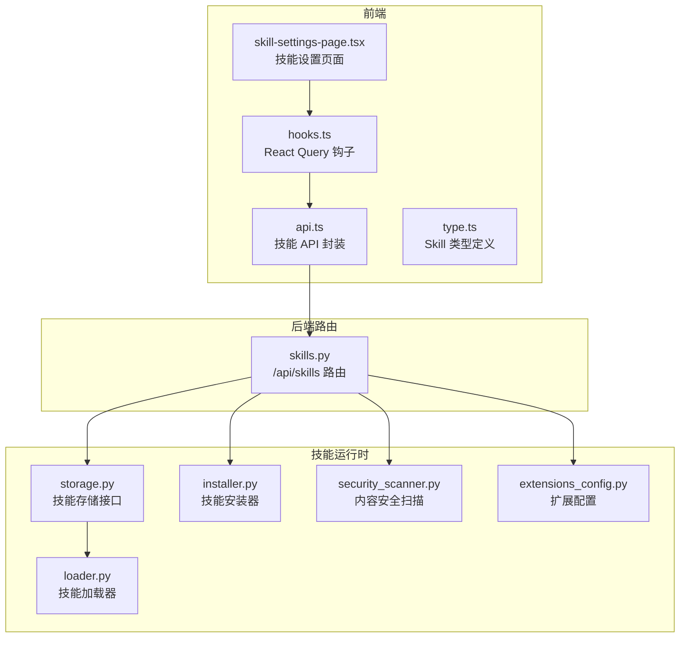
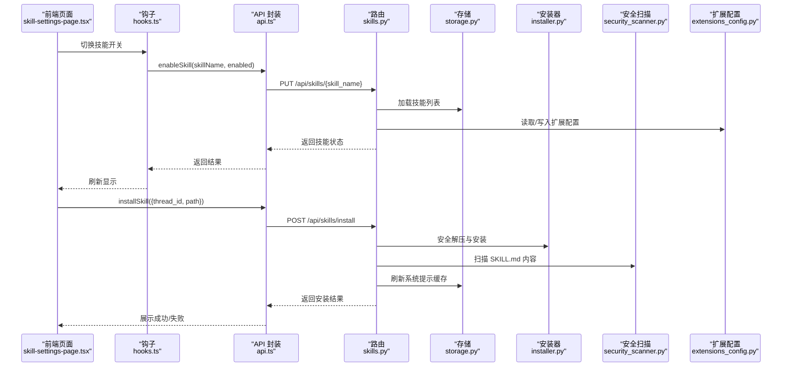
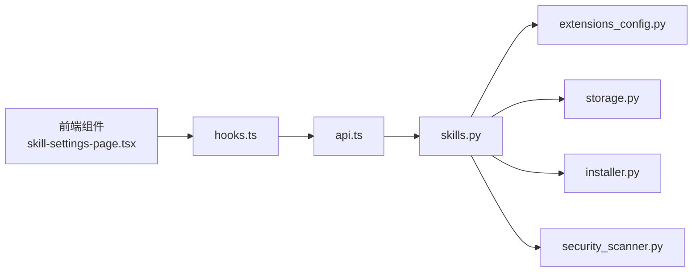

# 技能设置

<cite>
**本文引用的文件**
- [skills.py](file://backend/app/gateway/routers/skills.py)
- [api.ts](file://frontend/src/core/skills/api.ts)
- [type.ts](file://frontend/src/core/skills/type.ts)
- [hooks.ts](file://frontend/src/core/skills/hooks.ts)
- [skill-settings-page.tsx](file://frontend/src/components/workspace/settings/skill-settings-page.tsx)
- [installer.py](file://backend/packages/harness/deerflow/skills/installer.py)
- [security_scanner.py](file://backend/packages/harness/deerflow/skills/security_scanner.py)
- [extensions_config.py](file://backend/deerflow/config/extensions_config.py)
- [storage.py](file://backend/deerflow/skills/storage.py)
- [loader.py](file://backend/deerflow/skills/loader.py)
- [install-skill.sh](file://skills/public/find-skills/scripts/install-skill.sh)
- [SKILL.md（chart-visualization）](file://skills/public/chart-visualization/SKILL.md)
- [SKILL.md（text-extraction）](file://skills/public/text-extraction/SKILL.md)
- [CONTRIBUTING.md](file://backend/CONTRIBUTING.md)
- [rfc-extract-shared-modules.md](file://backend/docs/rfc-extract-shared-modules.md)
- [README_zh.md](file://README_zh.md)
</cite>

## 目录
1. [简介](#简介)
2. [项目结构](#项目结构)
3. [核心组件](#核心组件)
4. [架构总览](#架构总览)
5. [详细组件分析](#详细组件分析)
6. [依赖分析](#依赖分析)
7. [性能考虑](#性能考虑)
8. [故障排查指南](#故障排查指南)
9. [结论](#结论)
10. [附录](#附录)

## 简介
本技术文档聚焦 DeerFlow 技能设置模块，系统阐述技能启用/禁用机制、技能配置界面与状态管理、技能发现/安装/卸载流程、权限控制与访问限制、技能配置的数据结构与验证规则、错误处理策略，以及技能设置的 API 接口与前端组件实现细节。目标是帮助开发者与运维人员快速理解并正确使用技能设置能力。

## 项目结构
技能设置涉及后端 FastAPI 路由、前端查询与交互、技能存储与安装器、安全扫描与配置管理等多个层次。下图展示与技能设置相关的核心模块与文件：

图表来源
- [skills.py:1-353](file://backend/app/gateway/routers/skills.py#L1-L353)
- [api.ts:1-64](file://frontend/src/core/skills/api.ts#L1-L64)
- [hooks.ts:1-31](file://frontend/src/core/skills/hooks.ts#L1-L31)
- [skill-settings-page.tsx:1-135](file://frontend/src/components/workspace/settings/skill-settings-page.tsx#L1-L135)
- [type.ts:1-7](file://frontend/src/core/skills/type.ts#L1-L7)
- [storage.py](file://backend/deerflow/skills/storage.py)
- [loader.py](file://backend/deerflow/skills/loader.py)
- [installer.py](file://backend/packages/harness/deerflow/skills/installer.py)
- [security_scanner.py](file://backend/packages/harness/deerflow/skills/security_scanner.py)
- [extensions_config.py](file://backend/deerflow/config/extensions_config.py)

章节来源
- [skills.py:1-353](file://backend/app/gateway/routers/skills.py#L1-L353)
- [api.ts:1-64](file://frontend/src/core/skills/api.ts#L1-L64)
- [hooks.ts:1-31](file://frontend/src/core/skills/hooks.ts#L1-L31)
- [skill-settings-page.tsx:1-135](file://frontend/src/components/workspace/settings/skill-settings-page.tsx#L1-L135)
- [type.ts:1-7](file://frontend/src/core/skills/type.ts#L1-L7)

## 核心组件
- 后端路由层：提供技能列表、详情、启用/禁用、安装、自定义技能编辑/删除/历史/回滚等接口。
- 前端交互层：提供技能设置页面、查询与变更技能状态的钩子与 API 封装。
- 技能存储与加载：统一管理公共与自定义技能目录、技能元数据与内容。
- 安装器：安全解压、校验与安装 .skill 归档。
- 安全扫描：对自定义技能内容进行安全扫描，阻断高风险内容。
- 扩展配置：维护技能启用状态与 MCP 服务器配置。

章节来源
- [skills.py:1-353](file://backend/app/gateway/routers/skills.py#L1-L353)
- [api.ts:1-64](file://frontend/src/core/skills/api.ts#L1-L64)
- [hooks.ts:1-31](file://frontend/src/core/skills/hooks.ts#L1-L31)
- [skill-settings-page.tsx:1-135](file://frontend/src/components/workspace/settings/skill-settings-page.tsx#L1-L135)
- [storage.py](file://backend/deerflow/skills/storage.py)
- [loader.py](file://backend/deerflow/skills/loader.py)
- [installer.py](file://backend/packages/harness/deerflow/skills/installer.py)
- [security_scanner.py](file://backend/packages/harness/deerflow/skills/security_scanner.py)
- [extensions_config.py](file://backend/deerflow/config/extensions_config.py)

## 架构总览
技能设置的端到端流程包含：前端发起请求 → 后端路由处理 → 存储/安装器/扫描器协作 → 更新扩展配置并刷新系统提示缓存 → 返回响应。

图表来源
- [skill-settings-page.tsx:1-135](file://frontend/src/components/workspace/settings/skill-settings-page.tsx#L1-L135)
- [hooks.ts:1-31](file://frontend/src/core/skills/hooks.ts#L1-L31)
- [api.ts:1-64](file://frontend/src/core/skills/api.ts#L1-L64)
- [skills.py:1-353](file://backend/app/gateway/routers/skills.py#L1-L353)
- [storage.py](file://backend/deerflow/skills/storage.py)
- [installer.py](file://backend/packages/harness/deerflow/skills/installer.py)
- [security_scanner.py](file://backend/packages/harness/deerflow/skills/security_scanner.py)
- [extensions_config.py](file://backend/deerflow/config/extensions_config.py)

## 详细组件分析

### 后端路由与 API 文档
- 列表与详情
  - GET /api/skills：列出全部技能（公共+自定义）
  - GET /api/skills/{skill_name}：获取指定技能详情
- 启用/禁用
  - PUT /api/skills/{skill_name}：修改技能启用状态，写入扩展配置并刷新系统提示缓存
- 安装
  - POST /api/skills/install：从线程用户数据目录中的 .skill 归档安装技能，返回安装结果
- 自定义技能管理
  - GET /api/skills/custom：列出自定义技能
  - GET /api/skills/custom/{skill_name}：读取自定义技能 SKILL.md 原文
  - PUT /api/skills/custom/{skill_name}：编辑自定义技能，先安全扫描再写入并记录历史
  - DELETE /api/skills/custom/{skill_name}：删除自定义技能，记录历史
  - GET /api/skills/custom/{skill_name}/history：读取自定义技能历史
  - POST /api/skills/custom/{skill_name}/rollback：回滚到指定历史版本，扫描通过后写入并记录历史

错误映射与处理
- 400：参数错误/内容校验失败
- 404：技能不存在/路径不存在
- 409：技能已存在
- 500：内部异常

章节来源
- [skills.py:88-353](file://backend/app/gateway/routers/skills.py#L88-L353)

### 技能状态管理与配置
- 状态字段
  - enabled：布尔值，表示技能是否启用
  - category：枚举值，区分 public 或 custom
- 配置持久化
  - 扩展配置文件维护 skills 字典，每个键为技能名，值为启用状态
  - 写入后重载配置并刷新系统提示缓存，确保新状态立即生效

章节来源
- [skills.py:310-347](file://backend/app/gateway/routers/skills.py#L310-L347)
- [extensions_config.py](file://backend/deerflow/config/extensions_config.py)

### 技能安装与卸载流程
- 安装流程
  - 解析线程虚拟路径，定位 .skill 文件
  - 调用安装器进行安全解压与目录解析
  - 写入技能目录，刷新系统提示缓存
- 卸载流程
  - 删除自定义技能目录，记录历史
- 安全扫描
  - 编辑/回滚前对 SKILL.md 内容进行安全扫描，阻断高风险内容

章节来源
- [skills.py:109-126](file://backend/app/gateway/routers/skills.py#L109-L126)
- [installer.py](file://backend/packages/harness/deerflow/skills/installer.py)
- [security_scanner.py](file://backend/packages/harness/deerflow/skills/security_scanner.py)

### 技能发现与脚本安装
- 发现与安装
  - 使用 find-skills 技能提供的安装脚本，自动从全局仓库安装并软链到项目 skills/custom 目录
- 脚本要点
  - 参数校验：owner/repo@skill-name
  - 项目根查找：通过工作区文件定位
  - 安装与链接：npx 安装后创建软链

章节来源
- [install-skill.sh:1-63](file://skills/public/find-skills/scripts/install-skill.sh#L1-L63)

### 前端组件与交互
- 页面组件
  - 技能设置页：支持公共/自定义分类切换、创建新技能入口、开关切换
- 查询与变更
  - useSkills：获取技能列表
  - useEnableSkill：变更技能启用状态，成功后刷新缓存
- API 封装
  - loadSkills：GET /api/skills
  - enableSkill：PUT /api/skills/{skill_name}
  - installSkill：POST /api/skills/install

章节来源
- [skill-settings-page.tsx:1-135](file://frontend/src/components/workspace/settings/skill-settings-page.tsx#L1-L135)
- [hooks.ts:1-31](file://frontend/src/core/skills/hooks.ts#L1-L31)
- [api.ts:1-64](file://frontend/src/core/skills/api.ts#L1-L64)
- [type.ts:1-7](file://frontend/src/core/skills/type.ts#L1-L7)

### 技能配置的数据结构与验证规则
- 技能元数据
  - 示例：name、description、compatibility 等
- 前端类型
  - Skill 接口包含 name、description、category、license、enabled
- 后端模型
  - SkillResponse、SkillsListResponse、SkillUpdateRequest、SkillInstallRequest 等
- 验证与错误
  - 路由层对路径、内容、历史索引等进行校验，返回相应 HTTP 状态码

章节来源
- [SKILL.md（chart-visualization）:1-73](file://skills/public/chart-visualization/SKILL.md#L1-L73)
- [SKILL.md（text-extraction）:1-100](file://skills/public/text-extraction/SKILL.md#L1-L100)
- [type.ts:1-7](file://frontend/src/core/skills/type.ts#L1-L7)
- [skills.py:24-76](file://backend/app/gateway/routers/skills.py#L24-L76)

### 权限控制与访问限制
- 默认部署建议
  - 仅在本地可信环境（127.0.0.1 回环）部署，避免公网暴露
- 建议措施
  - IP 白名单、前置身份认证、网络隔离、关注安全更新

章节来源
- [README_zh.md:556-576](file://README_zh.md#L556-L576)

## 依赖分析
- 路由依赖
  - skills.py 依赖扩展配置、技能存储、安装器、安全扫描器与系统提示缓存刷新
- 前端依赖
  - api.ts 依赖后端基础地址与 fetch
  - hooks.ts 依赖 React Query 与 api.ts
  - skill-settings-page.tsx 依赖 UI 组件与 hooks.ts
- 安全与健壮性
  - 安装器提供 zip 成员安全检查、解压大小限制与 macOS 元数据过滤
  - 安全扫描器对自定义技能内容进行阻断判定

图表来源
- [skill-settings-page.tsx:1-135](file://frontend/src/components/workspace/settings/skill-settings-page.tsx#L1-L135)
- [hooks.ts:1-31](file://frontend/src/core/skills/hooks.ts#L1-L31)
- [api.ts:1-64](file://frontend/src/core/skills/api.ts#L1-L64)
- [skills.py:1-353](file://backend/app/gateway/routers/skills.py#L1-L353)
- [extensions_config.py](file://backend/deerflow/config/extensions_config.py)
- [storage.py](file://backend/deerflow/skills/storage.py)
- [installer.py](file://backend/packages/harness/deerflow/skills/installer.py)
- [security_scanner.py](file://backend/packages/harness/deerflow/skills/security_scanner.py)

章节来源
- [rfc-extract-shared-modules.md:59-85](file://backend/docs/rfc-extract-shared-modules.md#L59-L85)
- [CONTRIBUTING.md:353-427](file://backend/CONTRIBUTING.md#L353-L427)

## 性能考虑
- 按需加载：技能采用渐进加载策略，仅在任务需要时加载，降低上下文负担
- 缓存刷新：启用/禁用与安装后刷新系统提示缓存，避免重复计算
- I/O 优化：安装器采用流式写入与双重遍历校验，减少内存占用与提升安全性

## 故障排查指南
- 安装失败
  - 检查 .skill 文件路径与权限
  - 查看后端日志中的异常堆栈
  - 确认 zip 成员安全与大小限制
- 编辑/回滚被阻断
  - 检查 SKILL.md 内容是否触发安全扫描阻断
  - 查看扫描原因并修正内容
- 启用/禁用无效
  - 确认扩展配置文件写入成功
  - 检查系统提示缓存是否刷新
- 前端无数据
  - 检查后端基础地址与网络连通性
  - 使用 React DevTools 观察查询状态与错误

章节来源
- [skills.py:109-126](file://backend/app/gateway/routers/skills.py#L109-L126)
- [skills.py:155-189](file://backend/app/gateway/routers/skills.py#L155-L189)
- [skills.py:234-279](file://backend/app/gateway/routers/skills.py#L234-L279)

## 结论
技能设置模块通过清晰的前后端分层、严格的安装与安全扫描机制、完善的配置持久化与缓存刷新策略，实现了灵活、安全、可审计的技能生命周期管理。建议在生产环境中遵循最小暴露原则与多重安全加固，确保系统稳定与合规。

## 附录

### API 接口清单（后端）
- GET /api/skills：列出全部技能
- GET /api/skills/{skill_name}：获取技能详情
- PUT /api/skills/{skill_name}：启用/禁用技能
- POST /api/skills/install：安装 .skill 归档
- GET /api/skills/custom：列出自定义技能
- GET /api/skills/custom/{skill_name}：读取自定义技能原文
- PUT /api/skills/custom/{skill_name}：编辑自定义技能
- DELETE /api/skills/custom/{skill_name}：删除自定义技能
- GET /api/skills/custom/{skill_name}/history：读取历史
- POST /api/skills/custom/{skill_name}/rollback：回滚到历史版本

章节来源
- [skills.py:88-353](file://backend/app/gateway/routers/skills.py#L88-L353)

### 前端 API 使用要点
- 使用 useSkills 获取技能列表
- 使用 useEnableSkill 变更技能启用状态
- 使用 installSkill 安装 .skill 文件

章节来源
- [hooks.ts:1-31](file://frontend/src/core/skills/hooks.ts#L1-L31)
- [api.ts:1-64](file://frontend/src/core/skills/api.ts#L1-L64)