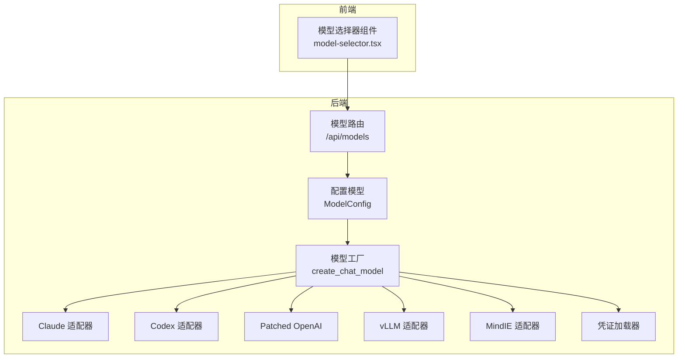
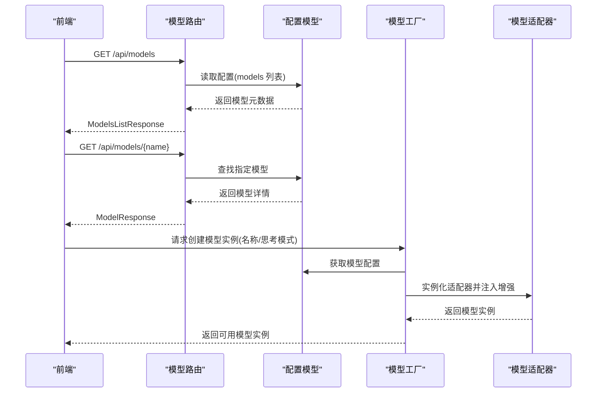
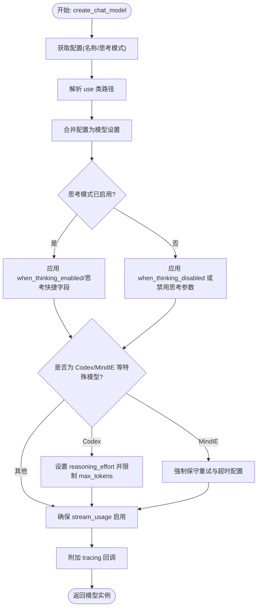
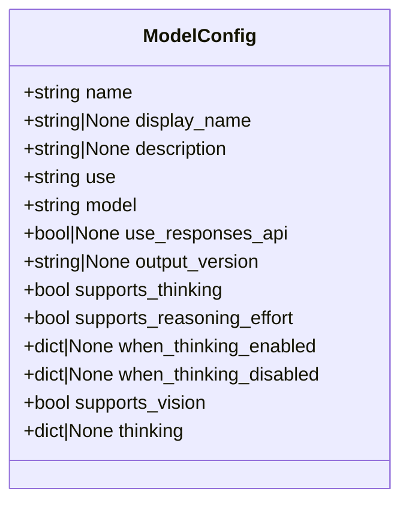
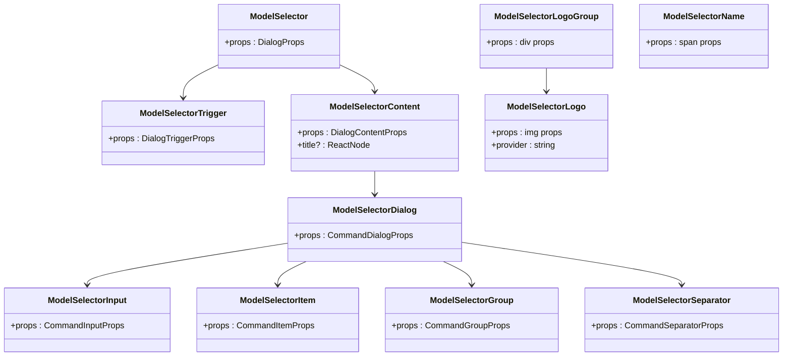
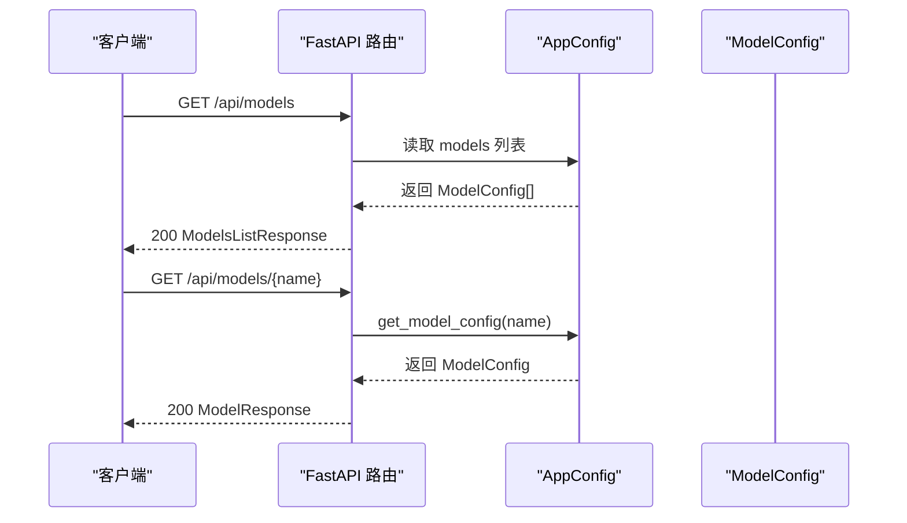
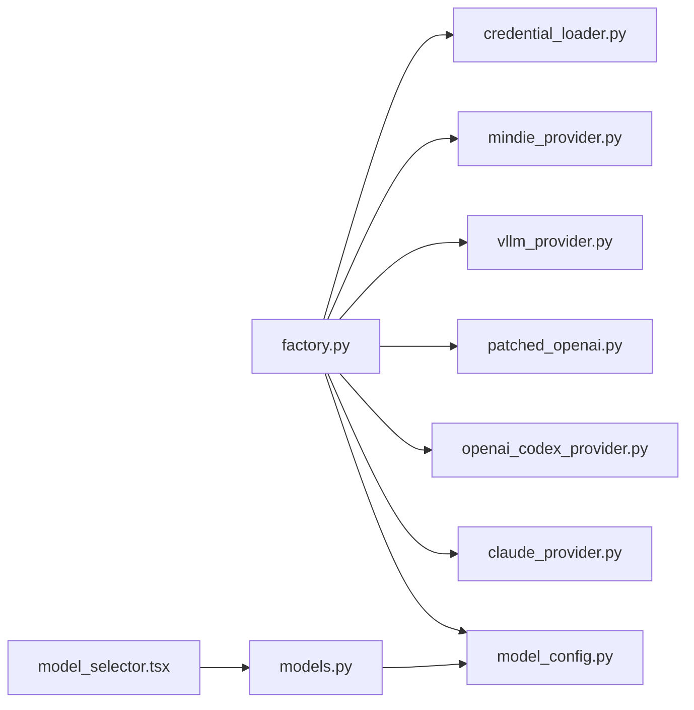

# 模型设置

<cite>
**本文档引用的文件**
- [factory.py](file://backend/packages/harness/deerflow/models/factory.py)
- [model_config.py](file://backend/packages/harness/deerflow/config/model_config.py)
- [models.py](file://backend/app/gateway/routers/models.py)
- [model_selector.tsx](file://frontend/src/components/ai-elements/model-selector.tsx)
- [claude_provider.py](file://backend/packages/harness/deerflow/models/claude_provider.py)
- [openai_codex_provider.py](file://backend/packages/harness/deerflow/models/openai_codex_provider.py)
- [patched_openai.py](file://backend/packages/harness/deerflow/models/patched_openai.py)
- [vllm_provider.py](file://backend/packages/harness/deerflow/models/vllm_provider.py)
- [mindie_provider.py](file://backend/packages/harness/deerflow/models/mindie_provider.py)
- [credential_loader.py](file://backend/packages/harness/deerflow/models/credential_loader.py)
- [config.example.yaml](file://config.example.yaml)
</cite>

## 目录
1. [简介](#简介)
2. [项目结构](#项目结构)
3. [核心组件](#核心组件)
4. [架构总览](#架构总览)
5. [详细组件分析](#详细组件分析)
6. [依赖分析](#依赖分析)
7. [性能考虑](#性能考虑)
8. [故障排除指南](#故障排除指南)
9. [结论](#结论)
10. [附录](#附录)

## 简介
本章节概述 DeerFlow 模型设置模块的目标与范围：提供统一的模型选择器组件、模型配置管理与模型切换机制；支持多提供商（如 OpenAI、Anthropic、vLLM、MindIE 等）；涵盖模型参数配置、性能优化、缓存策略、并发限制与资源管理；并包含模型设置的 API 接口文档、前端组件实现以及配置验证逻辑。

## 项目结构
模型设置模块横跨后端与前端两大侧：
- 后端负责模型工厂、具体提供商适配、配置模型、路由接口与凭证加载；
- 前端提供模型选择器 UI 组件，展示模型列表与品牌标识。

**图表来源**
- [model_config.py:4-42](file://backend/packages/harness/deerflow/config/model_config.py#L4-L42)
- [factory.py:50-158](file://backend/packages/harness/deerflow/models/factory.py#L50-L158)
- [models.py:34-90](file://backend/app/gateway/routers/models.py#L34-L90)
- [model_selector.tsx:1-208](file://frontend/src/components/ai-elements/model-selector.tsx#L1-L208)
- [claude_provider.py:44-364](file://backend/packages/harness/deerflow/models/claude_provider.py#L44-L364)
- [openai_codex_provider.py:61-461](file://backend/packages/harness/deerflow/models/openai_codex_provider.py#L61-L461)
- [patched_openai.py:31-133](file://backend/packages/harness/deerflow/models/patched_openai.py#L31-L133)
- [vllm_provider.py:159-259](file://backend/packages/harness/deerflow/models/vllm_provider.py#L159-L259)
- [mindie_provider.py:162-250](file://backend/packages/harness/deerflow/models/mindie_provider.py#L162-L250)

**章节来源**
- [model_config.py:4-42](file://backend/packages/harness/deerflow/config/model_config.py#L4-L42)
- [factory.py:50-158](file://backend/packages/harness/deerflow/models/factory.py#L50-L158)
- [models.py:34-90](file://backend/app/gateway/routers/models.py#L34-L90)
- [model_selector.tsx:1-208](file://frontend/src/components/ai-elements/model-selector.tsx#L1-L208)

## 核心组件
- 模型配置模型：定义模型元数据、能力开关与思考/推理配置入口。
- 模型工厂：根据配置动态解析并实例化具体模型适配器，合并思考模式与推理努力等高级特性。
- 路由接口：提供模型清单与详情查询，供前端展示与选择。
- 前端模型选择器：提供可搜索、可分组的品牌图标与模型项，支持触发与内容封装。
- 适配器集合：针对不同提供商（Claude、Codex、vLLM、MindIE、Patched OpenAI）的定制化增强。
- 凭证加载器：自动从多种来源加载 OAuth/Cli 凭证，保障安全访问。

**章节来源**
- [model_config.py:4-42](file://backend/packages/harness/deerflow/config/model_config.py#L4-L42)
- [factory.py:50-158](file://backend/packages/harness/deerflow/models/factory.py#L50-L158)
- [models.py:34-90](file://backend/app/gateway/routers/models.py#L34-L90)
- [model_selector.tsx:1-208](file://frontend/src/components/ai-elements/model-selector.tsx#L1-L208)
- [credential_loader.py:149-220](file://backend/packages/harness/deerflow/models/credential_loader.py#L149-L220)

## 架构总览
模型设置模块采用“配置驱动 + 工厂 + 适配器”的分层设计：
- 配置层：ModelConfig 描述模型能力与行为开关；
- 工厂层：create_chat_model 将配置映射为具体模型实例，并注入思考/推理、流式用量统计等通用增强；
- 适配器层：针对不同提供商的特殊协议与行为进行兼容与优化；
- 接口层：FastAPI 路由暴露模型清单与详情；
- 展示层：前端模型选择器组件渲染品牌与模型信息。

**图表来源**
- [models.py:34-90](file://backend/app/gateway/routers/models.py#L34-L90)
- [factory.py:50-158](file://backend/packages/harness/deerflow/models/factory.py#L50-L158)
- [model_config.py:4-42](file://backend/packages/harness/deerflow/config/model_config.py#L4-L42)

## 详细组件分析

### 模型工厂与切换机制
- 功能要点
  - 依据传入名称或默认模型获取配置；
  - 解析 use 字段定位具体模型类；
  - 合并 when_thinking_enabled/when_thinking_disabled 与 thinking 快捷字段；
  - 在思考开启/关闭时分别注入/禁用相应参数（如 extra_body.thinking、reasoning_effort、chat_template_kwargs）；
  - 为 Codex 与 MindIE 等特殊模型注入推理努力、重试策略与流式用量统计；
  - 自动启用 stream_usage 以确保令牌用量统计可用；
  - 附加 tracing 回调以支持可观测性。

**图表来源**
- [factory.py:50-158](file://backend/packages/harness/deerflow/models/factory.py#L50-L158)

**章节来源**
- [factory.py:50-158](file://backend/packages/harness/deerflow/models/factory.py#L50-L158)

### 模型配置管理
- ModelConfig 字段说明
  - 基本字段：name、display_name、description、use、model；
  - 能力开关：supports_thinking、supports_reasoning_effort、supports_vision；
  - 行为配置：when_thinking_enabled、when_thinking_disabled、thinking；
  - OpenAI 兼容扩展：use_responses_api、output_version；
  - 允许额外字段透传给底层客户端。

**图表来源**
- [model_config.py:4-42](file://backend/packages/harness/deerflow/config/model_config.py#L4-L42)

**章节来源**
- [model_config.py:4-42](file://backend/packages/harness/deerflow/config/model_config.py#L4-L42)

### 支持的模型提供商与适配器
- Claude 适配器（OAuth/Bearer、提示缓存、智能思考预算）
  - 自动检测 OAuth Token 并切换认证头；
  - 注入提示缓存控制与思考预算分配；
  - 暴露 retry 与指数退避；
- Codex 适配器（Responses API、流式 SSE、工具调用、重试）
  - 使用 Responses API，支持流式事件解析；
  - 自动装载 CLI 凭证；
  - 解析工具调用与推理内容；
- vLLM 适配器（推理字段保留、流式增量、多轮一致性）
  - 修复推理字段在非流式/流式/多轮请求中的丢失；
  - 将 legacy thinking 映射为 enable_thinking；
- MindIE 适配器（XML 工具调用解析、流式兼容、超时优化）
  - 清洗多模态内容与 XML 工具调用；
  - 处理流式工具调用缺失问题；
  - 优化连接/读/写/池超时；
- Patched OpenAI（Gemini 思考签名保留）
  - 在多轮对话中恢复 tool-call 的 thought_signature。

**章节来源**
- [claude_provider.py:44-364](file://backend/packages/harness/deerflow/models/claude_provider.py#L44-L364)
- [openai_codex_provider.py:61-461](file://backend/packages/harness/deerflow/models/openai_codex_provider.py#L61-L461)
- [vllm_provider.py:159-259](file://backend/packages/harness/deerflow/models/vllm_provider.py#L159-L259)
- [mindie_provider.py:162-250](file://backend/packages/harness/deerflow/models/mindie_provider.py#L162-L250)
- [patched_openai.py:31-133](file://backend/packages/harness/deerflow/models/patched_openai.py#L31-L133)

### 凭证加载与安全访问
- Claude Code OAuth：支持环境变量、文件描述符与本地文件三种来源；
- Codex CLI：从用户主目录加载 auth.json；
- OAuth 标识与 Beta 头部自动注入；
- 过期令牌警告与降级处理。

**章节来源**
- [credential_loader.py:149-220](file://backend/packages/harness/deerflow/models/credential_loader.py#L149-L220)

### 前端模型选择器组件
- 组件结构
  - ModelSelector：对话框容器；
  - ModelSelectorTrigger：触发按钮；
  - ModelSelectorContent：内容区域与命令组件包装；
  - ModelSelectorDialog：命令对话框；
  - ModelSelectorInput/Item/Group/Separator：命令 UI 组件；
  - ModelSelectorLogo/LogoGroup/Name：品牌图标与名称展示；
- 支持的提供商枚举覆盖广泛生态（OpenAI、Anthropic、Google、Azure、Groq、HuggingFace 等）；
- 图标通过 models.dev 提供的 SVG 源加载。

**图表来源**
- [model_selector.tsx:21-208](file://frontend/src/components/ai-elements/model-selector.tsx#L21-L208)

**章节来源**
- [model_selector.tsx:1-208](file://frontend/src/components/ai-elements/model-selector.tsx#L1-L208)

### API 接口文档
- 列出所有模型
  - 方法：GET
  - 路径：/api/models
  - 响应：ModelsListResponse（包含 models 列表与 token_usage 配置）
- 获取指定模型详情
  - 方法：GET
  - 路径：/api/models/{model_name}
  - 响应：ModelResponse（包含名称、显示名、描述、是否支持思考/推理）

**图表来源**
- [models.py:34-90](file://backend/app/gateway/routers/models.py#L34-L90)

**章节来源**
- [models.py:34-90](file://backend/app/gateway/routers/models.py#L34-L90)

## 依赖分析
- 模块耦合
  - factory 依赖配置模型与反射解析，耦合度低但职责集中；
  - 各适配器独立性强，仅依赖 LangChain 基类与第三方 SDK；
  - 路由依赖 AppConfig 读取配置，不直接依赖具体适配器；
  - 前端组件仅依赖后端接口，UI 与业务解耦。
- 外部依赖
  - LangChain（ChatOpenAI、ChatAnthropic 等基类）；
  - 第三方 SDK（anthropic、httpx、openai 等）；
  - FastAPI（路由与响应模型）。

**图表来源**
- [factory.py:50-158](file://backend/packages/harness/deerflow/models/factory.py#L50-L158)
- [model_config.py:4-42](file://backend/packages/harness/deerflow/config/model_config.py#L4-L42)
- [models.py:34-90](file://backend/app/gateway/routers/models.py#L34-L90)
- [model_selector.tsx:1-208](file://frontend/src/components/ai-elements/model-selector.tsx#L1-L208)

**章节来源**
- [factory.py:50-158](file://backend/packages/harness/deerflow/models/factory.py#L50-L158)
- [models.py:34-90](file://backend/app/gateway/routers/models.py#L34-L90)

## 性能考虑
- 流式用量统计
  - 默认为 OpenAI 兼容模型启用 stream_usage，确保令牌用量在流式响应中可用；
  - 针对第三方网关场景自动补全，避免用量为空导致中间件无法记录。
- 重试与退避
  - MindIE 强制保守重试（max_retries）；
  - Claude 适配器使用指数退避与可选 Retry-After 头；
  - Codex 适配器对 429/500/529 场景进行指数退避重试。
- 超时与并发
  - MindIE 适配器显式设置连接/读/写/池超时，降低长时间阻塞风险；
  - vLLM 适配器在多轮请求中保留推理字段，减少往返与重复计算。
- 缓存策略
  - Claude 适配器在 OAuth 模式下禁用提示缓存（受平台限制），在标准 API 模式下启用；
  - 通过 cache_control ephemeral 标记系统提示、近期消息与工具定义，最大化命中率。

**章节来源**
- [factory.py:117-149](file://backend/packages/harness/deerflow/models/factory.py#L117-L149)
- [mindie_provider.py:173-189](file://backend/packages/harness/deerflow/models/mindie_provider.py#L173-L189)
- [claude_provider.py:128-294](file://backend/packages/harness/deerflow/models/claude_provider.py#L128-L294)

## 故障排除指南
- 模型未找到
  - 现象：工厂抛出“模型不存在”错误；
  - 排查：确认配置中是否存在该名称，或传入的名称是否正确。
- 思考模式不生效
  - 现象：开启思考后仍无推理内容；
  - 排查：检查 supports_thinking 是否为真；确认 when_thinking_enabled/when_thinking_disabled 配置正确；对于 vLLM/Qwen，确认 chat_template_kwargs.enable_thinking 已注入。
- 令牌用量为空
  - 现象：TokenUsageMiddleware 无用量日志；
  - 排查：确认 stream_usage 已启用；检查是否使用了第三方网关且未显式配置。
- Claude OAuth 认证失败
  - 现象：401/403 或缺少 billing 头；
  - 排查：确认 OAuth Token 格式与有效期；检查 anthropic-beta 头是否注入；确保系统提示首条为 billing 头。
- Codex 流式中断
  - 现象：SSE 未结束或最终事件缺失；
  - 排查：检查网络与重试逻辑；确认 response.completed 事件是否到达。
- MindIE 工具调用缺失
  - 现象：流式开启时 choices 为空；
  - 排查：工具调用场景自动回退为非流式生成并模拟分片输出。

**章节来源**
- [factory.py:63-64](file://backend/packages/harness/deerflow/models/factory.py#L63-L64)
- [claude_provider.py:155-191](file://backend/packages/harness/deerflow/models/claude_provider.py#L155-L191)
- [openai_codex_provider.py:248-293](file://backend/packages/harness/deerflow/models/openai_codex_provider.py#L248-L293)
- [mindie_provider.py:218-249](file://backend/packages/harness/deerflow/models/mindie_provider.py#L218-L249)

## 结论
模型设置模块通过配置驱动与工厂模式实现了对多提供商模型的统一接入与增强。前端模型选择器与后端路由共同构成完整的模型发现与选择体验；适配器层针对不同提供商的协议差异提供了稳健的兼容方案；性能方面通过流式用量统计、重试退避与缓存策略提升了稳定性与效率。建议在生产环境中结合配置示例与凭证加载器，确保模型可用性与安全性。

## 附录
- 配置示例参考
  - 模型配置示例与字段说明可参考完整示例配置文件；
  - 前端模型选择器支持的提供商枚举覆盖主流生态，便于快速集成。

**章节来源**
- [config.example.yaml:1-348](file://config.example.yaml#L1-L348)
- [model_selector.tsx:104-166](file://frontend/src/components/ai-elements/model-selector.tsx#L104-L166)