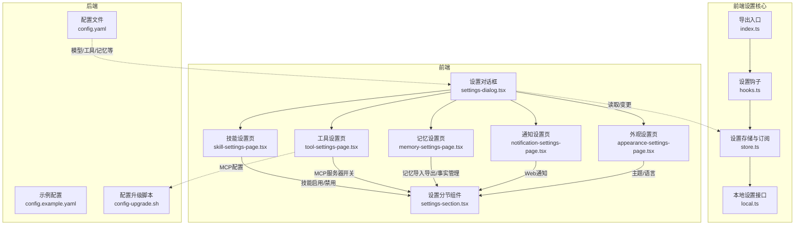
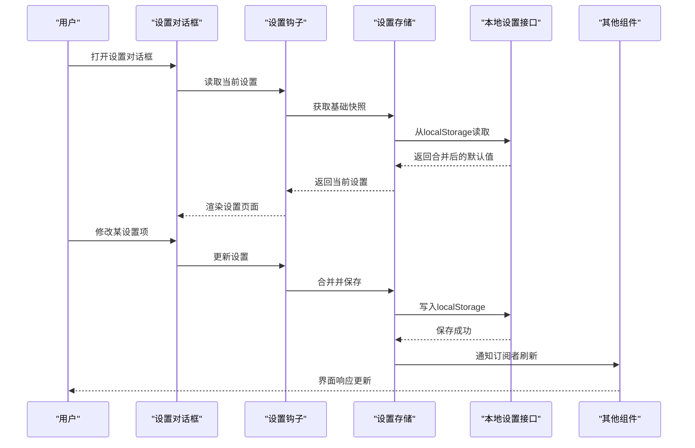
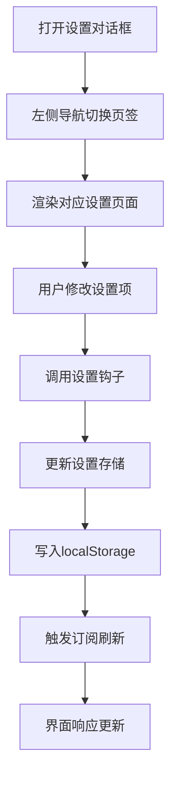
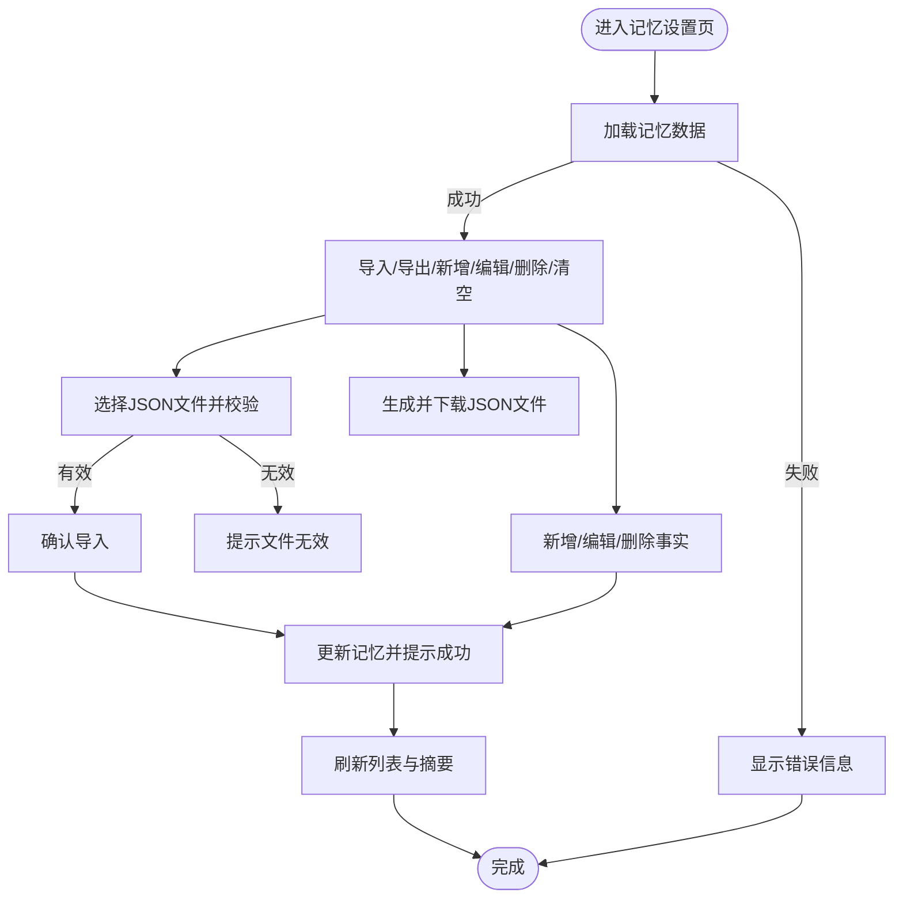
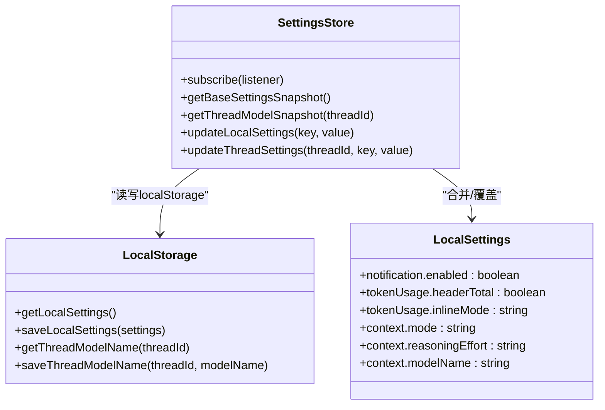
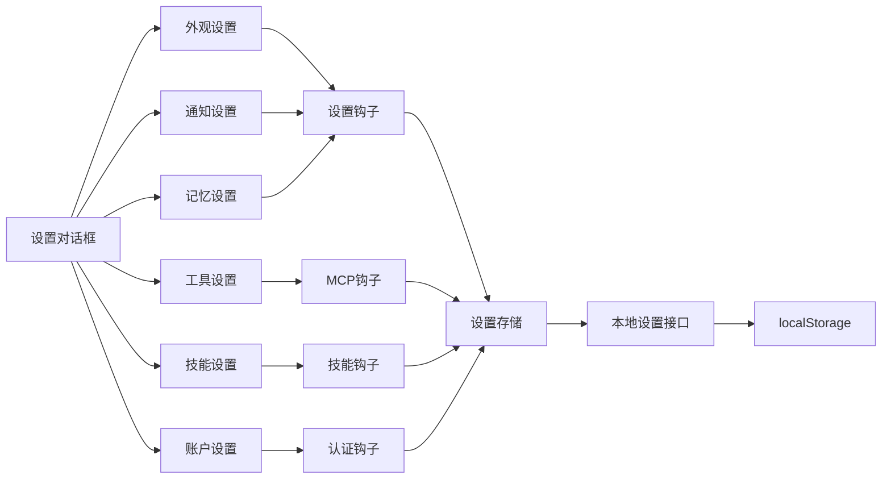

# 设置管理

<cite>
**本文档引用的文件**
- [settings-dialog.tsx](file://frontend/src/components/workspace/settings/settings-dialog.tsx)
- [skill-settings-page.tsx](file://frontend/src/components/workspace/settings/skill-settings-page.tsx)
- [appearance-settings-page.tsx](file://frontend/src/components/workspace/settings/appearance-settings-page.tsx)
- [notification-settings-page.tsx](file://frontend/src/components/workspace/settings/notification-settings-page.tsx)
- [memory-settings-page.tsx](file://frontend/src/components/workspace/settings/memory-settings-page.tsx)
- [tool-settings-page.tsx](file://frontend/src/components/workspace/settings/tool-settings-page.tsx)
- [account-settings-page.tsx](file://frontend/src/components/workspace/settings/account-settings-page.tsx)
- [settings-section.tsx](file://frontend/src/components/workspace/settings/settings-section.tsx)
- [store.ts](file://frontend/src/core/settings/store.ts)
- [local.ts](file://frontend/src/core/settings/local.ts)
- [hooks.ts](file://frontend/src/core/settings/hooks.ts)
- [index.ts](file://frontend/src/core/settings/index.ts)
- [config.yaml](file://backend/config.yaml)
- [config.example.yaml](file://config.example.yaml)
- [config-upgrade.sh](file://scripts/config-upgrade.sh)
- [hooks.ts](file://frontend/src/core/mcp/hooks.ts)
</cite>

## 目录
1. [简介](#简介)
2. [项目结构](#项目结构)
3. [核心组件](#核心组件)
4. [架构总览](#架构总览)
5. [详细组件分析](#详细组件分析)
6. [依赖关系分析](#依赖关系分析)
7. [性能考量](#性能考量)
8. [故障排查指南](#故障排查指南)
9. [结论](#结论)
10. [附录](#附录)

## 简介
本文件系统性梳理 DeerFlow 设置管理系统的前端与后端实现，覆盖设置页面的组织结构、设置项分类与配置管理机制。重点说明技能设置、模型配置、通知设置与外观设置等模块，并解释设置数据的本地持久化、跨标签页同步机制以及默认值管理策略。最后提供设置系统的扩展指南与自定义配置方法，帮助开发者与运维人员快速理解并维护设置体系。

## 项目结构
设置系统主要由以下部分组成：
- 前端设置对话框与各设置页面：负责用户交互与本地状态管理
- 前端设置核心模块：负责本地存储、订阅与同步
- 后端配置文件：提供全局模型、工具、记忆等配置
- 配置升级脚本：确保用户配置与示例配置版本一致

图表来源
- [settings-dialog.tsx:44-154](file://frontend/src/components/workspace/settings/settings-dialog.tsx#L44-L154)
- [store.ts:1-151](file://frontend/src/core/settings/store.ts#L1-L151)
- [local.ts:1-129](file://frontend/src/core/settings/local.ts#L1-L129)
- [config.yaml:1-348](file://backend/config.yaml#L1-L348)
- [config.example.yaml:1-348](file://config.example.yaml#L1-L348)
- [config-upgrade.sh:46-76](file://scripts/config-upgrade.sh#L46-L76)

章节来源
- [settings-dialog.tsx:44-154](file://frontend/src/components/workspace/settings/settings-dialog.tsx#L44-L154)
- [store.ts:1-151](file://frontend/src/core/settings/store.ts#L1-L151)
- [local.ts:1-129](file://frontend/src/core/settings/local.ts#L1-L129)
- [config.yaml:1-348](file://backend/config.yaml#L1-L348)
- [config.example.yaml:1-348](file://config.example.yaml#L1-L348)
- [config-upgrade.sh:46-76](file://scripts/config-upgrade.sh#L46-L76)

## 核心组件
- 设置对话框：承载所有设置页面，提供左侧导航与右侧内容区域，支持根据默认页签打开。
- 设置分节组件：统一设置页面的标题与描述展示。
- 设置存储与订阅：封装本地设置的读取、合并、保存与跨标签页同步。
- 本地设置接口：定义默认值、键名常量、线程模型覆盖逻辑与本地存储操作。
- 设置钩子：提供 useLocalSettings/useThreadSettings 等钩子，供页面使用。
- 后端配置：集中管理模型、工具、记忆、上传、运行事件等全局配置。
- 配置升级脚本：对比用户配置与示例配置版本，执行增量替换与迁移。

章节来源
- [settings-dialog.tsx:44-154](file://frontend/src/components/workspace/settings/settings-dialog.tsx#L44-L154)
- [settings-section.tsx:1-25](file://frontend/src/components/workspace/settings/settings-section.tsx#L1-L25)
- [store.ts:1-151](file://frontend/src/core/settings/store.ts#L1-L151)
- [local.ts:1-129](file://frontend/src/core/settings/local.ts#L1-L129)
- [hooks.ts:1-3](file://frontend/src/core/settings/hooks.ts#L1-L3)
- [index.ts:1-3](file://frontend/src/core/settings/index.ts#L1-L3)
- [config.yaml:1-348](file://backend/config.yaml#L1-L348)
- [config-upgrade.sh:46-76](file://scripts/config-upgrade.sh#L46-L76)

## 架构总览
设置系统采用“前端本地状态 + 后端全局配置”的双层设计：
- 前端负责用户即时可见的个性化设置（如主题、语言、通知、线程模型覆盖等），通过 localStorage 与订阅机制实现跨组件与跨标签页同步。
- 后端负责系统级配置（如模型列表、工具组、记忆策略、上传限制等），通过 YAML 文件集中管理，并提供升级脚本保障版本一致性。

图表来源
- [settings-dialog.tsx:44-154](file://frontend/src/components/workspace/settings/settings-dialog.tsx#L44-L154)
- [store.ts:103-151](file://frontend/src/core/settings/store.ts#L103-L151)
- [local.ts:109-129](file://frontend/src/core/settings/local.ts#L109-L129)

## 详细组件分析

### 设置对话框与页面组织
- 设置对话框提供账户、外观、通知、记忆、工具、技能、关于等页签，支持根据默认页签打开。
- 页面通过统一的设置分节组件展示标题与描述，保证风格一致。
- 各设置页面独立实现业务逻辑，通过钩子与存储层交互。

图表来源
- [settings-dialog.tsx:58-154](file://frontend/src/components/workspace/settings/settings-dialog.tsx#L58-L154)
- [settings-section.tsx:1-25](file://frontend/src/components/workspace/settings/settings-section.tsx#L1-L25)

章节来源
- [settings-dialog.tsx:44-154](file://frontend/src/components/workspace/settings/settings-dialog.tsx#L44-L154)
- [settings-section.tsx:1-25](file://frontend/src/components/workspace/settings/settings-section.tsx#L1-L25)

### 外观设置（主题与语言）
- 主题：支持系统、浅色、深色三种模式，预览卡片根据系统主题动态呈现。
- 语言：支持中英文切换，通过国际化钩子更新当前语言。

章节来源
- [appearance-settings-page.tsx:26-112](file://frontend/src/components/workspace/settings/appearance-settings-page.tsx#L26-L112)

### 通知设置（Web 通知）
- 检测浏览器通知能力与权限状态，支持请求权限与测试通知。
- 通过设置钩子控制通知开关，仅在授权状态下生效。

章节来源
- [notification-settings-page.tsx:13-92](file://frontend/src/components/workspace/settings/notification-settings-page.tsx#L13-L92)

### 记忆设置（导入/导出/事实管理）
- 支持导出/导入记忆数据，导入前进行结构校验。
- 提供事实增删改查、置信度等级展示、按类别与关键词过滤、最近更新时间显示。
- 支持清空全部记忆与按查询筛选摘要与事实。

图表来源
- [memory-settings-page.tsx:276-740](file://frontend/src/components/workspace/settings/memory-settings-page.tsx#L276-L740)

章节来源
- [memory-settings-page.tsx:276-740](file://frontend/src/components/workspace/settings/memory-settings-page.tsx#L276-L740)

### 工具设置（MCP 服务器）
- 读取 MCP 配置，展示服务器列表与描述。
- 支持启用/禁用指定服务器，受环境变量限制。

章节来源
- [tool-settings-page.tsx:18-71](file://frontend/src/components/workspace/settings/tool-settings-page.tsx#L18-L71)
- [hooks.ts:1-44](file://frontend/src/core/mcp/hooks.ts#L1-L44)

### 技能设置（公共/自定义）
- 分类展示公共与自定义技能，支持启用/禁用与创建新技能。
- 通过技能钩子获取技能列表与更新状态。

章节来源
- [skill-settings-page.tsx:32-136](file://frontend/src/components/workspace/settings/skill-settings-page.tsx#L32-L136)

### 账户设置（密码与登出）
- 展示用户邮箱与角色，支持修改密码与退出登录。
- 表单包含密码强度与一致性校验，错误与成功提示。

章节来源
- [account-settings-page.tsx:15-142](file://frontend/src/components/workspace/settings/account-settings-page.tsx#L15-L142)

### 设置数据持久化与同步机制
- 默认值：定义在本地设置接口中，作为未配置项的兜底。
- 本地存储：使用 localStorage 存储合并后的设置对象。
- 合并策略：读取时将用户配置与默认值合并，写入时仅保存差异字段。
- 跨标签页同步：监听 storage 事件，当键匹配或线程模型键变化时刷新内存快照并触发订阅。

图表来源
- [local.ts:4-47](file://frontend/src/core/settings/local.ts#L4-L47)
- [store.ts:103-151](file://frontend/src/core/settings/store.ts#L103-L151)

章节来源
- [local.ts:1-129](file://frontend/src/core/settings/local.ts#L1-L129)
- [store.ts:1-151](file://frontend/src/core/settings/store.ts#L1-L151)

### 默认值管理与线程模型覆盖
- 默认值集中定义在本地设置接口中，包含通知、令牌用量、上下文模式与推理努力等。
- 线程模型覆盖：每个会话可独立覆盖模型名称，存储于独立键空间；读取时优先使用线程覆盖值，否则回退到全局设置。

章节来源
- [local.ts:4-47](file://frontend/src/core/settings/local.ts#L4-L47)
- [local.ts:93-107](file://frontend/src/core/settings/local.ts#L93-L107)

### 后端配置与模型管理
- 后端配置文件集中管理模型列表、工具组、工具、沙箱、记忆、上传、运行事件、子代理等。
- 示例配置与用户配置版本号用于判断是否需要升级。
- 配置升级脚本对比版本并执行增量替换，确保新增字段与默认值生效。

章节来源
- [config.yaml:1-348](file://backend/config.yaml#L1-L348)
- [config.example.yaml:1-348](file://config.example.yaml#L1-L348)
- [config-upgrade.sh:46-76](file://scripts/config-upgrade.sh#L46-L76)

## 依赖关系分析
- 设置对话框依赖各设置页面与国际化钩子。
- 设置页面依赖设置钩子与UI组件库。
- 设置钩子依赖设置存储，设置存储依赖本地设置接口与浏览器存储。
- 工具设置依赖 MCP 配置钩子。
- 后端配置与升级脚本相互独立，但共同决定系统级可用能力。

图表来源
- [settings-dialog.tsx:44-154](file://frontend/src/components/workspace/settings/settings-dialog.tsx#L44-L154)
- [hooks.ts:1-3](file://frontend/src/core/settings/hooks.ts#L1-L3)
- [hooks.ts:1-44](file://frontend/src/core/mcp/hooks.ts#L1-L44)

章节来源
- [settings-dialog.tsx:44-154](file://frontend/src/components/workspace/settings/settings-dialog.tsx#L44-L154)
- [hooks.ts:1-3](file://frontend/src/core/settings/hooks.ts#L1-L3)
- [hooks.ts:1-44](file://frontend/src/core/mcp/hooks.ts#L1-L44)

## 性能考量
- 本地设置读取与合并：默认值与用户配置合并发生在首次访问时，后续通过订阅触发局部更新，避免全量重绘。
- 跨标签页同步：仅在匹配键或线程模型键变化时触发刷新，减少不必要的渲染。
- 记忆设置：导入/导出与事实增删改查使用异步操作与防抖提示，提升交互流畅度。
- 后端配置：YAML 文件解析与升级脚本仅在初始化或升级时执行，不影响运行时性能。

## 故障排查指南
- 设置不生效或丢失
  - 检查 localStorage 中的键是否存在与格式是否正确。
  - 确认是否在其他标签页修改了设置导致 storage 事件未触发。
- 通知无法开启
  - 确认浏览器支持 Web 通知且已授予权限。
  - 检查通知开关仅在授权状态下可启用。
- 记忆导入失败
  - 确认导入文件为合法 JSON 且符合记忆数据结构。
  - 查看控制台错误信息并根据提示修正。
- MCP 服务器开关无效
  - 检查环境变量是否限制静态网站模式。
  - 确认 MCP 配置存在且可更新。
- 配置版本不一致
  - 运行配置升级脚本，确保用户配置与示例配置版本一致。

章节来源
- [store.ts:64-91](file://frontend/src/core/settings/store.ts#L64-L91)
- [notification-settings-page.tsx:36-47](file://frontend/src/components/workspace/settings/notification-settings-page.tsx#L36-L47)
- [memory-settings-page.tsx:412-448](file://frontend/src/components/workspace/settings/memory-settings-page.tsx#L412-L448)
- [tool-settings-page.tsx:58-64](file://frontend/src/components/workspace/settings/tool-settings-page.tsx#L58-L64)
- [config-upgrade.sh:46-76](file://scripts/config-upgrade.sh#L46-L76)

## 结论
DeerFlow 设置管理系统通过清晰的前端本地状态与后端全局配置分离，实现了用户个性化与系统稳定性之间的平衡。前端提供直观的设置页面与实时同步，后端提供可演进的配置体系与升级机制。遵循本文档的扩展与自定义指南，可安全地添加新的设置项与配置模块。

## 附录

### 设置系统扩展指南
- 新增设置项
  - 在本地设置接口中定义默认值与键名。
  - 在设置存储中实现合并与保存逻辑。
  - 在设置页面中添加 UI 控件并绑定钩子。
- 新增设置页面
  - 创建页面组件并使用设置分节组件包装。
  - 在设置对话框中注册页签与图标。
  - 如需外部配置，补充后端配置项并在升级脚本中处理迁移。
- 自定义配置方法
  - 通过后端配置文件调整系统级行为（模型、工具、记忆等）。
  - 使用升级脚本保持用户配置与示例配置一致。

章节来源
- [local.ts:4-47](file://frontend/src/core/settings/local.ts#L4-L47)
- [store.ts:50-62](file://frontend/src/core/settings/store.ts#L50-L62)
- [settings-dialog.tsx:58-93](file://frontend/src/components/workspace/settings/settings-dialog.tsx#L58-L93)
- [config.yaml:1-348](file://backend/config.yaml#L1-L348)
- [config-upgrade.sh:46-76](file://scripts/config-upgrade.sh#L46-L76)