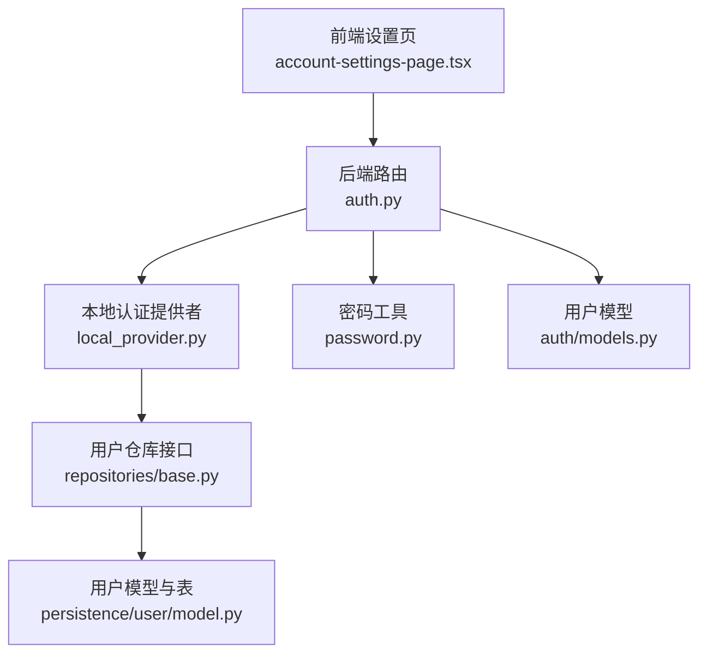
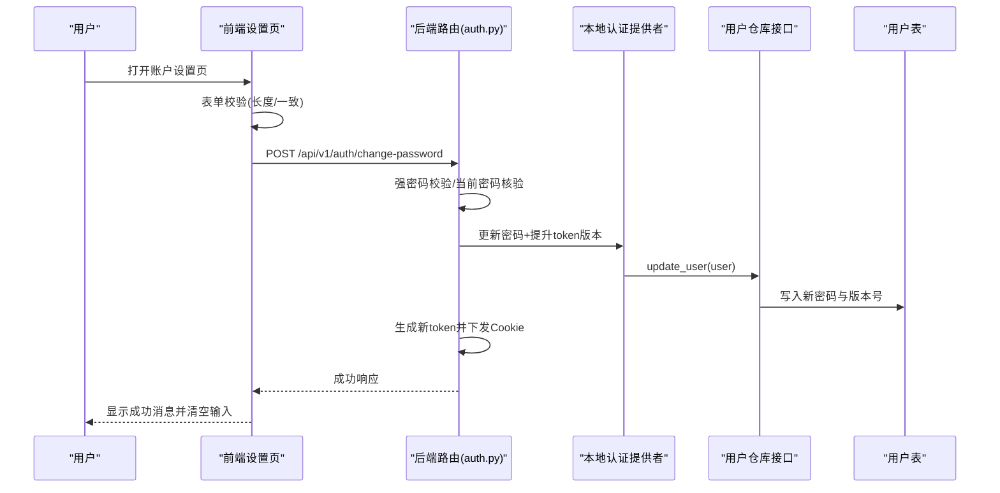
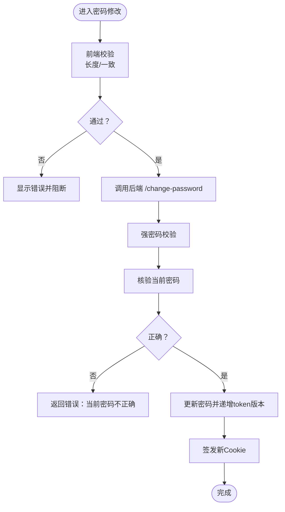
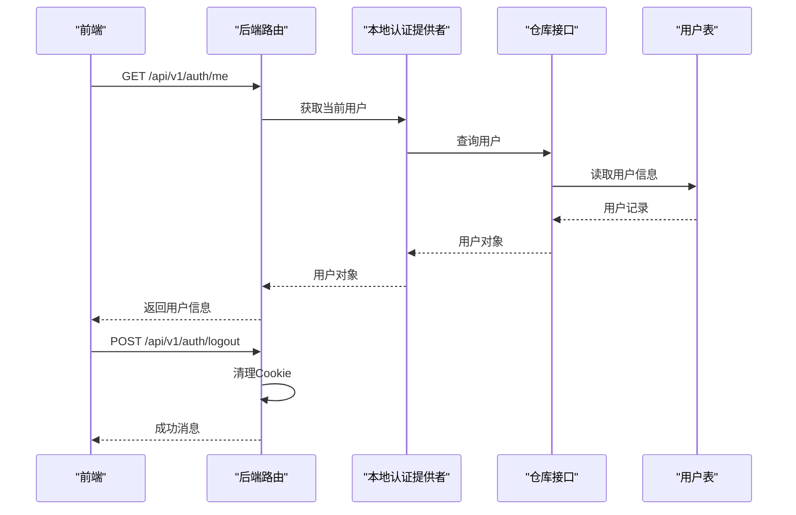
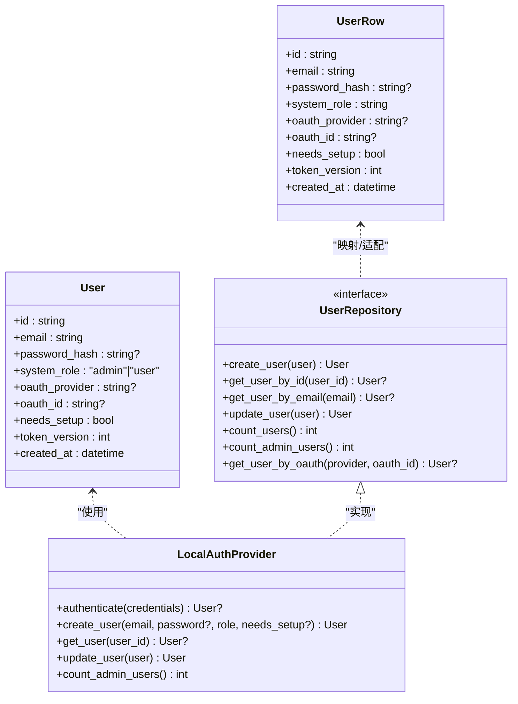
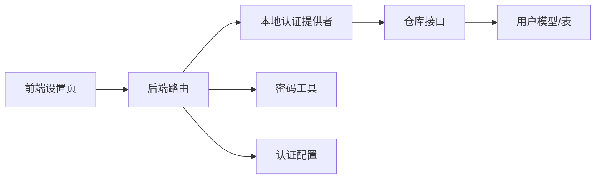

# 账户设置

<cite>
**本文引用的文件**
- [backend/app/gateway/routers/auth.py](file://backend/app/gateway/routers/auth.py)
- [backend/app/gateway/auth/models.py](file://backend/app/gateway/auth/models.py)
- [backend/app/gateway/auth/password.py](file://backend/app/gateway/auth/password.py)
- [backend/app/gateway/auth/local_provider.py](file://backend/app/gateway/auth/local_provider.py)
- [backend/packages/harness/deerflow/persistence/user/model.py](file://backend/packages/harness/deerflow/persistence/user/model.py)
- [backend/app/gateway/auth/repositories/base.py](file://backend/app/gateway/auth/repositories/base.py)
- [frontend/src/components/workspace/settings/account-settings-page.tsx](file://frontend/src/components/workspace/settings/account-settings-page.tsx)
- [frontend/src/components/workspace/settings/settings-section.tsx](file://frontend/src/components/workspace/settings/settings-section.tsx)
- [backend/docs/AUTH_TEST_PLAN.md](file://backend/docs/AUTH_TEST_PLAN.md)
</cite>

## 目录
1. [简介](#简介)
2. [项目结构](#项目结构)
3. [核心组件](#核心组件)
4. [架构总览](#架构总览)
5. [详细组件分析](#详细组件分析)
6. [依赖关系分析](#依赖关系分析)
7. [性能考量](#性能考量)
8. [故障排查指南](#故障排查指南)
9. [结论](#结论)

## 简介
本文件面向 DeerFlow 的“账户设置”模块，系统化梳理用户信息管理、密码修改与账户安全策略；并结合前端设置页与后端接口，完整说明个人信息展示、密码变更流程、Cookie 安全与会话控制、以及可扩展的双重认证与登录历史/安全审计能力边界。文档同时给出 API 接口定义、表单校验规则与安全防护实现细节，帮助开发者与运维人员快速理解与维护该模块。

## 项目结构
账户设置涉及前后端协作的关键位置如下：
- 后端 FastAPI 路由：提供认证与账户设置相关接口（登录、注册、登出、密码修改、当前用户信息等）
- 认证与安全：密码哈希版本化、令牌版本号、速率限制、CSRF Cookie 策略
- 数据模型：用户实体与数据库表结构
- 前端设置页：密码修改表单、国际化文案、错误提示与加载状态

图表来源
- [frontend/src/components/workspace/settings/account-settings-page.tsx:15-142](file://frontend/src/components/workspace/settings/account-settings-page.tsx#L15-L142)
- [backend/app/gateway/routers/auth.py:23-494](file://backend/app/gateway/routers/auth.py#L23-L494)
- [backend/app/gateway/auth/local_provider.py:13-105](file://backend/app/gateway/auth/local_provider.py#L13-L105)
- [backend/app/gateway/auth/repositories/base.py:18-103](file://backend/app/gateway/auth/repositories/base.py#L18-L103)
- [backend/packages/harness/deerflow/persistence/user/model.py:22-60](file://backend/packages/harness/deerflow/persistence/user/model.py#L22-L60)
- [backend/app/gateway/auth/password.py:1-82](file://backend/app/gateway/auth/password.py#L1-L82)
- [backend/app/gateway/auth/models.py:15-42](file://backend/app/gateway/auth/models.py#L15-L42)

章节来源
- [frontend/src/components/workspace/settings/account-settings-page.tsx:15-142](file://frontend/src/components/workspace/settings/account-settings-page.tsx#L15-L142)
- [backend/app/gateway/routers/auth.py:23-494](file://backend/app/gateway/routers/auth.py#L23-L494)

## 核心组件
- 密码修改接口与表单校验
  - 后端接口：接收当前密码与新密码，执行强密码校验、当前密码核验、更新密码并提升 token 版本、下发新 Cookie
  - 前端表单：必填字段、新密码长度校验、两次输入一致性校验、提交状态与错误提示
- 当前用户信息接口
  - 返回用户标识、邮箱、角色与首次设置标记
- 登录/登出与会话控制
  - 登录成功下发 HttpOnly Cookie；登出清理 Cookie；支持速率限制与代理 IP 解析
- 安全与防护
  - 强密码策略（常见弱口令黑名单 + 最小长度）
  - 令牌版本号用于强制失效旧会话
  - CSRF Cookie 与 SameSite/Lax 策略

章节来源
- [backend/app/gateway/routers/auth.py:115-123](file://backend/app/gateway/routers/auth.py#L115-L123)
- [backend/app/gateway/routers/auth.py:332-375](file://backend/app/gateway/routers/auth.py#L332-L375)
- [frontend/src/components/workspace/settings/account-settings-page.tsx:25-69](file://frontend/src/components/workspace/settings/account-settings-page.tsx#L25-L69)
- [backend/app/gateway/routers/auth.py:378-382](file://backend/app/gateway/routers/auth.py#L378-L382)
- [backend/app/gateway/routers/auth.py:325-329](file://backend/app/gateway/routers/auth.py#L325-L329)
- [backend/app/gateway/routers/auth.py:275-301](file://backend/app/gateway/routers/auth.py#L275-L301)
- [backend/app/gateway/auth/password.py:32-58](file://backend/app/gateway/auth/password.py#L32-L58)

## 架构总览
账户设置模块采用“前端表单 + 后端路由 + 认证提供者 + 仓库接口 + 持久层”的分层架构。前端负责用户交互与错误提示，后端负责业务规则与安全策略，认证提供者封装本地邮箱/密码认证与用户生命周期管理，仓库接口抽象存储访问，持久层承载用户数据。

图表来源
- [frontend/src/components/workspace/settings/account-settings-page.tsx:25-69](file://frontend/src/components/workspace/settings/account-settings-page.tsx#L25-L69)
- [backend/app/gateway/routers/auth.py:332-375](file://backend/app/gateway/routers/auth.py#L332-L375)
- [backend/app/gateway/auth/local_provider.py:98-100](file://backend/app/gateway/auth/local_provider.py#L98-L100)
- [backend/app/gateway/auth/repositories/base.py:65-79](file://backend/app/gateway/auth/repositories/base.py#L65-L79)
- [backend/packages/harness/deerflow/persistence/user/model.py:28-49](file://backend/packages/harness/deerflow/persistence/user/model.py#L28-L49)

## 详细组件分析

### 密码修改流程与表单校验
- 前端表单校验
  - 必填项：当前密码、新密码、确认新密码
  - 新密码长度不少于 8 位
  - 新密码与确认密码必须一致
  - 提交时显示加载态，成功后清空输入并提示成功
- 后端接口校验与处理
  - 请求体包含当前密码与新密码（可选邮箱更新）
  - 强密码校验：拒绝常见弱口令，最小长度要求
  - 当前密码核验失败返回错误
  - 更新密码并递增 token_version，以使旧会话失效
  - 重新签发带 HttpOnly 的访问令牌 Cookie
- 错误处理
  - 当前密码错误、邮箱冲突、OAuth 用户不允许改密等均返回明确错误码

图表来源
- [frontend/src/components/workspace/settings/account-settings-page.tsx:25-69](file://frontend/src/components/workspace/settings/account-settings-page.tsx#L25-L69)
- [backend/app/gateway/routers/auth.py:115-123](file://backend/app/gateway/routers/auth.py#L115-L123)
- [backend/app/gateway/routers/auth.py:332-375](file://backend/app/gateway/routers/auth.py#L332-L375)
- [backend/app/gateway/auth/password.py:32-58](file://backend/app/gateway/auth/password.py#L32-L58)

章节来源
- [frontend/src/components/workspace/settings/account-settings-page.tsx:25-69](file://frontend/src/components/workspace/settings/account-settings-page.tsx#L25-L69)
- [backend/app/gateway/routers/auth.py:115-123](file://backend/app/gateway/routers/auth.py#L115-L123)
- [backend/app/gateway/routers/auth.py:332-375](file://backend/app/gateway/routers/auth.py#L332-L375)
- [backend/app/gateway/auth/password.py:32-58](file://backend/app/gateway/auth/password.py#L32-L58)

### 当前用户信息与会话控制
- 获取当前用户信息
  - 返回用户 ID、邮箱、系统角色与是否需要首次设置
- 登录与登出
  - 登录成功下发 HttpOnly Cookie，并根据环境决定有效期
  - 登出清理 Cookie，当前设计未在登出时提升 token_version
- 速率限制与代理信任
  - 基于 IP 的登录尝试计数与锁定，支持通过受信代理头解析真实客户端 IP

图表来源
- [backend/app/gateway/routers/auth.py:378-382](file://backend/app/gateway/routers/auth.py#L378-L382)
- [backend/app/gateway/routers/auth.py:325-329](file://backend/app/gateway/routers/auth.py#L325-L329)
- [backend/app/gateway/auth/local_provider.py:61-64](file://backend/app/gateway/auth/local_provider.py#L61-L64)
- [backend/app/gateway/auth/repositories/base.py:40-51](file://backend/app/gateway/auth/repositories/base.py#L40-L51)
- [backend/packages/harness/deerflow/persistence/user/model.py:22-60](file://backend/packages/harness/deerflow/persistence/user/model.py#L22-L60)

章节来源
- [backend/app/gateway/routers/auth.py:378-382](file://backend/app/gateway/routers/auth.py#L378-L382)
- [backend/app/gateway/routers/auth.py:325-329](file://backend/app/gateway/routers/auth.py#L325-L329)
- [backend/app/gateway/routers/auth.py:275-301](file://backend/app/gateway/routers/auth.py#L275-L301)
- [backend/app/gateway/routers/auth.py:187-223](file://backend/app/gateway/routers/auth.py#L187-L223)

### 数据模型与持久化
- 用户实体
  - 字段：唯一标识、邮箱、密码哈希（可为空，OAuth 用户）、系统角色、OAuth 关联、首次设置标记、令牌版本号
- 数据库表
  - 邮箱唯一索引、OAuth 身份部分唯一索引、时间戳、布尔标志位
- 认证提供者与仓库接口
  - 提供认证、创建用户、按邮箱/ID 查询、更新用户、统计管理员数量等操作

图表来源
- [backend/packages/harness/deerflow/persistence/user/model.py:22-60](file://backend/packages/harness/deerflow/persistence/user/model.py#L22-L60)
- [backend/app/gateway/auth/models.py:15-42](file://backend/app/gateway/auth/models.py#L15-L42)
- [backend/app/gateway/auth/local_provider.py:13-105](file://backend/app/gateway/auth/local_provider.py#L13-L105)
- [backend/app/gateway/auth/repositories/base.py:18-103](file://backend/app/gateway/auth/repositories/base.py#L18-L103)

章节来源
- [backend/packages/harness/deerflow/persistence/user/model.py:22-60](file://backend/packages/harness/deerflow/persistence/user/model.py#L22-L60)
- [backend/app/gateway/auth/models.py:15-42](file://backend/app/gateway/auth/models.py#L15-L42)
- [backend/app/gateway/auth/local_provider.py:13-105](file://backend/app/gateway/auth/local_provider.py#L13-L105)
- [backend/app/gateway/auth/repositories/base.py:18-103](file://backend/app/gateway/auth/repositories/base.py#L18-L103)

### 安全与防护措施
- 强密码策略
  - 常见弱口令黑名单（运行时内存检查）
  - 最小长度约束
- 密码哈希与版本化
  - 使用 SHA-256 预处理规避 bcrypt 截断限制
  - 自动检测与兼容旧版哈希，必要时在登录时升级
- 令牌版本号与会话失效
  - 修改密码或邮箱后递增 token_version，使旧令牌立即失效
- Cookie 安全
  - HttpOnly、Secure（HTTPS 时）、SameSite=Lax
  - 登出仅清理 Cookie，当前设计未在登出时提升 token_version
- 速率限制
  - 基于 IP 的失败尝试计数与临时锁定，支持受信代理头解析真实 IP

章节来源
- [backend/app/gateway/auth/password.py:32-58](file://backend/app/gateway/auth/password.py#L32-L58)
- [backend/app/gateway/auth/password.py:66-82](file://backend/app/gateway/auth/password.py#L66-L82)
- [backend/app/gateway/routers/auth.py:361-363](file://backend/app/gateway/routers/auth.py#L361-L363)
- [backend/app/gateway/routers/auth.py:134-145](file://backend/app/gateway/routers/auth.py#L134-L145)
- [backend/app/gateway/routers/auth.py:275-301](file://backend/app/gateway/routers/auth.py#L275-L301)
- [backend/app/gateway/routers/auth.py:187-223](file://backend/app/gateway/routers/auth.py#L187-L223)

## 依赖关系分析
- 组件耦合
  - 前端设置页依赖后端接口与国际化资源
  - 后端路由依赖认证提供者与配置
  - 认证提供者依赖仓库接口与密码工具
  - 仓库接口与 ORM 层解耦，便于替换存储后端
- 外部依赖
  - bcrypt 用于密码哈希
  - FastAPI/Pydantic 用于路由与请求/响应模型
- 可能的循环依赖
  - 当前结构清晰，无明显循环导入

图表来源
- [frontend/src/components/workspace/settings/account-settings-page.tsx:15-142](file://frontend/src/components/workspace/settings/account-settings-page.tsx#L15-L142)
- [backend/app/gateway/routers/auth.py:23-494](file://backend/app/gateway/routers/auth.py#L23-L494)
- [backend/app/gateway/auth/local_provider.py:13-105](file://backend/app/gateway/auth/local_provider.py#L13-L105)
- [backend/app/gateway/auth/repositories/base.py:18-103](file://backend/app/gateway/auth/repositories/base.py#L18-L103)
- [backend/packages/harness/deerflow/persistence/user/model.py:22-60](file://backend/packages/harness/deerflow/persistence/user/model.py#L22-L60)
- [backend/app/gateway/auth/password.py:1-82](file://backend/app/gateway/auth/password.py#L1-L82)

章节来源
- [backend/app/gateway/routers/auth.py:23-494](file://backend/app/gateway/routers/auth.py#L23-L494)
- [backend/app/gateway/auth/local_provider.py:13-105](file://backend/app/gateway/auth/local_provider.py#L13-L105)
- [backend/app/gateway/auth/repositories/base.py:18-103](file://backend/app/gateway/auth/repositories/base.py#L18-L103)

## 性能考量
- 密码哈希异步化
  - 使用线程池避免阻塞事件循环，适合高并发场景
- 速率限制内存占用
  - 登录失败计数表采用字典存储，超过阈值时进行淘汰，避免无限增长
- Cookie 与会话
  - HttpOnly 减少 XSS 风险；合理设置有效期与 SameSite 策略平衡安全性与可用性

章节来源
- [backend/app/gateway/auth/password.py:66-82](file://backend/app/gateway/auth/password.py#L66-L82)
- [backend/app/gateway/routers/auth.py:243-270](file://backend/app/gateway/routers/auth.py#L243-L270)

## 故障排查指南
- 常见问题与定位
  - 密码修改失败：检查当前密码是否正确、新密码是否满足长度与强度要求、是否存在邮箱冲突
  - 登录频繁失败被锁定：确认是否命中速率限制，检查代理头与受信代理配置
  - 登出后仍可访问：当前设计未在登出时提升 token_version，旧令牌在过期前仍有效
- 测试参考
  - 登出后旧 token 重放测试脚本与预期结果可参考安全测试计划文档

章节来源
- [backend/app/gateway/routers/auth.py:332-375](file://backend/app/gateway/routers/auth.py#L332-L375)
- [backend/app/gateway/routers/auth.py:275-301](file://backend/app/gateway/routers/auth.py#L275-L301)
- [backend/docs/AUTH_TEST_PLAN.md:1675-1695](file://backend/docs/AUTH_TEST_PLAN.md#L1675-L1695)

## 结论
账户设置模块围绕“安全优先”的原则构建：前端表单校验与后端强密码策略相结合，配合令牌版本号与 HttpOnly Cookie 实现会话安全；认证提供者与仓库接口解耦，便于扩展与演进。当前实现聚焦密码修改与会话控制，双重认证、登录历史与安全审计等功能处于可扩展状态，建议在后续迭代中引入相应接口与审计日志机制，以进一步完善账户安全体系。