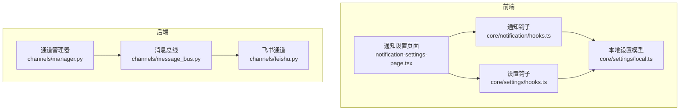
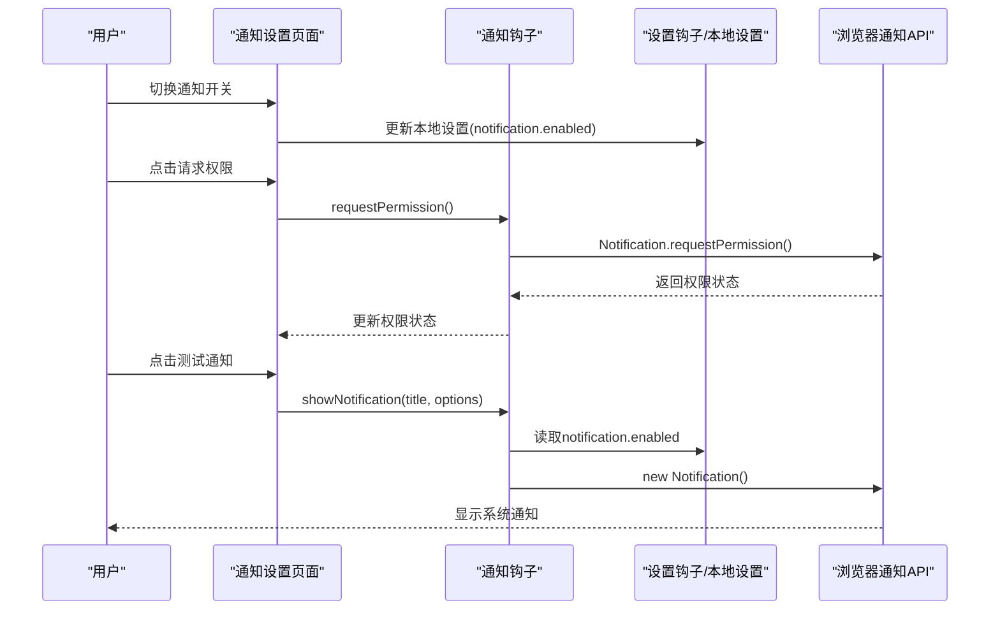
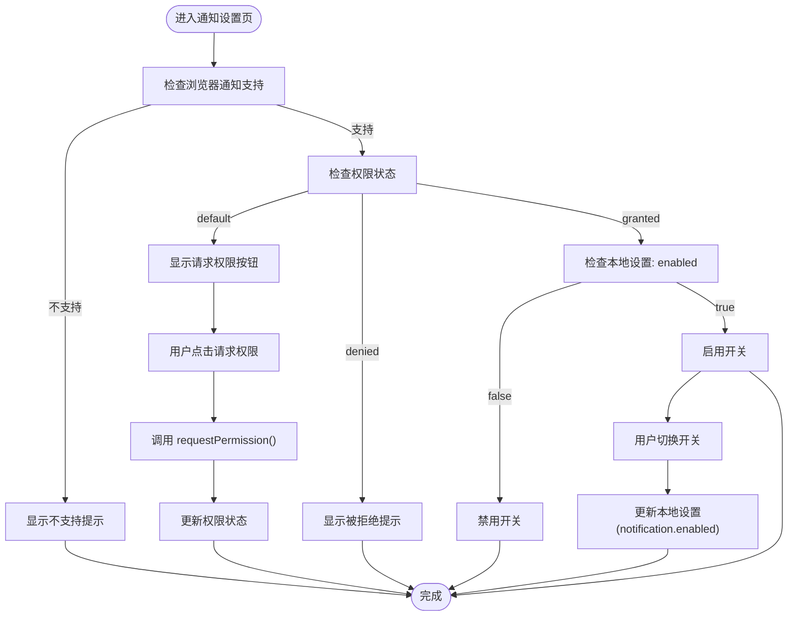
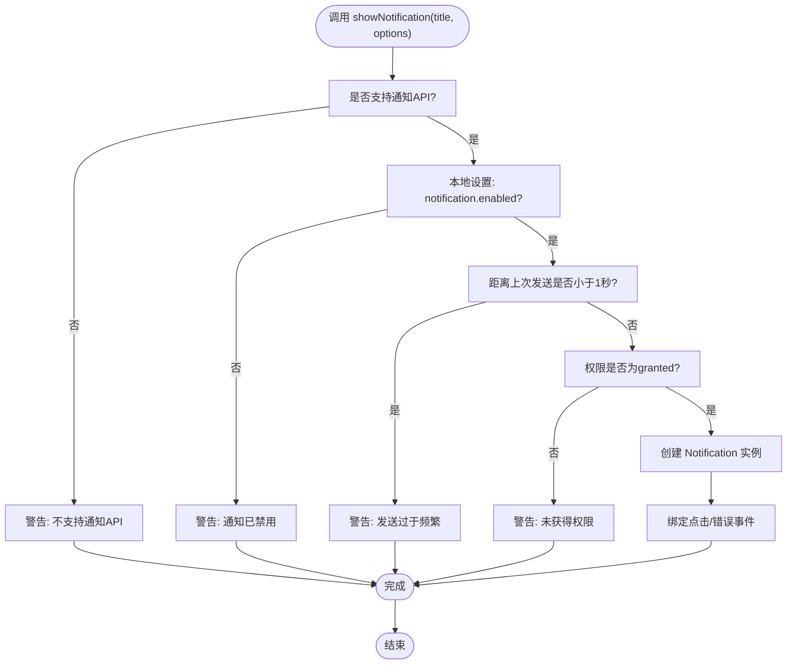
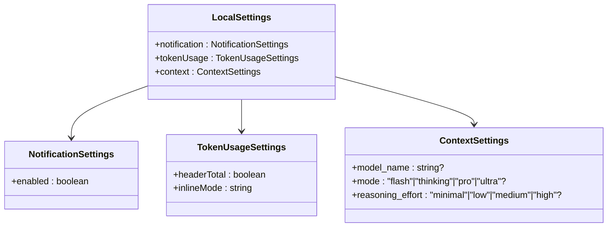
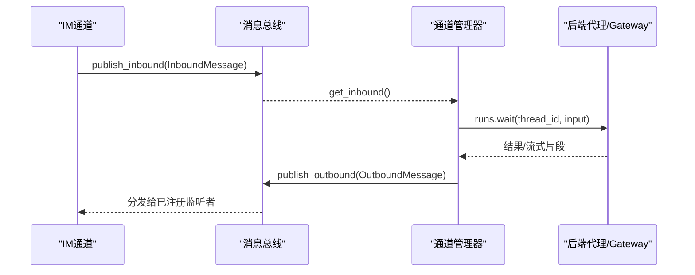
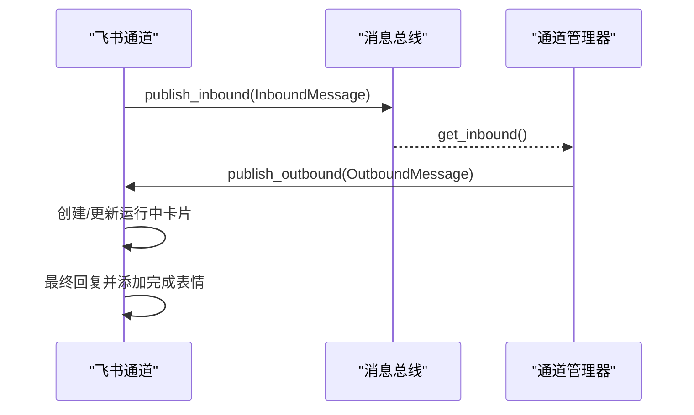
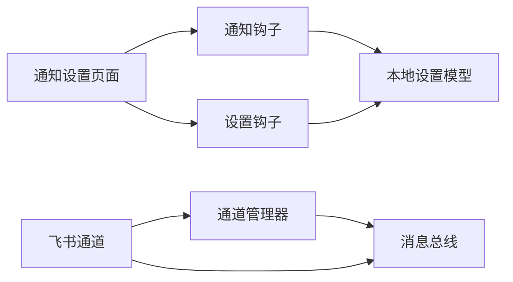

# 通知设置

<cite>
**本文档引用的文件**
- [notification-settings-page.tsx](file://frontend/src/components/workspace/settings/notification-settings-page.tsx)
- [hooks.ts](file://frontend/src/core/notification/hooks.ts)
- [hooks.ts](file://frontend/src/core/settings/hooks.ts)
- [local.ts](file://frontend/src/core/settings/local.ts)
- [manager.py](file://backend/app/channels/manager.py)
- [message_bus.py](file://backend/app/channels/message_bus.py)
- [feishu.py](file://backend/app/channels/feishu.py)
- [config.yaml](file://backend/config.yaml)
- [config.yaml](file://config.yaml)
</cite>

## 目录
1. [简介](#简介)
2. [项目结构](#项目结构)
3. [核心组件](#核心组件)
4. [架构概览](#架构概览)
5. [详细组件分析](#详细组件分析)
6. [依赖关系分析](#依赖关系分析)
7. [性能考虑](#性能考虑)
8. [故障排除指南](#故障排除指南)
9. [结论](#结论)

## 简介
本文件为 DeerFlow 通知设置模块的技术文档，聚焦于通知类型的管理、通知渠道的配置以及通知偏好的设置。文档详细说明了浏览器原生通知（系统通知）、IM 渠道通知（如飞书）以及邮件通知的配置选项，并解释了通知频率控制、静默时间与优先级设置。同时，文档提供了前端组件的实现思路、状态管理策略以及用户交互逻辑，帮助开发者快速理解并扩展通知功能。

## 项目结构
通知设置模块主要分布在前端与后端两个层面：
- 前端负责用户界面与本地状态管理，包括通知开关、权限请求与测试通知触发。
- 后端负责消息总线与各 IM 渠道的集成，确保消息在不同平台间可靠传递。

**图表来源**
- [notification-settings-page.tsx:13-92](file://frontend/src/components/workspace/settings/notification-settings-page.tsx#L13-L92)
- [hooks.ts:22-98](file://frontend/src/core/notification/hooks.ts#L22-L98)
- [hooks.ts:17-59](file://frontend/src/core/settings/hooks.ts#L17-L59)
- [local.ts:4-129](file://frontend/src/core/settings/local.ts#L4-L129)
- [message_bus.py:117-174](file://backend/app/channels/message_bus.py#L117-L174)
- [manager.py:548-800](file://backend/app/channels/manager.py#L548-L800)
- [feishu.py:28-699](file://backend/app/channels/feishu.py#L28-L699)

**章节来源**
- [notification-settings-page.tsx:1-93](file://frontend/src/components/workspace/settings/notification-settings-page.tsx#L1-L93)
- [hooks.ts:1-99](file://frontend/src/core/notification/hooks.ts#L1-L99)
- [hooks.ts:1-60](file://frontend/src/core/settings/hooks.ts#L1-L60)
- [local.ts:1-129](file://frontend/src/core/settings/local.ts#L1-L129)
- [message_bus.py:1-174](file://backend/app/channels/message_bus.py#L1-L174)
- [manager.py:1-1038](file://backend/app/channels/manager.py#L1-L1038)
- [feishu.py:1-699](file://backend/app/channels/feishu.py#L1-L699)

## 核心组件
- 前端通知设置页面：提供通知开关、权限请求与测试通知按钮，根据浏览器支持情况与权限状态动态渲染。
- 通知钩子：封装浏览器 Notification API，负责权限检查、请求权限与发送通知，并内置频率控制。
- 设置钩子与本地设置模型：统一管理本地设置的读取、合并与持久化，包含通知开关字段。
- 后端消息总线与通道管理器：负责消息的入队出队、订阅发布与通道适配，支撑 IM 渠道通知。
- 飞书通道：具体 IM 渠道实现，展示卡片消息、运行中提示与最终完成反馈。

**章节来源**
- [notification-settings-page.tsx:13-92](file://frontend/src/components/workspace/settings/notification-settings-page.tsx#L13-L92)
- [hooks.ts:22-98](file://frontend/src/core/notification/hooks.ts#L22-L98)
- [hooks.ts:17-59](file://frontend/src/core/settings/hooks.ts#L17-L59)
- [local.ts:4-129](file://frontend/src/core/settings/local.ts#L4-L129)
- [message_bus.py:117-174](file://backend/app/channels/message_bus.py#L117-L174)
- [manager.py:548-800](file://backend/app/channels/manager.py#L548-L800)
- [feishu.py:28-699](file://backend/app/channels/feishu.py#L28-L699)

## 架构概览
通知设置模块采用“前端本地控制 + 后端通道适配”的架构：
- 前端通过本地设置模型保存用户偏好（如是否启用通知），并通过通知钩子调用浏览器 API 发送系统通知。
- 后端通过消息总线与通道管理器对接多种 IM 渠道，实现跨平台的消息分发与反馈。

**图表来源**
- [notification-settings-page.tsx:15-34](file://frontend/src/components/workspace/settings/notification-settings-page.tsx#L15-L34)
- [hooks.ts:37-90](file://frontend/src/core/notification/hooks.ts#L37-L90)
- [hooks.ts:17-29](file://frontend/src/core/settings/hooks.ts#L17-L29)
- [local.ts:4-129](file://frontend/src/core/settings/local.ts#L4-L129)

## 详细组件分析

### 前端通知设置页面
- 功能要点
  - 权限状态检测：根据浏览器支持与当前权限状态决定 UI 行为（请求权限、禁用开关、显示测试按钮）。
  - 通知开关：仅在权限为已授予时可操作，变更后写入本地设置。
  - 测试通知：在满足权限与开关条件时触发一次通知。
- 用户交互
  - 开关切换：异步更新本地设置，避免阻塞 UI。
  - 权限请求：引导用户在浏览器中授权通知。
  - 测试通知：一键验证通知是否正常工作。

**图表来源**
- [notification-settings-page.tsx:13-92](file://frontend/src/components/workspace/settings/notification-settings-page.tsx#L13-L92)

**章节来源**
- [notification-settings-page.tsx:13-92](file://frontend/src/components/workspace/settings/notification-settings-page.tsx#L13-L92)

### 通知钩子（useNotification）
- 职责
  - 封装浏览器 Notification API，提供权限查询、权限请求与通知发送能力。
  - 内置通知频率控制（每秒最多一次），防止刷屏。
  - 处理通知点击与错误事件，增强用户体验。
- 关键行为
  - 权限检查：首次加载时读取当前权限状态。
  - 权限请求：调用浏览器 API 并更新状态。
  - 发送通知：在满足支持、开关开启、权限授予且未超过频率限制时发送。
  - 事件处理：点击时聚焦窗口并关闭通知；捕获错误日志。

**图表来源**
- [hooks.ts:51-90](file://frontend/src/core/notification/hooks.ts#L51-L90)

**章节来源**
- [hooks.ts:22-98](file://frontend/src/core/notification/hooks.ts#L22-L98)

### 设置钩子与本地设置模型
- 本地设置模型
  - 默认值：notification.enabled 默认为 true。
  - 存储：使用 localStorage 持久化，键名固定。
  - 合并与覆盖：支持上下文、令牌用量等其他设置项的合并与覆盖。
- 设置钩子
  - useLocalSettings：返回当前设置与更新函数，内部通过订阅机制响应变化。
  - useThreadSettings：支持按线程覆盖模型名称等上下文设置。

**图表来源**
- [local.ts:4-47](file://frontend/src/core/settings/local.ts#L4-L47)

**章节来源**
- [hooks.ts:17-59](file://frontend/src/core/settings/hooks.ts#L17-L59)
- [local.ts:4-129](file://frontend/src/core/settings/local.ts#L4-L129)

### 后端消息总线与通道管理器
- 消息总线
  - 入站队列：接收来自各通道的消息并排队。
  - 出站回调：向已注册的监听者广播出站消息。
- 通道管理器
  - 负责从入站队列取出消息，创建或复用线程，调用后端代理并发布回执。
  - 支持并发控制与异常处理，保证消息处理的稳定性。
  - 通道能力：不同通道支持流式与非流式，用于优化消息体验。

**图表来源**
- [message_bus.py:131-174](file://backend/app/channels/message_bus.py#L131-L174)
- [manager.py:712-800](file://backend/app/channels/manager.py#L712-L800)

**章节来源**
- [message_bus.py:117-174](file://backend/app/channels/message_bus.py#L117-L174)
- [manager.py:548-800](file://backend/app/channels/manager.py#L548-L800)

### 飞书通道（IM 渠道示例）
- 特性
  - 支持 WebSocket 长连接，无需公网 IP。
  - 支持卡片消息、运行中提示与最终完成反馈。
  - 文件上传/下载：支持图片与文件的上传与映射到沙箱虚拟路径。
- 交互流程
  - 接收消息：解析富文本、图片与文件键，构造入站消息。
  - 发送消息：优先更新运行中卡片，最终完成后添加完成表情。
  - 文件处理：根据大小限制与类型选择上传方式。

**图表来源**
- [feishu.py:585-699](file://backend/app/channels/feishu.py#L585-L699)
- [feishu.py:511-553](file://backend/app/channels/feishu.py#L511-L553)

**章节来源**
- [feishu.py:28-699](file://backend/app/channels/feishu.py#L28-L699)

## 依赖关系分析
- 前端依赖
  - 通知设置页面依赖通知钩子与设置钩子，以实现权限状态与本地设置的读写。
  - 通知钩子依赖本地设置模型，以判断是否允许发送通知。
- 后端依赖
  - 通道管理器依赖消息总线进行入队与出站广播。
  - 飞书通道依赖消息总线与通道管理器，实现消息的接收与发送。

**图表来源**
- [notification-settings-page.tsx:8-18](file://frontend/src/components/workspace/settings/notification-settings-page.tsx#L8-L18)
- [hooks.ts:3-49](file://frontend/src/core/notification/hooks.ts#L3-L49)
- [hooks.ts:3-26](file://frontend/src/core/settings/hooks.ts#L3-L26)
- [local.ts:4-129](file://frontend/src/core/settings/local.ts#L4-L129)
- [message_bus.py:117-174](file://backend/app/channels/message_bus.py#L117-L174)
- [manager.py:548-800](file://backend/app/channels/manager.py#L548-L800)
- [feishu.py:28-699](file://backend/app/channels/feishu.py#L28-L699)

**章节来源**
- [notification-settings-page.tsx:1-93](file://frontend/src/components/workspace/settings/notification-settings-page.tsx#L1-L93)
- [hooks.ts:1-99](file://frontend/src/core/notification/hooks.ts#L1-L99)
- [hooks.ts:1-60](file://frontend/src/core/settings/hooks.ts#L1-L60)
- [local.ts:1-129](file://frontend/src/core/settings/local.ts#L1-L129)
- [message_bus.py:1-174](file://backend/app/channels/message_bus.py#L1-L174)
- [manager.py:1-1038](file://backend/app/channels/manager.py#L1-L1038)
- [feishu.py:1-699](file://backend/app/channels/feishu.py#L1-L699)

## 性能考虑
- 前端通知频率控制
  - 通过时间戳限制每秒最多发送一次通知，避免频繁弹窗导致的性能与体验问题。
- 后端并发与吞吐
  - 通道管理器使用信号量控制最大并发，防止资源争用。
  - 消息总线采用异步队列与回调机制，提升消息分发效率。
- IM 渠道优化
  - 飞书通道支持卡片消息与运行中提示，减少重复消息与闪烁，改善用户体验。

[本节为通用指导，无需引用具体文件]

## 故障排除指南
- 浏览器不支持通知
  - 现象：页面显示“不支持通知”提示。
  - 处理：确认浏览器支持 Notification API；在受支持的浏览器中启用通知。
- 通知权限被拒绝
  - 现象：页面显示被拒绝提示，无法发送通知。
  - 处理：引导用户在浏览器设置中手动允许通知权限。
- 通知开关无效
  - 现象：切换开关后仍无法发送通知。
  - 处理：确认权限状态为“已授予”，且本地设置已正确保存。
- 后端消息未到达 IM 渠道
  - 现象：前端无回执或 IM 无消息。
  - 处理：检查消息总线订阅状态、通道管理器运行状态与通道配置。

**章节来源**
- [notification-settings-page.tsx:36-88](file://frontend/src/components/workspace/settings/notification-settings-page.tsx#L36-L88)
- [hooks.ts:37-90](file://frontend/src/core/notification/hooks.ts#L37-L90)
- [message_bus.py:131-174](file://backend/app/channels/message_bus.py#L131-L174)
- [manager.py:660-680](file://backend/app/channels/manager.py#L660-L680)
- [feishu.py:176-188](file://backend/app/channels/feishu.py#L176-L188)

## 结论
通知设置模块通过前端本地控制与后端通道适配实现了灵活的通知管理：前端负责用户偏好与权限控制，后端负责消息分发与跨平台适配。通知钩子内置频率控制与错误处理，提升了用户体验；消息总线与通道管理器保障了消息的稳定传输。未来可在以下方面扩展：
- 增加邮件通知与推送通知的配置入口与后端适配。
- 引入通知优先级与静默时间段策略，结合用户上下文智能调度。
- 在 IM 渠道中增加更丰富的通知样式与交互反馈。

[本节为总结性内容，无需引用具体文件]