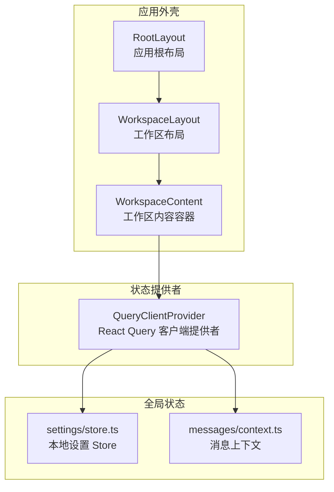
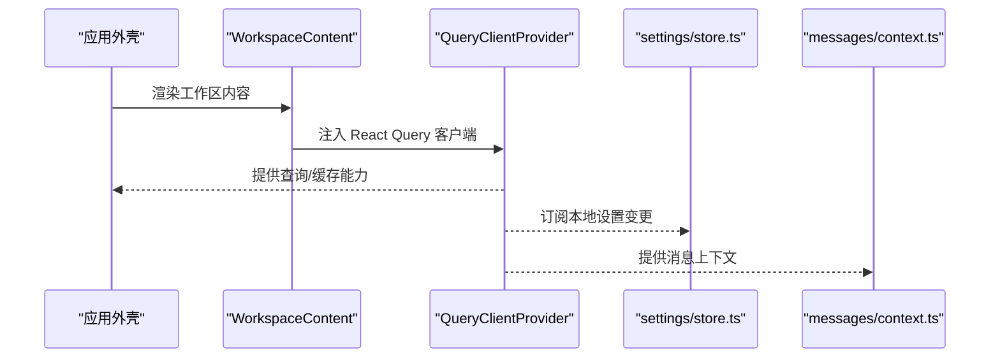
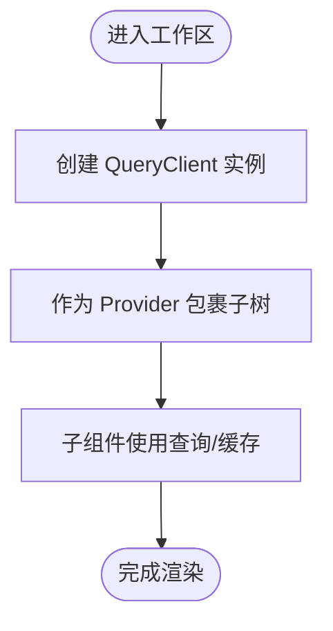
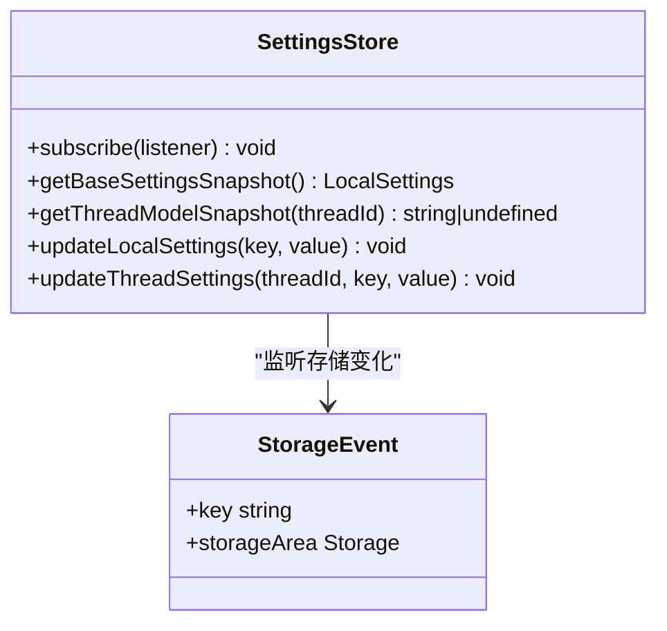
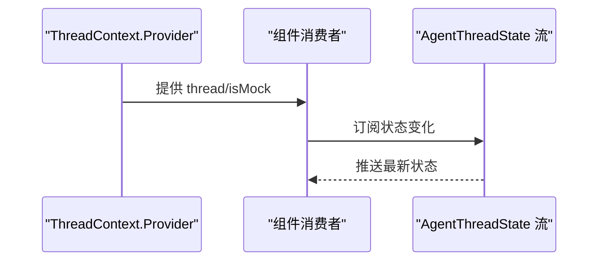
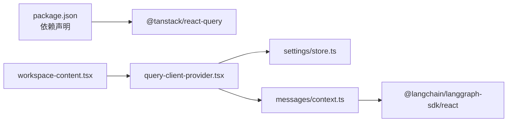

# 状态管理机制

<cite>
**本文引用的文件**
- [frontend/package.json](file://frontend/package.json)
- [frontend/src/components/query-client-provider.tsx](file://frontend/src/components/query-client-provider.tsx)
- [frontend/src/app/layout.tsx](file://frontend/src/app/layout.tsx)
- [frontend/src/app/workspace/layout.tsx](file://frontend/src/app/workspace/layout.tsx)
- [frontend/src/app/workspace/workspace-content.tsx](file://frontend/src/app/workspace/workspace-content.tsx)
- [frontend/src/core/settings/store.ts](file://frontend/src/core/settings/store.ts)
- [frontend/src/components/workspace/messages/context.ts](file://frontend/src/components/workspace/messages/context.ts)
</cite>

## 目录
1. [引言](#引言)
2. [项目结构](#项目结构)
3. [核心组件](#核心组件)
4. [架构总览](#架构总览)
5. [详细组件分析](#详细组件分析)
6. [依赖关系分析](#依赖关系分析)
7. [性能考量](#性能考量)
8. [故障排查指南](#故障排查指南)
9. [结论](#结论)

## 引言
本文件系统性梳理 DeerFlow 前端的状态管理机制，重点覆盖以下方面：
- 基于 React Query 的数据获取与缓存策略：查询配置、缓存失效与错误处理
- 全局状态管理：本地设置存储与上下文（Context）的组合使用
- 实时数据同步、乐观更新与冲突解决思路
- 最佳实践与性能优化建议

本说明面向不同技术背景的读者，既提供高层概览，也给出可操作的落地建议。

## 项目结构
前端采用 Next.js 应用结构，状态管理相关的关键位置如下：
- React Query 客户端提供者位于组件层，通过工作区布局注入到应用树中
- 本地设置状态通过自研 Store 模块管理，支持订阅与跨标签页同步
- 消息流上下文通过 React Context 提供实时线程状态访问

图表来源
- [frontend/src/app/layout.tsx:15-28](file://frontend/src/app/layout.tsx#L15-L28)
- [frontend/src/app/workspace/layout.tsx:12-60](file://frontend/src/app/workspace/layout.tsx#L12-L60)
- [frontend/src/app/workspace/workspace-content.tsx:17-35](file://frontend/src/app/workspace/workspace-content.tsx#L17-L35)
- [frontend/src/components/query-client-provider.tsx:10-20](file://frontend/src/components/query-client-provider.tsx#L10-L20)
- [frontend/src/core/settings/store.ts:1-151](file://frontend/src/core/settings/store.ts#L1-L151)
- [frontend/src/components/workspace/messages/context.ts:1-22](file://frontend/src/components/workspace/messages/context.ts#L1-L22)

章节来源
- [frontend/src/app/layout.tsx:15-28](file://frontend/src/app/layout.tsx#L15-L28)
- [frontend/src/app/workspace/layout.tsx:12-60](file://frontend/src/app/workspace/layout.tsx#L12-L60)
- [frontend/src/app/workspace/workspace-content.tsx:17-35](file://frontend/src/app/workspace/workspace-content.tsx#L17-L35)
- [frontend/src/components/query-client-provider.tsx:1-21](file://frontend/src/components/query-client-provider.tsx#L1-L21)

## 核心组件
- React Query 客户端提供者：在工作区内容容器中注入 QueryClientProvider，使整个工作区内的组件均可使用 React Query 的查询与缓存能力
- 本地设置 Store：提供订阅、快照读取、线程级模型名缓存与跨标签页事件监听，用于持久化与响应式更新
- 消息上下文：通过 Context 暴露 Agent 线程状态流，便于实时渲染与交互

章节来源
- [frontend/src/components/query-client-provider.tsx:1-21](file://frontend/src/components/query-client-provider.tsx#L1-L21)
- [frontend/src/core/settings/store.ts:1-151](file://frontend/src/core/settings/store.ts#L1-L151)
- [frontend/src/components/workspace/messages/context.ts:1-22](file://frontend/src/components/workspace/messages/context.ts#L1-L22)

## 架构总览
下图展示状态管理在应用中的整体流向：布局层负责装配提供者，组件层通过 React Query 获取与缓存数据，Store 负责本地设置与跨标签页同步，Context 提供实时线程状态。

图表来源
- [frontend/src/app/workspace/workspace-content.tsx:25-34](file://frontend/src/app/workspace/workspace-content.tsx#L25-L34)
- [frontend/src/components/query-client-provider.tsx:10-20](file://frontend/src/components/query-client-provider.tsx#L10-L20)
- [frontend/src/core/settings/store.ts:93-150](file://frontend/src/core/settings/store.ts#L93-L150)
- [frontend/src/components/workspace/messages/context.ts:6-21](file://frontend/src/components/workspace/messages/context.ts#L6-L21)

## 详细组件分析

### 组件一：React Query 客户端提供者
- 角色与职责
  - 创建并导出全局唯一的 QueryClient 实例
  - 作为 React 组件树的提供者，向子树暴露查询/缓存能力
- 关键点
  - 默认配置：未显式传入配置项，使用默认行为
  - 作用域：仅在工作区内容容器内生效，避免污染其他页面
- 使用建议
  - 在需要进行数据请求与缓存的页面或组件中，直接使用 React Query Hooks
  - 对于需要强一致性的写操作，结合“乐观更新 + 回滚”策略与“查询重置/无效化”机制

图表来源
- [frontend/src/components/query-client-provider.tsx:8-20](file://frontend/src/components/query-client-provider.tsx#L8-L20)
- [frontend/src/app/workspace/workspace-content.tsx:25-34](file://frontend/src/app/workspace/workspace-content.tsx#L25-L34)

章节来源
- [frontend/src/components/query-client-provider.tsx:1-21](file://frontend/src/components/query-client-provider.tsx#L1-L21)
- [frontend/src/app/workspace/workspace-content.tsx:17-35](file://frontend/src/app/workspace/workspace-content.tsx#L17-L35)

### 组件二：本地设置 Store（本地状态）
- 角色与职责
  - 管理本地设置的读取、合并、保存与订阅
  - 支持线程级模型名称缓存与跨标签页同步
- 数据结构与行为
  - 订阅者集合：用于通知变更
  - 线程模型名映射：按线程 ID 缓存模型名
  - 存储事件监听：监听 localStorage 变化以保持多标签页一致性
- 复杂度与性能
  - 订阅通知：O(n) 遍历订阅者集合
  - 线程模型名缓存：Map 查找 O(1)
  - 事件处理：按需加载基础设置，避免重复 IO

图表来源
- [frontend/src/core/settings/store.ts:1-151](file://frontend/src/core/settings/store.ts#L1-L151)

章节来源
- [frontend/src/core/settings/store.ts:1-151](file://frontend/src/core/settings/store.ts#L1-L151)

### 组件三：消息上下文（实时状态）
- 角色与职责
  - 通过 Context 暴露 Agent 线程状态流，便于组件树内消费
  - 支持 Mock 模式标记，便于测试与演示
- 使用场景
  - 实时渲染线程状态、消息流与交互反馈
  - 与 React Query 查询结果协同，实现“流 + 查询”的混合状态

图表来源
- [frontend/src/components/workspace/messages/context.ts:6-21](file://frontend/src/components/workspace/messages/context.ts#L6-L21)

章节来源
- [frontend/src/components/workspace/messages/context.ts:1-22](file://frontend/src/components/workspace/messages/context.ts#L1-L22)

## 依赖关系分析
- React Query 依赖
  - 通过 package.json 可见 @tanstack/react-query 已安装，为状态管理提供查询、缓存与失效机制的基础
- 组件耦合
  - QueryClientProvider 与 WorkspaceContent 强耦合，确保仅在工作区生效
  - Store 与 Context 分别承担“持久化/订阅”和“实时流”的职责，边界清晰
- 外部依赖
  - @langchain/langgraph-sdk/react 的 BaseStream 类型用于消息上下文，体现与后端流式接口的对接

图表来源
- [frontend/package.json:49-49](file://frontend/package.json#L49-L49)
- [frontend/src/app/workspace/workspace-content.tsx:4-4](file://frontend/src/app/workspace/workspace-content.tsx#L4-L4)
- [frontend/src/components/query-client-provider.tsx:1-21](file://frontend/src/components/query-client-provider.tsx#L1-L21)
- [frontend/src/core/settings/store.ts:1-11](file://frontend/src/core/settings/store.ts#L1-L11)
- [frontend/src/components/workspace/messages/context.ts:1-1](file://frontend/src/components/workspace/messages/context.ts#L1-L1)

章节来源
- [frontend/package.json:21-92](file://frontend/package.json#L21-L92)
- [frontend/src/app/workspace/workspace-content.tsx:1-36](file://frontend/src/app/workspace/workspace-content.tsx#L1-L36)
- [frontend/src/components/query-client-provider.tsx:1-21](file://frontend/src/components/query-client-provider.tsx#L1-L21)
- [frontend/src/core/settings/store.ts:1-11](file://frontend/src/core/settings/store.ts#L1-L11)
- [frontend/src/components/workspace/messages/context.ts:1-8](file://frontend/src/components/workspace/messages/context.ts#L1-L8)

## 性能考量
- React Query 缓存策略
  - 默认缓存生命周期：组件卸载后仍保留缓存，避免重复请求
  - 建议：针对频繁变动的数据设置合理的 staleTime、gcTime 与 refetch 策略，减少不必要网络请求
- 查询重置与失效
  - 写操作成功后优先调用 invalidateQueries 或 resetQueries，确保后续读取命中最新数据
  - 对于批量写入，使用批量失效策略降低抖动
- 本地设置 Store
  - 通过 Map 缓存线程模型名，避免重复读取本地存储
  - 订阅通知按需触发，避免全量重渲染
- 上下文渲染
  - 将 Context 消费者拆分至独立组件，配合 memo 化减少重渲染
- 并发与节流
  - 对高频事件（如滚动、输入）使用节流/防抖，降低查询压力

## 故障排查指南
- React Query 未生效
  - 确认 QueryClientProvider 是否包裹目标组件树
  - 检查工作区布局是否正确引入 WorkspaceContent
- 本地设置不同步
  - 检查浏览器是否允许 localStorage
  - 确认是否存在跨标签页事件监听注册逻辑
- 实时状态不更新
  - 确认消息上下文 Provider 是否正确包裹
  - 检查流式数据源是否正常推送

章节来源
- [frontend/src/app/workspace/workspace-content.tsx:25-34](file://frontend/src/app/workspace/workspace-content.tsx#L25-L34)
- [frontend/src/core/settings/store.ts:41-91](file://frontend/src/core/settings/store.ts#L41-L91)
- [frontend/src/components/workspace/messages/context.ts:11-21](file://frontend/src/components/workspace/messages/context.ts#L11-L21)

## 结论
DeerFlow 前端采用“React Query + 本地 Store + Context”的组合方案实现状态管理：
- React Query 负责远端数据的获取、缓存与失效
- 本地 Store 负责本地设置与跨标签页同步
- Context 提供实时线程状态的树内共享
该设计在保证性能的同时兼顾了可维护性与扩展性。建议在实际业务中结合具体场景进一步细化查询配置、优化缓存策略，并完善错误处理与回滚机制。