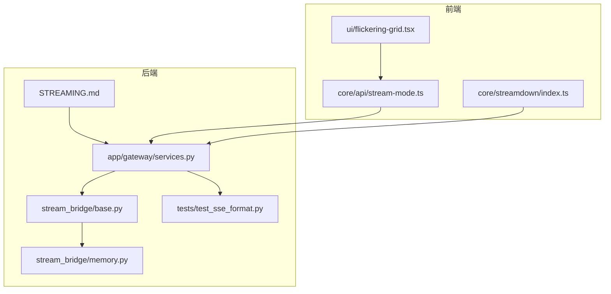
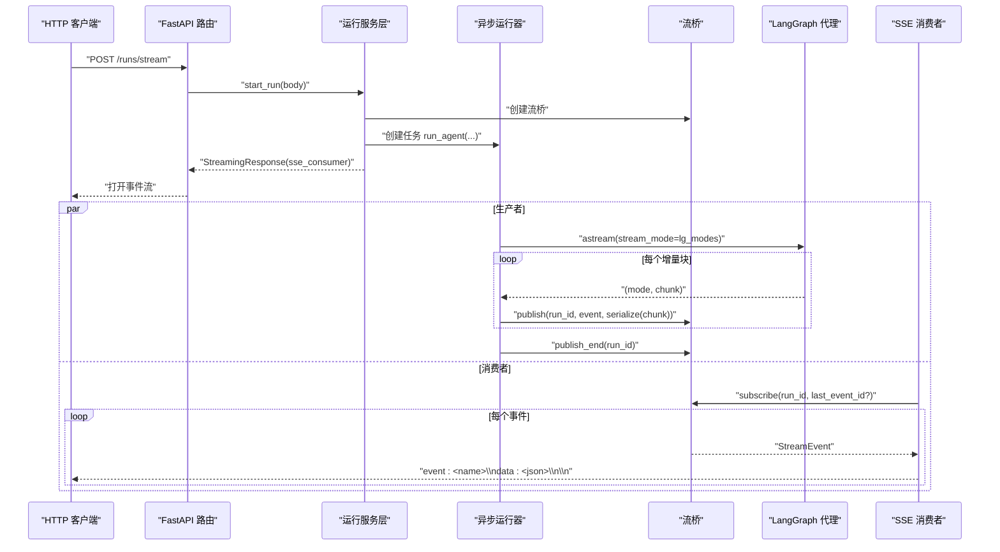
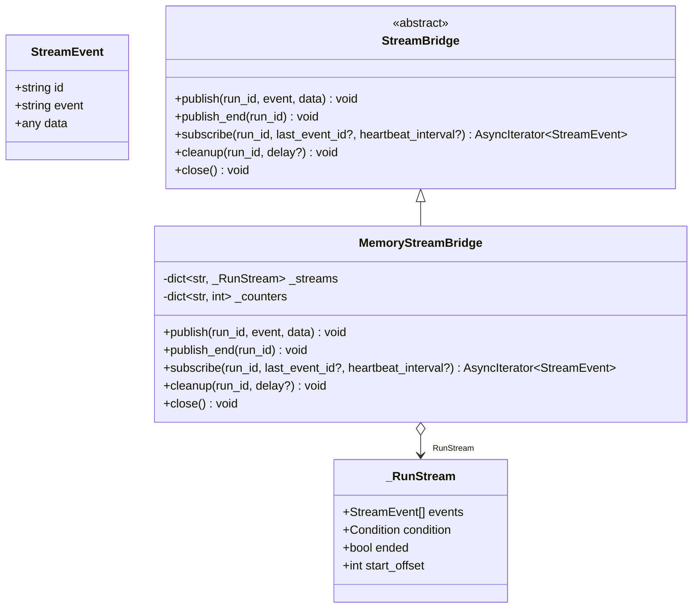
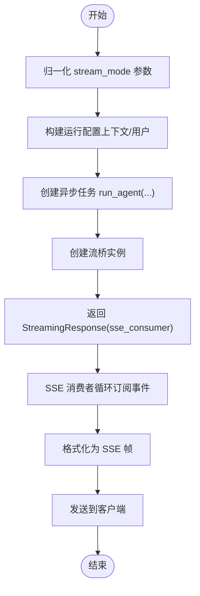
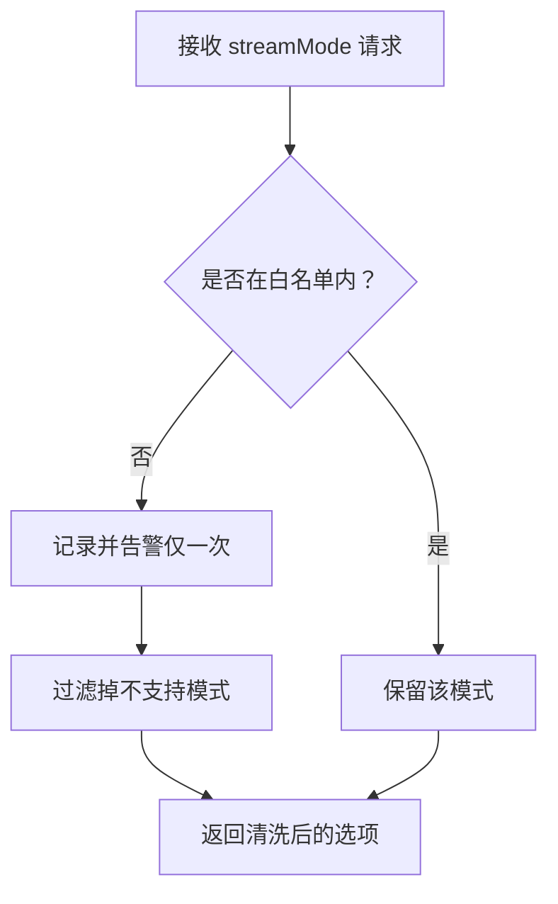
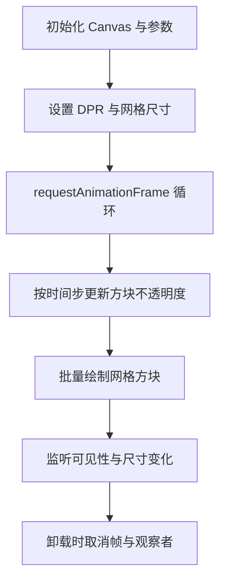
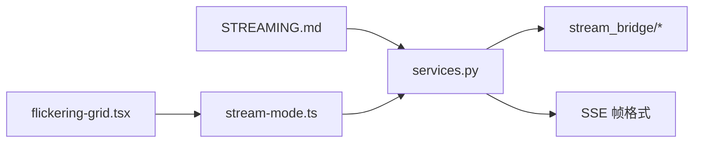

# 流式响应处理

<cite>
**本文引用的文件**
- [STREAMING.md](file://backend/docs/STREAMING.md)
- [base.py](file://backend/packages/harness/deerflow/runtime/stream_bridge/base.py)
- [memory.py](file://backend/packages/harness/deerflow/runtime/stream_bridge/memory.py)
- [services.py](file://backend/app/gateway/services.py)
- [stream-mode.ts](file://frontend/src/core/api/stream-mode.ts)
- [flickering-grid.tsx](file://frontend/src/components/ui/flickering-grid.tsx)
- [index.ts](file://frontend/src/core/streamdown/index.ts)
- [test_sse_format.py](file://backend/tests/test_sse_format.py)
</cite>

## 目录
1. [简介](#简介)
2. [项目结构](#项目结构)
3. [核心组件](#核心组件)
4. [架构总览](#架构总览)
5. [详细组件分析](#详细组件分析)
6. [依赖分析](#依赖分析)
7. [性能考量](#性能考量)
8. [故障排查指南](#故障排查指南)
9. [结论](#结论)
10. [附录](#附录)

## 简介
本技术文档聚焦 DeerFlow 的流式响应处理系统，系统性阐述 Server-Sent Events（SSE）处理、增量渲染与实时更新机制、状态管理、缓冲区控制与错误恢复策略，并结合前端加载指示器组件与用户体验优化建议，提供调试技巧与性能监控方法。文档以“两条并行路径”为主线：Gateway 路径（异步 + HTTP SSE + JSON 序列化）与 DeerFlowClient 路径（同步 + 进程内 + 原生 LangChain 对象），解释其各自契约、不变式与设计权衡。

## 项目结构
围绕流式处理的关键目录与文件：
- 后端
  - 文档与设计：backend/docs/STREAMING.md
  - 流桥抽象与内存实现：backend/packages/harness/deerflow/runtime/stream_bridge/*
  - 网关服务与 SSE 格式化：backend/app/gateway/services.py
  - 单元测试（SSE 帧格式）：backend/tests/test_sse_format.py
- 前端
  - 流模式白名单与清洗：frontend/src/core/api/stream-mode.ts
  - 流式下载插件入口：frontend/src/core/streamdown/index.ts
  - 加载指示器（闪烁网格）：frontend/src/components/ui/flickering-grid.tsx

**图表来源**
- [STREAMING.md:1-352](file://backend/docs/STREAMING.md#L1-L352)
- [base.py:1-73](file://backend/packages/harness/deerflow/runtime/stream_bridge/base.py#L1-L73)
- [memory.py:1-134](file://backend/packages/harness/deerflow/runtime/stream_bridge/memory.py#L1-L134)
- [services.py:1-200](file://backend/app/gateway/services.py#L1-L200)
- [stream-mode.ts:1-69](file://frontend/src/core/api/stream-mode.ts#L1-L69)
- [index.ts:1-2](file://frontend/src/core/streamdown/index.ts#L1-L2)
- [flickering-grid.tsx:1-203](file://frontend/src/components/ui/flickering-grid.tsx#L1-L203)

**章节来源**
- [STREAMING.md:1-352](file://backend/docs/STREAMING.md#L1-L352)
- [services.py:1-200](file://backend/app/gateway/services.py#L1-L200)
- [stream-mode.ts:1-69](file://frontend/src/core/api/stream-mode.ts#L1-L69)

## 核心组件
- 流桥抽象（StreamBridge）
  - 定义发布/订阅、心跳与结束信号、清理与关闭等契约，支撑跨任务/进程的事件解耦。
  - 关键点：事件结构体包含事件名与可序列化数据；心跳与结束哨兵用于消费者侧的超时与收尾。
- 内存流桥（MemoryStreamBridge）
  - 基于 asyncio.Condition 的 in-memory 事件日志，支持 Last-Event-ID 重连、有限缓冲窗口与溢出回收。
  - 关键点：为每个 run_id 维护事件列表、条件变量与单调递增 id；支持延迟清理与资源回收。
- 网关服务（SSE 输出）
  - 将流桥事件格式化为标准 SSE 帧（event/data/id），并与 FastAPI StreamingResponse 结合。
  - 关键点：normalize_stream_modes 默认值与 LangGraph 平台 wire 格式对齐；format_sse 严格字段顺序。
- 前端流模式清洗
  - 白名单过滤与去重告警，确保请求参数与平台支持的模式集合一致。
- 加载指示器组件
  - 基于 Canvas 的闪烁网格动画，提供轻量、可配置的占位与加载反馈。

**章节来源**
- [base.py:16-73](file://backend/packages/harness/deerflow/runtime/stream_bridge/base.py#L16-L73)
- [memory.py:17-134](file://backend/packages/harness/deerflow/runtime/stream_bridge/memory.py#L17-L134)
- [services.py:43-96](file://backend/app/gateway/services.py#L43-L96)
- [stream-mode.ts:1-69](file://frontend/src/core/api/stream-mode.ts#L1-L69)
- [flickering-grid.tsx:1-203](file://frontend/src/components/ui/flickering-grid.tsx#L1-L203)

## 架构总览
两条并行路径的设计目标是满足两类消费者模型：
- Gateway 路径：异步 + SSE + JSON，面向浏览器与 IM 渠道，具备 Last-Event-ID 重连、心跳与多订阅者 fan-out。
- DeerFlowClient 路径：同步 + 直接 yield，面向 Jupyter、脚本与测试，直接消费原生 LangChain 对象。

**图表来源**
- [STREAMING.md:102-145](file://backend/docs/STREAMING.md#L102-L145)
- [services.py:43-96](file://backend/app/gateway/services.py#L43-L96)
- [base.py:37-73](file://backend/packages/harness/deerflow/runtime/stream_bridge/base.py#L37-L73)
- [memory.py:68-124](file://backend/packages/harness/deerflow/runtime/stream_bridge/memory.py#L68-L124)

## 详细组件分析

### 组件一：流桥抽象与内存实现
- 抽象协议
  - StreamEvent：包含 id、event 名称与 data；心跳与结束哨兵用于消费者侧的超时与收尾。
  - StreamBridge：定义 publish/publish_end/subscribe/cleanup/close 等接口。
- 内存实现
  - 为每个 run_id 维护事件列表与条件变量，支持 Last-Event-ID 回放与溢出回收。
  - 订阅侧在超时时间内未收到事件时发送心跳；收到结束信号后终止迭代。
  - 支持延迟清理，允许晚到订阅者在释放资源前完成事件排空。

**图表来源**
- [base.py:16-73](file://backend/packages/harness/deerflow/runtime/stream_bridge/base.py#L16-L73)
- [memory.py:17-134](file://backend/packages/harness/deerflow/runtime/stream_bridge/memory.py#L17-L134)

**章节来源**
- [base.py:16-73](file://backend/packages/harness/deerflow/runtime/stream_bridge/base.py#L16-L73)
- [memory.py:17-134](file://backend/packages/harness/deerflow/runtime/stream_bridge/memory.py#L17-L134)

### 组件二：网关服务与 SSE 帧格式
- SSE 帧格式化
  - format_sse 严格遵循 event/data/id 字段顺序，与 LangGraph 平台 wire 格式一致。
  - end 事件 data 为 null；metadata 事件包含 run_id 与 attempt；error 事件使用 message/name 格式。
- 输入与模式归一化
  - normalize_stream_modes 默认返回 ["values"]，前端 useStream 期望 values + messages-tuple。
  - normalize_input 将平台输入格式转换为 LangChain state dict，确保消息角色正确映射。

**图表来源**
- [services.py:43-96](file://backend/app/gateway/services.py#L43-L96)
- [services.py:171-200](file://backend/app/gateway/services.py#L171-L200)
- [test_sse_format.py:6-30](file://backend/tests/test_sse_format.py#L6-L30)

**章节来源**
- [services.py:43-96](file://backend/app/gateway/services.py#L43-L96)
- [services.py:171-200](file://backend/app/gateway/services.py#L171-L200)
- [test_sse_format.py:1-30](file://backend/tests/test_sse_format.py#L1-L30)

### 组件三：前端流模式清洗与增量渲染
- 流模式清洗
  - stream-mode.ts 提供 SUPPORTED_RUN_STREAM_MODES 白名单，sanitizeRunStreamOptions 过滤不支持模式并告警。
  - 未见过的模式仅警告一次，避免重复噪声。
- 增量渲染与实时更新
  - 前端 useStream 基于 messages-tuple 事件进行增量拼接，values 快照用于补充完整状态。
  - messages 模式给出 delta（单次 token），values 模式给出节点级完整 state 快照，二者互补。

**图表来源**
- [stream-mode.ts:1-69](file://frontend/src/core/api/stream-mode.ts#L1-L69)

**章节来源**
- [stream-mode.ts:1-69](file://frontend/src/core/api/stream-mode.ts#L1-L69)
- [STREAMING.md:175-198](file://backend/docs/STREAMING.md#L175-L198)

### 组件四：加载指示器与用户体验优化
- FlickeringGrid 组件
  - 基于 Canvas 的网格闪烁动画，支持方块大小、间距、闪烁概率、颜色与最大不透明度等参数。
  - 使用 IntersectionObserver 与 ResizeObserver 控制绘制生命周期，减少不必要的计算。
  - 适合在长流渲染场景中作为占位与加载反馈，提升感知性能。

**图表来源**
- [flickering-grid.tsx:57-184](file://frontend/src/components/ui/flickering-grid.tsx#L57-L184)

**章节来源**
- [flickering-grid.tsx:1-203](file://frontend/src/components/ui/flickering-grid.tsx#L1-L203)

## 依赖分析
- 后端
  - STREAMING.md 作为总体设计文档，指导两条路径的契约与不变式。
  - services.py 依赖流桥抽象与 SSE 格式化工具，协调运行生命周期与事件输出。
  - stream_bridge/* 提供抽象与内存实现，支撑 Gateway 路径的心跳、重连与缓冲。
- 前端
  - stream-mode.ts 与后端 SSE wire 格式保持一致，确保模式协商与消费语义一致。
  - flickering-grid.tsx 作为通用 UI 组件，可在长流渲染时提供加载反馈。

**图表来源**
- [STREAMING.md:1-352](file://backend/docs/STREAMING.md#L1-L352)
- [services.py:1-200](file://backend/app/gateway/services.py#L1-L200)
- [base.py:1-73](file://backend/packages/harness/deerflow/runtime/stream_bridge/base.py#L1-L73)
- [memory.py:1-134](file://backend/packages/harness/deerflow/runtime/stream_bridge/memory.py#L1-L134)
- [stream-mode.ts:1-69](file://frontend/src/core/api/stream-mode.ts#L1-L69)
- [flickering-grid.tsx:1-203](file://frontend/src/components/ui/flickering-grid.tsx#L1-L203)

**章节来源**
- [STREAMING.md:1-352](file://backend/docs/STREAMING.md#L1-L352)
- [services.py:1-200](file://backend/app/gateway/services.py#L1-L200)
- [stream-mode.ts:1-69](file://frontend/src/core/api/stream-mode.ts#L1-L69)

## 性能考量
- 增量 vs 累积
  - messages 模式提供 token 级 delta，前端或客户端自行累加；避免一次性拼接大字符串带来的 O(n^2) 拼接成本。
- 缓冲与回放
  - MemoryStreamBridge 限制缓冲大小并回收最早事件，支持 Last-Event-ID 回放；合理设置队列上限与心跳间隔，平衡延迟与内存占用。
- 前端绘制
  - Canvas 动画在不可见时暂停，ResizeObserver 与 IntersectionObserver 减少无效绘制；在高并发流场景中降低 CPU/GPU 压力。
- 模式选择
  - 仅订阅必要的 streamMode，避免冗余事件；通过白名单清洗减少无效流量。

[本节为通用性能建议，不直接分析具体文件]

## 故障排查指南
- SSE 帧格式问题
  - 使用单元测试验证 end/metadata/error 事件格式，确保字段顺序与内容符合平台 wire 格式。
- 模式缺失导致“一次性返回”
  - 回归测试强调必须订阅 "messages" 模式，否则会出现视觉上的一次性输出而非逐 token 流。
- 重连与断连
  - 检查 Last-Event-ID 是否正确传递；确认心跳间隔与超时设置；验证内存桥的 start_offset 与回放逻辑。
- 前端模式不支持
  - 查看 stream-mode.ts 的告警日志，确认请求中的模式是否被清洗；核对前端与后端对 "messages-tuple" 的约定。

**章节来源**
- [test_sse_format.py:1-30](file://backend/tests/test_sse_format.py#L1-L30)
- [STREAMING.md:292-335](file://backend/docs/STREAMING.md#L292-L335)
- [services.py:43-96](file://backend/app/gateway/services.py#L43-L96)
- [stream-mode.ts:1-69](file://frontend/src/core/api/stream-mode.ts#L1-L69)

## 结论
DeerFlow 的流式响应系统通过两条并行路径适配不同消费者模型：Gateway 路径强调跨网络边界的可靠性与可扩展性，DeerFlowClient 路径强调简单与直觉。流桥抽象与内存实现提供了心跳、重连与缓冲能力；SSE 帧格式与前端模式清洗确保跨层一致性；加载指示器与增量渲染共同提升用户体验。通过严格的测试策略与可观测性实践，系统在复杂场景下仍能保持稳定与高性能。

[本节为总结性内容，不直接分析具体文件]

## 附录
- 相关源码定位
  - DeerFlowClient 嵌入式流与聊天累加器：packages/harness/deerflow/client.py（参考 STREAMING.md 中的定位）
  - Gateway 异步流与 SSE 输出：packages/harness/deerflow/runtime/runs/worker.py、app/gateway/services.py
  - 序列化到 wire 格式：packages/harness/deerflow/runtime/serialization.py
  - LangGraph 模式命名翻译：packages/harness/deerflow/runtime/runs/worker.py
  - 飞书渠道增量卡片更新：app/channels/manager.py
  - Channels 自带 delta/cumulative 防御性累加：app/channels/manager.py
  - 前端 useStream 支持的模式集合：frontend/src/core/api/stream-mode.ts
  - 核心回归测试：backend/tests/test_client.py（参考 STREAMING.md 中的定位）

[本节为索引性内容，不直接分析具体文件]