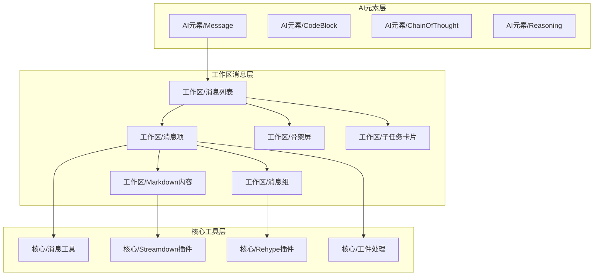
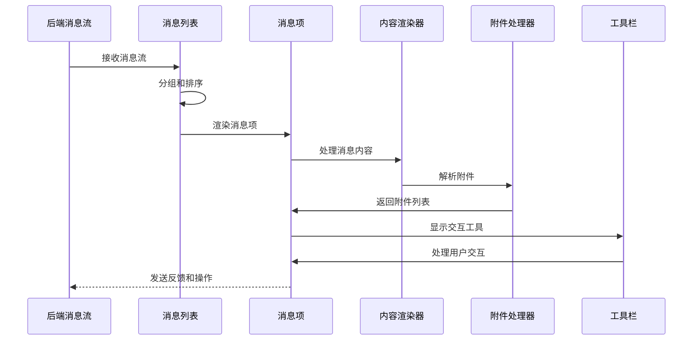
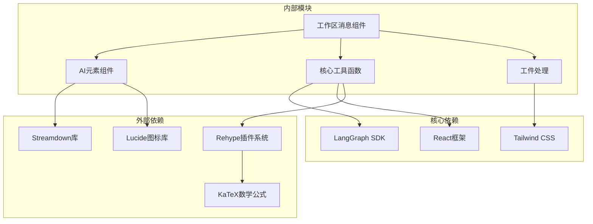

# 消息组件系统

<cite>
**本文档引用的文件**
- [message.tsx](file://frontend/src/components/ai-elements/message.tsx)
- [message-list.tsx](file://frontend/src/components/workspace/messages/message-list.tsx)
- [message-list-item.tsx](file://frontend/src/components/workspace/messages/message-list-item.tsx)
- [markdown-content.tsx](file://frontend/src/components/workspace/messages/markdown-content.tsx)
- [message-group.tsx](file://frontend/src/components/workspace/messages/message-group.tsx)
- [skeleton.tsx](file://frontend/src/components/workspace/messages/skeleton.tsx)
- [subtask-card.tsx](file://frontend/src/components/workspace/messages/subtask-card.tsx)
</cite>

## 目录
1. [简介](#简介)
2. [项目结构](#项目结构)
3. [核心组件](#核心组件)
4. [架构概览](#架构概览)
5. [详细组件分析](#详细组件分析)
6. [依赖关系分析](#依赖关系分析)
7. [性能考虑](#性能考虑)
8. [故障排除指南](#故障排除指南)
9. [结论](#结论)

## 简介

DeerFlow 消息组件系统是前端聊天界面的核心渲染引擎，负责将来自后端的多模态消息内容转换为用户友好的界面元素。该系统支持多种消息类型，包括纯文本、富文本、代码块、图片、文件附件、工具调用链路追踪等复杂内容。

系统采用模块化设计，通过可组合的组件架构实现了高度的可扩展性和可维护性。每个组件都专注于特定的功能领域，同时通过清晰的接口进行协作，确保了良好的代码组织和职责分离。

## 项目结构

消息组件系统主要分布在以下目录结构中：

**图表来源**
- [message.tsx:1-447](file://frontend/src/components/ai-elements/message.tsx#L1-L447)
- [message-list.tsx:1-520](file://frontend/src/components/workspace/messages/message-list.tsx#L1-L520)
- [message-list-item.tsx:1-826](file://frontend/src/components/workspace/messages/message-list-item.tsx#L1-L826)

**章节来源**
- [message.tsx:1-447](file://frontend/src/components/ai-elements/message.tsx#L1-L447)
- [message-list.tsx:1-520](file://frontend/src/components/workspace/messages/message-list.tsx#L1-L520)

## 核心组件

### 基础消息容器组件

系统的基础消息容器提供了统一的消息渲染框架，支持用户消息和助手消息的不同样式和行为。

#### Message 组件
- **角色区分**: 通过 `from` 属性区分用户消息("user")和助手消息("assistant")
- **样式系统**: 使用条件类名实现响应式布局和主题适配
- **无障碍支持**: 内置语义化标签和屏幕阅读器支持

#### MessageContent 组件
- **内容容器**: 提供消息内容的统一容器样式
- **响应式设计**: 支持不同屏幕尺寸下的内容适配
- **主题变体**: 用户消息和助手消息使用不同的视觉风格

#### MessageActions 组件
- **操作按钮组**: 提供消息级别的交互操作区域
- **悬停显示**: 通过CSS过渡效果实现智能显示控制
- **无障碍标签**: 所有按钮都包含适当的aria-label属性

**章节来源**
- [message.tsx:23-57](file://frontend/src/components/ai-elements/message.tsx#L23-L57)

### 分支消息系统

系统支持分支消息的渲染和导航，用于处理多路径的对话流程。

#### MessageBranch 组件
- **上下文管理**: 使用React Context管理分支状态
- **循环导航**: 支持上一个/下一个分支的循环切换
- **动态更新**: 通过setBranches方法动态更新分支内容

#### 分支导航组件
- **分支选择器**: 显示可用分支数量和当前分支状态
- **前进后退按钮**: 提供直观的分支切换控件
- **页码显示**: 显示当前分支在总分支数中的位置

**章节来源**
- [message.tsx:107-303](file://frontend/src/components/ai-elements/message.tsx#L107-L303)

### 附件处理系统

系统提供完整的文件附件处理能力，支持图片和非图片文件的不同展示方式。

#### MessageAttachment 组件
- **类型检测**: 自动识别图片和非图片文件类型
- **图片预览**: 图片文件显示缩略图，支持悬停移除功能
- **文件图标**: 非图片文件显示相应的文件类型图标
- **移除功能**: 支持悬停状态下显示移除按钮

#### MessageAttachments 组件
- **网格布局**: 使用CSS Grid实现响应式附件网格
- **自动换行**: 支持多列自适应布局
- **间距控制**: 统一的间距和对齐规则

**章节来源**
- [message.tsx:322-428](file://frontend/src/components/ai-elements/message.tsx#L322-L428)

## 架构概览

消息组件系统采用分层架构设计，从底层的AI元素到上层的工作区组件，形成了完整的消息渲染生态。

**图表来源**
- [message-list.tsx:158-520](file://frontend/src/components/workspace/messages/message-list.tsx#L158-L520)
- [message-list-item.tsx:379-464](file://frontend/src/components/workspace/messages/message-list-item.tsx#L379-L464)

系统的核心数据流遵循以下模式：
1. **消息接收**: 从后端LangGraph SDK接收标准化消息对象
2. **消息分组**: 按发送者类型和时间顺序对消息进行逻辑分组
3. **内容解析**: 根据消息类型和内容特征选择合适的渲染策略
4. **附件处理**: 提取和处理文件附件，生成相应的UI元素
5. **交互增强**: 添加复制、评分、反馈等交互功能

## 详细组件分析

### 消息列表渲染器

消息列表组件是整个系统的核心协调器，负责管理消息的生命周期和渲染策略。

#### 主要功能特性

**消息分组算法**
- 智能识别连续的人类消息和助手消息序列
- 支持特殊消息类型的专门处理（如澄清请求、文件展示）
- 实现消息历史的逻辑分组和时间线组织

**性能优化策略**
- 虚拟滚动支持：通过IntersectionObserver实现无限滚动
- 节流控制：加载更多历史消息时使用节流机制避免频繁请求
- 记忆化缓存：使用useMemo优化昂贵的计算操作

**国际化支持**
- 完整的多语言支持，包括工具调用描述和错误信息
- 动态语言切换支持
- 本地化格式化函数

**章节来源**
- [message-list.tsx:158-520](file://frontend/src/components/workspace/messages/message-list.tsx#L158-L520)

### 消息项渲染器

消息项组件负责单个消息的完整渲染，包括内容处理、附件展示和交互功能。

#### 内容处理管道

**Markdown渲染流程**
- 使用Streamdown库处理实时流式渲染
- 支持数学公式、代码高亮等高级Markdown特性
- 集成引用链接和外部链接处理

**富文本支持**
- 图片链接自动转换为可点击的预览链接
- 文件上传状态的可视化指示
- 角色扮演评估的专门渲染逻辑

**章节来源**
- [message-list-item.tsx:379-658](file://frontend/src/components/workspace/messages/message-list-item.tsx#L379-L658)

### Markdown内容渲染器

专用的Markdown渲染组件提供了丰富的文本格式化能力。

#### 渲染特性

**插件系统**
- 可配置的Remark插件链，支持自定义语法扩展
- Rehype插件链，用于HTML转换和增强
- 数学公式支持（KaTeX集成）

**链接处理机制**
- 自动识别和处理引用链接（citation:前缀）
- 外部链接的安全处理（noopener noreferrer）
- 下划线样式和悬停效果的统一管理

**章节来源**
- [markdown-content.tsx:19-77](file://frontend/src/components/workspace/messages/markdown-content.tsx#L19-L77)

### 消息组渲染器

消息组组件专门处理复杂的工具调用链路和推理过程的可视化。

#### 推理链路追踪

**工具调用可视化**
- 不同工具类型的图标和颜色编码
- 实时结果展示和状态更新
- 搜索结果的网格化展示

**思维过程追踪**
- 逐步展示AI的思考过程
- 令牌使用量的调试信息
- 可折叠的详细信息面板

**章节来源**
- [message-group.tsx:45-357](file://frontend/src/components/workspace/messages/message-group.tsx#L45-L357)

### 子任务卡片组件

专门用于展示和管理子任务执行状态的组件。

#### 状态管理系统

**任务生命周期**
- 进行中：显示加载动画和实时状态更新
- 已完成：展示最终结果和总结
- 已失败：显示错误信息和诊断详情

**交互功能**
- 可折叠的详细信息面板
- 实时状态更新和通知
- 与主任务系统的集成

**章节来源**
- [subtask-card.tsx:32-178](file://frontend/src/components/workspace/messages/subtask-card.tsx#L32-L178)

## 依赖关系分析

消息组件系统建立了清晰的依赖层次结构，确保了模块间的松耦合和高内聚。

**图表来源**
- [message-list.tsx:1-520](file://frontend/src/components/workspace/messages/message-list.tsx#L1-L520)
- [message-list-item.tsx:1-826](file://frontend/src/components/workspace/messages/message-list-item.tsx#L1-L826)

### 关键依赖关系

**消息数据流**
- 后端LangGraph SDK提供标准化的消息对象
- React状态管理处理UI状态更新
- Streamdown库实现流式内容渲染

**样式和主题**
- Tailwind CSS提供原子化样式系统
- 主题变量支持深色/浅色模式切换
- 响应式设计支持多设备适配

**国际化和本地化**
- i18n hooks提供多语言支持
- 动态语言切换功能
- 本地化格式化工具

**章节来源**
- [message.tsx:1-447](file://frontend/src/components/ai-elements/message.tsx#L1-L447)
- [message-list.tsx:1-520](file://frontend/src/components/workspace/messages/message-list.tsx#L1-L520)

## 性能考虑

消息组件系统在设计时充分考虑了性能优化，采用了多种策略来确保流畅的用户体验。

### 渲染性能优化

**虚拟化和懒加载**
- 消息列表使用IntersectionObserver实现无限滚动
- 节流控制加载更多历史消息的触发频率
- 懒加载图片和附件内容

**记忆化和缓存**
- 使用useMemo缓存昂贵的计算结果
- React.memo优化子组件的重渲染
- 缓存已解析的内容和附件信息

**异步处理**
- 流式渲染支持实时内容更新
- 异步附件加载避免阻塞主线程
- 并发渲染多个消息项

### 内存管理

**组件卸载清理**
- 清理IntersectionObserver监听器
- 取消未完成的异步操作
- 释放大对象引用避免内存泄漏

**状态管理优化**
- 最小化状态更新范围
- 合理的状态分割避免不必要的重渲染
- 使用useCallback稳定回调函数引用

## 故障排除指南

### 常见问题和解决方案

**消息渲染异常**
- 检查消息数据格式是否符合LangGraph SDK规范
- 验证Markdown内容的语法正确性
- 确认附件URL的有效性和可访问性

**性能问题诊断**
- 使用浏览器开发者工具监控渲染性能
- 检查是否有过多的强制同步布局
- 监控内存使用情况避免泄漏

**样式问题排查**
- 验证Tailwind CSS类名的正确性
- 检查CSS变量的定义和作用域
- 确认响应式断点的设置

### 调试工具和技巧

**开发环境调试**
- 使用React DevTools检查组件树和状态
- 利用浏览器网络面板监控资源加载
- 启用详细的日志输出跟踪消息流

**生产环境监控**
- 实施错误边界捕获组件渲染异常
- 监控关键性能指标如LCP、FID
- 设置用户反馈收集机制

**章节来源**
- [skeleton.tsx:24-80](file://frontend/src/components/workspace/messages/skeleton.tsx#L24-L80)
- [message-list.tsx:53-156](file://frontend/src/components/workspace/messages/message-list.tsx#L53-L156)

## 结论

DeerFlow 消息组件系统通过精心设计的架构和实现，成功地将复杂的多模态消息内容转换为直观易用的用户界面。系统的核心优势包括：

**模块化设计**: 清晰的组件层次结构和职责分离，便于维护和扩展

**性能优化**: 多层次的性能优化策略确保了流畅的用户体验

**可扩展性**: 插件化的架构支持新消息类型的快速集成

**用户体验**: 丰富的交互功能和响应式设计提升了用户满意度

未来的发展方向包括进一步优化大型消息的渲染性能、增强离线处理能力、以及支持更多样化的消息格式。通过持续的迭代改进，该系统将继续为用户提供卓越的聊天体验。