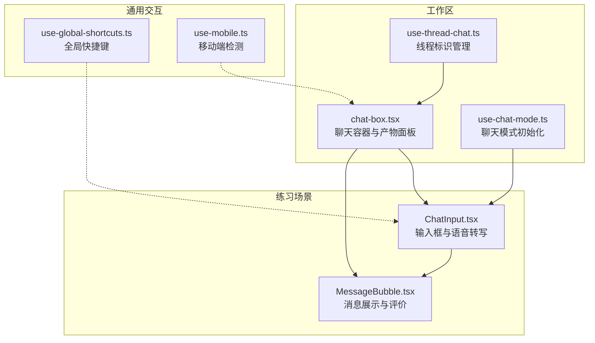
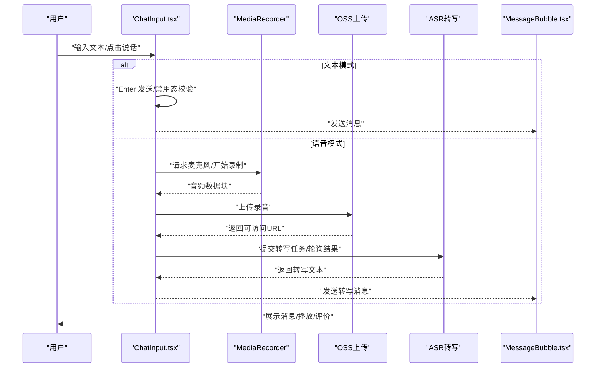
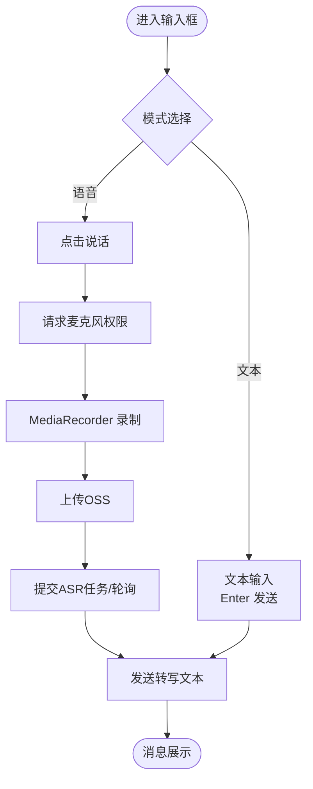
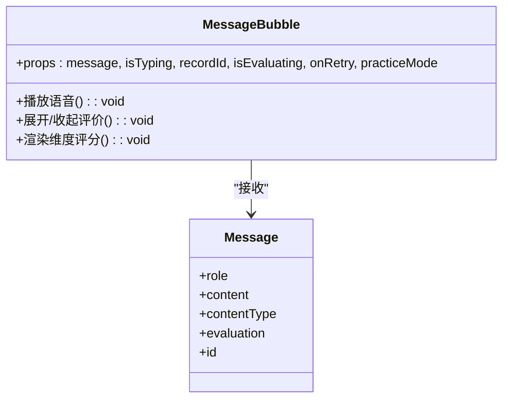
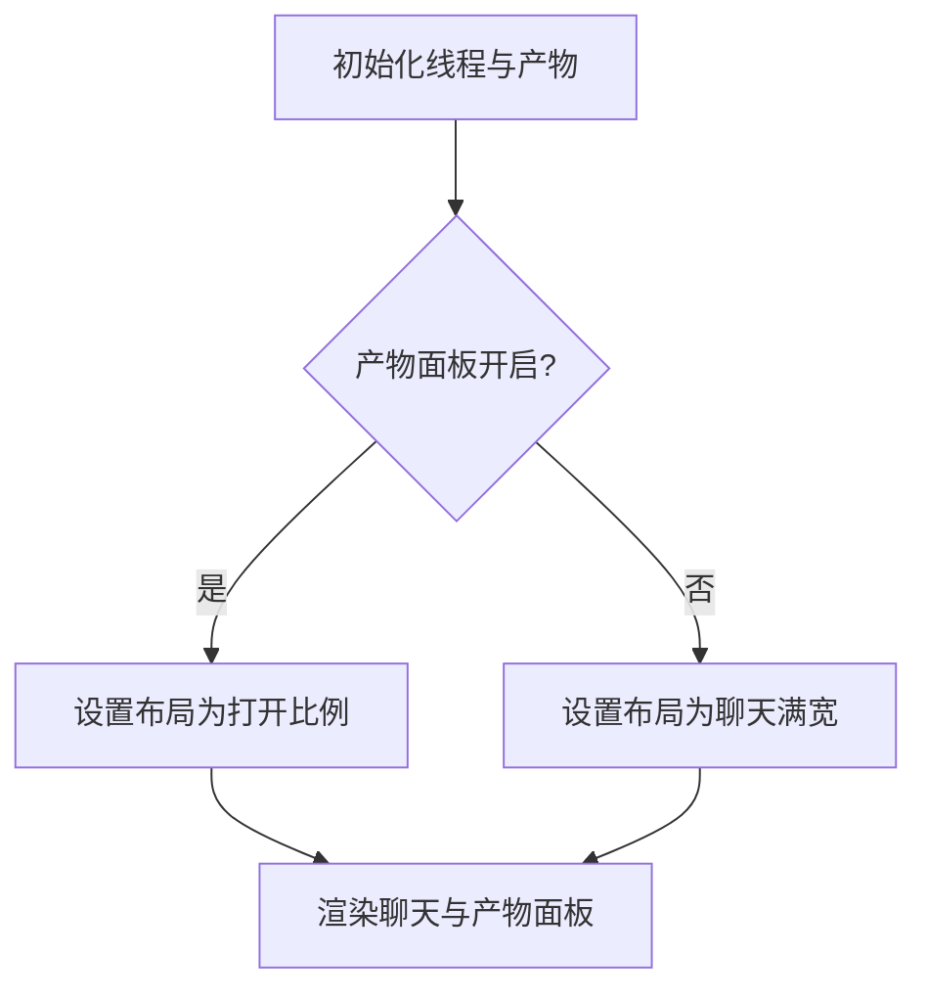
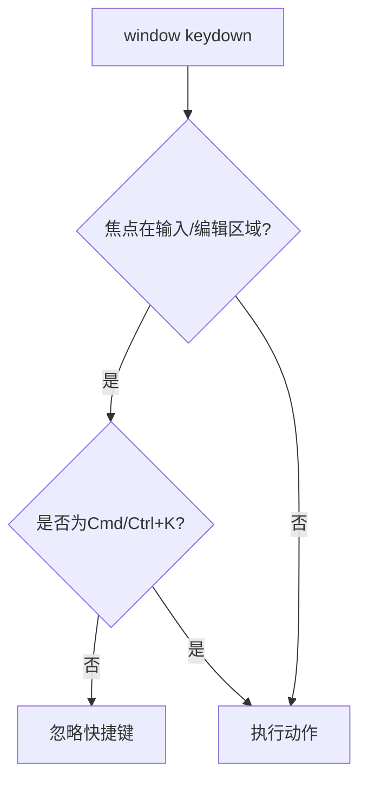
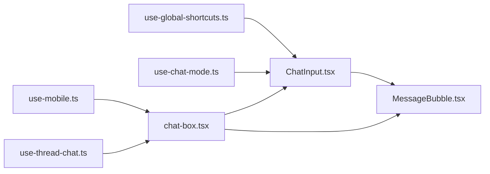

# 用户交互系统

<cite>
**本文引用的文件**
- [ChatInput.tsx](file://practice/src/components/ChatInput.tsx)
- [MessageBubble.tsx](file://practice/src/components/MessageBubble.tsx)
- [chat-box.tsx](file://frontend/src/components/workspace/chats/chat-box.tsx)
- [use-global-shortcuts.ts](file://frontend/src/hooks/use-global-shortcuts.ts)
- [use-mobile.ts](file://frontend/src/hooks/use-mobile.ts)
- [use-chat-mode.ts](file://frontend/src/components/workspace/Chats/use-chat-mode.ts)
- [use-thread-chat.ts](file://frontend/src/components/workspace/Chats/use-thread-chat.ts)
- [index.ts](file://frontend/src/components/workspace/Chats/index.ts)
</cite>

## 目录
1. [简介](#简介)
2. [项目结构](#项目结构)
3. [核心组件](#核心组件)
4. [架构总览](#架构总览)
5. [详细组件分析](#详细组件分析)
6. [依赖关系分析](#依赖关系分析)
7. [性能考量](#性能考量)
8. [故障排查指南](#故障排查指南)
9. [结论](#结论)
10. [附录](#附录)

## 简介
本文件面向 DeerFlow 的用户交互系统，聚焦聊天界面的交互设计与实现细节，覆盖输入框功能、快捷键支持、按钮操作、键盘导航、触摸手势、无障碍访问、用户反馈机制、确认对话与错误提示等主题，并提供交互设计最佳实践与用户体验优化建议。文档以前端与练习场景（practice）中的聊天组件为核心，结合工作区聊天容器与全局快捷键钩子，形成完整的交互体系说明。

## 项目结构
前端聊天交互主要分布在以下模块：
- 练习场景聊天组件：输入框与消息气泡
- 工作区聊天容器：聊天与产物面板的布局与联动
- 全局快捷键钩子：跨页面的键盘快捷键注册与抑制策略
- 移动端检测：响应式交互适配
- 聊天模式与线程管理：基于 URL 参数的模式初始化与线程标识管理

图表来源
- [ChatInput.tsx:1-415](file://practice/src/components/ChatInput.tsx#L1-L415)
- [MessageBubble.tsx:1-327](file://practice/src/components/MessageBubble.tsx#L1-L327)
- [chat-box.tsx:1-181](file://frontend/src/components/workspace/chats/chat-box.tsx#L1-L181)
- [use-chat-mode.ts:1-42](file://frontend/src/components/workspace/Chats/use-chat-mode.ts#L1-L42)
- [use-thread-chat.ts:1-41](file://frontend/src/components/workspace/Chats/use-thread-chat.ts#L1-L41)
- [use-global-shortcuts.ts:1-54](file://frontend/src/hooks/use-global-shortcuts.ts#L1-L54)
- [use-mobile.ts:1-22](file://frontend/src/hooks/use-mobile.ts#L1-L22)

章节来源
- [ChatInput.tsx:1-415](file://practice/src/components/ChatInput.tsx#L1-L415)
- [MessageBubble.tsx:1-327](file://practice/src/components/MessageBubble.tsx#L1-L327)
- [chat-box.tsx:1-181](file://frontend/src/components/workspace/chats/chat-box.tsx#L1-L181)
- [use-global-shortcuts.ts:1-54](file://frontend/src/hooks/use-global-shortcuts.ts#L1-L54)
- [use-mobile.ts:1-22](file://frontend/src/hooks/use-mobile.ts#L1-L22)
- [use-chat-mode.ts:1-42](file://frontend/src/components/workspace/Chats/use-chat-mode.ts#L1-L42)
- [use-thread-chat.ts:1-41](file://frontend/src/components/workspace/Chats/use-thread-chat.ts#L1-L41)
- [index.ts:1-4](file://frontend/src/components/workspace/Chats/index.ts#L1-L4)

## 核心组件
- 输入框组件（练习场景）：支持文本输入、多行自适应高度、Enter 发送、语音模式（点击说话）、录音波形动画、录音时长显示、重录与发送、麦克风权限请求、媒体录制、上传 OSS、调用 ASR 转写、错误提示与状态清理。
- 消息气泡组件（练习场景）：区分用户与 AI 角色、支持“正在输入”占位、语音时长标签与播放进度条、用户侧评价展开/收起、重录按钮、改进建议与润色表达展示、维度评分可视化。
- 工作区聊天容器：聊天面板与产物面板的可调整布局、自动选择首个产物、空态提示、拖拽分隔条控制可见性。
- 全局快捷键钩子：在窗口级别注册快捷键，输入框/编辑区域焦点时默认抑制，保留 Cmd/Ctrl+K 始终触发；支持元键、Shift 组合。
- 移动端检测：基于媒体查询的断点判断，用于交互元素的响应式呈现。
- 聊天模式与线程管理：根据 URL 参数决定初始提示词与模式，线程 ID 在新会话时生成并避免历史替换导致的无效 ID 传播。

章节来源
- [ChatInput.tsx:1-415](file://practice/src/components/ChatInput.tsx#L1-L415)
- [MessageBubble.tsx:1-327](file://practice/src/components/MessageBubble.tsx#L1-L327)
- [chat-box.tsx:1-181](file://frontend/src/components/workspace/chats/chat-box.tsx#L1-L181)
- [use-global-shortcuts.ts:1-54](file://frontend/src/hooks/use-global-shortcuts.ts#L1-L54)
- [use-mobile.ts:1-22](file://frontend/src/hooks/use-mobile.ts#L1-L22)
- [use-chat-mode.ts:1-42](file://frontend/src/components/workspace/Chats/use-chat-mode.ts#L1-L42)
- [use-thread-chat.ts:1-41](file://frontend/src/components/workspace/Chats/use-thread-chat.ts#L1-L41)

## 架构总览
聊天交互的控制流围绕“输入 -> 处理 -> 展示 -> 反馈”的闭环展开。输入框负责收集用户意图（文本/语音），通过事件回调与外部服务集成（ASR/OSS），消息气泡负责渲染与交互反馈（播放、评价、建议）。工作区容器承载两者并提供布局能力；全局快捷键与移动端检测贯穿于交互体验的统一入口与适配。

图表来源
- [ChatInput.tsx:30-272](file://practice/src/components/ChatInput.tsx#L30-L272)
- [MessageBubble.tsx:15-97](file://practice/src/components/MessageBubble.tsx#L15-L97)

## 详细组件分析

### 输入框组件（ChatInput）
- 功能要点
  - 文本输入：多行自适应高度、Enter 发送、禁用态保护、占位符提示。
  - 语音模式：点击“说话”进入录音状态，显示波形动画与录制时长，支持重录与发送。
  - 录音流程：请求麦克风权限、选择最佳音频格式、MediaRecorder 收集数据、停止时生成 Blob、清理资源。
  - 上传与转写：上传至 OSS 获取公网 URL，调用 ASR 异步接口提交任务并轮询结果，最终将转写文本作为消息发送。
  - 错误处理：麦克风访问失败、上传失败、ASR 超时/失败时的提示与降级行为。
- 交互细节
  - 录音面板固定定位，底部安全区适配，顶部包含灵感按钮与关闭按钮。
  - 发送按钮在录音时启用，重录按钮用于重新开始。
  - 文本模式下，发送按钮按内容是否为空与禁用态启用/禁用。
- 关键路径参考
  - 文本发送与键盘事件：[handleSend/handleKeyDown:23-35](file://practice/src/components/ChatInput.tsx#L23-L35)
  - 录音启动与格式选择：[startRecording/getAudioFormat:75-72](file://practice/src/components/ChatInput.tsx#L75-L72)
  - 上传与 ASR 流程：[uploadToOSS/callASR:158-240](file://practice/src/components/ChatInput.tsx#L158-L240)
  - 录音面板 UI 与按钮：[录音面板 JSX:305-364](file://practice/src/components/ChatInput.tsx#L305-L364)

图表来源
- [ChatInput.tsx:30-272](file://practice/src/components/ChatInput.tsx#L30-L272)

章节来源
- [ChatInput.tsx:1-415](file://practice/src/components/ChatInput.tsx#L1-L415)

### 消息气泡组件（MessageBubble）
- 功能要点
  - 角色区分：用户与 AI 不同头像与背景色。
  - 正在输入：AI 回复的“正在输入”占位动画。
  - 语音消息：显示时长标签，支持播放/暂停，带进度条。
  - 用户侧反馈：评价生成中状态、重录按钮、展开/收起“改进建议”，加载态与详细建议/润色表达。
  - 维度评分：按维度展示百分比条形图与分数。
- 交互细节
  - 展开时动态拉取详细建议与润色表达，避免重复请求。
  - 播放状态与进度通过定时器模拟，完成后自动清理。
- 关键路径参考
  - 播放逻辑与进度：[handlePlayVoice:29-59](file://practice/src/components/MessageBubble.tsx#L29-L59)
  - 评价展开与建议拉取：[useEffect 拉取建议:72-97](file://practice/src/components/MessageBubble.tsx#L72-L97)
  - UI 结构与按钮：[消息气泡 JSX:99-327](file://practice/src/components/MessageBubble.tsx#L99-L327)

图表来源
- [MessageBubble.tsx:6-13](file://practice/src/components/MessageBubble.tsx#L6-L13)

章节来源
- [MessageBubble.tsx:1-327](file://practice/src/components/MessageBubble.tsx#L1-L327)

### 工作区聊天容器（ChatBox）
- 功能要点
  - 双面板布局：聊天面板与产物面板，支持拖拽分隔条调整比例。
  - 自动选择：静态网站模式下首次进入自动选中第一个产物。
  - 空态提示：未选择产物时显示引导信息。
  - 可见性控制：根据产物面板开关状态切换布局与透明度。
- 关键路径参考
  - 布局配置与切换：[CLOSE_MODE/OPEN_MODE:23-24](file://frontend/src/components/workspace/chats/chat-box.tsx#L23-L24)
  - 产物列表与详情：[ArtifactFileList/ArtifactFileDetail:134-174](file://frontend/src/components/workspace/chats/chat-box.tsx#L134-L174)

图表来源
- [chat-box.tsx:82-101](file://frontend/src/components/workspace/chats/chat-box.tsx#L82-L101)

章节来源
- [chat-box.tsx:1-181](file://frontend/src/components/workspace/chats/chat-box.tsx#L1-L181)

### 全局快捷键钩子（useGlobalShortcuts）
- 功能要点
  - 在 window 上注册快捷键监听，支持元键（Cmd/Ctrl）与 Shift 组合。
  - 输入框/文本域/可编辑元素焦点时默认抑制快捷键，保留 Cmd/Ctrl+K 始终触发（命令面板常用行为）。
  - 防止默认行为与事件冒泡，确保快捷键优先级。
- 关键路径参考
  - 快捷键匹配与抑制逻辑：[handleKeyDown:20-48](file://frontend/src/hooks/use-global-shortcuts.ts#L20-L48)

图表来源
- [use-global-shortcuts.ts:20-48](file://frontend/src/hooks/use-global-shortcuts.ts#L20-L48)

章节来源
- [use-global-shortcuts.ts:1-54](file://frontend/src/hooks/use-global-shortcuts.ts#L1-L54)

### 移动端检测（useIsMobile）
- 功能要点
  - 基于媒体查询断点（768px）判断是否移动端，实时响应窗口尺寸变化。
  - 返回布尔值，供 UI 与交互策略选择。
- 关键路径参考
  - 断点与监听：[useIsMobile:5-21](file://frontend/src/hooks/use-mobile.ts#L5-L21)

章节来源
- [use-mobile.ts:1-22](file://frontend/src/hooks/use-mobile.ts#L1-L22)

### 聊天模式与线程管理
- useSpecificChatMode：当线程为“新建”且 URL 模式为 skill 时，自动填充初始提示词并聚焦输入框末尾。
- useThreadChat：根据路径参数生成或更新线程 ID，避免“/new”到具体 ID 的替换导致的无效 ID 传播。
- 关键路径参考
  - 模式初始化与聚焦：[useSpecificChatMode:10-41](file://frontend/src/components/workspace/Chats/use-chat-mode.ts#L10-L41)
  - 线程 ID 管理与守卫：[useThreadChat:8-40](file://frontend/src/components/workspace/Chats/use-thread-chat.ts#L8-L40)

章节来源
- [use-chat-mode.ts:1-42](file://frontend/src/components/workspace/Chats/use-chat-mode.ts#L1-L42)
- [use-thread-chat.ts:1-41](file://frontend/src/components/workspace/Chats/use-thread-chat.ts#L1-L41)
- [index.ts:1-4](file://frontend/src/components/workspace/Chats/index.ts#L1-L4)

## 依赖关系分析
- 组件耦合
  - ChatInput 与 MessageBubble 通过消息对象与回调函数解耦，输入框负责产生消息，气泡负责渲染与交互。
  - ChatBox 作为容器，聚合聊天与产物面板，依赖线程上下文与产物状态。
  - useGlobalShortcuts 与 useIsMobile 作为通用工具，被上层组件按需引入。
- 外部依赖
  - 录音与上传：浏览器 MediaRecorder API、OSS 上传接口、ASR 异步接口。
  - 路由与参数：Next.js 的 useParams/useSearchParams/usePathname。
- 循环依赖
  - 未发现直接循环依赖；各模块职责清晰，通过 props 与上下文传递数据。

图表来源
- [use-global-shortcuts.ts:1-54](file://frontend/src/hooks/use-global-shortcuts.ts#L1-L54)
- [use-mobile.ts:1-22](file://frontend/src/hooks/use-mobile.ts#L1-L22)
- [use-chat-mode.ts:1-42](file://frontend/src/components/workspace/Chats/use-chat-mode.ts#L1-L42)
- [use-thread-chat.ts:1-41](file://frontend/src/components/workspace/Chats/use-thread-chat.ts#L1-L41)
- [ChatInput.tsx:1-415](file://practice/src/components/ChatInput.tsx#L1-L415)
- [MessageBubble.tsx:1-327](file://practice/src/components/MessageBubble.tsx#L1-L327)
- [chat-box.tsx:1-181](file://frontend/src/components/workspace/chats/chat-box.tsx#L1-L181)

## 性能考量
- 录音与播放
  - 使用 60fps 动画与定时器模拟播放进度，注意在组件卸载时清理定时器，避免内存泄漏。
  - 录音计时与波形动画采用独立定时器，确保生命周期一致。
- 状态更新
  - 输入框与消息气泡的状态更新频率较高，建议在高频动画场景中使用 requestAnimationFrame 或节流策略。
- 网络请求
  - ASR 轮询存在固定间隔，建议根据业务阈值调整轮询次数与间隔，避免长时间占用网络。
- 布局与渲染
  - 双面板布局在移动端可能影响渲染性能，建议在小屏设备上减少复杂动画与重绘。

## 故障排查指南
- 录音不可用
  - 检查浏览器麦克风权限是否被拒绝，查看控制台错误日志与弹窗提示。
  - 确认音频格式支持情况与 MediaRecorder 初始化是否成功。
- 上传失败
  - 核对 OSS 上传接口返回值与鉴权配置，关注网络异常与超时。
- ASR 转写异常
  - 确认任务 ID 与轮询地址正确，检查任务状态与错误信息，必要时增加重试与超时处理。
- 快捷键不生效
  - 确认当前焦点元素是否为输入/编辑区域，Cmd/Ctrl+K 在输入中默认被抑制属预期行为。
- 移动端显示异常
  - 检查断点与样式适配，确认底部安全区与布局比例设置。

章节来源
- [ChatInput.tsx:125-128](file://practice/src/components/ChatInput.tsx#L125-L128)
- [ChatInput.tsx:178-184](file://practice/src/components/ChatInput.tsx#L178-L184)
- [ChatInput.tsx:234-240](file://practice/src/components/ChatInput.tsx#L234-L240)
- [use-global-shortcuts.ts:30-41](file://frontend/src/hooks/use-global-shortcuts.ts#L30-L41)

## 结论
DeerFlow 的用户交互系统以“输入—处理—展示—反馈”为主线，结合练习场景的语音转写能力与工作区的布局容器，形成了较为完整的聊天交互闭环。通过全局快捷键与移动端检测等通用能力，系统在可用性与一致性方面具备良好基础。后续可在性能优化、错误恢复与可访问性增强方面持续改进。

## 附录
- 无障碍访问建议
  - 为按钮与可交互元素提供语义化标签与键盘可达性，确保屏幕阅读器可识别。
  - 录音与播放控件应提供明确的 ARIA 状态（如 aria-live、aria-label）。
  - 高对比度与缩放适配，保证不同视觉能力用户的可读性。
- 用户反馈与确认
  - 对关键操作（删除、发送失败）提供确认对话框或撤销机制。
  - 加载与错误状态应有明确文案与重试入口。
- 交互最佳实践
  - 保持一致的视觉层级与交互反馈节奏，避免频繁闪烁动画。
  - 在移动端优先考虑触控目标尺寸与点击区域，减少误触。
  - 提供多种输入方式（文本/语音）并允许无缝切换。