# 聊天状态管理

<cite>
**本文档引用的文件**
- [frontend/src/components/workspace/chats/chat-box.tsx](file://frontend/src/components/workspace/chats/chat-box.tsx)
- [frontend/src/components/workspace/chats/use-thread-chat.ts](file://frontend/src/components/workspace/chats/use-thread-chat.ts)
- [frontend/src/app/api/memory/[...path]/route.ts](file://frontend/src/app/api/memory/[...path]/route.ts)
- [frontend/src/app/mock/api/threads/search/route.ts](file://frontend/src/app/mock/api/threads/search/route.ts)
- [frontend/src/app/mock/api/threads/[thread_id]/history/route.ts](file://frontend/src/app/mock/api/threads/[thread_id]/history/route.ts)
- [backend/app/gateway/routers/threads.py](file://backend/app/gateway/routers/threads.py)
- [backend/app/channels/message_bus.py](file://backend/app/channels/message_bus.py)
- [backend/app/channels/store.py](file://backend/app/channels/store.py)
- [backend/app/channels/manager.py](file://backend/app/channels/manager.py)
- [backend/packages/harness/deerflow/runtime/stream_bridge/base.py](file://backend/packages/harness/deerflow/runtime/stream_bridge/base.py)
- [backend/packages/harness/deerflow/runtime/stream_bridge/__init__.py](file://backend/packages/harness/deerflow/runtime/stream_bridge/__init__.py)
- [backend/docs/middleware-execution-flow.md](file://backend/docs/middleware-execution-flow.md)
</cite>

## 目录
1. [简介](#简介)
2. [项目结构](#项目结构)
3. [核心组件](#核心组件)
4. [架构总览](#架构总览)
5. [详细组件分析](#详细组件分析)
6. [依赖分析](#依赖分析)
7. [性能考虑](#性能考虑)
8. [故障排除指南](#故障排除指南)
9. [结论](#结论)
10. [附录](#附录)

## 简介
本文件面向 DeerFlow 的聊天状态管理系统，系统性阐述聊天线程的状态管理机制，涵盖消息队列、实时更新与历史记录维护；解释状态同步策略、缓存机制与性能优化；说明聊天框组件的状态绑定、用户输入处理与消息发送流程；并提供状态管理最佳实践（含错误处理、重连机制与离线支持）。

## 项目结构
本项目采用前后端分离架构：
- 前端负责聊天界面、状态绑定、实时流式渲染与历史查询；
- 后端负责线程生命周期管理、消息总线、通道适配器、状态检查点与历史回放；
- 中间层通过内存流桥接器实现生产者与消费者解耦，支撑 SSE 实时推送。

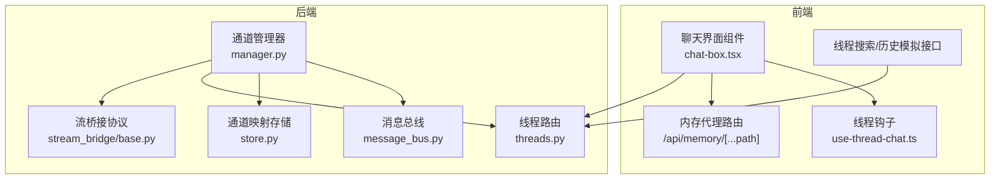

**图表来源**
- [frontend/src/components/workspace/chats/chat-box.tsx:1-181](file://frontend/src/components/workspace/chats/chat-box.tsx#L1-L181)
- [frontend/src/components/workspace/chats/use-thread-chat.ts:1-41](file://frontend/src/components/workspace/chats/use-thread-chat.ts#L1-L41)
- [frontend/src/app/api/memory/[...path]/route.ts](file://frontend/src/app/api/memory/[...path]/route.ts#L1-L55)
- [frontend/src/app/mock/api/threads/search/route.ts:1-45](file://frontend/src/app/mock/api/threads/search/route.ts#L1-L45)
- [frontend/src/app/mock/api/threads/[thread_id]/history/route.ts](file://frontend/src/app/mock/api/threads/[thread_id]/history/route.ts#L1-L20)
- [backend/app/gateway/routers/threads.py:1-623](file://backend/app/gateway/routers/threads.py#L1-L623)
- [backend/app/channels/message_bus.py:1-174](file://backend/app/channels/message_bus.py#L1-L174)
- [backend/app/channels/store.py:1-154](file://backend/app/channels/store.py#L1-L154)
- [backend/app/channels/manager.py:1-800](file://backend/app/channels/manager.py#L1-L800)
- [backend/packages/harness/deerflow/runtime/stream_bridge/base.py:1-46](file://backend/packages/harness/deerflow/runtime/stream_bridge/base.py#L1-L46)

**章节来源**
- [frontend/src/components/workspace/chats/chat-box.tsx:1-181](file://frontend/src/components/workspace/chats/chat-box.tsx#L1-L181)
- [frontend/src/components/workspace/chats/use-thread-chat.ts:1-41](file://frontend/src/components/workspace/chats/use-thread-chat.ts#L1-L41)
- [frontend/src/app/api/memory/[...path]/route.ts](file://frontend/src/app/api/memory/[...path]/route.ts#L1-L55)
- [frontend/src/app/mock/api/threads/search/route.ts:1-45](file://frontend/src/app/mock/api/threads/search/route.ts#L1-L45)
- [frontend/src/app/mock/api/threads/[thread_id]/history/route.ts](file://frontend/src/app/mock/api/threads/[thread_id]/history/route.ts#L1-L20)
- [backend/app/gateway/routers/threads.py:1-623](file://backend/app/gateway/routers/threads.py#L1-L623)
- [backend/app/channels/message_bus.py:1-174](file://backend/app/channels/message_bus.py#L1-L174)
- [backend/app/channels/store.py:1-154](file://backend/app/channels/store.py#L1-L154)
- [backend/app/channels/manager.py:1-800](file://backend/app/channels/manager.py#L1-L800)
- [backend/packages/harness/deerflow/runtime/stream_bridge/base.py:1-46](file://backend/packages/harness/deerflow/runtime/stream_bridge/base.py#L1-L46)

## 核心组件
- 前端聊天框组件：负责布局、附件面板切换、与线程上下文交互。
- 线程钩子：负责线程 ID 生成、新旧线程判定与 mock 参数解析。
- 内存代理路由：将前端请求转发至后端内存服务，统一处理跨域与头部清理。
- 线程路由（后端）：提供线程创建、状态查询、历史回放与元数据更新。
- 消息总线：异步发布/订阅，解耦通道与调度器。
- 通道映射存储：持久化 IM 会话到线程 ID 的映射。
- 通道管理器：消费入站消息、创建/复用线程、执行运行、处理文件上传与流式输出。
- 流桥接协议：抽象生产者与 SSE 消费者之间的事件桥接。

**章节来源**
- [frontend/src/components/workspace/chats/chat-box.tsx:26-181](file://frontend/src/components/workspace/chats/chat-box.tsx#L26-L181)
- [frontend/src/components/workspace/chats/use-thread-chat.ts:8-41](file://frontend/src/components/workspace/chats/use-thread-chat.ts#L8-L41)
- [frontend/src/app/api/memory/[...path]/route.ts](file://frontend/src/app/api/memory/[...path]/route.ts#L1-L55)
- [backend/app/gateway/routers/threads.py:224-623](file://backend/app/gateway/routers/threads.py#L224-L623)
- [backend/app/channels/message_bus.py:117-174](file://backend/app/channels/message_bus.py#L117-L174)
- [backend/app/channels/store.py:16-154](file://backend/app/channels/store.py#L16-L154)
- [backend/app/channels/manager.py:548-800](file://backend/app/channels/manager.py#L548-L800)
- [backend/packages/harness/deerflow/runtime/stream_bridge/base.py:37-46](file://backend/packages/harness/deerflow/runtime/stream_bridge/base.py#L37-L46)

## 架构总览
下图展示从 IM 通道到前端聊天界面的完整链路：消息经通道管理器进入消息总线，后端线程路由提供状态与历史，前端通过内存代理路由访问后端内存服务，并通过流桥接器实现 SSE 实时推送。

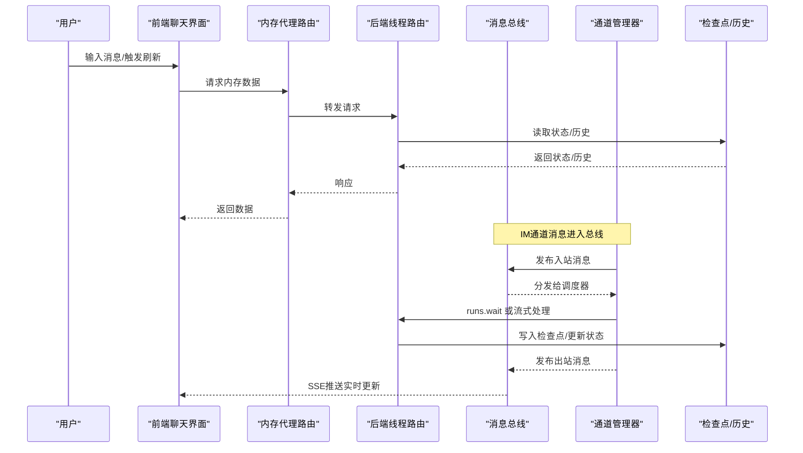

**图表来源**
- [backend/app/channels/manager.py:683-800](file://backend/app/channels/manager.py#L683-L800)
- [backend/app/channels/message_bus.py:117-174](file://backend/app/channels/message_bus.py#L117-L174)
- [backend/app/gateway/routers/threads.py:408-623](file://backend/app/gateway/routers/threads.py#L408-L623)
- [frontend/src/app/api/memory/[...path]/route.ts](file://frontend/src/app/api/memory/[...path]/route.ts#L1-L55)

## 详细组件分析

### 前端聊天框组件（ChatBox）
- 功能要点
  - 基于可调整面板组实现聊天区与附件面板的动态布局。
  - 与线程上下文联动，自动选择首个附件（在静态网站模式下）。
  - 根据环境变量控制附件面板可见性与动画过渡。
- 关键行为
  - 切换线程时重置附件选择状态。
  - 根据线程值中的附件列表更新附件面板内容。
  - 基于路径名生成稳定面板 ID，确保布局状态持久化。

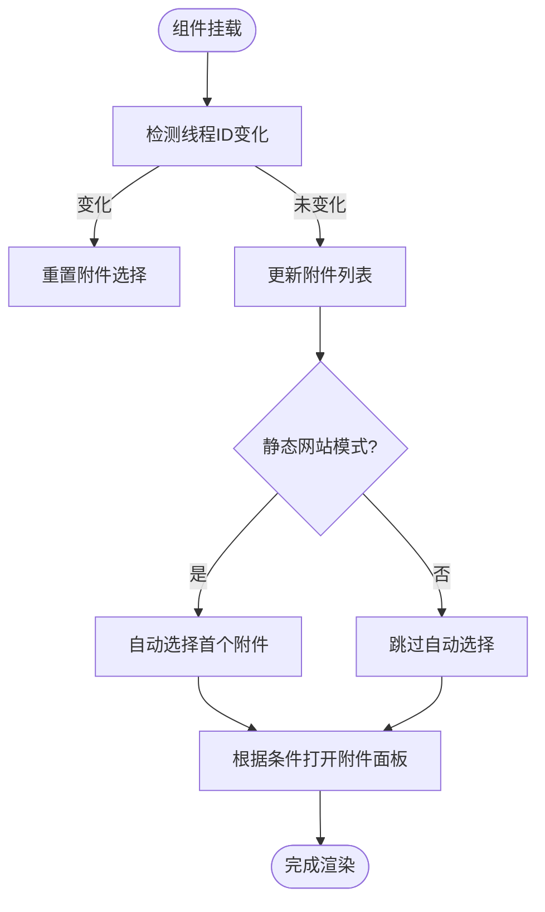

**图表来源**
- [frontend/src/components/workspace/chats/chat-box.tsx:45-101](file://frontend/src/components/workspace/chats/chat-box.tsx#L45-L101)

**章节来源**
- [frontend/src/components/workspace/chats/chat-box.tsx:26-181](file://frontend/src/components/workspace/chats/chat-box.tsx#L26-L181)

### 线程钩子（useThreadChat）
- 功能要点
  - 从路由参数解析 thread_id，支持“新建”场景自动生成 UUID。
  - 通过路径变更与历史替换逻辑避免无效 thread_id 导致下游错误。
  - 提供 isNewThread 标志与 isMock 参数，便于 UI 与业务分支控制。
- 关键行为
  - 在路径以“/new”结尾时强制新建线程并生成新 ID。
  - 防止“/chats/new”到“/chats/{UUID}”的 URL 替换导致的陈旧参数问题。

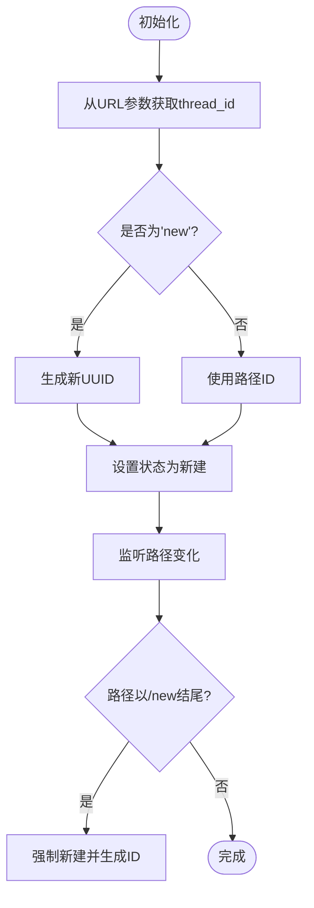

**图表来源**
- [frontend/src/components/workspace/chats/use-thread-chat.ts:13-37](file://frontend/src/components/workspace/chats/use-thread-chat.ts#L13-L37)

**章节来源**
- [frontend/src/components/workspace/chats/use-thread-chat.ts:8-41](file://frontend/src/components/workspace/chats/use-thread-chat.ts#L8-L41)

### 内存代理路由（/api/memory）
- 功能要点
  - 统一代理前端对后端内存服务的请求，删除敏感头部，避免跨域与鉴权污染。
  - 支持 GET/POST/DELETE/PATCH 方法透传，按需携带请求体。
- 关键行为
  - 构造后端基础 URL，拼接路径，发起 fetch 并返回响应。

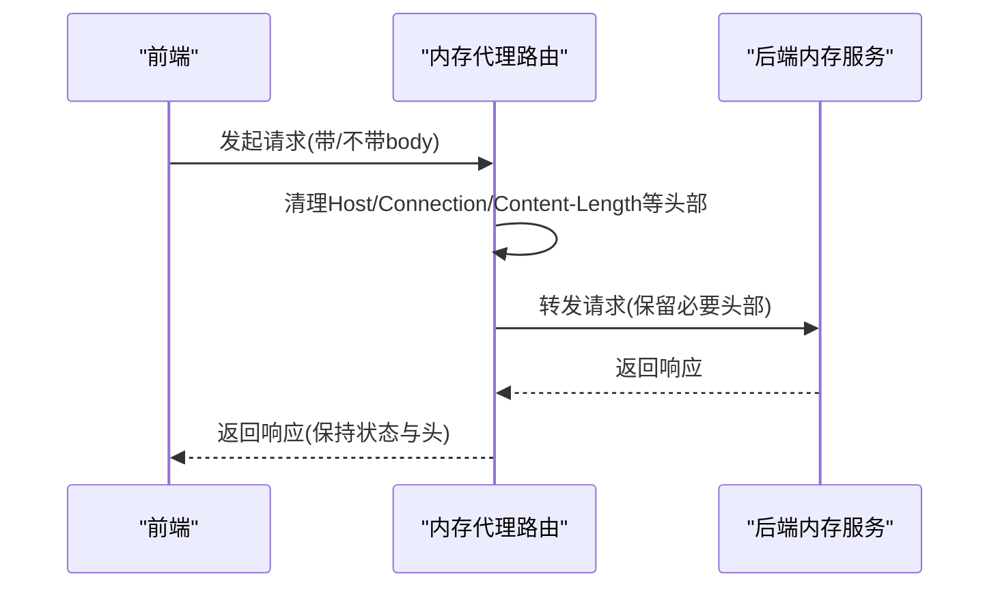

**图表来源**
- [frontend/src/app/api/memory/[...path]/route.ts](file://frontend/src/app/api/memory/[...path]/route.ts#L6-L27)

**章节来源**
- [frontend/src/app/api/memory/[...path]/route.ts](file://frontend/src/app/api/memory/[...path]/route.ts#L1-L55)

### 线程路由（后端 threads.py）
- 功能要点
  - 提供线程创建、状态查询、历史回放、元数据更新与删除。
  - 状态派生：基于检查点元数据推导线程状态（空闲/中断/错误）。
  - 历史回放：仅在最新检查点包含消息，避免重复序列化。
- 关键模型
  - ThreadResponse：线程基本信息与当前 channel values。
  - ThreadStateResponse：状态快照、任务与检查点信息。
  - HistoryEntry：历史条目，包含 values 与 next 任务。

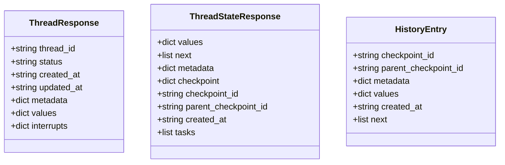

**图表来源**
- [backend/app/gateway/routers/threads.py:63-141](file://backend/app/gateway/routers/threads.py#L63-L141)

**章节来源**
- [backend/app/gateway/routers/threads.py:224-623](file://backend/app/gateway/routers/threads.py#L224-L623)

### 消息总线（message_bus.py）
- 功能要点
  - 异步队列承载入站消息，支持出站回调分发。
  - 定义入站/出站消息数据结构，包含通道名、聊天 ID、线程 ID、附件与时间戳。
- 关键行为
  - publish_inbound/get_inbound：入站消息入队与阻塞获取。
  - publish_outbound：广播出站消息给所有监听器。

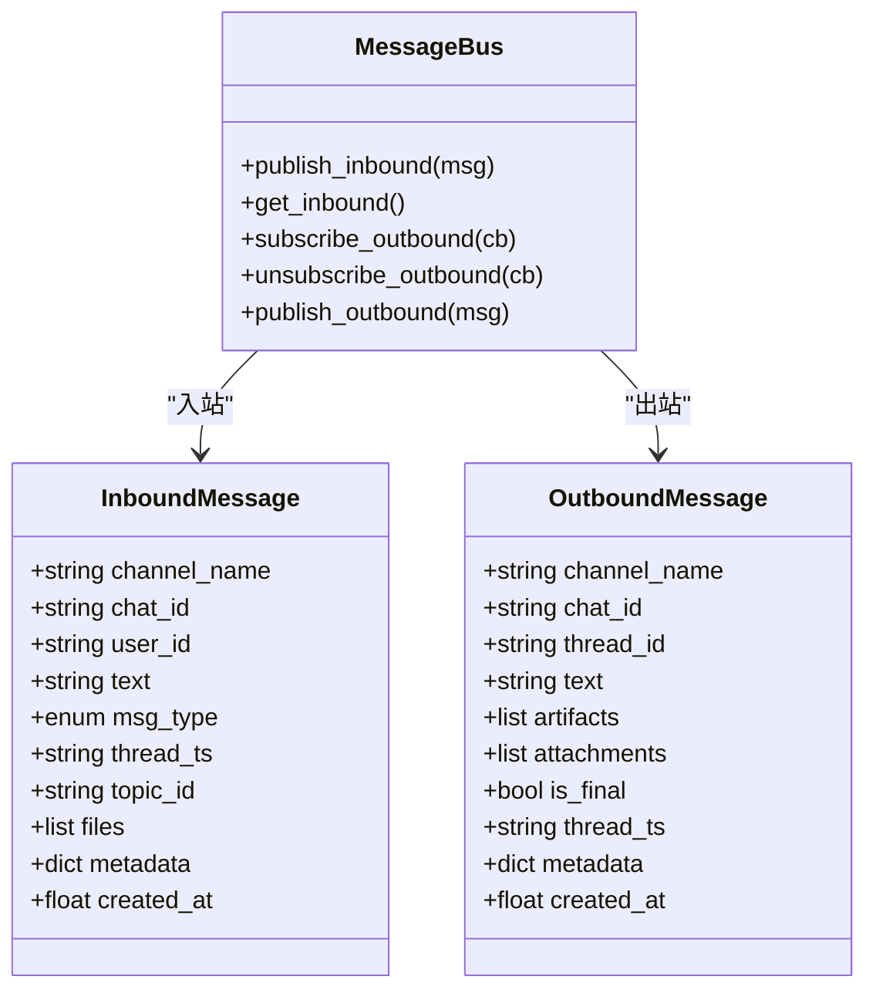

**图表来源**
- [backend/app/channels/message_bus.py:29-174](file://backend/app/channels/message_bus.py#L29-L174)

**章节来源**
- [backend/app/channels/message_bus.py:1-174](file://backend/app/channels/message_bus.py#L1-L174)

### 通道映射存储（store.py）
- 功能要点
  - JSON 文件持久化 IM 会话到线程 ID 的映射，支持按话题维度区分。
  - 原子写入策略，保证并发安全。
- 关键行为
  - get_thread_id/set_thread_id/remove/list_entries：映射的增删查改。

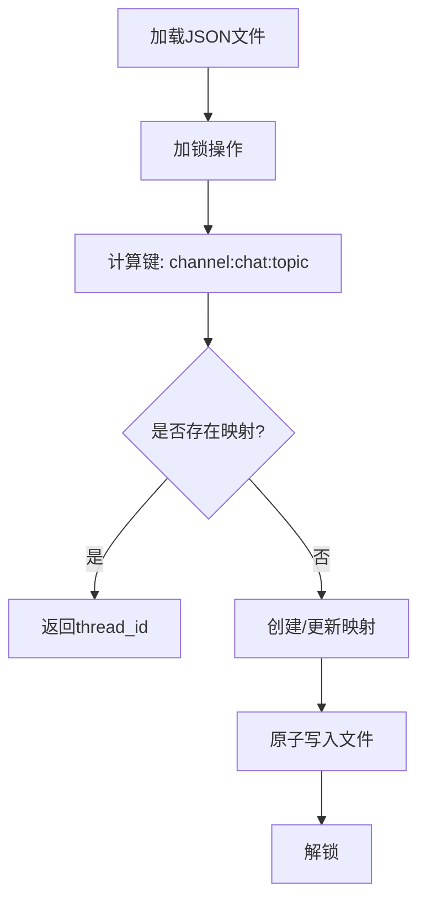

**图表来源**
- [backend/app/channels/store.py:82-137](file://backend/app/channels/store.py#L82-L137)

**章节来源**
- [backend/app/channels/store.py:1-154](file://backend/app/channels/store.py#L1-L154)

### 通道管理器（manager.py）
- 功能要点
  - 消费入站消息，创建或复用线程，注入文件附件，执行 runs.wait 或流式处理。
  - 解析会话配置（助手 ID、运行配置、上下文），支持自定义代理名称规范化。
  - 处理文件下载与安全路径解析，生成附件列表与文本提示。
  - 抽象流式文本累积与消息 ID 提取，用于实时更新。
- 关键行为
  - _handle_chat/_handle_streaming_chat：分流同步与流式处理。
  - _ingest_inbound_files/_resolve_attachments：文件入站与附件解析。
  - _extract_text_content/_merge_stream_text：流式文本合并与去噪。

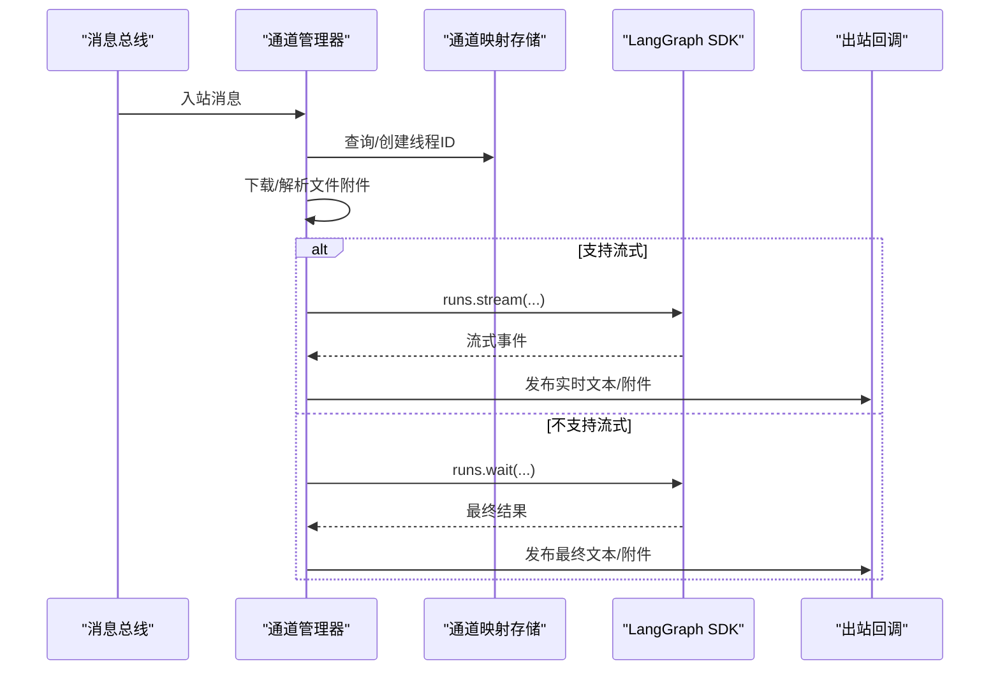

**图表来源**
- [backend/app/channels/manager.py:751-800](file://backend/app/channels/manager.py#L751-L800)
- [backend/app/channels/store.py:82-107](file://backend/app/channels/store.py#L82-L107)
- [backend/app/channels/message_bus.py:160-174](file://backend/app/channels/message_bus.py#L160-L174)

**章节来源**
- [backend/app/channels/manager.py:548-800](file://backend/app/channels/manager.py#L548-L800)

### 流桥接协议（stream_bridge）
- 功能要点
  - 抽象生产者（Agent Worker）与消费者（SSE Endpoint）之间的事件桥接。
  - 提供内存实现（基于 asyncio.Queue）与通用事件类型（心跳、结束）。
- 关键行为
  - publish/publish_end：事件入队与结束信号。
  - StreamEvent：事件 ID、事件名与数据载体。

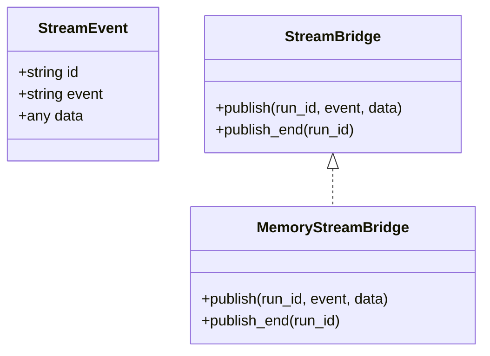

**图表来源**
- [backend/packages/harness/deerflow/runtime/stream_bridge/base.py:16-46](file://backend/packages/harness/deerflow/runtime/stream_bridge/base.py#L16-L46)
- [backend/packages/harness/deerflow/runtime/stream_bridge/__init__.py:10-21](file://backend/packages/harness/deerflow/runtime/stream_bridge/__init__.py#L10-L21)

**章节来源**
- [backend/packages/harness/deerflow/runtime/stream_bridge/base.py:1-46](file://backend/packages/harness/deerflow/runtime/stream_bridge/base.py#L1-L46)
- [backend/packages/harness/deerflow/runtime/stream_bridge/__init__.py:1-21](file://backend/packages/harness/deerflow/runtime/stream_bridge/__init__.py#L1-L21)

### 中间件执行流程（概念图）
该图为后端中间件在一次请求中的典型执行顺序，体现线程数据、上传、沙箱、图像注入、模型推理、澄清、限次、标题生成、摘要、工具调用收尾与记忆入队的整体流程。

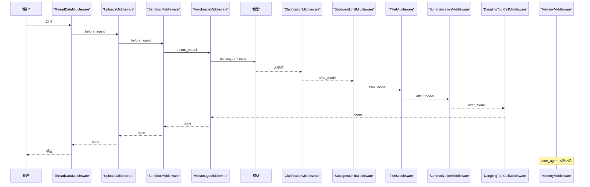

**图表来源**
- [backend/docs/middleware-execution-flow.md:79-154](file://backend/docs/middleware-execution-flow.md#L79-L154)

## 依赖分析
- 前端
  - 聊天框组件依赖线程上下文与附件能力；线程钩子依赖路由参数与路径状态。
  - 内存代理路由依赖后端基础地址配置，统一处理跨域与头部。
- 后端
  - 通道管理器依赖消息总线、通道映射存储与线程路由；通过 LangGraph SDK 与运行器交互。
  - 流桥接协议为 SSE 推送提供抽象与默认实现。
- 数据流
  - 线程状态与历史由检查点驱动，序列化后通过前端路由返回；附件解析与安全路径校验在后端完成。

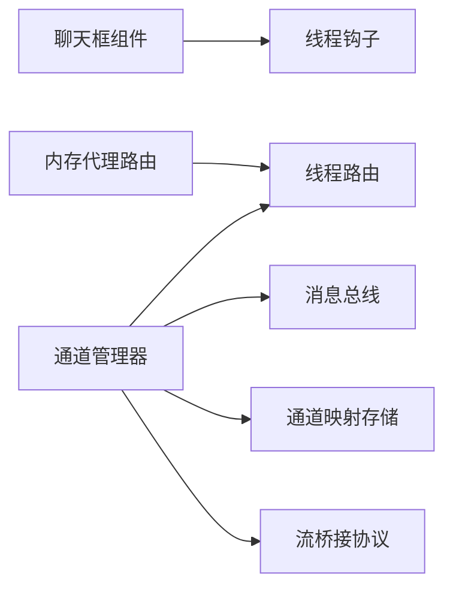

**图表来源**
- [frontend/src/components/workspace/chats/chat-box.tsx:1-181](file://frontend/src/components/workspace/chats/chat-box.tsx#L1-L181)
- [frontend/src/components/workspace/chats/use-thread-chat.ts:1-41](file://frontend/src/components/workspace/chats/use-thread-chat.ts#L1-L41)
- [frontend/src/app/api/memory/[...path]/route.ts](file://frontend/src/app/api/memory/[...path]/route.ts#L1-L55)
- [backend/app/channels/manager.py:548-800](file://backend/app/channels/manager.py#L548-L800)
- [backend/app/channels/message_bus.py:117-174](file://backend/app/channels/message_bus.py#L117-L174)
- [backend/app/channels/store.py:16-154](file://backend/app/channels/store.py#L16-L154)
- [backend/packages/harness/deerflow/runtime/stream_bridge/base.py:37-46](file://backend/packages/harness/deerflow/runtime/stream_bridge/base.py#L37-L46)

**章节来源**
- [frontend/src/components/workspace/chats/chat-box.tsx:1-181](file://frontend/src/components/workspace/chats/chat-box.tsx#L1-L181)
- [frontend/src/components/workspace/chats/use-thread-chat.ts:1-41](file://frontend/src/components/workspace/chats/use-thread-chat.ts#L1-L41)
- [frontend/src/app/api/memory/[...path]/route.ts](file://frontend/src/app/api/memory/[...path]/route.ts#L1-L55)
- [backend/app/channels/manager.py:1-800](file://backend/app/channels/manager.py#L1-L800)
- [backend/app/channels/message_bus.py:1-174](file://backend/app/channels/message_bus.py#L1-L174)
- [backend/app/channels/store.py:1-154](file://backend/app/channels/store.py#L1-L154)
- [backend/packages/harness/deerflow/runtime/stream_bridge/base.py:1-46](file://backend/packages/harness/deerflow/runtime/stream_bridge/base.py#L1-L46)

## 性能考虑
- 并发与节流
  - 通道管理器使用信号量限制最大并发，避免资源争用。
  - 流式更新最小间隔阈值，减少 UI 抖动与网络压力。
- 序列化与传输
  - 线程状态与历史通过序列化转换为 JSON 安全格式，避免大对象重复传输。
  - 仅在最新检查点包含消息，降低历史回放的数据冗余。
- 存储与缓存
  - 通道映射存储采用原子写入，保障一致性；高并发场景建议替换为数据库后端。
  - 前端通过内存代理路由统一头部处理，减少重复握手开销。
- 文件处理
  - 入站文件下载与安全路径解析，避免路径穿越与非法访问；图像与非图像分别处理以优化平台体验。

[本节为通用指导，无需特定文件来源]

## 故障排除指南
- 线程状态异常
  - 检查线程状态派生逻辑：错误 pending writes 与待处理任务会影响状态判断。
  - 若线程仅存在于检查点而不存在元数据记录，将进行向后兼容合成记录。
- 流式推送失败
  - 确认通道是否支持流式；若不支持，回退到 runs.wait 并发布最终响应。
  - 检查流桥接器事件队列与心跳/结束事件，确保客户端 Last-Event-ID 正确。
- 附件解析失败
  - 校验虚拟路径前缀与实际路径相对输出目录，防止路径逃逸与文件缺失。
  - 对无法解析的附件生成文本回退提示，确保可发现性。
- 文件下载异常
  - 检查通道文件读取器注册与网络超时；对 WeCom/WeChat 特殊加密/本地路径场景进行容错处理。
- 权限与鉴权
  - 内存代理路由删除敏感头部，避免鉴权污染；确认后端线程路由权限校验与 CSRF 令牌传递。

**章节来源**
- [backend/app/gateway/routers/threads.py:166-183](file://backend/app/gateway/routers/threads.py#L166-L183)
- [backend/app/channels/manager.py:785-800](file://backend/app/channels/manager.py#L785-L800)
- [backend/app/channels/manager.py:363-437](file://backend/app/channels/manager.py#L363-L437)
- [backend/app/channels/manager.py:440-518](file://backend/app/channels/manager.py#L440-L518)
- [frontend/src/app/api/memory/[...path]/route.ts](file://frontend/src/app/api/memory/[...path]/route.ts#L10-L27)

## 结论
DeerFlow 的聊天状态管理通过“前端组件 + 后端线程路由 + 消息总线 + 通道管理器 + 流桥接”的协同，实现了从消息入站、线程状态维护、历史回放到实时流式推送的完整闭环。系统在并发控制、序列化传输、安全附件处理与权限控制方面具备良好设计，适合进一步扩展到多通道、多租户与高并发场景。

[本节为总结性内容，无需特定文件来源]

## 附录
- 最佳实践
  - 状态同步：前端轮询与 SSE 双轨并行，SSE 为主、轮询兜底。
  - 缓存机制：利用检查点元数据缓存线程状态，历史回放时仅增量更新。
  - 错误处理：对流式事件进行去噪与聚合，统一错误事件格式。
  - 重连机制：客户端基于 Last-Event-ID 与心跳事件实现断线重连。
  - 离线支持：本地持久化最近 N 条消息与附件元数据，恢复后补齐状态。
- 参考接口
  - 线程创建/查询/历史/状态更新：threads.py
  - 内存代理路由：/api/memory/[...path]
  - 模拟线程搜索/历史：/mock/api/threads

[本节为概览性内容，无需特定文件来源]