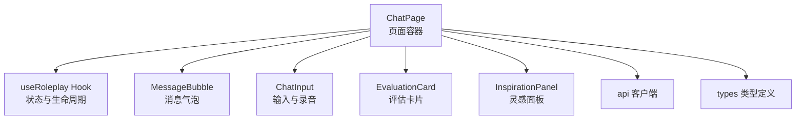
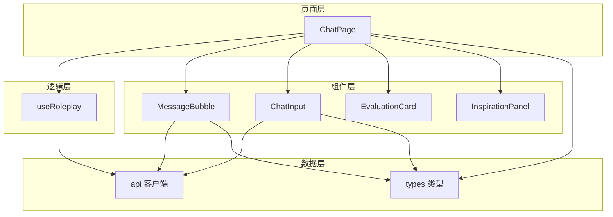
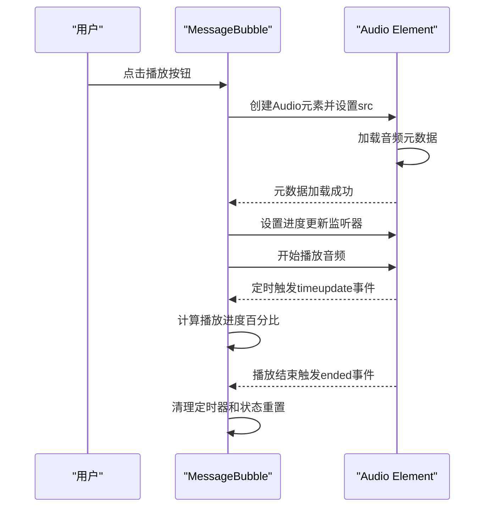
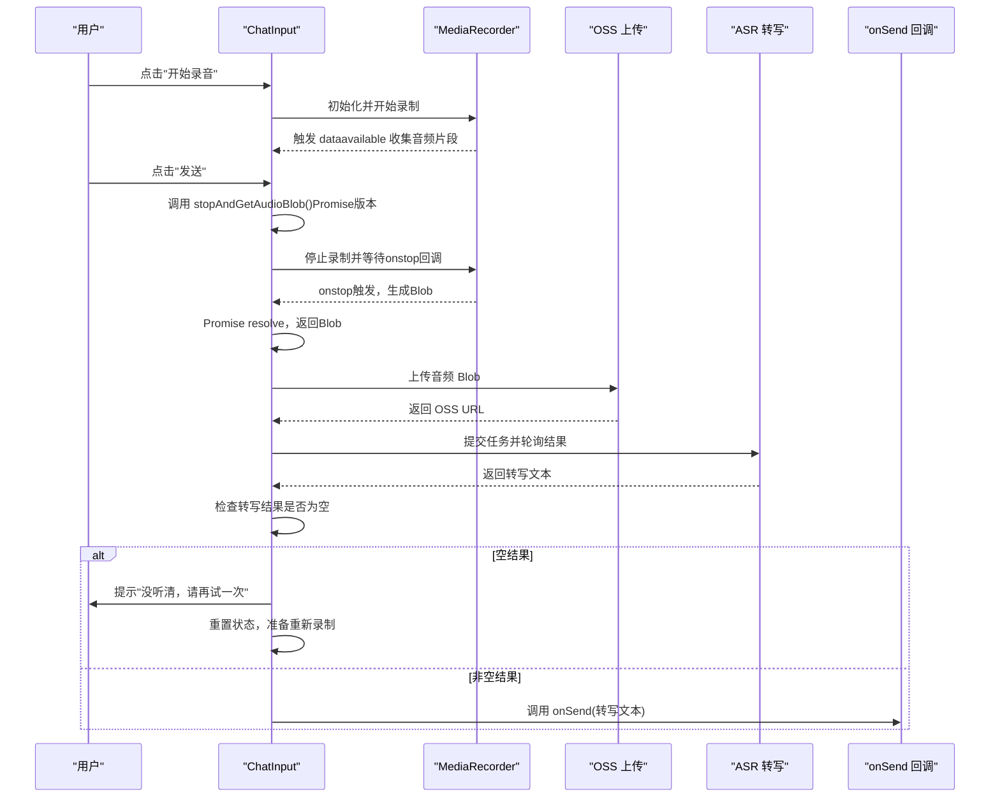
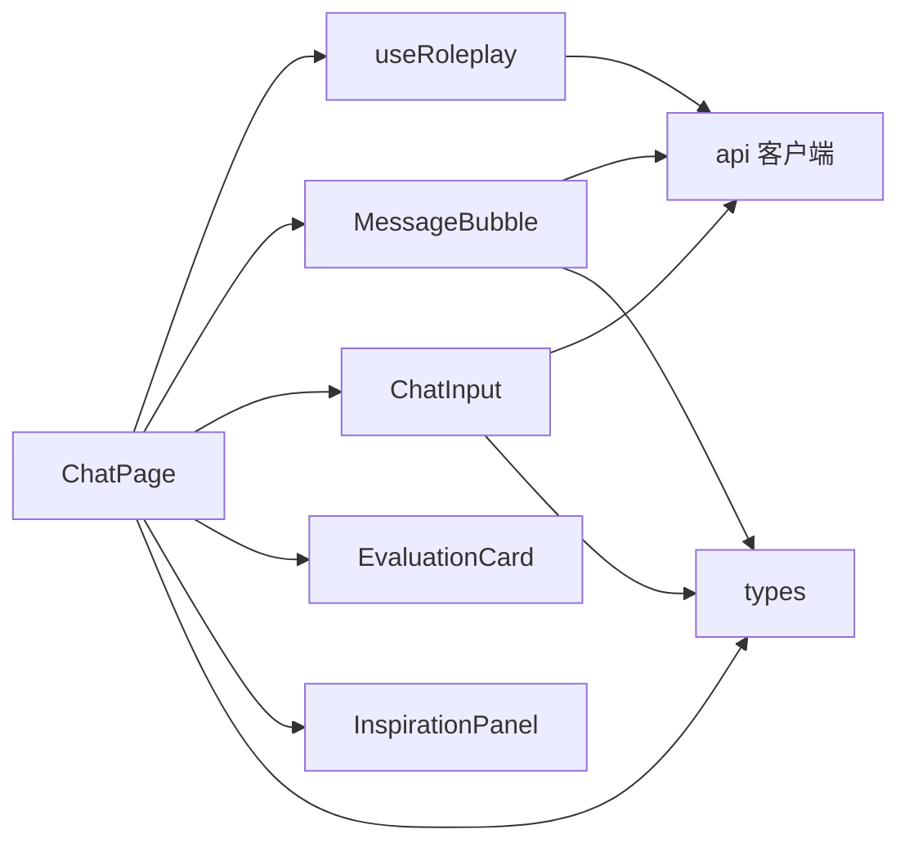

# 聊天界面系统

<cite>
**本文引用的文件**
- [MessageBubble.tsx](file://practice/src/components/MessageBubble.tsx)
- [ChatInput.tsx](file://practice/src/components/ChatInput.tsx)
- [ChatPage.tsx](file://practice/src/pages/ChatPage.tsx)
- [useRoleplay.ts](file://practice/src/hooks/useRoleplay.ts)
- [EvaluationCard.tsx](file://practice/src/components/EvaluationCard.tsx)
- [InspirationPanel.tsx](file://practice/src/components/InspirationPanel.tsx)
- [api.ts](file://practice/src/api/index.ts)
- [types.ts](file://practice/src/types/index.ts)
</cite>

## 目录
1. [简介](#简介)
2. [项目结构](#项目结构)
3. [核心组件](#核心组件)
4. [架构总览](#架构总览)
5. [详细组件分析](#详细组件分析)
6. [依赖关系分析](#依赖关系分析)
7. [性能考虑](#性能考虑)
8. [故障排除指南](#故障排除指南)
9. [结论](#结论)
10. [附录](#附录)

## 简介
本技术文档围绕 DeerFlow 的聊天界面系统，系统性阐述消息气泡渲染、实时消息处理与用户交互体验设计；说明消息状态管理、流式响应处理与错误恢复机制；解释聊天界面的响应式布局、键盘快捷键支持与无障碍访问能力；并提供消息组件的扩展指南，涵盖自定义消息类型、附件处理与多媒体内容展示。

**更新** 本次更新重点反映了前端音频播放的重大改进：从模拟播放改为Web Audio API原生播放，包括真实的音频进度跟踪和错误处理机制。

## 项目结构
聊天界面系统主要位于 practice 子项目中，采用按功能分层的组织方式：
- 页面层：ChatPage 负责整体布局、路由参数解析、轮次展示与对话控制
- 组件层：MessageBubble、ChatInput、EvaluationCard、InspirationPanel 等负责具体 UI 与交互
- 逻辑层：useRoleplay Hook 管理消息状态、轮次、实践模式与生命周期
- 数据层：api 客户端封装后端接口，types 定义消息与评估等数据结构

**图表来源**
- [ChatPage.tsx:12-327](file://practice/src/pages/ChatPage.tsx#L12-L327)
- [useRoleplay.ts](file://practice/src/hooks/useRoleplay.ts)
- [MessageBubble.tsx:15-327](file://practice/src/components/MessageBubble.tsx#L15-L327)
- [ChatInput.tsx:11-466](file://practice/src/components/ChatInput.tsx#L11-L466)
- [EvaluationCard.tsx](file://practice/src/components/EvaluationCard.tsx)
- [InspirationPanel.tsx](file://practice/src/components/InspirationPanel.tsx)
- [api.ts](file://practice/src/api/index.ts)
- [types.ts](file://practice/src/types/index.ts)

**章节来源**
- [ChatPage.tsx:12-327](file://practice/src/pages/ChatPage.tsx#L12-L327)

## 核心组件
- 消息气泡 MessageBubble：负责用户/助手消息的渲染、**基于Web Audio API的真实语音播放**、评价展开与建议展示、重录与改进建议交互
- 输入组件 ChatInput：支持文本输入与语音模式，集成录音、上传 OSS、调用 ASR 转写、发送消息
- 页面 ChatPage：承载顶部导航、消息列表、输入区与右侧评估面板，协调轮次与完成态
- Hook useRoleplay：统一管理消息队列、轮次、实践模式、初始化与发送消息
- 评估卡片 EvaluationCard：展示当前轮次的评估结果
- 灵感面板 InspirationPanel：提供场景知识与摘要提示

**章节来源**
- [MessageBubble.tsx:15-327](file://practice/src/components/MessageBubble.tsx#L15-L327)
- [ChatInput.tsx:11-466](file://practice/src/components/ChatInput.tsx#L11-L466)
- [ChatPage.tsx:12-327](file://practice/src/pages/ChatPage.tsx#L12-L327)
- [useRoleplay.ts](file://practice/src/hooks/useRoleplay.ts)
- [EvaluationCard.tsx](file://practice/src/components/EvaluationCard.tsx)
- [InspirationPanel.tsx](file://practice/src/components/InspirationPanel.tsx)

## 架构总览
聊天界面采用"页面容器 + 组件 + Hook + API 客户端"的分层架构。页面负责编排与状态展示，组件负责具体交互与渲染，Hook 抽象业务状态与生命周期，API 客户端封装后端接口。

**图表来源**
- [ChatPage.tsx:12-327](file://practice/src/pages/ChatPage.tsx#L12-L327)
- [MessageBubble.tsx:15-327](file://practice/src/components/MessageBubble.tsx#L15-L327)
- [ChatInput.tsx:11-466](file://practice/src/components/ChatInput.tsx#L11-L466)
- [useRoleplay.ts](file://practice/src/hooks/useRoleplay.ts)
- [api.ts](file://practice/src/api/index.ts)
- [types.ts](file://practice/src/types/index.ts)

## 详细组件分析

### 消息气泡组件 MessageBubble
职责与特性
- 区分用户与助手消息，渲染不同样式与头像
- 支持"正在输入"占位符动画
- **基于Web Audio API的真实语音播放**：使用原生音频元素进行播放，提供准确的进度跟踪和错误处理
- 用户消息侧展示评价生成中状态、重录按钮与"改进建议"展开
- 展开后加载并展示详细建议与润色表达，支持异步获取

**更新** 音频播放实现重大改进

Web Audio API音频播放流程

**图表来源**
- [MessageBubble.tsx:27-97](file://practice/src/components/MessageBubble.tsx#L27-L97)

音频播放错误处理机制
- **进度跟踪**：每100ms更新一次播放进度，确保精确的进度显示
- **错误处理**：捕获播放和加载错误，自动清理资源并重置状态
- **资源管理**：播放结束后自动清理定时器，防止内存泄漏

**章节来源**
- [MessageBubble.tsx:15-327](file://practice/src/components/MessageBubble.tsx#L15-L327)

### 输入组件 ChatInput
职责与特性
- 文本模式：多行文本输入，支持 Enter 发送
- 语音模式：点击开始录音，波形动画与计时，支持重录与发送
- 录音流程：请求麦克风权限 -> MediaRecorder 录制 -> 停止并生成 Blob -> 上传 OSS -> 调用 ASR 转写 -> 设置内容并回调发送
- 错误处理：麦克风权限失败、上传/ASR 异常时的降级提示与模拟返回

**更新** 重要录音处理逻辑改进

录音发送序列图（包含Promise版本停止录音函数和空结果处理）

**图表来源**
- [ChatInput.tsx:287-323](file://practice/src/components/ChatInput.tsx#L287-L323)
- [ChatInput.tsx:287-323](file://practice/src/components/ChatInput.tsx#L287-L323)
- [ChatInput.tsx:158-184](file://practice/src/components/ChatInput.tsx#L158-L184)

录音处理逻辑的关键改进点：
1. **Promise版本的停止录音函数**：`stopAndGetAudioBlob()` 提供异步停止录音的能力，返回 Promise<Blob>
2. **空结果处理机制**：在ASR转写完成后检查结果是否为空，如果为空则提示用户重试并重置状态
3. **状态管理优化**：改进了录音状态的清理和重置逻辑，确保录音结束后正确清理定时器和MediaRecorder

**章节来源**
- [ChatInput.tsx:11-466](file://practice/src/components/ChatInput.tsx#L11-L466)

### 页面 ChatPage
职责与特性
- 解析路由参数（courseId、recordId），加载课程与场景信息
- 通过 useRoleplay 管理消息、轮次、实践模式与完成态
- 条件渲染：空对话时显示开始按钮与场景信息；有消息时渲染消息列表与输入区
- 右侧面板展示 EvaluationCard；底部弹窗处理结束确认与完成态
- 支持返回首页、轮次显示、结束对练

**章节来源**
- [ChatPage.tsx:12-327](file://practice/src/pages/ChatPage.tsx#L12-L327)

### Hook useRoleplay
职责与特性
- 管理 messages、isTyping、evaluation、轮次 currentRound/totalRounds、practiceMode
- 提供 initConversation、sendMessage、endPractice、confirmComplete 等操作
- 通过 refs 控制消息列表滚动到底部

**章节来源**
- [useRoleplay.ts](file://practice/src/hooks/useRoleplay.ts)

### 评估卡片 EvaluationCard 与灵感面板 InspirationPanel
- EvaluationCard：在有评估时展示，提供可视化指标与状态
- InspirationPanel：结合场景知识库与摘要文本，提供上下文提示

**章节来源**
- [EvaluationCard.tsx](file://practice/src/components/EvaluationCard.tsx)
- [InspirationPanel.tsx](file://practice/src/components/InspirationPanel.tsx)

## 依赖关系分析
组件间依赖关系
- ChatPage 依赖 useRoleplay、MessageBubble、ChatInput、EvaluationCard、InspirationPanel
- MessageBubble 依赖 api 客户端与 types
- ChatInput 依赖 api 客户端与浏览器媒体 API
- useRoleplay 依赖 api 客户端与 types

**图表来源**
- [ChatPage.tsx:12-327](file://practice/src/pages/ChatPage.tsx#L12-L327)
- [MessageBubble.tsx:15-327](file://practice/src/components/MessageBubble.tsx#L15-L327)
- [ChatInput.tsx:11-466](file://practice/src/components/ChatInput.tsx#L11-L466)
- [useRoleplay.ts](file://practice/src/hooks/useRoleplay.ts)
- [api.ts](file://practice/src/api/index.ts)
- [types.ts](file://practice/src/types/index.ts)

**章节来源**
- [ChatPage.tsx:12-327](file://practice/src/pages/ChatPage.tsx#L12-L327)

## 性能考虑
- 消息渲染优化：列表项按需渲染，避免不必要的重绘；使用 key 基于 message.id
- 滚动性能：通过 ref 滚动到底部，减少强制布局
- 录音与上传：MediaRecorder 分片收集，停止时一次性生成 Blob，降低内存峰值
- ASR 轮询：限制最大重试次数与轮询间隔，避免长时间占用
- **原生音频播放**：使用Web Audio API进行真实音频播放，提供准确的进度跟踪和资源管理
- **定时器优化**：音频播放进度使用高效的定时器机制，避免频繁的状态更新
- **Promise异步处理**：录音停止采用Promise模式，避免回调地狱，提高代码可读性和错误处理能力

## 故障排除指南
常见问题与处理
- 麦克风权限被拒绝
  - 现象：录音按钮无效或弹出权限提示
  - 处理：检查浏览器权限设置；确保 HTTPS 环境；捕获异常并提示用户
  - 参考路径：[ChatInput.tsx:125-128](file://practice/src/components/ChatInput.tsx#L125-L128)
- OSS 上传失败
  - 现象：上传接口返回失败或超时
  - 处理：检查网络与后端配置；使用模拟 URL 作为降级方案；重试策略
  - 参考路径：[ChatInput.tsx:178-184](file://practice/src/components/ChatInput.tsx#L178-L184)
- ASR 转写超时或失败
  - 现象：转写任务长时间 pending 或失败
  - 处理：增加最大重试次数；轮询间隔合理化；提供模拟返回以保证用户体验
  - 参考路径：[ChatInput.tsx:213-240](file://practice/src/components/ChatInput.tsx#L213-L240)
- 评价建议加载失败
  - 现象：展开"改进建议"无内容或报错
  - 处理：检查 recordId 与 message.id 格式；捕获异常并提示；避免重复请求
  - 参考路径：[MessageBubble.tsx:72-97](file://practice/src/components/MessageBubble.tsx#L72-L97)
- **音频播放错误**
  - 现象：语音消息无法播放或进度不准确
  - 处理：检查音频URL有效性；验证Web Audio API支持；捕获并记录播放错误；确保正确清理定时器
  - 参考路径：[MessageBubble.tsx:70-97](file://practice/src/components/MessageBubble.tsx#L70-L97)
- **录音空结果处理失败**
  - 现象：ASR转写结果为空但未提示用户重试
  - 处理：检查stopAndGetAudioBlob()函数的Promise处理；验证空字符串检查逻辑；确保状态正确重置
  - 参考路径：[ChatInput.tsx:260-269](file://practice/src/components/ChatInput.tsx#L260-L269)

**章节来源**
- [ChatInput.tsx:125-128](file://practice/src/components/ChatInput.tsx#L125-L128)
- [ChatInput.tsx:178-184](file://practice/src/components/ChatInput.tsx#L178-L184)
- [ChatInput.tsx:213-240](file://practice/src/components/ChatInput.tsx#L213-L240)
- [MessageBubble.tsx:70-97](file://practice/src/components/MessageBubble.tsx#L70-L97)
- [ChatInput.tsx:260-269](file://practice/src/components/ChatInput.tsx#L260-L269)

## 结论
DeerFlow 聊天界面系统通过清晰的分层架构与模块化组件，实现了良好的可维护性与扩展性。消息气泡与输入组件分别覆盖了文本与语音两种交互模式，配合 Hook 的状态管理与 API 客户端的数据交互，形成了完整的聊天闭环。

**更新** 本次更新重点改进了音频播放功能，将原有的模拟播放替换为基于Web Audio API的真实播放机制。新实现提供了准确的音频进度跟踪、完善的错误处理和资源管理，显著提升了语音消息播放的用户体验和可靠性。

未来可在多媒体扩展、流式响应与无障碍增强方面继续完善。

## 附录

### 响应式设计与键盘快捷键
- 响应式设计：页面采用 Flex 布局，右侧评估面板在小屏隐藏，输入区适配移动端安全区域
- 键盘快捷键：文本输入支持 Enter 发送，Shift+Enter 换行
- 参考路径：[ChatInput.tsx:30-35](file://practice/src/components/ChatInput.tsx#L30-L35)，[ChatPage.tsx:167-236](file://practice/src/pages/ChatPage.tsx#L167-L236)

### 无障碍访问建议
- 为按钮添加 aria-label 与 title
- 为 textarea 添加合适的 label 与描述
- 为播放/暂停语音按钮提供状态读屏文案
- 为录音波形动画提供替代视觉提示

### 扩展指南：自定义消息类型与多媒体
- 新增消息类型
  - 在 types 中扩展 Message 接口，新增 contentType 与对应字段
  - 在 MessageBubble 中根据 contentType 渲染不同 UI（如图片、视频、文件）
  - 参考路径：[types.ts](file://practice/src/types/index.ts)，[MessageBubble.tsx:118-162](file://practice/src/components/MessageBubble.tsx#L118-L162)
- 附件处理
  - 在 ChatInput 中扩展文件选择与上传逻辑，结合 api 上传接口
  - 参考路径：[ChatInput.tsx:158-184](file://practice/src/components/ChatInput.tsx#L158-L184)
- 多媒体内容展示
  - 语音：复用现有的Web Audio API播放逻辑与进度条
  - 图片/视频：在 MessageBubble 中新增渲染分支，支持预览与下载
  - 参考路径：[MessageBubble.tsx:118-162](file://practice/src/components/MessageBubble.tsx#L118-L162)

### 录音处理技术细节
**Promise版本停止录音函数实现要点**：
- 使用Promise包装MediaRecorder的onstop事件，确保异步处理录音停止
- 通过setTimeout延迟确保状态更新后再resolve Promise
- 支持MediaRecorder不存在时直接返回已有Blob
- 正确清理定时器和MediaRecorder引用，防止内存泄漏

**空结果处理机制**：
- 在ASR转写完成后检查结果字符串是否为空
- 空结果时提示用户"没听清，请再试一次"
- 重置录音状态，包括audioBlob、recordDuration、recordingPhase
- 防止空结果被发送到服务器

**Web Audio API音频播放实现要点**：
- 使用原生Audio元素进行真实音频播放
- 通过timeupdate事件实现精确的进度跟踪
- 每100ms更新一次播放进度，确保流畅的用户体验
- 完善的错误处理机制，包括播放失败和加载失败的情况
- 自动清理定时器和资源，防止内存泄漏

**章节来源**
- [ChatInput.tsx:287-323](file://practice/src/components/ChatInput.tsx#L287-L323)
- [ChatInput.tsx:260-269](file://practice/src/components/ChatInput.tsx#L260-L269)
- [MessageBubble.tsx:27-97](file://practice/src/components/MessageBubble.tsx#L27-L97)