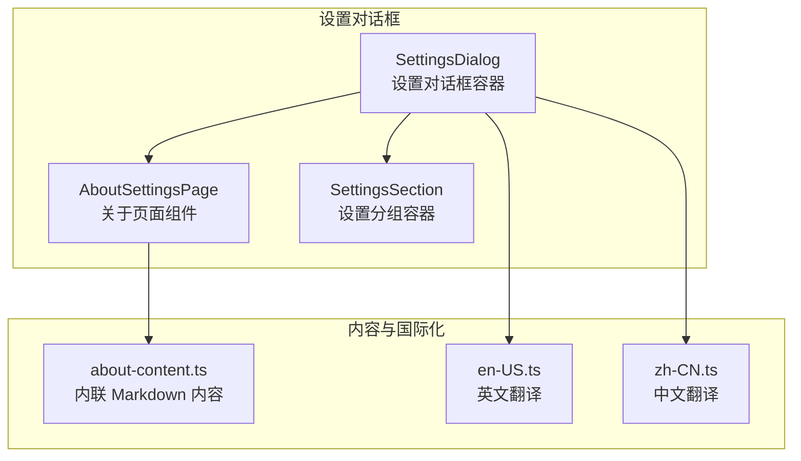
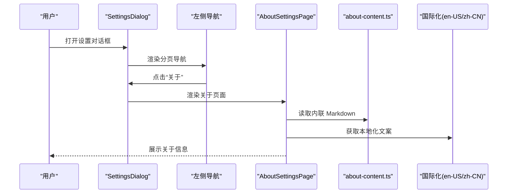
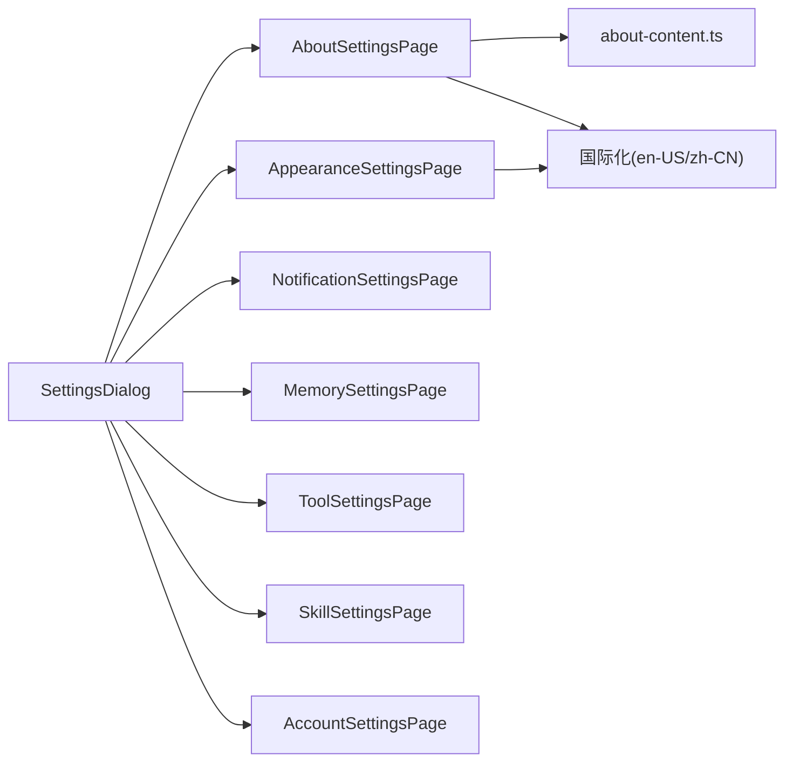

# 关于设置

<cite>
**本文引用的文件**
- [frontend/src/components/workspace/settings/about-settings-page.tsx](file://frontend/src/components/workspace/settings/about-settings-page.tsx)
- [frontend/src/components/workspace/settings/about-content.ts](file://frontend/src/components/workspace/settings/about-content.ts)
- [frontend/src/components/workspace/settings/about.md](file://frontend/src/components/workspace/settings/about.md)
- [frontend/src/components/workspace/settings/settings-dialog.tsx](file://frontend/src/components/workspace/settings/settings-dialog.tsx)
- [frontend/src/components/workspace/settings/settings-section.tsx](file://frontend/src/components/workspace/settings/settings-section.tsx)
- [frontend/src/components/workspace/settings/appearance-settings-page.tsx](file://frontend/src/components/workspace/settings/appearance-settings-page.tsx)
- [frontend/src/core/i18n/locales/en-US.ts](file://frontend/src/core/i18n/locales/en-US.ts)
- [frontend/src/core/i18n/locales/zh-CN.ts](file://frontend/src/core/i18n/locales/zh-CN.ts)
</cite>

## 目录
1. [简介](#简介)
2. [项目结构](#项目结构)
3. [核心组件](#核心组件)
4. [架构总览](#架构总览)
5. [详细组件分析](#详细组件分析)
6. [依赖关系分析](#依赖关系分析)
7. [性能考虑](#性能考虑)
8. [故障排查指南](#故障排查指南)
9. [结论](#结论)
10. [附录](#附录)

## 简介
本章节面向“关于设置”功能，系统性说明 DeerFlow 前端关于页面的信息展示、国际化支持与动态更新机制，并阐述其与设置对话框及其他配置模块的关系与数据流向。关于页面用于集中呈现系统信息（如版本、更新检查入口、许可证与致谢）、帮助文档链接与社区资源，是用户了解产品背景、合规与贡献者信息的重要入口。

## 项目结构
关于设置位于前端工作区设置对话框的“关于”分页中，采用内联 Markdown 内容的方式渲染，配合国际化文案与布局组件实现跨语言展示。

图表来源
- [frontend/src/components/workspace/settings/settings-dialog.tsx:44-154](file://frontend/src/components/workspace/settings/settings-dialog.tsx#L44-L154)
- [frontend/src/components/workspace/settings/about-settings-page.tsx:1-10](file://frontend/src/components/workspace/settings/about-settings-page.tsx#L1-L10)
- [frontend/src/components/workspace/settings/about-content.ts:1-68](file://frontend/src/components/workspace/settings/about-content.ts#L1-L68)
- [frontend/src/core/i18n/locales/en-US.ts:349-504](file://frontend/src/core/i18n/locales/en-US.ts#L349-L504)
- [frontend/src/core/i18n/locales/zh-CN.ts:333-484](file://frontend/src/core/i18n/locales/zh-CN.ts#L333-L484)

章节来源
- [frontend/src/components/workspace/settings/settings-dialog.tsx:44-154](file://frontend/src/components/workspace/settings/settings-dialog.tsx#L44-L154)
- [frontend/src/components/workspace/settings/about-settings-page.tsx:1-10](file://frontend/src/components/workspace/settings/about-settings-page.tsx#L1-L10)
- [frontend/src/components/workspace/settings/about-content.ts:1-68](file://frontend/src/components/workspace/settings/about-content.ts#L1-L68)
- [frontend/src/core/i18n/locales/en-US.ts:349-504](file://frontend/src/core/i18n/locales/en-US.ts#L349-L504)
- [frontend/src/core/i18n/locales/zh-CN.ts:333-484](file://frontend/src/core/i18n/locales/zh-CN.ts#L333-L484)

## 核心组件
- 设置对话框容器：负责承载“关于”在内的各设置分页，维护活动分页状态与导航列表。
- 关于页面组件：基于内联 Markdown 渲染系统信息、许可证与致谢等内容。
- 设置分组容器：统一的标题与描述样式包装器，保证设置页面的一致性。
- 国际化翻译：提供英文与中文文案，支撑关于页面的多语言展示。

章节来源
- [frontend/src/components/workspace/settings/settings-dialog.tsx:44-154](file://frontend/src/components/workspace/settings/settings-dialog.tsx#L44-L154)
- [frontend/src/components/workspace/settings/about-settings-page.tsx:1-10](file://frontend/src/components/workspace/settings/about-settings-page.tsx#L1-L10)
- [frontend/src/components/workspace/settings/settings-section.tsx:1-25](file://frontend/src/components/workspace/settings/settings-section.tsx#L1-L25)
- [frontend/src/core/i18n/locales/en-US.ts:349-504](file://frontend/src/core/i18n/locales/en-US.ts#L349-L504)
- [frontend/src/core/i18n/locales/zh-CN.ts:333-484](file://frontend/src/core/i18n/locales/zh-CN.ts#L333-L484)

## 架构总览
关于设置在设置对话框中作为独立分页存在，其渲染链路如下：

图表来源
- [frontend/src/components/workspace/settings/settings-dialog.tsx:58-93](file://frontend/src/components/workspace/settings/settings-dialog.tsx#L58-L93)
- [frontend/src/components/workspace/settings/about-settings-page.tsx:7-9](file://frontend/src/components/workspace/settings/about-settings-page.tsx#L7-L9)
- [frontend/src/components/workspace/settings/about-content.ts:5-67](file://frontend/src/components/workspace/settings/about-content.ts#L5-L67)
- [frontend/src/core/i18n/locales/en-US.ts:349-504](file://frontend/src/core/i18n/locales/en-US.ts#L349-L504)
- [frontend/src/core/i18n/locales/zh-CN.ts:333-484](file://frontend/src/core/i18n/locales/zh-CN.ts#L333-L484)

## 详细组件分析

### 关于页面组件（AboutSettingsPage）
- 职责：以 Markdown 形式渲染关于信息，包含产品介绍、GitHub 仓库、官网、支持邮箱、许可证与致谢等。
- 数据来源：内联 Markdown 字符串，避免额外资源加载与构建依赖。
- 渲染方式：通过 Markdown 渲染组件展示，确保富文本与链接可读性。

章节来源
- [frontend/src/components/workspace/settings/about-settings-page.tsx:1-10](file://frontend/src/components/workspace/settings/about-settings-page.tsx#L1-L10)
- [frontend/src/components/workspace/settings/about-content.ts:1-68](file://frontend/src/components/workspace/settings/about-content.ts#L1-L68)

### 关于页面内容（about-content.ts）
- 结构：包含产品概述、特性亮点、仓库与官网链接、支持邮箱、许可证声明、致谢与特殊感谢等。
- 组织：采用清晰的标题层级与分隔线，便于阅读与维护。
- 动态更新：内容为静态内联字符串，若需更新，修改该文件即可生效。

章节来源
- [frontend/src/components/workspace/settings/about-content.ts:1-68](file://frontend/src/components/workspace/settings/about-content.ts#L1-L68)

### 关于页面内容（about.md）
- 作用：作为备用或参考的 Markdown 内容文件，与内联版本保持信息一致性。
- 使用：当前关于页面直接使用内联 Markdown，该文件可作为内容对照或迁移参考。

章节来源
- [frontend/src/components/workspace/settings/about.md:1-56](file://frontend/src/components/workspace/settings/about.md#L1-L56)

### 设置对话框（SettingsDialog）
- 分页导航：包含账户、外观、通知、记忆、工具、技能、关于等分页入口。
- 活动分页：根据默认分页或用户点击切换当前显示分页。
- 关于分页：在活动分页为“关于”时渲染 AboutSettingsPage。

章节来源
- [frontend/src/components/workspace/settings/settings-dialog.tsx:44-154](file://frontend/src/components/workspace/settings/settings-dialog.tsx#L44-L154)

### 设置分组容器（SettingsSection）
- 作用：为每个设置分页提供统一的标题、描述与内容区域布局。
- 特点：支持可选标题与描述，内部使用通用样式类名，保证视觉一致性。

章节来源
- [frontend/src/components/workspace/settings/settings-section.tsx:1-25](file://frontend/src/components/workspace/settings/settings-section.tsx#L1-L25)

### 外观设置页面（AppearanceSettingsPage）
- 与关于设置的关系：外观设置页面展示了语言切换能力，而关于页面内容依赖国际化翻译。
- 语言切换：通过国际化钩子与语言选项，实现界面语言的动态切换，从而影响关于页面的文案展示。

章节来源
- [frontend/src/components/workspace/settings/appearance-settings-page.tsx:21-24](file://frontend/src/components/workspace/settings/appearance-settings-page.tsx#L21-L24)
- [frontend/src/core/i18n/locales/en-US.ts:451-453](file://frontend/src/core/i18n/locales/en-US.ts#L451-L453)
- [frontend/src/core/i18n/locales/zh-CN.ts:432-434](file://frontend/src/core/i18n/locales/zh-CN.ts#L432-L434)

### 国际化支持（en-US.ts / zh-CN.ts）
- 文案覆盖：settings.sections.about、common.version、common.lastUpdated 等字段为关于页面提供本地化文本。
- 语言切换：外观设置页面的语言选择联动国际化模块，使关于页面随语言变化而更新。

章节来源
- [frontend/src/core/i18n/locales/en-US.ts:349-504](file://frontend/src/core/i18n/locales/en-US.ts#L349-L504)
- [frontend/src/core/i18n/locales/zh-CN.ts:333-484](file://frontend/src/core/i18n/locales/zh-CN.ts#L333-L484)

## 依赖关系分析
关于设置与其他配置模块的关系如下：

图表来源
- [frontend/src/components/workspace/settings/settings-dialog.tsx:44-154](file://frontend/src/components/workspace/settings/settings-dialog.tsx#L44-L154)
- [frontend/src/components/workspace/settings/about-settings-page.tsx:1-10](file://frontend/src/components/workspace/settings/about-settings-page.tsx#L1-L10)
- [frontend/src/components/workspace/settings/appearance-settings-page.tsx:27-28](file://frontend/src/components/workspace/settings/appearance-settings-page.tsx#L27-L28)
- [frontend/src/core/i18n/locales/en-US.ts:349-504](file://frontend/src/core/i18n/locales/en-US.ts#L349-L504)
- [frontend/src/core/i18n/locales/zh-CN.ts:333-484](file://frontend/src/core/i18n/locales/zh-CN.ts#L333-L484)

章节来源
- [frontend/src/components/workspace/settings/settings-dialog.tsx:44-154](file://frontend/src/components/workspace/settings/settings-dialog.tsx#L44-L154)

## 性能考虑
- 内联 Markdown：关于页面使用内联字符串避免额外资源加载，减少首屏渲染路径与网络请求。
- 国际化缓存：语言切换通过国际化钩子进行，避免重复渲染与不必要的计算。
- 对话框懒加载：设置对话框仅在打开时渲染对应分页，降低常驻内存占用。

## 故障排查指南
- 关于页面空白或内容不显示
  - 检查内联 Markdown 是否正确导出与传入渲染组件。
  - 确认国际化翻译键是否存在，避免因缺失键导致文案异常。
- 语言切换后关于页面文案未更新
  - 确认语言切换逻辑是否触发国际化上下文更新。
  - 检查翻译文件中关于相关键值是否完整。
- 关于页面链接或图标异常
  - 核对 Markdown 内容格式与渲染组件支持情况。
  - 确保渲染组件插件配置正确。

章节来源
- [frontend/src/components/workspace/settings/about-settings-page.tsx:1-10](file://frontend/src/components/workspace/settings/about-settings-page.tsx#L1-L10)
- [frontend/src/components/workspace/settings/about-content.ts:1-68](file://frontend/src/components/workspace/settings/about-content.ts#L1-L68)
- [frontend/src/core/i18n/locales/en-US.ts:349-504](file://frontend/src/core/i18n/locales/en-US.ts#L349-L504)
- [frontend/src/core/i18n/locales/zh-CN.ts:333-484](file://frontend/src/core/i18n/locales/zh-CN.ts#L333-L484)

## 结论
关于设置通过内联 Markdown 与国际化机制，实现了稳定、可维护的信息展示与动态更新。其与设置对话框的其他模块解耦良好，既可独立维护，又能在语言切换时自然同步。未来如需扩展版本更新检查或帮助文档链接，可在现有结构基础上新增分组或链接，保持一致的渲染与国际化策略。

## 附录
- 关于页面内容组织要点
  - 使用清晰的标题层级与分隔线，提升可读性。
  - 将许可证与致谢等重要信息置于显眼位置。
- 国际化最佳实践
  - 在翻译文件中为“关于”相关键提供完整文案。
  - 语言切换应触发全局文案更新，确保关于页面即时反映。
- 扩展建议
  - 新增版本更新检查：在关于页面增加“版本”与“上次更新”字段，结合后端接口动态填充。
  - 新增帮助文档链接：在“官方网站”与“支持邮箱”之间插入帮助中心与常见问题链接，提升用户自助服务能力。