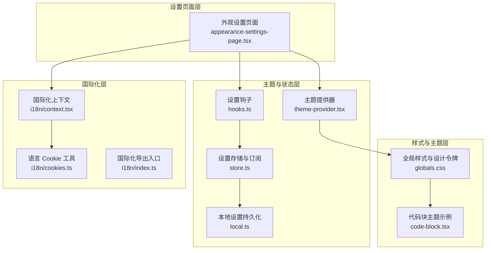
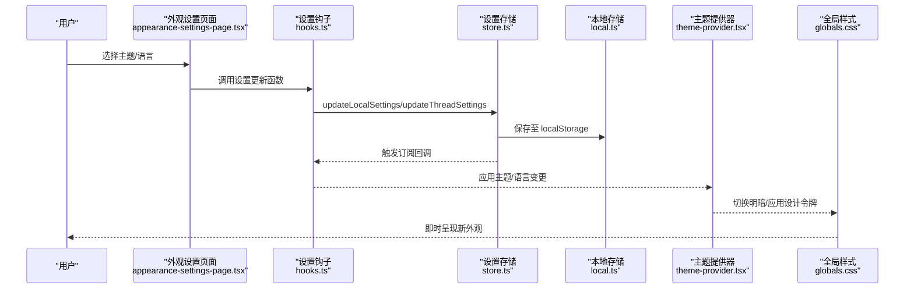
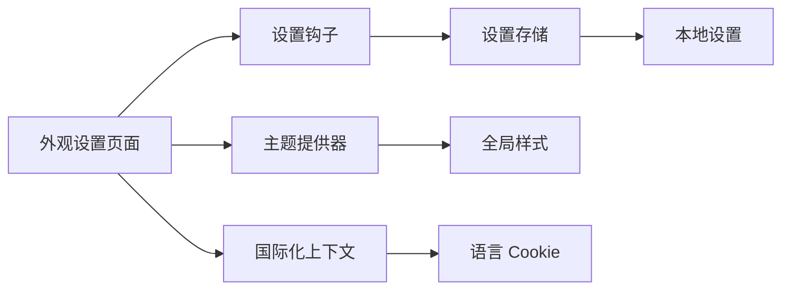
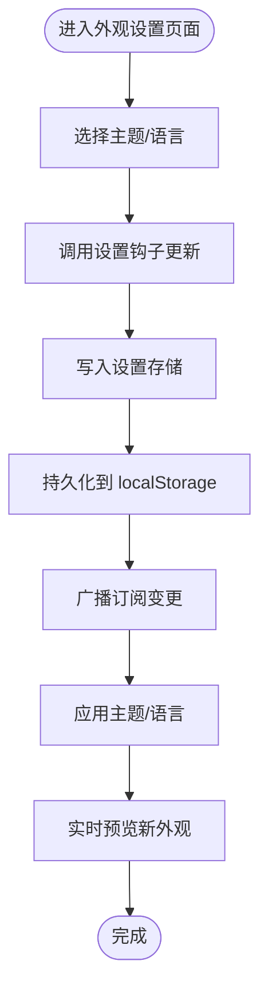

# 外观设置

<cite>
**本文引用的文件**
- [frontend/src/components/workspace/settings/appearance-settings-page.tsx](file://frontend/src/components/workspace/settings/appearance-settings-page.tsx)
- [frontend/src/components/theme-provider.tsx](file://frontend/src/components/theme-provider.tsx)
- [frontend/src/core/settings/local.ts](file://frontend/src/core/settings/local.ts)
- [frontend/src/core/settings/store.ts](file://frontend/src/core/settings/store.ts)
- [frontend/src/core/settings/hooks.ts](file://frontend/src/core/settings/hooks.ts)
- [frontend/src/styles/globals.css](file://frontend/src/styles/globals.css)
- [frontend/src/components/ai-elements/code-block.tsx](file://frontend/src/components/ai-elements/code-block.tsx)
- [frontend/src/core/i18n/context.tsx](file://frontend/src/core/i18n/context.tsx)
- [frontend/src/core/i18n/cookies.ts](file://frontend/src/core/i18n/cookies.ts)
- [frontend/src/core/i18n/index.ts](file://frontend/src/core/i18n/index.ts)
</cite>

## 目录
1. [简介](#简介)
2. [项目结构](#项目结构)
3. [核心组件](#核心组件)
4. [架构总览](#架构总览)
5. [详细组件分析](#详细组件分析)
6. [依赖关系分析](#依赖关系分析)
7. [性能考量](#性能考量)
8. [故障排查指南](#故障排查指南)
9. [结论](#结论)
10. [附录](#附录)

## 简介
本文件面向 DeerFlow 的外观设置功能，系统性阐述主题切换、颜色方案配置、字体设置与布局调整等外观定制能力；并深入解析外观设置的状态管理机制（本地存储、全局状态同步、跨标签页实时预览）；最后提供主题系统的扩展方法与自定义样式的实现指南，辅以可视化图示与可追溯的文件路径引用。

## 项目结构
外观设置相关代码主要分布在前端工程中，涉及设置页面、主题提供器、本地设置存储与订阅、国际化语言切换以及全局样式体系。下图展示外观设置在前端中的位置与交互关系：

图表来源
- [frontend/src/components/workspace/settings/appearance-settings-page.tsx:1-197](file://frontend/src/components/workspace/settings/appearance-settings-page.tsx#L1-L197)
- [frontend/src/components/theme-provider.tsx:1-20](file://frontend/src/components/theme-provider.tsx#L1-L20)
- [frontend/src/core/settings/store.ts:1-151](file://frontend/src/core/settings/store.ts#L1-L151)
- [frontend/src/core/settings/hooks.ts:1-60](file://frontend/src/core/settings/hooks.ts#L1-L60)
- [frontend/src/core/settings/local.ts:1-129](file://frontend/src/core/settings/local.ts#L1-L129)
- [frontend/src/styles/globals.css:1-393](file://frontend/src/styles/globals.css#L1-L393)
- [frontend/src/components/ai-elements/code-block.tsx:61-99](file://frontend/src/components/ai-elements/code-block.tsx#L61-L99)
- [frontend/src/core/i18n/context.tsx:1-41](file://frontend/src/core/i18n/context.tsx#L1-L41)
- [frontend/src/core/i18n/cookies.ts:1-52](file://frontend/src/core/i18n/cookies.ts#L1-L52)
- [frontend/src/core/i18n/index.ts:1-11](file://frontend/src/core/i18n/index.ts#L1-L11)

章节来源
- [frontend/src/components/workspace/settings/appearance-settings-page.tsx:1-197](file://frontend/src/components/workspace/settings/appearance-settings-page.tsx#L1-L197)
- [frontend/src/components/theme-provider.tsx:1-20](file://frontend/src/components/theme-provider.tsx#L1-L20)
- [frontend/src/core/settings/local.ts:1-129](file://frontend/src/core/settings/local.ts#L1-L129)
- [frontend/src/core/settings/store.ts:1-151](file://frontend/src/core/settings/store.ts#L1-L151)
- [frontend/src/core/settings/hooks.ts:1-60](file://frontend/src/core/settings/hooks.ts#L1-L60)
- [frontend/src/styles/globals.css:1-393](file://frontend/src/styles/globals.css#L1-L393)
- [frontend/src/components/ai-elements/code-block.tsx:61-99](file://frontend/src/components/ai-elements/code-block.tsx#L61-L99)
- [frontend/src/core/i18n/context.tsx:1-41](file://frontend/src/core/i18n/context.tsx#L1-L41)
- [frontend/src/core/i18n/cookies.ts:1-52](file://frontend/src/core/i18n/cookies.ts#L1-L52)
- [frontend/src/core/i18n/index.ts:1-11](file://frontend/src/core/i18n/index.ts#L1-L11)

## 核心组件
- 外观设置页面：提供主题模式选择（跟随系统/浅色/深色）、语言切换等界面，并通过主题提供器与本地设置钩子实现即时生效与持久化。
- 主题提供器：封装 next-themes，支持首页强制深色与按路径动态切换。
- 设置存储与订阅：基于 useSyncExternalStore 的自研状态中心，负责合并、保存与广播设置变更，同时监听 localStorage 实现跨标签页同步。
- 本地设置持久化：以 localStorage 为后端，提供默认值合并、键空间隔离（含线程模型键前缀）与安全解析。
- 全局样式与设计令牌：通过 Tailwind CSS 与 CSS 变量构建主题令牌，支持明暗主题切换与动画变体。
- 国际化上下文与 Cookie：提供语言切换与持久化，确保语言设置在服务端与客户端一致。

章节来源
- [frontend/src/components/workspace/settings/appearance-settings-page.tsx:26-112](file://frontend/src/components/workspace/settings/appearance-settings-page.tsx#L26-L112)
- [frontend/src/components/theme-provider.tsx:6-19](file://frontend/src/components/theme-provider.tsx#L6-L19)
- [frontend/src/core/settings/store.ts:14-151](file://frontend/src/core/settings/store.ts#L14-L151)
- [frontend/src/core/settings/local.ts:19-129](file://frontend/src/core/settings/local.ts#L19-L129)
- [frontend/src/styles/globals.css:73-293](file://frontend/src/styles/globals.css#L73-L293)
- [frontend/src/core/i18n/context.tsx:14-32](file://frontend/src/core/i18n/context.tsx#L14-L32)

## 架构总览
外观设置的端到端流程如下：用户在外观设置页面选择主题或语言 → 触发状态更新 → 写入本地存储 → 通过订阅机制广播给所有订阅者 → 主题提供器与样式系统响应 → 页面即时呈现新外观。

图表来源
- [frontend/src/components/workspace/settings/appearance-settings-page.tsx:26-112](file://frontend/src/components/workspace/settings/appearance-settings-page.tsx#L26-L112)
- [frontend/src/core/settings/hooks.ts:17-59](file://frontend/src/core/settings/hooks.ts#L17-L59)
- [frontend/src/core/settings/store.ts:118-150](file://frontend/src/core/settings/store.ts#L118-L150)
- [frontend/src/core/settings/local.ts:109-128](file://frontend/src/core/settings/local.ts#L109-L128)
- [frontend/src/components/theme-provider.tsx:6-19](file://frontend/src/components/theme-provider.tsx#L6-L19)
- [frontend/src/styles/globals.css:225-293](file://frontend/src/styles/globals.css#L225-L293)

## 详细组件分析

### 外观设置页面（AppearanceSettingsPage）
- 功能职责
  - 展示主题选项卡片（系统/浅色/深色），点击即刻切换。
  - 实时预览：根据当前系统主题或所选模式渲染卡片示例。
  - 语言切换：通过国际化上下文更新语言并写入 Cookie。
- 关键点
  - 使用 next-themes 的 useTheme 获取/设置主题。
  - 使用 useI18n 获取翻译与当前语言，changeLocale 更新语言。
  - 主题卡片通过 systemTheme 推断预览模式，保证“系统”模式下的正确预览。

章节来源
- [frontend/src/components/workspace/settings/appearance-settings-page.tsx:26-112](file://frontend/src/components/workspace/settings/appearance-settings-page.tsx#L26-L112)
- [frontend/src/components/workspace/settings/appearance-settings-page.tsx:114-197](file://frontend/src/components/workspace/settings/appearance-settings-page.tsx#L114-L197)
- [frontend/src/core/i18n/context.tsx:23-26](file://frontend/src/core/i18n/context.tsx#L23-L26)

### 主题提供器（ThemeProvider）
- 功能职责
  - 封装 next-themes，统一注入主题上下文。
  - 特殊处理首页强制深色，其余路径按系统/用户偏好自动。
- 关键点
  - 通过 usePathname 判断路径，设置 forcedTheme。
  - 作为顶层 Provider，影响全局明暗主题与样式系统。

章节来源
- [frontend/src/components/theme-provider.tsx:6-19](file://frontend/src/components/theme-provider.tsx#L6-L19)

### 设置存储与订阅（store.ts）
- 功能职责
  - 统一的状态中心：合并、保存、广播设置变更。
  - 跨标签页同步：监听 localStorage 的 storage 事件，触发订阅。
  - 线程模型键空间：独立存储每个线程的模型名覆盖。
- 关键点
  - 订阅机制：useSyncExternalStore + emitChange。
  - 存储键：LOCAL_SETTINGS_KEY、THREAD_MODEL_KEY_PREFIX。
  - 合并策略：深度合并指定设置段落，避免全量替换。

章节来源
- [frontend/src/core/settings/store.ts:14-151](file://frontend/src/core/settings/store.ts#L14-L151)

### 本地设置持久化（local.ts）
- 功能职责
  - 默认设置与合并：DEFAULT_LOCAL_SETTINGS 与 mergeLocalSettings。
  - 本地存储：localStorage 读写，JSON 安全解析。
  - 线程模型覆盖：按 threadId 生成键，支持覆盖 context.model_name。
- 关键点
  - isBrowser 判定，避免 SSR 报错。
  - applyThreadModelOverride 在读取时动态叠加线程覆盖。

章节来源
- [frontend/src/core/settings/local.ts:4-129](file://frontend/src/core/settings/local.ts#L4-L129)

### 设置钩子（hooks.ts）
- 功能职责
  - 对外暴露 useLocalSettings/useThreadSettings。
  - 基于 useSyncExternalStore 订阅全局设置快照。
  - 支持线程级覆盖：将线程模型名合并到基础设置。
- 关键点
  - getThreadModelSnapshot 缓存线程模型名。
  - updateThreadSettings 仅在 context.model_name 变更时写入线程键。

章节来源
- [frontend/src/core/settings/hooks.ts:17-59](file://frontend/src/core/settings/hooks.ts#L17-L59)

### 全局样式与设计令牌（globals.css）
- 功能职责
  - 定义 CSS 变量与明暗主题映射。
  - 提供设计令牌（颜色、圆角、阴影、过渡、动画）。
  - 通过 @theme 与 Tailwind 集成，支持 dark 伪类变体。
- 关键点
  - :root 与 .dark 分别定义亮/暗主题令牌。
  - 动画变体（fade-in、wave、shine 等）提升交互体验。
  - 代码块示例使用不同主题（one-light/one-dark-pro）演示主题覆盖。

章节来源
- [frontend/src/styles/globals.css:73-293](file://frontend/src/styles/globals.css#L73-L293)
- [frontend/src/components/ai-elements/code-block.tsx:61-99](file://frontend/src/components/ai-elements/code-block.tsx#L61-L99)

### 国际化与语言切换（i18n）
- 功能职责
  - I18nProvider 管理 locale 状态与 Cookie 写入。
  - cookies 工具提供客户端/服务端读取与设置。
  - appearance-settings-page 通过 changeLocale 切换语言。
- 关键点
  - Cookie 名称固定，便于跨请求保持语言偏好。
  - detectLocale 与 getLocaleFromCookie 用于回退与初始化。

章节来源
- [frontend/src/core/i18n/context.tsx:14-32](file://frontend/src/core/i18n/context.tsx#L14-L32)
- [frontend/src/core/i18n/cookies.ts:11-37](file://frontend/src/core/i18n/cookies.ts#L11-L37)
- [frontend/src/core/i18n/index.ts:1-11](file://frontend/src/core/i18n/index.ts#L1-L11)
- [frontend/src/components/workspace/settings/appearance-settings-page.tsx:86-109](file://frontend/src/components/workspace/settings/appearance-settings-page.tsx#L86-L109)

## 依赖关系分析
外观设置模块内部依赖清晰，遵循“页面 -> 钩子 -> 存储 -> 本地存储”的单向数据流；主题提供器与样式系统位于最底层，被上层状态驱动。

图表来源
- [frontend/src/components/workspace/settings/appearance-settings-page.tsx:26-112](file://frontend/src/components/workspace/settings/appearance-settings-page.tsx#L26-L112)
- [frontend/src/core/settings/hooks.ts:17-59](file://frontend/src/core/settings/hooks.ts#L17-L59)
- [frontend/src/core/settings/store.ts:118-150](file://frontend/src/core/settings/store.ts#L118-L150)
- [frontend/src/core/settings/local.ts:109-128](file://frontend/src/core/settings/local.ts#L109-L128)
- [frontend/src/components/theme-provider.tsx:6-19](file://frontend/src/components/theme-provider.tsx#L6-L19)
- [frontend/src/styles/globals.css:225-293](file://frontend/src/styles/globals.css#L225-L293)
- [frontend/src/core/i18n/context.tsx:23-26](file://frontend/src/core/i18n/context.tsx#L23-L26)

章节来源
- [frontend/src/components/workspace/settings/appearance-settings-page.tsx:26-112](file://frontend/src/components/workspace/settings/appearance-settings-page.tsx#L26-L112)
- [frontend/src/core/settings/hooks.ts:17-59](file://frontend/src/core/settings/hooks.ts#L17-L59)
- [frontend/src/core/settings/store.ts:118-150](file://frontend/src/core/settings/store.ts#L118-L150)
- [frontend/src/core/settings/local.ts:109-128](file://frontend/src/core/settings/local.ts#L109-L128)
- [frontend/src/components/theme-provider.tsx:6-19](file://frontend/src/components/theme-provider.tsx#L6-L19)
- [frontend/src/styles/globals.css:225-293](file://frontend/src/styles/globals.css#L225-L293)
- [frontend/src/core/i18n/context.tsx:23-26](file://frontend/src/core/i18n/context.tsx#L23-L26)

## 性能考量
- 状态订阅与渲染
  - 使用 useSyncExternalStore 降低不必要的重渲染，仅在相关设置变化时更新。
  - 合并策略仅更新变更段落，避免全量写入。
- 存储与同步
  - localStorage 读写在主线程执行，建议批量更新或节流高频操作。
  - storage 事件监听在多标签页场景下可能频繁触发，需注意去抖与幂等处理。
- 样式与主题
  - CSS 变量切换成本低，动画与过渡在现代浏览器中性能良好。
  - 代码高亮主题切换建议缓存已生成 HTML，避免重复计算。

## 故障排查指南
- 主题未生效
  - 检查 ThemeProvider 是否包裹根组件，以及 forcedTheme 配置是否符合预期。
  - 确认系统主题与浏览器暗色模式设置未冲突。
- 语言切换无效
  - 确认 I18nProvider 初始化语言与 Cookie 写入成功。
  - 检查 changeLocale 调用链是否正确触发 Cookie 更新。
- 跨标签页不同步
  - 确认 storage 事件监听已注册且未被异常中断。
  - 检查 LOCAL_SETTINGS_KEY 与 THREAD_MODEL_KEY_PREFIX 是否一致。
- 线程模型覆盖不生效
  - 确认 updateThreadSettings 仅在 context.model_name 变更时写入线程键。
  - 检查 applyThreadModelOverride 是否在读取时被调用。

章节来源
- [frontend/src/components/theme-provider.tsx:6-19](file://frontend/src/components/theme-provider.tsx#L6-L19)
- [frontend/src/core/i18n/context.tsx:23-26](file://frontend/src/core/i18n/context.tsx#L23-L26)
- [frontend/src/core/settings/store.ts:64-91](file://frontend/src/core/settings/store.ts#L64-L91)
- [frontend/src/core/settings/store.ts:127-150](file://frontend/src/core/settings/store.ts#L127-L150)
- [frontend/src/core/settings/local.ts:96-107](file://frontend/src/core/settings/local.ts#L96-L107)

## 结论
DeerFlow 的外观设置通过“页面选择 -> 钩子订阅 -> 存储广播 -> 主题提供器 -> 样式系统”的链路实现了即时、持久、跨标签页同步的外观定制体验。其设计以 CSS 变量与明暗主题为核心，结合 localStorage 与 useSyncExternalStore，既保证了性能也具备良好的扩展性。后续可在现有基础上进一步完善主题商店、字体与布局令牌化、以及更丰富的交互动效。

## 附录

### 外观设置状态流转流程（代码级）

图表来源
- [frontend/src/components/workspace/settings/appearance-settings-page.tsx:26-112](file://frontend/src/components/workspace/settings/appearance-settings-page.tsx#L26-L112)
- [frontend/src/core/settings/hooks.ts:17-59](file://frontend/src/core/settings/hooks.ts#L17-L59)
- [frontend/src/core/settings/store.ts:118-150](file://frontend/src/core/settings/store.ts#L118-L150)
- [frontend/src/core/settings/local.ts:109-128](file://frontend/src/core/settings/local.ts#L109-L128)

### 扩展与自定义指南
- 新增主题方案
  - 在全局样式中新增一组 CSS 变量令牌，或引入新的设计令牌集。
  - 在外观设置页面增加对应主题卡片与切换逻辑。
  - 若需持久化额外主题参数，可在本地设置结构中扩展并更新存储与合并逻辑。
- 字体与排版
  - 在全局样式中定义字体族变量，通过 CSS 变量在 :root/.dark 中切换。
  - 在代码块组件中增加主题选择器，支持不同语言的高亮主题。
- 布局与间距
  - 使用容器宽度变量与间距变量统一布局，避免硬编码。
  - 通过 Tailwind 与 CSS 变量结合，确保明暗主题下视觉一致性。
- 自定义样式覆盖
  - 优先使用 CSS 变量与设计令牌，减少对具体颜色值的直接引用。
  - 在组件层面通过 className 与 CSS Modules 或 styled-components 实现局部覆盖。
  - 对第三方库样式，采用作用域隔离与 !important 的最小化原则进行覆盖。

章节来源
- [frontend/src/styles/globals.css:73-293](file://frontend/src/styles/globals.css#L73-L293)
- [frontend/src/components/ai-elements/code-block.tsx:61-99](file://frontend/src/components/ai-elements/code-block.tsx#L61-L99)
- [frontend/src/components/workspace/settings/appearance-settings-page.tsx:26-112](file://frontend/src/components/workspace/settings/appearance-settings-page.tsx#L26-L112)