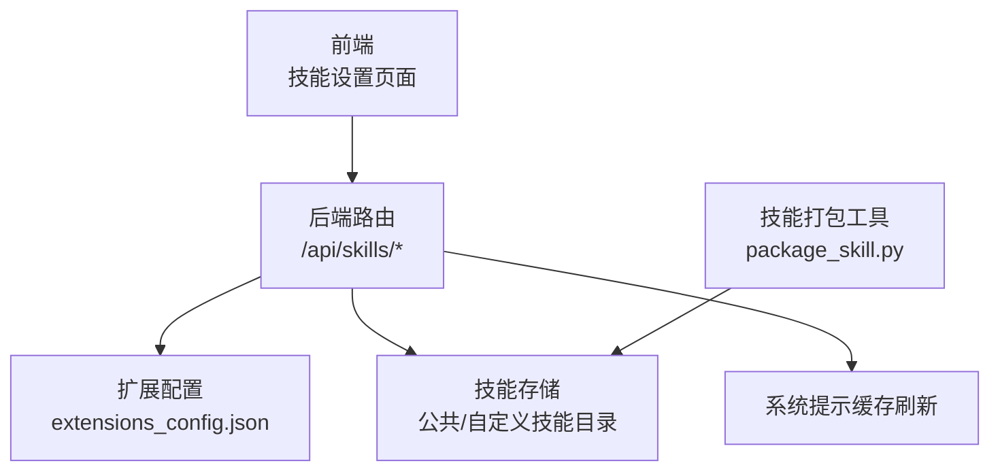
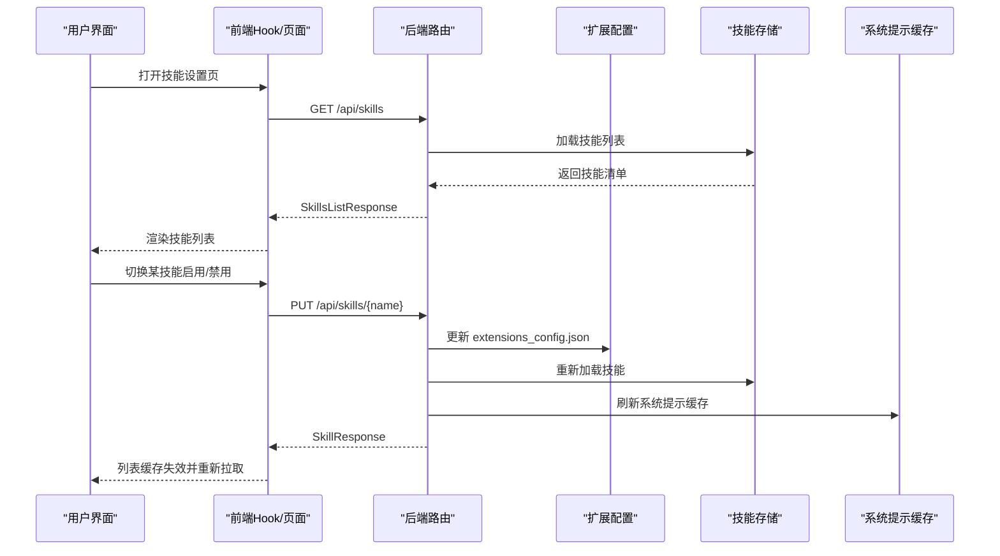
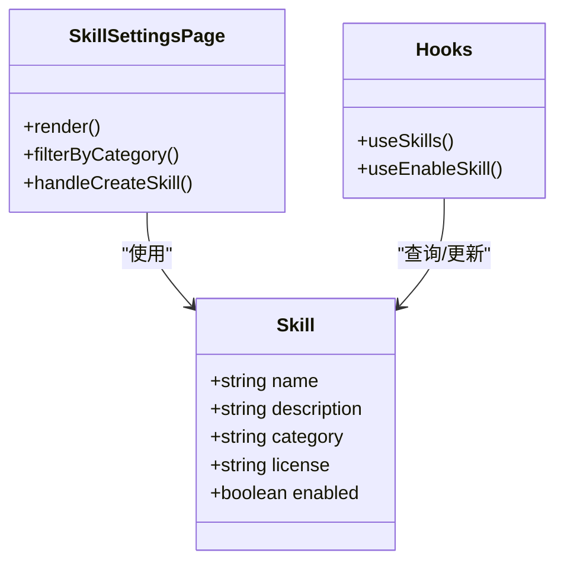
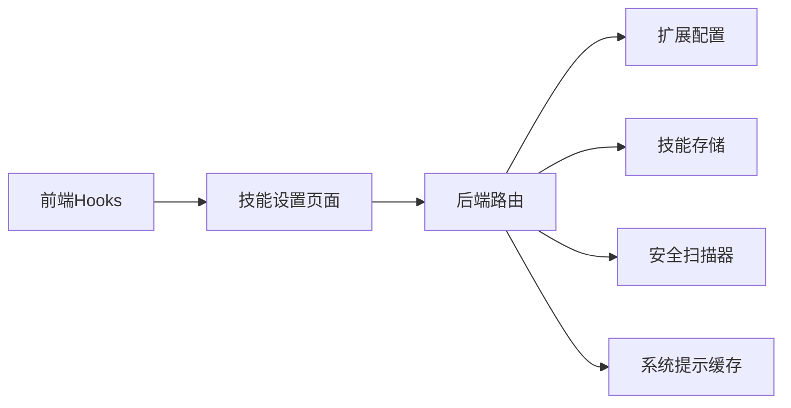

# 技能设置

<cite>
**本文引用的文件**
- [skills.py](file://backend/app/gateway/routers/skills.py)
- [type.ts](file://frontend/src/core/skills/type.ts)
- [hooks.ts](file://frontend/src/core/skills/hooks.ts)
- [skill-settings-page.tsx](file://frontend/src/components/workspace/settings/skill-settings-page.tsx)
- [package_skill.py](file://skills/public/skill-creator/scripts/package_skill.py)
- [rfc-extract-shared-modules.md](file://backend/docs/rfc-extract-shared-modules.md)
- [test_skills_archive_root.py](file://backend/tests/test_skills_archive_root.py)
</cite>

## 目录
1. [简介](#简介)
2. [项目结构](#项目结构)
3. [核心组件](#核心组件)
4. [架构总览](#架构总览)
5. [详细组件分析](#详细组件分析)
6. [依赖分析](#依赖分析)
7. [性能考虑](#性能考虑)
8. [故障排除指南](#故障排除指南)
9. [结论](#结论)
10. [附录](#附录)

## 简介
本技术文档围绕 DeerFlow 的“技能设置”功能展开，系统性阐述技能启用/禁用管理、技能分类与状态持久化、自定义技能内容编辑与历史回滚、安装与打包流程、以及前端展示与交互。文档同时覆盖数据结构、验证规则、批量操作机制、缓存策略、实时同步与版本管理，并给出导入导出与备份恢复的实践建议。

## 项目结构
技能设置功能横跨后端 FastAPI 路由层、前端 React 查询与变更层，以及技能包打包工具链。关键位置如下：
- 后端路由：提供技能列表、详情、启用/禁用更新、自定义技能读写与历史回滚、安装入口等接口
- 前端：提供技能设置页面、查询与变更 Hook、UI 切换组件
- 技能打包：提供 .skill 包生成工具，用于导出与分发



图表来源
- [skills.py:21-353](file://backend/app/gateway/routers/skills.py#L21-L353)
- [skill-settings-page.tsx:1-135](file://frontend/src/components/workspace/settings/skill-settings-page.tsx#L1-L135)
- [package_skill.py:87-136](file://skills/public/skill-creator/scripts/package_skill.py#L87-L136)

章节来源
- [skills.py:21-353](file://backend/app/gateway/routers/skills.py#L21-L353)
- [skill-settings-page.tsx:1-135](file://frontend/src/components/workspace/settings/skill-settings-page.tsx#L1-L135)

## 核心组件
- 技能数据模型（前端）
  - 字段：名称、描述、类别、许可证、启用状态
- 技能设置页面（前端）
  - 支持按“公共/自定义”筛选、启用/禁用切换、空态引导与新建入口
- 技能设置 Hook（前端）
  - 技能列表查询、启用/禁用变更、变更后缓存失效与重载
- 技能路由（后端）
  - 列表、详情、启用/禁用更新、安装、自定义技能读写、历史与回滚、安全扫描

章节来源
- [type.ts:1-7](file://frontend/src/core/skills/type.ts#L1-L7)
- [hooks.ts:1-31](file://frontend/src/core/skills/hooks.ts#L1-L31)
- [skill-settings-page.tsx:51-135](file://frontend/src/components/workspace/settings/skill-settings-page.tsx#L51-L135)
- [skills.py:24-353](file://backend/app/gateway/routers/skills.py#L24-L353)

## 架构总览
技能设置的端到端流程包括：前端发起查询与变更请求，后端路由处理并持久化到扩展配置与技能存储，必要时刷新系统提示缓存以实现“实时同步”。



图表来源
- [skills.py:88-101](file://backend/app/gateway/routers/skills.py#L88-L101)
- [skills.py:304-353](file://backend/app/gateway/routers/skills.py#L304-L353)
- [hooks.ts:7-31](file://frontend/src/core/skills/hooks.ts#L7-L31)

## 详细组件分析

### 后端路由与数据流
- 技能列表与详情
  - GET /api/skills：返回所有技能（公共+自定义）
  - GET /api/skills/{skill_name}：返回单个技能详情
- 启用/禁用更新
  - PUT /api/skills/{name}：更新技能 enabled 状态，写入扩展配置并重载
- 自定义技能管理
  - GET /api/skills/custom：仅返回自定义技能
  - GET /api/skills/custom/{skill_name}：读取自定义技能内容
  - PUT /api/skills/custom/{skill_name}：编辑自定义技能内容（含安全扫描与历史记录）
  - DELETE /api/skills/custom/{skill_name}：删除自定义技能（带历史记录）
  - GET /api/skills/custom/{skill_name}/history：读取历史
  - POST /api/skills/custom/{skill_name}/rollback：回滚到指定历史条目
- 安装与打包
  - POST /api/skills/install：从 .skill 文件安装技能
  - 技能打包工具：生成 .skill ZIP 包，便于导入与分发

```mermaid
flowchart TD
Start(["请求进入 /api/skills/*"]) --> Route{"路由匹配"}
Route --> |GET /skills| List["加载技能列表"]
Route --> |GET /skills/{name}| Detail["读取单个技能"]
Route --> |PUT /skills/{name}| Toggle["更新 enabled 状态"]
Route --> |GET/PUT/DELETE/ROLLBACK /skills/custom| CustomOps["自定义技能操作"]
Route --> |POST /skills/install| Install["安装 .skill 包"]
List --> Resp["返回 SkillsListResponse"]
Detail --> Resp
Toggle --> SaveCfg["写入扩展配置并重载"]
SaveCfg --> Refresh["刷新系统提示缓存"]
Refresh --> Resp
CustomOps --> Scan["安全扫描"]
Scan --> Hist["记录历史"]
Hist --> Resp
Install --> Refresh
Refresh --> Resp
```

图表来源
- [skills.py:88-353](file://backend/app/gateway/routers/skills.py#L88-L353)

章节来源
- [skills.py:24-353](file://backend/app/gateway/routers/skills.py#L24-L353)

### 前端组件与交互
- 技能类型定义
  - Skill 接口包含 name、description、category、license、enabled 字段
- 技能设置页面
  - 支持按“公共/自定义”筛选
  - 使用 Switch 组件切换启用/禁用
  - 提供空态与新建入口
- 查询与变更 Hook
  - useSkills：查询技能列表
  - useEnableSkill：变更技能启用状态，成功后使查询缓存失效并重新拉取



图表来源
- [type.ts:1-7](file://frontend/src/core/skills/type.ts#L1-L7)
- [skill-settings-page.tsx:51-135](file://frontend/src/components/workspace/settings/skill-settings-page.tsx#L51-L135)
- [hooks.ts:1-31](file://frontend/src/core/skills/hooks.ts#L1-L31)

章节来源
- [type.ts:1-7](file://frontend/src/core/skills/type.ts#L1-L7)
- [skill-settings-page.tsx:1-135](file://frontend/src/components/workspace/settings/skill-settings-page.tsx#L1-L135)
- [hooks.ts:1-31](file://frontend/src/core/skills/hooks.ts#L1-L31)

### 数据结构与验证规则
- 技能数据模型
  - 前端：Skill 接口字段
  - 后端：SkillResponse、SkillsListResponse、SkillUpdateRequest 等 Pydantic 模型
- 安全与校验
  - 自定义技能编辑前进行内容安全扫描
  - 历史记录包含操作元信息（作者、文件路径、前后内容、扫描结果）
  - 安装时解析 .skill 包根目录，过滤 macOS 元数据与隐藏条目，拒绝仅含元数据的归档
- 扩展配置
  - enabled 状态持久化于扩展配置文件，更新后重载配置并刷新系统提示缓存

章节来源
- [skills.py:24-76](file://backend/app/gateway/routers/skills.py#L24-L76)
- [skills.py:154-189](file://backend/app/gateway/routers/skills.py#L154-L189)
- [test_skills_archive_root.py:22-41](file://backend/tests/test_skills_archive_root.py#L22-L41)

### 批量操作机制
- 当前接口支持逐项启用/禁用与逐项编辑/删除/回滚
- 批量操作可通过循环调用现有接口实现；建议在前端通过队列或并发控制保障一致性
- 批量安装可重复调用安装接口，结合错误处理与重试策略

章节来源
- [skills.py:103-126](file://backend/app/gateway/routers/skills.py#L103-L126)
- [skills.py:304-353](file://backend/app/gateway/routers/skills.py#L304-L353)

### 缓存策略、实时同步与版本管理
- 缓存策略
  - 前端使用查询键“skills”缓存技能列表；变更成功后主动失效并重新拉取
- 实时同步
  - 更新启用状态后刷新系统提示缓存，确保后续对话行为即时反映最新配置
- 版本管理
  - 自定义技能具备历史记录与回滚能力，支持选择历史索引进行恢复

章节来源
- [hooks.ts:15-31](file://frontend/src/core/skills/hooks.ts#L15-L31)
- [skills.py:113-114](file://backend/app/gateway/routers/skills.py#L113-L114)
- [skills.py:166-177](file://backend/app/gateway/routers/skills.py#L166-L177)
- [skills.py:234-278](file://backend/app/gateway/routers/skills.py#L234-L278)

### 导入导出与备份恢复
- 导出（导出为 .skill 包）
  - 使用技能打包脚本生成 .skill 文件，包含技能目录内除构建产物外的所有文件
- 导入（安装 .skill 包）
  - 通过安装接口将 .skill 包解压至技能存储根目录，自动解析根目录并进行安全检查
- 备份与恢复
  - 备份：保存扩展配置文件与自定义技能目录
  - 恢复：还原配置文件与技能目录，必要时通过回滚接口恢复特定历史版本

章节来源
- [package_skill.py:87-136](file://skills/public/skill-creator/scripts/package_skill.py#L87-L136)
- [skills.py:109-126](file://backend/app/gateway/routers/skills.py#L109-L126)
- [rfc-extract-shared-modules.md:61-84](file://backend/docs/rfc-extract-shared-modules.md#L61-L84)

## 依赖分析
- 前端依赖
  - React Query：查询与变更管理
  - UI 组件库：Switch、Tabs、Empty 等
- 后端依赖
  - FastAPI 路由：统一响应模型与异常处理
  - 扩展配置模块：技能状态持久化
  - 技能存储模块：公共/自定义技能读写与历史记录
  - 安全扫描器：自定义技能内容安全检查
  - 系统提示缓存：启用/禁用更新后的实时同步



图表来源
- [hooks.ts:1-31](file://frontend/src/core/skills/hooks.ts#L1-L31)
- [skill-settings-page.tsx:1-135](file://frontend/src/components/workspace/settings/skill-settings-page.tsx#L1-L135)
- [skills.py:1-18](file://backend/app/gateway/routers/skills.py#L1-L18)

章节来源
- [hooks.ts:1-31](file://frontend/src/core/skills/hooks.ts#L1-L31)
- [skill-settings-page.tsx:1-135](file://frontend/src/components/workspace/settings/skill-settings-page.tsx#L1-L135)
- [skills.py:1-18](file://backend/app/gateway/routers/skills.py#L1-L18)

## 性能考虑
- 前端
  - 使用查询键缓存技能列表，变更后仅失效相关查询，避免全量刷新
  - 切换开关时异步提交，减少 UI 卡顿
- 后端
  - 安装与编辑涉及磁盘 IO 与安全扫描，建议限制并发与超时
  - 历史记录写入采用追加方式，避免大文件频繁重写
- 可扩展性
  - 扩展配置文件采用 JSON 结构，便于后续引入索引与增量更新

## 故障排除指南
- 安装失败
  - 检查 .skill 包是否包含有效技能根目录，避免仅含元数据
  - 查看后端日志定位具体异常（路径解析、权限、格式等）
- 编辑被阻断
  - 安全扫描返回 block 时，需修正内容或联系管理员
- 回滚失败
  - 确认历史索引有效且存在 prev_content
  - 检查目标内容是否满足验证规则
- 启用/禁用不生效
  - 确认扩展配置已更新并重载
  - 检查系统提示缓存刷新是否完成

章节来源
- [test_skills_archive_root.py:22-41](file://backend/tests/test_skills_archive_root.py#L22-L41)
- [skills.py:154-189](file://backend/app/gateway/routers/skills.py#L154-L189)
- [skills.py:234-278](file://backend/app/gateway/routers/skills.py#L234-L278)
- [skills.py:304-353](file://backend/app/gateway/routers/skills.py#L304-L353)

## 结论
技能设置功能通过清晰的前后端分工与完善的后端路由体系，实现了技能的可视化管理、启用/禁用的即时生效、自定义技能的安全编辑与历史回滚、以及 .skill 包的导入导出与版本恢复。建议在生产环境中配合严格的权限控制、审计日志与容量监控，持续优化安装与编辑流程的性能与稳定性。

## 附录
- 关键接口一览
  - GET /api/skills：列出所有技能
  - GET /api/skills/{name}：获取技能详情
  - PUT /api/skills/{name}：更新启用状态
  - POST /api/skills/install：安装 .skill 包
  - GET/PUT/DELETE /api/skills/custom/{skill_name}：自定义技能读写删
  - GET /api/skills/custom/{skill_name}/history：读取历史
  - POST /api/skills/custom/{skill_name}/rollback：回滚
- 前端交互要点
  - 使用 Switch 切换启用状态
  - 分类筛选“公共/自定义”
  - 变更后主动失效并刷新缓存