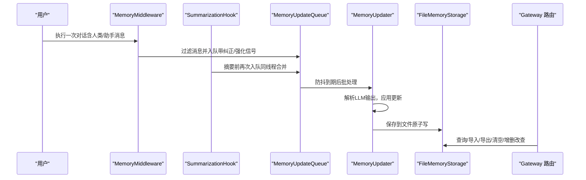
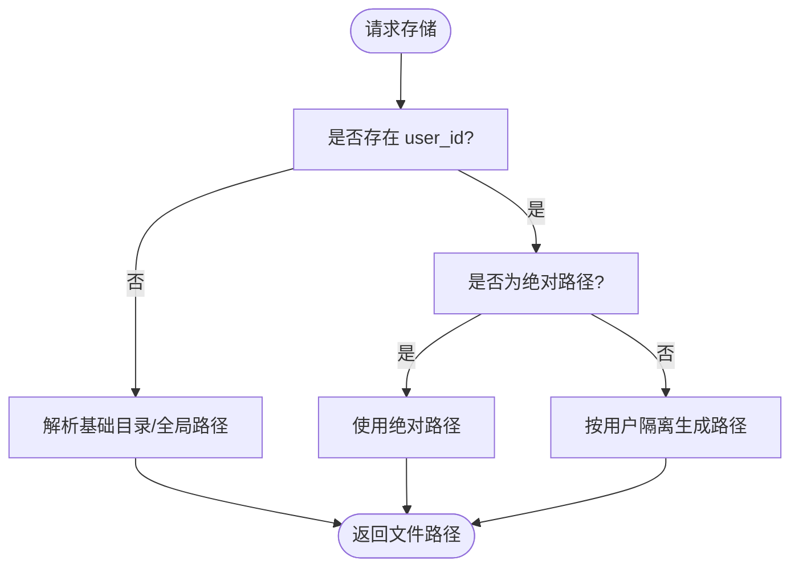
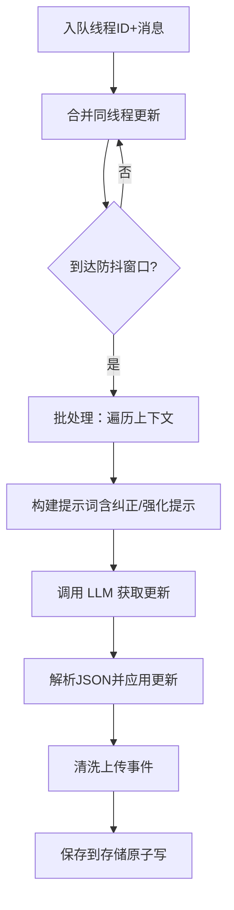
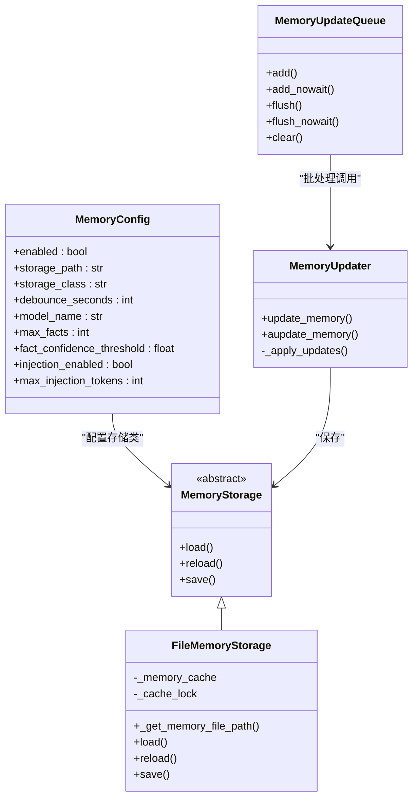

# 记忆设置

<cite>
**本文引用的文件**
- [memory_config.py](file://backend/packages/harness/deerflow/config/memory_config.py)
- [storage.py](file://backend/packages/harness/deerflow/agents/memory/storage.py)
- [updater.py](file://backend/packages/harness/deerflow/agents/memory/updater.py)
- [queue.py](file://backend/packages/harness/deerflow/agents/memory/queue.py)
- [prompt.py](file://backend/packages/harness/deerflow/agents/memory/prompt.py)
- [message_processing.py](file://backend/packages/harness/deerflow/agents/memory/message_processing.py)
- [summarization_hook.py](file://backend/packages/harness/deerflow/agents/memory/summarization_hook.py)
- [memory_middleware.py](file://backend/packages/harness/deerflow/agents/middlewares/memory_middleware.py)
- [memory.py（网关路由）](file://backend/app/gateway/routers/memory.py)
- [memory-settings-sample.json](file://backend/docs/memory-settings-sample.json)
- [MEMORY_IMPROVEMENTS.md](file://backend/docs/MEMORY_IMPROVEMENTS.md)
- [MEMORY_SETTINGS_REVIEW.md](file://backend/docs/MEMORY_SETTINGS_REVIEW.md)
- [test_memory_storage.py](file://backend/tests/test_memory_storage.py)
- [test_memory_queue.py](file://backend/tests/test_memory_queue.py)
</cite>

## 目录
1. [简介](#简介)
2. [项目结构](#项目结构)
3. [核心组件](#核心组件)
4. [架构总览](#架构总览)
5. [详细组件分析](#详细组件分析)
6. [依赖关系分析](#依赖关系分析)
7. [性能考量](#性能考量)
8. [故障排查指南](#故障排查指南)
9. [结论](#结论)
10. [附录](#附录)

## 简介
本文件面向 DeerFlow 的“记忆设置”能力，系统化阐述记忆策略配置、上下文长度限制、存储位置选择与清理规则等核心设置项；详解记忆数据的管理机制（增量更新、批量删除、数据迁移）；并给出性能影响与优化建议、调试与监控方法。内容基于后端实现与官方文档，帮助开发者与运维人员快速理解与使用记忆功能。

## 项目结构
记忆子系统围绕“配置—存储—队列—更新器—提示词—中间件/钩子—网关 API”的链路组织，形成从对话到持久化的闭环。下图展示与记忆设置直接相关的模块与文件：

```mermaid
graph TB
subgraph "配置层"
CFG["memory_config.py<br/>全局记忆配置"]
end
subgraph "存储层"
ST["storage.py<br/>MemoryStorage/FileMemoryStorage"]
end
subgraph "处理层"
Q["queue.py<br/>MemoryUpdateQueue"]
U["updater.py<br/>MemoryUpdater"]
P["prompt.py<br/>格式化/注入/计数"]
MP["message_processing.py<br/>信号检测/消息过滤"]
end
subgraph "集成层"
MW["memory_middleware.py<br/>LangGraph 中间件"]
SH["summarization_hook.py<br/>摘要前钩子"]
end
subgraph "接口层"
API["memory.py网关路由<br/>GET/POST/DELETE/PATCH 等"]
end
CFG --> ST
CFG --> Q
CFG --> U
CFG --> P
ST <- --> U
MP --> Q
Q --> U
U --> ST
MW --> Q
SH --> Q
API --> U
API --> ST
```

图表来源
- [memory_config.py:6-84](file://backend/packages/harness/deerflow/config/memory_config.py#L6-L84)
- [storage.py:43-232](file://backend/packages/harness/deerflow/agents/memory/storage.py#L43-L232)
- [queue.py:28-278](file://backend/packages/harness/deerflow/agents/memory/queue.py#L28-L278)
- [updater.py:276-612](file://backend/packages/harness/deerflow/agents/memory/updater.py#L276-L612)
- [prompt.py:14-364](file://backend/packages/harness/deerflow/agents/memory/prompt.py#L14-L364)
- [message_processing.py:1-110](file://backend/packages/harness/deerflow/agents/memory/message_processing.py#L1-L110)
- [memory_middleware.py:28-111](file://backend/packages/harness/deerflow/agents/middlewares/memory_middleware.py#L28-L111)
- [summarization_hook.py:11-32](file://backend/packages/harness/deerflow/agents/memory/summarization_hook.py#L11-L32)
- [memory.py（网关路由）:1-357](file://backend/app/gateway/routers/memory.py#L1-L357)

章节来源
- [memory_config.py:6-84](file://backend/packages/harness/deerflow/config/memory_config.py#L6-L84)
- [storage.py:43-232](file://backend/packages/harness/deerflow/agents/memory/storage.py#L43-L232)
- [queue.py:28-278](file://backend/packages/harness/deerflow/agents/memory/queue.py#L28-L278)
- [updater.py:276-612](file://backend/packages/harness/deerflow/agents/memory/updater.py#L276-L612)
- [prompt.py:14-364](file://backend/packages/harness/deerflow/agents/memory/prompt.py#L14-L364)
- [memory_middleware.py:28-111](file://backend/packages/harness/deerflow/agents/middlewares/memory_middleware.py#L28-L111)
- [summarization_hook.py:11-32](file://backend/packages/harness/deerflow/agents/memory/summarization_hook.py#L11-L32)
- [memory.py（网关路由）:1-357](file://backend/app/gateway/routers/memory.py#L1-L357)

## 核心组件
- 全局记忆配置：定义启用开关、存储路径、存储类、防抖时长、模型名、最大事实数、事实置信度阈值、是否注入、最大注入 token 数等。
- 存储提供者：默认文件存储，支持缓存、并发安全、原子写入、路径解析（用户隔离/绝对路径）。
- 更新队列：带防抖的内存更新队列，合并同线程多次更新，异步批处理。
- 记忆更新器：基于 LLM 的增量更新，解析 JSON 输出，应用更新、裁剪事实、去除上传事件。
- 提示词与注入：结构化提示词，对话格式化，事实排序与注入，token 计数与预算控制。
- 信号检测与消息过滤：识别纠正/强化信号，过滤工具调用与上传块，仅保留有效对话片段。
- 中间件与钩子：在节点执行后或摘要前触发队列入队。
- 网关 API：提供查询、导入/导出、清空、增删改查事实、获取配置与状态等接口。

章节来源
- [memory_config.py:6-84](file://backend/packages/harness/deerflow/config/memory_config.py#L6-L84)
- [storage.py:43-232](file://backend/packages/harness/deerflow/agents/memory/storage.py#L43-L232)
- [queue.py:28-278](file://backend/packages/harness/deerflow/agents/memory/queue.py#L28-L278)
- [updater.py:276-612](file://backend/packages/harness/deerflow/agents/memory/updater.py#L276-L612)
- [prompt.py:14-364](file://backend/packages/harness/deerflow/agents/memory/prompt.py#L14-L364)
- [message_processing.py:1-110](file://backend/packages/harness/deerflow/agents/memory/message_processing.py#L1-L110)
- [memory_middleware.py:28-111](file://backend/packages/harness/deerflow/agents/middlewares/memory_middleware.py#L28-L111)
- [summarization_hook.py:11-32](file://backend/packages/harness/deerflow/agents/memory/summarization_hook.py#L11-L32)
- [memory.py（网关路由）:1-357](file://backend/app/gateway/routers/memory.py#L1-L357)

## 架构总览
记忆从对话到持久化的端到端流程如下：



图表来源
- [memory_middleware.py:52-111](file://backend/packages/harness/deerflow/agents/middlewares/memory_middleware.py#L52-L111)
- [summarization_hook.py:11-32](file://backend/packages/harness/deerflow/agents/memory/summarization_hook.py#L11-L32)
- [queue.py:156-205](file://backend/packages/harness/deerflow/agents/memory/queue.py#L156-L205)
- [updater.py:441-500](file://backend/packages/harness/deerflow/agents/memory/updater.py#L441-L500)
- [storage.py:160-189](file://backend/packages/harness/deerflow/agents/memory/storage.py#L160-L189)
- [memory.py（网关路由）:110-357](file://backend/app/gateway/routers/memory.py#L110-L357)

## 详细组件分析

### 记忆策略配置（MemoryConfig）
- 启用开关：决定是否启用记忆机制。
- 存储路径 storage_path：支持相对/绝对路径；相对路径按基础目录解析；留空则按用户隔离策略生成 per-user 文件；绝对路径可实现多用户共享同一文件。
- 存储类 storage_class：默认文件存储，可替换为自定义实现。
- 防抖时间 debounce_seconds：默认 30 秒，用于合并同线程多次更新。
- 模型名 model_name：用于记忆更新的 LLM 名称，None 表示使用默认模型。
- 最大事实数 max_facts：默认 100，超过上限按置信度降序保留。
- 事实置信度阈值 fact_confidence_threshold：默认 0.7，低于阈值的新事实不入库。
- 注入开关 injection_enabled：是否将记忆注入系统提示词。
- 最大注入 token 数 max_injection_tokens：默认 2000，用于控制注入长度。

章节来源
- [memory_config.py:6-84](file://backend/packages/harness/deerflow/config/memory_config.py#L6-L84)

### 存储位置选择与隔离（FileMemoryStorage）
- 路径解析规则：
  - 用户隔离：当提供 user_id 且未指定绝对路径时，按用户 ID 生成 per-user 文件。
  - 绝对路径：直接使用配置的绝对路径，所有用户共享同一文件。
  - 相对路径：相对于基础目录解析，避免工作目录差异。
- 缓存与并发：
  - 内存缓存 + 文件修改时间校验，避免重复 IO。
  - 线程锁保护缓存访问，保证并发安全。
- 原子写入：
  - 先写临时文件，再原子替换，失败不污染缓存。
- 容错回退：
  - 配置的存储类加载失败时自动回退到文件存储。



图表来源
- [storage.py:84-102](file://backend/packages/harness/deerflow/agents/memory/storage.py#L84-L102)

章节来源
- [storage.py:43-232](file://backend/packages/harness/deerflow/agents/memory/storage.py#L43-L232)
- [test_memory_storage.py:44-291](file://backend/tests/test_memory_storage.py#L44-L291)

### 上下文长度限制与注入（format_memory_for_injection）
- 结构化注入：用户上下文、历史、事实三段式。
- 事实排序：按置信度降序，优先保留高价值信息。
- Token 预算：使用 tiktoken 计数，不足时逐步截断，确保不超过 max_injection_tokens。
- 多语言保留：技术术语与专有名词保持原文。

章节来源
- [prompt.py:201-318](file://backend/packages/harness/deerflow/agents/memory/prompt.py#L201-L318)
- [MEMORY_IMPROVEMENTS.md:1-66](file://backend/docs/MEMORY_IMPROVEMENTS.md#L1-L66)

### 清理规则与事实管理
- 删除单个事实：按 id 删除，不存在则 404。
- 批量删除：通过 API 清空全部；或在更新器中移除指定 id 列表。
- 导入/导出：支持 JSON 导入覆盖与导出备份。
- 数据迁移：加载器会在覆盖前自动创建带时间戳的备份文件，便于回滚。

章节来源
- [memory.py（网关路由）:175-290](file://backend/app/gateway/routers/memory.py#L175-L290)
- [MEMORY_SETTINGS_REVIEW.md:58-64](file://backend/docs/MEMORY_SETTINGS_REVIEW.md#L58-L64)

### 增量更新机制（MemoryUpdater + MemoryUpdateQueue）
- 队列合并：同线程多次更新合并，保留纠正/强化信号的最大值。
- 防抖批处理：debounce_seconds 到期后统一处理，降低 LLM 调用频率。
- LLM 更新：解析 JSON 输出，更新用户/历史段落，新增满足阈值的事实，移除矛盾事实，按置信度裁剪至上限。
- 上传事件清洗：去除关于上传事件的总结与事实，避免未来会话出现无效引用。



图表来源
- [queue.py:156-205](file://backend/packages/harness/deerflow/agents/memory/queue.py#L156-L205)
- [updater.py:369-500](file://backend/packages/harness/deerflow/agents/memory/updater.py#L369-L500)
- [prompt.py:14-132](file://backend/packages/harness/deerflow/agents/memory/prompt.py#L14-L132)

章节来源
- [queue.py:28-278](file://backend/packages/harness/deerflow/agents/memory/queue.py#L28-L278)
- [updater.py:276-612](file://backend/packages/harness/deerflow/agents/memory/updater.py#L276-L612)
- [message_processing.py:1-110](file://backend/packages/harness/deerflow/agents/memory/message_processing.py#L1-L110)

### 集成点（中间件与钩子）
- MemoryMiddleware：在节点执行后，过滤有效消息，检测纠正/强化信号，将对话入队。
- SummarizationHook：在摘要前再次入队，确保即将被清理的消息也能被记忆化。
- 两者均支持 per-agent 与 per-user 隔离，并在跨线程场景下携带 user_id。

章节来源
- [memory_middleware.py:28-111](file://backend/packages/harness/deerflow/agents/middlewares/memory_middleware.py#L28-L111)
- [summarization_hook.py:11-32](file://backend/packages/harness/deerflow/agents/memory/summarization_hook.py#L11-L32)

### 网关 API（管理与查询）
- GET /api/memory：获取当前记忆数据。
- POST /api/memory/reload：强制从文件重载，刷新缓存。
- DELETE /api/memory：清空所有记忆。
- POST /api/memory/facts：新增事实。
- DELETE /api/memory/facts/{fact_id}：删除事实。
- PATCH /api/memory/facts/{fact_id}：部分更新事实。
- GET /api/memory/export：导出记忆。
- POST /api/memory/import：导入记忆。
- GET /api/memory/config：获取配置。
- GET /api/memory/status：同时返回配置与数据。

章节来源
- [memory.py（网关路由）:1-357](file://backend/app/gateway/routers/memory.py#L1-L357)

## 依赖关系分析
- 配置驱动：所有行为由 MemoryConfig 控制，包括存储类、防抖、注入预算、事实阈值等。
- 存储抽象：MemoryStorage 抽象 + FileMemoryStorage 实现，便于替换为数据库/对象存储等。
- 更新链路：中间件/钩子 → 队列 → 更新器 → 存储，解耦了 IO 与计算。
- 提示词与注入：prompt.py 提供结构化模板与注入逻辑，受 max_injection_tokens 限制。
- 测试覆盖：存储层与队列层均有并发与边界条件测试，保障稳定性。



图表来源
- [memory_config.py:6-84](file://backend/packages/harness/deerflow/config/memory_config.py#L6-L84)
- [storage.py:43-232](file://backend/packages/harness/deerflow/agents/memory/storage.py#L43-L232)
- [queue.py:28-278](file://backend/packages/harness/deerflow/agents/memory/queue.py#L28-L278)
- [updater.py:276-612](file://backend/packages/harness/deerflow/agents/memory/updater.py#L276-L612)

章节来源
- [memory_config.py:6-84](file://backend/packages/harness/deerflow/config/memory_config.py#L6-L84)
- [storage.py:43-232](file://backend/packages/harness/deerflow/agents/memory/storage.py#L43-L232)
- [queue.py:28-278](file://backend/packages/harness/deerflow/agents/memory/queue.py#L28-L278)
- [updater.py:276-612](file://backend/packages/harness/deerflow/agents/memory/updater.py#L276-L612)

## 性能考量
- 防抖与批处理：合理设置 debounce_seconds 可显著减少 LLM 调用次数，建议根据业务吞吐与延迟目标调整。
- 注入预算：max_injection_tokens 控制提示词大小，避免超长导致推理开销上升；结合 tiktoken 精确计数。
- 缓存与原子写：文件存储具备缓存与原子写入，减少磁盘争用；在高并发场景下建议使用 SSD 或本地高性能存储。
- 线程池与同步调用：更新器在异步上下文中通过线程池执行同步 LLM 调用，避免事件循环冲突；注意线程池大小与资源限制。
- 事实上限与置信度：max_facts 与阈值控制存储体积与质量，建议定期评估与调整以平衡召回与成本。

## 故障排查指南
- 存储类加载失败：检查 storage_class 是否存在且继承自 MemoryStorage；若异常将自动回退到文件存储。
- 路径解析问题：确认 storage_path 是绝对路径还是相对路径；相对路径需确保基础目录可写。
- 并发写入异常：观察保存失败日志；文件存储具备原子写入，失败不会污染缓存。
- 队列阻塞：flush_nowait 可立即触发处理；若仍阻塞，检查线程池与外部 LLM 调用耗时。
- 注入过长：适当降低 max_injection_tokens 或减少事实数量；必要时精简事实内容。
- 信号误判：纠正/强化信号检测基于正则模式，若误报可调整 message_processing 中的模式集合。

章节来源
- [storage.py:196-232](file://backend/packages/harness/deerflow/agents/memory/storage.py#L196-L232)
- [queue.py:206-236](file://backend/packages/harness/deerflow/agents/memory/queue.py#L206-L236)
- [test_memory_storage.py:226-291](file://backend/tests/test_memory_storage.py#L226-L291)
- [test_memory_queue.py:98-167](file://backend/tests/test_memory_queue.py#L98-L167)

## 结论
记忆设置通过“配置—存储—队列—更新—注入—接口”的完整链路，实现了对用户上下文与事实的持续学习与稳定注入。合理的配置参数（如防抖、事实上限、注入预算）与存储路径策略（用户隔离/共享）是保障性能与可用性的关键。配合完善的 API 与测试覆盖，记忆系统既易于扩展又便于维护。

## 附录

### 记忆数据结构参考
- 版本号 version：字符串，当前为 1.0。
- 最近更新时间 lastUpdated：ISO-8601 字符串。
- 用户上下文 user：包含 workContext、personalContext、topOfMind 三个段落，每段含 summary 与 updatedAt。
- 历史上下文 history：包含 recentMonths、earlierContext、longTermBackground 三个段落，每段含 summary 与 updatedAt。
- 事实 facts：数组，每个元素包含 id、content、category、confidence、createdAt、source、可选 sourceError。

章节来源
- [memory-settings-sample.json:1-115](file://backend/docs/memory-settings-sample.json#L1-L115)

### 配置项速查
- enabled：是否启用记忆。
- storage_path：存储路径（相对/绝对），留空按用户隔离策略生成。
- storage_class：存储类全限定名，默认文件存储。
- debounce_seconds：防抖秒数（1–300）。
- model_name：用于记忆更新的模型名称。
- max_facts：最大事实数（10–500）。
- fact_confidence_threshold：事实置信度阈值（0.0–1.0）。
- injection_enabled：是否注入记忆。
- max_injection_tokens：注入最大 token 数（100–8000）。

章节来源
- [memory_config.py:6-84](file://backend/packages/harness/deerflow/config/memory_config.py#L6-L84)