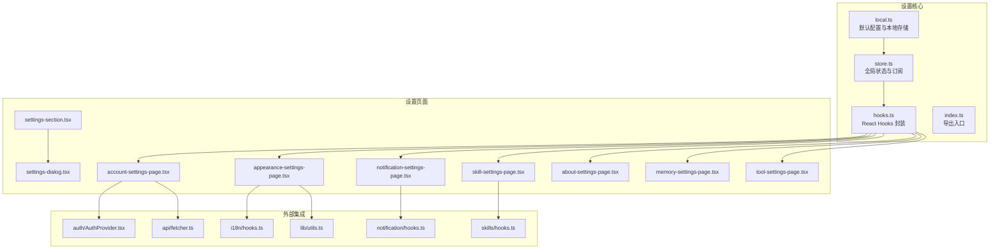
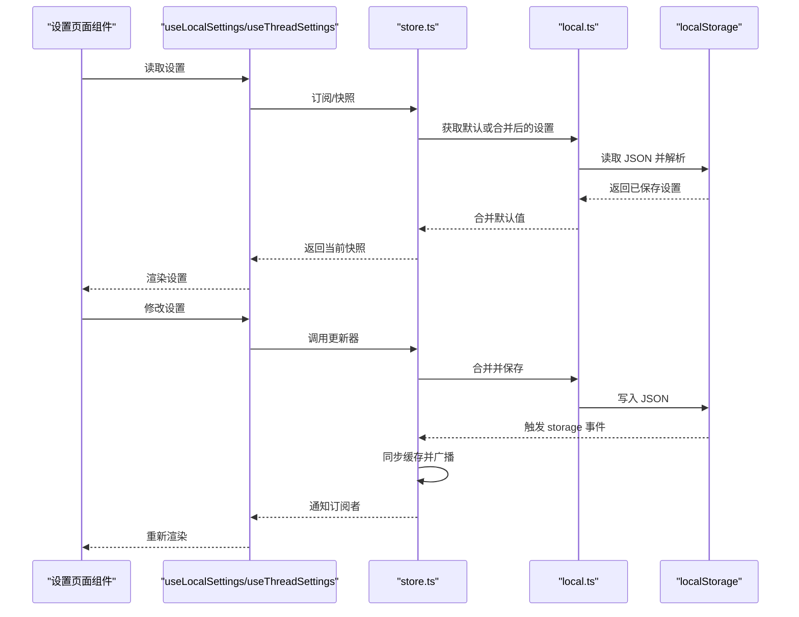
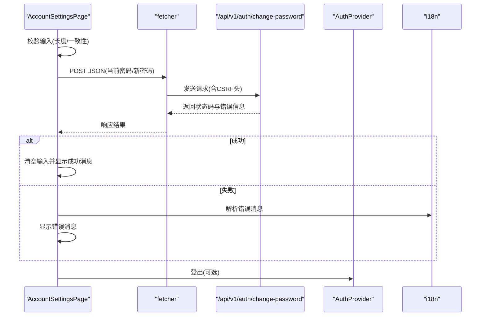
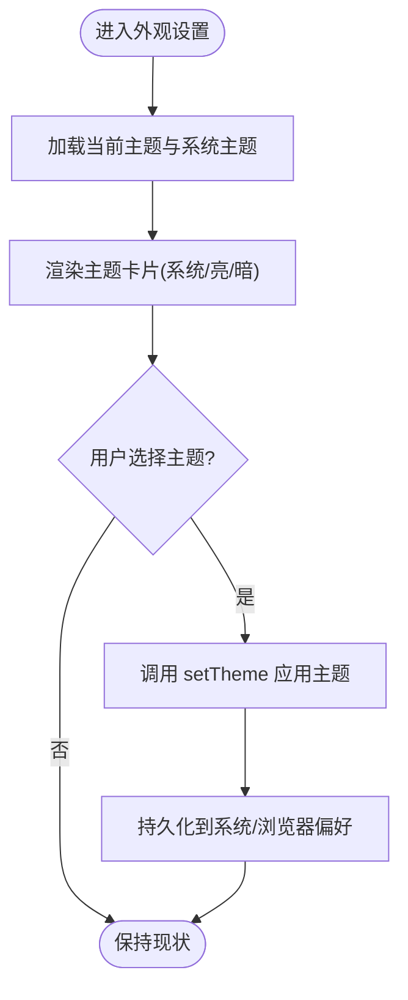
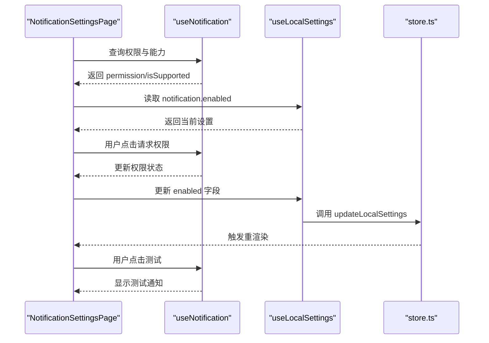
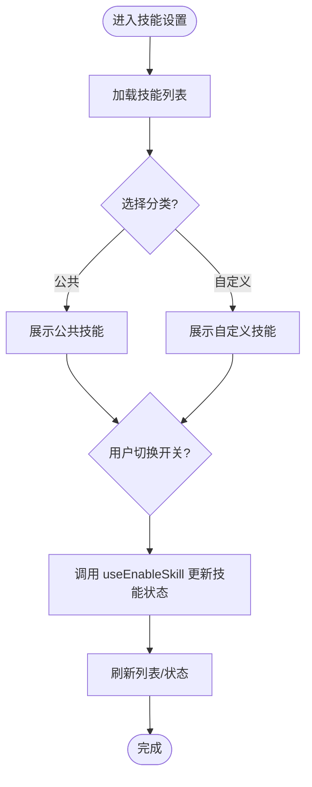
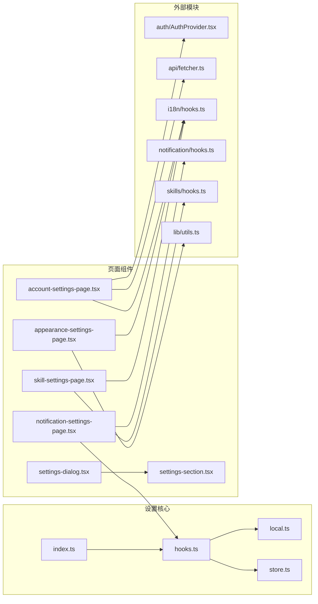

# 设置与配置界面

<cite>
**本文档引用的文件**
- [frontend/src/core/settings/local.ts](file://frontend/src/core/settings/local.ts)
- [frontend/src/core/settings/store.ts](file://frontend/src/core/settings/store.ts)
- [frontend/src/core/settings/hooks.ts](file://frontend/src/core/settings/hooks.ts)
- [frontend/src/core/settings/index.ts](file://frontend/src/core/settings/index.ts)
- [frontend/src/components/workspace/settings/account-settings-page.tsx](file://frontend/src/components/workspace/settings/account-settings-page.tsx)
- [frontend/src/components/workspace/settings/appearance-settings-page.tsx](file://frontend/src/components/workspace/settings/appearance-settings-page.tsx)
- [frontend/src/components/workspace/settings/notification-settings-page.tsx](file://frontend/src/components/workspace/settings/notification-settings-page.tsx)
- [frontend/src/components/workspace/settings/skill-settings-page.tsx](file://frontend/src/components/workspace/settings/skill-settings-page.tsx)
- [frontend/src/components/workspace/settings/settings-section.tsx](file://frontend/src/components/workspace/settings/settings-section.tsx)
- [frontend/src/components/workspace/settings/settings-dialog.tsx](file://frontend/src/components/workspace/settings/settings-dialog.tsx)
- [frontend/src/components/workspace/settings/about-settings-page.tsx](file://frontend/src/components/workspace/settings/about-settings-page.tsx)
- [frontend/src/components/workspace/settings/memory-settings-page.tsx](file://frontend/src/components/workspace/settings/memory-settings-page.tsx)
- [frontend/src/components/workspace/settings/tool-settings-page.tsx](file://frontend/src/components/workspace/settings/tool-settings-page.tsx)
- [frontend/src/core/notification/hooks.ts](file://frontend/src/core/notification/hooks.ts)
- [frontend/src/core/skills/hooks.ts](file://frontend/src/core/skills/hooks.ts)
- [frontend/src/core/auth/AuthProvider.tsx](file://frontend/src/core/auth/AuthProvider.tsx)
- [frontend/src/core/api/fetcher.ts](file://frontend/src/core/api/fetcher.ts)
- [frontend/src/core/i18n/hooks.ts](file://frontend/src/core/i18n/hooks.ts)
- [frontend/src/lib/utils.ts](file://frontend/src/lib/utils.ts)
</cite>

## 目录
1. [简介](#简介)
2. [项目结构](#项目结构)
3. [核心组件](#核心组件)
4. [架构总览](#架构总览)
5. [详细组件分析](#详细组件分析)
6. [依赖关系分析](#依赖关系分析)
7. [性能考虑](#性能考虑)
8. [故障排除指南](#故障排除指南)
9. [结论](#结论)
10. [附录](#附录)

## 简介
本文件为 DeerFlow 的设置与配置界面提供全面技术文档，涵盖设置页面的组织结构（账户设置、外观设置、通知设置、技能配置等）、配置数据管理机制（本地存储、跨标签页同步、配置验证）、表单处理与实时预览、以及扩展与自定义配置的实现方法。目标是帮助开发者快速理解并维护设置系统，同时为非技术用户提供清晰的使用指导。

## 项目结构
设置与配置界面主要位于前端工程的以下路径：
- 核心状态与存储：frontend/src/core/settings
- 设置页面组件：frontend/src/components/workspace/settings
- 通知与技能等外部集成：frontend/src/core/notification、frontend/src/core/skills
- 认证与国际化：frontend/src/core/auth、frontend/src/core/i18n
- 工具函数：frontend/src/lib/utils.ts

图表来源
- [frontend/src/core/settings/local.ts:1-129](file://frontend/src/core/settings/local.ts#L1-L129)
- [frontend/src/core/settings/store.ts:1-151](file://frontend/src/core/settings/store.ts#L1-L151)
- [frontend/src/core/settings/hooks.ts:1-60](file://frontend/src/core/settings/hooks.ts#L1-L60)
- [frontend/src/components/workspace/settings/account-settings-page.tsx:1-142](file://frontend/src/components/workspace/settings/account-settings-page.tsx#L1-L142)
- [frontend/src/components/workspace/settings/appearance-settings-page.tsx:1-197](file://frontend/src/components/workspace/settings/appearance-settings-page.tsx#L1-L197)
- [frontend/src/components/workspace/settings/notification-settings-page.tsx:1-93](file://frontend/src/components/workspace/settings/notification-settings-page.tsx#L1-L93)
- [frontend/src/components/workspace/settings/skill-settings-page.tsx:1-136](file://frontend/src/components/workspace/settings/skill-settings-page.tsx#L1-L136)

章节来源
- [frontend/src/core/settings/local.ts:1-129](file://frontend/src/core/settings/local.ts#L1-L129)
- [frontend/src/core/settings/store.ts:1-151](file://frontend/src/core/settings/store.ts#L1-L151)
- [frontend/src/core/settings/hooks.ts:1-60](file://frontend/src/core/settings/hooks.ts#L1-L60)

## 核心组件
本节深入解析设置系统的三大核心层：配置模型与默认值、全局状态与订阅、React Hooks 封装。

- 配置模型与默认值（local.ts）
  - 定义 LocalSettings 结构与默认值 DEFAULT_LOCAL_SETTINGS，包含通知、令牌用量、上下文等字段。
  - 提供 getLocalSettings/saveLocalSettings 持久化读写，支持合并用户配置与默认值。
  - 提供线程级模型覆盖：getThreadModelName/saveThreadModelName/applyThreadModelOverride。
  - 关键点：类型安全、默认值合并、线程模型覆盖。

- 全局状态与订阅（store.ts）
  - 维护 baseSettings、threadModelNames 缓存与订阅者集合 listeners。
  - 处理 localStorage 变更事件，自动同步到内存快照，触发订阅回调。
  - 提供 updateLocalSettings/updateThreadSettings 更新器，确保变更持久化并广播。

- React Hooks 封装（hooks.ts）
  - useLocalSettings/useThreadSettings 基于 useSyncExternalStore 订阅全局状态。
  - useThreadSettings 将线程模型覆盖应用到基础设置，形成最终渲染配置。

章节来源
- [frontend/src/core/settings/local.ts:4-129](file://frontend/src/core/settings/local.ts#L4-L129)
- [frontend/src/core/settings/store.ts:22-151](file://frontend/src/core/settings/store.ts#L22-L151)
- [frontend/src/core/settings/hooks.ts:17-59](file://frontend/src/core/settings/hooks.ts#L17-L59)

## 架构总览
设置系统采用“配置模型 → 全局状态 → React Hooks”的分层设计，结合浏览器本地存储与 storage 事件实现跨标签页同步。

图表来源
- [frontend/src/core/settings/hooks.ts:17-59](file://frontend/src/core/settings/hooks.ts#L17-L59)
- [frontend/src/core/settings/store.ts:118-150](file://frontend/src/core/settings/store.ts#L118-L150)
- [frontend/src/core/settings/local.ts:109-128](file://frontend/src/core/settings/local.ts#L109-L128)

## 详细组件分析

### 账户设置页面（AccountSettingsPage）
- 功能概述
  - 展示用户邮箱与角色信息。
  - 提供修改密码表单，包含输入校验（长度、一致性）与错误提示。
  - 支持登出操作。
- 数据流与集成
  - 使用 useAuth 获取用户信息与登出能力。
  - 使用 fetcher 发起 /api/v1/auth/change-password 请求，携带 CSRF 头。
  - 国际化通过 useI18n 提供文案。
- 表单处理与验证
  - 前端校验：新密码长度不少于 8，两次输入一致。
  - 后端校验：响应非 OK 时解析认证错误并展示。
- 实时预览
  - 修改成功后清空输入并显示成功消息；失败时显示错误消息。

图表来源
- [frontend/src/components/workspace/settings/account-settings-page.tsx:25-69](file://frontend/src/components/workspace/settings/account-settings-page.tsx#L25-L69)
- [frontend/src/core/api/fetcher.ts](file://frontend/src/core/api/fetcher.ts)
- [frontend/src/core/auth/AuthProvider.tsx](file://frontend/src/core/auth/AuthProvider.tsx)
- [frontend/src/core/i18n/hooks.ts](file://frontend/src/core/i18n/hooks.ts)

章节来源
- [frontend/src/components/workspace/settings/account-settings-page.tsx:1-142](file://frontend/src/components/workspace/settings/account-settings-page.tsx#L1-L142)

### 外观设置页面（AppearanceSettingsPage）
- 功能概述
  - 主题选择：系统/亮色/暗色三种模式，支持图标与描述预览。
  - 语言切换：基于 next-themes 与国际化 hooks。
- 实现要点
  - 使用 useTheme 控制主题，ThemePreviewCard 动态渲染不同主题卡片。
  - 语言选择通过 Select 组件与 changeLocale 切换。
  - 使用 cn 合并样式类名，提升可维护性。

图表来源
- [frontend/src/components/workspace/settings/appearance-settings-page.tsx:26-112](file://frontend/src/components/workspace/settings/appearance-settings-page.tsx#L26-L112)
- [frontend/src/lib/utils.ts](file://frontend/src/lib/utils.ts)

章节来源
- [frontend/src/components/workspace/settings/appearance-settings-page.tsx:1-197](file://frontend/src/components/workspace/settings/appearance-settings-page.tsx#L1-L197)

### 通知设置页面（NotificationSettingsPage）
- 功能概述
  - 检测浏览器通知支持情况与权限状态。
  - 请求权限、启用/禁用通知、发送测试通知。
- 数据流与集成
  - 使用 useNotification 获取 permission、requestPermission、showNotification。
  - 通过 useLocalSettings 读取/更新 notification.enabled。
  - 权限为 denied 时给出引导提示，granted 且启用时允许测试。

图表来源
- [frontend/src/components/workspace/settings/notification-settings-page.tsx:13-92](file://frontend/src/components/workspace/settings/notification-settings-page.tsx#L13-L92)
- [frontend/src/core/notification/hooks.ts](file://frontend/src/core/notification/hooks.ts)
- [frontend/src/core/settings/hooks.ts:17-29](file://frontend/src/core/settings/hooks.ts#L17-L29)

章节来源
- [frontend/src/components/workspace/settings/notification-settings-page.tsx:1-93](file://frontend/src/components/workspace/settings/notification-settings-page.tsx#L1-L93)

### 技能配置页面（SkillSettingsPage）
- 功能概述
  - 展示公共与自定义技能列表，支持启用/禁用。
  - 提供创建新技能入口（路由跳转）。
  - 空状态时显示引导内容。
- 数据流与集成
  - 使用 useSkills 获取技能列表，useEnableSkill 执行启用/禁用。
  - 过滤器按 category(public/custom) 分类展示。
  - 在静态网站模式下禁用开关以避免不可用操作。

图表来源
- [frontend/src/components/workspace/settings/skill-settings-page.tsx:32-136](file://frontend/src/components/workspace/settings/skill-settings-page.tsx#L32-L136)
- [frontend/src/core/skills/hooks.ts](file://frontend/src/core/skills/hooks.ts)

章节来源
- [frontend/src/components/workspace/settings/skill-settings-page.tsx:1-136](file://frontend/src/components/workspace/settings/skill-settings-page.tsx#L1-L136)

### 设置对话框与分节组件
- SettingsDialog
  - 作为设置页面的容器，承载多个设置分节。
- SettingsSection
  - 提供统一的标题、描述与内容布局，保证页面风格一致。

章节来源
- [frontend/src/components/workspace/settings/settings-dialog.tsx](file://frontend/src/components/workspace/settings/settings-dialog.tsx)
- [frontend/src/components/workspace/settings/settings-section.tsx](file://frontend/src/components/workspace/settings/settings-section.tsx)

### 其他设置页面（概览）
- 关于设置页面（AboutSettingsPage）
  - 展示版本信息、构建时间、许可证等。
- 内存设置页面（MemorySettingsPage）
  - 管理记忆相关配置（如记忆队列、持久化策略等）。
- 工具设置页面（ToolSettingsPage）
  - 管理工具与插件的启用/禁用与参数配置。

章节来源
- [frontend/src/components/workspace/settings/about-settings-page.tsx](file://frontend/src/components/workspace/settings/about-settings-page.tsx)
- [frontend/src/components/workspace/settings/memory-settings-page.tsx](file://frontend/src/components/workspace/settings/memory-settings-page.tsx)
- [frontend/src/components/workspace/settings/tool-settings-page.tsx](file://frontend/src/components/workspace/settings/tool-settings-page.tsx)

## 依赖关系分析
设置系统的关键依赖关系如下：

图表来源
- [frontend/src/core/settings/local.ts:1-129](file://frontend/src/core/settings/local.ts#L1-L129)
- [frontend/src/core/settings/store.ts:1-151](file://frontend/src/core/settings/store.ts#L1-L151)
- [frontend/src/core/settings/hooks.ts:1-60](file://frontend/src/core/settings/hooks.ts#L1-L60)
- [frontend/src/components/workspace/settings/account-settings-page.tsx:1-142](file://frontend/src/components/workspace/settings/account-settings-page.tsx#L1-L142)
- [frontend/src/components/workspace/settings/appearance-settings-page.tsx:1-197](file://frontend/src/components/workspace/settings/appearance-settings-page.tsx#L1-L197)
- [frontend/src/components/workspace/settings/notification-settings-page.tsx:1-93](file://frontend/src/components/workspace/settings/notification-settings-page.tsx#L1-L93)
- [frontend/src/components/workspace/settings/skill-settings-page.tsx:1-136](file://frontend/src/components/workspace/settings/skill-settings-page.tsx#L1-L136)

章节来源
- [frontend/src/core/settings/index.ts:1-3](file://frontend/src/core/settings/index.ts#L1-L3)

## 性能考虑
- 存储与同步
  - 使用 localStorage 与 storage 事件实现跨标签页同步，避免重复读写。
  - 仅在必要时合并默认值与用户配置，减少计算开销。
- 渲染优化
  - useSyncExternalStore 仅在订阅的数据变化时触发重渲染。
  - 线程模型覆盖通过 useMemo 缓存，避免不必要的对象重建。
- 网络请求
  - 密码修改等敏感操作需进行前端校验，减少无效请求。
  - 通知权限与测试通知仅在需要时发起，避免频繁调用。

## 故障排除指南
- 本地存储异常
  - 症状：设置无法保存或丢失。
  - 排查：检查浏览器是否禁用 localStorage；确认 JSON 解析是否抛错；验证 KEY 前缀是否正确。
  - 处理：回退到默认配置；清理异常条目；在沙箱环境模拟存储行为。
  
- 跨标签页不同步
  - 症状：一个标签页修改设置后，另一个标签页未更新。
  - 排查：确认 storage 事件监听是否注册；检查事件 key 是否匹配；确认同源策略。
  - 处理：强制刷新页面；在页面可见性变化时重新加载快照。
  
- 通知权限问题
  - 症状：无法请求权限或无法发送测试通知。
  - 排查：确认浏览器支持 Web Notifications；检查 HTTPS 环境；查看权限状态。
  - 处理：引导用户在浏览器设置中开启通知；提供拒绝后的提示与指引。
  
- 技能启用/禁用失败
  - 症状：切换开关无反应或报错。
  - 排查：确认 useEnableSkill 的 mutation 是否成功；检查网络与权限；确认静态网站模式限制。
  - 处理：重试操作；检查服务端日志；在非静态模式下尝试。

章节来源
- [frontend/src/core/settings/local.ts:109-128](file://frontend/src/core/settings/local.ts#L109-L128)
- [frontend/src/core/settings/store.ts:64-91](file://frontend/src/core/settings/store.ts#L64-L91)
- [frontend/src/components/workspace/settings/notification-settings-page.tsx:36-47](file://frontend/src/components/workspace/settings/notification-settings-page.tsx#L36-L47)
- [frontend/src/components/workspace/settings/skill-settings-page.tsx:104-108](file://frontend/src/components/workspace/settings/skill-settings-page.tsx#L104-L108)

## 结论
DeerFlow 的设置与配置界面通过清晰的分层设计实现了本地存储、跨标签页同步与实时预览。核心在于：
- 类型安全的配置模型与默认值合并；
- 基于 storage 事件的全局状态同步；
- React Hooks 对外暴露简洁的读写接口；
- 页面组件专注于交互与业务逻辑。

该体系易于扩展：新增设置项只需在配置模型中声明、在页面组件中渲染，并通过 Hooks 完成读写；若需远程同步，可在 store 层接入后端 API，保持现有订阅与渲染机制不变。

## 附录

### 配置数据管理机制
- 本地存储
  - 使用 localStorage 保存 JSON 字符串，KEY 包括全局设置与线程模型覆盖。
  - 解析失败时回退到默认值，保证健壮性。
- 跨标签页同步
  - 通过 window.addEventListener("storage") 监听其他标签页的变更，自动更新内存快照并广播。
- 配置验证
  - 前端：输入长度、格式与一致性校验。
  - 后端：API 返回错误时解析并展示用户可读消息。

章节来源
- [frontend/src/core/settings/local.ts:19-20](file://frontend/src/core/settings/local.ts#L19-L20)
- [frontend/src/core/settings/store.ts:41-48](file://frontend/src/core/settings/store.ts#L41-L48)
- [frontend/src/core/settings/store.ts:64-91](file://frontend/src/core/settings/store.ts#L64-L91)

### 表单处理、实时预览与批量操作
- 表单处理
  - 账户设置：前端校验 + 后端 API 调用，错误解析与提示。
  - 外观设置：主题与语言即时生效，无需提交。
  - 通知设置：权限请求与测试通知，状态驱动 UI。
- 实时预览
  - useSyncExternalStore 订阅全局设置，变更即刻渲染。
  - 线程模型覆盖：useThreadSettings 将线程模型注入基础设置，形成最终视图。
- 批量操作
  - 技能启用/禁用：通过 useEnableSkill 批量更新状态，配合过滤器与空状态处理。

章节来源
- [frontend/src/components/workspace/settings/account-settings-page.tsx:25-69](file://frontend/src/components/workspace/settings/account-settings-page.tsx#L25-L69)
- [frontend/src/components/workspace/settings/appearance-settings-page.tsx:26-112](file://frontend/src/components/workspace/settings/appearance-settings-page.tsx#L26-L112)
- [frontend/src/components/workspace/settings/notification-settings-page.tsx:20-34](file://frontend/src/components/workspace/settings/notification-settings-page.tsx#L20-L34)
- [frontend/src/components/workspace/settings/skill-settings-page.tsx:62-112](file://frontend/src/components/workspace/settings/skill-settings-page.tsx#L62-L112)
- [frontend/src/core/settings/hooks.ts:46-58](file://frontend/src/core/settings/hooks.ts#L46-L58)

### 扩展指南与自定义配置
- 新增设置项步骤
  - 在 local.ts 中扩展 LocalSettings 接口与 DEFAULT_LOCAL_SETTINGS。
  - 在 store.ts 中添加对应的更新器或订阅处理（如需跨标签页同步）。
  - 在页面组件中使用 useLocalSettings 或 useThreadSettings 读写。
  - 如需线程级覆盖，在 local.ts 中扩展 applyThreadModelOverride 的合并逻辑。
- 自定义配置选项
  - 通过 SettingsSection 统一布局，保持一致的用户体验。
  - 若涉及外部能力（如通知、技能），在对应 hooks 中封装调用与错误处理。
  - 对于需要远程同步的配置，建议在 store 层引入后端 API，保持现有订阅与渲染机制不变。

章节来源
- [frontend/src/core/settings/local.ts:26-47](file://frontend/src/core/settings/local.ts#L26-L47)
- [frontend/src/core/settings/store.ts:118-150](file://frontend/src/core/settings/store.ts#L118-L150)
- [frontend/src/components/workspace/settings/settings-section.tsx](file://frontend/src/components/workspace/settings/settings-section.tsx)